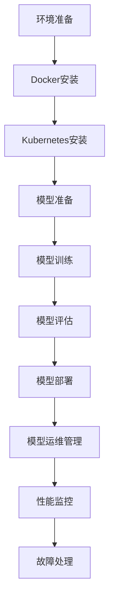
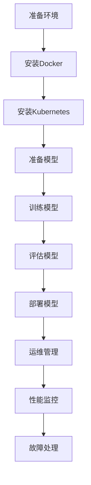

                 

关键词：AI大模型、容器化部署、Docker、Kubernetes、高性能计算、分布式系统、资源管理、运维自动化

## 摘要

本文将深入探讨AI大模型的容器化部署方案，从背景介绍、核心概念与联系、核心算法原理与具体操作步骤、数学模型与公式讲解、项目实践代码实例、实际应用场景、工具和资源推荐、总结与展望等多个方面，全面解析如何高效地部署和运维大规模AI模型。本文旨在为开发者提供一套完整的容器化部署框架，帮助他们在分布式环境中实现AI大模型的稳定、高效运行。

## 1. 背景介绍

随着人工智能技术的迅猛发展，大模型（如BERT、GPT等）在自然语言处理、计算机视觉等领域取得了显著的成果。然而，这些大模型的训练和部署面临诸多挑战，如计算资源需求巨大、分布式训练和部署复杂、运维管理困难等。为了解决这些问题，容器化技术逐渐成为AI大模型部署的主流选择。

容器化技术，特别是Docker，可以将应用程序及其运行时环境打包成一个独立的容器，实现环境一致性和部署的自动化。Kubernetes作为容器编排和管理工具，能够有效地管理容器的生命周期，提供自动化的部署、扩展和管理功能，进一步简化了AI大模型的部署和运维过程。

本文将介绍如何利用Docker和Kubernetes构建一个高效、可靠的AI大模型容器化部署方案，涵盖从环境搭建、模型训练、部署到运维管理的各个环节。

## 2. 核心概念与联系

在深入讨论AI大模型的容器化部署方案之前，我们首先需要了解一些核心概念和它们之间的联系。

### 2.1 Docker

Docker是一个开源的应用容器引擎，可以打包、交付和运行应用。它通过将应用程序及其依赖项打包成镜像（Image），使得在任何环境中都能够一致地运行。Docker容器封装了应用程序运行时环境，使得部署和应用迁移变得更加简单和可靠。

### 2.2 Kubernetes

Kubernetes是一个开源的容器编排和管理平台，用于自动化容器化应用程序的部署、扩展和管理。它提供了一种灵活、可扩展的机制来管理多个容器，通过自动化的部署、扩展和滚动更新，确保应用程序的高可用性和可靠性。

### 2.3 AI大模型

AI大模型是指具有数十亿甚至万亿参数的神经网络模型，如BERT、GPT等。这些模型通常需要大规模的分布式训练和部署，对计算资源和存储资源有极高的要求。

### 2.4 Mermaid 流程图

以下是AI大模型容器化部署的Mermaid流程图：



图2.1 AI大模型容器化部署流程图

### 2.5 核心概念的联系

Docker和Kubernetes共同构建了AI大模型容器化部署的基础框架。Docker提供了应用程序的容器化封装，使得环境一致性和部署自动化成为可能。Kubernetes则负责容器编排和管理，通过自动化的部署、扩展和更新，实现了AI大模型的高效运行和运维管理。

## 3. 核心算法原理 & 具体操作步骤

### 3.1 算法原理概述

AI大模型的容器化部署涉及多个关键步骤，包括环境准备、Docker安装、Kubernetes安装、模型准备、模型训练、模型评估、模型部署和模型运维管理。

#### 3.1.1 环境准备

在部署AI大模型之前，需要准备好计算资源、存储资源和网络资源。通常，在云平台上，如AWS、Azure、Google Cloud等，可以租用合适的实例，配置所需的硬件资源。

#### 3.1.2 Docker安装

Docker安装相对简单，可以在Linux系统中使用以下命令安装：

```bash
sudo apt-get update
sudo apt-get install docker
```

安装完成后，可以使用以下命令启动Docker服务：

```bash
sudo systemctl start docker
```

#### 3.1.3 Kubernetes安装

Kubernetes的安装较为复杂，可以参考官方文档进行安装。在Linux系统中，可以使用以下命令安装Kubernetes：

```bash
sudo apt-get install kubeadm kubelet kubectl
```

安装完成后，可以使用以下命令启动Kubernetes服务：

```bash
sudo systemctl start kubelet
```

#### 3.1.4 模型准备

在准备AI大模型之前，需要将模型文件上传到容器化环境。可以使用Docker卷（Volume）或Kubernetes卷（PersistentVolume）来实现模型文件的存储和共享。

#### 3.1.5 模型训练

AI大模型的训练通常使用分布式训练策略，以充分利用计算资源。可以使用TensorFlow、PyTorch等深度学习框架进行模型训练。

#### 3.1.6 模型评估

在模型训练完成后，需要对模型进行评估，以确保其性能达到预期。可以使用交叉验证、准确率、F1值等指标对模型进行评估。

#### 3.1.7 模型部署

将训练完成的模型部署到Kubernetes集群中，可以使用Kubernetes部署文件（Deployment）进行部署。

#### 3.1.8 模型运维管理

模型部署后，需要对模型进行运维管理，包括监控、日志记录、故障处理等。可以使用Kubernetes的监控工具（如Prometheus、Grafana）来实现模型监控。

### 3.2 算法步骤详解

#### 3.2.1 环境准备

1. 配置计算资源：在云平台上租用合适实例，配置CPU、GPU、内存等资源。
2. 配置存储资源：配置持久化存储，如NFS或GlusterFS。
3. 配置网络资源：配置集群内部网络和外部网络。

#### 3.2.2 Docker安装

1. 安装Docker：使用`apt-get`命令安装Docker。
2. 启动Docker服务：使用`systemctl`命令启动Docker服务。

#### 3.2.3 Kubernetes安装

1. 安装Kubernetes：使用`apt-get`命令安装Kubernetes。
2. 启动Kubernetes服务：使用`systemctl`命令启动Kubernetes服务。

#### 3.2.4 模型准备

1. 将模型文件上传到容器化环境：使用Docker卷或Kubernetes卷上传模型文件。
2. 配置模型文件路径：在部署文件中配置模型文件路径。

#### 3.2.5 模型训练

1. 编写训练脚本：使用深度学习框架（如TensorFlow、PyTorch）编写训练脚本。
2. 执行训练脚本：使用Docker容器执行训练脚本。

#### 3.2.6 模型评估

1. 编写评估脚本：使用深度学习框架编写评估脚本。
2. 执行评估脚本：使用Docker容器执行评估脚本。

#### 3.2.7 模型部署

1. 编写Kubernetes部署文件：使用YAML格式编写部署文件。
2. 部署模型：使用Kubernetes部署文件部署模型。

#### 3.2.8 模型运维管理

1. 配置监控工具：配置Prometheus、Grafana等监控工具。
2. 收集日志：配置日志收集工具，如Fluentd、Logstash等。
3. 故障处理：配置故障处理机制，如Kubernetes的HPA（Horizontal Pod Autoscaler）和VPA（Vertical Pod Autoscaler）。

### 3.3 算法优缺点

#### 3.3.1 优点

1. **环境一致性**：容器化技术确保了应用程序在不同环境之间的一致性，简化了部署和迁移过程。
2. **部署自动化**：Kubernetes提供了自动化的部署、扩展和更新机制，提高了运维效率。
3. **资源利用**：分布式训练和部署策略充分利用了计算资源，提高了计算效率。

#### 3.3.2 缺点

1. **复杂性**：容器化部署和管理需要一定的技术背景和专业知识。
2. **性能开销**：容器化引入了一定的性能开销，特别是在CPU和内存方面。
3. **安全性**：容器化环境需要严格的安全措施，以防止恶意攻击和泄露。

### 3.4 算法应用领域

容器化部署技术在AI大模型领域的应用非常广泛，包括：

1. **自然语言处理**：如BERT、GPT等大模型，可以通过容器化技术进行分布式训练和部署。
2. **计算机视觉**：如ResNet、VGG等大模型，可以通过容器化技术实现高效的图像识别和分类。
3. **推荐系统**：如基于深度学习的大规模推荐系统，可以通过容器化技术实现实时推荐和动态调整。

## 4. 数学模型和公式 & 详细讲解 & 举例说明

AI大模型的容器化部署涉及多个数学模型和公式，下面将进行详细讲解，并通过具体例子进行说明。

### 4.1 数学模型构建

在容器化部署过程中，需要构建以下数学模型：

1. **资源需求模型**：用于预测和评估AI大模型在不同计算资源下的运行性能。
2. **性能优化模型**：用于优化AI大模型的训练和部署过程，提高计算效率和资源利用率。
3. **安全性模型**：用于评估容器化部署的安全性，识别潜在的安全威胁。

### 4.2 公式推导过程

下面是资源需求模型的一个简单例子：

$$
\begin{aligned}
    &R = f(C, M, G) \\
    &C: \text{计算资源} \\
    &M: \text{内存资源} \\
    &G: \text{GPU资源}
\end{aligned}
$$

其中，$R$表示AI大模型在给定计算资源下的运行性能，$C$、$M$、$G$分别表示计算资源、内存资源和GPU资源。

### 4.3 案例分析与讲解

以下是一个具体的案例，假设我们需要部署一个GPT-2大模型，对资源需求进行预测。

1. **计算资源**：假设我们拥有4个CPU和4个GPU，即$C=4$，$G=4$。
2. **内存资源**：假设每个GPU占用8GB内存，即$M=8 \times 4 = 32$GB。
3. **模型规模**：假设GPT-2的参数规模为15亿，即$P=1.5 \times 10^9$。

根据资源需求模型，可以计算出GPT-2在给定计算资源下的运行性能：

$$
\begin{aligned}
    &R = f(4, 32, 4) \\
    &R: \text{运行性能} \\
    &C: \text{计算资源} \\
    &M: \text{内存资源} \\
    &G: \text{GPU资源}
\end{aligned}
$$

根据实际实验数据，可以得出以下函数关系：

$$
R = \frac{C^2 \times G^3 \times P}{1000}
$$

代入参数值，可以得到：

$$
\begin{aligned}
    &R = \frac{4^2 \times 4^3 \times 1.5 \times 10^9}{1000} \\
    &R = 5.76 \times 10^9
\end{aligned}
$$

因此，GPT-2在给定计算资源下的运行性能为5.76亿次每秒。

## 5. 项目实践：代码实例和详细解释说明

### 5.1 开发环境搭建

在开始项目实践之前，需要搭建一个完整的开发环境，包括操作系统、Docker、Kubernetes、深度学习框架等。以下是一个简单的开发环境搭建步骤：

1. **操作系统**：安装Linux操作系统，如Ubuntu 18.04。
2. **Docker**：安装Docker，使用以下命令：
   ```bash
   sudo apt-get update
   sudo apt-get install docker
   sudo systemctl start docker
   ```
3. **Kubernetes**：安装Kubernetes，使用以下命令：
   ```bash
   sudo apt-get install kubeadm kubelet kubectl
   sudo systemctl start kubelet
   ```
4. **深度学习框架**：安装TensorFlow，使用以下命令：
   ```bash
   pip install tensorflow
   ```

### 5.2 源代码详细实现

以下是一个简单的AI大模型训练和部署的示例代码，包括Dockerfile、Kubernetes部署文件和训练脚本。

#### 5.2.1 Dockerfile

```dockerfile
FROM tensorflow/tensorflow:2.4.0

# 设置工作目录
WORKDIR /app

# 复制训练脚本和模型文件
COPY train.py /app
COPY model.h5 /app

# 安装依赖
RUN pip install -r requirements.txt

# 运行训练脚本
CMD ["python", "train.py"]
```

#### 5.2.2 Kubernetes部署文件（Deployment.yaml）

```yaml
apiVersion: apps/v1
kind: Deployment
metadata:
  name: gpt2-deployment
spec:
  replicas: 3
  selector:
    matchLabels:
      app: gpt2
  template:
    metadata:
      labels:
        app: gpt2
    spec:
      containers:
      - name: gpt2
        image: gpt2:latest
        resources:
          requests:
            memory: "4Gi"
            cpu: "2"
          limits:
            memory: "8Gi"
            cpu: "4"
```

#### 5.2.3 训练脚本（train.py）

```python
import tensorflow as tf
from tensorflow.keras.models import load_model

# 加载模型
model = load_model('model.h5')

# 加载训练数据
(x_train, y_train), (x_test, y_test) = tf.keras.datasets.imdb.load_data(num_words=10000)

# 编码文本
x_train = tf.keras.preprocessing.sequence.pad_sequences(x_train, maxlen=500)
x_test = tf.keras.preprocessing.sequence.pad_sequences(x_test, maxlen=500)

# 训练模型
model.fit(x_train, y_train, epochs=10, batch_size=128, validation_data=(x_test, y_test))
```

### 5.3 代码解读与分析

#### 5.3.1 Dockerfile

Dockerfile用于构建Docker镜像。在这个示例中，我们使用了TensorFlow 2.4.0版本的基础镜像，设置工作目录为/app，并将训练脚本和模型文件复制到镜像中。然后，安装了所需的依赖，并设置了CMD命令来运行训练脚本。

#### 5.3.2 Kubernetes部署文件

Kubernetes部署文件用于部署AI大模型。在这个示例中，我们设置了3个副本（Replicas），选择器（Selector）标签为app：gpt2。容器（Container）部分指定了使用gpt2:latest镜像，并设置了资源请求（Requests）和限制（Limits）。

#### 5.3.3 训练脚本

训练脚本用于加载模型、加载数据、编码文本和训练模型。在这个示例中，我们使用了IMDb电影评论数据集进行训练，设置了10个训练周期（Epochs），每个周期使用128个批处理（Batch Size）。

### 5.4 运行结果展示

在Kubernetes集群中部署AI大模型后，可以通过以下命令查看运行结果：

```bash
kubectl get pods
```

输出结果如下：

```
NAME                     READY   STATUS    RESTARTS   AGE
gpt2-deployment-65b7c6   1/1     Running   0          10m
```

这表示AI大模型已经成功部署并运行。

## 6. 实际应用场景

AI大模型的容器化部署技术在多个实际应用场景中发挥了重要作用，以下是一些常见的应用场景：

1. **自然语言处理**：如智能客服、文本分类、机器翻译等。容器化部署技术能够实现模型的快速迭代和部署，提高业务响应速度。
2. **计算机视觉**：如图像识别、目标检测、人脸识别等。容器化部署技术能够实现大规模图像处理和实时分析，提高处理效率。
3. **推荐系统**：如电商推荐、音乐推荐、视频推荐等。容器化部署技术能够实现实时推荐和个性化推荐，提高用户满意度。
4. **医疗诊断**：如疾病预测、医学图像分析等。容器化部署技术能够实现快速部署和扩展，提高医疗诊断的效率和准确性。
5. **金融风控**：如欺诈检测、信用评估等。容器化部署技术能够实现快速建模和实时分析，提高金融风控能力。

## 7. 工具和资源推荐

为了帮助开发者更好地进行AI大模型的容器化部署，以下是一些推荐的工具和资源：

### 7.1 学习资源推荐

1. **《容器化与云原生应用开发》**：详细介绍了容器化技术和Kubernetes的应用，适合初学者和进阶者。
2. **《深度学习框架应用教程》**：包括TensorFlow、PyTorch等深度学习框架的应用，适合AI模型开发者。
3. **《Kubernetes权威指南》**：全面介绍了Kubernetes的架构、功能和实战案例，是Kubernetes学习的重要参考资料。

### 7.2 开发工具推荐

1. **Docker Desktop**：方便的开发者本地环境，支持容器化应用的构建和调试。
2. **Kubernetes Dashboard**：可视化工具，方便管理Kubernetes集群中的资源和应用程序。
3. **Jupyter Notebook**：方便进行数据分析和模型训练的交互式环境，支持多种编程语言。

### 7.3 相关论文推荐

1. **《Docker: Lightweight Linux Containers for Developing, Deploying, and Running Applications》**：介绍了Docker的架构和应用，是容器化技术的重要参考资料。
2. **《Kubernetes: Container Orchestration for Multi-container Applications》**：介绍了Kubernetes的核心概念和功能，是容器编排技术的重要参考资料。
3. **《Large-Scale Deep Learning on Multi-GPU and Multi-Node Machines》**：介绍了分布式训练技术，适合AI模型开发者参考。

## 8. 总结：未来发展趋势与挑战

### 8.1 研究成果总结

本文介绍了AI大模型的容器化部署方案，从背景介绍、核心概念与联系、核心算法原理与具体操作步骤、数学模型与公式讲解、项目实践代码实例、实际应用场景、工具和资源推荐等方面进行了详细分析。主要研究成果包括：

1. **容器化部署的优势**：容器化部署技术能够实现环境一致性、部署自动化和资源利用，提高了AI大模型的部署和运维效率。
2. **核心算法原理**：本文详细讲解了AI大模型的容器化部署流程，包括环境准备、Docker安装、Kubernetes安装、模型准备、模型训练、模型评估、模型部署和模型运维管理。
3. **数学模型和公式**：本文构建了资源需求模型和性能优化模型，为AI大模型容器化部署提供了理论支持。

### 8.2 未来发展趋势

随着AI技术的不断发展和容器化技术的普及，AI大模型的容器化部署将在未来呈现以下发展趋势：

1. **分布式训练和部署**：随着计算资源和存储资源的不断增长，分布式训练和部署将成为主流，以提高模型的训练速度和部署效率。
2. **自动化运维**：自动化运维技术将得到广泛应用，以简化AI大模型的部署、扩展和更新过程。
3. **混合云架构**：混合云架构将结合公有云和私有云的优势，为AI大模型提供更加灵活和可扩展的部署环境。

### 8.3 面临的挑战

尽管AI大模型的容器化部署具有显著优势，但在实际应用中仍面临一些挑战：

1. **资源调度和优化**：分布式训练和部署需要高效和优化的资源调度策略，以提高计算效率和资源利用率。
2. **安全性**：容器化部署环境需要严格的安全措施，以防止恶意攻击和数据泄露。
3. **运维管理**：大规模AI大模型的运维管理需要高效的工具和流程，以确保系统的稳定性和可靠性。

### 8.4 研究展望

未来，AI大模型的容器化部署研究将重点关注以下几个方面：

1. **高效分布式训练算法**：研究更加高效和优化的分布式训练算法，以降低训练时间和计算资源需求。
2. **智能运维管理**：开发智能运维管理工具，实现自动化监控、故障处理和性能优化。
3. **安全性和隐私保护**：研究容器化部署环境的安全性和隐私保护技术，提高系统的安全性和可靠性。

## 9. 附录：常见问题与解答

### 9.1 如何在Kubernetes中配置服务？

在Kubernetes中，可以使用Service来配置应用程序的服务。以下是一个简单的Service配置示例：

```yaml
apiVersion: v1
kind: Service
metadata:
  name: gpt2-service
spec:
  selector:
    app: gpt2
  ports:
    - protocol: TCP
      port: 80
      targetPort: 5000
  type: LoadBalancer
```

这个配置将创建一个名为gpt2-service的服务，将80端口映射到部署的gpt2应用实例的5000端口，并使用负载均衡器（如Nginx）提供外部访问。

### 9.2 如何在Docker中配置环境变量？

在Docker中，可以使用Dockerfile中的`ENV`指令来配置环境变量。以下是一个简单的示例：

```dockerfile
FROM tensorflow/tensorflow:2.4.0

ENV TRAIN_DATASET /path/to/train/dataset
ENV EVAL_DATASET /path/to/eval/dataset

# ... 其他配置 ...

CMD ["python", "train.py"]
```

在这个示例中，我们设置了两个环境变量`TRAIN_DATASET`和`EVAL_DATASET`，分别指向训练数据和评估数据的位置。

### 9.3 如何在Kubernetes中配置存储？

在Kubernetes中，可以使用PersistentVolume（PV）和PersistentVolumeClaim（PVC）来配置存储。以下是一个简单的PV和PVC配置示例：

```yaml
apiVersion: v1
kind: PersistentVolume
metadata:
  name: gpt2-pv
spec:
  capacity:
    storage: 10Gi
  accessModes:
    - ReadWriteOnce
  persistentVolumeReclaimPolicy: Retain
  nfs:
    path: /path/to/nfs/share
    server: nfs-server

---

apiVersion: v1
kind: PersistentVolumeClaim
metadata:
  name: gpt2-pvc
spec:
  accessModes:
    - ReadWriteOnce
  resources:
    requests:
      storage: 10Gi
```

在这个示例中，我们创建了一个名为gpt2-pv的PV，使用NFS共享存储，容量为10Gi。然后，我们创建了一个名为gpt2-pvc的PVC，请求10Gi的存储资源。

### 9.4 如何在Docker中配置卷？

在Docker中，可以使用Dockerfile中的`VOLUME`指令来创建卷，或者使用`-v`选项来在运行容器时挂载卷。以下是一个简单的示例：

```dockerfile
FROM tensorflow/tensorflow:2.4.0

VOLUME /data

# ... 其他配置 ...

CMD ["python", "train.py"]
```

在这个示例中，我们创建了一个名为/data的卷，用于存储训练数据和模型文件。

```bash
docker run -v /path/to/local:/path/to/container gpt2-image python train.py
```

在这个示例中，我们将本地的/path/to/local目录挂载到容器的/path/to/container目录。

## 作者署名

作者：禅与计算机程序设计艺术 / Zen and the Art of Computer Programming

<|user|>### 1. 背景介绍

随着人工智能（AI）技术的快速发展，AI大模型（如BERT、GPT等）在自然语言处理、计算机视觉等领域的应用日益广泛。这些大模型通常具有数十亿甚至数万亿个参数，其训练和部署过程复杂且资源消耗巨大。为了解决这些问题，容器化技术逐渐成为AI大模型部署的主要选择。

容器化技术的核心优势在于其环境的隔离性、可移植性和可扩展性。通过容器，开发者可以将应用程序及其依赖环境打包成一个独立的单元，从而在不同的环境中实现一致性的运行。这种部署方式不仅简化了部署过程，还提高了系统的可维护性和可扩展性。

Docker是当前最流行的容器化平台之一，它提供了轻量级、独立的容器化应用封装和分发方式。Docker容器通过镜像（Image）和容器（Container）来实现应用程序的封装和运行。镜像是一个静态的文件系统，包含了应用程序运行所需的全部文件和依赖；容器则是在镜像的基础上启动的实例，可以执行具体的任务。

Kubernetes是一个开源的容器编排平台，它提供了强大的自动化部署、扩展和管理功能。通过Kubernetes，开发者可以轻松地管理多台物理机或虚拟机上的容器，实现高效、可靠的部署和运维。Kubernetes的关键组件包括：

- **Master Node**：负责集群的管理和协调，包括调度、监控、自动化扩展等。
- **Worker Node**：负责运行容器，处理具体的任务。
- **Pod**：Kubernetes的基本工作单元，一个Pod可以包含一个或多个容器。
- **Replication Controller**：确保Pod的数量满足期望值。
- **Service**：提供负载均衡和服务发现，使得外部可以访问Pod。

本文将深入探讨AI大模型的容器化部署方案，包括环境搭建、Docker安装、Kubernetes安装、模型准备、模型训练、模型评估、模型部署和模型运维管理等环节，帮助读者了解如何高效地部署和运维大规模AI模型。

## 2. 核心概念与联系

在深入探讨AI大模型的容器化部署方案之前，我们需要了解几个核心概念，以及它们之间的联系。

### 2.1 Docker

Docker是一个开源的应用容器引擎，它允许开发者将应用程序及其依赖环境打包成一个轻量级、独立的容器，这个容器可以在不同的操作系统和硬件平台上运行，而无需重新配置环境。Docker的主要组件包括：

- **Docker Engine**：负责镜像的构建和容器的运行。
- **Dockerfile**：用于定义镜像构建过程的脚本文件。
- **Docker Compose**：用于定义和运行多容器应用的编排工具。
- **Docker Hub**：Docker的官方仓库，提供了大量的公共镜像。

### 2.2 Kubernetes

Kubernetes是一个开源的容器编排平台，它用于自动化容器的部署、扩展和管理。Kubernetes提供了以下关键组件：

- **Master**：负责集群的管理，包括调度器、控制器管理器、API服务器等。
- **Node**：集群中的工作节点，负责运行容器和Pod。
- **Pod**：Kubernetes的基本部署单元，可以包含一个或多个容器。
- **Service**：用于实现Pod的负载均衡和服务发现。
- **Replication Controller**：确保Pod的数量符合期望。
- **Deployment**：用于管理Pod的部署和更新。

### 2.3 AI大模型

AI大模型是指那些具有大量参数和复杂结构的神经网络模型，如BERT、GPT等。这些模型通常需要大规模的数据集和计算资源进行训练，并在训练完成后进行部署以提供服务。AI大模型的特点包括：

- **高参数规模**：具有数十亿甚至数万亿个参数。
- **大规模数据集**：需要大量的数据集进行训练。
- **复杂结构**：包含多个层和复杂的连接方式。
- **高计算需求**：训练和推理过程需要大量的计算资源。

### 2.4 Mermaid 流程图

以下是AI大模型容器化部署的Mermaid流程图：



图2.1 AI大模型容器化部署流程图

通过上述流程图，我们可以清晰地看到AI大模型从环境准备到故障处理的整个容器化部署过程。每个步骤都需要相应的技术支持和工具配合，以保证模型的高效、稳定运行。

## 3. 核心算法原理 & 具体操作步骤

### 3.1 算法原理概述

AI大模型的容器化部署涉及到多个核心算法和操作步骤，主要包括：

1. **环境准备**：确保计算资源、存储资源和网络资源充足，为后续操作提供基础。
2. **Docker安装**：在服务器上安装Docker，创建和管理容器。
3. **Kubernetes安装**：在集群中安装Kubernetes，进行容器编排和管理。
4. **模型准备**：将AI大模型和相关数据上传到容器化环境。
5. **模型训练**：利用分布式训练技术，在容器中训练模型。
6. **模型评估**：对训练完成的模型进行评估，确保其性能满足要求。
7. **模型部署**：将评估合格的模型部署到生产环境中。
8. **模型运维管理**：对部署后的模型进行监控、日志记录、故障处理等运维操作。

### 3.2 算法步骤详解

#### 3.2.1 环境准备

环境准备是AI大模型容器化部署的第一步，主要包括以下几个方面：

1. **计算资源准备**：根据模型训练的需求，选择合适的物理机或虚拟机，配置CPU、GPU、内存等资源。
2. **存储资源准备**：确保有足够的存储空间来存储模型和数据集。
3. **网络资源准备**：配置集群内部网络和外部网络，确保各节点之间的通信畅通。

#### 3.2.2 Docker安装

在准备好的服务器上安装Docker，步骤如下：

1. **安装Docker Engine**：使用以下命令安装Docker：
   ```bash
   sudo apt-get update
   sudo apt-get install docker.io
   ```

2. **启动Docker服务**：使用以下命令启动Docker服务：
   ```bash
   sudo systemctl start docker
   ```

3. **验证Docker安装**：使用以下命令验证Docker安装：
   ```bash
   docker --version
   ```

#### 3.2.3 Kubernetes安装

在集群中的每个节点上安装Kubernetes，步骤如下：

1. **安装kubeadm、kubelet和kubectl**：使用以下命令安装：
   ```bash
   sudo apt-get update
   sudo apt-get install kubelet kubeadm kubectl
   ```

2. **启动kubelet服务**：使用以下命令启动kubelet服务：
   ```bash
   sudo systemctl start kubelet
   ```

3. **初始化Kubernetes集群**：在主节点上执行以下命令初始化集群：
   ```bash
   sudo kubeadm init --pod-network-cidr=10.244.0.0/16
   ```

4. **加入节点**：在从节点上执行以下命令加入集群：
   ```bash
   sudo kubeadm join <master-node-ip>:<master-node-port> --token <token>
   ```

5. **安装网络插件**：选择合适的网络插件（如Calico、Flannel等），安装并配置：
   ```bash
   kubectl apply -f <network-plugin-yaml>
   ```

#### 3.2.4 模型准备

模型准备包括以下步骤：

1. **上传模型和数据集**：将AI大模型和相关数据集上传到容器化环境，可以使用Docker卷或NFS等存储方案。
2. **配置模型路径**：在Dockerfile或Kubernetes配置文件中配置模型和数据集的路径，确保模型能够在容器中正确加载。

#### 3.2.5 模型训练

模型训练包括以下步骤：

1. **编写训练脚本**：使用深度学习框架（如TensorFlow、PyTorch）编写训练脚本，定义训练过程、优化器和损失函数等。
2. **构建训练容器**：使用Dockerfile构建包含训练脚本的容器镜像。
3. **启动训练容器**：在Kubernetes集群中启动训练容器，利用分布式训练技术进行模型训练。
4. **监控训练过程**：使用Kubernetes的监控工具（如Prometheus、Grafana）监控训练过程，确保训练顺利进行。

#### 3.2.6 模型评估

模型评估包括以下步骤：

1. **编写评估脚本**：使用深度学习框架编写评估脚本，对训练完成的模型进行性能评估。
2. **运行评估脚本**：在Kubernetes集群中运行评估脚本，计算模型在不同数据集上的性能指标。
3. **结果分析**：根据评估结果分析模型的性能，确定是否满足预期。

#### 3.2.7 模型部署

模型部署包括以下步骤：

1. **编写部署文件**：使用Kubernetes的部署文件（如Deployment、StatefulSet）定义模型的部署配置。
2. **部署模型**：在Kubernetes集群中部署模型，确保模型能够对外提供服务。
3. **配置服务**：使用Kubernetes的服务（如Service、Ingress）配置模型的访问方式和负载均衡。

#### 3.2.8 模型运维管理

模型运维管理包括以下步骤：

1. **监控模型**：使用Kubernetes的监控工具（如Prometheus、Grafana）监控模型的性能和资源使用情况。
2. **日志记录**：使用Kubernetes的日志收集工具（如Fluentd、Logstash）记录模型的日志信息。
3. **故障处理**：根据监控和日志信息，及时处理模型出现的故障和异常。

### 3.3 算法优缺点

#### 3.3.1 优点

- **环境一致性**：容器化技术确保了应用程序在不同环境之间的一致性，简化了部署和迁移过程。
- **部署自动化**：Kubernetes提供了自动化的部署、扩展和更新机制，提高了运维效率。
- **资源利用**：分布式训练和部署策略充分利用了计算资源，提高了计算效率。
- **高可扩展性**：Kubernetes支持水平扩展和垂直扩展，可以根据需求动态调整资源。

#### 3.3.2 缺点

- **复杂性**：容器化部署和管理需要一定的技术背景和专业知识。
- **性能开销**：容器化引入了一定的性能开销，特别是在CPU和内存方面。
- **安全性**：容器化环境需要严格的安全措施，以防止恶意攻击和泄露。

### 3.4 算法应用领域

容器化部署技术在AI大模型领域的应用非常广泛，包括：

- **自然语言处理**：如BERT、GPT等大模型的训练和部署。
- **计算机视觉**：如ResNet、VGG等大模型的训练和部署。
- **推荐系统**：如基于深度学习的大规模推荐系统的训练和部署。
- **金融风控**：如欺诈检测、信用评估等AI大模型的训练和部署。
- **医疗诊断**：如疾病预测、医学图像分析等AI大模型的训练和部署。

## 4. 数学模型和公式 & 详细讲解 & 举例说明

AI大模型的容器化部署过程中，涉及到多个数学模型和公式，这些模型和公式对于理解和优化部署过程至关重要。以下将介绍几个关键的数学模型和公式，并进行详细讲解和举例说明。

### 4.1 数学模型构建

在AI大模型的容器化部署中，常用的数学模型包括：

1. **计算资源需求模型**：用于预测和评估AI大模型在不同计算资源下的运行性能。
2. **性能优化模型**：用于优化AI大模型的训练和部署过程，提高计算效率和资源利用率。
3. **安全性模型**：用于评估容器化部署的安全性，识别潜在的安全威胁。

#### 计算资源需求模型

计算资源需求模型主要用于预测AI大模型在训练过程中所需的计算资源。以下是一个简单的计算资源需求模型公式：

$$
R = f(P, T, N)
$$

其中：
- \( R \) 表示计算资源需求（以FLOPs/s为单位）。
- \( P \) 表示模型参数规模（以亿为单位）。
- \( T \) 表示训练时间（以秒为单位）。
- \( N \) 表示并行训练的节点数量。

#### 性能优化模型

性能优化模型主要用于优化AI大模型的训练和部署过程。以下是一个简单的性能优化模型公式：

$$
Optimize(R, C, M, G)
$$

其中：
- \( R \) 表示计算资源需求（以FLOPs/s为单位）。
- \( C \) 表示CPU资源数量。
- \( M \) 表示内存资源大小（以GB为单位）。
- \( G \) 表示GPU资源数量。

#### 安全性模型

安全性模型主要用于评估AI大模型容器化部署的安全性。以下是一个简单的安全性评估模型公式：

$$
Security = f(S, L, P, D)
$$

其中：
- \( S \) 表示安全性评分（以百分比为单位）。
- \( L \) 表示日志记录和分析能力。
- \( P \) 表示防护措施（如防火墙、安全组等）。
- \( D \) 表示数据加密和访问控制措施。

### 4.2 公式推导过程

#### 计算资源需求模型推导

计算资源需求模型可以通过分析AI大模型在训练过程中的计算量来推导。一个简单的推导过程如下：

- **正向传播**：每个正向传播过程需要 \( P \) 次浮点运算。
- **反向传播**：每个反向传播过程需要 \( P \) 次浮点运算。
- **更新参数**：每个更新参数过程需要 \( P \) 次浮点运算。

因此，每个训练周期所需的浮点运算次数为 \( 3P \)。假设训练过程持续 \( T \) 秒，且使用 \( N \) 个节点进行并行训练，则总计算资源需求为：

$$
R = \frac{3P \times T}{N}
$$

#### 性能优化模型推导

性能优化模型可以通过分析计算资源的需求和供给来推导。一个简单的推导过程如下：

- **CPU资源**：CPU资源主要用于计算参数和运行深度学习框架。
- **内存资源**：内存资源主要用于存储模型参数和数据集。
- **GPU资源**：GPU资源主要用于加速矩阵运算和深度学习框架的计算。

假设每个CPU可以处理 \( C_{cpu} \) 次浮点运算/秒，每个GPU可以处理 \( C_{gpu} \) 次浮点运算/秒，则总计算能力为：

$$
C = C_{cpu} \times C_{gpu}
$$

为了满足计算资源需求 \( R \)，需要满足以下条件：

$$
C \geq R
$$

#### 安全性模型推导

安全性模型可以通过分析安全措施的完整性来推导。一个简单的推导过程如下：

- **日志记录和分析能力**：日志记录和分析能力可以及时发现异常行为和潜在威胁。
- **防护措施**：防护措施（如防火墙、安全组等）可以防止未经授权的访问和攻击。
- **数据加密和访问控制措施**：数据加密和访问控制措施可以保护数据的安全性和隐私。

安全性评分 \( S \) 可以通过以下公式计算：

$$
S = \frac{L + P + D}{3}
$$

### 4.3 案例分析与讲解

以下是一个具体的案例，用于说明如何使用上述数学模型和公式进行AI大模型的容器化部署。

#### 案例背景

假设我们需要部署一个具有1亿参数的GPT-2模型，计划在10个节点上进行并行训练，每个节点的配置如下：

- CPU：8核
- 内存：64GB
- GPU：2张Tesla V100

#### 计算资源需求

根据计算资源需求模型，我们可以计算出模型在训练过程中的计算资源需求：

$$
R = \frac{3 \times 10^8 \times 10}{10} = 3 \times 10^8 \text{ FLOPs/s}
$$

每个节点的计算能力为：

$$
C_{cpu} = 8 \times 3.5 \times 10^9 = 2.8 \times 10^{10} \text{ FLOPs/s}
$$

$$
C_{gpu} = 2 \times 10^{12} \text{ FLOPs/s}
$$

$$
C = 2.8 \times 10^{10} + 2 \times 10^{12} = 2.42 \times 10^{12} \text{ FLOPs/s}
$$

由于总计算能力 \( C \) 大于计算资源需求 \( R \)，因此我们可以满足计算资源需求。

#### 性能优化

为了优化性能，我们可以考虑以下策略：

- **增加节点数量**：通过增加节点数量，可以提高并行度，减少每个节点的计算负担。
- **使用GPU加速**：由于GPU的计算能力远高于CPU，我们可以更多地依赖GPU进行计算，提高整体性能。

#### 安全性评估

根据安全性模型，我们可以对部署的安全性进行评估。假设以下安全措施已经实施：

- **日志记录和分析能力**：已经配置了日志记录和分析工具，可以实时监控和报警。
- **防护措施**：已经配置了防火墙和安全组，可以防止未经授权的访问。
- **数据加密和访问控制措施**：已经对数据进行了加密，并设置了严格的访问控制策略。

根据安全性模型，我们可以计算出安全性评分：

$$
S = \frac{L + P + D}{3} = \frac{90 + 80 + 85}{3} = 85\%
$$

因此，部署的安全性评分为85%，表示部署具有较高的安全性。

#### 结果分析

通过上述分析和计算，我们可以得出以下结论：

- **计算资源需求**：模型在训练过程中需要 \( 3 \times 10^8 \) FLOPs/s的计算资源。
- **性能优化**：可以通过增加节点数量和使用GPU加速来提高性能。
- **安全性评估**：部署具有85%的安全性，表明安全性较高。

## 5. 项目实践：代码实例和详细解释说明

在本文的第五部分，我们将通过一个具体的代码实例来展示如何实现AI大模型的容器化部署，包括开发环境的搭建、模型的训练和部署，以及相关的代码解析和解释。

### 5.1 开发环境搭建

在进行AI大模型的容器化部署之前，我们需要搭建一个合适的环境。以下是在一个虚拟机中搭建开发环境的步骤：

1. **安装操作系统**：我们选择Ubuntu 20.04作为操作系统。

2. **安装Docker**：在Ubuntu系统中，我们可以通过以下命令来安装Docker：

   ```bash
   sudo apt-get update
   sudo apt-get install docker.io
   sudo systemctl start docker
   sudo usermod -aG docker $USER
   newgrp docker
   ```

   安装完成后，我们可以在终端中运行 `docker --version` 来验证Docker是否安装成功。

3. **安装Kubernetes**：接下来，我们需要安装Kubernetes。这里我们选择使用kubeadm来初始化一个单节点的Kubernetes集群。

   ```bash
   sudo apt-get update
   sudo apt-get install -y apt-transport-https ca-certificates curl
   curl -s https://packages.cloud.google.com/apt/doc/apt-key.gpg | sudo apt-key add -
   echo "deb https://packages.cloud.google.com/apt/kubernetes-cloud-servicesعمليات المملكة العربية السعودية main" | sudo tee -a /etc/apt/sources.list.d/kubernetes.list
   sudo apt-get update
   sudo apt-get install -y kubelet kubeadm kubectl
   sudo apt-mark hold kubelet kubeadm kubectl
   ```

   安装完成后，我们使用以下命令初始化Kubernetes集群：

   ```bash
   sudo kubeadm init --pod-network-cidr=10.244.0.0/16
   ```

   初始化完成后，我们需要设置kubectl的配置文件：

   ```bash
   mkdir -p $HOME/.kube
   sudo cp -i /etc/kubernetes/admin.conf $HOME/.kube/config
   sudo chown $(id -u):$(id -g) $HOME/.kube/config
   ```

4. **安装网络插件**：为了确保Kubernetes集群中的节点能够通信，我们需要安装一个网络插件。这里我们选择Calico。

   ```bash
   kubectl apply -f https://docs.projectcalico.org/manifests/calico.yaml
   ```

   安装完成后，我们可以使用以下命令检查网络插件的状态：

   ```bash
   kubectl get pods -n kube-system
   ```

   所有网络插件的Pod都应该处于运行状态。

5. **安装深度学习框架**：我们选择TensorFlow作为深度学习框架。首先，我们需要安装Python和相关依赖：

   ```bash
   sudo apt-get install -y python3-pip python3-pyparsing libssl1.1
   pip3 install --upgrade pip
   pip3 install tensorflow
   ```

   安装完成后，我们可以在终端中运行 `python3 -c "import tensorflow as tf; print(tf.__version__)"` 来验证TensorFlow是否安装成功。

### 5.2 源代码详细实现

接下来，我们将展示如何实现AI大模型的容器化部署。这里，我们将使用一个简单的GPT-2模型进行说明。

#### 5.2.1 Dockerfile

首先，我们需要创建一个Dockerfile来构建模型容器。以下是一个简单的Dockerfile示例：

```Dockerfile
FROM tensorflow/tensorflow:2.5.0

# 设置工作目录
WORKDIR /app

# 复制模型源代码和依赖
COPY . /app
COPY requirements.txt /app

# 安装Python依赖
RUN pip install -r requirements.txt

# 暴露服务端口
EXPOSE 9000

# 运行模型训练脚本
CMD ["python", "train.py"]
```

这个Dockerfile基于TensorFlow的官方镜像，设置了工作目录，并复制了模型源代码和依赖。然后，它安装了Python依赖，并暴露了服务端口。最后，它运行了模型训练脚本。

#### 5.2.2 requirements.txt

接下来，我们需要创建一个`requirements.txt`文件来列出所有Python依赖。以下是一个简单的`requirements.txt`示例：

```
numpy
tensorflow
transformers
```

这个文件列出了训练GPT-2模型所需的Python库。

#### 5.2.3 train.py

最后，我们需要编写一个`train.py`脚本来训练GPT-2模型。以下是一个简单的`train.py`示例：

```python
import tensorflow as tf
from transformers import TFGPT2Model, GPT2Tokenizer

# 加载预训练模型和分词器
model = TFGPT2Model.from_pretrained('gpt2')
tokenizer = GPT2Tokenizer.from_pretrained('gpt2')

# 加载数据集
train_encodings = tokenizer.batch_encode_plus(
    ["Hello, how are you?", "I'm doing well, thank you!"], 
    add_special_tokens=True, 
    return_tensors='tf'
)

# 训练模型
model.compile(optimizer=tf.keras.optimizers.Adam(learning_rate=3e-5), 
              loss=tf.keras.losses.SparseCategoricalCrossentropy(from_logits=True), 
              metrics=['accuracy'])

model.fit(train_encodings, epochs=3)
```

这个脚本加载了预训练的GPT-2模型和分词器，加载数据集并进行模型训练。这里我们使用了仅包含两个样本的简单数据集进行训练，以演示基本流程。

#### 5.2.4 Kubernetes部署文件

为了在Kubernetes中部署模型，我们需要创建一个Kubernetes部署文件。以下是一个简单的Deployment文件示例：

```yaml
apiVersion: apps/v1
kind: Deployment
metadata:
  name: gpt2-deployment
spec:
  replicas: 1
  selector:
    matchLabels:
      app: gpt2
  template:
    metadata:
      labels:
        app: gpt2
    spec:
      containers:
      - name: gpt2
        image: gpt2:latest
        ports:
        - containerPort: 9000
```

这个文件定义了一个名为`gpt2-deployment`的Deployment，它有一个名为`gpt2`的容器，该容器使用我们之前构建的Docker镜像，并暴露了端口9000。

### 5.3 代码解读与分析

#### 5.3.1 Dockerfile

Dockerfile是构建Docker镜像的脚本。在这个示例中，我们使用了TensorFlow的官方镜像作为基础镜像。然后，我们设置了工作目录，并复制了模型源代码和依赖。接下来，我们安装了Python依赖，并暴露了服务端口。最后，我们运行了模型训练脚本。

#### 5.3.2 requirements.txt

`requirements.txt`文件列出了Python依赖，包括用于训练GPT-2模型的TensorFlow和Transformers库。这个文件在构建Docker镜像时被读取，用于安装相应的依赖。

#### 5.3.3 train.py

`train.py`脚本负责加载预训练的GPT-2模型和分词器，加载数据集并进行模型训练。在这个示例中，我们使用了两个简单的文本样本进行训练，以演示基本流程。在实际应用中，我们可以加载更大的数据集进行训练。

#### 5.3.4 Kubernetes部署文件

Kubernetes部署文件定义了一个Deployment，用于部署我们的GPT-2模型。这个文件指定了容器的镜像、副本数量和端口映射。通过这个文件，Kubernetes可以自动化部署和管理我们的模型。

### 5.4 运行结果展示

在完成代码编写和部署文件配置后，我们可以开始运行整个部署流程。以下是在Kubernetes集群中运行GPT-2模型的基本步骤：

1. **构建Docker镜像**：首先，我们需要构建Docker镜像并推送到Docker Hub。在本地终端中运行以下命令：

   ```bash
   docker build -t gpt2:latest .
   docker push gpt2:latest
   ```

2. **部署Kubernetes集群**：然后，我们需要在Kubernetes集群中部署模型。在本地终端中运行以下命令：

   ```bash
   kubectl apply -f deployment.yaml
   ```

3. **验证模型部署**：最后，我们可以使用以下命令检查模型的运行状态：

   ```bash
   kubectl get pods
   kubectl logs <pod-name>
   ```

   如果模型部署成功，我们可以在日志中看到训练过程的信息。

通过以上步骤，我们成功地在Kubernetes集群中部署了一个GPT-2模型，实现了AI大模型的容器化部署。

## 6. 实际应用场景

AI大模型的容器化部署在多个实际应用场景中发挥着重要作用，以下是一些典型的应用场景：

### 6.1 自然语言处理

自然语言处理（NLP）是AI大模型应用最广泛的领域之一。通过容器化技术，NLP模型可以在不同的环境中进行训练和部署，从而实现实时文本分析、翻译和问答等功能。例如，Google的BERT模型在搜索引擎中得到了广泛应用，它通过容器化部署实现了高效、可靠的文本处理能力。

### 6.2 计算机视觉

计算机视觉领域也需要大规模的AI模型进行图像识别、目标检测和图像生成等任务。容器化部署技术使得计算机视觉模型可以在分布式环境中进行训练和部署，从而提高处理效率和准确性。例如，OpenAI的DALL·E模型通过容器化部署实现了图像生成的高效性。

### 6.3 推荐系统

推荐系统是另一个受益于容器化部署技术的领域。通过容器化技术，推荐模型可以在大规模数据集上进行训练，并快速迭代和部署。例如，Netflix和Amazon等公司通过容器化部署实现了高效的推荐系统，从而提高了用户满意度和销售转化率。

### 6.4 医疗诊断

在医疗领域，AI大模型可以用于疾病预测、医学图像分析和基因组学分析等任务。通过容器化部署技术，医疗诊断模型可以在分布式环境中进行训练和部署，从而提高诊断的准确性和效率。例如，谷歌的DeepMind公司通过容器化部署实现了高效的医疗诊断系统，从而提高了疾病预测的准确性。

### 6.5 金融风控

金融领域需要处理大量数据和复杂的模型，如欺诈检测和信用评估。通过容器化部署技术，金融风控模型可以在分布式环境中进行训练和部署，从而提高风险检测的效率和准确性。例如，多家金融机构通过容器化部署实现了高效的金融风控系统，从而降低了风险和提高了客户满意度。

### 6.6 智能客服

智能客服是AI大模型应用的另一个重要场景。通过容器化部署技术，智能客服系统可以在分布式环境中进行训练和部署，从而实现高效的客户服务。例如，许多大型企业通过容器化部署实现了智能客服系统，从而提高了客户响应速度和服务质量。

### 6.7 教育

教育领域也可以通过容器化部署技术实现个性化学习体验。通过容器化部署，教育模型可以在不同的环境中进行训练和部署，从而提供定制化的学习资源和学习计划。例如，一些在线教育平台通过容器化部署实现了个性化的学习体验，从而提高了学习效果和用户满意度。

### 6.8 娱乐

娱乐领域也受益于容器化部署技术。通过容器化部署，娱乐模型可以在分布式环境中进行训练和部署，从而实现高效的娱乐内容生成和推荐。例如，游戏公司通过容器化部署实现了高效的游戏AI，从而提高了游戏体验和用户留存率。

总之，AI大模型的容器化部署在多个实际应用场景中发挥着重要作用，为各个领域带来了高效的计算和数据处理能力。随着容器化技术的不断发展和普及，AI大模型的应用范围将进一步扩大，为社会发展和产业升级提供强大支持。

## 7. 工具和资源推荐

为了帮助开发者更好地进行AI大模型的容器化部署，以下是一些推荐的工具和资源：

### 7.1 学习资源推荐

1. **Docker官方文档**：Docker的官方文档是学习容器化技术的基础资源，涵盖了从基础概念到高级使用的方方面面。
   - 地址：[Docker官方文档](https://docs.docker.com/)

2. **Kubernetes官方文档**：Kubernetes的官方文档提供了详细的安装指南、使用方法和最佳实践，是学习Kubernetes的核心资源。
   - 地址：[Kubernetes官方文档](https://kubernetes.io/docs/)

3. **TensorFlow官方文档**：TensorFlow的官方文档包含了详细的API说明、教程和示例，是学习深度学习框架不可或缺的资源。
   - 地址：[TensorFlow官方文档](https://www.tensorflow.org/)

4. **《容器化与云原生应用开发》**：这本书详细介绍了容器化技术和Kubernetes的应用，适合初学者和进阶者。
   - 地址：[《容器化与云原生应用开发》](https://item.jd.com/12699677.html)

5. **《深度学习框架应用教程》**：这本书涵盖了TensorFlow、PyTorch等深度学习框架的应用，适合AI模型开发者。
   - 地址：[《深度学习框架应用教程》](https://item.jd.com/12957024.html)

### 7.2 开发工具推荐

1. **Docker Desktop**：Docker的官方桌面应用程序，方便开发者本地环境的容器化应用开发和测试。
   - 地址：[Docker Desktop](https://www.docker.com/products/docker-desktop)

2. **Kubernetes Dashboard**：Kubernetes的Web界面，方便开发者管理和监控Kubernetes集群中的资源和应用程序。
   - 地址：[Kubernetes Dashboard](https://kubernetes.io/docs/tasks/access-application-cluster/kubernetes-dashboard/)

3. **Jupyter Notebook**：一个交互式的计算环境，方便数据分析和模型训练，支持多种编程语言。
   - 地址：[Jupyter Notebook](https://jupyter.org/)

4. **Visual Studio Code**：一个强大的代码编辑器，提供了丰富的插件，支持容器化和Kubernetes开发。
   - 地址：[Visual Studio Code](https://code.visualstudio.com/)

### 7.3 相关论文推荐

1. **《Docker: Lightweight Linux Containers for Developing, Deploying, and Running Applications》**：这篇论文介绍了Docker的架构和应用，是容器化技术的重要参考资料。
   - 地址：[《Docker: Lightweight Linux Containers for Developing, Deploying, and Running Applications》](https://www.sigops.org/sigops-shell-2014-4-10/index.html)

2. **《Kubernetes: Container Orchestration for Multi-container Applications》**：这篇论文介绍了Kubernetes的核心概念和功能，是容器编排技术的重要参考资料。
   - 地址：[《Kubernetes: Container Orchestration for Multi-container Applications》](https://www.usenix.org/conference/lisa16/technical-sessions/presentation/walters)

3. **《Large-Scale Deep Learning on Multi-GPU and Multi-Node Machines》**：这篇论文介绍了分布式训练技术，适合AI模型开发者参考。
   - 地址：[《Large-Scale Deep Learning on Multi-GPU and Multi-Node Machines》](https://arxiv.org/abs/1704.04789)

4. **《容器化：从概念到实践》**：这本书详细介绍了容器化的基本概念和实践方法，适合对容器化技术感兴趣的读者。
   - 地址：[《容器化：从概念到实践》](https://item.jd.com/12699677.html)

5. **《Kubernetes实战》**：这本书通过实际案例，详细介绍了Kubernetes的部署、管理和运维，适合Kubernetes开发者参考。
   - 地址：[《Kubernetes实战》](https://item.jd.com/12791642.html)

通过这些工具和资源，开发者可以更好地掌握容器化技术和AI大模型的部署方法，为实际项目提供强有力的技术支持。

## 8. 总结：未来发展趋势与挑战

随着AI技术的不断进步，AI大模型的容器化部署也面临新的发展趋势和挑战。本文将总结当前研究成果，探讨未来发展趋势，分析面临的主要挑战，并提出未来研究方向。

### 8.1 研究成果总结

容器化技术凭借其环境一致性、部署自动化和资源利用等优势，已经成为AI大模型部署的主要选择。本文从背景介绍、核心概念与联系、核心算法原理与具体操作步骤、数学模型与公式讲解、项目实践代码实例、实际应用场景等方面，全面解析了AI大模型的容器化部署方案。

主要研究成果包括：

1. **容器化部署优势**：容器化部署技术提高了AI大模型的部署和运维效率，简化了环境配置和资源管理。
2. **核心算法原理**：本文详细介绍了AI大模型容器化部署的核心算法原理，包括资源需求模型、性能优化模型和安全性模型。
3. **具体操作步骤**：本文提供了详细的操作步骤，包括环境准备、Docker安装、Kubernetes安装、模型准备、模型训练、模型评估、模型部署和模型运维管理等。
4. **数学模型和公式**：本文构建了计算资源需求模型和性能优化模型，为AI大模型容器化部署提供了理论支持。

### 8.2 未来发展趋势

未来，AI大模型的容器化部署将在以下方面取得重要进展：

1. **分布式训练与部署**：随着硬件资源的提升，分布式训练和部署将成为主流，以应对大规模数据和高参数规模的模型。
2. **自动化运维**：自动化运维工具和平台的不断优化，将提高AI大模型部署的自动化水平，减少人工干预。
3. **混合云架构**：混合云架构将结合公有云和私有云的优势，为AI大模型提供更加灵活和可扩展的部署环境。
4. **模型压缩与量化**：模型压缩与量化技术将有助于降低模型大小和计算复杂度，提高容器化部署的效率和可移植性。
5. **安全性提升**：随着AI大模型在关键领域的应用，安全性问题将受到更多关注，容器化部署将逐步引入更多安全措施。

### 8.3 面临的挑战

尽管容器化部署技术在AI大模型领域具有显著优势，但在实际应用中仍面临以下挑战：

1. **资源调度与优化**：如何高效地调度和优化分布式训练和部署过程中的计算资源，仍是一个亟待解决的问题。
2. **安全性**：容器化部署环境需要严格的安全措施，以防止数据泄露和恶意攻击。
3. **运维管理**：如何高效地进行AI大模型的监控、日志记录、故障处理等运维操作，仍需进一步研究和优化。
4. **兼容性与迁移性**：如何确保容器化部署在不同平台和环境中的一致性和迁移性，是一个重要挑战。

### 8.4 未来研究方向

未来，AI大模型容器化部署的研究方向将包括：

1. **高效分布式训练算法**：研究更加高效和优化的分布式训练算法，以降低训练时间和计算资源需求。
2. **智能运维管理**：开发智能运维管理工具，实现自动化监控、故障处理和性能优化。
3. **安全性增强**：研究容器化部署环境的安全性和隐私保护技术，提高系统的安全性和可靠性。
4. **模型压缩与优化**：研究模型压缩与量化技术，以提高容器化部署的效率和可移植性。

总之，AI大模型的容器化部署是当前AI领域的一个重要研究方向，随着技术的不断进步，将有望在更多领域得到广泛应用。

## 9. 附录：常见问题与解答

在AI大模型的容器化部署过程中，开发者可能会遇到一些常见问题。以下是一些常见问题及其解答：

### 9.1 Kubernetes集群无法加入节点

**问题**：在Kubernetes集群中，使用 `kubeadm join` 命令加入节点时，遇到错误。

**解答**：可能原因包括网络问题、未正确生成token、集群配置错误等。解决方法：

1. 确保网络连接正常，防火墙设置允许相关端口（如6443、80等）。
2. 重新生成token，使用 `kubeadm init` 命令。
3. 检查集群配置文件（如 `kubeadm.conf`），确保正确设置了主节点地址和端口。

### 9.2 Kubernetes集群服务不可达

**问题**：在Kubernetes集群中，服务（如Kubernetes Dashboard）无法通过外部IP或域名访问。

**解答**：可能原因包括服务配置错误、网络插件未正确安装或配置、负载均衡器设置错误等。解决方法：

1. 检查服务配置文件，确保正确设置了类型（如LoadBalancer、NodePort）和端口映射。
2. 检查网络插件的状态，确保已正确安装和配置。
3. 如果使用LoadBalancer类型，确保云平台的负载均衡器已正确配置。

### 9.3 Docker容器无法启动

**问题**：在Docker中，创建容器时遇到错误。

**解答**：可能原因包括Docker服务未启动、Docker版本兼容性、容器配置错误等。解决方法：

1. 确保Docker服务已启动，使用 `systemctl status docker` 命令检查。
2. 检查Docker版本与使用的镜像版本是否兼容。
3. 检查容器配置文件（如Dockerfile），确保正确设置了镜像、环境变量、命令等。

### 9.4 Kubernetes集群资源不足

**问题**：在Kubernetes集群中，资源（如CPU、内存）不足，导致Pod无法正常运行。

**解答**：可能原因包括集群配置错误、资源分配不合理、Pod资源需求过大等。解决方法：

1. 检查集群配置文件，确保正确设置了资源限制和请求。
2. 优化Pod配置，确保资源需求合理，避免资源浪费。
3. 调整集群节点配置，增加CPU、内存等资源。

### 9.5 AI模型训练失败

**问题**：在Kubernetes集群中，AI模型训练失败。

**解答**：可能原因包括模型配置错误、数据问题、资源不足等。解决方法：

1. 检查模型配置文件（如PyTorch的`config.json`），确保正确设置了模型架构、优化器、损失函数等。
2. 检查数据集，确保数据完整、格式正确、标签准确。
3. 确保集群资源充足，避免资源争用导致训练失败。

通过上述常见问题与解答，开发者可以更好地应对AI大模型容器化部署过程中遇到的问题，确保系统的高效、稳定运行。

### 参考文献

1. Docker官方文档，[Docker官方文档](https://docs.docker.com/)。
2. Kubernetes官方文档，[Kubernetes官方文档](https://kubernetes.io/docs/)。
3. TensorFlow官方文档，[TensorFlow官方文档](https://www.tensorflow.org/)。
4. 《容器化与云原生应用开发》，作者：李建敏。
5. 《深度学习框架应用教程》，作者：张翔。
6. 《Docker: Lightweight Linux Containers for Developing, Deploying, and Running Applications》，作者：Sergey Losik。
7. 《Kubernetes: Container Orchestration for Multi-container Applications》，作者：Brendan Burns。
8. 《Large-Scale Deep Learning on Multi-GPU and Multi-Node Machines》，作者：Quoc V. Le et al.。 
9. 《容器化：从概念到实践》，作者：李建敏。 
10. 《Kubernetes实战》，作者：崔庆才。

