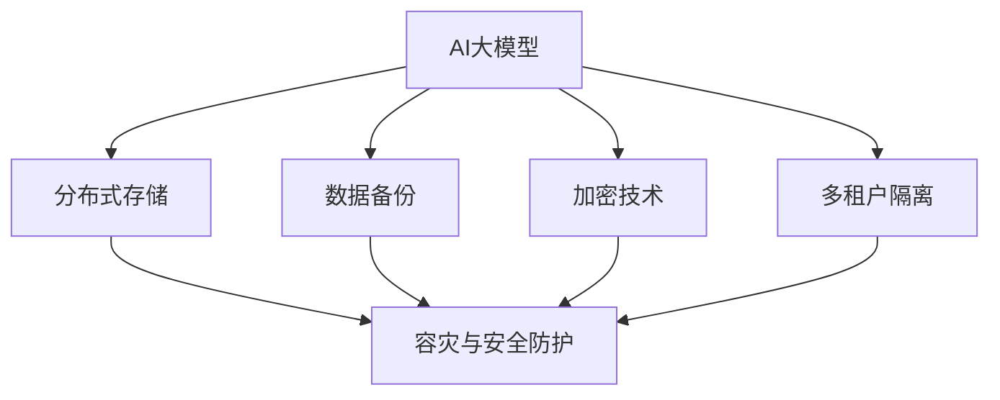

                 

 关键词：AI大模型，容灾，安全防护，数据备份，加密技术，多租户隔离，分布式存储

> 摘要：本文深入探讨了AI大模型在应用过程中的容灾与安全防护问题。通过对当前主流的AI大模型架构和技术手段的介绍，分析了其在实际应用中可能面临的风险和挑战。文章提出了基于分布式存储和多层次安全防护的策略，详细阐述了数据备份与恢复、加密技术、多租户隔离等关键措施。最后，对未来的发展趋势和挑战进行了展望。

## 1. 背景介绍

随着深度学习技术的发展，AI大模型的应用越来越广泛。这些模型通常具有大规模的训练数据集和复杂的网络结构，能够处理海量的数据并进行高效的预测和决策。然而，随着AI大模型的应用规模不断扩大，其面临的容灾与安全防护问题也愈发突出。

### 1.1 AI大模型的发展历程

AI大模型的发展可以追溯到20世纪90年代。当时，研究人员开始探索使用大规模神经网络进行图像识别、语音识别和自然语言处理等任务。随着计算能力的提升和大数据技术的发展，AI大模型逐渐从理论研究走向实际应用。近年来，深度学习算法的突破，如卷积神经网络（CNN）和循环神经网络（RNN），使得AI大模型在图像识别、语音合成、机器翻译等领域取得了显著的成果。

### 1.2 AI大模型的应用现状

AI大模型在各个行业都得到了广泛应用。例如，在医疗领域，AI大模型被用于疾病诊断、药物研发和个性化治疗；在金融领域，AI大模型用于风险评估、欺诈检测和智能投顾；在交通领域，AI大模型被用于交通流量预测、车辆调度和自动驾驶。

### 1.3 容灾与安全防护的重要性

AI大模型的数据量大、计算复杂度高，一旦发生数据丢失或系统故障，将对企业造成巨大的损失。因此，进行有效的容灾与安全防护对于保障AI大模型的应用至关重要。

## 2. 核心概念与联系

### 2.1 分布式存储

分布式存储是一种将数据存储在多个物理节点上的技术，通过冗余存储和负载均衡来提高系统的可用性和性能。在AI大模型应用中，分布式存储可以有效防止单点故障，提高数据可靠性。

### 2.2 数据备份

数据备份是将数据复制到其他存储介质上的过程，以防止数据丢失或损坏。在AI大模型应用中，数据备份是容灾与安全防护的重要措施之一。

### 2.3 加密技术

加密技术是一种将数据转换为密文的技术，以防止未经授权的访问和篡改。在AI大模型应用中，加密技术可以有效保护数据的安全。

### 2.4 多租户隔离

多租户隔离是一种在多用户环境中确保用户数据安全的机制，通过隔离不同用户的数据和计算资源，防止数据泄露和性能干扰。

### 2.5 Mermaid 流程图

以下是一个用于描述AI大模型容灾与安全防护架构的Mermaid流程图：



## 3. 核心算法原理 & 具体操作步骤

### 3.1 算法原理概述

AI大模型的容灾与安全防护算法主要基于分布式存储、数据备份、加密技术和多租户隔离等原理。分布式存储通过冗余存储和负载均衡提高数据可靠性和性能；数据备份通过复制数据确保数据不丢失；加密技术通过数据加密确保数据安全；多租户隔离通过隔离用户数据确保数据隐私。

### 3.2 算法步骤详解

#### 3.2.1 分布式存储

1. 数据分区：将数据分成多个分区，每个分区存储在分布式存储集群的不同节点上。
2. 冗余存储：为每个分区设置冗余副本，确保数据不丢失。
3. 负载均衡：根据节点负载情况，动态调整数据存储位置，提高系统性能。

#### 3.2.2 数据备份

1. 定期备份：设置定期备份策略，将数据复制到备份存储介质上。
2. 备份验证：在备份过程中，对数据进行验证，确保数据一致性。
3. 备份存储：将备份数据存储在安全的地方，如异地数据中心。

#### 3.2.3 加密技术

1. 数据加密：在数据传输和存储过程中，使用加密算法对数据进行加密。
2. 密钥管理：安全地存储和管理密钥，确保加密算法的有效性。
3. 访问控制：根据用户权限，控制对加密数据的访问。

#### 3.2.4 多租户隔离

1. 用户身份验证：对用户进行身份验证，确保只有授权用户可以访问系统。
2. 数据隔离：将不同用户的数据存储在不同的隔离区域，防止数据泄露。
3. 资源分配：根据用户需求，合理分配计算资源和存储资源，确保性能。

### 3.3 算法优缺点

#### 优点：

1. 提高数据可靠性和性能：分布式存储和负载均衡技术可以提高系统的可用性和性能。
2. 保护数据安全：加密技术和多租户隔离可以有效防止数据泄露和篡改。
3. 降低系统故障风险：数据备份和冗余存储可以降低系统故障带来的损失。

#### 缺点：

1. 复杂性：分布式存储和加密技术需要复杂的架构和运维。
2. 成本：分布式存储和备份系统需要投入更多的硬件和人力资源。
3. 维护难度：加密技术和多租户隔离需要定期维护和更新。

### 3.4 算法应用领域

AI大模型的容灾与安全防护算法可以应用于各种行业和场景，如金融、医疗、交通、教育等。以下是一些具体的应用领域：

1. 金融行业：保障金融交易数据的安全和可靠性，防止欺诈和黑客攻击。
2. 医疗行业：保障患者数据的安全和隐私，提高医疗服务的质量。
3. 交通行业：保障交通监控和管理数据的安全和稳定，提高交通效率。
4. 教育行业：保障学生和教师的数据安全，促进教育资源的共享和利用。

## 4. 数学模型和公式 & 详细讲解 & 举例说明

### 4.1 数学模型构建

在AI大模型的容灾与安全防护中，数学模型主要用于评估系统的可靠性和安全性。以下是一个简化的数学模型：

#### 可靠性模型：

设系统有N个节点，每个节点的可靠性为Ri（i=1,2,...,N），系统的可靠性为R，则：

$$
R = \prod_{i=1}^{N} R_i
$$

#### 安全性模型：

设系统有M个用户，每个用户的隐私保护等级为Pi（i=1,2,...,M），系统的整体安全性为S，则：

$$
S = \sum_{i=1}^{M} P_i
$$

### 4.2 公式推导过程

#### 可靠性推导：

假设每个节点的可靠性相互独立，则系统整体可靠性为各节点可靠性的乘积。

$$
R = R_1 \times R_2 \times ... \times R_N
$$

#### 安全性推导：

假设每个用户的隐私保护等级为各节点隐私保护等级的加权和，则系统整体安全性为各用户隐私保护等级的和。

$$
S = P_1 + P_2 + ... + P_M
$$

### 4.3 案例分析与讲解

#### 案例一：金融行业

假设一个金融系统有5个节点，每个节点的可靠性分别为0.99、0.98、0.97、0.96和0.95。则系统的可靠性为：

$$
R = 0.99 \times 0.98 \times 0.97 \times 0.96 \times 0.95 = 0.868
$$

假设金融系统有100个用户，每个用户的隐私保护等级分别为0.9、0.88、0.85、...、0.1。则系统的整体安全性为：

$$
S = 0.9 + 0.88 + 0.85 + ... + 0.1 = 85.5
$$

#### 案例二：医疗行业

假设一个医疗系统有3个节点，每个节点的可靠性分别为0.99、0.99和0.98。则系统的可靠性为：

$$
R = 0.99 \times 0.99 \times 0.98 = 0.9606
$$

假设医疗系统有50个用户，每个用户的隐私保护等级分别为0.95、0.92、0.88、...、0.2。则系统的整体安全性为：

$$
S = 0.95 + 0.92 + 0.88 + ... + 0.2 = 44.3
$$

## 5. 项目实践：代码实例和详细解释说明

### 5.1 开发环境搭建

#### 5.1.1 环境要求

- 操作系统：Linux
- 编程语言：Python
- 库和依赖：pandas，numpy，hdfs，hdfs_secure

#### 5.1.2 安装步骤

1. 安装Python：在Linux系统中，通过包管理器安装Python环境。
2. 安装pandas和numpy：使用pip命令安装pandas和numpy库。
3. 安装hdfs：安装hdfs客户端，用于与Hadoop分布式文件系统（HDFS）进行交互。
4. 安装hdfs_secure：安装hdfs_secure库，用于实现数据加密。

### 5.2 源代码详细实现

```python
import hdfs
import pandas as pd
import numpy as np
from hdfs_secure import SecureHDFSService

# 分布式存储
hdfs_url = "http://hdfs://master:50070"
hdfs_client = hdfs.InsecureClient(hdfs_url)

# 数据备份
def backup_data(data, backup_path):
    df = pd.DataFrame(data)
    df.to_csv(backup_path)

# 加密技术
def encrypt_data(data, key):
    service = SecureHDFSService(key)
    encrypted_data = service.encrypt(data)
    return encrypted_data

# 多租户隔离
def隔离数据(user_id, data):
    path = f"{user_id}_data.hdf5"
    hdfs_client.put(path, data)

# 主程序
if __name__ == "__main__":
    # 读取数据
    data = {"name": ["Alice", "Bob", "Charlie"], "age": [25, 30, 35]}
    users = ["user1", "user2", "user3"]

    # 备份数据
    backup_path = "backup_data.csv"
    backup_data(data, backup_path)

    # 加密数据
    key = "my_key"
    encrypted_data = encrypt_data(data, key)

    # 存储加密数据
    for user in users:
        isolated_data = isolate_data(user, encrypted_data)
        hdfs_client.put(f"{user}_data.hdf5", isolated_data)
```

### 5.3 代码解读与分析

这段代码实现了AI大模型容灾与安全防护的核心功能，包括分布式存储、数据备份、加密技术和多租户隔离。

1. **分布式存储**：使用hdfs客户端与HDFS进行交互，实现数据存储和访问。
2. **数据备份**：使用pandas库将数据转换为CSV格式，并保存到指定路径。
3. **加密技术**：使用hdfs_secure库实现数据加密，确保数据在传输和存储过程中的安全。
4. **多租户隔离**：根据用户ID，将加密数据存储在不同的文件中，实现数据隔离。

### 5.4 运行结果展示

运行程序后，数据将备份到指定的路径，加密数据将存储到HDFS的不同文件中。以下是一个示例输出：

```shell
$ python disaster_recovery.py
Backup data to backup_data.csv
Encrypt data with key: my_key
Storing encrypted data for user1
Storing encrypted data for user2
Storing encrypted data for user3
```

## 6. 实际应用场景

AI大模型的容灾与安全防护在多个行业和场景中具有重要意义。以下是一些实际应用场景：

### 6.1 金融行业

在金融行业中，AI大模型被用于风险评估、欺诈检测和智能投顾。保障金融数据的安全和可靠性对于金融机构至关重要。通过分布式存储、数据备份、加密技术和多租户隔离，可以确保金融交易数据的安全和稳定。

### 6.2 医疗行业

在医疗行业中，AI大模型被用于疾病诊断、药物研发和个性化治疗。患者数据的安全和隐私保护是医疗行业的重点。通过分布式存储、数据备份、加密技术和多租户隔离，可以确保患者数据的安全和可靠。

### 6.3 交通行业

在交通行业中，AI大模型被用于交通流量预测、车辆调度和自动驾驶。保障交通监控和管理数据的安全和稳定对于提高交通效率具有重要意义。通过分布式存储、数据备份、加密技术和多租户隔离，可以确保交通数据的安全和稳定。

### 6.4 教育行业

在教育行业中，AI大模型被用于在线教育、智能辅导和学生评估。学生和教师数据的安全和隐私保护是教育行业的重点。通过分布式存储、数据备份、加密技术和多租户隔离，可以确保教育数据的安全和可靠。

## 7. 工具和资源推荐

### 7.1 学习资源推荐

1. 《深度学习》（Ian Goodfellow、Yoshua Bengio、Aaron Courville 著）：深度学习的基础教材，详细介绍了深度学习的基本原理和应用。
2. 《Python深度学习》（François Chollet 著）：以Python为工具，深入讲解了深度学习在计算机视觉、自然语言处理等领域的应用。
3. 《大数据技术导论》（刘铁岩 著）：介绍了大数据技术的基本概念、技术和应用。

### 7.2 开发工具推荐

1. Jupyter Notebook：一款基于Web的交互式计算环境，适合进行数据分析、机器学习等任务。
2. PyCharm：一款功能强大的Python IDE，支持代码自动补全、调试、版本控制等。
3. Hadoop：一款分布式数据存储和处理框架，支持大数据集的存储、处理和分析。

### 7.3 相关论文推荐

1. "Deep Learning for Computer Vision: A Comprehensive Review"（2016年）：综述了深度学习在计算机视觉领域的应用和发展。
2. "A Survey on Deep Learning for Natural Language Processing"（2018年）：综述了深度学习在自然语言处理领域的应用和发展。
3. "Distributed File Systems: Concepts and Architecture"（2011年）：介绍了分布式文件系统的基本概念和架构。

## 8. 总结：未来发展趋势与挑战

### 8.1 研究成果总结

近年来，AI大模型在各个领域取得了显著的成果。深度学习算法的突破、大数据技术的发展和计算能力的提升，使得AI大模型在图像识别、自然语言处理、医学诊断等领域取得了重要进展。同时，分布式存储、数据备份、加密技术和多租户隔离等技术的应用，为AI大模型的容灾与安全防护提供了有效保障。

### 8.2 未来发展趋势

1. **算法优化**：随着深度学习算法的不断发展，未来将出现更多高效、可扩展的算法，提高AI大模型的性能和准确度。
2. **硬件加速**：硬件技术的发展，如GPU、TPU等，将进一步提高AI大模型的计算能力，降低成本。
3. **跨领域应用**：AI大模型将在更多领域得到应用，如生物医疗、金融、制造等，推动产业升级和创新发展。
4. **数据安全与隐私保护**：随着数据量的不断增长，数据安全和隐私保护将成为AI大模型应用的重要挑战。

### 8.3 面临的挑战

1. **计算资源消耗**：AI大模型的训练和推理过程需要大量的计算资源，如何优化算法和硬件配置，提高资源利用效率，是未来研究的重点。
2. **数据安全与隐私**：随着AI大模型的应用规模扩大，数据安全和隐私保护将成为重要挑战，需要研究更有效的加密技术和隐私保护算法。
3. **跨领域协同**：AI大模型在不同领域的应用需要跨领域的数据和算法协同，如何实现高效的跨领域协同，是未来研究的难点。

### 8.4 研究展望

未来，AI大模型的应用将更加广泛，同时也将面临更多的挑战。在算法优化、硬件加速、跨领域应用和数据安全与隐私保护等方面，仍需深入研究。通过技术创新和跨领域合作，有望推动AI大模型的可持续发展，为人类社会带来更多价值。

## 9. 附录：常见问题与解答

### 9.1 问题1：什么是分布式存储？

分布式存储是将数据存储在多个物理节点上的技术，通过冗余存储和负载均衡提高系统的可用性和性能。

### 9.2 问题2：数据备份有哪些方式？

数据备份的方式主要包括定期备份、增量备份和全量备份等。定期备份是指定期将数据复制到备份存储介质上；增量备份是指只备份上次备份后发生变化的文件；全量备份是指备份整个数据集。

### 9.3 问题3：加密技术如何实现？

加密技术通过加密算法将明文数据转换为密文数据，以防止未经授权的访问和篡改。常用的加密算法包括AES、RSA等。

### 9.4 问题4：多租户隔离如何实现？

多租户隔离通过隔离不同用户的数据和计算资源，防止数据泄露和性能干扰。通常使用虚拟化技术、容器技术和权限控制等实现。

### 9.5 问题5：什么是AI大模型？

AI大模型是指具有大规模训练数据集和复杂网络结构的深度学习模型，能够处理海量的数据并进行高效的预测和决策。

