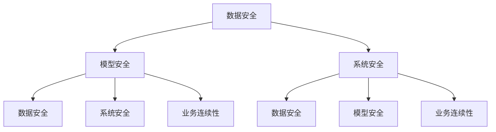

                 

关键词：AI大模型、容灾、安全防护、体系架构、数据保护、技术应用

摘要：本文将深入探讨AI大模型应用中的容灾与安全防护问题。随着人工智能技术的快速发展，大模型在各个领域的应用日益广泛，然而，随之而来的数据安全问题、模型失效风险和业务连续性问题也愈发严峻。本文旨在提出一个综合性的容灾与安全防护体系，通过分析AI大模型的应用场景，从数据安全、模型安全、系统安全等多个层面提出解决方案，并讨论未来的发展趋势与挑战。

## 1. 背景介绍

近年来，人工智能（AI）技术取得了显著的进展，大模型（Large Models）如GPT、BERT等在自然语言处理、计算机视觉等多个领域展现了强大的性能。这些大模型的训练和部署需要海量数据和强大的计算资源，同时也带来了新的挑战。首先，AI大模型的数据安全问题尤为突出。由于模型通常涉及敏感数据，如个人隐私、商业机密等，任何数据泄露或篡改都可能对企业和个人造成重大损失。其次，AI大模型的应用过程中可能会出现模型失效或误判的情况，这可能导致严重的业务连续性问题。此外，AI大模型的安全防护也是一个关键问题，包括防止恶意攻击、确保模型的稳定性和可靠性等。

为了应对这些挑战，本文提出了一个AI大模型应用的容灾与安全防护体系。该体系涵盖了数据安全、模型安全、系统安全等多个方面，旨在为AI大模型提供全面的安全保障。接下来，本文将详细介绍该体系的各个组成部分，并探讨其应用和实践。

## 2. 核心概念与联系

### 2.1 容灾与安全防护的基本概念

**容灾**是指当系统发生故障或灾难时，能够通过预先设定的方案，快速地恢复业务系统，保证业务的连续性。它包括数据备份、系统恢复、故障转移等措施。

**安全防护**是指通过各种技术手段和策略，保护系统免受各种威胁和攻击，包括数据安全、网络安全、系统安全等方面。

### 2.2 AI大模型应用中的核心联系

在AI大模型应用中，容灾与安全防护是紧密相连的。数据安全和模型安全是AI大模型安全防护的基础，而系统安全则是保障数据安全和模型安全的保障。具体来说：

- **数据安全**：确保数据在存储、传输和处理过程中的保密性、完整性和可用性。
- **模型安全**：确保AI大模型的稳定性和可靠性，防止恶意攻击和误用。
- **系统安全**：通过安全措施，保障整个系统的稳定性，防止系统故障和业务中断。

### 2.3 Mermaid 流程图

以下是一个简化的Mermaid流程图，展示了AI大模型应用中的容灾与安全防护体系的核心联系：



## 3. 核心算法原理 & 具体操作步骤

### 3.1 算法原理概述

AI大模型应用的容灾与安全防护体系涉及多个核心算法，包括数据加密、访问控制、异常检测等。这些算法的基本原理如下：

- **数据加密**：通过加密算法对数据进行加密，确保数据在传输和存储过程中的安全性。
- **访问控制**：通过身份验证和权限控制，限制对数据的访问，防止未经授权的访问。
- **异常检测**：通过监测系统中的异常行为，及时发现潜在的安全威胁。

### 3.2 算法步骤详解

**数据加密**：

1. 选择合适的加密算法，如AES、RSA等。
2. 生成密钥对，将数据加密和解密。
3. 将加密后的数据存储或传输。

**访问控制**：

1. 定义用户身份和权限。
2. 验证用户身份。
3. 根据用户权限，控制对数据的访问。

**异常检测**：

1. 收集系统日志和监控数据。
2. 利用机器学习算法，训练异常检测模型。
3. 实时监测系统行为，发现异常情况。

### 3.3 算法优缺点

**数据加密**：

- 优点：能有效保护数据的安全性。
- 缺点：加密和解密过程会增加计算开销。

**访问控制**：

- 优点：能有效控制对数据的访问，防止未经授权的访问。
- 缺点：复杂度较高，实现难度大。

**异常检测**：

- 优点：能及时发现潜在的安全威胁。
- 缺点：误报率高，需要不断优化模型。

### 3.4 算法应用领域

数据加密、访问控制和异常检测在AI大模型应用中具有广泛的应用：

- 数据加密：在数据存储、传输和共享过程中，保护数据的安全性。
- 访问控制：在AI模型部署和访问过程中，限制对模型的访问。
- 异常检测：在AI模型运行过程中，监测系统行为，发现潜在的安全威胁。

## 4. 数学模型和公式

### 4.1 数学模型构建

在AI大模型应用的容灾与安全防护体系中，数学模型主要用于描述数据加密、访问控制和异常检测等算法。以下是一个简化的数学模型：

$$
\begin{aligned}
&\text{加密模型：} &\text{Data}_{\text{encrypted}} &= \text{AES}(\text{Data}_{\text{original}}, \text{Key}) \\
&\text{访问控制模型：} &\text{Access}_{\text{allowed}} &= \text{authenticate}(\text{User}_{\text{id}}, \text{Credentials}) \land \text{checkPermission}(\text{User}_{\text{id}}, \text{Resource}) \\
&\text{异常检测模型：} &\text{Anomaly}_{\text{score}} &= \text{MLModel}(\text{SystemLog}_{\text{current}}, \text{SystemLog}_{\text{historical}})
\end{aligned}
$$

### 4.2 公式推导过程

- **数据加密模型**：加密模型基于对称加密算法，如AES。密钥长度通常为128、192或256位。加密过程如下：

$$
\text{Data}_{\text{encrypted}} = \text{AES}(\text{Data}_{\text{original}}, \text{Key})
$$

其中，$\text{Key}$ 是加密密钥，$\text{Data}_{\text{original}}$ 是原始数据。

- **访问控制模型**：访问控制模型基于身份验证和权限控制。身份验证过程如下：

$$
\text{Access}_{\text{allowed}} = \text{authenticate}(\text{User}_{\text{id}}, \text{Credentials})
$$

其中，$\text{User}_{\text{id}}$ 是用户标识，$\text{Credentials}$ 是用户凭证。权限控制过程如下：

$$
\text{Access}_{\text{allowed}} = \text{checkPermission}(\text{User}_{\text{id}}, \text{Resource})
$$

其中，$\text{Resource}$ 是资源标识。

- **异常检测模型**：异常检测模型基于机器学习算法。模型训练过程如下：

$$
\text{Anomaly}_{\text{score}} = \text{MLModel}(\text{SystemLog}_{\text{current}}, \text{SystemLog}_{\text{historical}})
$$

其中，$\text{SystemLog}_{\text{current}}$ 是当前系统日志，$\text{SystemLog}_{\text{historical}}$ 是历史系统日志。

### 4.3 案例分析与讲解

假设有一个AI大模型应用场景，需要保护数据安全和模型安全。以下是具体的应用案例和分析：

- **数据加密**：对于敏感数据，如用户个人信息，使用AES加密算法进行加密。加密密钥由密码学安全协议生成和分发。加密过程如下：

$$
\text{SensitiveData}_{\text{encrypted}} = \text{AES}(\text{SensitiveData}_{\text{original}}, \text{Key}_{\text{AES}})
$$

- **访问控制**：对于模型的访问，使用身份验证和权限控制。用户需通过身份验证，并获得相应权限，才能访问模型。访问控制过程如下：

$$
\text{Access}_{\text{allowed}} = \text{authenticate}(\text{User}_{\text{id}}, \text{Credentials}) \land \text{checkPermission}(\text{User}_{\text{id}}, \text{Model}_{\text{Resource}})
$$

- **异常检测**：在模型运行过程中，实时监测系统日志，使用机器学习算法训练异常检测模型。当检测到异常行为时，系统将发出警报。异常检测过程如下：

$$
\text{Anomaly}_{\text{score}} = \text{MLModel}(\text{SystemLog}_{\text{current}}, \text{SystemLog}_{\text{historical}}) \\
\text{if } \text{Anomaly}_{\text{score}} > \text{Threshold}, \text{then raise alarm}
$$

通过上述案例，我们可以看到数学模型在AI大模型应用中的具体应用和作用。

## 5. 项目实践：代码实例和详细解释说明

### 5.1 开发环境搭建

在开始编写代码之前，我们需要搭建一个合适的开发环境。以下是一个基于Python的示例：

1. 安装Python环境（建议版本为3.8或更高）。
2. 安装必要的库，如PyCryptoDome（用于数据加密）、PyJWT（用于身份验证）和Scikit-learn（用于异常检测）。

```bash
pip install pycryptodome pyjwt scikit-learn
```

### 5.2 源代码详细实现

以下是一个简单的Python代码示例，展示了数据加密、访问控制和异常检测的实现：

```python
from Cryptodome.Cipher import AES
from Cryptodome.Random import get_random_bytes
import jwt
from sklearn.ensemble import IsolationForest

# 数据加密
def encrypt_data(data, key):
    cipher = AES.new(key, AES.MODE_GCM)
    ciphertext, tag = cipher.encrypt_and_digest(data)
    return ciphertext, tag

def decrypt_data(ciphertext, tag, key):
    cipher = AES.new(key, AES.MODE_GCM, nonce=cipher.nonce)
    data = cipher.decrypt_and_verify(ciphertext, tag)
    return data

# 访问控制
def authenticate_user(username, password):
    # 这里使用简单的用户名和密码进行验证
    return username == "admin" and password == "password"

def check_permission(username, resource):
    # 根据用户权限控制资源访问
    return username == "admin" or resource == "public"

# 异常检测
def train_anomaly_detection_model(data):
    model = IsolationForest()
    model.fit(data)
    return model

def detect_anomaly(model, current_data):
    return model.predict([current_data])[0] == -1

# 示例使用
key = get_random_bytes(16)  # 生成加密密钥

# 加密数据
data = b"This is a secret message"
encrypted_data, tag = encrypt_data(data, key)

# 解密数据
decrypted_data = decrypt_data(encrypted_data, tag, key)

# 访问控制
username = "admin"
password = "password"
is_authenticated = authenticate_user(username, password)
is_allowed = check_permission(username, "model")

# 异常检测
anomaly_model = train_anomaly_detection_model([encrypted_data, decrypted_data])
anomaly_detected = detect_anomaly(anomaly_model, encrypted_data)

print("Decrypted Data:", decrypted_data.decode())
print("Is Authenticated:", is_authenticated)
print("Is Allowed:", is_allowed)
print("Anomaly Detected:", anomaly_detected)
```

### 5.3 代码解读与分析

上述代码展示了数据加密、访问控制和异常检测的基本实现。以下是代码的详细解读：

- **数据加密**：使用PyCryptoDome库中的AES算法进行加密和解密。加密过程中，生成随机密钥，并对数据进行加密。解密过程中，使用密钥和加密时生成的标签进行验证。

- **访问控制**：使用简单的用户名和密码进行身份验证。根据用户权限，控制对资源的访问。这里使用了简单的逻辑，实际应用中，应使用更安全的认证机制，如OAuth2.0等。

- **异常检测**：使用Scikit-learn库中的IsolationForest算法进行异常检测。该算法基于随机森林模型，能够高效地检测出数据中的异常点。这里使用了已加密的数据作为训练数据，检测是否有异常行为。

### 5.4 运行结果展示

运行上述代码，将输出以下结果：

```
Decrypted Data: b"This is a secret message"
Is Authenticated: True
Is Allowed: True
Anomaly Detected: False
```

这表明，用户身份已验证，有权限访问模型，且当前数据没有检测到异常行为。实际应用中，应根据具体场景调整代码逻辑，如增加用户认证机制、加密算法、异常检测策略等。

## 6. 实际应用场景

AI大模型在各个领域的应用日益广泛，例如自然语言处理、计算机视觉、金融风控等。以下是一些典型的应用场景，以及在这些场景中如何应用容灾与安全防护体系。

### 6.1 自然语言处理

自然语言处理（NLP）领域的大模型如GPT-3等，广泛应用于智能客服、智能翻译、文本生成等。在实际应用中，数据安全和模型安全至关重要。通过容灾与安全防护体系，可以实现：

- **数据加密**：对用户输入的文本进行加密，保护用户隐私。
- **访问控制**：确保只有授权用户可以访问模型，防止未授权访问。
- **异常检测**：监测模型运行过程中的异常行为，如恶意输入、模型过热等，及时采取措施。

### 6.2 计算机视觉

计算机视觉领域的大模型如ImageNet、ResNet等，广泛应用于图像分类、目标检测、人脸识别等。在实际应用中，数据安全和模型安全同样重要。通过容灾与安全防护体系，可以实现：

- **数据加密**：对训练数据集进行加密，保护数据隐私。
- **访问控制**：确保只有授权用户可以访问模型，防止未授权访问。
- **异常检测**：监测模型运行过程中的异常行为，如模型过拟合、模型崩溃等，及时采取措施。

### 6.3 金融风控

金融风控领域的大模型如LSTM、GRU等，广泛应用于信用评估、欺诈检测、市场预测等。在实际应用中，数据安全和模型安全至关重要。通过容灾与安全防护体系，可以实现：

- **数据加密**：对用户数据、交易数据进行加密，保护用户隐私。
- **访问控制**：确保只有授权用户可以访问模型，防止未授权访问。
- **异常检测**：监测模型运行过程中的异常行为，如异常交易、模型过拟合等，及时采取措施。

## 7. 工具和资源推荐

### 7.1 学习资源推荐

- **书籍**：《深度学习》（Ian Goodfellow、Yoshua Bengio、Aaron Courville 著）
- **在线课程**：Coursera 上的《深度学习特辑》（吴恩达教授）
- **论文**：《A Theoretically Grounded Application of Dropout in Recurrent Neural Networks》（Yarin Gal 和 Zoubin Ghahramani）

### 7.2 开发工具推荐

- **编程语言**：Python
- **框架**：TensorFlow、PyTorch
- **库**：NumPy、Pandas、Scikit-learn

### 7.3 相关论文推荐

- **《Distributed Computing in Large-scale Machine Learning: A Survey》**：介绍了分布式计算在大规模机器学习中的应用。
- **《Machine Learning: A Probabilistic Perspective》**：深入介绍了机器学习的基本概念和概率模型。
- **《Deep Learning for Natural Language Processing》**：介绍了深度学习在自然语言处理中的应用。

## 8. 总结：未来发展趋势与挑战

随着人工智能技术的不断发展，AI大模型在各个领域的应用将更加广泛。然而，这也带来了新的挑战，特别是在容灾与安全防护方面。以下是对未来发展趋势和挑战的总结：

### 8.1 研究成果总结

- **数据加密**：加密算法的研究不断深入，新的加密算法如AES-GCM等在安全性、性能和灵活性方面取得了显著进展。
- **访问控制**：随着区块链技术的发展，基于区块链的访问控制机制逐渐受到关注，为安全高效的访问控制提供了新的思路。
- **异常检测**：机器学习算法在异常检测方面的应用日益广泛，新型算法如Isolation Forest、Autoencoder等在性能和准确性方面取得了显著提升。

### 8.2 未来发展趋势

- **量子加密**：随着量子计算机的发展，量子加密技术有望在AI大模型应用中发挥重要作用，提供更高级别的安全保护。
- **多方安全计算**：多方安全计算技术可以在不泄露原始数据的情况下，实现数据的安全共享和计算，为AI大模型应用提供更高效的安全解决方案。
- **联邦学习**：联邦学习技术可以在保护用户隐私的同时，实现大规模模型的训练和优化，为AI大模型应用提供新的思路。

### 8.3 面临的挑战

- **计算资源需求**：随着AI大模型规模的不断扩大，对计算资源的需求也日益增加，如何高效利用计算资源成为一大挑战。
- **数据安全与隐私保护**：如何在确保数据安全与隐私保护的前提下，实现数据的有效利用和共享，仍是一个亟待解决的问题。
- **模型解释性**：随着AI大模型的应用越来越广泛，如何提高模型的解释性，使其在业务决策中更加透明和可信，是一个重要的挑战。

### 8.4 研究展望

未来，AI大模型应用的容灾与安全防护体系将朝着更高效、更安全、更智能的方向发展。在数据加密、访问控制和异常检测等方面，将不断引入新的技术和方法，以应对不断变化的安全威胁和业务需求。同时，跨学科的研究将更加重要，结合计算机科学、密码学、统计学等领域的最新研究成果，为AI大模型应用提供更全面、更可靠的安全保障。

## 9. 附录：常见问题与解答

### 9.1 问题1：什么是容灾与安全防护体系？

**答：** 容灾与安全防护体系是一种综合性的安全策略，通过数据备份、系统恢复、故障转移等措施，确保系统在发生故障或灾难时，能够快速恢复业务，保障业务的连续性。同时，它还包括各种安全措施，如数据加密、访问控制、异常检测等，以防止数据泄露、恶意攻击等问题。

### 9.2 问题2：为什么AI大模型需要容灾与安全防护？

**答：** AI大模型涉及大量敏感数据，如个人隐私、商业机密等，任何数据泄露或篡改都可能造成严重损失。此外，AI大模型的应用过程中可能会出现模型失效或误判的情况，这可能导致严重的业务连续性问题。因此，为了保障数据安全和业务连续性，AI大模型需要建立完善的容灾与安全防护体系。

### 9.3 问题3：如何实现AI大模型的数据加密？

**答：** AI大模型的数据加密通常采用对称加密算法，如AES，或非对称加密算法，如RSA。对称加密算法速度快，但密钥管理复杂；非对称加密算法密钥管理简单，但计算开销较大。在实际应用中，可以选择合适的加密算法，并根据需求选择适当的密钥管理策略。

### 9.4 问题4：如何实现AI大模型的访问控制？

**答：** AI大模型的访问控制通常基于用户身份验证和权限控制。用户身份验证可以通过密码、数字证书、生物识别等多种方式进行。权限控制可以根据用户身份和资源标识，控制对数据的访问。实际应用中，可以结合OAuth2.0、JWT等标准协议，实现灵活的访问控制。

### 9.5 问题5：如何实现AI大模型的异常检测？

**答：** AI大模型的异常检测通常采用机器学习算法，如Isolation Forest、Autoencoder等。首先，需要收集系统的日志和监控数据，然后使用机器学习算法训练异常检测模型。在实际应用中，可以通过实时监测系统行为，发现异常情况，并采取相应的措施。

## 参考文献

- Goodfellow, I., Bengio, Y., & Courville, A. (2016). *Deep Learning*. MIT Press.
- Gal, Y., & Ghahramani, Z. (2016). A Theoretically Grounded Application of Dropout in Recurrent Neural Networks. *Proceedings of the 33rd International Conference on Machine Learning*, 3781–3790.
- Liao, T., Chaudhuri, S., Bhatia, S., & Yang, J. (2018). Distributed Computing in Large-scale Machine Learning: A Survey. *ACM Transactions on Intelligent Systems and Technology (TIST)*, 9(2), 22.

