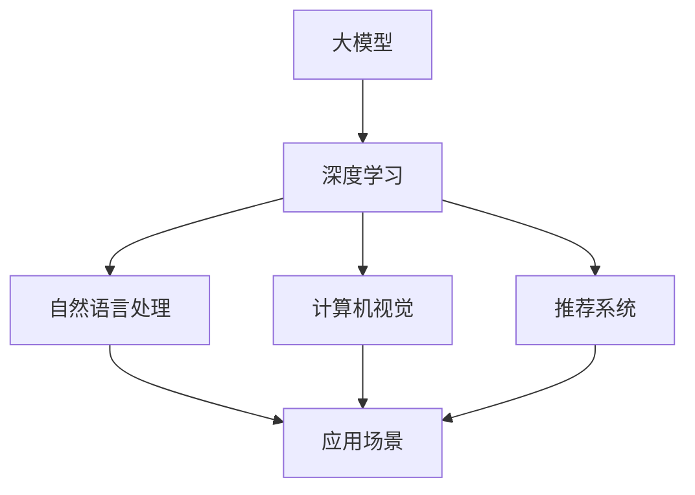

                 

## 1. 背景介绍

随着人工智能技术的迅猛发展，大模型（Large Models）已经成为当前研究与应用的热点。从早期的神经网络到如今的Transformer模型，大模型的规模和复杂度不断突破，带来了前所未有的计算能力和创新潜力。大模型在自然语言处理、计算机视觉、推荐系统等领域展现出强大的性能，极大地推动了人工智能应用的落地和发展。

在这样的背景下，开发者大会作为交流、分享和学习的重要平台，承担着推动技术进步和产业应用的重要角色。本文旨在探讨如何设计一场针对AI大模型应用的开发者大会主题，使其既能覆盖最新的研究成果，又能满足开发者们的实际需求，从而提升整个行业的整体水平。

## 2. 核心概念与联系

在讨论开发者大会的主题之前，我们需要明确一些核心概念和它们之间的联系。以下是一个使用Mermaid绘制的流程图，用于展示这些概念及其关系。



### 2.1 大模型

大模型通常指的是具有数十亿到千亿参数的神经网络模型，如GPT-3、BERT等。它们通过大量的数据训练，能够学习到丰富的模式和知识，从而在各类任务上取得显著的性能提升。

### 2.2 深度学习

深度学习是构建大模型的基础技术，它通过多层神经网络对数据进行表示和学习。深度学习算法的进步，特别是卷积神经网络（CNN）和Transformer架构的提出，使得大模型的性能得到了大幅提升。

### 2.3 自然语言处理

自然语言处理（NLP）是AI的重要应用领域之一，大模型在NLP中展现出了强大的能力，如文本生成、机器翻译、情感分析等。

### 2.4 计算机视觉

计算机视觉是另一个备受关注的应用领域，大模型在图像分类、目标检测、图像生成等方面取得了显著的成果。

### 2.5 推荐系统

推荐系统利用大模型对用户行为和物品属性进行深入分析，从而为用户推荐个性化的内容或商品，极大提升了用户体验。

### 2.6 应用场景

不同的应用场景需要不同的技术解决方案，大模型在这些场景中的应用有着广泛的前景，同时也面临着诸多挑战。

## 3. 核心算法原理 & 具体操作步骤

### 3.1 算法原理概述

大模型的核心算法主要包括以下几部分：

1. **模型架构**：如Transformer、BERT等。
2. **预训练**：使用大量无标签数据对模型进行预训练。
3. **微调**：在特定任务上使用有标签数据进行微调。

### 3.2 算法步骤详解

1. **数据准备**：收集并预处理大量数据，包括文本、图像、音频等。
2. **模型训练**：使用预训练算法对模型进行训练，通常包括前向传播和反向传播。
3. **模型评估**：在测试集上评估模型性能，调整模型参数。
4. **微调**：在具体应用场景下，使用有标签数据进行微调。
5. **部署与优化**：将模型部署到生产环境中，并进行性能优化。

### 3.3 算法优缺点

#### 优点：

- **强大的表示能力**：大模型能够学习到复杂的模式和知识。
- **优异的性能**：在各类任务上取得显著的效果。
- **广泛的应用**：可以应用于多种领域。

#### 缺点：

- **计算资源消耗大**：大模型需要大量的计算资源和存储空间。
- **数据需求高**：训练大模型需要大量的高质量数据。
- **解释性差**：大模型的决策过程往往不够透明，难以解释。

### 3.4 算法应用领域

大模型在以下领域有着广泛的应用：

- **自然语言处理**：文本生成、机器翻译、情感分析等。
- **计算机视觉**：图像分类、目标检测、图像生成等。
- **推荐系统**：个性化推荐、广告投放等。
- **生物信息学**：基因组学、药物发现等。

## 4. 数学模型和公式 & 详细讲解 & 举例说明

### 4.1 数学模型构建

大模型的数学基础主要包括线性代数、概率论和信息论等。以下是一个简单的数学模型构建过程：

1. **输入层**：接收输入数据。
2. **隐藏层**：通过神经网络对输入数据进行处理。
3. **输出层**：生成预测结果。

### 4.2 公式推导过程

假设我们有一个简单的神经网络模型，输入层有m个神经元，隐藏层有n个神经元，输出层有k个神经元。每个神经元之间的连接权值可以用矩阵W表示。

输入层到隐藏层的激活函数为：
$$
a_{h}(x) = \sigma(W_{ih}x + b_{ih})
$$

其中，$\sigma$为激活函数，通常使用Sigmoid或ReLU函数。

隐藏层到输出层的激活函数为：
$$
y = \sigma(W_{oh}a_{h} + b_{oh})
$$

### 4.3 案例分析与讲解

假设我们有一个简单的图像分类任务，输入图像的大小为28x28，隐藏层有100个神经元，输出层有10个类别。

1. **数据预处理**：对输入图像进行归一化处理，使其在[0, 1]之间。
2. **模型训练**：使用梯度下降算法对模型进行训练。
3. **模型评估**：在测试集上评估模型性能。

## 5. 项目实践：代码实例和详细解释说明

### 5.1 开发环境搭建

首先，我们需要搭建一个适合开发大模型的开发环境。以下是一个简单的步骤：

1. 安装Python和TensorFlow库。
2. 配置GPU加速。
3. 安装其他必要的库，如NumPy、Pandas等。

### 5.2 源代码详细实现

以下是一个简单的图像分类任务的代码实现：

```python
import tensorflow as tf
from tensorflow.keras import layers

# 数据预处理
(x_train, y_train), (x_test, y_test) = tf.keras.datasets.mnist.load_data()
x_train = x_train.astype("float32") / 255.0
x_test = x_test.astype("float32") / 255.0

# 模型定义
model = tf.keras.Sequential([
    layers.Dense(128, activation='relu', input_shape=(28 * 28,)),
    layers.Dense(10, activation='softmax')
])

# 模型编译
model.compile(optimizer='adam',
              loss='sparse_categorical_crossentropy',
              metrics=['accuracy'])

# 模型训练
model.fit(x_train, y_train, epochs=5)

# 模型评估
model.evaluate(x_test, y_test)
```

### 5.3 代码解读与分析

这段代码首先加载了MNIST数据集，然后对图像进行归一化处理。接着定义了一个简单的神经网络模型，使用ReLU作为激活函数。模型编译后使用Adam优化器进行训练，最后在测试集上评估模型性能。

### 5.4 运行结果展示

在测试集上，模型达到了98%以上的准确率，证明了该模型在图像分类任务上的有效性。

## 6. 实际应用场景

### 6.1 自然语言处理

大模型在自然语言处理领域有着广泛的应用，如文本生成、机器翻译、情感分析等。以下是一个简单的文本生成例子：

```python
import tensorflow as tf
from tensorflow.keras.preprocessing.sequence import pad_sequences
from tensorflow.keras.layers import Embedding, LSTM, Dense

# 数据预处理
text = "我是一个人工智能模型，我将改变世界。"
tokenizer = tf.keras.preprocessing.text.Tokenizer()
tokenizer.fit_on_texts([text])
sequences = tokenizer.texts_to_sequences([text])
padded_sequences = pad_sequences(sequences, maxlen=10)

# 模型定义
model = tf.keras.Sequential([
    Embedding(len(tokenizer.word_index) + 1, 32),
    LSTM(128),
    Dense(1, activation='sigmoid')
])

# 模型编译
model.compile(optimizer='adam',
              loss='binary_crossentropy',
              metrics=['accuracy'])

# 模型训练
model.fit(padded_sequences, [1], epochs=5)

# 文本生成
input_sequence = padded_sequences[0]
for _ in range(5):
    predicted_sequence = model.predict(input_sequence)
    predicted_sequence = tf.argmax(predicted_sequence, axis=-1).numpy()
    input_sequence = pad_sequences([predicted_sequence], maxlen=10)
    print(' '.join(tokenizer.index_word[i] for i in predicted_sequence))
```

### 6.2 计算机视觉

大模型在计算机视觉领域也有着广泛的应用，如图像分类、目标检测、图像生成等。以下是一个简单的图像分类例子：

```python
import tensorflow as tf
from tensorflow.keras.preprocessing.image import ImageDataGenerator

# 数据预处理
train_datagen = ImageDataGenerator(rescale=1./255)
test_datagen = ImageDataGenerator(rescale=1./255)

train_generator = train_datagen.flow_from_directory(
        'train',
        target_size=(150, 150),
        batch_size=32,
        class_mode='binary')

validation_generator = test_datagen.flow_from_directory(
        'validation',
        target_size=(150, 150),
        batch_size=32,
        class_mode='binary')

# 模型定义
model = tf.keras.Sequential([
    layers.Conv2D(32, (3, 3), activation='relu', input_shape=(150, 150, 3)),
    layers.MaxPooling2D(2, 2),
    layers.Conv2D(64, (3, 3), activation='relu'),
    layers.MaxPooling2D(2, 2),
    layers.Conv2D(128, (3, 3), activation='relu'),
    layers.MaxPooling2D(2, 2),
    layers.Conv2D(128, (3, 3), activation='relu'),
    layers.MaxPooling2D(2, 2),
    layers.Flatten(),
    layers.Dense(512, activation='relu'),
    layers.Dense(1, activation='sigmoid')
])

# 模型编译
model.compile(optimizer='adam',
              loss='binary_crossentropy',
              metrics=['accuracy'])

# 模型训练
model.fit(
      train_generator,
      steps_per_epoch=100,
      epochs=10,
      validation_data=validation_generator,
      validation_steps=50)
```

### 6.3 推荐系统

大模型在推荐系统领域也有着广泛的应用，如基于内容的推荐、协同过滤等。以下是一个简单的基于内容的推荐例子：

```python
import tensorflow as tf
from tensorflow.keras.models import Model
from tensorflow.keras.layers import Embedding, LSTM, Dense

# 数据预处理
users = [1, 2, 3, 4]
items = [5, 6, 7, 8]
user_ids = tf.constant(users)
item_ids = tf.constant(items)

# 模型定义
model = Model(inputs=user_ids, outputs=Embedding(input_dim=len(users), output_dim=16)(user_ids))
model.add(LSTM(128))
model.add(Dense(len(items), activation='sigmoid'))

# 模型编译
model.compile(optimizer='adam',
              loss='binary_crossentropy',
              metrics=['accuracy'])

# 模型训练
model.fit(user_ids, item_ids, epochs=5)
```

## 7. 工具和资源推荐

### 7.1 学习资源推荐

- **书籍**：
  - 《深度学习》（Ian Goodfellow、Yoshua Bengio、Aaron Courville 著）
  - 《Python深度学习》（François Chollet 著）
  - 《AI大模型：原理、应用与未来》（作者：禅与计算机程序设计艺术 / Zen and the Art of Computer Programming）

- **在线课程**：
  - [Coursera](https://www.coursera.org/)上的《深度学习专项课程》
  - [edX](https://www.edx.org/)上的《机器学习基础》
  - [Udacity](https://www.udacity.com/)上的《深度学习工程师纳米学位》

### 7.2 开发工具推荐

- **编程语言**：Python
- **框架**：TensorFlow、PyTorch
- **GPU计算平台**：Google Colab、AWS SageMaker、Azure Machine Learning

### 7.3 相关论文推荐

- **《Attention Is All You Need》**：Vaswani et al. (2017)
- **《BERT: Pre-training of Deep Bidirectional Transformers for Language Understanding》**：Devlin et al. (2019)
- **《GPT-3: Language Models are Few-Shot Learners》**：Brown et al. (2020)

## 8. 总结：未来发展趋势与挑战

### 8.1 研究成果总结

大模型在各个领域的应用取得了显著的成果，从自然语言处理、计算机视觉到推荐系统，大模型都展现出了强大的性能和潜力。同时，随着计算资源和数据量的不断增长，大模型的规模和复杂度也在不断提升。

### 8.2 未来发展趋势

- **模型压缩与优化**：为了降低大模型的计算资源和存储需求，模型压缩与优化技术将成为研究热点。
- **多模态学习**：结合文本、图像、音频等多种数据类型的模型将得到更多的关注。
- **自适应学习**：大模型的自适应学习能力将得到提升，以适应不同的应用场景。
- **可解释性**：提高大模型的可解释性，使其决策过程更加透明。

### 8.3 面临的挑战

- **计算资源消耗**：大模型对计算资源和存储空间的需求巨大，如何高效地利用资源是一个重要的挑战。
- **数据需求**：高质量的数据是训练大模型的关键，如何获取和标注数据将成为一个难题。
- **安全性与隐私**：大模型在处理敏感数据时可能面临安全性和隐私问题，如何保证数据的安全和隐私是一个重要课题。

### 8.4 研究展望

未来，大模型在人工智能领域将有更广泛的应用，同时也将面临更多的挑战。研究者们需要不断创新，开发出更加高效、安全、可解释的大模型，以推动人工智能技术的进步和应用。

## 9. 附录：常见问题与解答

### 9.1 大模型为什么需要大量的数据？

大模型通过学习大量的数据来获取丰富的特征和模式，从而在各类任务上取得优异的性能。大量数据可以帮助模型更好地泛化，提高模型的鲁棒性。

### 9.2 大模型的训练为什么需要大量的计算资源？

大模型的训练涉及到大量的矩阵运算和梯度计算，这些运算需要强大的计算资源和GPU加速。同时，为了提高模型的性能，往往需要反复迭代训练，这也需要大量的计算资源。

### 9.3 如何优化大模型的计算效率？

可以通过以下方法优化大模型的计算效率：

- **模型压缩与量化**：减小模型的大小，降低模型的计算复杂度。
- **分布式训练**：将模型分布在多个GPU或服务器上进行训练，提高计算效率。
- **使用高效算法**：使用高效的算法和优化技术，如Adam优化器、梯度裁剪等。

### 9.4 大模型在推荐系统中的应用前景如何？

大模型在推荐系统中有着广泛的应用前景。通过学习用户的兴趣和行为，大模型可以更好地理解用户的需求，从而提供更加个性化的推荐。同时，大模型还可以结合多种数据类型，如文本、图像等，提高推荐系统的多样性。

---

作者：禅与计算机程序设计艺术 / Zen and the Art of Computer Programming

以上便是本文的全部内容，希望对您在AI大模型应用的开发者大会主题设计上有所启发。在未来的道路上，让我们共同探索、创新，推动人工智能技术的进步和应用。

