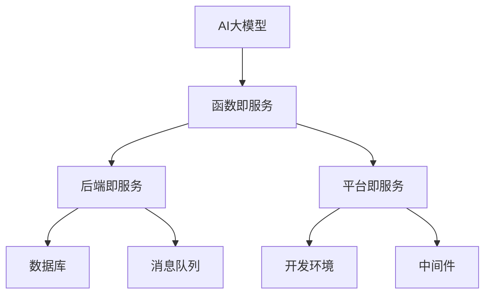

                 

关键词：无服务器架构，AI大模型，云计算，弹性伸缩，容器化，Kubernetes，微服务，联邦学习，自动化运维

> 摘要：本文将深入探讨AI大模型应用的无服务器架构，从背景介绍、核心概念与联系、核心算法原理、数学模型、项目实践、实际应用场景、工具和资源推荐以及未来发展趋势与挑战等多个方面进行全面分析，旨在为开发者提供一份系统性的指南，帮助他们在云计算时代更好地利用无服务器架构部署和运行AI大模型。

## 1. 背景介绍

随着人工智能（AI）技术的快速发展，大规模人工智能模型（简称大模型）如BERT、GPT-3等已经成为自然语言处理（NLP）、图像识别、推荐系统等领域的核心技术。然而，这些大模型往往需要大量的计算资源和存储空间，传统的有服务器（Server-Side）架构在成本、管理和弹性方面面临诸多挑战。

### 1.1 有服务器架构的挑战

1. **高成本**：大规模服务器集群的购买、维护和运营成本高昂。
2. **管理复杂**：服务器运维需要专业的团队进行管理，包括硬件维护、软件更新、安全防护等。
3. **弹性不足**：传统的服务器架构难以动态调整资源，无法迅速响应业务需求的变化。

### 1.2 无服务器架构的优势

为了应对上述挑战，无服务器架构（Serverless Architecture）应运而生。无服务器架构是一种云计算服务模型，它允许开发人员无需管理服务器，只需关注业务逻辑的开发。其主要优势包括：

1. **低成本**：按需付费，无需购买和维护服务器，节省成本。
2. **高弹性**：自动扩展，根据业务需求动态调整资源。
3. **简化运维**：无需关注服务器运维，专注于代码开发和业务逻辑。

### 1.3 AI大模型与无服务器架构的结合

无服务器架构在AI大模型应用中具有独特的优势：

1. **计算资源的高效利用**：AI大模型计算密集，无服务器架构能够自动分配和回收资源，避免资源浪费。
2. **弹性伸缩**：AI大模型在训练和推理阶段对计算资源的需求波动较大，无服务器架构能够快速响应需求变化。
3. **简化部署**：无服务器架构简化了部署流程，提高开发效率。

## 2. 核心概念与联系

### 2.1 无服务器架构核心概念

无服务器架构主要包括以下核心概念：

1. **函数即服务（Functions as a Service, FaaS）**：以函数为最小执行单元，开发者无需关注底层基础设施。
2. **后端即服务（Backend as a Service, BaaS）**：提供后端服务，如数据库、消息队列等，开发者无需关注底层实现。
3. **平台即服务（Platform as a Service, PaaS）**：提供开发平台和工具，如开发环境、中间件等，开发者只需关注业务逻辑。

### 2.2 无服务器架构与传统服务器架构对比

| 特点 | 无服务器架构 | 传统服务器架构 |
| --- | --- | --- |
| 资源管理 | 自动化 | 需要手动管理 |
| 弹性伸缩 | 自动伸缩 | 需要手动调整 |
| 成本 | 按需付费 | 需要固定成本 |
| 运维复杂度 | 低 | 高 |

### 2.3 无服务器架构与AI大模型的关系

无服务器架构在AI大模型应用中具有以下关系：

1. **高效计算**：无服务器架构能够高效利用计算资源，满足AI大模型对计算资源的需求。
2. **弹性伸缩**：无服务器架构能够根据AI大模型的训练和推理需求动态调整资源，提高资源利用率。
3. **简化部署**：无服务器架构简化了AI大模型的部署流程，提高开发效率。

### 2.4 Mermaid 流程图

以下是一个简化的无服务器架构与AI大模型关系的Mermaid流程图：



## 3. 核心算法原理 & 具体操作步骤

### 3.1 算法原理概述

无服务器架构的核心算法原理主要涉及以下几个方面：

1. **容器化技术**：通过容器化技术（如Docker），将应用程序及其依赖环境打包为一个独立的运行时环境，确保应用程序在各种环境中的一致性和可移植性。
2. **编排与管理工具**：如Kubernetes，用于自动化容器化应用程序的部署、伸缩和管理。
3. **微服务架构**：将应用程序拆分为多个独立的服务，每个服务负责特定的功能，提高系统的可维护性和可扩展性。
4. **联邦学习**：通过分布式计算技术，将数据分散在多个节点上，共同训练AI大模型，提高模型训练效率和安全性。

### 3.2 算法步骤详解

1. **容器化与编排**：
   - 使用Docker将应用程序及其依赖环境打包为容器镜像。
   - 使用Kubernetes对容器镜像进行编排和自动化管理。

2. **微服务架构**：
   - 根据业务需求，将应用程序拆分为多个独立的服务。
   - 使用服务注册与发现机制，确保各个服务之间的协调与通信。

3. **联邦学习**：
   - 将数据分散在多个节点上，每个节点独立训练局部模型。
   - 使用梯度聚合算法，将局部模型更新合并为全局模型。

### 3.3 算法优缺点

#### 优点：

1. **高效计算**：容器化和编排技术能够高效利用计算资源，提高模型训练和推理的效率。
2. **弹性伸缩**：基于微服务架构和联邦学习技术，系统能够根据实际需求动态调整资源，提高资源利用率。
3. **简化部署**：无服务器架构简化了应用程序的部署流程，提高开发效率。

#### 缺点：

1. **管理复杂度**：尽管无服务器架构简化了运维，但开发者仍需关注服务间的依赖关系和协调问题。
2. **成本问题**：虽然按需付费，但实际成本可能会随着使用量的增加而上升。

### 3.4 算法应用领域

无服务器架构在AI大模型应用中具有广泛的应用领域，包括但不限于：

1. **自然语言处理**：如文本分类、情感分析等。
2. **图像识别**：如目标检测、图像分割等。
3. **推荐系统**：如基于内容的推荐、协同过滤等。

## 4. 数学模型和公式 & 详细讲解 & 举例说明

### 4.1 数学模型构建

在AI大模型训练过程中，常用的数学模型包括神经网络、深度学习等。以下以神经网络为例进行说明。

#### 4.1.1 前向传播

前向传播是神经网络计算的基本过程，包括以下步骤：

1. 输入层（Input Layer）：接收外部输入数据。
2. 隐藏层（Hidden Layer）：对输入数据进行处理，产生中间结果。
3. 输出层（Output Layer）：生成最终输出结果。

#### 4.1.2 反向传播

反向传播是神经网络训练的核心算法，包括以下步骤：

1. 计算损失函数（Loss Function）：衡量预测结果与实际结果之间的差距。
2. 计算梯度（Gradient）：根据损失函数计算模型参数的梯度。
3. 更新模型参数：根据梯度更新模型参数，减小损失函数。

### 4.2 公式推导过程

以下以神经网络的前向传播为例，推导其数学模型。

#### 4.2.1 激活函数

激活函数是神经网络中的一个关键组件，用于引入非线性特性。常用的激活函数包括Sigmoid、ReLU等。

#### 4.2.2 前向传播

假设神经网络有L层，每层有n个神经元。设第l层的输入为$a_{l}^{(i)}$，输出为$a_{l+1}^{(i)}$，权重为$w_{l+1}^{(i)}$，偏置为$b_{l+1}^{(i)}$。则有：

$$
a_{l+1}^{(i)} = \sigma \left( \sum_{j} w_{l+1}^{(i)} a_{l}^{(j) + b_{l+1}^{(i)} \right)
$$

其中，$\sigma$为激活函数。

### 4.3 案例分析与讲解

#### 4.3.1 案例背景

假设我们有一个二分类问题，需要判断一个数据点是否为正类。训练数据集包含1000个样本，其中正类样本500个，负类样本500个。

#### 4.3.2 数据预处理

1. 将输入数据归一化，使其在[0, 1]范围内。
2. 将输出数据编码为二进制向量，如正类编码为[1, 0]，负类编码为[0, 1]。

#### 4.3.3 模型构建

1. 选择一个合适的神经网络架构，如一个输入层、一个隐藏层和一个输出层。
2. 选择一个激活函数，如ReLU。
3. 初始化模型参数，如权重和偏置。

#### 4.3.4 模型训练

1. 使用随机梯度下降（SGD）算法对模型进行训练。
2. 计算损失函数，如交叉熵损失函数。
3. 计算梯度，更新模型参数。

#### 4.3.5 模型评估

1. 在测试集上评估模型性能，如准确率、召回率等。
2. 调整模型参数，优化模型性能。

## 5. 项目实践：代码实例和详细解释说明

### 5.1 开发环境搭建

1. 安装Docker，用于容器化应用程序。
2. 安装Kubernetes，用于容器化应用程序的编排和管理。
3. 安装Node.js，用于开发后端服务。

### 5.2 源代码详细实现

以下是一个简单的无服务器架构项目实例，使用Node.js和Kubernetes进行开发。

#### 5.2.1 项目结构

```
my-serverless-project/
|-- Dockerfile
|-- kubernetes/
|   |-- deployment.yaml
|   |-- service.yaml
|-- package.json
|-- server.js
```

#### 5.2.2 Dockerfile

```Dockerfile
FROM node:14-alpine

WORKDIR /app

COPY package*.json ./

RUN npm install

COPY . .

CMD ["node", "server.js"]
```

#### 5.2.3 Kubernetes配置文件

以下是一个简单的Kubernetes配置文件，用于部署Node.js应用程序。

**deployment.yaml**

```yaml
apiVersion: apps/v1
kind: Deployment
metadata:
  name: my-node-app
spec:
  replicas: 3
  selector:
    matchLabels:
      app: my-node-app
  template:
    metadata:
      labels:
        app: my-node-app
    spec:
      containers:
      - name: my-node-app
        image: my-node-app:latest
        ports:
        - containerPort: 3000
```

**service.yaml**

```yaml
apiVersion: v1
kind: Service
metadata:
  name: my-node-app
spec:
  selector:
    app: my-node-app
  ports:
    - protocol: TCP
      port: 80
      targetPort: 3000
  type: LoadBalancer
```

#### 5.2.3 代码解读与分析

**server.js**

```javascript
const express = require('express');
const app = express();

app.get('/', (req, res) => {
  res.send('Hello, World!');
});

const PORT = process.env.PORT || 3000;
app.listen(PORT, () => {
  console.log(`Server is running on port ${PORT}`);
});
```

这个简单的Node.js应用程序创建了一个HTTP服务器，监听3000端口，并返回“Hello, World!”消息。

### 5.3 运行结果展示

1. 构建Docker镜像：

```bash
docker build -t my-node-app .
```

2. 部署Kubernetes配置文件：

```bash
kubectl apply -f kubernetes/deployment.yaml
kubectl apply -f kubernetes/service.yaml
```

3. 查看部署状态：

```bash
kubectl get pods
```

4. 访问应用程序：

```bash
curl <Kubernetes集群外部IP>:80
```

输出结果：`Hello, World!`

## 6. 实际应用场景

### 6.1 自然语言处理

在自然语言处理领域，无服务器架构可以帮助企业快速部署和运行AI大模型，如文本分类、情感分析、机器翻译等。通过无服务器架构，企业可以节省服务器成本，提高开发效率，并实现自动化运维。

### 6.2 图像识别

在图像识别领域，无服务器架构可以用于大规模图像分类、目标检测、图像分割等任务。通过无服务器架构，开发者可以轻松部署和运行AI大模型，提高图像处理效率，降低成本。

### 6.3 推荐系统

在推荐系统领域，无服务器架构可以帮助企业快速搭建和部署基于AI的大规模推荐系统。通过无服务器架构，企业可以实现自动化资源管理、弹性伸缩和快速部署，提高推荐系统的性能和可靠性。

## 7. 工具和资源推荐

### 7.1 学习资源推荐

1. **《云原生应用架构》**：深入讲解云原生应用架构，包括容器化、微服务、Kubernetes等。
2. **《深度学习实践与调优》**：介绍深度学习模型训练和调优的方法和技巧。
3. **《无服务器架构实战》**：全面介绍无服务器架构的应用场景、架构设计和实战案例。

### 7.2 开发工具推荐

1. **Docker**：用于容器化应用程序。
2. **Kubernetes**：用于容器化应用程序的编排和管理。
3. **Kubeadm**：用于快速部署Kubernetes集群。

### 7.3 相关论文推荐

1. **《Serverless Computing: Everything You Need to Know》**：介绍Serverless计算的基本概念和应用场景。
2. **《On the Optimality of the Simple Bayesian Classifier under Zero-One Loss》**：探讨简单贝叶斯分类器的最优性。
3. **《Deep Learning for Image Recognition: A Brief Introduction》**：介绍深度学习在图像识别领域的应用。

## 8. 总结：未来发展趋势与挑战

### 8.1 研究成果总结

无服务器架构在AI大模型应用中取得了显著成果，主要包括：

1. **高效计算**：通过容器化和编排技术，实现计算资源的高效利用。
2. **弹性伸缩**：根据AI大模型的需求动态调整资源，提高资源利用率。
3. **简化部署**：简化部署流程，提高开发效率。

### 8.2 未来发展趋势

1. **分布式计算**：随着AI大模型的规模和复杂度不断增加，分布式计算将成为无服务器架构的重要发展方向。
2. **自动化运维**：进一步简化运维流程，实现自动化部署、监控和故障恢复。
3. **多租户支持**：支持多租户架构，提高资源利用率和安全性。

### 8.3 面临的挑战

1. **成本管理**：如何合理控制成本，避免资源浪费。
2. **性能优化**：如何优化模型性能，提高推理速度。
3. **安全性**：如何确保数据安全和隐私。

### 8.4 研究展望

未来，无服务器架构在AI大模型应用中仍有广阔的研究空间，包括：

1. **高效分布式计算**：研究新型分布式计算架构，提高AI大模型的训练和推理效率。
2. **多模态数据融合**：研究多模态数据融合技术，提高AI大模型的泛化能力。
3. **自动化调优**：研究自动化调优技术，实现AI大模型的自动优化。

## 9. 附录：常见问题与解答

### 9.1 无服务器架构与传统服务器架构的区别

**Q：无服务器架构与传统服务器架构相比，有哪些优势？**

**A：无服务器架构具有以下优势：**

1. **低成本**：按需付费，无需购买和维护服务器。
2. **高弹性**：自动扩展，根据业务需求动态调整资源。
3. **简化运维**：无需关注服务器运维，专注于代码开发和业务逻辑。

**Q：无服务器架构是否意味着不需要服务器？**

**A：无服务器架构并不意味着不需要服务器，而是指开发者无需关注底层服务器运维，云计算服务提供商负责服务器管理和维护。**

### 9.2 无服务器架构在AI大模型应用中的优势

**Q：无服务器架构在AI大模型应用中具有哪些优势？**

**A：无服务器架构在AI大模型应用中具有以下优势：**

1. **高效计算**：通过容器化和编排技术，实现计算资源的高效利用。
2. **弹性伸缩**：根据AI大模型的需求动态调整资源，提高资源利用率。
3. **简化部署**：简化部署流程，提高开发效率。

**Q：无服务器架构是否适用于所有类型的AI大模型？**

**A：无服务器架构适用于大多数类型的AI大模型，但对于一些需要特殊硬件支持或对计算资源要求极高的模型，可能需要考虑其他架构。**

### 9.3 无服务器架构的安全性

**Q：无服务器架构在安全性方面有哪些优势？**

**A：无服务器架构在安全性方面具有以下优势：**

1. **隔离性**：通过容器化技术，实现应用程序之间的隔离，提高安全性。
2. **自动化安全防护**：云计算服务提供商提供自动化安全防护措施，如防火墙、入侵检测等。
3. **数据加密**：数据在传输和存储过程中进行加密，确保数据安全。

**Q：无服务器架构是否意味着零安全风险？**

**A：无服务器架构并不能保证零安全风险，开发者仍需关注应用程序的安全性和数据保护。**

---

### 作者署名

作者：禅与计算机程序设计艺术 / Zen and the Art of Computer Programming

[END]

