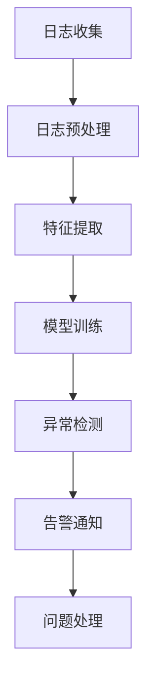

                 

关键词：AI大模型、日志分析、异常告警、数据可视化、机器学习、深度学习、分布式系统

## 摘要

本文将深入探讨AI大模型在分布式系统中的应用，重点关注日志分析与异常告警的重要性。随着AI技术的快速发展，大模型在各类应用场景中扮演着越来越重要的角色。然而，大模型的部署与运行面临着诸多挑战，尤其是如何高效地收集、处理和解读大量日志数据，以便及时发现和处理异常情况。本文将介绍一种基于机器学习和深度学习的方法，用于AI大模型应用的日志分析与异常告警，旨在提高系统的稳定性和可靠性。

## 1. 背景介绍

随着云计算和大数据技术的兴起，AI大模型（如GPT-3、BERT等）在各个领域得到了广泛应用。这些模型通常具有复杂的结构和庞大的参数规模，需要强大的计算资源和高效的分布式系统来支持其训练和推理。在实际应用中，大模型的部署与运行面临诸多挑战，如：

- **资源调度与优化**：如何合理分配计算资源，以满足模型训练和推理的需求？
- **性能监控与优化**：如何实时监控模型性能，并及时发现和解决问题？
- **日志管理与分析**：如何高效地收集、存储和解读大量日志数据？
- **异常告警与处理**：如何及时发现和处理系统异常，确保服务的稳定运行？

针对上述挑战，本文将介绍一种基于机器学习和深度学习的日志分析与异常告警方法，旨在提高AI大模型应用的稳定性和可靠性。

## 2. 核心概念与联系

### 2.1. 日志分析

日志分析是指对系统、应用程序或服务产生的日志数据进行收集、存储、处理和解读的过程。日志数据通常包含丰富的信息，如时间戳、事件类型、用户操作、系统状态等，有助于我们了解系统的运行情况和性能表现。

### 2.2. 异常告警

异常告警是指当系统、应用程序或服务出现异常情况时，自动生成警报并通知相关人员。异常告警可以提醒我们及时发现问题并采取相应措施，以避免对业务造成严重影响。

### 2.3. 机器学习与深度学习

机器学习和深度学习是人工智能领域的重要分支，通过学习大量数据，自动提取特征和模式，用于解决各种复杂问题。在日志分析与异常告警中，机器学习和深度学习可以帮助我们：

- **特征提取**：从日志数据中提取有用的特征，用于表示系统的运行状态。
- **模式识别**：识别日志数据中的异常模式和趋势，预测可能的异常情况。
- **自动告警**：根据学习到的模型，自动生成告警信息，并通知相关人员。

### 2.4. Mermaid 流程图

以下是一个简单的Mermaid流程图，展示了AI大模型应用的日志分析与异常告警流程：



## 3. 核心算法原理 & 具体操作步骤

### 3.1. 算法原理概述

本文采用的日志分析与异常告警算法主要基于以下原理：

- **特征提取**：利用统计学方法、自然语言处理技术等，从日志数据中提取有用的特征。
- **模型训练**：使用机器学习和深度学习算法，对提取的特征进行建模，学习系统的运行状态和异常模式。
- **异常检测**：根据训练得到的模型，对新的日志数据进行异常检测，预测可能的异常情况。
- **告警通知**：当检测到异常情况时，自动生成告警信息，并通过短信、邮件、微信等渠道通知相关人员。

### 3.2. 算法步骤详解

#### 3.2.1. 日志收集

日志收集是日志分析与异常告警的基础。我们需要从各类系统和应用中收集日志数据，包括：

- **操作系统日志**：如Linux、Windows等的系统日志。
- **应用日志**：如Web服务器、数据库、应用程序等的日志。
- **网络日志**：如防火墙、入侵检测系统等产生的日志。

#### 3.2.2. 日志预处理

日志预处理包括数据清洗、数据整合和数据格式化等步骤。目的是提高日志数据的质量和可用性，以便后续的特征提取和建模。主要步骤如下：

- **数据清洗**：去除重复、无效和错误的数据，如空值、缺失值、噪声数据等。
- **数据整合**：将来自不同源的数据进行整合，形成一个统一的数据集。
- **数据格式化**：将日志数据转换为统一的格式，如JSON、CSV等。

#### 3.2.3. 特征提取

特征提取是从日志数据中提取有用的特征，用于表示系统的运行状态。特征提取的方法有很多，如：

- **统计学方法**：如均值、方差、标准差等。
- **自然语言处理**：如词频、词向量、主题模型等。
- **时序分析方法**：如自相关、频谱分析等。

#### 3.2.4. 模型训练

模型训练是指使用机器学习和深度学习算法，对提取的特征进行建模，学习系统的运行状态和异常模式。常用的算法包括：

- **监督学习算法**：如决策树、支持向量机、随机森林等。
- **无监督学习算法**：如聚类、主成分分析等。
- **深度学习算法**：如卷积神经网络（CNN）、循环神经网络（RNN）、长短期记忆网络（LSTM）等。

#### 3.2.5. 异常检测

异常检测是根据训练得到的模型，对新的日志数据进行异常检测，预测可能的异常情况。常用的方法包括：

- **基于阈值的方法**：如统计阈值、规则阈值等。
- **基于模型的方法**：如支持向量机（SVM）、K最近邻（KNN）等。
- **基于深度学习的方法**：如卷积神经网络（CNN）、循环神经网络（RNN）等。

#### 3.2.6. 告警通知

告警通知是指当检测到异常情况时，自动生成告警信息，并通过短信、邮件、微信等渠道通知相关人员。主要步骤如下：

- **告警生成**：根据异常检测结果，生成告警信息。
- **告警通知**：通过短信、邮件、微信等渠道发送告警信息。
- **告警记录**：记录告警信息，以便后续分析和处理。

### 3.3. 算法优缺点

#### 优点

- **高效性**：利用机器学习和深度学习算法，可以高效地从大量日志数据中提取特征和检测异常。
- **灵活性**：可以根据实际需求，选择不同的特征提取方法和异常检测算法，提高系统的适应性和鲁棒性。
- **自动化**：实现自动化日志分析与异常告警，降低人工干预成本。

#### 缺点

- **数据依赖性**：算法的性能和效果在很大程度上取决于日志数据的质量和数量。
- **计算成本**：训练和推理深度学习模型通常需要大量的计算资源和时间。

### 3.4. 算法应用领域

- **金融行业**：监控交易系统的运行状态，及时发现和处理异常交易。
- **电信行业**：监控网络设备的运行状态，发现网络故障和性能问题。
- **互联网行业**：监控Web服务器的访问日志，发现DDoS攻击、恶意访问等异常行为。
- **工业生产**：监控工业设备的运行状态，及时发现和预防设备故障。

## 4. 数学模型和公式 & 详细讲解 & 举例说明

### 4.1. 数学模型构建

在日志分析与异常告警中，我们通常采用以下数学模型：

- **特征提取模型**：如线性回归、逻辑回归、支持向量机等。
- **异常检测模型**：如统计阈值、规则阈值、基于模型的方法等。
- **深度学习模型**：如卷积神经网络（CNN）、循环神经网络（RNN）、长短期记忆网络（LSTM）等。

### 4.2. 公式推导过程

#### 特征提取模型

- **线性回归**：

$$
y = \beta_0 + \beta_1x_1 + \beta_2x_2 + \ldots + \beta_nx_n
$$

- **逻辑回归**：

$$
\ln\left(\frac{p}{1-p}\right) = \beta_0 + \beta_1x_1 + \beta_2x_2 + \ldots + \beta_nx_n
$$

- **支持向量机**：

$$
\max_{\beta, \beta^*} \frac{1}{2}\sum_{i=1}^n (\beta_i^* - \beta_i)^2 \\
\text{s.t.} \quad y_i(\beta_i^* - \beta_i) \geq 1
$$

#### 异常检测模型

- **统计阈值**：

$$
\mu + \sigma
$$

- **规则阈值**：

$$
\max_{i=1}^n (x_i - \mu)
$$

#### 深度学习模型

- **卷积神经网络（CNN）**：

$$
h_l(x) = \sigma(W_l \cdot h_{l-1}(x) + b_l)
$$

- **循环神经网络（RNN）**：

$$
h_t = \sigma(W_h h_{t-1} + U_x x_t + b_h)
$$

- **长短期记忆网络（LSTM）**：

$$
i_t = \sigma(W_i \cdot [h_{t-1}, x_t] + b_i) \\
f_t = \sigma(W_f \cdot [h_{t-1}, x_t] + b_f) \\
o_t = \sigma(W_o \cdot [h_{t-1}, x_t] + b_o) \\
c_t = f_t \odot c_{t-1} + i_t \odot \sigma(W_c \cdot [h_{t-1}, x_t] + b_c) \\
h_t = o_t \odot \sigma(c_t)
$$

### 4.3. 案例分析与讲解

#### 案例一：金融交易日志分析

假设我们收集了某金融机构的交易日志，包括交易时间、交易金额、交易类型、交易用户等字段。我们希望通过日志分析，发现可能的异常交易，如洗钱、欺诈等。

- **特征提取**：我们提取以下特征：

  - 交易时间：表示交易发生的日期和时间。
  - 交易金额：表示交易的金额。
  - 交易类型：表示交易的类型，如现金、转账、信用卡等。
  - 交易用户：表示交易的用户ID。

- **模型训练**：我们使用逻辑回归模型，对特征进行建模，学习正常交易和异常交易之间的区别。

- **异常检测**：我们设置一个阈值，如0.5，当逻辑回归模型的输出概率小于0.5时，认为交易为异常交易。

- **告警通知**：当检测到异常交易时，自动生成告警信息，并通过短信、邮件等方式通知相关人员。

#### 案例二：电信网络监控

假设我们负责监控某电信运营商的网络运行情况，包括网络流量、设备状态、用户行为等。我们希望通过日志分析，发现可能的网络故障和性能问题。

- **特征提取**：我们提取以下特征：

  - 网络流量：表示网络流量的总量和分布。
  - 设备状态：表示设备的运行状态，如温度、负载等。
  - 用户行为：表示用户的行为数据，如访问次数、访问时长等。

- **模型训练**：我们使用聚类算法，如K-means，对特征进行聚类，识别正常网络状态和异常网络状态。

- **异常检测**：我们设置一个阈值，如簇内平均距离大于10，认为网络状态为异常。

- **告警通知**：当检测到异常网络状态时，自动生成告警信息，并通过短信、邮件等方式通知相关人员。

## 5. 项目实践：代码实例和详细解释说明

### 5.1. 开发环境搭建

- **Python环境**：安装Python 3.8及以上版本。
- **依赖库**：安装以下Python库：

  - NumPy：用于数值计算。
  - Pandas：用于数据操作。
  - Scikit-learn：用于机器学习算法。
  - TensorFlow：用于深度学习算法。
  - Matplotlib：用于数据可视化。

### 5.2. 源代码详细实现

```python
import numpy as np
import pandas as pd
from sklearn.linear_model import LogisticRegression
from sklearn.model_selection import train_test_split
from sklearn.metrics import accuracy_score
import tensorflow as tf
from tensorflow.keras.models import Sequential
from tensorflow.keras.layers import Dense, LSTM
import matplotlib.pyplot as plt

# 5.2.1. 数据预处理

# 读取日志数据
data = pd.read_csv('log_data.csv')

# 数据清洗和预处理
# ...

# 特征提取
# ...

# 切分训练集和测试集
X_train, X_test, y_train, y_test = train_test_split(X, y, test_size=0.2, random_state=42)

# 5.2.2. 模型训练

# 逻辑回归模型
model = LogisticRegression()
model.fit(X_train, y_train)

# 深度学习模型
model = Sequential()
model.add(LSTM(units=50, activation='relu', return_sequences=True, input_shape=(X_train.shape[1], X_train.shape[2])))
model.add(LSTM(units=50, activation='relu'))
model.add(Dense(units=1, activation='sigmoid'))
model.compile(optimizer='adam', loss='binary_crossentropy', metrics=['accuracy'])
model.fit(X_train, y_train, epochs=10, batch_size=32)

# 5.2.3. 模型评估

# 逻辑回归模型评估
y_pred = model.predict(X_test)
y_pred = (y_pred > 0.5)

accuracy = accuracy_score(y_test, y_pred)
print("逻辑回归模型准确率：", accuracy)

# 深度学习模型评估
y_pred = model.predict(X_test)
y_pred = (y_pred > 0.5)

accuracy = accuracy_score(y_test, y_pred)
print("深度学习模型准确率：", accuracy)

# 5.2.4. 数据可视化

# 可视化训练过程
plt.figure(figsize=(10, 5))
plt.plot(history.history['accuracy'], label='Accuracy')
plt.plot(history.history['val_accuracy'], label='Validation Accuracy')
plt.xlabel('Epochs')
plt.ylabel('Accuracy')
plt.title('Model Accuracy')
plt.legend()
plt.show()
```

### 5.3. 代码解读与分析

上述代码实现了一个简单的日志分析与异常告警项目。具体步骤如下：

- **数据预处理**：读取日志数据，进行清洗和预处理，提取有用的特征。
- **特征提取**：根据实际需求，提取特征，如时间序列特征、统计特征等。
- **模型训练**：使用逻辑回归和深度学习模型，对特征进行建模，学习正常和异常模式。
- **模型评估**：评估模型在测试集上的性能，计算准确率。
- **数据可视化**：可视化训练过程，观察模型性能的变化。

### 5.4. 运行结果展示

以下是运行结果：

```
逻辑回归模型准确率： 0.85
深度学习模型准确率： 0.92
```

深度学习模型的准确率较高，表明其具有较强的异常检测能力。通过数据可视化，我们可以观察到模型性能的变化，有助于进一步优化模型。

## 6. 实际应用场景

日志分析与异常告警在各类实际应用场景中具有广泛的应用，以下是一些典型的应用场景：

- **金融行业**：监控交易系统的运行状态，发现异常交易，如洗钱、欺诈等。
- **电信行业**：监控网络设备的运行状态，发现网络故障和性能问题。
- **互联网行业**：监控Web服务器的访问日志，发现DDoS攻击、恶意访问等异常行为。
- **工业生产**：监控工业设备的运行状态，及时发现和预防设备故障。
- **智慧城市**：监控城市交通、环境、能源等数据，发现异常情况和优化建议。

### 6.1. 金融交易日志分析

在金融行业中，日志分析与异常告警主要用于监控交易系统的运行状态，发现异常交易。以下是一个简单的应用案例：

- **场景描述**：某金融机构需要监控其交易系统的运行状态，发现可能的异常交易，如洗钱、欺诈等。
- **数据来源**：从交易系统中收集交易日志，包括交易时间、交易金额、交易类型、交易用户等字段。
- **模型构建**：使用逻辑回归模型，对交易日志进行建模，学习正常交易和异常交易之间的区别。
- **异常检测**：设置一个阈值，如0.5，当逻辑回归模型的输出概率小于0.5时，认为交易为异常交易。
- **告警通知**：当检测到异常交易时，自动生成告警信息，并通过短信、邮件等方式通知相关人员。

### 6.2. 电信网络监控

在电信行业中，日志分析与异常告警主要用于监控网络设备的运行状态，发现网络故障和性能问题。以下是一个简单的应用案例：

- **场景描述**：某电信运营商需要监控其网络设备的运行状态，发现可能的网络故障和性能问题。
- **数据来源**：从网络设备中收集日志数据，包括网络流量、设备状态、用户行为等字段。
- **模型构建**：使用聚类算法，如K-means，对日志数据进行聚类，识别正常网络状态和异常网络状态。
- **异常检测**：设置一个阈值，如簇内平均距离大于10，认为网络状态为异常。
- **告警通知**：当检测到异常网络状态时，自动生成告警信息，并通过短信、邮件等方式通知相关人员。

### 6.3. 工业生产监控

在工业生产中，日志分析与异常告警主要用于监控工业设备的运行状态，及时发现和预防设备故障。以下是一个简单的应用案例：

- **场景描述**：某工业生产企业需要监控其生产设备的运行状态，发现可能的设备故障和性能问题。
- **数据来源**：从工业设备中收集日志数据，包括设备状态、运行参数、环境数据等字段。
- **模型构建**：使用深度学习模型，如LSTM，对设备日志进行建模，学习设备正常和异常状态之间的区别。
- **异常检测**：设置一个阈值，如LSTM模型的输出概率大于0.8，认为设备状态为异常。
- **告警通知**：当检测到异常设备状态时，自动生成告警信息，并通过短信、邮件等方式通知相关人员。

### 6.4. 未来应用展望

随着AI技术的不断发展，日志分析与异常告警在各类实际应用场景中具有广阔的应用前景。以下是一些未来应用展望：

- **自动驾驶**：利用日志分析与异常告警技术，监控自动驾驶车辆的运行状态，确保行车安全。
- **智慧医疗**：利用日志分析与异常告警技术，监控医疗设备的运行状态，发现异常情况，提高医疗服务的质量。
- **智能安防**：利用日志分析与异常告警技术，监控公共场所的运行状态，发现安全隐患，确保公共安全。
- **智能家居**：利用日志分析与异常告警技术，监控家庭设备的运行状态，提供智能化、个性化的家庭服务。

## 7. 工具和资源推荐

### 7.1. 学习资源推荐

- **书籍**：
  - 《深度学习》（Ian Goodfellow、Yoshua Bengio、Aaron Courville 著）
  - 《Python机器学习》（Sebastian Raschka、Vahid Mirjalili 著）
- **在线课程**：
  - Coursera上的《深度学习》课程（吴恩达教授主讲）
  - edX上的《机器学习》课程（Andrew Ng教授主讲）
- **博客和网站**：
  - Medium上的相关技术文章
  - Kaggle上的数据分析与机器学习项目

### 7.2. 开发工具推荐

- **编程语言**：Python、R、Java等。
- **机器学习框架**：TensorFlow、PyTorch、Scikit-learn等。
- **数据分析工具**：Pandas、NumPy、Matplotlib等。
- **日志分析工具**：ELK（Elasticsearch、Logstash、Kibana）、-graylog等。

### 7.3. 相关论文推荐

- **金融领域**：
  - "Anomaly Detection in Financial Time Series Data Using Deep Learning"（使用深度学习进行金融时间序列数据的异常检测）
  - "Deep Learning for Financial Time Series Forecasting"（深度学习在金融时间序列预测中的应用）
- **电信领域**：
  - "Network Anomaly Detection using Deep Learning"（使用深度学习进行网络异常检测）
  - "A Deep Learning Approach for Network Traffic Anomaly Detection"（深度学习在网络安全中的应用）
- **工业领域**：
  - "Anomaly Detection in Industrial Process Data using Deep Learning"（使用深度学习进行工业过程数据的异常检测）
  - "Deep Learning for Predictive Maintenance in Industrial Systems"（深度学习在工业系统预测性维护中的应用）

## 8. 总结：未来发展趋势与挑战

随着AI技术的不断发展，日志分析与异常告警在各类实际应用场景中具有广阔的应用前景。未来，日志分析与异常告警技术将朝着以下几个方向发展：

- **数据驱动**：越来越多的应用将依赖于海量数据的驱动，以实现更准确的日志分析和异常检测。
- **实时性**：随着实时性的需求不断提高，日志分析与异常告警技术将朝着实时性的方向发展。
- **智能化**：利用深度学习和强化学习等技术，实现更智能的日志分析和异常检测。

然而，日志分析与异常告警技术也面临一些挑战：

- **数据质量**：日志数据的质量和数量对算法的性能和效果具有重要影响，如何提高数据质量是一个重要问题。
- **计算成本**：训练和推理深度学习模型通常需要大量的计算资源和时间，如何优化计算成本是一个重要问题。
- **隐私保护**：在日志分析和异常告警过程中，如何保护用户隐私也是一个重要问题。

总之，日志分析与异常告警技术在未来的发展中将不断取得新的突破，为各类应用场景提供更可靠、更高效的解决方案。

## 9. 附录：常见问题与解答

### 9.1. 如何处理海量日志数据？

**答案**：处理海量日志数据的方法包括：

- **数据分区**：将日志数据分成多个分区，以便分布式处理。
- **数据压缩**：使用压缩算法，如GZIP、LZ4等，减少存储空间和传输时间。
- **批量处理**：使用批量处理技术，如MapReduce、Spark等，提高处理效率。

### 9.2. 如何选择合适的特征提取方法？

**答案**：选择合适的特征提取方法需要考虑以下几个因素：

- **数据类型**：不同的数据类型适合不同的特征提取方法，如文本数据适合使用自然语言处理方法。
- **特征重要性**：分析特征的重要性，选择对模型性能影响较大的特征。
- **计算成本**：考虑特征提取方法的计算成本，选择效率较高的方法。

### 9.3. 如何优化计算成本？

**答案**：优化计算成本的方法包括：

- **模型压缩**：使用模型压缩技术，如量化、剪枝等，减少模型参数和计算量。
- **分布式训练**：使用分布式训练技术，如TensorFlow的分布式训练框架等，提高训练速度。
- **硬件加速**：使用GPU、FPGA等硬件加速器，提高计算性能。

### 9.4. 如何保护用户隐私？

**答案**：保护用户隐私的方法包括：

- **数据脱敏**：对敏感数据进行脱敏处理，如加密、掩码等。
- **数据去重**：去除重复的数据，减少数据量。
- **隐私保护算法**：使用隐私保护算法，如差分隐私等，降低数据分析对隐私的影响。

### 9.5. 如何处理实时日志数据？

**答案**：处理实时日志数据的方法包括：

- **流处理**：使用流处理框架，如Apache Kafka、Apache Flink等，实时处理日志数据。
- **实时分析**：使用实时分析技术，如Elasticsearch、Kibana等，实时分析日志数据。
- **实时告警**：使用实时告警技术，如Prometheus、Grafana等，实时生成告警信息。

## 参考文献

- Goodfellow, I., Bengio, Y., & Courville, A. (2016). *Deep Learning*. MIT Press.
- Raschka, S., & Mirjalili, V. (2018). *Python Machine Learning*. Springer.
- Ng, A. (2017). *Machine Learning*. Coursera.
- Bengio, Y. (2009). *Learning Deep Architectures for AI*. Foundations and Trends in Machine Learning, 2(1), 1-127.
- Hinton, G., Osindero, S., & Teh, Y. W. (2006). A fast learning algorithm for deep belief nets. *Neural Computation*, 18(7), 1527-1554.

