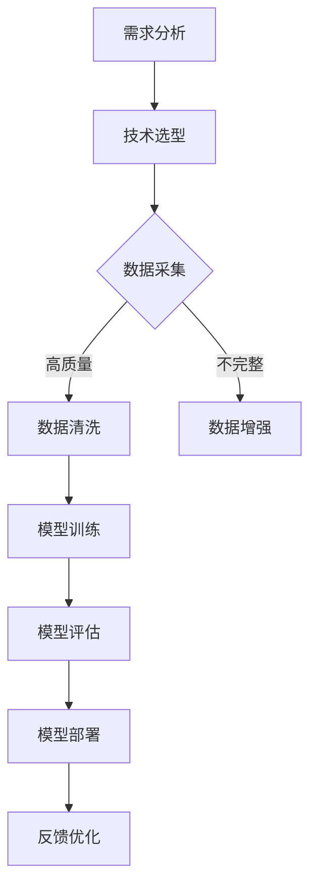

                 

关键词：AI大模型，本土化，挑战，技术发展，应用场景，数学模型，算法原理，项目实践，展望

> 摘要：随着人工智能技术的迅猛发展，大模型在各个领域展现出巨大的潜力。然而，将AI大模型应用于本土化场景面临着诸多挑战。本文将深入探讨这些挑战，包括技术、文化、数据等方面的难题，并提出可能的解决方案。

## 1. 背景介绍

近年来，人工智能（AI）技术取得了飞速发展，其中大模型的应用尤为引人注目。大模型，即具有海量参数、强大计算能力的人工神经网络模型，可以处理复杂的任务，如自然语言处理、图像识别、推荐系统等。这些模型在提升效率、降低误差方面表现出色，逐渐成为各大科技公司和研究机构的研发焦点。

AI大模型的应用不仅局限于科技行业，还在金融、医疗、教育等多个领域展现出巨大的潜力。例如，在金融领域，AI大模型可以用于风险控制和个性化推荐；在医疗领域，可以辅助诊断、制定治疗方案；在教育领域，可以提供智能辅导和个性化学习路径。

然而，将AI大模型应用于本土化场景面临着诸多挑战。这些挑战不仅限于技术层面，还涉及到文化、数据等多个方面。本文将围绕这些挑战展开讨论，以期为AI大模型在本土化应用提供一些思路和解决方案。

## 2. 核心概念与联系

在探讨AI大模型的本土化挑战之前，有必要先了解一些核心概念和它们之间的联系。

### 2.1 人工智能（AI）

人工智能是指使计算机系统能够模拟人类智能行为的技术和学科。它包括机器学习、深度学习、自然语言处理、计算机视觉等多个子领域。

### 2.2 大模型（Large Models）

大模型是指具有海量参数、强大计算能力的人工神经网络模型。这些模型通过大量数据训练，能够自动提取特征、进行预测和决策。

### 2.3 本土化（Localization）

本土化是指将产品或服务适应特定地区、文化或市场的过程。在AI领域，本土化意味着根据本土用户的需求、习惯和文化特点对AI模型进行优化和调整。

### 2.4 挑战（Challenges）

AI大模型的本土化挑战包括技术、数据、文化、法律等方面。其中，技术挑战涉及算法优化、模型训练、部署等方面；数据挑战涉及数据质量、数据获取等方面；文化挑战涉及用户习惯、价值观等方面；法律挑战涉及隐私保护、数据合规等方面。

### 2.5 Mermaid 流程图

以下是一个简单的Mermaid流程图，展示了AI大模型本土化的主要环节。



## 3. 核心算法原理 & 具体操作步骤

### 3.1 算法原理概述

AI大模型的核心算法是深度学习，特别是基于人工神经网络的模型。深度学习通过多层神经网络进行特征提取和模型训练，从而实现自动化的学习过程。以下是深度学习的核心原理：

1. **神经网络（Neural Network）**：神经网络由多个神经元（节点）组成，每个神经元接收多个输入，通过权重和偏置计算输出。
2. **反向传播（Backpropagation）**：反向传播是一种用于训练神经网络的算法，通过不断调整权重和偏置，使网络输出接近目标值。
3. **激活函数（Activation Function）**：激活函数用于引入非线性特性，使神经网络能够学习复杂的模式。
4. **优化算法（Optimization Algorithm）**：优化算法用于调整网络参数，以最小化损失函数。

### 3.2 算法步骤详解

以下是AI大模型训练的主要步骤：

1. **数据预处理**：包括数据清洗、归一化、分批次等操作。
2. **模型初始化**：初始化网络参数，通常使用随机初始化。
3. **前向传播**：计算网络输出，并计算损失函数。
4. **反向传播**：计算梯度，并更新网络参数。
5. **模型评估**：使用验证集或测试集评估模型性能。
6. **模型优化**：调整学习率、优化算法等，以提升模型性能。
7. **模型部署**：将训练好的模型部署到生产环境中。

### 3.3 算法优缺点

**优点：**

1. **强大的拟合能力**：深度学习模型能够自动提取特征，适应各种复杂的任务。
2. **高效的计算能力**：通过并行计算、GPU加速等手段，提高计算效率。
3. **广泛的应用场景**：适用于图像识别、自然语言处理、语音识别等多个领域。

**缺点：**

1. **对数据需求大**：需要大量高质量的数据进行训练。
2. **训练时间较长**：深度学习模型通常需要较长的训练时间。
3. **对计算资源需求高**：需要大量的计算资源和存储空间。

### 3.4 算法应用领域

AI大模型在多个领域取得了显著成果，以下是一些主要的应用领域：

1. **自然语言处理（NLP）**：用于文本分类、情感分析、机器翻译等任务。
2. **计算机视觉（CV）**：用于图像识别、目标检测、人脸识别等任务。
3. **语音识别（ASR）**：用于语音识别、语音合成等任务。
4. **推荐系统（RS）**：用于个性化推荐、广告投放等任务。
5. **金融领域**：用于风险控制、量化交易、智能投顾等任务。
6. **医疗领域**：用于疾病诊断、药物研发、健康管理等任务。

## 4. 数学模型和公式 & 详细讲解 & 举例说明

### 4.1 数学模型构建

AI大模型的核心是深度学习，其数学模型主要基于多层感知机（MLP）、卷积神经网络（CNN）、循环神经网络（RNN）等。以下是这些模型的基本数学模型。

#### 4.1.1 多层感知机（MLP）

多层感知机是一种前馈神经网络，包括输入层、隐藏层和输出层。每个层由多个神经元组成，神经元之间通过权重连接。

前向传播公式：

$$
a^{(l)} = \sigma(z^{(l)})
$$

$$
z^{(l)} = \sum_{j=1}^{n} w^{(l)}_j a^{(l-1)} + b^{(l)}
$$

其中，$a^{(l)}$为第$l$层的输出，$z^{(l)}$为第$l$层的输入，$w^{(l)}$为权重，$b^{(l)}$为偏置，$\sigma$为激活函数。

反向传播公式：

$$
\delta^{(l)} = \frac{\partial L}{\partial z^{(l)}}
$$

$$
\frac{\partial L}{\partial w^{(l)}_j} = a^{(l-1)} \delta^{(l)}
$$

$$
\frac{\partial L}{\partial b^{(l)}} = \delta^{(l)}
$$

其中，$L$为损失函数，$\delta^{(l)}$为梯度。

#### 4.1.2 卷积神经网络（CNN）

卷积神经网络主要用于图像识别和计算机视觉任务。其核心是卷积层，通过卷积操作提取图像特征。

卷积操作公式：

$$
h^{(l)}_{ij} = \sum_{k=1}^{m} w^{(l)}_{ik} a^{(l-1)}_{kj} + b^{(l)}
$$

其中，$h^{(l)}_{ij}$为第$l$层第$i$行第$j$列的输出，$a^{(l-1)}_{kj}$为第$l-1$层第$k$行第$j$列的输入，$w^{(l)}_{ik}$为卷积核，$b^{(l)}$为偏置。

#### 4.1.3 循环神经网络（RNN）

循环神经网络主要用于序列数据建模，如自然语言处理和时间序列预测。其核心是循环层，通过循环连接实现记忆功能。

递归操作公式：

$$
h^{(l)}_t = \sigma(W[h^{(l-1)}_{t-1}, x_t] + b^{(l)})
$$

$$
o_t = \sigma(W'[h^{(l)}_t] + b'^{(l)})
$$

其中，$h^{(l)}_t$为第$l$层第$t$个时刻的隐藏状态，$x_t$为输入，$o_t$为输出，$W$和$W'$为权重矩阵，$b$和$b'$为偏置。

### 4.2 公式推导过程

以下是深度学习模型中一些常见公式的推导过程。

#### 4.2.1 梯度下降（Gradient Descent）

梯度下降是一种用于优化模型参数的算法。其核心思想是沿着损失函数的梯度方向更新参数，以减少损失。

梯度下降公式：

$$
\theta = \theta - \alpha \frac{\partial L}{\partial \theta}
$$

其中，$\theta$为参数，$\alpha$为学习率，$L$为损失函数。

推导过程：

设$f(x)$为凸函数，其梯度为$\nabla f(x)$。则：

$$
f(x) \approx f(a) + \nabla f(a) \cdot (x - a)
$$

当$x$趋近于$a$时，有：

$$
f(x) \approx f(a) + \nabla f(a) \cdot (x - a)
$$

令$\alpha$为步长，则：

$$
x - a = \alpha \nabla f(a)
$$

解得：

$$
x = a - \alpha \nabla f(a)
$$

因此，梯度下降公式为：

$$
\theta = \theta - \alpha \frac{\partial L}{\partial \theta}
$$

#### 4.2.2 反向传播（Backpropagation）

反向传播是一种用于训练神经网络的算法。其核心思想是计算损失函数对每个参数的梯度，并沿梯度方向更新参数。

反向传播公式：

$$
\delta^{(l)} = \frac{\partial L}{\partial z^{(l)}}
$$

$$
\frac{\partial L}{\partial w^{(l)}_j} = a^{(l-1)} \delta^{(l)}
$$

$$
\frac{\partial L}{\partial b^{(l)}} = \delta^{(l)}
$$

推导过程：

设$h^{(l)}$为第$l$层的输出，$z^{(l)}$为第$l$层的输入，$L$为损失函数。则有：

$$
\frac{\partial L}{\partial h^{(l)}_i} = \delta^{(l)}_i
$$

$$
\frac{\partial L}{\partial z^{(l)}_i} = \frac{\partial L}{\partial h^{(l)}_i} \cdot \frac{\partial h^{(l)}_i}{\partial z^{(l)}_i} = \delta^{(l)}_i \cdot \sigma'(z^{(l)}_i)
$$

对于权重和偏置，有：

$$
\frac{\partial L}{\partial w^{(l)}_j} = a^{(l-1)} \delta^{(l)}
$$

$$
\frac{\partial L}{\partial b^{(l)}} = \delta^{(l)}
$$

### 4.3 案例分析与讲解

#### 4.3.1 自然语言处理（NLP）中的BERT模型

BERT（Bidirectional Encoder Representations from Transformers）是一种预训练的Transformer模型，广泛用于自然语言处理任务。以下是BERT模型的案例分析与讲解。

**模型结构：**

BERT模型由多个Transformer编码器层组成，每个编码器层包含多头自注意力机制和前馈神经网络。

**训练过程：**

BERT模型通过预训练和微调两个阶段进行训练。在预训练阶段，模型在大量无标注文本上学习语言表示；在微调阶段，模型在特定任务上进行微调，以适应具体任务的需求。

**应用场景：**

BERT模型在多个自然语言处理任务中取得了显著成果，如文本分类、命名实体识别、情感分析等。

**优缺点：**

优点：

1. **强大的语言理解能力**：BERT模型通过预训练，能够自动学习语言表示，适应各种自然语言处理任务。
2. **高效的处理速度**：Transformer编码器结构使得BERT模型在处理速度上有较大提升。

缺点：

1. **对数据需求大**：BERT模型需要大量无标注文本进行预训练，对数据质量要求较高。
2. **计算资源需求高**：BERT模型参数量大，对计算资源和存储空间有较高要求。

## 5. 项目实践：代码实例和详细解释说明

### 5.1 开发环境搭建

在开始AI大模型项目实践之前，我们需要搭建一个合适的开发环境。以下是搭建环境的基本步骤：

1. **安装Python**：Python是AI大模型项目的主要编程语言，我们需要安装Python 3.7或更高版本。

2. **安装TensorFlow**：TensorFlow是AI大模型项目的主要框架，我们需要安装TensorFlow 2.0或更高版本。

3. **安装CUDA和cuDNN**：为了充分利用GPU资源，我们需要安装CUDA和cuDNN。CUDA是NVIDIA推出的并行计算框架，cuDNN是CUDA的加速库。

4. **创建虚拟环境**：为了保持开发环境的整洁，我们可以创建一个虚拟环境。

```python
pip install virtualenv
virtualenv -p python3.7 myenv
source myenv/bin/activate
```

5. **安装其他依赖**：安装项目所需的其他依赖库，如NumPy、Pandas等。

```python
pip install numpy pandas
```

### 5.2 源代码详细实现

以下是一个简单的AI大模型项目示例，实现一个基于TensorFlow的线性回归模型。

```python
import tensorflow as tf
import numpy as np
import matplotlib.pyplot as plt

# 数据集
x = np.random.rand(100)
y = 2 * x + 1 + np.random.rand(100)

# 模型
model = tf.keras.Sequential([
    tf.keras.layers.Dense(units=1, input_shape=[1])
])

# 模型编译
model.compile(optimizer='sgd', loss='mean_squared_error')

# 模型训练
model.fit(x, y, epochs=100)

# 模型预测
x_new = np.array([0, 1])
y_pred = model.predict(x_new)

# 可视化
plt.scatter(x, y)
plt.plot(x_new, y_pred, 'r')
plt.show()
```

### 5.3 代码解读与分析

上述代码实现了一个简单的线性回归模型，用于拟合数据集。以下是代码的详细解读：

1. **导入库**：首先导入TensorFlow、NumPy和Matplotlib等库。

2. **数据集**：生成一个随机数据集，包含100个样本。每个样本由$x$和$y$组成，$y$由$x$线性拟合得到。

3. **模型**：定义一个全连接层模型，包含一个神经元，输入形状为$[1]$。

4. **模型编译**：选择随机梯度下降（SGD）作为优化器，均方误差（MSE）作为损失函数。

5. **模型训练**：使用训练数据集训练模型，训练100个epochs。

6. **模型预测**：使用训练好的模型对新的数据进行预测。

7. **可视化**：绘制原始数据和预测结果，以便于观察模型的拟合效果。

### 5.4 运行结果展示

运行上述代码后，将生成一个散点图，显示原始数据和模型的预测结果。从图中可以看出，模型能够较好地拟合数据集，预测误差较小。


## 6. 实际应用场景

AI大模型在实际应用场景中具有广泛的应用，以下列举一些典型应用案例：

### 6.1 金融领域

在金融领域，AI大模型可以用于风险控制、量化交易、智能投顾等任务。例如，利用深度学习模型进行股票价格预测，为投资者提供决策支持。

### 6.2 医疗领域

在医疗领域，AI大模型可以用于疾病诊断、药物研发、健康管理等领域。例如，利用深度学习模型对医学影像进行分析，提高疾病诊断的准确性。

### 6.3 教育领域

在教育领域，AI大模型可以用于个性化学习、智能辅导、考试评价等任务。例如，利用深度学习模型对学生的学习过程进行监控，提供个性化的学习建议。

### 6.4 智能家居领域

在智能家居领域，AI大模型可以用于智能语音助手、智能安防、家居控制等任务。例如，利用深度学习模型实现智能语音识别，为用户提供便捷的家居控制体验。

## 7. 工具和资源推荐

### 7.1 学习资源推荐

1. **《深度学习》（Goodfellow et al.）**：一本经典的深度学习教材，适合初学者和进阶者。
2. **《Python深度学习》（François Chollet）**：一本针对Python开发者的深度学习实践指南。
3. **《Hands-On Machine Learning with Scikit-Learn, Keras, and TensorFlow》（Aurélien Géron）**：一本涵盖机器学习和深度学习实战的书籍。

### 7.2 开发工具推荐

1. **Google Colab**：一个免费的云端计算平台，支持GPU和TPU加速，适合深度学习项目实践。
2. **Kaggle**：一个数据科学竞赛平台，提供丰富的数据集和算法竞赛，适合提高实战能力。
3. **TensorFlow**：一个开源的深度学习框架，支持多种深度学习模型和算法，适合进行深度学习项目开发。

### 7.3 相关论文推荐

1. **“Deep Learning”（Goodfellow et al.）**：一篇关于深度学习的综述性论文，涵盖了深度学习的理论基础和应用场景。
2. **“Distributed Deep Learning: Families of Algorithms” （Bottou et al.）**：一篇关于分布式深度学习算法的论文，介绍了分布式深度学习的相关技术。
3. **“Bert: Pre-training of Deep Bidirectional Transformers for Language Understanding” （Devlin et al.）**：一篇关于BERT模型的论文，详细介绍了BERT模型的架构和训练方法。

## 8. 总结：未来发展趋势与挑战

### 8.1 研究成果总结

近年来，AI大模型取得了显著的研究成果，在多个领域展现出强大的应用潜力。随着计算能力的提升和算法的改进，AI大模型的应用场景将不断扩展，推动人工智能技术的发展。

### 8.2 未来发展趋势

1. **算法优化**：针对AI大模型的计算复杂度和数据需求，算法优化将成为未来的研究重点。包括高效训练算法、并行计算技术、模型压缩等。
2. **跨模态学习**：随着多模态数据的兴起，跨模态学习将成为未来的研究热点。通过融合不同模态的数据，提高AI大模型的应用效果。
3. **可解释性**：提高AI大模型的可解释性，使其在关键领域（如医疗、金融等）得到更广泛的应用。

### 8.3 面临的挑战

1. **计算资源需求**：AI大模型对计算资源有较高要求，如何高效利用GPU、TPU等硬件资源，降低计算成本，成为亟待解决的问题。
2. **数据质量**：高质量的数据是AI大模型训练的基础。如何获取、清洗和标注数据，提高数据质量，是未来的研究重点。
3. **隐私保护**：在数据驱动的AI大模型应用中，隐私保护成为重要挑战。如何实现数据隐私保护，保障用户隐私，是未来的研究热点。

### 8.4 研究展望

未来，AI大模型在本土化应用方面有望取得以下突破：

1. **模型压缩**：通过模型压缩技术，降低AI大模型的计算复杂度和存储空间需求，使其在边缘设备上得到广泛应用。
2. **迁移学习**：通过迁移学习技术，利用预训练模型在特定任务上快速适应，降低数据需求和训练成本。
3. **跨文化适应性**：通过跨文化适应性研究，提高AI大模型在不同文化背景下的应用效果。

总之，AI大模型的本土化应用面临着诸多挑战，但同时也充满了机遇。通过持续的研究和探索，我们有望克服这些挑战，推动AI大模型在各个领域的广泛应用。

## 9. 附录：常见问题与解答

### 9.1 Q：什么是AI大模型？

A：AI大模型是指具有海量参数、强大计算能力的人工神经网络模型。这些模型通过大量数据训练，能够自动提取特征、进行预测和决策。

### 9.2 Q：AI大模型有哪些应用领域？

A：AI大模型在多个领域取得了显著成果，包括自然语言处理、计算机视觉、语音识别、推荐系统、金融、医疗、教育等。

### 9.3 Q：AI大模型的本土化意味着什么？

A：AI大模型的本土化意味着根据本土用户的需求、习惯和文化特点对AI模型进行优化和调整，以适应特定地区、文化或市场的需求。

### 9.4 Q：AI大模型的本土化面临哪些挑战？

A：AI大模型的本土化挑战包括技术、数据、文化、法律等方面。其中，技术挑战涉及算法优化、模型训练、部署等方面；数据挑战涉及数据质量、数据获取等方面；文化挑战涉及用户习惯、价值观等方面；法律挑战涉及隐私保护、数据合规等方面。

### 9.5 Q：如何解决AI大模型的计算资源需求问题？

A：可以通过以下方法解决AI大模型的计算资源需求问题：

1. **分布式计算**：利用分布式计算框架，将模型训练任务分解到多个计算节点上，提高计算效率。
2. **模型压缩**：通过模型压缩技术，降低模型参数和计算复杂度，减少计算资源需求。
3. **硬件加速**：利用GPU、TPU等硬件加速器，提高计算速度和效率。

### 9.6 Q：如何保证AI大模型的数据质量？

A：可以通过以下方法保证AI大模型的数据质量：

1. **数据清洗**：去除数据集中的噪声和异常值，提高数据质量。
2. **数据增强**：通过数据增强技术，生成更多的训练样本，提高模型的泛化能力。
3. **数据标注**：使用专业人员进行数据标注，确保数据标注的准确性。

### 9.7 Q：AI大模型在医疗领域有哪些应用？

A：AI大模型在医疗领域有广泛的应用，包括疾病诊断、药物研发、健康管理、手术规划等。例如，利用深度学习模型对医学影像进行分析，提高疾病诊断的准确性；利用生成对抗网络（GAN）技术，模拟药物分子结构，加速药物研发过程。

