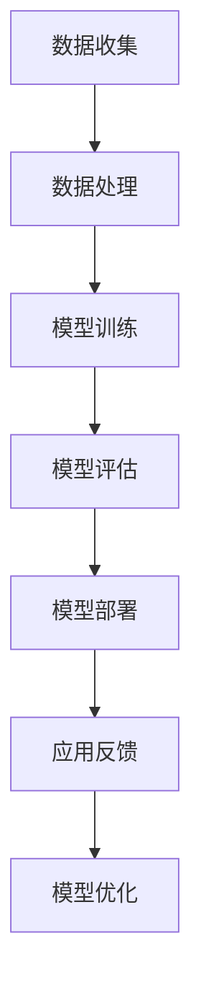

                 

关键词：人工智能，大模型，应用渠道，管理策略，拓展方法，技术框架，市场分析。

> 摘要：本文将深入探讨人工智能大模型的应用渠道拓展与管理策略。从背景介绍入手，详细分析大模型的核心概念与联系，并阐述核心算法原理与操作步骤。接着，介绍数学模型与公式，并通过案例分析与讲解展示实际应用。随后，文章将提供项目实践代码实例与详细解释，分析实际应用场景，展望未来应用前景。最后，推荐相关工具和资源，并对未来发展趋势与挑战进行总结。

## 1. 背景介绍

随着深度学习技术的不断进步，人工智能（AI）大模型的应用越来越广泛。大模型不仅能够处理复杂数据，还能在多种领域实现自动化决策。然而，随着应用场景的增多，如何有效拓展大模型的应用渠道并实现高效管理，成为了一个亟待解决的问题。

### 1.1 应用现状

当前，AI大模型主要应用于以下几个领域：

1. **自然语言处理（NLP）**：如智能客服、机器翻译、文本生成等。
2. **计算机视觉**：如图像识别、视频分析、自动驾驶等。
3. **推荐系统**：如电商推荐、内容推荐等。
4. **游戏AI**：如棋类游戏、策略游戏等。
5. **医学诊断**：如影像诊断、基因分析等。

### 1.2 挑战与机遇

尽管AI大模型在众多领域展现了巨大的潜力，但也面临着一系列挑战：

1. **数据隐私与安全**：大模型训练需要海量数据，如何确保数据隐私和安全成为重要议题。
2. **计算资源**：训练和推理大模型需要庞大的计算资源，如何高效利用资源成为关键。
3. **模型可解释性**：大模型往往缺乏可解释性，如何提高模型的可解释性是一个重要方向。

### 1.3 目标

本文旨在为AI大模型的应用渠道拓展提供策略，并探讨有效的管理方法，以应对当前面临的挑战，并抓住机遇。

## 2. 核心概念与联系

在探讨AI大模型的应用之前，我们需要了解一些核心概念和它们之间的联系。

### 2.1 概念定义

- **人工智能（AI）**：模拟人类智能行为的计算机系统。
- **大模型**：具有数亿甚至千亿参数的深度学习模型。
- **应用渠道**：指大模型在实际场景中的部署和应用途径。

### 2.2 Mermaid 流程图

下面是一个简化的Mermaid流程图，展示了大模型的应用渠道：



### 2.3 联系

- **数据收集**：数据是训练大模型的基础，通过收集海量数据，可以提升模型的性能。
- **数据处理**：对数据进行预处理，如清洗、归一化等，以确保数据的质量。
- **模型训练**：使用训练数据对大模型进行训练，使其具备特定任务的能力。
- **模型评估**：通过测试数据评估模型的性能，确保其满足应用要求。
- **模型部署**：将训练好的模型部署到实际应用场景中，如服务器、边缘设备等。
- **应用反馈**：收集用户反馈，用于模型优化和迭代。
- **模型优化**：根据反馈调整模型参数，以提高模型性能。

## 3. 核心算法原理 & 具体操作步骤

### 3.1 算法原理概述

AI大模型的核心算法是深度学习，其基本原理是通过多层神经网络对数据进行建模和预测。深度学习模型通常包括输入层、隐藏层和输出层。其中，隐藏层通过激活函数对输入数据进行非线性变换，从而提取特征。

### 3.2 算法步骤详解

1. **数据准备**：收集并预处理数据，包括数据清洗、归一化和数据增强等。
2. **模型架构设计**：设计合适的网络结构，包括层数、每层的神经元数量和激活函数等。
3. **模型训练**：使用训练数据对模型进行训练，通过反向传播算法更新模型参数。
4. **模型评估**：使用测试数据评估模型性能，调整超参数以优化模型。
5. **模型部署**：将训练好的模型部署到生产环境中，实现自动化决策。

### 3.3 算法优缺点

- **优点**：
  - **强大的学习能力**：大模型能够处理复杂的任务，具备较强的泛化能力。
  - **高效率**：深度学习模型可以自动提取特征，减少人工干预。
- **缺点**：
  - **计算资源需求大**：训练大模型需要大量的计算资源和时间。
  - **模型可解释性差**：大模型的内部机制复杂，难以解释。

### 3.4 算法应用领域

- **自然语言处理**：如文本分类、机器翻译、情感分析等。
- **计算机视觉**：如图像识别、目标检测、人脸识别等。
- **推荐系统**：如电商推荐、内容推荐等。
- **医学诊断**：如影像诊断、基因分析等。

## 4. 数学模型和公式 & 详细讲解 & 举例说明

### 4.1 数学模型构建

AI大模型的数学模型主要基于深度学习理论，包括以下几个方面：

1. **前向传播**：
   $$ z_l = \sigma(W_l \cdot a_{l-1} + b_l) $$
   $$ a_l = \sigma(z_l) $$

   其中，$W_l$ 和 $b_l$ 分别为权重和偏置，$\sigma$ 为激活函数，$a_l$ 为激活值。

2. **反向传播**：
   $$ \delta_l = \frac{\partial L}{\partial a_l} \cdot \frac{\partial a_l}{\partial z_l} $$
   $$ \frac{\partial L}{\partial z_l} = \delta_l \cdot \frac{\partial z_l}{\partial W_l} $$
   $$ \frac{\partial L}{\partial W_l} = \frac{\partial L}{\partial z_l} \cdot a_{l-1}^T $$

   其中，$L$ 为损失函数，$\delta_l$ 为误差。

### 4.2 公式推导过程

1. **前向传播**：

   前向传播主要涉及激活函数的计算，其中常用的激活函数包括Sigmoid、ReLU和Tanh。以ReLU为例，其导数为：

   $$ \frac{\partial ReLU}{\partial x} = \begin{cases} 
   0, & \text{if } x < 0 \\
   1, & \text{if } x \geq 0 
   \end{cases} $$

   同理，其他激活函数的导数也可以类似推导。

2. **反向传播**：

   反向传播的核心是误差传播。以一层为例，误差可以表示为：

   $$ \delta_l = \frac{\partial L}{\partial a_l} \cdot \frac{\partial a_l}{\partial z_l} $$

   其中，$\frac{\partial L}{\partial a_l}$ 为损失对激活值的导数，$\frac{\partial a_l}{\partial z_l}$ 为激活值对中间值的导数。

### 4.3 案例分析与讲解

假设我们有一个简单的二分类问题，使用Sigmoid激活函数。给定输入 $x$，我们需要计算输出 $y$：

1. **前向传播**：

   $$ z = W \cdot x + b $$
   $$ y = \sigma(z) = \frac{1}{1 + e^{-z}} $$

2. **反向传播**：

   $$ \delta = \frac{\partial L}{\partial y} \cdot \frac{\partial y}{\partial z} $$
   $$ \frac{\partial y}{\partial z} = y \cdot (1 - y) $$

   假设损失函数为均方误差（MSE），则：

   $$ \frac{\partial L}{\partial y} = (y - t) $$

   其中，$t$ 为真实标签。

通过反向传播，我们可以更新权重和偏置，以最小化损失。

## 5. 项目实践：代码实例和详细解释说明

### 5.1 开发环境搭建

为了实现AI大模型的应用，我们需要搭建一个合适的开发环境。以下是基本步骤：

1. **安装Python环境**：Python是深度学习领域的主流编程语言，我们需要安装Python 3.8及以上版本。
2. **安装深度学习框架**：如TensorFlow或PyTorch。以TensorFlow为例，可以使用以下命令安装：

   ```bash
   pip install tensorflow
   ```

3. **准备数据集**：根据应用场景准备相应的数据集，如MNIST手写数字数据集。

### 5.2 源代码详细实现

以下是一个简单的基于TensorFlow的MNIST手写数字识别模型的实现：

```python
import tensorflow as tf
from tensorflow.keras.datasets import mnist
from tensorflow.keras.models import Sequential
from tensorflow.keras.layers import Dense, Flatten
from tensorflow.keras.optimizers import SGD

# 数据准备
(x_train, y_train), (x_test, y_test) = mnist.load_data()
x_train = x_train / 255.0
x_test = x_test / 255.0

# 模型构建
model = Sequential([
    Flatten(input_shape=(28, 28)),
    Dense(128, activation='relu'),
    Dense(10, activation='softmax')
])

# 模型编译
model.compile(optimizer=SGD(), loss='sparse_categorical_crossentropy', metrics=['accuracy'])

# 模型训练
model.fit(x_train, y_train, epochs=5, batch_size=64)

# 模型评估
test_loss, test_acc = model.evaluate(x_test, y_test)
print(f"Test accuracy: {test_acc}")
```

### 5.3 代码解读与分析

- **数据准备**：加载MNIST数据集，并对数据进行归一化处理。
- **模型构建**：构建一个简单的全连接神经网络，包括一个输入层、一个隐藏层和一个输出层。
- **模型编译**：指定优化器和损失函数，并设置评估指标。
- **模型训练**：使用训练数据进行模型训练，设置训练轮数和批量大小。
- **模型评估**：使用测试数据评估模型性能，并打印测试准确率。

### 5.4 运行结果展示

在完成模型训练后，我们可以使用测试数据集进行评估，并输出测试准确率。假设我们的模型在测试集上的准确率为98%，则表示我们的模型具有较好的性能。

## 6. 实际应用场景

### 6.1 医学诊断

AI大模型在医学诊断领域具有广泛应用。例如，通过训练深度学习模型，可以对医学影像进行分析，诊断疾病。以下是一个具体的应用场景：

- **应用场景**：使用深度学习模型对CT影像进行肺癌检测。
- **模型选择**：卷积神经网络（CNN）。
- **数据集**：公开的肺癌CT影像数据集，如Lung-NET数据集。

通过训练深度学习模型，可以对CT影像进行肺癌检测，并生成概率性结果。实际应用中，医生可以根据模型的检测结果进行辅助诊断。

### 6.2 自动驾驶

AI大模型在自动驾驶领域也有广泛应用。例如，通过训练深度学习模型，可以实现自动驾驶车辆的环境感知和决策。以下是一个具体的应用场景：

- **应用场景**：使用深度学习模型进行自动驾驶车辆的路标检测。
- **模型选择**：基于CNN的物体检测模型，如YOLO。
- **数据集**：公开的自动驾驶数据集，如KITTI数据集。

通过训练深度学习模型，自动驾驶车辆可以实时检测路标，并根据检测结果进行导航。实际应用中，车辆可以根据路标信息进行精确的路径规划。

## 6.4 未来应用展望

### 6.4.1 智能医疗

随着深度学习技术的不断发展，AI大模型在医学领域的应用前景十分广阔。未来，AI大模型有望实现更精确的疾病诊断、更有效的治疗方案推荐等。例如，通过结合基因组数据和临床数据，AI大模型可以预测疾病风险，为个性化医疗提供有力支持。

### 6.4.2 智能家居

AI大模型在智能家居领域的应用也将日益增多。例如，通过训练深度学习模型，可以实现智能家居设备的智能交互和场景感知。未来，智能家居系统可以根据用户行为和偏好，自动调整设备状态，提供个性化的居住体验。

### 6.4.3 人工智能助手

随着AI大模型的不断发展，人工智能助手将变得更加智能和人性化。未来，AI大模型可以应用于智能客服、智能语音助手等领域，为用户提供更加精准和高效的服务。例如，通过结合自然语言处理和深度学习技术，AI大模型可以实现与用户的自然对话，解决用户的问题和需求。

## 7. 工具和资源推荐

### 7.1 学习资源推荐

- **《深度学习》（Goodfellow, Bengio, Courville）**：经典教材，全面介绍了深度学习的基本原理和应用。
- **《Python深度学习》（François Chollet）**：针对Python编程语言的深度学习应用教程。
- **《动手学深度学习》（Williams, Leng, Le）**：实战导向的深度学习教程，适合初学者。

### 7.2 开发工具推荐

- **TensorFlow**：谷歌开源的深度学习框架，广泛应用于深度学习研究和开发。
- **PyTorch**：Facebook开源的深度学习框架，具有良好的灵活性和易用性。
- **Keras**：基于TensorFlow和PyTorch的高层次API，简化深度学习模型构建和训练。

### 7.3 相关论文推荐

- **“Deep Learning for Natural Language Processing”（2018）**：探讨了深度学习在自然语言处理领域的应用。
- **“Convolutional Neural Networks for Visual Recognition”（2014）**：介绍了卷积神经网络在计算机视觉领域的应用。
- **“Recurrent Neural Networks for Language Modeling”（2014）**：探讨了循环神经网络在自然语言处理领域的应用。

## 8. 总结：未来发展趋势与挑战

### 8.1 研究成果总结

近年来，AI大模型在自然语言处理、计算机视觉、推荐系统等领域取得了显著成果。通过结合深度学习和大数据技术，AI大模型在处理复杂数据和实现自动化决策方面展现出强大的能力。

### 8.2 未来发展趋势

1. **算法优化**：未来，随着计算能力的提升和算法的进步，AI大模型将在更多领域实现应用。
2. **跨学科融合**：AI大模型将与更多学科相结合，如生物医学、航空航天等，推动各领域的发展。
3. **可解释性提升**：为了提高模型的可解释性，研究者将致力于开发可解释性更好的算法和模型。

### 8.3 面临的挑战

1. **数据隐私与安全**：如何确保数据隐私和安全是AI大模型应用的重要挑战。
2. **计算资源**：训练和推理AI大模型需要庞大的计算资源，如何高效利用资源是一个难题。
3. **模型可解释性**：AI大模型往往缺乏可解释性，如何提高模型的可解释性是一个重要研究方向。

### 8.4 研究展望

未来，随着AI大模型技术的不断发展，我们将见证更多创新应用的出现。在确保数据隐私、提高计算效率、提升模型可解释性等方面，研究者将继续努力，推动AI大模型的应用拓展。

## 9. 附录：常见问题与解答

### 9.1 问题1：什么是深度学习？

**回答**：深度学习是人工智能的一个分支，它使用多层神经网络对数据进行建模和预测。与传统的机器学习方法相比，深度学习通过学习数据中的层次特征，能够实现更复杂和更精确的预测。

### 9.2 问题2：什么是大模型？

**回答**：大模型是指具有数亿甚至千亿参数的深度学习模型。与小型模型相比，大模型在处理复杂数据和实现自动化决策方面具有更强的能力。

### 9.3 问题3：如何训练大模型？

**回答**：训练大模型需要使用大量的数据和计算资源。通常，首先对数据进行预处理，然后使用训练算法（如反向传播）更新模型参数，以最小化损失函数。训练过程可能需要数天或数周，具体取决于模型的复杂度和计算资源。

### 9.4 问题4：如何评估大模型的性能？

**回答**：评估大模型的性能通常使用测试数据集。常用的评估指标包括准确率、召回率、F1分数等。通过在测试数据集上的评估，可以了解模型的性能和泛化能力。

### 9.5 问题5：AI大模型应用中面临的主要挑战是什么？

**回答**：AI大模型应用中面临的主要挑战包括数据隐私与安全、计算资源需求大、模型可解释性差等。如何确保数据隐私和安全、高效利用计算资源、提高模型可解释性是当前研究的重要方向。

