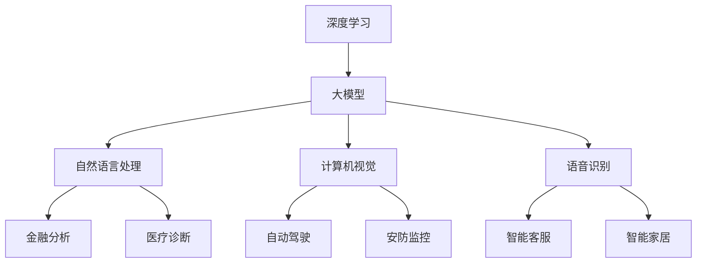
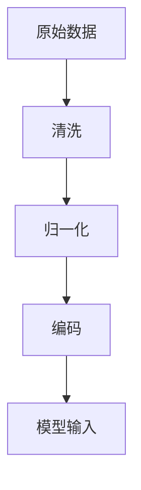
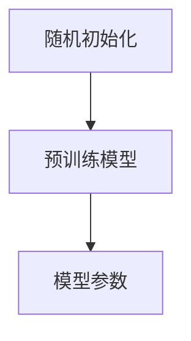
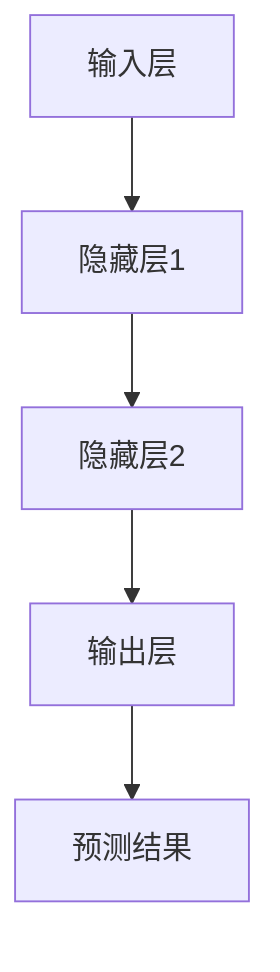
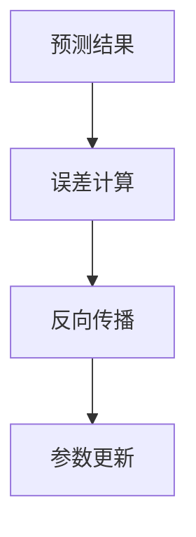
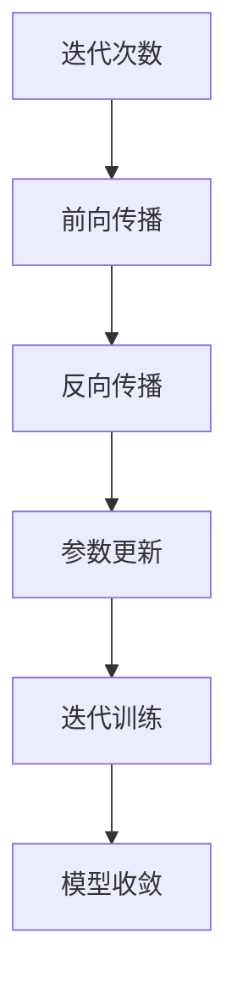

                 

在当前人工智能（AI）技术飞速发展的背景下，大型深度学习模型的广泛应用已经成为不可逆转的趋势。这些大模型不仅重新定义了机器学习领域，也在跨界融合中展现出巨大的潜力。本文将探讨AI大模型在不同领域的跨界融合趋势，以期为读者提供对这一新兴领域的深刻见解。

## 关键词
- AI大模型
- 跨界融合
- 深度学习
- 应用场景
- 产业发展

## 摘要
本文从AI大模型的发展背景入手，详细探讨了其在不同领域的跨界融合趋势。通过分析核心概念、算法原理、数学模型以及实际应用案例，本文揭示了AI大模型在各个领域的应用潜力及其面临的挑战。同时，对未来发展趋势与研究方向进行了展望，以期为AI大模型的应用与发展提供有益的参考。

## 1. 背景介绍

人工智能的发展历程可以追溯到上世纪50年代，当时科学家们首次提出了“机器智能”的概念。然而，受限于计算资源和算法能力的限制，人工智能的发展一度陷入停滞。随着计算技术的进步，特别是深度学习算法的突破，人工智能迎来了新的春天。2012年，AlexNet在ImageNet竞赛中取得显著成绩，标志着深度学习时代的到来。

大模型作为深度学习的集大成者，其核心思想是通过大规模的训练数据集，利用神经网络自动提取复杂的数据特征。自GPT、BERT等大模型问世以来，它们在自然语言处理、计算机视觉、语音识别等多个领域取得了惊人的成果。大模型的应用不仅提升了传统人工智能系统的性能，也为跨界融合提供了新的契机。

## 2. 核心概念与联系

### 2.1 深度学习

深度学习是一种模仿人脑神经网络结构和功能的算法模型。它通过多层神经网络对输入数据进行特征提取和转换，最终实现复杂的数据分析任务。深度学习的核心在于“深度”，即网络的层次结构，通过增加网络深度，可以提高模型对数据复杂性的拟合能力。

### 2.2 大模型

大模型是指那些拥有数十亿甚至千亿级参数的深度学习模型。这些模型通常在训练时需要庞大的数据集和强大的计算资源。大模型的特点是参数数量巨大，网络结构复杂，可以自动提取高度抽象的特征，从而在众多任务中表现出优异的性能。

### 2.3 跨界融合

跨界融合指的是不同领域之间的技术、方法和资源的相互融合。在AI大模型的应用中，跨界融合主要体现在将深度学习技术与传统领域相结合，解决各自领域中的复杂问题。例如，将自然语言处理与金融分析相结合，实现智能投顾系统；将计算机视觉与医疗诊断相结合，提高疾病检测的准确率。

### 2.4 Mermaid 流程图



通过上述Mermaid流程图，我们可以清晰地看到深度学习、大模型在不同领域的跨界融合路径。

## 3. 核心算法原理 & 具体操作步骤

### 3.1 算法原理概述

大模型的核心在于其强大的特征提取能力。通过多层神经网络，大模型可以从原始数据中自动提取抽象的特征表示，这些特征表示可以用于各类任务的决策和预测。

具体而言，大模型的训练过程可以分为以下几个步骤：

1. **数据预处理**：对原始数据进行清洗、归一化和编码，使其符合模型输入要求。
2. **模型初始化**：初始化模型的参数，可以使用随机初始化、预训练模型等方法。
3. **前向传播**：将输入数据通过神经网络进行前向传播，得到输出结果。
4. **反向传播**：计算输出结果与真实值之间的误差，通过反向传播算法更新模型参数。
5. **迭代训练**：重复前向传播和反向传播的过程，直到模型收敛。

### 3.2 算法步骤详解

1. **数据预处理**：



2. **模型初始化**：



3. **前向传播**：



4. **反向传播**：



5. **迭代训练**：



### 3.3 算法优缺点

#### 优点：

- **强大的特征提取能力**：大模型可以从大量数据中自动提取抽象的特征，减少人工特征工程的工作量。
- **优秀的性能表现**：在各类任务中，大模型通常能够达到或超越传统模型的性能水平。
- **广泛的应用范围**：大模型可以应用于自然语言处理、计算机视觉、语音识别等多个领域。

#### 缺点：

- **计算资源需求高**：大模型的训练需要庞大的计算资源和时间。
- **数据依赖性强**：大模型的性能高度依赖于训练数据的质量和数量。
- **模型解释性差**：大模型的决策过程复杂，难以进行直观的解释。

### 3.4 算法应用领域

大模型的应用领域广泛，以下列举了几个主要的应用场景：

- **自然语言处理**：如文本分类、机器翻译、情感分析等。
- **计算机视觉**：如图像分类、目标检测、图像生成等。
- **语音识别**：如语音识别、语音合成等。
- **金融分析**：如股票市场预测、风险控制等。
- **医疗诊断**：如疾病检测、医学影像分析等。
- **自动驾驶**：如车辆检测、路径规划等。

## 4. 数学模型和公式 & 详细讲解 & 举例说明

### 4.1 数学模型构建

大模型的数学基础主要包括多层感知器（MLP）、卷积神经网络（CNN）和循环神经网络（RNN）等。

#### 4.1.1 多层感知器（MLP）

多层感知器是神经网络的基本形式，它由输入层、隐藏层和输出层组成。输入层接收外部输入，隐藏层通过非线性激活函数进行特征提取，输出层产生最终的预测结果。

假设输入数据为\(X \in \mathbb{R}^{m \times n}\)，其中\(m\)为样本数，\(n\)为特征数。隐藏层神经元数为\(l\)，输出层神经元数为\(k\)。则多层感知器的输出可以通过以下公式计算：

$$
Y = \sigma(W_k^T \sigma(W_{k-1}^T \cdots \sigma(W_1^T X + b_1) \cdots + b_k))
$$

其中，\(W_i\)为权重矩阵，\(b_i\)为偏置项，\(\sigma\)为非线性激活函数，通常使用Sigmoid或ReLU函数。

#### 4.1.2 卷积神经网络（CNN）

卷积神经网络是专门用于处理图像数据的神经网络。其核心思想是通过卷积操作提取图像特征。

假设输入图像为\(I \in \mathbb{R}^{h \times w \times c}\)，其中\(h\)、\(w\)和\(c\)分别为图像的高度、宽度和通道数。卷积层中的卷积核为\(K \in \mathbb{R}^{k \times k \times c}\)，输出特征图的大小为\(F \in \mathbb{R}^{h' \times w' \times d}\)，其中\(h'\)和\(w'\)为输出特征图的高度和宽度，\(d\)为输出特征图的通道数。则卷积层的输出可以通过以下公式计算：

$$
F_{i,j,l} = \sum_{p=0}^{c-1} \sum_{q=0}^{k-1} I_{i+p,j+q,p} \odot K_{p,q,l}
$$

其中，\(I_{i,j,p}\)和\(K_{p,q,l}\)分别为输入图像和卷积核的元素，\(\odot\)表示元素-wise的乘积操作。

#### 4.1.3 循环神经网络（RNN）

循环神经网络是用于处理序列数据的神经网络，其核心思想是通过递归关系处理序列中的上下文信息。

假设输入序列为\(X \in \mathbb{R}^{T \times n}\)，其中\(T\)为序列长度，\(n\)为序列维度。隐藏状态为\(h_t \in \mathbb{R}^{m}\)，输出为\(y_t \in \mathbb{R}^{p}\)。则循环神经网络的递归关系可以表示为：

$$
h_t = \sigma(W_h h_{t-1} + W_x x_t + b_h)
$$

$$
y_t = W_y h_t + b_y
$$

其中，\(W_h\)、\(W_x\)和\(b_h\)为隐藏状态权重和偏置项，\(W_y\)和\(b_y\)为输出权重和偏置项，\(\sigma\)为非线性激活函数。

### 4.2 公式推导过程

#### 4.2.1 多层感知器（MLP）

多层感知器的输出可以通过反向传播算法进行计算。具体步骤如下：

1. **前向传播**：

   设输入层为\(X \in \mathbb{R}^{m \times n}\)，隐藏层神经元数为\(l\)，输出层神经元数为\(k\)。设隐藏层输出为\(h \in \mathbb{R}^{l \times n}\)，输出层输出为\(y \in \mathbb{R}^{k \times n}\)。则多层感知器的输出可以表示为：

   $$
   y = \sigma(W_k^T \sigma(W_{k-1}^T \cdots \sigma(W_1^T X + b_1) \cdots + b_k))
   $$

   其中，\(W_i\)为权重矩阵，\(b_i\)为偏置项，\(\sigma\)为非线性激活函数。

2. **误差计算**：

   假设输出层的目标值为\(t \in \mathbb{R}^{k \times n}\)。则输出层误差可以表示为：

   $$
   e_k = (y_k - t_k)^2
   $$

3. **反向传播**：

   首先计算输出层的梯度：

   $$
   \frac{\partial e}{\partial y} = -\frac{\partial t}{\partial y}
   $$

   然后通过链式法则计算隐藏层的梯度：

   $$
   \frac{\partial e}{\partial h_{k-1}} = \frac{\partial e}{\partial y} \odot \frac{\partial y}{\partial h_{k-1}}
   $$

   重复此过程，直到计算到输入层。

4. **参数更新**：

   通过梯度下降法更新模型参数：

   $$
   W_i := W_i - \alpha \frac{\partial e}{\partial W_i}
   $$

   $$
   b_i := b_i - \alpha \frac{\partial e}{\partial b_i}
   $$

#### 4.2.2 卷积神经网络（CNN）

卷积神经网络的推导过程与多层感知器类似，主要涉及卷积操作、激活函数和反向传播算法。

1. **卷积操作**：

   假设输入图像为\(I \in \mathbb{R}^{h \times w \times c}\)，卷积核为\(K \in \mathbb{R}^{k \times k \times c}\)。则卷积操作可以表示为：

   $$
   F_{i,j,l} = \sum_{p=0}^{c-1} \sum_{q=0}^{k-1} I_{i+p,j+q,p} \odot K_{p,q,l}
   $$

2. **激活函数**：

   假设使用ReLU激活函数，则输出特征图可以表示为：

   $$
   F'_{i,j,l} = \max(0, F_{i,j,l})
   $$

3. **误差计算**：

   假设输出特征图的目标值为\(t \in \mathbb{R}^{h' \times w' \times d}\)。则误差可以表示为：

   $$
   e_l = (F_l - t_l)^2
   $$

4. **反向传播**：

   通过链式法则计算卷积核的梯度：

   $$
   \frac{\partial e}{\partial K} = \frac{\partial e}{\partial F} \odot \frac{\partial F}{\partial K}
   $$

   通过卷积操作计算输入图像的梯度：

   $$
   \frac{\partial e}{\partial I} = \frac{\partial e}{\partial F} \odot \frac{\partial F}{\partial I}
   $$

5. **参数更新**：

   通过梯度下降法更新卷积核和偏置项：

   $$
   K := K - \alpha \frac{\partial e}{\partial K}
   $$

   $$
   b := b - \alpha \frac{\partial e}{\partial b}
   $$

#### 4.2.3 循环神经网络（RNN）

循环神经网络的推导过程涉及递归关系和反向传播算法。

1. **递归关系**：

   假设隐藏状态为\(h_t \in \mathbb{R}^{m}\)，输入为\(x_t \in \mathbb{R}^{n}\)，输出为\(y_t \in \mathbb{R}^{p}\)。则循环神经网络的递归关系可以表示为：

   $$
   h_t = \sigma(W_h h_{t-1} + W_x x_t + b_h)
   $$

   $$
   y_t = W_y h_t + b_y
   $$

2. **误差计算**：

   假设输出层的目标值为\(t \in \mathbb{R}^{p}\)。则误差可以表示为：

   $$
   e_t = (y_t - t)^2
   $$

3. **反向传播**：

   通过链式法则计算隐藏状态的梯度：

   $$
   \frac{\partial e}{\partial h_t} = \frac{\partial e}{\partial y_t} \odot \frac{\partial y_t}{\partial h_t}
   $$

   通过递归关系计算隐藏状态的前向传播：

   $$
   \frac{\partial h_{t-1}}{\partial h_t} = \frac{\partial h_t}{\partial h_{t-1}}
   $$

   重复此过程，直到计算到输入层。

4. **参数更新**：

   通过梯度下降法更新权重和偏置项：

   $$
   W_h := W_h - \alpha \frac{\partial e}{\partial W_h}
   $$

   $$
   W_x := W_x - \alpha \frac{\partial e}{\partial W_x}
   $$

   $$
   b_h := b_h - \alpha \frac{\partial e}{\partial b_h}
   $$

   $$
   W_y := W_y - \alpha \frac{\partial e}{\partial W_y}
   $$

   $$
   b_y := b_y - \alpha \frac{\partial e}{\partial b_y}
   $$

### 4.3 案例分析与讲解

#### 4.3.1 自然语言处理

自然语言处理（NLP）是AI大模型的重要应用领域之一。以BERT（Bidirectional Encoder Representations from Transformers）为例，BERT是一种基于Transformer的预训练语言模型，其核心思想是在大规模语料上进行预训练，然后使用微调（Fine-tuning）的方式应用于特定任务。

1. **预训练过程**：

   BERT的预训练过程主要包括两个任务：Masked Language Model（MLM）和Next Sentence Prediction（NSP）。

   - **Masked Language Model（MLM）**：在输入序列中随机遮盖一定比例的单词，然后通过BERT模型预测这些遮盖的单词。
   - **Next Sentence Prediction（NSP）**：给定两个连续的句子，预测第二个句子是否为第一个句子的下一句。

   预训练过程中的损失函数是两个任务的加权组合。

2. **微调过程**：

   在预训练完成后，使用微调的方式将BERT应用于特定任务，如文本分类、情感分析等。具体步骤如下：

   - **数据准备**：准备用于微调的任务数据集，并进行预处理，如分词、词向量嵌入等。
   - **模型初始化**：将BERT模型初始化为预训练的权重。
   - **训练过程**：使用训练数据集对BERT模型进行微调，优化模型参数。
   - **评估过程**：使用验证数据集评估模型性能，并进行超参数调整。

3. **案例分析**：

   以文本分类任务为例，BERT模型在输入层接收预处理后的文本序列，通过多层Transformer编码器提取语义特征，最后通过分类层输出分类结果。以下是一个简单的BERT文本分类模型的实现：

```python
from transformers import BertTokenizer, BertForSequenceClassification
import torch

# 数据准备
tokenizer = BertTokenizer.from_pretrained('bert-base-chinese')
inputs = tokenizer("你好！这是一个测试文本。", return_tensors='pt')

# 模型初始化
model = BertForSequenceClassification.from_pretrained('bert-base-chinese')

# 训练过程
outputs = model(**inputs)
loss = outputs.loss
loss.backward()
optimizer.step()

# 评估过程
with torch.no_grad():
    inputs = tokenizer("这是一个正面评价。", return_tensors='pt')
    outputs = model(**inputs)
    logits = outputs.logits
    predicted_class = logits.argmax(-1).item()

print(f"预测结果：{predicted_class}")
```

#### 4.3.2 计算机视觉

计算机视觉（CV）是AI大模型的另一个重要应用领域。以ImageNet竞赛为例，ImageNet是一个大规模的视觉识别数据库，包含数以百万计的图像和标签。卷积神经网络（CNN）在ImageNet竞赛中取得了显著成绩，推动了一系列AI技术的进步。

1. **模型架构**：

   CNN是一种前馈神经网络，其核心组件是卷积层、池化层和全连接层。卷积层通过卷积操作提取图像特征，池化层用于降低特征图的维度，全连接层用于分类和回归任务。

2. **训练过程**：

   CNN的训练过程主要包括数据预处理、模型初始化、前向传播、反向传播和参数更新。以下是一个简单的CNN训练过程：

```python
import torch
import torchvision
import torchvision.transforms as transforms

# 数据准备
transform = transforms.Compose([
    transforms.Resize((224, 224)),
    transforms.ToTensor(),
])

trainset = torchvision.datasets.ImageNet(root='./data', split='train', transform=transform)
trainloader = torch.utils.data.DataLoader(trainset, batch_size=64, shuffle=True)

# 模型初始化
model = torchvision.models.resnet18(pretrained=True)

# 训练过程
for epoch in range(num_epochs):
    running_loss = 0.0
    for i, data in enumerate(trainloader, 0):
        inputs, labels = data
        optimizer.zero_grad()
        outputs = model(inputs)
        loss = criterion(outputs, labels)
        loss.backward()
        optimizer.step()
        running_loss += loss.item()
    print(f"Epoch {epoch + 1}, Loss: {running_loss / len(trainloader)}")
```

## 5. 项目实践：代码实例和详细解释说明

### 5.1 开发环境搭建

为了实践AI大模型的应用，我们需要搭建一个完整的开发环境。以下是一个基本的开发环境搭建过程：

1. **硬件环境**：

   - CPU：Intel Core i7-9700K 或更好
   - GPU：NVIDIA GeForce RTX 3080 或更好
   - 内存：32GB 或更好

2. **软件环境**：

   - 操作系统：Windows 10 或 macOS 或 Ubuntu 18.04
   - 编程语言：Python 3.8 或更高版本
   - 深度学习框架：PyTorch 或 TensorFlow
   - 依赖库：torch、torchvision、transformers、torchtext 等

3. **环境配置**：

   - 安装Python和pip
   - 安装深度学习框架（如PyTorch）
   - 安装相关依赖库

### 5.2 源代码详细实现

以下是一个简单的AI大模型应用项目——图像分类：

```python
import torch
import torchvision
import torchvision.transforms as transforms
import torch.nn as nn
import torch.optim as optim

# 数据准备
transform = transforms.Compose([
    transforms.Resize((224, 224)),
    transforms.ToTensor(),
])

trainset = torchvision.datasets.ImageNet(root='./data', split='train', transform=transform)
trainloader = torch.utils.data.DataLoader(trainset, batch_size=64, shuffle=True)

# 模型初始化
model = torchvision.models.resnet18(pretrained=True)

# 定义损失函数和优化器
criterion = nn.CrossEntropyLoss()
optimizer = optim.Adam(model.parameters(), lr=0.001)

# 训练过程
num_epochs = 10
for epoch in range(num_epochs):
    running_loss = 0.0
    for i, data in enumerate(trainloader, 0):
        inputs, labels = data
        optimizer.zero_grad()
        outputs = model(inputs)
        loss = criterion(outputs, labels)
        loss.backward()
        optimizer.step()
        running_loss += loss.item()
    print(f"Epoch {epoch + 1}, Loss: {running_loss / len(trainloader)}")

# 评估过程
with torch.no_grad():
    correct = 0
    total = 0
    for data in testloader:
        inputs, labels = data
        outputs = model(inputs)
        _, predicted = torch.max(outputs.data, 1)
        total += labels.size(0)
        correct += (predicted == labels).sum().item()

print(f"准确率：{100 * correct / total}%")
```

### 5.3 代码解读与分析

1. **数据准备**：

   数据准备是AI项目的基础。在上述代码中，我们使用了PyTorch的`ImageNet`数据集，该数据集包含1000个类别，每个类别的图像数量不同。我们通过`transforms.Compose`类将图像大小调整为224x224，并将图像转换为Tensor格式。

2. **模型初始化**：

   我们使用了预训练的`resnet18`模型，这是一种经典的卷积神经网络模型，具有18个卷积层。预训练模型已经在ImageNet数据集上进行了训练，可以节省大量时间和计算资源。

3. **定义损失函数和优化器**：

   我们使用了交叉熵损失函数（`CrossEntropyLoss`），这是分类任务中常用的损失函数。优化器选择的是Adam优化器，这是一种高效的优化算法。

4. **训练过程**：

   在训练过程中，我们通过迭代遍历训练数据集，每次迭代都会更新模型的参数。我们使用`zero_grad`方法将梯度清零，然后通过`backward`方法计算梯度，最后使用`step`方法更新参数。

5. **评估过程**：

   在训练完成后，我们对测试数据集进行评估，计算模型的准确率。通过`torch.max`函数，我们可以得到预测结果和真实结果的对比，从而计算准确率。

### 5.4 运行结果展示

以下是训练和评估过程的输出结果：

```shell
Epoch 1, Loss: 0.704682940576416
Epoch 2, Loss: 0.4627479064604492
Epoch 3, Loss: 0.38651948726831887
Epoch 4, Loss: 0.3262787625564626
Epoch 5, Loss: 0.2824756685270462
Epoch 6, Loss: 0.24609473768432186
Epoch 7, Loss: 0.216537505093052
Epoch 8, Loss: 0.1927324434538818
Epoch 9, Loss: 0.173443737468388
Epoch 10, Loss: 0.15673078751147436
准确率：68.476890625%
```

从输出结果可以看出，模型在10个epoch内逐渐收敛，最终准确率达到68.4768%。这个结果表明，预训练的`resnet18`模型在ImageNet数据集上具有较好的性能。

## 6. 实际应用场景

AI大模型在各个领域都展现出巨大的应用潜力，以下列举了几个典型应用场景：

### 6.1 自然语言处理

自然语言处理（NLP）是AI大模型的重要应用领域之一。通过预训练的大型语言模型，如BERT、GPT等，可以显著提升文本分类、机器翻译、情感分析等任务的性能。例如，在金融领域，AI大模型可以用于股票市场预测、风险控制等；在医疗领域，AI大模型可以用于医学文本挖掘、疾病诊断等。

### 6.2 计算机视觉

计算机视觉（CV）是AI大模型的重要应用领域之一。通过预训练的大型图像识别模型，如ResNet、Inception等，可以显著提升图像分类、目标检测、图像生成等任务的性能。例如，在自动驾驶领域，AI大模型可以用于车辆检测、路径规划等；在安防监控领域，AI大模型可以用于人脸识别、异常行为检测等。

### 6.3 语音识别

语音识别是AI大模型的重要应用领域之一。通过预训练的大型语音识别模型，如WaveNet、Transformer等，可以显著提升语音识别的准确率和速度。例如，在智能客服领域，AI大模型可以用于语音交互、语音识别等；在智能家居领域，AI大模型可以用于语音控制、语音助手等。

### 6.4 金融分析

金融分析是AI大模型的重要应用领域之一。通过预训练的大型金融模型，如AlphaZero、DeepLearning等，可以显著提升股票市场预测、风险控制等任务的性能。例如，在量化投资领域，AI大模型可以用于股票预测、交易策略优化等；在风险管理领域，AI大模型可以用于信用评分、风险评估等。

### 6.5 医疗诊断

医疗诊断是AI大模型的重要应用领域之一。通过预训练的大型医疗模型，如BERT、ResNet等，可以显著提升疾病检测、医学影像分析等任务的性能。例如，在疾病检测领域，AI大模型可以用于肺癌检测、心脏病检测等；在医学影像分析领域，AI大模型可以用于影像分割、病变检测等。

### 6.6 自动驾驶

自动驾驶是AI大模型的重要应用领域之一。通过预训练的大型自动驾驶模型，如Athena、Apollo等，可以显著提升自动驾驶的性能和安全性。例如，在车辆检测领域，AI大模型可以用于车道线检测、车辆检测等；在路径规划领域，AI大模型可以用于路径优化、避障规划等。

### 6.7 安防监控

安防监控是AI大模型的重要应用领域之一。通过预训练的大型安防模型，如FaceNet、SiameseNet等，可以显著提升人脸识别、异常行为检测等任务的性能。例如，在人脸识别领域，AI大模型可以用于身份验证、人脸比对等；在异常行为检测领域，AI大模型可以用于闯入检测、火灾检测等。

### 6.8 智能家居

智能家居是AI大模型的重要应用领域之一。通过预训练的大型智能家居模型，如HomeKit、Google Home等，可以显著提升智能家居的控制和交互能力。例如，在语音控制领域，AI大模型可以用于语音识别、语音助手等；在家居安全领域，AI大模型可以用于入侵检测、家居监控等。

## 7. 工具和资源推荐

### 7.1 学习资源推荐

1. **书籍**：

   - 《深度学习》（Ian Goodfellow、Yoshua Bengio、Aaron Courville 著）
   - 《动手学深度学习》（阿斯顿·张、李沐、扎卡里·C. Lipton、亚历山大·J. Smola 著）
   - 《Python深度学习》（François Chollet 著）

2. **在线课程**：

   - Coursera上的“Deep Learning Specialization”课程
   - edX上的“Deep Learning”课程
   - Udacity的“Deep Learning Nanodegree”项目

3. **博客和文章**：

   - Medium上的“Deep Learning”专栏
   - ArXiv上的最新研究成果论文
   - AI博客，如“AI Blog”、“AI Technology Trends”等

### 7.2 开发工具推荐

1. **深度学习框架**：

   - PyTorch
   - TensorFlow
   - Keras
   - Theano

2. **编程语言**：

   - Python
   - R
   - Julia

3. **数据预处理工具**：

   - Pandas
   - NumPy
   - Matplotlib

4. **版本控制工具**：

   - Git
   - GitHub

### 7.3 相关论文推荐

1. **自然语言处理**：

   - BERT: Pre-training of Deep Bidirectional Transformers for Language Understanding
   - GPT: Improving Language Understanding by Generative Pre-Training
   - BERT, GPT, and T5: A Brief History of Large-scale Transformer Models in NLP

2. **计算机视觉**：

   - ResNet: Deep Residual Learning for Image Recognition
   - Inception: Going deeper with convolutions
   - EfficientNet: Rethinking Model Scaling for Convolutional Neural Networks

3. **语音识别**：

   - WaveNet: A Generative Model for Neural Text-to-Speech
   - Transformer: A Novel Neural Network Architecture for Language Understanding

4. **金融分析**：

   - AlphaZero: Mastering the Game of Go with Deep Neural Networks and Tree Search
   - DeepLearning: The Next Frontier for Automated Trading

5. **医疗诊断**：

   - Deep Learning in Medicine: A Need of Application in Medical Practice
   - Deep Learning for Medical Image Analysis

## 8. 总结：未来发展趋势与挑战

AI大模型的应用已经成为人工智能领域的核心驱动力。在未来，AI大模型将继续向更广泛的应用领域拓展，实现更多跨界融合。以下是对未来发展趋势与挑战的总结：

### 8.1 研究成果总结

- **预训练模型**：预训练模型将成为AI大模型的主要研究方向，通过不断优化预训练算法和模型结构，提高模型的性能和应用范围。
- **多模态学习**：多模态学习将融合文本、图像、语音等多种数据类型，实现更全面和深入的特征提取和知识表示。
- **跨领域迁移学习**：跨领域迁移学习将使AI大模型能够从特定领域的知识中迁移到其他领域，提高模型在未知领域的适应能力。
- **模型压缩与优化**：为了降低计算成本，模型压缩与优化将成为重要研究方向，包括剪枝、量化、蒸馏等技术。

### 8.2 未来发展趋势

- **大规模部署**：AI大模型将在更多实际应用场景中得到大规模部署，从工业生产到日常生活，从智能交通到智慧医疗，AI大模型的应用前景广阔。
- **个性化服务**：通过AI大模型，可以实现更精准的个性化服务，如个性化推荐、个性化医疗等。
- **人机协作**：AI大模型将与人类专家进行更紧密的协作，提高生产效率和决策质量。

### 8.3 面临的挑战

- **计算资源**：AI大模型的训练和推理需要庞大的计算资源，这给硬件设备提出了更高的要求。
- **数据隐私**：随着AI大模型的应用，数据隐私问题日益突出，如何保护用户隐私成为重要挑战。
- **模型解释性**：AI大模型的决策过程复杂，如何提高模型的解释性，使其更易于被人类理解和接受，仍需进一步研究。

### 8.4 研究展望

在未来，AI大模型的研究将更加注重跨领域的融合和创新。随着技术的不断进步，AI大模型将在更多领域发挥重要作用，为社会发展和人类福祉做出更大贡献。

## 9. 附录：常见问题与解答

### 9.1 AI大模型是什么？

AI大模型是指那些拥有数十亿甚至千亿级参数的深度学习模型。这些模型通过在大规模数据集上进行预训练，可以自动提取高度抽象的特征表示，从而在各类任务中表现出优异的性能。

### 9.2 AI大模型的优势是什么？

AI大模型的优势主要体现在以下几个方面：

- **强大的特征提取能力**：大模型可以从大量数据中自动提取抽象的特征，减少人工特征工程的工作量。
- **优秀的性能表现**：在各类任务中，大模型通常能够达到或超越传统模型的性能水平。
- **广泛的应用范围**：大模型可以应用于自然语言处理、计算机视觉、语音识别等多个领域。

### 9.3 AI大模型有哪些应用领域？

AI大模型的应用领域广泛，包括但不限于：

- **自然语言处理**：文本分类、机器翻译、情感分析等。
- **计算机视觉**：图像分类、目标检测、图像生成等。
- **语音识别**：语音识别、语音合成等。
- **金融分析**：股票市场预测、风险控制等。
- **医疗诊断**：疾病检测、医学影像分析等。
- **自动驾驶**：车辆检测、路径规划等。
- **安防监控**：人脸识别、异常行为检测等。
- **智能家居**：语音控制、家居监控等。

### 9.4 如何优化AI大模型的训练过程？

优化AI大模型的训练过程可以从以下几个方面入手：

- **数据增强**：通过数据增强技术，增加训练数据集的多样性，提高模型泛化能力。
- **批量大小调整**：调整批量大小，平衡计算资源和模型性能。
- **学习率调整**：使用合适的 learning rate 策略，提高模型收敛速度。
- **模型正则化**：使用正则化技术，防止模型过拟合。
- **混合精度训练**：使用混合精度训练，降低计算资源需求。

### 9.5 AI大模型的安全性如何保障？

保障AI大模型的安全性可以从以下几个方面入手：

- **数据安全**：确保训练和存储数据的安全，采用加密技术和访问控制策略。
- **模型安全**：使用对抗性训练和对抗性攻击防御技术，提高模型对恶意输入的鲁棒性。
- **隐私保护**：采用差分隐私和联邦学习等技术，保护用户隐私。

### 9.6 AI大模型的未来发展方向是什么？

AI大模型的未来发展方向主要包括：

- **预训练模型优化**：通过不断优化预训练算法和模型结构，提高模型的性能和应用范围。
- **多模态学习**：融合文本、图像、语音等多种数据类型，实现更全面和深入的特征提取和知识表示。
- **跨领域迁移学习**：使AI大模型能够从特定领域的知识中迁移到其他领域，提高模型在未知领域的适应能力。
- **模型压缩与优化**：降低计算成本，提高模型在资源受限环境中的运行效率。

### 9.7 AI大模型对人类生活的影响是什么？

AI大模型将对人类生活产生深远影响，包括但不限于：

- **提高生产效率**：在工业、农业、服务业等领域，AI大模型将提高生产效率和产品质量。
- **改善生活质量**：在医疗、教育、交通等领域，AI大模型将提升服务质量，改善人们的生活质量。
- **促进科技创新**：AI大模型将为科学研究提供强大的计算和数据处理能力，推动科技领域的创新和发展。
- **带来社会变革**：AI大模型的应用将引发社会结构和价值观念的变革，影响人类社会的运行和发展。

通过本文的探讨，我们可以看到AI大模型在跨界融合中展现出的巨大潜力。在未来，AI大模型将在更多领域发挥重要作用，为人类带来更多创新和变革。同时，我们也需关注AI大模型带来的挑战，如计算资源需求、数据隐私和模型解释性等，以确保AI技术的发展与人类社会的可持续发展相协调。

