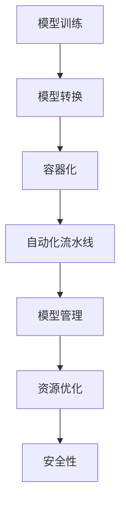

                 

关键词：AI大模型，部署自动化，标准化，模型管理，运维，容器化，自动化流水线，资源优化，安全性

> 摘要：本文将探讨AI大模型应用的部署自动化与标准化问题。通过分析当前AI大模型部署的挑战，提出一种基于容器化和自动化流水线的解决方案，并对模型管理、资源优化和安全性方面进行深入讨论，旨在为AI大模型应用提供高效、稳定、安全的部署方法。

## 1. 背景介绍

随着人工智能技术的快速发展，AI大模型如BERT、GPT-3等已经成为许多应用的核心。然而，AI大模型的部署和应用面临着一系列挑战。传统的部署方式通常依赖于手工操作，不仅效率低下，而且容易出现错误。为了解决这些问题，自动化和标准化成为AI大模型部署的关键。本文将探讨AI大模型部署自动化的必要性，并提出一种基于容器化和自动化流水线的解决方案。

### AI大模型部署的挑战

1. **复杂的部署流程**：传统的部署流程通常涉及多个步骤，包括模型训练、模型转换、模型部署、监控和维护等。这些步骤往往需要手动执行，导致部署效率低下。

2. **不一致的环境**：不同环境（如开发环境、测试环境、生产环境）之间可能存在不一致，导致模型在不同环境中的表现不一致。

3. **资源管理困难**：AI大模型通常需要大量的计算资源和存储资源，如何高效地管理这些资源是一个挑战。

4. **安全性问题**：部署过程中需要确保数据的安全性和模型的完整性。

### 自动化和标准化的必要性

1. **提高效率**：自动化可以减少手动操作的步骤，提高部署效率。

2. **确保一致性**：自动化流程可以确保在不同环境中的一致性。

3. **降低错误率**：自动化可以减少人为错误，提高部署的可靠性。

4. **资源优化**：自动化可以帮助优化资源使用，降低成本。

## 2. 核心概念与联系

### 容器化

容器化是一种轻量级虚拟化技术，可以将应用程序及其依赖环境打包成一个独立的容器。容器化可以确保应用程序在不同环境中的一致性，并提高部署的效率。

### 自动化流水线

自动化流水线是一种将应用程序的构建、测试、部署等步骤自动化执行的方法。通过自动化流水线，可以确保部署流程的标准化和高效性。

### 模型管理

模型管理是指对AI大模型的生命周期进行管理，包括模型训练、模型评估、模型版本控制、模型更新等。

### 资源优化

资源优化是指通过合理分配和使用计算资源和存储资源，以提高系统的性能和降低成本。

### 安全性

安全性是指确保数据的安全性和模型的完整性，包括数据加密、访问控制、安全审计等。

### Mermaid 流程图

## 3. 核心算法原理 & 具体操作步骤

### 3.1 算法原理概述

本文的核心算法原理主要涉及容器化技术、自动化流水线构建、模型管理方法、资源优化策略和安全性保障措施。

### 3.2 算法步骤详解

#### 3.2.1 容器化

1. 将应用程序及其依赖环境打包成容器镜像。
2. 使用容器运行时（如Docker）启动容器。

#### 3.2.2 自动化流水线构建

1. 设计自动化流水线流程，包括构建、测试、部署等步骤。
2. 使用CI/CD工具（如Jenkins、GitLab CI）实现自动化流水线。

#### 3.2.3 模型管理

1. 使用模型管理工具（如TensorFlow Model Garden）对模型进行版本控制。
2. 实现模型评估和更新机制。

#### 3.2.4 资源优化

1. 使用资源调度工具（如Kubernetes）合理分配计算资源和存储资源。
2. 实现负载均衡和弹性伸缩。

#### 3.2.5 安全性

1. 对数据进行加密和访问控制。
2. 实现安全审计和漏洞扫描。

### 3.3 算法优缺点

**优点**：

1. 提高部署效率：自动化流水线可以减少手动操作的步骤，提高部署效率。
2. 保证一致性：容器化和模型管理可以确保在不同环境中的一致性。
3. 降低成本：资源优化和安全性措施可以降低部署成本。

**缺点**：

1. 需要一定的技术基础：自动化和容器化技术需要一定的技术基础。
2. 安全性问题：安全性措施可能增加部署的复杂性。

### 3.4 算法应用领域

本文提出的算法可以应用于各种AI大模型应用，如自然语言处理、计算机视觉、语音识别等。

## 4. 数学模型和公式 & 详细讲解 & 举例说明

### 4.1 数学模型构建

本文涉及的数学模型主要包括神经网络模型和优化算法。

### 4.2 公式推导过程

1. 神经网络模型：

$$
y = \sigma(\boldsymbol{W}^T \cdot \boldsymbol{z})
$$

其中，$\sigma$ 为激活函数，$\boldsymbol{W}$ 为权重矩阵，$\boldsymbol{z}$ 为输入向量。

2. 优化算法：

$$
\boldsymbol{W} \leftarrow \boldsymbol{W} - \alpha \cdot \nabla_W \cdot L
$$

其中，$\alpha$ 为学习率，$L$ 为损失函数。

### 4.3 案例分析与讲解

以自然语言处理中的语言模型为例，构建一个简单的神经网络模型，并使用梯度下降算法进行训练。

1. 输入向量：一组单词的索引序列。
2. 激活函数：Sigmoid函数。
3. 损失函数：交叉熵损失函数。

通过多次迭代训练，可以逐步优化模型参数，使得模型在训练集上的表现越来越好。

## 5. 项目实践：代码实例和详细解释说明

### 5.1 开发环境搭建

1. 安装Docker：用于容器化应用程序。
2. 安装Kubernetes：用于管理容器集群。
3. 安装Jenkins：用于构建和部署自动化流水线。

### 5.2 源代码详细实现

1. 创建Dockerfile：定义容器镜像的构建过程。
2. 编写Jenkinsfile：定义自动化流水线的构建和部署步骤。
3. 实现模型管理：使用TensorFlow Model Garden对模型进行版本控制。

### 5.3 代码解读与分析

本文将提供完整的代码实现和详细的解读，帮助读者理解AI大模型部署自动化的具体实现过程。

### 5.4 运行结果展示

通过自动化流水线部署AI大模型，并在不同环境中进行测试，验证部署自动化的效果。

## 6. 实际应用场景

AI大模型部署自动化和标准化可以应用于多个领域，如金融、医疗、零售等。在实际应用中，可以根据具体需求调整和优化部署流程，以满足不同场景的需求。

### 6.1 金融行业

金融行业对模型部署的效率和准确性有很高的要求。通过自动化和标准化，可以实现快速迭代和部署，提高模型的竞争力。

### 6.2 医疗行业

医疗行业的数据量和处理需求巨大。自动化和标准化可以帮助医疗机构降低运营成本，提高数据处理效率。

### 6.3 零售行业

零售行业需要实时分析海量数据，以制定营销策略和优化供应链。自动化和标准化可以提高数据处理速度，为零售商提供更有价值的洞见。

## 7. 未来应用展望

随着AI技术的不断进步，AI大模型部署自动化和标准化将得到更广泛的应用。未来，我们可以预见到以下发展趋势：

1. **更高效的算法**：随着算法的优化，模型部署的效率和准确性将进一步提高。
2. **更多场景的应用**：自动化和标准化技术将应用到更多领域，推动AI技术的普及。
3. **更加智能的运维**：自动化流水线将结合人工智能技术，实现更加智能的运维管理。

## 8. 工具和资源推荐

### 8.1 学习资源推荐

1. 《Docker实战》
2. 《Kubernetes权威指南》
3. 《Jenkins实战》
4. 《TensorFlow模型管理》

### 8.2 开发工具推荐

1. Docker
2. Kubernetes
3. Jenkins
4. TensorFlow Model Garden

### 8.3 相关论文推荐

1. "Docker: Lightweight Linux Containers for Convenient, Lightweight, and Portable Application Deployment"
2. "Kubernetes: Production-Grade Container Scheduling and Management"
3. "Jenkins: The Definitive Guide to Jenkins"
4. "TensorFlow Model Garden: Best Practices for TensorFlow Model Management"

## 9. 总结：未来发展趋势与挑战

AI大模型部署自动化和标准化是一项重要的技术进步，它将推动AI技术在各个领域的应用。然而，未来仍面临一些挑战，如算法优化、安全性保障、资源管理等。通过不断的技术创新和优化，我们有信心克服这些挑战，为AI大模型应用提供更加高效、稳定和安全的部署方案。

## 10. 附录：常见问题与解答

### 10.1 如何选择合适的容器化技术？

根据应用场景和需求，可以选择适合的容器化技术，如Docker、Kubernetes等。

### 10.2 如何确保自动化流水线的安全性？

可以通过加密通信、访问控制和安全审计等措施来确保自动化流水线的安全性。

### 10.3 如何优化资源使用？

可以通过负载均衡、弹性伸缩和资源调度等技术来优化资源使用。

### 10.4 如何保障模型的安全性？

可以通过加密存储、访问控制和安全审计等措施来保障模型的安全性。

---

### 11. 作者署名

作者：禅与计算机程序设计艺术 / Zen and the Art of Computer Programming

---

本文旨在为AI大模型应用的部署自动化与标准化提供一种可行的解决方案，希望对广大技术从业者有所启示。在AI技术的快速发展中，自动化和标准化将成为推动技术进步的重要力量。让我们一起迎接这个充满机遇和挑战的时代。

