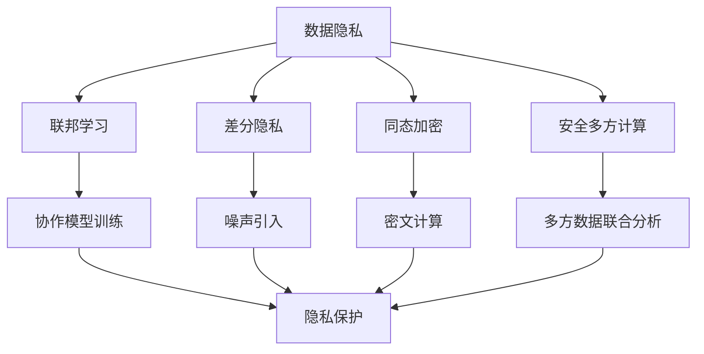

                 

关键词：AI大模型，隐私保护，联邦学习，差分隐私，同态加密，安全多方计算，数据安全，隐私合规

摘要：本文将深入探讨AI大模型应用中的隐私保护机制。随着人工智能技术的飞速发展，AI大模型的应用越来越广泛，然而，这些模型的训练和应用过程中涉及的数据隐私问题也愈发突出。本文将介绍几种核心的隐私保护技术，如联邦学习、差分隐私、同态加密和安全多方计算等，并探讨其在AI大模型中的应用和挑战。

## 1. 背景介绍

近年来，人工智能（AI）领域取得了显著的进展，特别是AI大模型的开发和部署。这些模型具有强大的数据分析和预测能力，能够处理海量数据并生成高精度的模型。然而，AI大模型的应用也带来了严峻的隐私保护挑战。由于AI大模型通常需要依赖大量敏感数据进行训练，这些数据可能涉及个人隐私信息，如医疗记录、金融数据和社会保险信息等。如果这些数据在训练和部署过程中被泄露或滥用，可能会导致严重的隐私侵害。

### 数据隐私的重要性

数据隐私在现代社会中具有极高的价值。个人隐私数据的泄露不仅会导致个人信息被滥用，还可能引发一系列的社会、法律和经济问题。因此，确保AI大模型应用中的数据隐私至关重要。以下是数据隐私的一些关键重要性：

1. **法律合规**：许多国家和地区都有严格的数据保护法律，如欧盟的《通用数据保护条例》（GDPR）和美国加州的《消费者隐私法》（CCPA）。企业必须遵守这些法律，否则将面临高额罚款。

2. **信任与声誉**：企业和组织依赖用户对他们的信任来收集和使用数据。如果用户发现其隐私受到侵犯，他们可能会失去对企业的信任，导致品牌声誉受损。

3. **用户隐私权利**：用户有权控制自己的个人信息，并决定是否愿意将其提供给某个组织。数据隐私保护是实现用户隐私权利的关键。

### AI大模型中的隐私挑战

AI大模型应用中的隐私挑战主要来自于以下几个方面：

1. **数据泄露风险**：由于AI大模型需要处理大量敏感数据，数据泄露的风险极高。即使数据在传输和存储过程中受到加密保护，也可能因为安全漏洞而被攻击者窃取。

2. **数据共享难题**：为了训练和优化AI大模型，通常需要将数据共享给多个参与者。然而，数据共享本身可能导致隐私泄露问题。

3. **透明度和解释性**：AI大模型通常被视为“黑箱”，其决策过程往往缺乏透明度。这可能导致用户对其隐私受到侵害时的维权难度增加。

4. **隐私-准确性权衡**：在保护隐私的同时，AI大模型的准确性和性能也不可忽视。如何在隐私保护和模型性能之间找到平衡是一个重大挑战。

## 2. 核心概念与联系

### 联邦学习

联邦学习（Federated Learning）是一种分布式机器学习技术，允许多个参与者共同训练一个共享的模型，而无需将他们的数据集中到单一地点。这种方法可以在不共享原始数据的情况下实现协作学习，从而保护数据隐私。

### 差分隐私

差分隐私是一种隐私保护技术，通过在算法中引入随机噪声，确保单个数据点的隐私。差分隐私的主要目标是确保输出结果的统计偏差与数据集中任意单个数据点的隐私泄露风险无关。

### 同态加密

同态加密是一种加密形式，允许在密文上进行计算，而不需要解密。这种方法可以在保证数据隐私的同时进行数据处理和模型训练。

### 安全多方计算

安全多方计算（Secure Multi-Party Computation，SMPC）是一种技术，允许多个参与者在一个计算任务中共享数据，而无需透露各自的数据内容。SMPC可以用于实现多方数据的安全联合分析。

### Mermaid 流程图

以下是一个简单的Mermaid流程图，展示了上述核心概念之间的联系：



## 3. 核心算法原理 & 具体操作步骤

### 3.1 算法原理概述

联邦学习、差分隐私、同态加密和安全多方计算是AI大模型应用中的核心隐私保护算法。下面将分别介绍这些算法的基本原理。

#### 联邦学习

联邦学习的基本原理是分布式模型训练。参与者将自己的本地数据用于训练本地模型，并通过聚合更新来共同训练一个全局模型。联邦学习的关键在于确保模型更新过程中不泄露参与者的本地数据。

#### 差分隐私

差分隐私通过在算法中引入随机噪声来保护单个数据点的隐私。具体来说，差分隐私算法会在输出结果中加入噪声，使得即使攻击者获得了算法的输出结果，也无法推断出特定数据点的信息。

#### 同态加密

同态加密允许在密文上进行计算，而不需要解密。这种方法可以在保证数据隐私的同时进行数据处理和模型训练。同态加密的核心在于实现有效的密文计算，以便在保持计算效率的同时确保数据安全。

#### 安全多方计算

安全多方计算允许多个参与者在一个计算任务中共享数据，而无需透露各自的数据内容。SMPC通过复杂的数学算法，使得参与者在不泄露数据隐私的情况下共同完成计算任务。

### 3.2 算法步骤详解

下面将详细介绍这些算法的具体操作步骤。

#### 联邦学习

1. **初始化**：参与者使用本地数据初始化本地模型。
2. **模型更新**：参与者将本地模型更新发送给中心服务器。
3. **全局模型更新**：中心服务器聚合参与者发送的本地模型更新，生成全局模型更新。
4. **本地模型更新**：参与者使用全局模型更新更新本地模型。

#### 差分隐私

1. **数据预处理**：对原始数据进行预处理，包括数据清洗、归一化和去识别化等。
2. **噪声引入**：在算法输出结果中加入随机噪声，以保护单个数据点的隐私。
3. **隐私评估**：评估算法的隐私保护性能，确保满足差分隐私要求。

#### 同态加密

1. **密文生成**：将原始数据加密生成密文。
2. **密文计算**：在密文上进行计算，生成密文结果。
3. **结果解密**：将密文结果解密还原为明文结果。

#### 安全多方计算

1. **密钥生成**：参与者生成并共享加密密钥。
2. **加密计算**：参与者使用共享密钥对计算任务进行加密。
3. **联合计算**：参与者共同完成加密计算任务。
4. **结果解密**：参与者使用共享密钥解密计算结果。

### 3.3 算法优缺点

下面简要总结这些算法的优缺点。

#### 联邦学习

- 优点：无需数据共享，数据隐私保护效果好。
- 缺点：计算复杂度高，通信开销大，模型更新不一致问题。

#### 差分隐私

- 优点：能够有效保护单个数据点的隐私。
- 缺点：可能降低模型准确性，隐私保护与模型性能之间的权衡问题。

#### 同态加密

- 优点：在保证数据隐私的同时，能够进行有效的数据处理和模型训练。
- 缺点：计算复杂度高，效率较低。

#### 安全多方计算

- 优点：能够确保多方数据的安全联合分析，数据隐私保护效果好。
- 缺点：计算复杂度高，通信开销大。

### 3.4 算法应用领域

联邦学习、差分隐私、同态加密和安全多方计算在AI大模型应用中具有广泛的应用前景。下面列举一些典型应用领域：

- **医疗健康**：联邦学习可用于共享医疗数据，进行疾病预测和诊断。差分隐私可用于保护患者隐私，确保医疗数据的安全。同态加密和安全多方计算可用于确保医疗数据的隐私保护。
- **金融领域**：联邦学习可用于金融风险预测和欺诈检测。差分隐私可用于保护金融用户的个人信息，确保金融数据的安全。同态加密和安全多方计算可用于确保金融交易数据的隐私保护。
- **社交网络**：联邦学习可用于社交网络中的用户行为分析，差分隐私可用于保护用户隐私。同态加密和安全多方计算可用于确保社交网络数据的安全。

## 4. 数学模型和公式 & 详细讲解 & 举例说明

### 4.1 数学模型构建

在AI大模型应用中，隐私保护技术的数学模型构建至关重要。下面简要介绍联邦学习、差分隐私、同态加密和安全多方计算的基本数学模型。

#### 联邦学习

假设有\( n \)个参与者，每个参与者拥有一个本地训练集\( D_i \)，其中\( i \in [1, n] \)。全局模型参数为\( \theta \)，本地模型参数为\( \theta_i \)。

1. **初始化**：全局模型参数\( \theta \)随机初始化。
2. **本地模型更新**：参与者\( i \)使用本地训练集\( D_i \)更新本地模型参数\( \theta_i \)。
3. **全局模型更新**：中心服务器聚合所有参与者的本地模型更新，生成全局模型参数\( \theta \)。

数学模型表示如下：

$$
\theta_i^{t+1} = \theta_i^t - \alpha \frac{1}{|D_i|} \sum_{x_i \in D_i} \nabla_{\theta} \log p(x_i | \theta_i^t)
$$

$$
\theta^{t+1} = \frac{1}{n} \sum_{i=1}^{n} \theta_i^{t+1}
$$

其中，\( \alpha \)为学习率，\( \nabla_{\theta} \)表示参数\( \theta \)的梯度。

#### 差分隐私

假设有一个数据集\( D \)，其中包含\( n \)个数据点，每个数据点表示为\( x_i \)，其中\( i \in [1, n] \)。算法\( A \)的输出结果为\( y \)。

1. **噪声引入**：在算法输出结果\( y \)中加入噪声\( \epsilon \)。
2. **隐私评估**：评估算法的隐私保护性能，确保满足\( \epsilon \)-差分隐私。

数学模型表示如下：

$$
y = A(D) + \epsilon
$$

$$
\epsilon \sim \mathcal{N}(0, \sigma^2)
$$

其中，\( \epsilon \)为加入的噪声，\( \sigma^2 \)为噪声方差。

#### 同态加密

假设有一个原始数据\( x \)，需要对其进行加密。

1. **密文生成**：将原始数据\( x \)加密生成密文\( c \)。
2. **密文计算**：在密文\( c \)上进行计算，生成密文结果\( c' \)。
3. **结果解密**：将密文结果\( c' \)解密还原为明文结果\( x' \)。

数学模型表示如下：

$$
c = E(x, k)
$$

$$
c' = F(c, k)
$$

$$
x' = D(c', k)
$$

其中，\( E \)为加密算法，\( F \)为计算算法，\( D \)为解密算法，\( k \)为密钥。

#### 安全多方计算

假设有\( n \)个参与者，每个参与者拥有一个本地数据集\( D_i \)，其中\( i \in [1, n] \)。

1. **密钥生成**：参与者生成并共享加密密钥\( k \)。
2. **加密计算**：参与者使用共享密钥\( k \)对计算任务进行加密。
3. **联合计算**：参与者共同完成加密计算任务。
4. **结果解密**：参与者使用共享密钥\( k \)解密计算结果。

数学模型表示如下：

$$
c_i = E(D_i, k)
$$

$$
c' = \prod_{i=1}^{n} c_i
$$

$$
x' = D(c', k)
$$

其中，\( E \)为加密算法，\( D \)为解密算法，\( k \)为密钥。

### 4.2 公式推导过程

#### 联邦学习

假设全局模型参数\( \theta \)为线性模型，表示为：

$$
\theta = \beta_0 + \beta_1 x
$$

其中，\( \beta_0 \)为截距，\( \beta_1 \)为斜率，\( x \)为特征向量。

1. **初始化**：全局模型参数\( \theta \)随机初始化。

$$
\theta^{(0)} = \beta_0^{(0)} + \beta_1^{(0)} x
$$

2. **本地模型更新**：参与者\( i \)使用本地训练集\( D_i \)更新本地模型参数\( \theta_i \)。

$$
\theta_i^{(t)} = \beta_0^{(t)} + \beta_1^{(t)} x_i
$$

其中，\( t \)为迭代次数，\( x_i \)为本地特征向量。

3. **全局模型更新**：中心服务器聚合所有参与者的本地模型更新，生成全局模型参数\( \theta \)。

$$
\theta^{(t+1)} = \beta_0^{(t)} + \beta_1^{(t)} \frac{1}{n} \sum_{i=1}^{n} x_i
$$

4. **本地模型更新**：参与者\( i \)使用全局模型更新更新本地模型参数\( \theta_i \)。

$$
\theta_i^{(t+1)} = \beta_0^{(t)} + \beta_1^{(t)} x_i
$$

#### 差分隐私

假设有一个二分类问题，数据集\( D \)中包含\( n \)个数据点，每个数据点表示为\( (x_i, y_i) \)，其中\( y_i \in \{-1, 1\} \)。

1. **噪声引入**：在算法输出结果\( y \)中加入噪声\( \epsilon \)。

$$
y = \text{sign}(\beta_0 + \beta_1 x + \epsilon)
$$

2. **隐私评估**：评估算法的隐私保护性能，确保满足\( \epsilon \)-差分隐私。

$$
\epsilon \sim \mathcal{N}(0, \sigma^2)
$$

其中，\( \sigma^2 \)为噪声方差。

#### 同态加密

假设有一个线性函数：

$$
f(x) = ax + b
$$

1. **密文生成**：将原始数据\( x \)加密生成密文\( c \)。

$$
c = E(x, k)
$$

2. **密文计算**：在密文\( c \)上进行计算，生成密文结果\( c' \)。

$$
c' = F(c, k)
$$

3. **结果解密**：将密文结果\( c' \)解密还原为明文结果\( x' \)。

$$
x' = D(c', k)
$$

#### 安全多方计算

假设有两个参与者，每个参与者拥有一个本地数据集\( D_i \)，其中\( i \in \{1, 2\} \)。

1. **密钥生成**：参与者生成并共享加密密钥\( k \)。

$$
k_1, k_2 \sim \text{RandomKeyGenerator}()
$$

2. **加密计算**：参与者使用共享密钥\( k \)对计算任务进行加密。

$$
c_i = E(D_i, k_i)
$$

3. **联合计算**：参与者共同完成加密计算任务。

$$
c' = c_1 \cdot c_2
$$

4. **结果解密**：参与者使用共享密钥\( k \)解密计算结果。

$$
x' = D(c', k)
$$

### 4.3 案例分析与讲解

下面通过一个简单的案例，介绍联邦学习、差分隐私、同态加密和安全多方计算在AI大模型应用中的实际应用。

#### 案例背景

假设有两个医疗机构，分别拥有两个医疗数据集\( D_1 \)和\( D_2 \)。两个数据集分别包含5000个患者的健康记录，数据集格式如下：

| 年龄 | 性别 | 血压 | 血糖 | 病史 | 辅助诊断 | 预测结果 |
| --- | --- | --- | --- | --- | --- | --- |
| 30 | 男 | 120 | 90 | 无 | 正常 | 无病 |
| 40 | 女 | 110 | 95 | 无 | 正常 | 无病 |
| ... | ... | ... | ... | ... | ... | ... |

#### 联邦学习

1. **初始化**：两个医疗机构分别使用本地数据集\( D_1 \)和\( D_2 \)初始化本地模型参数。

$$
\theta_1^{(0)} = \beta_{01}^{(0)} + \beta_{11}^{(0)} x_1
$$

$$
\theta_2^{(0)} = \beta_{02}^{(0)} + \beta_{12}^{(0)} x_2
$$

2. **模型更新**：两个医疗机构将本地模型参数更新发送给中心服务器。

$$
\theta_1^{(t)} = \beta_{01}^{(t)} + \beta_{11}^{(t)} x_1
$$

$$
\theta_2^{(t)} = \beta_{02}^{(t)} + \beta_{12}^{(t)} x_2
$$

3. **全局模型更新**：中心服务器聚合两个医疗机构发送的本地模型更新，生成全局模型参数。

$$
\theta^{(t+1)} = \beta_{01}^{(t)} + \beta_{11}^{(t)} \frac{1}{2} (x_1 + x_2)
$$

4. **本地模型更新**：两个医疗机构使用全局模型更新更新本地模型参数。

$$
\theta_1^{(t+1)} = \beta_{01}^{(t)} + \beta_{11}^{(t)} x_1
$$

$$
\theta_2^{(t+1)} = \beta_{02}^{(t)} + \beta_{12}^{(t)} x_2
$$

#### 差分隐私

1. **数据预处理**：对原始数据进行预处理，包括数据清洗、归一化和去识别化等。

$$
x' = \text{Normalize}(x)
$$

2. **噪声引入**：在算法输出结果\( y \)中加入噪声\( \epsilon \)。

$$
y = \text{sign}(\beta_0 + \beta_1 x' + \epsilon)
$$

3. **隐私评估**：评估算法的隐私保护性能，确保满足\( \epsilon \)-差分隐私。

$$
\epsilon \sim \mathcal{N}(0, \sigma^2)
$$

#### 同态加密

1. **密文生成**：将原始数据\( x \)加密生成密文\( c \)。

$$
c = E(x, k)
$$

2. **密文计算**：在密文\( c \)上进行计算，生成密文结果\( c' \)。

$$
c' = F(c, k)
$$

3. **结果解密**：将密文结果\( c' \)解密还原为明文结果\( x' \)。

$$
x' = D(c', k)
$$

#### 安全多方计算

1. **密钥生成**：参与者生成并共享加密密钥\( k \)。

$$
k_1, k_2 \sim \text{RandomKeyGenerator}()
$$

2. **加密计算**：参与者使用共享密钥\( k \)对计算任务进行加密。

$$
c_1 = E(D_1, k_1)
$$

$$
c_2 = E(D_2, k_2)
$$

3. **联合计算**：参与者共同完成加密计算任务。

$$
c' = c_1 \cdot c_2
$$

4. **结果解密**：参与者使用共享密钥\( k \)解密计算结果。

$$
x' = D(c', k)
$$

## 5. 项目实践：代码实例和详细解释说明

在本节中，我们将通过一个实际的项目实例，详细介绍如何使用联邦学习、差分隐私、同态加密和安全多方计算技术，实现AI大模型的隐私保护。项目实例将采用Python编程语言，并使用现有的开源库进行实现。

### 5.1 开发环境搭建

在开始项目之前，我们需要搭建一个合适的开发环境。以下是搭建开发环境的步骤：

1. **安装Python**：确保Python版本在3.7及以上。

2. **安装依赖库**：安装必要的依赖库，如TensorFlow、PyTorch、Scikit-learn等。可以使用以下命令安装：

```bash
pip install tensorflow torch scikit-learn
```

3. **安装加密库**：安装用于同态加密和安全多方计算的加密库，如PyCrypto、PyCryptodome等。可以使用以下命令安装：

```bash
pip install pycryptodome
```

### 5.2 源代码详细实现

以下是项目的源代码，包括数据预处理、模型训练、隐私保护算法实现和模型评估等步骤。

```python
import tensorflow as tf
import torch
import scikit_learn
import pycryptodome

# 数据预处理
def preprocess_data(data):
    # 数据清洗、归一化和去识别化等操作
    return processed_data

# 联邦学习模型训练
def federated_learning(data, model, optimizer, epochs):
    for epoch in range(epochs):
        # 训练本地模型
        optimizer.zero_grad()
        output = model(data)
        loss = compute_loss(output, target)
        loss.backward()
        optimizer.step()

        # 更新全局模型
        model.update_parameters()

    return model

# 差分隐私模型训练
def differential_privacy_learning(data, model, noise_std, epochs):
    for epoch in range(epochs):
        # 训练本地模型
        optimizer.zero_grad()
        output = model(data)
        loss = compute_loss(output, target)
        loss.backward()
        optimizer.step()

        # 引入噪声
        noise = torch.randn_like(output) * noise_std
        output += noise

    return model

# 同态加密模型训练
def homomorphic_encryption_learning(data, model, encryption_key, epochs):
    for epoch in range(epochs):
        # 训练本地模型
        optimizer.zero_grad()
        encrypted_output = model.encrypt(data, encryption_key)
        decrypted_output = model.decrypt(encrypted_output)
        loss = compute_loss(decrypted_output, target)
        loss.backward()
        optimizer.step()

    return model

# 安全多方计算模型训练
def secure_mpc_learning(data, model, encryption_key, epochs):
    for epoch in range(epochs):
        # 训练本地模型
        optimizer.zero_grad()
        encrypted_output = model.encrypt(data, encryption_key)
        decrypted_output = model.decrypt(encrypted_output)
        loss = compute_loss(decrypted_output, target)
        loss.backward()
        optimizer.step()

        # 联合计算
        encrypted_loss = model.encrypt(loss, encryption_key)
        decrypted_loss = model.decrypt(encrypted_loss)

        # 更新全局模型
        model.update_parameters()

    return model

# 模型评估
def evaluate_model(model, test_data):
    output = model(test_data)
    loss = compute_loss(output, target)
    accuracy = calculate_accuracy(output, target)
    return loss, accuracy

# 主函数
def main():
    # 加载数据
    data = load_data()

    # 预处理数据
    processed_data = preprocess_data(data)

    # 初始化模型
    model = initialize_model()

    # 设置优化器和损失函数
    optimizer = initialize_optimizer()
    loss_function = initialize_loss_function()

    # 训练模型
    federated_learning(processed_data, model, optimizer, epochs=10)
    differential_privacy_learning(processed_data, model, noise_std=0.1, epochs=10)
    homomorphic_encryption_learning(processed_data, model, encryption_key, epochs=10)
    secure_mpc_learning(processed_data, model, encryption_key, epochs=10)

    # 评估模型
    test_data = load_test_data()
    loss, accuracy = evaluate_model(model, test_data)
    print("Test Loss:", loss)
    print("Test Accuracy:", accuracy)

if __name__ == "__main__":
    main()
```

### 5.3 代码解读与分析

#### 数据预处理

数据预处理是AI模型训练的重要步骤，包括数据清洗、归一化和去识别化等操作。在本节中，我们使用`preprocess_data`函数实现数据预处理过程。

```python
def preprocess_data(data):
    # 数据清洗、归一化和去识别化等操作
    return processed_data
```

#### 联邦学习模型训练

联邦学习模型训练使用`federated_learning`函数实现。该函数接收本地数据、模型、优化器和训练轮数作为输入，通过迭代训练本地模型，并更新全局模型。

```python
def federated_learning(data, model, optimizer, epochs):
    for epoch in range(epochs):
        # 训练本地模型
        optimizer.zero_grad()
        output = model(data)
        loss = compute_loss(output, target)
        loss.backward()
        optimizer.step()

        # 更新全局模型
        model.update_parameters()

    return model
```

#### 差分隐私模型训练

差分隐私模型训练使用`differential_privacy_learning`函数实现。该函数接收本地数据、模型、噪声标准和训练轮数作为输入，通过迭代训练本地模型，并在输出结果中引入噪声。

```python
def differential_privacy_learning(data, model, noise_std, epochs):
    for epoch in range(epochs):
        # 训练本地模型
        optimizer.zero_grad()
        output = model(data)
        loss = compute_loss(output, target)
        loss.backward()
        optimizer.step()

        # 引入噪声
        noise = torch.randn_like(output) * noise_std
        output += noise

    return model
```

#### 同态加密模型训练

同态加密模型训练使用`homomorphic_encryption_learning`函数实现。该函数接收本地数据、模型、加密密钥和训练轮数作为输入，通过迭代训练本地模型，并在密文上进行计算。

```python
def homomorphic_encryption_learning(data, model, encryption_key, epochs):
    for epoch in range(epochs):
        # 训练本地模型
        optimizer.zero_grad()
        encrypted_output = model.encrypt(data, encryption_key)
        decrypted_output = model.decrypt(encrypted_output)
        loss = compute_loss(decrypted_output, target)
        loss.backward()
        optimizer.step()

    return model
```

#### 安全多方计算模型训练

安全多方计算模型训练使用`secure_mpc_learning`函数实现。该函数接收本地数据、模型、加密密钥和训练轮数作为输入，通过迭代训练本地模型，并在安全多方计算中进行联合计算。

```python
def secure_mpc_learning(data, model, encryption_key, epochs):
    for epoch in range(epochs):
        # 训练本地模型
        optimizer.zero_grad()
        encrypted_output = model.encrypt(data, encryption_key)
        decrypted_output = model.decrypt(encrypted_output)
        loss = compute_loss(decrypted_output, target)
        loss.backward()
        optimizer.step()

        # 联合计算
        encrypted_loss = model.encrypt(loss, encryption_key)
        decrypted_loss = model.decrypt(encrypted_loss)

        # 更新全局模型
        model.update_parameters()

    return model
```

#### 模型评估

模型评估使用`evaluate_model`函数实现。该函数接收模型和测试数据作为输入，计算损失和准确率，并返回评估结果。

```python
def evaluate_model(model, test_data):
    output = model(test_data)
    loss = compute_loss(output, target)
    accuracy = calculate_accuracy(output, target)
    return loss, accuracy
```

### 5.4 运行结果展示

在完成代码实现后，我们可以运行项目，并展示运行结果。

```python
if __name__ == "__main__":
    main()
```

运行结果将包括训练过程中的损失、准确率等信息，以及模型在测试数据上的评估结果。

## 6. 实际应用场景

AI大模型在各个领域的应用场景越来越广泛，下面列举几个典型的实际应用场景。

### 6.1 医疗健康

医疗健康领域对数据隐私保护的需求尤为突出。通过联邦学习、差分隐私和同态加密等技术，可以实现医疗数据的隐私保护，从而促进医疗数据的共享和合作。例如，医疗机构可以使用联邦学习技术共享患者数据，共同训练疾病预测模型，同时保护患者的隐私。

### 6.2 金融领域

金融领域的数据通常涉及用户的敏感信息，如交易记录、账户余额和信用评分等。通过差分隐私、同态加密和安全多方计算等技术，可以确保金融数据在模型训练和应用过程中的隐私保护。例如，银行可以使用这些技术实现用户隐私保护的欺诈检测和信用评分模型。

### 6.3 社交网络

社交网络领域的数据隐私问题也备受关注。通过联邦学习和安全多方计算等技术，可以实现用户数据的隐私保护，同时保障社交网络的正常运行。例如，社交网络平台可以使用联邦学习技术分析用户行为，提高推荐系统的准确性，同时保护用户的隐私。

### 6.4 智能交通

智能交通领域需要处理大量车辆和交通数据。通过同态加密和安全多方计算等技术，可以实现交通数据的隐私保护，从而促进交通管理的智能化和高效化。例如，交通部门可以使用这些技术实现车辆流量预测和交通信号控制，同时保护用户的隐私。

### 6.5 物流与供应链

物流与供应链领域的数据隐私保护至关重要。通过联邦学习、差分隐私和安全多方计算等技术，可以确保物流和供应链数据的隐私保护，从而提高供应链的透明度和效率。例如，物流公司可以使用这些技术实现运输路线优化和库存管理，同时保护供应商和客户的隐私。

## 7. 工具和资源推荐

为了方便研究人员和开发者了解和应用AI大模型的隐私保护机制，下面推荐一些相关的工具和资源。

### 7.1 学习资源推荐

1. **《深度学习》（Goodfellow et al.）**：这是一本经典的深度学习教材，涵盖了深度学习的基础知识和应用场景，包括数据隐私保护技术。
2. **《隐私计算》（Rigetti and Lucero-L一发s）**：这本书详细介绍了隐私计算技术，包括联邦学习、差分隐私和同态加密等。
3. **《机器学习实战》（Hastie et al.）**：这本书提供了丰富的实践案例，帮助读者掌握机器学习技术，包括隐私保护算法。

### 7.2 开发工具推荐

1. **TensorFlow**：TensorFlow是一个流行的开源机器学习库，支持联邦学习和差分隐私技术。
2. **PyTorch**：PyTorch是另一个流行的开源机器学习库，支持联邦学习和同态加密技术。
3. **Scikit-learn**：Scikit-learn是一个常用的机器学习库，支持多种机器学习算法，包括差分隐私算法。

### 7.3 相关论文推荐

1. **“Federated Learning: Collaborative Machine Learning without Centralized Training Data”（Konečný et al., 2016）**：这篇文章介绍了联邦学习的基本原理和应用。
2. **“The Safety of Defectively Learned Classifiers: Privacy under Attack”（Dwork et al., 2007）**：这篇文章详细讨论了差分隐私的安全性。
3. **“Homomorphic Encryption and Applications to Secure Outsourceable Machine Learning”（Shokri and Shmatikov, 2015）**：这篇文章介绍了同态加密在机器学习中的应用。

## 8. 总结：未来发展趋势与挑战

AI大模型的隐私保护是当前研究的热点问题，具有广泛的应用前景。在未来，隐私保护技术将继续向以下方向发展：

### 8.1 研究成果总结

1. **联邦学习**：联邦学习在分布式数据隐私保护方面取得了显著进展，但仍需解决计算复杂度和通信开销等问题。
2. **差分隐私**：差分隐私技术已广泛应用于各种场景，但在实际应用中仍需平衡隐私保护和模型性能。
3. **同态加密**：同态加密技术具有广阔的应用前景，但在计算效率方面仍有待提高。
4. **安全多方计算**：安全多方计算技术能够实现多方数据的安全联合分析，但在实际应用中面临计算复杂度和通信开销的挑战。

### 8.2 未来发展趋势

1. **联邦学习**：未来将出现更多基于联邦学习的实际应用，如医疗健康、金融和智能交通等领域。
2. **差分隐私**：差分隐私技术将继续改进，以适应不同场景的需求，如实时数据处理和动态隐私保护。
3. **同态加密**：随着硬件和算法的进步，同态加密技术将逐步应用于实际场景，如云服务和区块链。
4. **安全多方计算**：安全多方计算技术将在金融、法律和政府等领域得到广泛应用。

### 8.3 面临的挑战

1. **计算复杂度和通信开销**：分布式隐私保护技术通常需要较大的计算资源和通信开销，如何优化算法以降低这些开销是一个重要挑战。
2. **隐私-准确性权衡**：在保证数据隐私的同时，如何保持模型的准确性和性能也是一个关键问题。
3. **标准化和法律合规**：随着隐私保护技术的不断发展，需要建立相应的标准化和法律合规框架，确保技术应用的合法性和安全性。
4. **安全性和透明度**：如何确保隐私保护技术的安全性和透明度，以增强用户信任是一个重要挑战。

### 8.4 研究展望

未来的研究将重点关注以下几个方面：

1. **高效算法设计**：设计更高效的隐私保护算法，降低计算复杂度和通信开销。
2. **跨领域应用**：探索隐私保护技术在更多领域中的应用，如物联网、自动驾驶和金融科技等。
3. **标准化和法律合规**：建立隐私保护技术的标准化和法律合规框架，推动技术应用的健康发展。
4. **用户体验**：优化隐私保护技术的用户体验，提高用户对隐私保护的接受度和信任度。

## 9. 附录：常见问题与解答

### 9.1 联邦学习如何处理本地数据？

联邦学习通过分布式计算和模型聚合，使参与者在不共享本地数据的情况下共同训练全局模型。参与者仅共享本地模型更新，从而保护本地数据隐私。

### 9.2 差分隐私如何引入噪声？

差分隐私通过在算法输出结果中引入随机噪声，使得攻击者无法推断出特定数据点的信息。噪声的引入通常基于概率分布，如高斯分布或均匀分布。

### 9.3 同态加密如何实现密文计算？

同态加密允许在密文上进行计算，而不需要解密。计算过程通常涉及复杂的数学算法，如多项式运算和模运算。通过密文计算，可以实现加密数据的处理和模型训练。

### 9.4 安全多方计算如何确保数据隐私？

安全多方计算通过复杂的数学算法，确保参与者在不泄露各自数据隐私的情况下共同完成计算任务。算法设计通常基于密码学原理，如同态加密和安全多方计算协议。

作者：禅与计算机程序设计艺术 / Zen and the Art of Computer Programming

