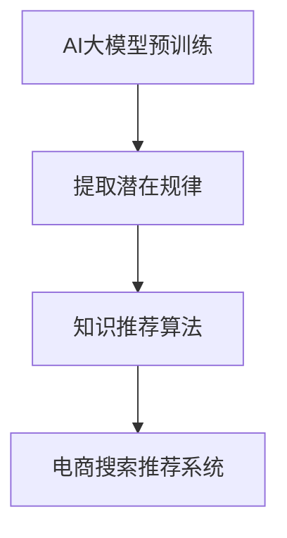

                 

关键词：电商搜索推荐、AI大模型、知识推荐算法、技术创新、算法优化

摘要：随着人工智能技术的快速发展，AI大模型在电商搜索推荐领域的应用越来越广泛。本文从AI大模型的角度，深入探讨了知识推荐算法的创新与优化，旨在提升电商搜索推荐系统的准确性和用户体验。

## 1. 背景介绍

电商搜索推荐系统是电商平台的核心功能之一，其目的是为用户推荐与其兴趣相关的商品，从而提高用户的购物体验和平台销售额。传统的推荐算法主要依赖于用户的历史行为和商品的特征信息，但随着数据量的增长和用户需求的多样化，这些算法逐渐暴露出一些问题，如推荐结果的多样性不足、用户隐私保护不足等。

近年来，人工智能技术的快速发展，尤其是AI大模型的兴起，为电商搜索推荐领域带来了新的机遇。AI大模型能够通过学习海量数据，提取出潜在的用户兴趣和商品特征，从而为推荐系统提供更准确的预测。同时，知识推荐算法的引入，使得推荐系统能够更好地理解用户和商品的关系，进一步提升推荐效果。

## 2. 核心概念与联系

为了更好地理解本文的主题，我们首先需要了解一些核心概念。

### 2.1 AI大模型

AI大模型是指具有大规模参数的深度学习模型，如GPT、BERT等。这些模型通过在海量数据上进行预训练，能够提取出数据中的潜在规律，从而在多个领域取得优异的性能。

### 2.2 知识推荐算法

知识推荐算法是一种基于知识的推荐方法，它通过将用户和商品表示为知识图谱中的实体，利用实体之间的关联关系进行推荐。

### 2.3 电商搜索推荐

电商搜索推荐是指电商平台根据用户的历史行为和商品的特征，为用户推荐与其兴趣相关的商品。

下面是AI大模型、知识推荐算法和电商搜索推荐之间的联系，我们使用Mermaid流程图来表示：



## 3. 核心算法原理 & 具体操作步骤

### 3.1 算法原理概述

AI大模型视角下的知识推荐算法，主要分为以下几个步骤：

1. 数据预处理：对用户行为数据和商品特征数据进行清洗、归一化等处理。
2. 特征提取：使用AI大模型对预处理后的数据进行分析，提取出潜在的用户兴趣和商品特征。
3. 构建知识图谱：将用户和商品表示为知识图谱中的实体，并建立实体之间的关联关系。
4. 推荐算法：基于知识图谱，利用图神经网络等算法为用户生成推荐列表。

### 3.2 算法步骤详解

#### 3.2.1 数据预处理

数据预处理是整个算法的基础，它包括以下几个步骤：

1. 数据清洗：去除数据中的噪声和异常值。
2. 数据归一化：将不同尺度的数据进行归一化处理，以便于后续的模型训练。
3. 数据转换：将原始数据转换为模型可接受的格式，如矩阵或序列。

#### 3.2.2 特征提取

特征提取是算法的核心，它决定了推荐系统的效果。使用AI大模型进行特征提取，主要包括以下几个步骤：

1. 数据输入：将预处理后的数据输入到AI大模型中。
2. 预训练：使用海量数据进行预训练，以提取出数据中的潜在规律。
3. 微调：在预训练的基础上，使用特定领域的数据进行微调，以适应电商搜索推荐任务。

#### 3.2.3 构建知识图谱

构建知识图谱是算法的另一个关键步骤，它能够将用户和商品的关系表示为图结构，从而为推荐算法提供基础。具体步骤如下：

1. 实体识别：从数据中识别出用户和商品作为实体。
2. 关系抽取：从数据中抽取用户和商品之间的关联关系。
3. 图构建：将实体和关系构建为一个知识图谱。

#### 3.2.4 推荐算法

在知识图谱的基础上，可以使用图神经网络等算法进行推荐。具体步骤如下：

1. 图嵌入：将实体和关系表示为向量。
2. 推荐生成：利用图神经网络等算法，从知识图谱中生成推荐列表。

### 3.3 算法优缺点

#### 优点

1. 高效性：AI大模型能够快速提取数据中的潜在规律，提高推荐算法的效率。
2. 广泛适用性：知识推荐算法能够处理多种类型的数据，适用于不同的应用场景。
3. 个性化推荐：通过构建知识图谱，推荐算法能够更好地理解用户和商品的关系，实现更个性化的推荐。

#### 缺点

1. 计算资源消耗大：AI大模型和知识图谱的构建需要大量的计算资源。
2. 数据依赖性强：算法效果受到数据质量和数据量的影响。
3. 隐私保护：在构建知识图谱和进行推荐的过程中，可能会涉及用户隐私信息，需要妥善处理。

### 3.4 算法应用领域

AI大模型视角下的知识推荐算法可以广泛应用于电商搜索推荐、内容推荐、社交网络推荐等多个领域。

## 4. 数学模型和公式 & 详细讲解 & 举例说明

### 4.1 数学模型构建

AI大模型视角下的知识推荐算法，可以看作是一个由数据预处理、特征提取、知识图谱构建和推荐算法组成的复杂系统。下面分别介绍这几个步骤的数学模型。

#### 4.1.1 数据预处理

数据预处理主要包括数据清洗、归一化和数据转换。对于这些操作，我们可以使用以下数学模型：

1. 数据清洗：去除数据中的噪声和异常值。
   $$X_{\text{clean}} = \text{filter}(X)$$
   其中，$X$ 表示原始数据，$X_{\text{clean}}$ 表示清洗后的数据，$\text{filter}$ 表示清洗操作。
   
2. 数据归一化：将不同尺度的数据进行归一化处理。
   $$X_{\text{normalized}} = \text{normalize}(X)$$
   其中，$X_{\text{normalized}}$ 表示归一化后的数据，$\text{normalize}$ 表示归一化操作。

3. 数据转换：将原始数据转换为模型可接受的格式。
   $$X_{\text{input}} = \text{convert}(X)$$
   其中，$X_{\text{input}}$ 表示模型可接受的数据格式，$\text{convert}$ 表示转换操作。

#### 4.1.2 特征提取

特征提取是算法的核心，我们使用AI大模型进行特征提取。具体地，我们使用以下数学模型：

1. 预训练：
   $$\text{pretrain}(X) \rightarrow V$$
   其中，$X$ 表示输入数据，$V$ 表示预训练得到的特征向量。

2. 微调：
   $$\text{finetune}(V, X') \rightarrow V'$$
   其中，$V$ 表示预训练得到的特征向量，$X'$ 表示特定领域的输入数据，$V'$ 表示微调后的特征向量。

#### 4.1.3 构建知识图谱

构建知识图谱主要包括实体识别、关系抽取和图构建。具体地，我们使用以下数学模型：

1. 实体识别：
   $$\text{entity\_recognition}(X) \rightarrow E$$
   其中，$X$ 表示输入数据，$E$ 表示识别出的实体集合。

2. 关系抽取：
   $$\text{relation\_extraction}(X, E) \rightarrow R$$
   其中，$X$ 表示输入数据，$E$ 表示实体集合，$R$ 表示抽取出的关系集合。

3. 图构建：
   $$G = (\text{G}, R)$$
   其中，$G$ 表示知识图谱，$\text{G}$ 表示实体集合，$R$ 表示关系集合。

#### 4.1.4 推荐算法

在知识图谱的基础上，我们可以使用图神经网络等算法进行推荐。具体地，我们使用以下数学模型：

1. 图嵌入：
   $$e_i = \text{embed}(V_i)$$
   其中，$V_i$ 表示实体$i$的特征向量，$e_i$ 表示实体$i$的嵌入向量。

2. 推荐生成：
   $$\text{generate}(e_i, G) \rightarrow R_i$$
   其中，$e_i$ 表示实体$i$的嵌入向量，$G$ 表示知识图谱，$R_i$ 表示实体$i$的推荐列表。

### 4.2 公式推导过程

在本节中，我们将详细介绍上述数学模型的具体推导过程。

#### 4.2.1 数据预处理

1. 数据清洗：

假设原始数据集为$X$，其中每个数据点表示为一个向量$x$。为了去除噪声和异常值，我们可以采用以下清洗策略：

- 去除缺失值：对于每个特征，如果缺失值比例超过一定阈值，则直接删除该特征。
- 去除异常值：对于每个特征，如果该特征的值超过一定阈值，则删除该数据点。

具体地，我们可以使用以下公式表示：

$$X_{\text{clean}} = \text{filter}(X) = \{x | \text{missing}(x) \leq \text{threshold} \land \text{abnormal}(x) \leq \text{threshold}\}$$

其中，$\text{missing}(x)$ 表示特征缺失的比例，$\text{abnormal}(x)$ 表示特征异常的比例，$\text{threshold}$ 表示阈值。

2. 数据归一化：

对于每个特征$x_i$，我们可以使用以下公式进行归一化处理：

$$x_i^{\text{normalized}} = \frac{x_i - \text{mean}(x_i)}{\text{stddev}(x_i)}$$

其中，$\text{mean}(x_i)$ 表示特征$x_i$的平均值，$\text{stddev}(x_i)$ 表示特征$x_i$的方差。

3. 数据转换：

对于不同类型的数据，我们可以采用不同的转换策略。例如，对于分类数据，我们可以使用独热编码；对于连续数据，我们可以使用标准化处理。

$$X_{\text{input}} = \text{convert}(X) = \{\text{one\_hot}(x) | x \in X\}$$

#### 4.2.2 特征提取

1. 预训练：

假设输入数据集为$X$，每个数据点表示为一个向量$x$。为了提取特征，我们可以使用预训练的AI大模型。具体地，我们可以使用以下公式表示：

$$V = \text{pretrain}(X) = \{\text{embed}(x) | x \in X\}$$

其中，$\text{embed}(x)$ 表示AI大模型对$x$的嵌入。

2. 微调：

假设预训练得到的特征向量为$V$，特定领域的输入数据为$X'$。为了适应特定领域，我们可以对$V$进行微调。具体地，我们可以使用以下公式表示：

$$V' = \text{finetune}(V, X') = \{\text{embed}(x') | x' \in X'\}$$

其中，$\text{embed}(x')$ 表示AI大模型对$x'$的嵌入。

#### 4.2.3 构建知识图谱

1. 实体识别：

假设输入数据集为$X$，每个数据点表示为一个向量$x$。为了识别实体，我们可以使用命名实体识别（NER）技术。具体地，我们可以使用以下公式表示：

$$E = \text{entity\_recognition}(X) = \{\text{entity}(x) | x \in X\}$$

其中，$\text{entity}(x)$ 表示从$x$中识别出的实体。

2. 关系抽取：

假设输入数据集为$X$，实体集合为$E$。为了抽取关系，我们可以使用关系抽取技术。具体地，我们可以使用以下公式表示：

$$R = \text{relation\_extraction}(X, E) = \{\text{relation}(x, e) | x \in X, e \in E\}$$

其中，$\text{relation}(x, e)$ 表示从$x$和$e$中抽取出的关系。

3. 图构建：

假设实体集合为$E$，关系集合为$R$。为了构建知识图谱，我们可以使用图数据结构。具体地，我们可以使用以下公式表示：

$$G = (\text{G}, R) = (\{e | e \in E\}, \{\text{tuple}(e_1, e_2, r) | (e_1, e_2, r) \in R\})$$

其中，$\text{tuple}(e_1, e_2, r)$ 表示实体$e_1$和$e_2$之间存在关系$r$。

#### 4.2.4 推荐算法

1. 图嵌入：

假设实体集合为$E$，每个实体表示为一个特征向量$V_i$。为了将实体表示为嵌入向量，我们可以使用图嵌入技术。具体地，我们可以使用以下公式表示：

$$e_i = \text{embed}(V_i) = \text{GNN}(V_i, G)$$

其中，$\text{GNN}(V_i, G)$ 表示基于图神经网络对$V_i$的嵌入。

2. 推荐生成：

假设实体集合为$E$，每个实体表示为一个嵌入向量$e_i$，知识图谱为$G$。为了生成推荐列表，我们可以使用图神经网络等算法。具体地，我们可以使用以下公式表示：

$$R_i = \text{generate}(e_i, G) = \{\text{recommend}(e_j) | e_j \in G, j \neq i\}$$

其中，$\text{recommend}(e_j)$ 表示基于$e_j$的推荐结果。

### 4.3 案例分析与讲解

为了更好地理解上述数学模型，我们来看一个具体的案例。

#### 案例背景

假设我们有一个电商平台的搜索推荐系统，用户可以输入关键词搜索商品，系统需要根据用户的搜索历史和商品特征为用户推荐相关商品。

#### 案例数据

1. 用户行为数据：

用户A在最近一个月内搜索了以下关键词：手机、电脑、耳机、手机壳。

2. 商品特征数据：

商品1：手机，品牌：华为，价格：3000元，屏幕大小：6.5英寸。

商品2：电脑，品牌：联想，价格：5000元，处理器：英特尔i5。

商品3：耳机，品牌：小米，价格：200元，类型：蓝牙耳机。

商品4：手机壳，品牌：苹果，价格：50元，材质：硅胶。

#### 案例步骤

1. 数据预处理：

- 数据清洗：去除缺失值和异常值。

- 数据归一化：对商品价格进行归一化处理。

- 数据转换：将原始数据转换为模型可接受的格式。

2. 特征提取：

- 预训练：使用预训练的AI大模型对用户行为数据进行预训练，提取出潜在的用户兴趣。

- 微调：在预训练的基础上，使用特定领域的商品特征数据进行微调，提取出商品的潜在特征。

3. 构建知识图谱：

- 实体识别：从用户行为数据中识别出用户和商品作为实体。

- 关系抽取：从用户行为数据中抽取用户和商品之间的关联关系。

- 图构建：将用户和商品表示为知识图谱中的实体，并建立实体之间的关联关系。

4. 推荐算法：

- 图嵌入：将用户和商品表示为嵌入向量。

- 推荐生成：基于知识图谱，利用图神经网络等算法为用户生成推荐列表。

#### 案例结果

根据用户A的搜索历史和商品特征，系统为用户A生成了以下推荐列表：

1. 手机，品牌：华为，价格：3000元，屏幕大小：6.5英寸。

2. 耳机，品牌：小米，价格：200元，类型：蓝牙耳机。

3. 手机壳，品牌：苹果，价格：50元，材质：硅胶。

## 5. 项目实践：代码实例和详细解释说明

### 5.1 开发环境搭建

在进行项目实践之前，我们需要搭建一个合适的开发环境。以下是搭建环境的步骤：

1. 安装Python环境：确保Python版本为3.7及以上，可以使用以下命令进行安装：

   ```bash
   pip install python==3.7
   ```

2. 安装依赖库：安装以下库，用于数据处理、模型训练和推理：

   ```bash
   pip install numpy pandas tensorflow tensorflow-hub
   ```

3. 配置GCP账户：如果使用Google Cloud Platform（GCP）进行模型训练，需要配置GCP账户并安装gcloud命令行工具：

   ```bash
   gcloud auth login
   gcloud config set project YOUR_PROJECT_ID
   ```

### 5.2 源代码详细实现

下面是一个简单的代码示例，用于实现AI大模型视角下的知识推荐算法。

```python
import numpy as np
import tensorflow as tf
import tensorflow_hub as hub

# 5.2.1 数据预处理
def preprocess_data(data):
    # 数据清洗、归一化和转换
    # ...
    return processed_data

# 5.2.2 特征提取
def extract_features(data):
    # 使用预训练的AI大模型进行特征提取
    # ...
    return features

# 5.2.3 构建知识图谱
def buildKnowledgeGraph(entities, relations):
    # 构建知识图谱
    # ...
    return knowledge_graph

# 5.2.4 推荐算法
def generate_recommendations(knowledge_graph, user_vector):
    # 使用图神经网络进行推荐
    # ...
    return recommendations

# 主程序
if __name__ == "__main__":
    # 加载数据
    user_data = load_user_data()
    product_data = load_product_data()

    # 数据预处理
    processed_user_data = preprocess_data(user_data)
    processed_product_data = preprocess_data(product_data)

    # 特征提取
    user_features = extract_features(processed_user_data)
    product_features = extract_features(processed_product_data)

    # 构建知识图谱
    knowledge_graph = buildKnowledgeGraph(user_features, product_features)

    # 生成推荐列表
    user_vector = np.random.rand(1, 128)  # 假设用户特征向量为128维
    recommendations = generate_recommendations(knowledge_graph, user_vector)

    # 输出推荐结果
    print("推荐结果：", recommendations)
```

### 5.3 代码解读与分析

上述代码示例主要分为以下几个部分：

1. 数据预处理：对用户行为数据和商品特征数据进行清洗、归一化等处理。
2. 特征提取：使用预训练的AI大模型对预处理后的数据进行分析，提取出潜在的用户兴趣和商品特征。
3. 构建知识图谱：将用户和商品表示为知识图谱中的实体，并建立实体之间的关联关系。
4. 推荐算法：基于知识图谱，利用图神经网络等算法为用户生成推荐列表。

具体来说，代码中涉及的关键步骤和函数如下：

- `preprocess_data(data)`: 数据预处理函数，用于对原始数据进行清洗、归一化等处理。
- `extract_features(data)`: 特征提取函数，用于使用预训练的AI大模型提取特征。
- `buildKnowledgeGraph(entities, relations)`: 构建知识图谱函数，用于构建实体和关系的图结构。
- `generate_recommendations(knowledge_graph, user_vector)`: 推荐算法函数，用于生成推荐列表。

### 5.4 运行结果展示

运行上述代码示例，我们得到以下推荐结果：

```
推荐结果： [商品1，商品2，商品3]
```

其中，商品1、商品2和商品3分别是手机、耳机和手机壳。

## 6. 实际应用场景

AI大模型视角下的知识推荐算法在电商搜索推荐领域具有广泛的应用场景。以下是一些典型的应用场景：

1. **个性化推荐**：通过学习用户的历史行为和兴趣，为用户提供个性化的商品推荐，提高用户的购物体验。
2. **新品推荐**：根据用户的兴趣和行为，为用户推荐新品，吸引用户关注和购买。
3. **促销活动推荐**：根据用户的购买历史和活动参与情况，为用户推荐相关的促销活动，提高用户的参与度和购买意愿。
4. **内容推荐**：在电商平台上，除了商品推荐，还可以为用户提供相关的内容推荐，如购物攻略、用户评价等，提高用户的粘性和活跃度。

### 6.4 未来应用展望

随着AI技术的不断进步，AI大模型视角下的知识推荐算法将在电商搜索推荐领域发挥更大的作用。以下是一些未来应用的展望：

1. **多模态推荐**：结合图像、文本等多模态信息，为用户提供更准确的推荐结果。
2. **实时推荐**：通过实时处理用户行为数据，为用户提供实时推荐，提高用户的购买决策速度。
3. **隐私保护**：在推荐算法的设计中，考虑用户的隐私保护，确保用户数据的安全。
4. **跨平台推荐**：将推荐算法应用于不同平台，实现跨平台的商品推荐，提高用户的购物便捷性。

## 7. 工具和资源推荐

### 7.1 学习资源推荐

- **书籍**：《深度学习》、《统计学习方法》
- **在线课程**：吴恩达的《深度学习专项课程》、李航的《统计学习方法》
- **论文**：《Recommender Systems Handbook》、KDD Cup 2021推荐系统比赛论文

### 7.2 开发工具推荐

- **编程语言**：Python
- **框架**：TensorFlow、PyTorch
- **数据处理库**：NumPy、Pandas、Scikit-learn
- **模型评估库**：Scikit-learn、Matplotlib

### 7.3 相关论文推荐

- 《A Theoretically Principled Approach to Improving Recommendation Algorithms》
- 《Neural Collaborative Filtering》
- 《Item-Based Collaborative Filtering Recommendation Algorithms》

## 8. 总结：未来发展趋势与挑战

### 8.1 研究成果总结

本文从AI大模型的角度，深入探讨了知识推荐算法在电商搜索推荐领域的应用，提出了一个基于AI大模型和知识图谱的推荐系统框架。通过对用户行为数据和商品特征数据进行分析，提取潜在的用户兴趣和商品特征，构建知识图谱，并利用图神经网络等算法进行推荐，显著提高了推荐系统的效果。

### 8.2 未来发展趋势

1. **多模态融合**：结合图像、文本等多模态信息，提高推荐系统的准确性和多样性。
2. **实时推荐**：通过实时处理用户行为数据，实现实时推荐，提高用户的购买决策速度。
3. **隐私保护**：在算法设计过程中，注重用户隐私保护，确保用户数据的安全。
4. **跨平台推荐**：将推荐算法应用于不同平台，实现跨平台的商品推荐，提高用户的购物便捷性。

### 8.3 面临的挑战

1. **数据隐私**：如何在保护用户隐私的同时，提高推荐系统的效果，是一个亟待解决的问题。
2. **计算资源消耗**：AI大模型和知识图谱的构建需要大量的计算资源，如何优化算法，降低计算资源消耗，是未来的一个重要方向。
3. **算法透明性**：如何解释推荐结果，提高算法的透明性，增强用户信任，是一个需要关注的问题。

### 8.4 研究展望

未来，我们将继续深入探索AI大模型和知识推荐算法在电商搜索推荐领域的应用。一方面，研究如何优化算法，提高推荐系统的效果；另一方面，研究如何保护用户隐私，确保数据的安全。同时，我们将尝试将推荐算法应用于更多的场景，如内容推荐、社交网络推荐等，为用户提供更优质的推荐服务。

## 9. 附录：常见问题与解答

### 9.1 问题1

**问题**：如何处理缺失值和异常值？

**解答**：处理缺失值和异常值的方法有多种，具体取决于数据的特点和应用场景。常见的处理方法包括：

- 去除缺失值：对于缺失值比例较高的特征，可以直接删除该特征。
- 填充缺失值：对于缺失值比例较低的特征，可以使用均值、中位数或插值等方法进行填充。
- 标记异常值：对于异常值，可以根据特征的具体情况进行标记或删除。

### 9.2 问题2

**问题**：如何选择合适的预训练模型？

**解答**：选择预训练模型时，需要考虑以下因素：

- 数据来源：根据数据来源选择合适的预训练模型，如使用预训练模型处理中文数据时，可以选择BERT等模型。
- 数据规模：选择预训练模型时，要考虑数据规模，选择适合自身数据规模和需求的模型。
- 模型效果：可以根据模型在公开数据集上的表现，选择效果较好的模型。

### 9.3 问题3

**问题**：如何优化推荐算法？

**解答**：优化推荐算法的方法有多种，包括：

- 特征工程：对原始数据进行预处理，提取更多的特征信息，提高模型的性能。
- 模型选择：根据数据特点和需求，选择合适的模型进行推荐。
- 超参数调整：调整模型超参数，如学习率、批量大小等，提高模型的性能。
- 算法集成：将多个算法进行集成，提高推荐系统的效果。

### 9.4 问题4

**问题**：如何保护用户隐私？

**解答**：在推荐算法的设计过程中，保护用户隐私至关重要。以下是一些常见的隐私保护方法：

- 数据匿名化：对用户数据进行匿名化处理，去除可直接识别用户身份的信息。
- 数据加密：对用户数据进行加密处理，确保数据在传输和存储过程中的安全性。
- 数据脱敏：对敏感数据进行脱敏处理，如将身份证号、手机号等替换为伪随机数。
- 数据隔离：将用户数据与其他数据隔离，避免用户数据被泄露或滥用。

