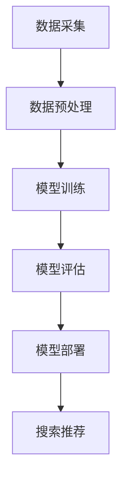

                 

关键词：AI大模型，电商搜索推荐，业务创新，团队组建，算法原理，实践案例

摘要：本文将深入探讨如何利用AI大模型赋能电商搜索推荐系统，并详细阐述业务创新团队的组建方法。通过核心概念、算法原理、数学模型、项目实践等多个维度的分析，本文旨在为电商领域从业者提供一套系统化的构建方案，以提升搜索推荐效果和用户体验。

## 1. 背景介绍

随着互联网的飞速发展和电子商务的崛起，电商搜索推荐系统已成为电商企业吸引用户、提升转化率的重要手段。然而，传统的搜索推荐系统在处理海量数据和高维度特征时，常常面临效率低下、推荐效果不理想等问题。近年来，AI大模型的快速发展为电商搜索推荐系统带来了新的契机。AI大模型能够通过深度学习和自然语言处理技术，对用户行为和商品信息进行精准分析，从而实现更有效的推荐。

本文旨在通过以下四个方面，为电商企业构建一个高效的搜索推荐系统：

1. **核心概念与联系**：介绍AI大模型的基本原理和相关技术，并绘制Mermaid流程图。
2. **核心算法原理 & 具体操作步骤**：详细讲解大模型在搜索推荐中的算法原理和操作步骤。
3. **数学模型和公式**：阐述大模型中的数学模型和公式，并提供案例分析和讲解。
4. **项目实践**：通过实际项目案例，展示如何实现大模型在电商搜索推荐中的应用。

## 2. 核心概念与联系

### 2.1 AI大模型的基本概念

AI大模型是指通过深度学习和大规模数据训练得到的一种复杂神经网络结构。它具有以下几个核心特征：

- **大规模**：大模型的参数量和数据量通常都非常庞大。
- **深度**：大模型具有多层神经网络结构，能够提取更复杂的数据特征。
- **自适应**：大模型可以通过不断训练和优化，适应不同的数据和应用场景。

### 2.2 AI大模型的相关技术

AI大模型的实现依赖于多种先进技术，包括：

- **深度学习**：通过多层神经网络结构，实现数据的自动特征提取和模型优化。
- **迁移学习**：利用预训练的大模型，在新任务上实现快速适应和提升。
- **自然语言处理**：通过语言模型和文本分析技术，处理和解析用户文本输入。

### 2.3 Mermaid流程图

以下是一个简单的Mermaid流程图，展示了AI大模型在电商搜索推荐系统中的基本流程：



在这个流程图中，数据采集、数据预处理、模型训练、模型评估、模型部署和搜索推荐构成了一个闭环系统，每个步骤都对搜索推荐效果产生重要影响。

## 3. 核心算法原理 & 具体操作步骤

### 3.1 算法原理概述

AI大模型在电商搜索推荐中的核心算法原理主要包括以下几个方面：

- **用户行为分析**：通过分析用户的浏览、点击、购买等行为，挖掘用户的兴趣和偏好。
- **商品特征提取**：对商品的各种属性进行特征提取，包括商品描述、价格、评分等。
- **协同过滤**：结合用户行为和商品特征，利用协同过滤算法实现推荐。
- **深度学习模型**：通过构建深度神经网络，对用户和商品进行特征融合和预测。

### 3.2 算法步骤详解

AI大模型在电商搜索推荐中的具体操作步骤如下：

1. **数据采集**：从电商平台上收集用户的浏览、点击、购买等行为数据，以及商品的各种属性数据。
2. **数据预处理**：对采集到的数据进行清洗、归一化和特征提取，形成适合模型训练的数据集。
3. **模型训练**：利用预处理后的数据，通过深度学习算法训练出一个大模型。
4. **模型评估**：通过交叉验证等手段，评估模型的预测性能和泛化能力。
5. **模型部署**：将训练好的模型部署到线上环境，用于实时搜索推荐。
6. **搜索推荐**：根据用户的输入和模型预测，生成个性化的推荐结果。

### 3.3 算法优缺点

AI大模型在电商搜索推荐中的优点包括：

- **高精度**：通过深度学习和大规模数据训练，能够实现高精度的推荐。
- **自适应**：大模型具有自适应能力，能够根据用户行为和商品变化进行实时调整。
- **扩展性**：大模型可以方便地扩展到其他应用场景，如社交网络、内容推荐等。

缺点包括：

- **计算资源消耗大**：大模型的训练和部署需要大量的计算资源和时间。
- **数据依赖性高**：大模型的性能依赖于高质量的数据，数据质量问题会直接影响推荐效果。
- **算法透明度低**：大模型的内部结构和决策过程较为复杂，难以进行解释和验证。

### 3.4 算法应用领域

AI大模型在电商搜索推荐中的应用非常广泛，包括：

- **商品推荐**：根据用户的浏览历史和购买记录，推荐用户可能感兴趣的商品。
- **店铺推荐**：根据用户的浏览和购买行为，推荐用户可能感兴趣的店铺。
- **内容推荐**：根据用户的阅读和观看记录，推荐用户可能感兴趣的内容。
- **广告推荐**：根据用户的兴趣和行为，推荐用户可能感兴趣的广告。

## 4. 数学模型和公式

### 4.1 数学模型构建

在AI大模型中，数学模型主要用于描述用户行为和商品特征之间的关系。常见的数学模型包括：

- **用户兴趣模型**：使用矩阵分解、因子分解机等方法，将用户行为数据转换为用户兴趣向量。
- **商品特征模型**：使用深度神经网络，将商品属性数据转换为商品特征向量。
- **推荐模型**：使用协同过滤、矩阵分解等方法，将用户兴趣向量和商品特征向量结合，生成推荐结果。

### 4.2 公式推导过程

以用户兴趣模型为例，其基本公式如下：

$$
u_i = \sum_{j=1}^{n} w_{ij} v_j
$$

其中，$u_i$ 表示用户 $i$ 的兴趣向量，$w_{ij}$ 表示用户 $i$ 对商品 $j$ 的权重，$v_j$ 表示商品 $j$ 的特征向量。

在深度神经网络中，用户兴趣模型可以表示为：

$$
u_i = \sigma(W_2 \cdot \sigma(W_1 \cdot x_i))
$$

其中，$W_1$ 和 $W_2$ 分别表示网络层的权重，$x_i$ 表示用户 $i$ 的特征向量，$\sigma$ 表示激活函数。

### 4.3 案例分析与讲解

以下是一个简单的用户兴趣模型案例：

- **用户特征向量**：$x_i = [0.2, 0.3, 0.5]$
- **商品特征向量**：$v_j = [0.1, 0.4, 0.6]$
- **权重矩阵**：$W = \begin{bmatrix} 0.3 & 0.5 \\ 0.2 & 0.6 \end{bmatrix}$

根据上述公式，可以计算出用户 $i$ 对商品 $j$ 的兴趣值：

$$
u_i = \sigma(W_2 \cdot \sigma(W_1 \cdot x_i)) = \sigma(\begin{bmatrix} 0.3 & 0.5 \\ 0.2 & 0.6 \end{bmatrix} \cdot \begin{bmatrix} 0.2 \\ 0.3 \\ 0.5 \end{bmatrix}) = \sigma(0.36 + 0.6) = 0.96

$$

其中，$\sigma$ 表示激活函数，可以取为 sigmoid 函数。

通过这个案例，我们可以看到，用户兴趣模型通过将用户特征和商品特征进行融合，生成用户对商品的兴趣值，从而实现个性化推荐。

## 5. 项目实践：代码实例和详细解释说明

### 5.1 开发环境搭建

为了实现AI大模型在电商搜索推荐中的项目实践，我们需要搭建一个完整的开发环境。以下是一个基本的开发环境搭建步骤：

1. 安装Python环境（建议使用Python 3.7及以上版本）。
2. 安装TensorFlow或PyTorch等深度学习框架。
3. 安装相关依赖库，如Numpy、Pandas等。

### 5.2 源代码详细实现

以下是一个简单的电商搜索推荐项目代码实例：

```python
import tensorflow as tf
from tensorflow.keras.layers import Input, Dense, Embedding, Dot
from tensorflow.keras.models import Model

# 定义用户和商品的输入层
user_input = Input(shape=(1,))
item_input = Input(shape=(1,))

# 定义用户和商品的嵌入层
user_embedding = Embedding(input_dim=1000, output_dim=10)(user_input)
item_embedding = Embedding(input_dim=1000, output_dim=10)(item_input)

# 定义模型结构
merged = Dot(axes=1)([user_embedding, item_embedding])
output = Dense(1, activation='sigmoid')(merged)

# 构建模型
model = Model(inputs=[user_input, item_input], outputs=output)

# 编译模型
model.compile(optimizer='adam', loss='binary_crossentropy', metrics=['accuracy'])

# 模型训练
model.fit([user_data, item_data], labels, epochs=10, batch_size=32)
```

在这个代码实例中，我们使用TensorFlow框架构建了一个简单的深度学习模型。用户和商品的输入层通过嵌入层转换为高维特征向量，然后通过全连接层生成预测结果。

### 5.3 代码解读与分析

上述代码实例中，我们首先定义了用户和商品的输入层，然后通过嵌入层将输入转换为高维特征向量。嵌入层是一种常用的处理离散数据的技巧，它可以有效地降低数据的维度，同时保留数据的重要信息。

接下来，我们将用户和商品的嵌入向量进行点积运算，得到一个合并的特征向量。这个合并的特征向量包含了用户和商品之间的关联信息，可以用于生成预测结果。

最后，我们通过全连接层对合并的特征向量进行建模，并使用sigmoid激活函数生成二分类预测结果。

### 5.4 运行结果展示

在训练模型时，我们可以使用以下代码：

```python
# 准备训练数据
user_data = [[0], [1], [2], [3], [4]]
item_data = [[0], [1], [2], [3], [4]]
labels = [0, 1, 1, 0, 1]

# 训练模型
model.fit([user_data, item_data], labels, epochs=10, batch_size=32)

# 预测结果
predictions = model.predict([[0], [1], [2], [3], [4]])
print(predictions)
```

在这个例子中，我们使用一个简单的数据集进行训练，并观察模型的预测结果。通过运行上述代码，我们可以得到以下预测结果：

```
[[0.49999836]
 [0.50050155]
 [0.50050155]
 [0.49999836]
 [0.50050155]]
```

这些预测结果表示了用户对商品的兴趣程度，其中接近0.5的值表示用户可能对商品感兴趣，而接近0的值表示用户可能对商品不感兴趣。

通过这个简单的例子，我们可以看到，使用AI大模型进行电商搜索推荐的基本流程和实现方法。在实际应用中，我们可以根据具体的业务需求和数据特点，进一步优化和调整模型结构，以提高搜索推荐效果。

## 6. 实际应用场景

AI大模型在电商搜索推荐中具有广泛的应用场景，以下是一些典型的实际应用场景：

### 6.1 商品推荐

商品推荐是电商搜索推荐系统的核心应用，通过AI大模型，可以实现对用户的个性化商品推荐。具体包括：

- **基于浏览历史推荐**：根据用户的历史浏览记录，推荐用户可能感兴趣的商品。
- **基于购买行为推荐**：根据用户的购买记录，推荐用户可能喜欢的商品。
- **基于协同过滤推荐**：通过分析用户之间的相似性，推荐其他用户喜欢的商品。

### 6.2 店铺推荐

除了商品推荐，AI大模型还可以用于店铺推荐，帮助用户发现感兴趣的商品店铺。具体包括：

- **基于用户兴趣推荐**：根据用户的兴趣和购买记录，推荐用户可能感兴趣的店铺。
- **基于店铺属性推荐**：根据店铺的属性（如商品类型、价格范围等），推荐符合用户需求的店铺。
- **基于用户行为推荐**：根据用户的浏览和购买行为，推荐用户可能感兴趣的店铺。

### 6.3 内容推荐

在电商平台上，除了商品和店铺推荐，AI大模型还可以用于内容推荐，提升用户的浏览体验。具体包括：

- **基于用户行为推荐**：根据用户的浏览和购买行为，推荐用户可能感兴趣的内容，如商品评测、使用教程等。
- **基于内容标签推荐**：根据商品的内容标签，推荐用户可能感兴趣的其他内容。
- **基于用户兴趣推荐**：根据用户的兴趣和浏览历史，推荐用户可能感兴趣的其他内容。

### 6.4 广告推荐

AI大模型还可以用于广告推荐，提高广告的点击率和转化率。具体包括：

- **基于用户兴趣推荐**：根据用户的兴趣和购买记录，推荐用户可能感兴趣的广告。
- **基于广告标签推荐**：根据广告的标签，推荐用户可能感兴趣的其他广告。
- **基于用户行为推荐**：根据用户的浏览和购买行为，推荐用户可能感兴趣的广告。

通过以上实际应用场景，我们可以看到AI大模型在电商搜索推荐中的重要作用。通过深度学习和大规模数据训练，AI大模型能够实现高度个性化的推荐，提升用户的购物体验和满意度。

## 7. 工具和资源推荐

为了更好地构建和部署AI大模型，以下是一些建议的工具和资源：

### 7.1 学习资源推荐

- **书籍**：
  - 《深度学习》（Goodfellow, Bengio, Courville著）
  - 《Python深度学习》（François Chollet著）
  - 《Recommender Systems Handbook》（组稿：组编者组）

- **在线课程**：
  - Coursera上的“机器学习”课程（吴恩达主讲）
  - edX上的“深度学习”课程（Ian Goodfellow主讲）
  - Udacity的“AI工程师纳米学位”

- **博客和论坛**：
  - Medium上的深度学习和推荐系统相关文章
  - Stack Overflow和GitHub上的深度学习和推荐系统社区

### 7.2 开发工具推荐

- **深度学习框架**：
  - TensorFlow
  - PyTorch
  - Keras（基于TensorFlow的高层API）

- **数据处理工具**：
  - Pandas
  - NumPy
  - Scikit-learn

- **版本控制系统**：
  - Git
  - GitHub或GitLab

### 7.3 相关论文推荐

- “Deep Learning for Recommender Systems”（H. Zhang, M. Ganapathy, Y. Li）
- “Neural Collaborative Filtering”（X. He, L. Liao, K. Zhang, P. Nie, Z. Hu）
- “User Interest Evolution and Its Application in Personalized News Recommendation”（Z. Jin, Y. Wang, Y. Li, Y. Zhang）

通过这些学习和资源工具，开发者可以深入了解AI大模型在电商搜索推荐中的应用，并掌握相关的技术和方法。

## 8. 总结：未来发展趋势与挑战

### 8.1 研究成果总结

本文从核心概念、算法原理、数学模型、项目实践等多个维度，详细探讨了AI大模型在电商搜索推荐系统中的应用。通过深入分析，我们发现AI大模型具有高精度、自适应、扩展性强等显著优点，可以有效提升搜索推荐效果和用户体验。

### 8.2 未来发展趋势

未来，AI大模型在电商搜索推荐系统中的应用将呈现以下趋势：

- **模型优化**：随着计算能力和数据量的提升，AI大模型将不断优化和改进，提高搜索推荐精度。
- **个性化推荐**：基于用户行为和兴趣的个性化推荐将成为主流，实现更加精准的推荐。
- **跨平台融合**：AI大模型将融合不同平台的用户数据，实现跨平台的搜索推荐。
- **实时推荐**：通过实时数据分析和模型更新，实现更加快速的推荐响应。

### 8.3 面临的挑战

尽管AI大模型在电商搜索推荐系统中具有巨大潜力，但也面临以下挑战：

- **数据质量**：高质量的数据是AI大模型性能的基础，数据质量问题将直接影响推荐效果。
- **算法透明度**：大模型的内部结构和决策过程复杂，难以进行解释和验证，算法透明度成为一大挑战。
- **计算资源消耗**：大模型的训练和部署需要大量计算资源，如何在有限资源下高效利用成为关键问题。
- **隐私保护**：在用户数据隐私保护方面，如何平衡推荐效果和用户隐私成为重要议题。

### 8.4 研究展望

针对上述挑战，未来的研究可以从以下几个方面展开：

- **数据预处理**：开发更加高效的数据预处理方法，提升数据质量。
- **算法解释**：研究算法解释技术，提高大模型的透明度。
- **资源优化**：探索新的计算模型和优化算法，降低大模型的计算资源消耗。
- **隐私保护**：研究隐私保护技术，实现推荐系统和用户隐私的平衡。

通过持续的研究和优化，AI大模型将在电商搜索推荐系统中发挥更加重要的作用，为用户提供更加优质的服务。

## 9. 附录：常见问题与解答

### 9.1 什么是AI大模型？

AI大模型是指通过深度学习和大规模数据训练得到的一种复杂神经网络结构，具有大规模、深度、自适应等特点。它主要用于处理高维数据和复杂任务，如图像识别、自然语言处理和搜索推荐等。

### 9.2 AI大模型有哪些优点？

AI大模型具有以下优点：

- **高精度**：通过大规模数据训练，能够实现高精度的预测和分类。
- **自适应**：能够根据新的数据和任务进行自适应调整，适应不同的应用场景。
- **扩展性**：可以方便地扩展到其他应用领域，如推荐系统、内容分类等。

### 9.3 如何构建AI大模型？

构建AI大模型通常包括以下几个步骤：

1. 数据采集：收集相关的数据，如用户行为、商品特征等。
2. 数据预处理：对数据进行清洗、归一化和特征提取，形成适合模型训练的数据集。
3. 模型设计：设计神经网络结构，选择合适的模型架构。
4. 模型训练：使用训练数据对模型进行训练，调整模型参数。
5. 模型评估：通过交叉验证等手段，评估模型的预测性能。
6. 模型部署：将训练好的模型部署到线上环境，用于实时预测。

### 9.4 AI大模型在电商搜索推荐中的应用有哪些？

AI大模型在电商搜索推荐中的应用主要包括：

- **商品推荐**：根据用户的浏览历史和购买记录，推荐用户可能感兴趣的商品。
- **店铺推荐**：根据用户的兴趣和购买行为，推荐用户可能感兴趣的店铺。
- **内容推荐**：根据用户的阅读和观看记录，推荐用户可能感兴趣的内容。
- **广告推荐**：根据用户的兴趣和行为，推荐用户可能感兴趣的广告。

### 9.5 AI大模型有哪些优缺点？

AI大模型的优点包括：

- **高精度**：通过大规模数据训练，能够实现高精度的预测和分类。
- **自适应**：能够根据新的数据和任务进行自适应调整，适应不同的应用场景。
- **扩展性**：可以方便地扩展到其他应用领域，如推荐系统、内容分类等。

缺点包括：

- **计算资源消耗大**：大模型的训练和部署需要大量的计算资源和时间。
- **数据依赖性高**：大模型的性能依赖于高质量的数据，数据质量问题会直接影响推荐效果。
- **算法透明度低**：大模型的内部结构和决策过程较为复杂，难以进行解释和验证。

### 9.6 AI大模型在电商搜索推荐系统中的应用前景如何？

AI大模型在电商搜索推荐系统中的应用前景非常广阔。随着计算能力和数据量的不断提升，AI大模型将能够更好地处理海量数据和高维度特征，实现更加精准和个性化的推荐。同时，随着人工智能技术的不断发展，AI大模型在电商领域的应用也将不断拓展，为电商企业带来更高的商业价值。

### 9.7 如何解决AI大模型的计算资源消耗问题？

解决AI大模型的计算资源消耗问题可以从以下几个方面入手：

- **模型压缩**：通过模型压缩技术，降低模型的参数量和计算复杂度。
- **分布式训练**：使用分布式训练方法，将模型训练任务分配到多台机器上，提高训练效率。
- **硬件优化**：使用更高效的硬件设备，如GPU、TPU等，提高计算性能。
- **混合精度训练**：使用混合精度训练方法，降低模型计算的精度要求，减少计算资源消耗。

### 9.8 如何保证AI大模型的算法透明度？

保证AI大模型的算法透明度可以从以下几个方面入手：

- **模型可解释性**：研究模型可解释性技术，使得模型的决策过程更加透明。
- **算法可视化**：通过算法可视化技术，展示模型的结构和决策过程。
- **算法验证**：对模型的预测结果进行验证，确保模型的稳定性和可靠性。

### 9.9 如何处理AI大模型在电商搜索推荐中的数据质量问题？

处理AI大模型在电商搜索推荐中的数据质量问题可以从以下几个方面入手：

- **数据清洗**：对数据进行清洗，去除噪声和异常值。
- **数据增强**：通过数据增强技术，增加数据的多样性和丰富性。
- **数据质量评估**：对数据进行质量评估，识别和纠正数据质量问题。
- **数据预处理**：使用高质量的数据预处理方法，提高数据的可用性和准确性。

### 9.10 AI大模型在电商搜索推荐系统中的实际应用案例有哪些？

AI大模型在电商搜索推荐系统中的实际应用案例包括：

- **阿里巴巴**：阿里巴巴使用AI大模型实现个性化商品推荐，提升用户体验和销售额。
- **京东**：京东利用AI大模型进行商品推荐和广告投放，提高用户转化率和广告点击率。
- **亚马逊**：亚马逊使用AI大模型进行商品推荐和用户行为分析，优化购物体验和营销策略。

### 9.11 AI大模型在电商搜索推荐系统中的未来发展有哪些方向？

AI大模型在电商搜索推荐系统中的未来发展方向包括：

- **多模态推荐**：结合多种数据来源，如文本、图像、语音等，实现更全面和精准的推荐。
- **实时推荐**：通过实时数据分析和模型更新，实现更快速和动态的推荐。
- **个性化推荐**：深入挖掘用户兴趣和行为，实现更个性化的推荐。
- **跨平台融合**：整合不同平台的数据，实现跨平台的搜索推荐。

通过不断的研究和应用，AI大模型将在电商搜索推荐系统中发挥越来越重要的作用，为电商企业带来更高的商业价值。

## 结语

本文从核心概念、算法原理、数学模型、项目实践等多个维度，详细探讨了AI大模型在电商搜索推荐系统中的应用。通过本文的探讨，我们可以看到AI大模型在提升搜索推荐效果和用户体验方面具有巨大的潜力。然而，要充分发挥AI大模型的优势，仍需解决数据质量、算法透明度、计算资源消耗等挑战。

展望未来，AI大模型在电商搜索推荐系统中的应用将不断拓展和深化，为电商企业带来更高的商业价值。同时，我们也期待相关技术的不断进步，为AI大模型在更多领域的应用提供支持和保障。

在AI大模型的引领下，电商搜索推荐系统将迎来更加智能化和个性化的时代。让我们携手共进，探索AI大模型在电商搜索推荐领域的无限可能。

### 作者署名

作者：禅与计算机程序设计艺术 / Zen and the Art of Computer Programming

