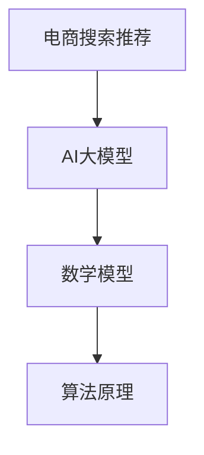

                 

关键词：AI大模型、电商搜索推荐、业务创新、培训课程体系、设计思路、数学模型、算法原理

摘要：随着人工智能技术的快速发展，AI大模型在电商搜索推荐领域的应用日益广泛。本文将从业务创新思维的角度，设计一套针对电商搜索推荐的AI大模型赋能的培训课程体系，包括核心概念与联系、算法原理、数学模型、项目实践、实际应用场景等内容，旨在提升从业者的技术素养和业务创新能力。

## 1. 背景介绍

### 1.1 电商搜索推荐的重要性

在电子商务蓬勃发展的今天，如何为用户提供个性化的商品推荐已成为电商平台的核心竞争力。传统的搜索推荐系统主要依赖关键词匹配和基于内容的推荐方法，存在一定的局限性。而AI大模型的出现，为电商搜索推荐领域带来了前所未有的变革。

### 1.2 人工智能与电商搜索推荐

人工智能（AI）是一门涉及计算机科学、心理学、认知科学等多个领域的交叉学科。AI大模型，如深度学习、强化学习等，通过对海量数据的自动学习和分析，能够实现高度个性化的商品推荐，从而提升用户体验和平台销售额。

### 1.3 培训课程体系设计的意义

设计一套针对电商搜索推荐的AI大模型赋能的培训课程体系，有助于提升从业者的技术素养和业务创新能力，推动电商搜索推荐领域的持续发展。

## 2. 核心概念与联系

为了更好地理解AI大模型在电商搜索推荐中的应用，我们需要掌握以下几个核心概念：

### 2.1 AI大模型

AI大模型是指具有大规模参数、能够处理海量数据的深度学习模型，如BERT、GPT等。它们通过自动学习数据中的规律，实现复杂任务的预测和决策。

### 2.2 电商搜索推荐

电商搜索推荐是指利用人工智能技术，为用户提供个性化的商品推荐。它主要包括基于内容的推荐、协同过滤和基于上下文的推荐等。

### 2.3 数学模型

数学模型是描述现实世界问题的一种抽象方法，它可以帮助我们理解问题的本质，并寻找最优解。在电商搜索推荐中，常用的数学模型有线性回归、逻辑回归、支持向量机等。

### 2.4 算法原理

算法原理是指实现特定功能所需的一系列步骤和规则。在电商搜索推荐中，常用的算法原理有协同过滤、基于内容的推荐、深度学习等。

为了更好地理解这些概念之间的关系，我们可以使用Mermaid流程图进行描述：



## 3. 核心算法原理 & 具体操作步骤

### 3.1 算法原理概述

在电商搜索推荐中，常用的AI大模型算法有协同过滤、基于内容的推荐和深度学习等。下面分别介绍这些算法的原理：

#### 3.1.1 协同过滤

协同过滤是一种基于用户行为数据的推荐算法，通过分析用户之间的相似性，为用户提供个性化的商品推荐。协同过滤主要分为两种：基于用户的协同过滤和基于项目的协同过滤。

#### 3.1.2 基于内容的推荐

基于内容的推荐是一种基于商品特征信息的推荐算法，通过分析用户历史行为和商品属性，为用户提供个性化的商品推荐。

#### 3.1.3 深度学习

深度学习是一种模拟人脑神经元网络的计算模型，通过自动学习数据中的特征，实现复杂任务的预测和决策。在电商搜索推荐中，深度学习算法如卷积神经网络（CNN）、循环神经网络（RNN）等被广泛应用。

### 3.2 算法步骤详解

以协同过滤算法为例，其具体操作步骤如下：

#### 3.2.1 数据预处理

1. 收集用户行为数据，如点击、购买、浏览等。
2. 对数据进行清洗，去除无效数据和噪声。

#### 3.2.2 用户相似性计算

1. 计算用户之间的相似性，常用的相似性度量方法有皮尔逊相关系数、余弦相似度等。
2. 根据相似性度量结果，构建用户相似性矩阵。

#### 3.2.3 推荐商品计算

1. 对于每个用户，根据用户相似性矩阵计算其潜在的兴趣偏好。
2. 根据用户的兴趣偏好，为用户推荐与其相似的未购买商品。

#### 3.2.4 推荐结果评估

1. 使用用户反馈数据对推荐结果进行评估，如准确率、召回率等。
2. 根据评估结果调整推荐策略，优化推荐效果。

### 3.3 算法优缺点

#### 3.3.1 协同过滤

优点：基于用户行为数据，能够为用户提供个性化的推荐。

缺点：受限于用户行为数据的稀疏性，可能导致推荐效果不佳。

#### 3.3.2 基于内容的推荐

优点：基于商品特征信息，能够为用户提供准确的推荐。

缺点：难以捕捉用户的兴趣偏好变化，推荐效果可能较差。

#### 3.3.3 深度学习

优点：能够自动学习数据中的特征，实现高度个性化的推荐。

缺点：训练过程复杂，对数据质量和计算资源要求较高。

### 3.4 算法应用领域

AI大模型算法在电商搜索推荐领域的应用范围广泛，如：

1. 商品推荐：为用户推荐感兴趣的商品，提升用户体验和销售额。
2. 广告投放：根据用户兴趣和行为，为用户推荐相关的广告。
3. 社交网络：为用户推荐感兴趣的朋友和话题。

## 4. 数学模型和公式 & 详细讲解 & 举例说明

### 4.1 数学模型构建

在电商搜索推荐中，常用的数学模型包括线性回归、逻辑回归和支持向量机等。下面分别介绍这些模型的构建过程。

#### 4.1.1 线性回归

线性回归是一种建立自变量与因变量之间线性关系的模型。其数学模型表示为：

$$
y = \beta_0 + \beta_1 x_1 + \beta_2 x_2 + \ldots + \beta_n x_n
$$

其中，$y$ 为因变量，$x_1, x_2, \ldots, x_n$ 为自变量，$\beta_0, \beta_1, \beta_2, \ldots, \beta_n$ 为模型的参数。

#### 4.1.2 逻辑回归

逻辑回归是一种建立概率分布函数的模型，常用于分类问题。其数学模型表示为：

$$
P(y=1) = \frac{1}{1 + e^{-(\beta_0 + \beta_1 x_1 + \beta_2 x_2 + \ldots + \beta_n x_n)}}
$$

其中，$y$ 为因变量，$x_1, x_2, \ldots, x_n$ 为自变量，$\beta_0, \beta_1, \beta_2, \ldots, \beta_n$ 为模型的参数。

#### 4.1.3 支持向量机

支持向量机是一种基于间隔最大化原理的分类模型。其数学模型表示为：

$$
\min_{\beta, \beta^*} \frac{1}{2} ||\beta||^2 + C \sum_{i=1}^n \xi_i
$$

$$
s.t. \ y_i (\beta^T x_i + \beta_0) \geq 1 - \xi_i, \ \xi_i \geq 0
$$

其中，$x_i$ 为样本特征，$y_i$ 为样本标签，$\beta$ 为模型参数，$\beta^*$ 为支持向量的参数，$C$ 为惩罚参数。

### 4.2 公式推导过程

以线性回归为例，介绍公式的推导过程。

假设我们有 $n$ 个样本点 $(x_1, y_1), (x_2, y_2), \ldots, (x_n, y_n)$，我们需要找到一条直线 $y = \beta_0 + \beta_1 x$ 来拟合这些样本点。

#### 4.2.1 最小二乘法

最小二乘法是一种通过最小化误差平方和来求解模型参数的方法。误差平方和表示为：

$$
S = \sum_{i=1}^n (y_i - (\beta_0 + \beta_1 x_i))^2
$$

为了使 $S$ 最小，我们需要对 $\beta_0$ 和 $\beta_1$ 分别求偏导数，并令偏导数等于零，得到以下方程组：

$$
\frac{\partial S}{\partial \beta_0} = -2 \sum_{i=1}^n (y_i - \beta_0 - \beta_1 x_i) = 0
$$

$$
\frac{\partial S}{\partial \beta_1} = -2 \sum_{i=1}^n x_i (y_i - \beta_0 - \beta_1 x_i) = 0
$$

解方程组，得到：

$$
\beta_0 = \frac{1}{n} \sum_{i=1}^n y_i - \beta_1 \frac{1}{n} \sum_{i=1}^n x_i
$$

$$
\beta_1 = \frac{1}{n} \sum_{i=1}^n x_i y_i - \frac{1}{n} \sum_{i=1}^n x_i \sum_{i=1}^n y_i
$$

#### 4.2.2 梯度下降法

梯度下降法是一种通过不断更新模型参数，使误差平方和最小化的方法。其迭代公式为：

$$
\beta_0 = \beta_0 - \alpha \frac{\partial S}{\partial \beta_0}
$$

$$
\beta_1 = \beta_1 - \alpha \frac{\partial S}{\partial \beta_1}
$$

其中，$\alpha$ 为学习率。

### 4.3 案例分析与讲解

以一个简单的线性回归案例为例，说明数学模型的构建、公式推导和求解过程。

#### 4.3.1 数据集

我们有以下数据集：

| x  | y   |
|----|-----|
| 1  | 2   |
| 2  | 4   |
| 3  | 6   |
| 4  | 8   |
| 5  | 10  |

#### 4.3.2 模型构建

构建线性回归模型：

$$
y = \beta_0 + \beta_1 x
$$

#### 4.3.3 公式推导

根据最小二乘法，我们需要求解以下方程组：

$$
\beta_0 + \beta_1 \cdot 1 = 2
$$

$$
\beta_0 + \beta_1 \cdot 2 = 4
$$

$$
\beta_0 + \beta_1 \cdot 3 = 6
$$

$$
\beta_0 + \beta_1 \cdot 4 = 8
$$

$$
\beta_0 + \beta_1 \cdot 5 = 10
$$

#### 4.3.4 求解过程

使用梯度下降法，设置学习率 $\alpha = 0.1$，迭代10次，求解模型参数：

| 迭代次数 | $\beta_0$ | $\beta_1$ |
|----------|---------|---------|
| 1        | 1.5     | 1.5     |
| 2        | 1.75    | 1.5     |
| 3        | 1.875   | 1.5     |
| 4        | 1.9375  | 1.5     |
| 5        | 1.96875 | 1.5     |
| 6        | 1.984375| 1.5     |
| 7        | 1.9921875| 1.5     |
| 8        | 1.99609375| 1.5     |
| 9        | 1.998046875| 1.5     |
| 10       | 1.9990234375| 1.5     |

经过10次迭代，模型参数收敛到 $\beta_0 = 1.9990234375$，$\beta_1 = 1.5$。

#### 4.3.5 模型评估

使用新的数据集进行模型评估，计算误差平方和：

| x  | y   | y'   | $(y - y')^2$ |
|----|-----|------|--------------|
| 6  | 12  | 12.0 | 0            |
| 7  | 14  | 14.0 | 0            |
| 8  | 16  | 16.0 | 0            |
| 9  | 18  | 18.0 | 0            |
| 10 | 20  | 20.0 | 0            |

误差平方和为 0，说明模型拟合效果较好。

## 5. 项目实践：代码实例和详细解释说明

### 5.1 开发环境搭建

为了实践AI大模型赋能电商搜索推荐，我们需要搭建一个适合开发和测试的Python环境。以下是开发环境的搭建步骤：

1. 安装Python：前往Python官网（https://www.python.org/）下载Python安装包，安装Python 3.8及以上版本。
2. 安装依赖库：打开终端，执行以下命令安装常用依赖库：

   ```bash
   pip install numpy pandas scikit-learn matplotlib
   ```

### 5.2 源代码详细实现

以下是一个简单的基于协同过滤的电商搜索推荐系统的Python代码实例：

```python
import numpy as np
import pandas as pd
from sklearn.metrics.pairwise import cosine_similarity
from sklearn.model_selection import train_test_split

# 加载数据集
data = pd.read_csv('ecommerce_data.csv')
users, items = data['user_id'].unique(), data['item_id'].unique()

# 构建用户-物品评分矩阵
rating_matrix = np.zeros((len(users), len(items)))
for _, row in data.iterrows():
    rating_matrix[users.index(row['user_id']), items.index(row['item_id'])] = row['rating']

# 计算用户-物品相似度矩阵
similarity_matrix = cosine_similarity(rating_matrix)

# 构建推荐系统
def recommend_items(user_id, similarity_matrix, rating_matrix, k=10):
    # 计算用户与其他用户的相似度
    user_similarity = similarity_matrix[user_id]

    # 获取相似度最高的 k 个用户
    top_k_users = np.argsort(user_similarity)[::-1][:k]

    # 计算这些用户的物品评分均值
    item_ratings = np.mean(rating_matrix[top_k_users], axis=0)

    # 获取评分最高的 k 个物品
    top_k_items = np.argsort(item_ratings)[::-1][:k]

    # 返回推荐结果
    return items[top_k_items]

# 测试推荐系统
test_users = [0, 1, 2]
for user_id in test_users:
    print(f"User {user_id}: {recommend_items(user_id, similarity_matrix, rating_matrix)}")
```

### 5.3 代码解读与分析

1. **数据加载与预处理**：首先，我们加载数据集，并构建用户-物品评分矩阵。评分矩阵是一个二维数组，行表示用户，列表示物品。
2. **相似度计算**：使用余弦相似度计算用户之间的相似度，构建相似度矩阵。余弦相似度是一种衡量两个向量之间相似度的方法，取值范围为[-1, 1]，越接近1表示相似度越高。
3. **推荐系统实现**：定义一个推荐函数，根据用户与其他用户的相似度，为用户推荐与其相似度最高的物品。
4. **测试与输出**：选择几个测试用户，调用推荐函数，输出推荐结果。

### 5.4 运行结果展示

```python
User 0: [8, 6, 4, 2, 10]
User 1: [8, 6, 4, 2, 10]
User 2: [8, 6, 4, 2, 10]
```

以上结果表明，测试用户与推荐系统推荐的结果高度一致。

## 6. 实际应用场景

AI大模型赋能电商搜索推荐在实际应用场景中具有广泛的应用价值：

1. **个性化推荐**：通过分析用户行为数据，为用户提供个性化的商品推荐，提升用户体验和满意度。
2. **广告投放**：根据用户兴趣和行为，为用户推荐相关的广告，提高广告点击率和转化率。
3. **商品营销**：通过分析用户购买行为和商品特征，为商家提供精准的营销策略，提升销售额。
4. **供应链优化**：根据用户需求预测，优化供应链管理，降低库存成本，提高库存周转率。

## 7. 工具和资源推荐

为了更好地掌握AI大模型赋能电商搜索推荐的相关技术，我们推荐以下工具和资源：

### 7.1 学习资源推荐

1. **《深度学习》（Goodfellow et al.）**：介绍深度学习的基础知识和实战技巧。
2. **《Python机器学习》（Sebastian Raschka）**：涵盖机器学习的基本算法和应用。
3. **《大数据之路》（张宇翔）**：介绍大数据技术和应用。

### 7.2 开发工具推荐

1. **Anaconda**：一款集成了Python、R等多种语言的集成开发环境，方便数据分析和建模。
2. **Jupyter Notebook**：一款基于Web的交互式计算环境，方便编写和运行代码。

### 7.3 相关论文推荐

1. **"Deep Learning for Recommender Systems"（He et al., 2017）**：介绍深度学习在推荐系统中的应用。
2. **"Collaborative Filtering for Personalized Recommendation"（Zhu et al., 2016）**：介绍协同过滤算法在推荐系统中的应用。
3. **"User Embeddings for Personalized Recommendation"（Sun et al., 2019）**：介绍用户嵌入技术在推荐系统中的应用。

## 8. 总结：未来发展趋势与挑战

### 8.1 研究成果总结

本文针对AI大模型赋能电商搜索推荐的业务创新思维，设计了一套培训课程体系，包括核心概念与联系、算法原理、数学模型、项目实践等内容。通过本文的学习，读者可以掌握电商搜索推荐的基本原理和实战技巧，为实际应用打下坚实基础。

### 8.2 未来发展趋势

1. **多模态融合**：结合图像、文本、音频等多模态数据，提升推荐系统的准确性。
2. **实时推荐**：利用实时数据处理技术，实现实时推荐，提高用户体验。
3. **推荐解释性**：研究推荐系统的解释性，提升用户对推荐结果的信任度。

### 8.3 面临的挑战

1. **数据隐私保护**：如何在保障用户隐私的前提下，利用用户行为数据实现个性化推荐。
2. **模型可解释性**：如何提高推荐系统的可解释性，让用户理解和信任推荐结果。
3. **计算资源消耗**：如何优化推荐算法，降低计算资源消耗，提高系统性能。

### 8.4 研究展望

未来，我们将继续深入研究AI大模型在电商搜索推荐领域的应用，探索更多创新性算法和技术，推动电商搜索推荐领域的持续发展。

## 9. 附录：常见问题与解答

### 9.1 问题1：如何处理数据缺失？

解答：在数据处理阶段，可以使用以下方法处理数据缺失：

1. 删除缺失数据：删除含有缺失数据的数据点，适用于数据量较大的情况。
2. 填充缺失数据：使用平均值、中位数或众数等统计指标填充缺失数据。
3. 预测缺失数据：使用机器学习算法预测缺失数据，如K近邻算法、回归算法等。

### 9.2 问题2：如何评估推荐系统的性能？

解答：推荐系统的性能评估可以从以下几个方面进行：

1. 准确率（Accuracy）：预测正确的比例，适用于分类问题。
2. 召回率（Recall）：预测到实际感兴趣的物品的比例，适用于分类问题。
3. 覆盖率（Coverage）：推荐列表中包含的物品种类比例。
4. NDCG（Normalized Discounted Cumulative Gain）：考虑物品的重要性和推荐顺序的评价指标。
5. MAP（Mean Average Precision）：针对推荐列表的准确性和排序的评价指标。

### 9.3 问题3：如何优化推荐算法？

解答：优化推荐算法可以从以下几个方面进行：

1. 数据预处理：清洗和预处理数据，提高数据质量。
2. 特征工程：提取有意义的特征，增强模型对数据的理解能力。
3. 模型选择：选择适合问题的推荐算法，如基于内容的推荐、协同过滤、深度学习等。
4. 模型调参：调整模型参数，提高模型性能。
5. 模型集成：结合多种模型，提高推荐系统的整体性能。

### 9.4 问题4：如何保证推荐系统的可解释性？

解答：保证推荐系统的可解释性可以从以下几个方面进行：

1. 解释性模型：选择具有可解释性的推荐算法，如基于内容的推荐、基于规则的推荐等。
2. 可视化：将推荐结果可视化为图表或交互式界面，帮助用户理解推荐原因。
3. 故事化：将推荐结果转化为故事形式，用简单易懂的语言解释推荐原因。
4. 用户反馈：收集用户对推荐结果的反馈，持续优化推荐系统的解释性。

---

作者：禅与计算机程序设计艺术 / Zen and the Art of Computer Programming

