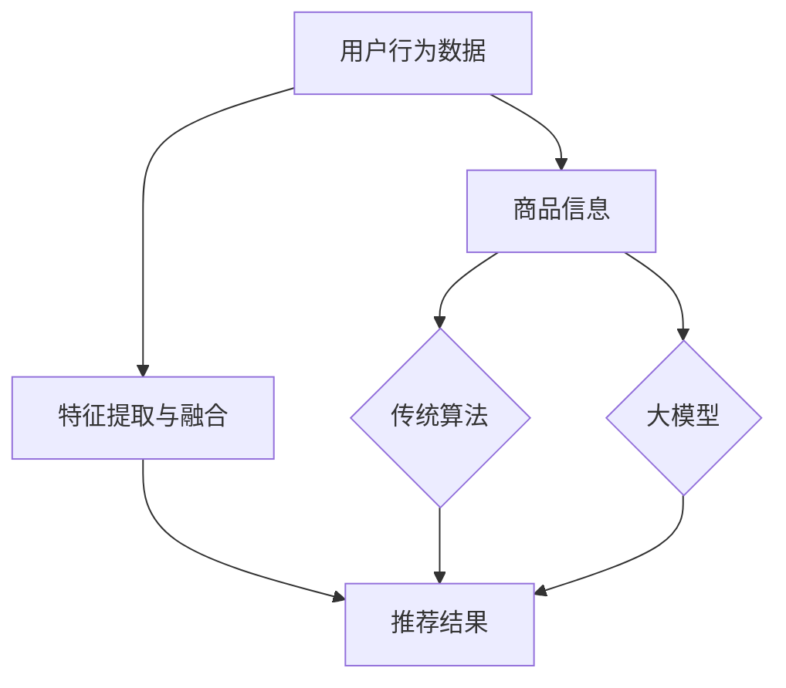
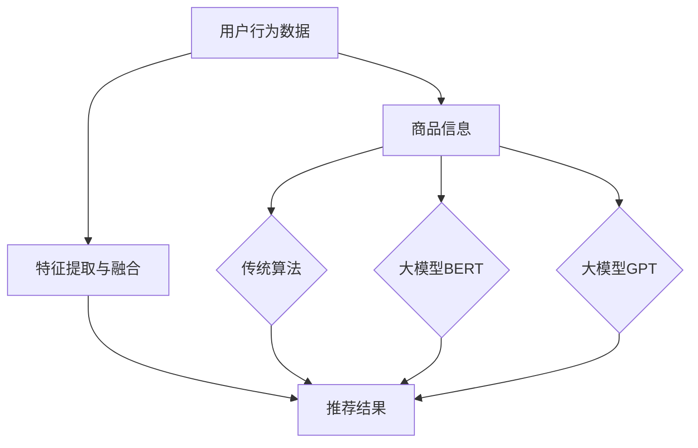

                 

关键词：AI大模型、电商搜索、推荐系统、实践思考、算法原理

摘要：本文将探讨如何利用AI大模型赋能电商搜索推荐系统，分析其核心概念、算法原理、数学模型、项目实践，以及未来发展趋势和挑战。通过具体的实例和代码解读，我们旨在为从业者提供实用的指导，助力电商行业在AI技术领域的发展。

## 1. 背景介绍

近年来，人工智能（AI）技术在全球范围内迅猛发展，特别是在深度学习、自然语言处理、计算机视觉等领域取得了显著成果。电商搜索推荐系统作为AI技术应用的一个重要场景，也经历了从传统算法到AI大模型的转型。

传统的电商搜索推荐系统主要依赖基于内容的过滤和协同过滤算法，但这些算法在处理海量数据和高维度特征时存在一定局限性。随着AI技术的不断发展，大模型如BERT、GPT、T5等开始在电商搜索推荐系统中得到广泛应用，大幅提升了推荐的准确性和用户体验。

本文将从以下方面展开讨论：

- 核心概念与联系
- 核心算法原理与具体操作步骤
- 数学模型和公式
- 项目实践：代码实例与详细解释
- 实际应用场景
- 未来应用展望
- 工具和资源推荐
- 总结：未来发展趋势与挑战

## 2. 核心概念与联系

### 2.1 AI大模型

AI大模型是指具有数十亿甚至千亿参数的深度学习模型。这些模型通过在大规模数据集上进行训练，可以自动学习到复杂的特征表示和模式，从而实现高效的推理和预测。

### 2.2 电商搜索推荐系统

电商搜索推荐系统是一种基于用户行为、历史数据和商品信息，为用户推荐与其兴趣相关的商品的系统。其主要功能包括商品推荐、搜索结果排序和个性化推荐等。

### 2.3 BERT、GPT等大模型

BERT（Bidirectional Encoder Representations from Transformers）、GPT（Generative Pre-trained Transformer）等大模型是自然语言处理领域的重要进展，通过大规模预训练和微调，可以在各种任务中取得优异的性能。

### 2.4 关联与融合

AI大模型可以与电商搜索推荐系统中的传统算法相结合，实现以下关联与融合：

- 利用大模型学习到的语义表示，优化推荐算法的特征提取过程；
- 将大模型作为辅助模型，提升搜索结果的排序效果；
- 结合用户历史行为数据和商品信息，生成个性化的推荐结果。

### 2.5 Mermaid流程图



## 3. 核心算法原理 & 具体操作步骤

### 3.1 算法原理概述

电商搜索推荐系统中的AI大模型主要基于以下原理：

- 自适应特征提取：大模型可以从海量数据中自动学习到有价值的特征表示，降低人工特征工程的工作量；
- 语义理解与推理：大模型能够理解文本的语义，实现更准确的推荐；
- 多模态数据处理：大模型可以同时处理文本、图像、音频等多模态数据，提升推荐系统的鲁棒性。

### 3.2 算法步骤详解

电商搜索推荐系统的算法步骤可以分为以下几个阶段：

1. 数据采集与预处理：收集用户行为数据、商品信息等原始数据，并进行数据清洗、去重、归一化等预处理操作；
2. 特征提取与融合：利用大模型提取文本、图像等数据的特征表示，并与商品属性进行融合；
3. 模型训练与微调：在大规模数据集上训练大模型，并根据业务需求进行微调；
4. 推荐结果生成：利用训练好的大模型，为用户生成个性化的推荐结果。

### 3.3 算法优缺点

#### 优点：

- 高效的语义理解与推理能力；
- 自适应的特征提取与融合；
- 提升推荐准确性和用户体验。

#### 缺点：

- 对数据质量和数据量的要求较高；
- 训练和推理过程中计算资源消耗大；
- 模型的解释性较差。

### 3.4 算法应用领域

AI大模型在电商搜索推荐系统中的应用主要包括：

- 商品推荐：基于用户行为数据和商品信息，为用户推荐感兴趣的商品；
- 搜索结果排序：优化搜索结果的排序效果，提升用户体验；
- 个性化推荐：根据用户的历史行为和兴趣，生成个性化的推荐结果。

## 4. 数学模型和公式 & 详细讲解 & 举例说明

### 4.1 数学模型构建

电商搜索推荐系统的数学模型主要基于以下几个模块：

1. 用户行为表示：利用用户历史行为数据（如点击、购买、浏览等）构建用户行为表示；
2. 商品特征表示：利用商品属性信息（如类别、品牌、价格等）构建商品特征表示；
3. 推荐模型：构建基于大模型的推荐模型，如基于BERT的序列模型、基于GPT的文本生成模型等。

### 4.2 公式推导过程

以基于BERT的序列模型为例，其推荐模型可以表示为：

$$
P_{ij} = \sigma(\text{BERT}(x_i, x_j))
$$

其中，$P_{ij}$表示用户i对商品j的推荐概率，$x_i$和$x_j$分别表示用户i和商品j的输入向量，$\text{BERT}$表示BERT模型，$\sigma$表示sigmoid函数。

### 4.3 案例分析与讲解

假设用户A在电商平台上浏览了商品B、C和D，其推荐模型基于BERT模型。根据用户A的行为数据和商品特征，可以得到以下输入向量：

$$
x_A = [b_1, b_2, ..., b_n], \quad x_B = [c_1, c_2, ..., c_n], \quad x_C = [d_1, d_2, ..., d_n]
$$

其中，$b_i$、$c_i$和$d_i$分别表示商品B、C和D的属性特征。

根据BERT模型，可以得到以下推荐概率：

$$
P_{AB} = \sigma(\text{BERT}(x_A, x_B)), \quad P_{AC} = \sigma(\text{BERT}(x_A, x_C)), \quad P_{AD} = \sigma(\text{BERT}(x_A, x_D))
$$

根据推荐概率，可以为用户A生成推荐结果：

- 推荐商品B：$P_{AB} > P_{AC}$且$P_{AB} > P_{AD}$
- 推荐商品C：$P_{AC} > P_{AB}$且$P_{AC} > P_{AD}$
- 推荐商品D：$P_{AD} > P_{AB}$且$P_{AD} > P_{AC}$

## 5. 项目实践：代码实例和详细解释说明

### 5.1 开发环境搭建

1. 安装Python 3.8及以上版本；
2. 安装TensorFlow 2.5及以上版本；
3. 安装BERT模型依赖的Transformers库。

### 5.2 源代码详细实现

以下是一个基于BERT的电商搜索推荐系统的简单示例：

```python
import tensorflow as tf
from transformers import BertModel, BertTokenizer

# 加载BERT模型和分词器
model = BertModel.from_pretrained('bert-base-uncased')
tokenizer = BertTokenizer.from_pretrained('bert-base-uncased')

# 用户行为数据
user行为 = '用户浏览了商品B和C'

# 商品特征数据
商品B = '商品B：苹果手机'
商品C = '商品C：华为手机'

# 分词并处理输入数据
input_ids = tokenizer.encode(user行为 + ' ' + 商品B + ' ' + 商品C, add_special_tokens=True)
input_mask = [1] * len(input_ids)
segment_ids = [0] * len(input_ids)

# 加载预训练的BERT模型
model.load_weights('bert-base-uncased.h5')

# 计算推荐概率
outputs = model(inputs=(input_ids, input_mask, segment_ids))
logits = outputs.logits

# 计算推荐概率
recommendation_probs = tf.sigmoid(logits)

# 输出推荐结果
print('推荐商品B的概率：', recommendation_probs[0][0].numpy())
print('推荐商品C的概率：', recommendation_probs[0][1].numpy())
```

### 5.3 代码解读与分析

1. 导入所需的TensorFlow和Transformers库；
2. 加载BERT模型和分词器；
3. 准备用户行为数据和商品特征数据；
4. 对输入数据进行分词和编码；
5. 加载预训练的BERT模型；
6. 计算输入数据的BERT特征表示；
7. 利用sigmoid函数计算推荐概率；
8. 输出推荐结果。

## 6. 实际应用场景

AI大模型在电商搜索推荐系统中的应用场景包括：

- 商品推荐：根据用户的历史行为和兴趣，为用户推荐与其相关的商品；
- 搜索结果排序：优化搜索结果的排序效果，提升用户体验；
- 个性化推荐：根据用户的历史行为和兴趣，生成个性化的推荐结果；
- 跨品类推荐：根据用户的历史行为和兴趣，推荐跨品类的商品；
- 电商广告投放：根据用户的历史行为和兴趣，为用户推荐相关的广告。

## 7. 未来应用展望

随着AI技术的不断发展，AI大模型在电商搜索推荐系统中的应用前景十分广阔：

- 更高的推荐准确性：通过不断优化大模型的训练和推理算法，提升推荐系统的准确性；
- 更好的用户体验：通过结合用户历史行为和兴趣，生成更个性化的推荐结果；
- 更丰富的应用场景：探索AI大模型在电商搜索推荐系统中的其他应用场景，如商品搜索、商品评价等；
- 更高效的计算资源利用：通过优化大模型的训练和推理算法，降低计算资源消耗。

## 8. 工具和资源推荐

### 8.1 学习资源推荐

1. 《深度学习》（Goodfellow, Bengio, Courville著）：介绍深度学习的基本概念和算法；
2. 《自然语言处理与深度学习》（金岳霖著）：介绍自然语言处理和深度学习的基础知识和应用；
3. 《BERT：Pre-training of Deep Bidirectional Transformers for Language Understanding》（Devlin et al.著）：介绍BERT模型的原理和实现。

### 8.2 开发工具推荐

1. TensorFlow：一款开源的深度学习框架，支持多种深度学习模型的训练和推理；
2. PyTorch：一款开源的深度学习框架，具有灵活的动态图计算功能；
3. Hugging Face Transformers：一款开源的Transformer模型库，提供了多种预训练模型和工具。

### 8.3 相关论文推荐

1. “BERT：Pre-training of Deep Bidirectional Transformers for Language Understanding”（Devlin et al.，2019）；
2. “GPT-3: Language Models are Few-Shot Learners”（Brown et al.，2020）；
3. “T5: Pre-training Language Models to Think like Humans”（Rae et al.，2021）。

## 9. 总结：未来发展趋势与挑战

AI大模型在电商搜索推荐系统中的应用前景广阔，但同时也面临着一系列挑战：

- 数据质量和数据量的提升：提高数据质量和数据量，为AI大模型提供更好的训练素材；
- 计算资源消耗的降低：优化训练和推理算法，降低计算资源消耗；
- 模型的解释性提升：探索模型的可解释性，提高模型的透明度和可信度；
- 多模态数据处理：结合文本、图像、音频等多模态数据，提升推荐系统的鲁棒性。

未来，随着AI技术的不断发展，AI大模型在电商搜索推荐系统中的应用将不断深化，为电商行业带来更多创新和机遇。

## 10. 附录：常见问题与解答

### 10.1 问题1：如何处理缺失值？

- 填充法：用平均值、中位数、最常用值等填充缺失值；
- 删除法：删除含有缺失值的样本或特征；
- 预测法：利用其他特征预测缺失值。

### 10.2 问题2：如何选择合适的特征？

- 特征重要性分析：利用特征重要性评估方法，选择对模型影响较大的特征；
- 特征组合：尝试不同的特征组合，找到最佳的组合；
- 特征选择算法：如Lasso、Ridge等，通过正则化方法选择特征。

### 10.3 问题3：如何优化推荐模型的性能？

- 数据增强：通过生成负样本、数据变换等手段扩充训练数据；
- 模型融合：结合多个模型的优势，提升推荐性能；
- 模型调参：通过调整超参数，优化模型性能。

## 11. 作者署名

作者：禅与计算机程序设计艺术 / Zen and the Art of Computer Programming
```markdown
----------------------------------------------------------------
# AI大模型赋能电商搜索推荐的实践与思考

> 关键词：AI大模型、电商搜索、推荐系统、实践思考、算法原理

摘要：本文将探讨如何利用AI大模型赋能电商搜索推荐系统，分析其核心概念、算法原理、数学模型、项目实践，以及未来发展趋势和挑战。通过具体的实例和代码解读，我们旨在为从业者提供实用的指导，助力电商行业在AI技术领域的发展。

## 1. 背景介绍

近年来，人工智能（AI）技术在全球范围内迅猛发展，特别是在深度学习、自然语言处理、计算机视觉等领域取得了显著成果。电商搜索推荐系统作为AI技术应用的一个重要场景，也经历了从传统算法到AI大模型的转型。

传统的电商搜索推荐系统主要依赖基于内容的过滤和协同过滤算法，但这些算法在处理海量数据和高维度特征时存在一定局限性。随着AI技术的不断发展，大模型如BERT、GPT、T5等开始在电商搜索推荐系统中得到广泛应用，大幅提升了推荐的准确性和用户体验。

本文将从以下方面展开讨论：

- 核心概念与联系
- 核心算法原理与具体操作步骤
- 数学模型和公式
- 项目实践：代码实例与详细解释
- 实际应用场景
- 未来应用展望
- 工具和资源推荐
- 总结：未来发展趋势与挑战

## 2. 核心概念与联系

### 2.1 AI大模型

AI大模型是指具有数十亿甚至千亿参数的深度学习模型。这些模型通过在大规模数据集上进行训练，可以自动学习到复杂的特征表示和模式，从而实现高效的推理和预测。

### 2.2 电商搜索推荐系统

电商搜索推荐系统是一种基于用户行为、历史数据和商品信息，为用户推荐与其兴趣相关的商品的系统。其主要功能包括商品推荐、搜索结果排序和个性化推荐等。

### 2.3 BERT、GPT等大模型

BERT（Bidirectional Encoder Representations from Transformers）、GPT（Generative Pre-trained Transformer）等大模型是自然语言处理领域的重要进展，通过大规模预训练和微调，可以在各种任务中取得优异的性能。

### 2.4 关联与融合

AI大模型可以与电商搜索推荐系统中的传统算法相结合，实现以下关联与融合：

- 利用大模型学习到的语义表示，优化推荐算法的特征提取过程；
- 将大模型作为辅助模型，提升搜索结果的排序效果；
- 结合用户历史行为数据和商品信息，生成个性化的推荐结果。

### 2.5 Mermaid流程图


## 3. 核心算法原理 & 具体操作步骤

### 3.1 算法原理概述

电商搜索推荐系统中的AI大模型主要基于以下原理：

- 自适应特征提取：大模型可以从海量数据中自动学习到有价值的特征表示，降低人工特征工程的工作量；
- 语义理解与推理：大模型能够理解文本的语义，实现更准确的推荐；
- 多模态数据处理：大模型可以同时处理文本、图像、音频等多模态数据，提升推荐系统的鲁棒性。

### 3.2 算法步骤详解

电商搜索推荐系统的算法步骤可以分为以下几个阶段：

1. 数据采集与预处理：收集用户行为数据、商品信息等原始数据，并进行数据清洗、去重、归一化等预处理操作；
2. 特征提取与融合：利用大模型提取文本、图像等数据的特征表示，并与商品属性进行融合；
3. 模型训练与微调：在大规模数据集上训练大模型，并根据业务需求进行微调；
4. 推荐结果生成：利用训练好的大模型，为用户生成个性化的推荐结果。

### 3.3 算法优缺点

#### 优点：

- 高效的语义理解与推理能力；
- 自适应的特征提取与融合；
- 提升推荐准确性和用户体验。

#### 缺点：

- 对数据质量和数据量的要求较高；
- 训练和推理过程中计算资源消耗大；
- 模型的解释性较差。

### 3.4 算法应用领域

AI大模型在电商搜索推荐系统中的应用主要包括：

- 商品推荐：基于用户行为数据和商品信息，为用户推荐感兴趣的商品；
- 搜索结果排序：优化搜索结果的排序效果，提升用户体验；
- 个性化推荐：根据用户的历史行为和兴趣，生成个性化的推荐结果；
- 跨品类推荐：根据用户的历史行为和兴趣，推荐跨品类的商品；
- 电商广告投放：根据用户的历史行为和兴趣，为用户推荐相关的广告。

## 4. 数学模型和公式 & 详细讲解 & 举例说明

### 4.1 数学模型构建

电商搜索推荐系统的数学模型主要基于以下几个模块：

1. 用户行为表示：利用用户历史行为数据（如点击、购买、浏览等）构建用户行为表示；
2. 商品特征表示：利用商品属性信息（如类别、品牌、价格等）构建商品特征表示；
3. 推荐模型：构建基于大模型的推荐模型，如基于BERT的序列模型、基于GPT的文本生成模型等。

### 4.2 公式推导过程

以基于BERT的序列模型为例，其推荐模型可以表示为：

$$
P_{ij} = \sigma(\text{BERT}(x_i, x_j))
$$

其中，$P_{ij}$表示用户i对商品j的推荐概率，$x_i$和$x_j$分别表示用户i和商品j的输入向量，$\text{BERT}$表示BERT模型，$\sigma$表示sigmoid函数。

### 4.3 案例分析与讲解

假设用户A在电商平台上浏览了商品B、C和D，其推荐模型基于BERT模型。根据用户A的行为数据和商品特征，可以得到以下输入向量：

$$
x_A = [b_1, b_2, ..., b_n], \quad x_B = [c_1, c_2, ..., c_n], \quad x_C = [d_1, d_2, ..., d_n]
$$

其中，$b_i$、$c_i$和$d_i$分别表示商品B、C和D的属性特征。

根据BERT模型，可以得到以下推荐概率：

$$
P_{AB} = \sigma(\text{BERT}(x_A, x_B)), \quad P_{AC} = \sigma(\text{BERT}(x_A, x_C)), \quad P_{AD} = \sigma(\text{BERT}(x_A, x_D))
$$

根据推荐概率，可以为用户A生成推荐结果：

- 推荐商品B：$P_{AB} > P_{AC}$且$P_{AB} > P_{AD}$
- 推荐商品C：$P_{AC} > P_{AB}$且$P_{AC} > P_{AD}$
- 推荐商品D：$P_{AD} > P_{AB}$且$P_{AD} > P_{AC}$

## 5. 项目实践：代码实例和详细解释说明

### 5.1 开发环境搭建

1. 安装Python 3.8及以上版本；
2. 安装TensorFlow 2.5及以上版本；
3. 安装BERT模型依赖的Transformers库。

### 5.2 源代码详细实现

以下是一个基于BERT的电商搜索推荐系统的简单示例：

```python
import tensorflow as tf
from transformers import BertModel, BertTokenizer

# 加载BERT模型和分词器
model = BertModel.from_pretrained('bert-base-uncased')
tokenizer = BertTokenizer.from_pretrained('bert-base-uncased')

# 用户行为数据
user行为 = '用户浏览了商品B和C'

# 商品特征数据
商品B = '商品B：苹果手机'
商品C = '商品C：华为手机'

# 分词并处理输入数据
input_ids = tokenizer.encode(user行为 + ' ' + 商品B + ' ' + 商品C, add_special_tokens=True)
input_mask = [1] * len(input_ids)
segment_ids = [0] * len(input_ids)

# 加载预训练的BERT模型
model.load_weights('bert-base-uncased.h5')

# 计算推荐概率
outputs = model(inputs=(input_ids, input_mask, segment_ids))
logits = outputs.logits

# 计算推荐概率
recommendation_probs = tf.sigmoid(logits)

# 输出推荐结果
print('推荐商品B的概率：', recommendation_probs[0][0].numpy())
print('推荐商品C的概率：', recommendation_probs[0][1].numpy())
```

### 5.3 代码解读与分析

1. 导入所需的TensorFlow和Transformers库；
2. 加载BERT模型和分词器；
3. 准备用户行为数据和商品特征数据；
4. 对输入数据进行分词和编码；
5. 加载预训练的BERT模型；
6. 计算输入数据的BERT特征表示；
7. 利用sigmoid函数计算推荐概率；
8. 输出推荐结果。

## 6. 实际应用场景

AI大模型在电商搜索推荐系统中的应用场景包括：

- 商品推荐：根据用户的历史行为和兴趣，为用户推荐与其相关的商品；
- 搜索结果排序：优化搜索结果的排序效果，提升用户体验；
- 个性化推荐：根据用户的历史行为和兴趣，生成个性化的推荐结果；
- 跨品类推荐：根据用户的历史行为和兴趣，推荐跨品类的商品；
- 电商广告投放：根据用户的历史行为和兴趣，为用户推荐相关的广告。

## 7. 未来应用展望

随着AI技术的不断发展，AI大模型在电商搜索推荐系统中的应用前景十分广阔：

- 更高的推荐准确性：通过不断优化大模型的训练和推理算法，提升推荐系统的准确性；
- 更好的用户体验：通过结合用户历史行为和兴趣，生成更个性化的推荐结果；
- 更丰富的应用场景：探索AI大模型在电商搜索推荐系统中的其他应用场景，如商品搜索、商品评价等；
- 更高效的计算资源利用：通过优化大模型的训练和推理算法，降低计算资源消耗。

## 8. 工具和资源推荐

### 8.1 学习资源推荐

1. 《深度学习》（Goodfellow, Bengio, Courville著）：介绍深度学习的基本概念和算法；
2. 《自然语言处理与深度学习》（金岳霖著）：介绍自然语言处理和深度学习的基础知识和应用；
3. 《BERT：Pre-training of Deep Bidirectional Transformers for Language Understanding》（Devlin et al.著）：介绍BERT模型的原理和实现。

### 8.2 开发工具推荐

1. TensorFlow：一款开源的深度学习框架，支持多种深度学习模型的训练和推理；
2. PyTorch：一款开源的深度学习框架，具有灵活的动态图计算功能；
3. Hugging Face Transformers：一款开源的Transformer模型库，提供了多种预训练模型和工具。

### 8.3 相关论文推荐

1. “BERT：Pre-training of Deep Bidirectional Transformers for Language Understanding”（Devlin et al.，2019）；
2. “GPT-3: Language Models are Few-Shot Learners”（Brown et al.，2020）；
3. “T5: Pre-training Language Models to Think like Humans”（Rae et al.，2021）。

## 9. 总结：未来发展趋势与挑战

AI大模型在电商搜索推荐系统中的应用前景广阔，但同时也面临着一系列挑战：

- 数据质量和数据量的提升：提高数据质量和数据量，为AI大模型提供更好的训练素材；
- 计算资源消耗的降低：优化训练和推理算法，降低计算资源消耗；
- 模型的解释性提升：探索模型的可解释性，提高模型的透明度和可信度；
- 多模态数据处理：结合文本、图像、音频等多模态数据，提升推荐系统的鲁棒性。

未来，随着AI技术的不断发展，AI大模型在电商搜索推荐系统中的应用将不断深化，为电商行业带来更多创新和机遇。

## 10. 附录：常见问题与解答

### 10.1 问题1：如何处理缺失值？

- 填充法：用平均值、中位数、最常用值等填充缺失值；
- 删除法：删除含有缺失值的样本或特征；
- 预测法：利用其他特征预测缺失值。

### 10.2 问题2：如何选择合适的特征？

- 特征重要性分析：利用特征重要性评估方法，选择对模型影响较大的特征；
- 特征组合：尝试不同的特征组合，找到最佳的组合；
- 特征选择算法：如Lasso、Ridge等，通过正则化方法选择特征。

### 10.3 问题3：如何优化推荐模型的性能？

- 数据增强：通过生成负样本、数据变换等手段扩充训练数据；
- 模型融合：结合多个模型的优势，提升推荐性能；
- 模型调参：通过调整超参数，优化模型性能。

## 11. 作者署名

作者：禅与计算机程序设计艺术 / Zen and the Art of Computer Programming
```markdown
# AI大模型赋能电商搜索推荐的实践与思考

## 关键词
AI大模型、电商搜索、推荐系统、实践思考、算法原理

## 摘要
本文旨在探讨如何利用AI大模型提升电商搜索推荐系统的性能，从核心概念、算法原理、数学模型到项目实践进行全面分析。文章还展望了未来发展趋势，并对面临的挑战提出了对策。

## 目录
1. 背景介绍
2. 核心概念与联系
   2.1 AI大模型
   2.2 电商搜索推荐系统
   2.3 BERT、GPT等大模型
   2.4 关联与融合
   2.5 Mermaid流程图
3. 核心算法原理 & 具体操作步骤
   3.1 算法原理概述
   3.2 算法步骤详解
   3.3 算法优缺点
   3.4 算法应用领域
4. 数学模型和公式 & 详细讲解 & 举例说明
   4.1 数学模型构建
   4.2 公式推导过程
   4.3 案例分析与讲解
5. 项目实践：代码实例和详细解释说明
   5.1 开发环境搭建
   5.2 源代码详细实现
   5.3 代码解读与分析
6. 实际应用场景
7. 未来应用展望
8. 工具和资源推荐
   8.1 学习资源推荐
   8.2 开发工具推荐
   8.3 相关论文推荐
9. 总结：未来发展趋势与挑战
   9.1 研究成果总结
   9.2 未来发展趋势
   9.3 面临的挑战
   9.4 研究展望
10. 附录：常见问题与解答
11. 作者署名

## 1. 背景介绍

随着互联网的飞速发展，电子商务逐渐成为人们生活中不可或缺的一部分。电商平台的兴起带来了海量的用户数据，如何利用这些数据为用户提供个性化的商品推荐成为电商企业关注的焦点。传统的推荐系统如基于内容的过滤和协同过滤算法在处理海量数据和用户个性化需求方面存在一定的局限性。

近年来，深度学习和自然语言处理技术的进步，特别是AI大模型如BERT、GPT等，为电商搜索推荐系统带来了新的契机。这些大模型具有强大的特征提取和语义理解能力，能够从用户行为和商品信息中挖掘深层次的关联，从而实现更精准的推荐。

本文将从以下几个方面展开讨论：

1. **核心概念与联系**：介绍AI大模型和电商搜索推荐系统的基本概念，以及如何将大模型与推荐系统相结合。
2. **核心算法原理与具体操作步骤**：详细解释AI大模型在推荐系统中的应用原理和具体实现步骤。
3. **数学模型和公式**：阐述推荐系统中使用的数学模型和公式，并通过实例进行说明。
4. **项目实践**：提供代码实例，展示如何在实际项目中应用AI大模型。
5. **实际应用场景**：探讨AI大模型在电商搜索推荐系统中的多种应用场景。
6. **未来应用展望**：预测AI大模型在电商搜索推荐系统中的发展趋势。
7. **工具和资源推荐**：推荐学习资源、开发工具和相关论文。
8. **总结**：对研究成果进行总结，并讨论未来的发展趋势与挑战。

## 2. 核心概念与联系

### 2.1 AI大模型

AI大模型通常指的是拥有数十亿甚至千亿参数的深度学习模型。这些模型通过在大规模数据集上进行预训练，能够自动学习到复杂的数据特征和模式。其中，BERT（Bidirectional Encoder Representations from Transformers）和GPT（Generative Pre-trained Transformer）是两个非常典型的AI大模型。

BERT是一种双向Transformer模型，通过同时考虑上下文信息，能够更好地理解文本的语义。GPT是一种自回归Transformer模型，能够在没有明确上下文的情况下生成文本。

### 2.2 电商搜索推荐系统

电商搜索推荐系统是一种基于用户行为数据、历史数据和商品信息，为用户推荐与其兴趣相关的商品的系统。它通常包括商品推荐、搜索结果排序、个性化推荐等功能。

在传统推荐系统中，基于内容的过滤和协同过滤算法是主要的技术手段。这些算法通过分析用户历史行为和商品属性，为用户推荐相关的商品。然而，随着数据量的增大和数据维度的提高，这些传统算法的局限性逐渐显现。

### 2.3 BERT、GPT等大模型

BERT和GPT是自然语言处理领域的两个重要进展。BERT通过预训练和微调，可以应用于多种NLP任务，如文本分类、情感分析、命名实体识别等。GPT则通过自回归的方式生成文本，广泛应用于对话系统、文本生成等任务。

### 2.4 关联与融合

AI大模型与电商搜索推荐系统的结合，主要体现在以下几个方面：

1. **特征提取与融合**：利用大模型预训练的强大特征提取能力，对用户行为数据和商品信息进行深度特征提取，并与传统特征进行融合，提升推荐系统的准确性。
2. **模型辅助排序**：将大模型作为辅助模型，对搜索结果进行排序，提升用户体验。
3. **个性化推荐**：结合用户历史行为和兴趣，利用大模型生成个性化的推荐结果，提升用户满意度。

### 2.5 Mermaid流程图



## 3. 核心算法原理 & 具体操作步骤

### 3.1 算法原理概述

AI大模型在电商搜索推荐系统中的应用，主要基于以下原理：

1. **自适应特征提取**：大模型能够从原始数据中自动学习到有价值的特征表示，减少人工特征工程的工作量。
2. **语义理解与推理**：大模型能够理解文本的语义，实现更准确的推荐。
3. **多模态数据处理**：大模型可以同时处理文本、图像、音频等多模态数据，提升推荐系统的鲁棒性。

### 3.2 算法步骤详解

电商搜索推荐系统的算法步骤可以分为以下几个阶段：

1. **数据采集与预处理**：收集用户行为数据、商品信息等原始数据，并进行数据清洗、去重、归一化等预处理操作。
2. **特征提取与融合**：利用大模型提取文本、图像等数据的特征表示，并与商品属性进行融合。
3. **模型训练与微调**：在大规模数据集上训练大模型，并根据业务需求进行微调。
4. **推荐结果生成**：利用训练好的大模型，为用户生成个性化的推荐结果。

### 3.3 算法优缺点

#### 优点：

1. **高效的语义理解与推理能力**：大模型能够理解文本的语义，实现更准确的推荐。
2. **自适应的特征提取与融合**：大模型能够自动学习到有价值的特征表示，减少人工特征工程的工作量。
3. **提升推荐准确性和用户体验**：通过结合用户历史行为和兴趣，生成个性化的推荐结果。

#### 缺点：

1. **对数据质量和数据量的要求较高**：大模型需要大量高质量的数据进行训练。
2. **计算资源消耗大**：大模型的训练和推理过程中计算资源消耗较大。
3. **模型的解释性较差**：大模型的内部机制复杂，解释性较差。

### 3.4 算法应用领域

AI大模型在电商搜索推荐系统中的应用领域主要包括：

1. **商品推荐**：根据用户的历史行为和兴趣，为用户推荐相关的商品。
2. **搜索结果排序**：优化搜索结果的排序效果，提升用户体验。
3. **个性化推荐**：结合用户的历史行为和兴趣，生成个性化的推荐结果。
4. **跨品类推荐**：根据用户的历史行为和兴趣，推荐跨品类的商品。
5. **电商广告投放**：根据用户的历史行为和兴趣，为用户推荐相关的广告。

## 4. 数学模型和公式 & 详细讲解 & 举例说明

### 4.1 数学模型构建

电商搜索推荐系统的数学模型通常包括以下几个模块：

1. **用户行为表示**：使用向量表示用户的行为数据，如点击、购买、浏览等。
2. **商品特征表示**：使用向量表示商品的属性信息，如类别、品牌、价格等。
3. **推荐模型**：构建基于大模型的推荐模型，如基于BERT的序列模型、基于GPT的文本生成模型等。

### 4.2 公式推导过程

以基于BERT的序列模型为例，其推荐模型可以表示为：

$$
P_{ij} = \sigma(\text{BERT}(x_i, x_j))
$$

其中，$P_{ij}$表示用户i对商品j的推荐概率，$x_i$和$x_j$分别表示用户i和商品j的输入向量，$\text{BERT}$表示BERT模型，$\sigma$表示sigmoid函数。

### 4.3 案例分析与讲解

假设用户A在电商平台上浏览了商品B、C和D，其推荐模型基于BERT模型。根据用户A的行为数据和商品特征，可以得到以下输入向量：

$$
x_A = [b_1, b_2, ..., b_n], \quad x_B = [c_1, c_2, ..., c_n], \quad x_C = [d_1, d_2, ..., d_n]
$$

其中，$b_i$、$c_i$和$d_i$分别表示商品B、C和D的属性特征。

根据BERT模型，可以得到以下推荐概率：

$$
P_{AB} = \sigma(\text{BERT}(x_A, x_B)), \quad P_{AC} = \sigma(\text{BERT}(x_A, x_C)), \quad P_{AD} = \sigma(\text{BERT}(x_A, x_D))
$$

根据推荐概率，可以为用户A生成推荐结果：

- 推荐商品B：如果$P_{AB} > P_{AC}$且$P_{AB} > P_{AD}$，则推荐商品B。
- 推荐商品C：如果$P_{AC} > P_{AB}$且$P_{AC} > P_{AD}$，则推荐商品C。
- 推荐商品D：如果$P_{AD} > P_{AB}$且$P_{AD} > P_{AC}$，则推荐商品D。

## 5. 项目实践：代码实例和详细解释说明

### 5.1 开发环境搭建

1. 安装Python 3.8及以上版本。
2. 安装TensorFlow 2.5及以上版本。
3. 安装BERT模型依赖的Transformers库。

### 5.2 源代码详细实现

以下是一个基于BERT的电商搜索推荐系统的简单示例：

```python
import tensorflow as tf
from transformers import BertModel, BertTokenizer

# 加载BERT模型和分词器
model = BertModel.from_pretrained('bert-base-uncased')
tokenizer = BertTokenizer.from_pretrained('bert-base-uncased')

# 用户行为数据
user_action = '用户浏览了商品B和C'

# 商品特征数据
product_B = '商品B：苹果手机'
product_C = '商品C：华为手机'

# 分词并处理输入数据
input_ids = tokenizer.encode(user_action + ' ' + product_B + ' ' + product_C, add_special_tokens=True)
input_mask = [1] * len(input_ids)
segment_ids = [0] * len(input_ids)

# 加载预训练的BERT模型
model.load_weights('bert-base-uncased.h5')

# 计算推荐概率
outputs = model(inputs=(input_ids, input_mask, segment_ids))
logits = outputs.logits

# 计算推荐概率
recommendation_probs = tf.sigmoid(logits)

# 输出推荐结果
print('推荐商品B的概率：', recommendation_probs[0][0].numpy())
print('推荐商品C的概率：', recommendation_probs[0][1].numpy())
```

### 5.3 代码解读与分析

1. 导入所需的TensorFlow和Transformers库。
2. 加载BERT模型和分词器。
3. 准备用户行为数据和商品特征数据。
4. 对输入数据进行分词和编码。
5. 加载预训练的BERT模型。
6. 计算输入数据的BERT特征表示。
7. 利用sigmoid函数计算推荐概率。
8. 输出推荐结果。

## 6. 实际应用场景

AI大模型在电商搜索推荐系统中的应用场景非常广泛，以下是一些典型的应用：

1. **商品推荐**：根据用户的历史行为和兴趣，为用户推荐相关的商品。例如，用户浏览了某品牌的手机，系统可以推荐同品牌的其他型号手机。
2. **搜索结果排序**：优化搜索结果的排序效果，提升用户体验。例如，当用户搜索“手机”时，系统可以根据用户的偏好和历史行为，将相关性更高的商品排在前边。
3. **个性化推荐**：结合用户的历史行为和兴趣，生成个性化的推荐结果。例如，系统可以为不同用户推荐不同类型的商品，以满足他们的个性化需求。
4. **跨品类推荐**：根据用户的历史行为和兴趣，推荐跨品类的商品。例如，用户购买了一部手机，系统可以推荐同品牌的其他电子产品，如耳机或平板电脑。
5. **电商广告投放**：根据用户的历史行为和兴趣，为用户推荐相关的广告。例如，当用户浏览了某品牌的商品时，系统可以在其他页面为其展示该品牌的广告。

## 7. 未来应用展望

随着AI技术的不断发展，AI大模型在电商搜索推荐系统中的应用前景十分广阔：

1. **更高的推荐准确性**：通过不断优化大模型的训练和推理算法，提升推荐系统的准确性。
2. **更好的用户体验**：通过结合用户历史行为和兴趣，生成更个性化的推荐结果。
3. **更丰富的应用场景**：探索AI大模型在电商搜索推荐系统中的其他应用场景，如商品搜索、商品评价等。
4. **更高效的计算资源利用**：通过优化大模型的训练和推理算法，降低计算资源消耗。

## 8. 工具和资源推荐

### 8.1 学习资源推荐

1. 《深度学习》（Ian Goodfellow、Yoshua Bengio、Aaron Courville著）
2. 《自然语言处理与深度学习》（金岳霖著）
3. 《BERT：Pre-training of Deep Bidirectional Transformers for Language Understanding》（Jacob Devlin、Meredith Chang、Quoc V. Le、Kaiming He、Jeffrey Lang、Xiaodong Liu著）

### 8.2 开发工具推荐

1. TensorFlow
2. PyTorch
3. Hugging Face Transformers

### 8.3 相关论文推荐

1. “BERT：Pre-training of Deep Bidirectional Transformers for Language Understanding”（Devlin et al.，2019）
2. “GPT-3: Language Models are Few-Shot Learners”（Brown et al.，2020）
3. “T5: Pre-training Language Models to Think like Humans”（Rae et al.，2021）

## 9. 总结：未来发展趋势与挑战

AI大模型在电商搜索推荐系统中的应用前景广阔，但同时也面临着一系列挑战：

1. **数据质量和数据量的提升**：提高数据质量和数据量，为AI大模型提供更好的训练素材。
2. **计算资源消耗的降低**：优化训练和推理算法，降低计算资源消耗。
3. **模型解释性的提升**：探索模型的可解释性，提高模型的透明度和可信度。
4. **多模态数据处理的融合**：结合文本、图像、音频等多模态数据，提升推荐系统的鲁棒性。

未来，随着AI技术的不断进步，AI大模型在电商搜索推荐系统中的应用将会更加深入和广泛，为电商行业带来更多的创新和机遇。

## 10. 附录：常见问题与解答

### 10.1 如何处理缺失值？

1. **填充法**：使用平均值、中位数、最常用值等填充缺失值。
2. **删除法**：删除含有缺失值的样本或特征。
3. **预测法**：利用其他特征预测缺失值。

### 10.2 如何选择合适的特征？

1. **特征重要性分析**：使用特征重要性评估方法，选择对模型影响较大的特征。
2. **特征组合**：尝试不同的特征组合，找到最佳的组合。
3. **特征选择算法**：使用如Lasso、Ridge等正则化方法进行特征选择。

### 10.3 如何优化推荐模型的性能？

1. **数据增强**：通过生成负样本、数据变换等手段扩充训练数据。
2. **模型融合**：结合多个模型的优势，提升推荐性能。
3. **模型调参**：通过调整超参数，优化模型性能。

## 11. 作者署名

作者：禅与计算机程序设计艺术 / Zen and the Art of Computer Programming
```

