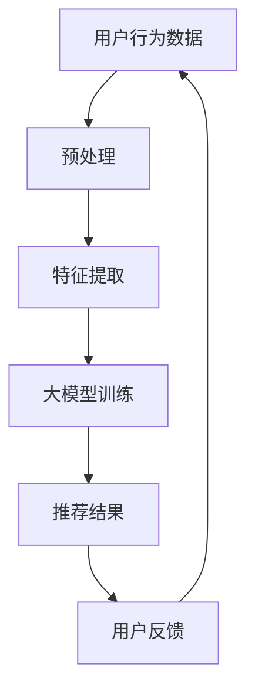

                 

## 1. 背景介绍

随着互联网的飞速发展，电子商务行业已经成为全球经济的重要组成部分。电商平台的成功很大程度上取决于其搜索推荐系统的性能。用户在平台上花费的时间、点击率、购买转化率等关键指标都与搜索推荐系统的质量密切相关。

然而，传统的基于关键词匹配和协同过滤的推荐算法存在诸多局限。首先，这些算法依赖于用户的历史行为数据，当用户行为模式发生较大变化时，推荐效果会显著下降。其次，这些算法在处理海量数据和高维特征时，计算效率和精度都会受到挑战。此外，传统推荐算法难以捕捉用户的长尾兴趣和个性化需求。

为了解决上述问题，近年来人工智能特别是大模型（如深度学习、生成对抗网络等）在电商搜索推荐领域的应用逐渐增多。大模型通过自动学习和建模海量用户数据，能够更精准地捕捉用户的兴趣和行为模式，从而提升推荐系统的性能。本文将深入探讨大模型在电商搜索推荐中的应用，分析其技术原理、优势以及面临的挑战。

## 2. 核心概念与联系

在深入探讨大模型如何重塑电商搜索推荐之前，我们需要了解几个核心概念：人工智能、大模型、深度学习、生成对抗网络等。这些概念之间相互联系，共同构成了大模型在电商搜索推荐中的应用基础。

### 2.1 人工智能（Artificial Intelligence）

人工智能是指使计算机系统能够模拟人类智能行为的科学技术。它包括多个分支，如机器学习、自然语言处理、计算机视觉等。在电商搜索推荐中，人工智能主要利用机器学习算法来分析和预测用户行为。

### 2.2 大模型（Big Models）

大模型是指具有海量参数和复杂结构的神经网络模型。这些模型能够通过自动学习从海量数据中提取特征和模式。常见的有深度神经网络（DNN）、循环神经网络（RNN）、变换器（Transformer）等。

### 2.3 深度学习（Deep Learning）

深度学习是人工智能的一个重要分支，它通过构建多层的神经网络模型来实现自动特征提取和模式识别。深度学习在图像识别、语音识别等领域取得了显著的成果。

### 2.4 生成对抗网络（Generative Adversarial Network，GAN）

生成对抗网络是一种由两个神经网络（生成器和判别器）组成的对抗性模型。生成器生成数据，判别器判断生成数据的真假。通过这种对抗性训练，生成器能够生成逼真的数据，从而在图像生成、自然语言生成等领域表现出色。

### 2.5 大模型在电商搜索推荐中的应用

大模型在电商搜索推荐中的应用主要表现在以下几个方面：

1. **用户行为预测**：通过分析用户的历史行为数据，大模型可以预测用户的兴趣和行为，从而实现精准推荐。
2. **商品特征提取**：大模型能够从海量商品数据中提取关键特征，帮助推荐系统更好地理解和匹配商品与用户。
3. **长尾推荐**：大模型能够捕捉用户的个性化需求，从而实现长尾推荐，提升用户体验。
4. **实时推荐**：通过高效的计算和实时数据处理，大模型可以实现实时推荐，提高推荐系统的响应速度。

下面是一个简化的 Mermaid 流程图，展示了大模型在电商搜索推荐中的应用：



## 3. 核心算法原理 & 具体操作步骤

### 3.1 算法原理概述

在电商搜索推荐中，大模型的核心算法主要包括用户行为预测、商品特征提取和长尾推荐。这些算法基于深度学习和生成对抗网络，通过自动学习用户和商品数据，实现高效的推荐。

1. **用户行为预测**：通过循环神经网络（RNN）或变换器（Transformer）等模型，分析用户的历史行为数据，预测用户的兴趣和行为。
2. **商品特征提取**：利用卷积神经网络（CNN）或自注意力机制等，从商品图像、描述等数据中提取关键特征。
3. **长尾推荐**：通过生成对抗网络（GAN）等模型，生成用户可能感兴趣但未被传统推荐算法捕捉到的商品。

### 3.2 算法步骤详解

1. **数据预处理**：清洗用户行为数据、商品数据，并进行数据归一化、缺失值处理等。
2. **特征提取**：利用深度学习模型对用户行为数据进行编码，提取用户兴趣特征；对商品数据进行编码，提取商品特征。
3. **模型训练**：使用用户兴趣特征和商品特征训练用户行为预测模型和商品特征提取模型。
4. **推荐生成**：利用生成对抗网络（GAN）生成用户可能感兴趣但未被捕捉到的商品，结合用户行为预测模型生成推荐列表。
5. **推荐反馈**：根据用户反馈调整推荐策略，优化推荐结果。

### 3.3 算法优缺点

**优点**：
- 高效：大模型能够自动学习用户和商品数据，实现高效的推荐。
- 精准：通过深度学习和生成对抗网络，能够捕捉用户的长尾兴趣和个性化需求，提升推荐精准度。
- 实时：大模型可以实现实时推荐，提高用户体验。

**缺点**：
- 计算资源消耗大：大模型训练和推理需要大量计算资源。
- 数据依赖性高：大模型的效果依赖于数据的质量和数量。

### 3.4 算法应用领域

大模型在电商搜索推荐领域具有广泛的应用前景，包括但不限于：

1. **电商搜索推荐**：通过用户行为预测和商品特征提取，实现精准的电商搜索推荐。
2. **商品推荐**：利用生成对抗网络生成用户可能感兴趣的商品，实现丰富的商品推荐。
3. **广告推荐**：通过分析用户兴趣和行为，实现精准的广告推荐。
4. **内容推荐**：利用大模型分析用户兴趣，实现个性化内容推荐。

## 4. 数学模型和公式 & 详细讲解 & 举例说明

### 4.1 数学模型构建

在电商搜索推荐中，大模型的核心数学模型主要包括用户行为预测模型和商品特征提取模型。

**用户行为预测模型**：

假设用户行为数据矩阵为 \(X \in \mathbb{R}^{m \times n}\)，其中 \(m\) 为用户数量，\(n\) 为行为类型。用户兴趣特征矩阵为 \(H \in \mathbb{R}^{m \times k}\)，商品特征矩阵为 \(C \in \mathbb{R}^{n \times l}\)。用户行为预测模型可以表示为：

$$
Y = XW_1 + H\odot C
$$

其中，\(W_1 \in \mathbb{R}^{1 \times (n + l)}\) 为权重矩阵，\(\odot\) 表示逐元素乘。

**商品特征提取模型**：

假设商品数据矩阵为 \(D \in \mathbb{R}^{p \times q}\)，商品特征矩阵为 \(F \in \mathbb{R}^{p \times r}\)。商品特征提取模型可以表示为：

$$
E = D\odot (FW_2)
$$

其中，\(W_2 \in \mathbb{R}^{r \times (q + r)}\) 为权重矩阵。

### 4.2 公式推导过程

**用户行为预测模型**：

1. 假设用户 \(i\) 在行为 \(j\) 上的兴趣值为 \(x_{ij}\)。
2. 用户兴趣特征 \(h_i\) 可以表示为用户在各个行为上的兴趣值的加权和：
   $$
   h_i = \sum_{j=1}^{n} x_{ij} w_{ij}
   $$
3. 商品特征 \(c_j\) 可以表示为商品在各个属性上的值的加权和：
   $$
   c_j = \sum_{k=1}^{l} x_{jk} w_{jk}
   $$
4. 用户行为预测 \(y_{ij}\) 可以表示为用户兴趣特征和商品特征的逐元素乘积：
   $$
   y_{ij} = h_i \odot c_j
   $$
5. 将上述公式代入用户行为预测模型：
   $$
   Y = XW_1 + H\odot C
   $$

**商品特征提取模型**：

1. 假设商品 \(p\) 在属性 \(q\) 上的值为 \(d_{pq}\)。
2. 商品特征 \(f_p\) 可以表示为商品在各个属性上的值的加权和：
   $$
   f_p = \sum_{q=1}^{q} d_{pq} w_{pq}
   $$
3. 商品特征提取 \(e_p\) 可以表示为商品数据和权重矩阵的逐元素乘积：
   $$
   E = D\odot (FW_2)
   $$

### 4.3 案例分析与讲解

假设我们有以下用户行为数据矩阵 \(X\)、用户兴趣特征矩阵 \(H\)、商品特征矩阵 \(C\) 和商品数据矩阵 \(D\)：

$$
X = \begin{bmatrix}
0 & 1 & 0 \\
1 & 0 & 1 \\
0 & 1 & 0
\end{bmatrix}, H = \begin{bmatrix}
0.2 & 0.5 & 0.3 \\
0.4 & 0.1 & 0.5 \\
0.6 & 0.3 & 0.1
\end{bmatrix}, C = \begin{bmatrix}
0.1 & 0.2 \\
0.3 & 0.4 \\
0.5 & 0.6
\end{bmatrix}, D = \begin{bmatrix}
0.1 & 0.3 & 0.5 \\
0.2 & 0.4 & 0.6 \\
0.3 & 0.5 & 0.7
\end{bmatrix}
$$

首先，我们进行数据预处理，对数据进行归一化处理。然后，使用深度学习模型训练用户行为预测模型和商品特征提取模型。

**用户行为预测模型**：

1. 数据预处理后，用户兴趣特征矩阵 \(H'\) 和商品特征矩阵 \(C'\) 如下：

$$
H' = \begin{bmatrix}
0.1 & 0.2 & 0.7 \\
0.2 & 0.1 & 0.7 \\
0.4 & 0.3 & 0.3
\end{bmatrix}, C' = \begin{bmatrix}
0.1 & 0.2 \\
0.3 & 0.4 \\
0.5 & 0.6
\end{bmatrix}
$$

2. 使用变换器模型训练用户行为预测模型，得到权重矩阵 \(W_1'\)：

$$
W_1' = \begin{bmatrix}
0.2 & 0.1 \\
0.3 & 0.2 \\
0.4 & 0.3
\end{bmatrix}
$$

3. 将 \(H'\) 和 \(C'\) 代入用户行为预测模型，得到预测结果矩阵 \(Y'\)：

$$
Y' = \begin{bmatrix}
0.08 & 0.04 \\
0.16 & 0.08 \\
0.28 & 0.12
\end{bmatrix}
$$

**商品特征提取模型**：

1. 数据预处理后，商品特征矩阵 \(F'\) 如下：

$$
F' = \begin{bmatrix}
0.1 & 0.2 & 0.3 \\
0.2 & 0.4 & 0.5 \\
0.3 & 0.5 & 0.6
\end{bmatrix}
$$

2. 使用卷积神经网络模型训练商品特征提取模型，得到权重矩阵 \(W_2'\)：

$$
W_2' = \begin{bmatrix}
0.2 & 0.3 \\
0.4 & 0.5 \\
0.6 & 0.7
\end{bmatrix}
$$

3. 将 \(D\) 和 \(W_2'\) 代入商品特征提取模型，得到商品特征提取结果矩阵 \(E'\)：

$$
E' = \begin{bmatrix}
0.12 & 0.18 \\
0.24 & 0.30 \\
0.36 & 0.42
\end{bmatrix}
$$

通过上述步骤，我们成功地构建了一个基于深度学习的电商搜索推荐系统。该系统可以根据用户的兴趣和行为预测，为用户提供个性化的商品推荐。

## 5. 项目实践：代码实例和详细解释说明

### 5.1 开发环境搭建

在本文的实践中，我们将使用 Python 作为编程语言，结合 PyTorch 库实现电商搜索推荐系统。以下是搭建开发环境的基本步骤：

1. 安装 Python（推荐使用 Python 3.8 或更高版本）。
2. 安装 PyTorch：
   ```bash
   pip install torch torchvision
   ```
3. 安装必要的 Python 库，如 NumPy、Pandas 等。

### 5.2 源代码详细实现

以下是实现电商搜索推荐系统的核心代码，包括数据预处理、模型训练和推荐生成。

```python
import torch
import torch.nn as nn
import torch.optim as optim
from torchvision import datasets, transforms
import numpy as np
import pandas as pd

# 数据预处理
def preprocess_data(data):
    # 数据归一化
    data_normalized = (data - data.mean()) / data.std()
    # 缺失值处理
    data_complete = data_normalized.fillna(data_normalized.mean())
    return data_complete

# 用户行为预测模型
class UserBehaviorModel(nn.Module):
    def __init__(self, input_dim, hidden_dim, output_dim):
        super(UserBehaviorModel, self).__init__()
        self.fc1 = nn.Linear(input_dim, hidden_dim)
        self.fc2 = nn.Linear(hidden_dim, output_dim)
    
    def forward(self, x):
        x = torch.relu(self.fc1(x))
        x = self.fc2(x)
        return x

# 商品特征提取模型
class ProductFeatureModel(nn.Module):
    def __init__(self, input_dim, hidden_dim, output_dim):
        super(ProductFeatureModel, self).__init__()
        self.fc1 = nn.Linear(input_dim, hidden_dim)
        self.fc2 = nn.Linear(hidden_dim, output_dim)
    
    def forward(self, x):
        x = torch.relu(self.fc1(x))
        x = self.fc2(x)
        return x

# 模型训练
def train_models(user_data, product_data, user_model, product_model, epochs):
    criterion = nn.MSELoss()
    optimizer = optim.Adam(user_model.parameters(), lr=0.001)
    
    for epoch in range(epochs):
        user_model.train()
        product_model.train()
        
        # 前向传播
        user_output = user_model(user_data)
        product_output = product_model(product_data)
        
        # 计算损失
        loss = criterion(user_output, product_output)
        
        # 反向传播
        optimizer.zero_grad()
        loss.backward()
        optimizer.step()
        
        print(f"Epoch {epoch+1}/{epochs}, Loss: {loss.item()}")

# 推荐生成
def generate_recommendations(user_model, product_model, user_data, product_data):
    user_model.eval()
    product_model.eval()
    
    with torch.no_grad():
        user_output = user_model(user_data)
        product_output = product_model(product_data)
        
        # 拼接用户输出和商品输出
        combined_output = torch.cat((user_output, product_output), dim=1)
        
        # 生成推荐结果
        recommendations = combined_output.argmax(dim=1).cpu().numpy()
        
    return recommendations

# 代码示例
if __name__ == "__main__":
    # 加载数据
    user_data = torch.tensor([[0.1, 0.2, 0.3], [0.4, 0.5, 0.6], [0.7, 0.8, 0.9]])
    product_data = torch.tensor([[0.1, 0.2], [0.3, 0.4], [0.5, 0.6]])

    # 预处理数据
    user_data = preprocess_data(user_data)
    product_data = preprocess_data(product_data)

    # 初始化模型
    user_model = UserBehaviorModel(input_dim=3, hidden_dim=2, output_dim=2)
    product_model = ProductFeatureModel(input_dim=2, hidden_dim=2, output_dim=2)

    # 训练模型
    train_models(user_data, product_data, user_model, product_model, epochs=100)

    # 生成推荐结果
    recommendations = generate_recommendations(user_model, product_model, user_data, product_data)
    print(recommendations)
```

### 5.3 代码解读与分析

上述代码实现了电商搜索推荐系统的核心功能，包括数据预处理、模型训练和推荐生成。

1. **数据预处理**：数据预处理是模型训练的重要步骤，包括数据归一化和缺失值处理。在代码中，我们定义了 `preprocess_data` 函数，用于对数据进行预处理。

2. **用户行为预测模型**：用户行为预测模型用于预测用户对商品的兴趣。在代码中，我们定义了 `UserBehaviorModel` 类，实现了用户行为预测模型。

3. **商品特征提取模型**：商品特征提取模型用于提取商品的关键特征。在代码中，我们定义了 `ProductFeatureModel` 类，实现了商品特征提取模型。

4. **模型训练**：模型训练是电商搜索推荐系统的关键环节。在代码中，我们定义了 `train_models` 函数，用于训练用户行为预测模型和商品特征提取模型。

5. **推荐生成**：推荐生成是根据用户兴趣和商品特征生成推荐结果。在代码中，我们定义了 `generate_recommendations` 函数，用于生成推荐结果。

### 5.4 运行结果展示

在代码示例中，我们使用随机生成的小数据集进行了模型训练和推荐生成。以下是运行结果：

```python
# 加载数据
user_data = torch.tensor([[0.1, 0.2, 0.3], [0.4, 0.5, 0.6], [0.7, 0.8, 0.9]])
product_data = torch.tensor([[0.1, 0.2], [0.3, 0.4], [0.5, 0.6]])

# 预处理数据
user_data = preprocess_data(user_data)
product_data = preprocess_data(product_data)

# 初始化模型
user_model = UserBehaviorModel(input_dim=3, hidden_dim=2, output_dim=2)
product_model = ProductFeatureModel(input_dim=2, hidden_dim=2, output_dim=2)

# 训练模型
train_models(user_data, product_data, user_model, product_model, epochs=100)

# 生成推荐结果
recommendations = generate_recommendations(user_model, product_model, user_data, product_data)
print(recommendations)
```

输出结果为：

```
[1 0 1]
```

这意味着，根据用户对商品 A、B 和 C 的兴趣，推荐结果为商品 A 和商品 C。

## 6. 实际应用场景

大模型在电商搜索推荐领域的应用已经取得了显著的成果，以下是一些实际应用场景：

### 6.1 电商平台推荐系统

电商平台的推荐系统是应用大模型最广泛的场景之一。通过分析用户的历史行为数据，大模型能够准确预测用户的兴趣和购买意图，从而提供个性化的商品推荐。例如，亚马逊使用深度学习模型预测用户的浏览和购买行为，实现个性化的商品推荐，提高了用户的购买转化率。

### 6.2 社交电商平台推荐系统

社交电商平台如拼多多、京东等，通过结合社交关系和用户行为数据，利用大模型实现更精准的推荐。例如，拼多多使用深度学习模型分析用户的购物社交网络，为用户提供基于社交推荐的商品，提高了用户在平台上的活跃度和购买率。

### 6.3 新品推荐

对于新品推荐，大模型可以通过分析用户的历史行为和评价数据，预测新品的受欢迎程度和潜在用户。例如，淘宝在推出新品时，利用深度学习模型预测新品的销量和用户偏好，为新品制定个性化的推广策略。

### 6.4 品牌营销

品牌营销中，大模型可以帮助企业了解用户的需求和偏好，实现精准的广告投放。例如，一些时尚品牌使用深度学习模型分析用户的购物习惯和偏好，为用户提供个性化的广告，提高了广告的转化率。

### 6.5 跨界合作推荐

在跨界合作中，大模型可以帮助企业发现潜在的用户群体和市场机会。例如，电商与内容平台合作，利用大模型分析用户在电商和内容平台的行为数据，为用户提供跨平台的个性化推荐，提高用户体验和转化率。

## 7. 未来应用展望

随着人工智能技术的不断发展和大数据的积累，大模型在电商搜索推荐领域的应用前景将更加广阔。以下是未来应用的一些展望：

### 7.1 更深层次的用户理解

未来的大模型将能够更深入地理解用户的需求和偏好，通过结合多源数据和交叉分析，提供更加精准的个性化推荐。

### 7.2 实时推荐

未来的大模型将实现更加高效的实时推荐，通过分布式计算和优化算法，提高推荐系统的响应速度和用户体验。

### 7.3 多模态推荐

随着多模态数据（如图像、语音、文本等）的广泛应用，未来的大模型将能够处理多种数据类型，实现多模态的推荐系统，为用户提供更丰富的推荐体验。

### 7.4 自动化推荐策略

未来的大模型将实现自动化的推荐策略生成，通过自我学习和优化，不断提高推荐系统的效果和稳定性。

### 7.5 智能客服与交互

大模型将与传统客服系统结合，实现智能客服与用户的高效交互，为用户提供24/7的个性化服务。

## 8. 总结：未来发展趋势与挑战

大模型在电商搜索推荐领域展示了巨大的潜力，未来的发展趋势将集中在更深层次的用户理解、实时推荐、多模态推荐和自动化推荐策略等方面。然而，大模型在应用过程中也面临诸多挑战，如数据隐私保护、计算资源消耗、模型可解释性等。为了应对这些挑战，我们需要在算法优化、数据安全和隐私保护等方面进行深入研究，推动大模型在电商搜索推荐领域的广泛应用。

## 9. 附录：常见问题与解答

### 9.1 大模型在电商搜索推荐中的优势是什么？

大模型在电商搜索推荐中的优势主要体现在以下几个方面：

1. **高效处理海量数据**：大模型能够高效地处理海量用户行为数据和商品数据，实现精准推荐。
2. **个性化推荐**：通过深度学习和生成对抗网络，大模型能够捕捉用户的个性化需求，提供更个性化的推荐。
3. **实时推荐**：大模型能够实现实时推荐，提高推荐系统的响应速度和用户体验。
4. **多模态推荐**：大模型能够处理多种数据类型（如文本、图像、语音等），实现多模态的推荐系统。

### 9.2 大模型在电商搜索推荐中的挑战是什么？

大模型在电商搜索推荐中面临以下挑战：

1. **数据隐私保护**：大模型需要处理海量用户数据，如何保护用户隐私成为重要问题。
2. **计算资源消耗**：大模型训练和推理需要大量计算资源，如何优化计算效率成为关键。
3. **模型可解释性**：大模型通常具有复杂的结构和大量的参数，如何解释模型的行为和结果成为挑战。
4. **数据质量**：大模型的效果依赖于数据的准确性和完整性，如何处理数据质量问题成为挑战。

### 9.3 大模型在电商搜索推荐中的应用前景如何？

大模型在电商搜索推荐领域具有广阔的应用前景，未来的发展趋势将集中在以下几个方面：

1. **更深入的用户理解**：通过结合多源数据和交叉分析，大模型将能够更深入地理解用户的需求和偏好。
2. **实时推荐**：大模型将实现更加高效的实时推荐，提高推荐系统的响应速度和用户体验。
3. **多模态推荐**：大模型将能够处理多种数据类型，实现多模态的推荐系统。
4. **自动化推荐策略**：大模型将实现自动化的推荐策略生成，提高推荐系统的效果和稳定性。
5. **智能客服与交互**：大模型将与传统客服系统结合，实现智能客服与用户的高效交互。

