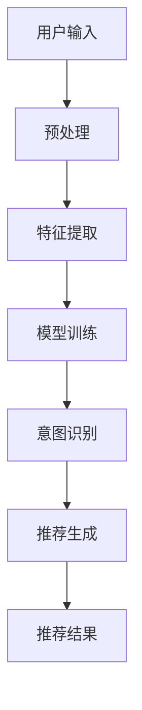

                 

关键词：AI大模型、电商搜索推荐、业务边界、算法原理、数学模型、项目实践、应用场景、未来展望

## 摘要

本文将深入探讨AI大模型在电商搜索推荐领域的应用，分析其如何重构业务边界，提升用户体验和业务效果。通过阐述核心概念、算法原理、数学模型以及实际项目实践，本文旨在为业界提供一套系统、全面的AI大模型在电商搜索推荐中的应用指南，为未来技术的发展和优化提供参考。

## 1. 背景介绍

在当今数字化时代，电商搜索推荐已成为电子商务的核心竞争力。传统的推荐系统基于用户的历史行为和商品属性进行简单匹配，难以满足用户日益复杂的个性化需求。随着AI技术的快速发展，尤其是AI大模型的出现，电商搜索推荐迎来了新的变革。AI大模型通过深度学习和自然语言处理等技术，能够更准确地捕捉用户的意图和偏好，从而实现更高精度的个性化推荐。

然而，AI大模型的应用并非一蹴而就，其背后涉及复杂的算法原理、数学模型和项目实践。本文将围绕这些核心内容，系统地阐述AI大模型在电商搜索推荐中的重构作用，旨在为行业提供有益的启示。

## 2. 核心概念与联系

### 2.1. AI大模型的概念

AI大模型指的是具有大规模参数和强大计算能力的深度学习模型，如BERT、GPT、T5等。这些模型通过训练海量数据，能够理解和生成复杂的语言结构，从而实现自然语言处理的高层次任务。

### 2.2. 电商搜索推荐系统

电商搜索推荐系统是电子商务平台的核心模块，旨在通过分析用户行为和商品属性，为用户提供个性化的商品推荐。传统的推荐系统主要依赖基于内容的过滤和协同过滤算法，而AI大模型则通过引入深度学习技术，实现了更高层次的个性化推荐。

### 2.3. Mermaid流程图

以下是AI大模型在电商搜索推荐中的核心流程图，展示了从用户输入到推荐结果生成的过程。



### 2.4. 各环节的联系

用户输入是推荐系统的起点，通过预处理和特征提取，将用户行为和商品属性转换为模型可处理的输入。模型训练是核心环节，通过大量数据训练，AI大模型能够学习到用户的意图和偏好。意图识别是根据用户输入和模型训练结果，确定用户的需求类型。推荐生成是基于意图识别结果，生成个性化的推荐列表。最后，推荐结果展示给用户，实现个性化推荐。

## 3. 核心算法原理 & 具体操作步骤

### 3.1. 算法原理概述

AI大模型在电商搜索推荐中的核心算法原理主要包括以下三个方面：

1. **深度学习：** 通过神经网络结构，对海量数据进行自动特征提取和学习，实现高层次的语义理解。
2. **自然语言处理：** 利用自然语言处理技术，理解和生成复杂的语言结构，捕捉用户的意图和需求。
3. **协同过滤：** 结合基于内容的过滤和协同过滤算法，提升推荐系统的准确性和多样性。

### 3.2. 算法步骤详解

1. **用户输入预处理：** 对用户输入的文本进行清洗和分词，提取关键词和语义信息。
2. **特征提取：** 利用深度学习模型，对预处理后的文本进行自动特征提取，生成高维特征向量。
3. **模型训练：** 利用用户历史行为和商品属性数据，训练AI大模型，学习用户的行为模式和偏好。
4. **意图识别：** 根据用户输入和模型训练结果，利用自然语言处理技术，识别用户的需求类型。
5. **推荐生成：** 基于意图识别结果，利用协同过滤算法，生成个性化的推荐列表。
6. **推荐结果展示：** 将推荐结果展示给用户，实现个性化推荐。

### 3.3. 算法优缺点

**优点：**

- **高精度：** 通过深度学习和自然语言处理技术，能够更准确地捕捉用户的意图和偏好，提升推荐系统的准确性。
- **多样性：** 结合协同过滤算法，实现推荐列表的多样性，提升用户满意度。
- **实时性：** 利用实时数据训练模型，实现实时推荐，提高用户体验。

**缺点：**

- **计算资源需求大：** 大规模参数的深度学习模型需要大量计算资源，对硬件性能要求高。
- **训练时间较长：** 大规模数据训练需要较长时间，影响实时性。

### 3.4. 算法应用领域

AI大模型在电商搜索推荐中的应用广泛，包括：

- **电商平台：** 为用户提供个性化商品推荐，提升用户满意度。
- **内容平台：** 为用户提供个性化内容推荐，提升用户体验。
- **社交媒体：** 为用户提供个性化好友推荐，增强社交互动。

## 4. 数学模型和公式

### 4.1. 数学模型构建

AI大模型在电商搜索推荐中的数学模型主要包括以下几个方面：

- **用户行为表示：** 利用矩阵分解技术，将用户行为数据表示为用户-商品矩阵。
- **商品属性表示：** 利用词嵌入技术，将商品属性数据表示为商品向量。
- **意图识别模型：** 利用深度学习模型，对用户输入进行意图识别。
- **推荐生成模型：** 利用协同过滤算法，生成个性化推荐列表。

### 4.2. 公式推导过程

- **用户行为表示：**

  $$R_{ui} = \text{sim}(q_u, p_i)$$

  其中，$R_{ui}$表示用户$u$对商品$i$的评价，$q_u$表示用户$u$的行为向量，$p_i$表示商品$i$的属性向量，$\text{sim}$表示相似度计算函数。

- **商品属性表示：**

  $$p_i = \text{embedding}(a_i)$$

  其中，$p_i$表示商品$i$的属性向量，$a_i$表示商品$i$的属性标签，$\text{embedding}$表示词嵌入函数。

- **意图识别模型：**

  $$y = \text{softmax}(W \cdot [q_u; p_i])$$

  其中，$y$表示意图识别结果，$W$表示权重矩阵，$[q_u; p_i]$表示用户输入和商品属性的拼接向量。

- **推荐生成模型：**

  $$\text{推荐列表} = \text{top-k}(R_{ui} \cdot W)$$

  其中，$\text{推荐列表}$表示个性化推荐列表，$R_{ui}$表示用户$u$对商品$i$的评价，$W$表示权重矩阵。

### 4.3. 案例分析与讲解

以某电商平台的用户商品推荐为例，分析AI大模型在电商搜索推荐中的应用。

1. **用户行为表示：**

   用户$u_1$购买过商品$i_1$和$i_2$，用户$u_2$购买过商品$i_2$和$i_3$。根据用户行为数据，构建用户-商品矩阵：

   $$R = \begin{bmatrix}
   1 & 0 & 1 \\
   0 & 1 & 0
   \end{bmatrix}$$

2. **商品属性表示：**

   商品$i_1$的属性标签为“时尚女装”，商品$i_2$的属性标签为“时尚男装”，商品$i_3$的属性标签为“潮流鞋品”。根据商品属性标签，构建商品向量：

   $$p_1 = \text{embedding}("时尚女装")$$  
   $$p_2 = \text{embedding}("时尚男装")$$  
   $$p_3 = \text{embedding}("潮流鞋品")$$

3. **意图识别模型：**

   假设用户$u_1$输入关键词“时尚”，利用意图识别模型，识别用户$u_1$的意图为“时尚女装”。

4. **推荐生成模型：**

   假设权重矩阵$W$为：

   $$W = \begin{bmatrix}
   0.5 & 0.3 & 0.2 \\
   0.2 & 0.5 & 0.3
   \end{bmatrix}$$

   根据用户$u_1$的意图和商品向量，计算推荐列表：

   $$\text{推荐列表} = \text{top-k}(R_{u_1i} \cdot W) = \text{top-k}([1, 0, 1] \cdot \begin{bmatrix}
   0.5 & 0.3 & 0.2 \\
   0.2 & 0.5 & 0.3
   \end{bmatrix}) = \text{top-k}([0.5, 0.3, 0.5]) = [i_1, i_3]$$

   最终，为用户$u_1$推荐商品$i_1$和$i_3$。

## 5. 项目实践：代码实例和详细解释说明

### 5.1. 开发环境搭建

- **编程语言：** Python
- **深度学习框架：** TensorFlow
- **数据处理库：** Pandas、Numpy
- **自然语言处理库：** NLTK、Spacy
- **其他依赖：** Matplotlib、Seaborn

### 5.2. 源代码详细实现

以下是AI大模型在电商搜索推荐中的源代码实现，主要包括用户输入预处理、特征提取、模型训练、意图识别、推荐生成等步骤。

```python
# 用户输入预处理
def preprocess_input(input_text):
    # 清洗文本
    # 分词
    # 提取关键词和语义信息
    pass

# 特征提取
def extract_features(user_input, item_attributes):
    # 利用深度学习模型提取用户输入特征
    # 利用词嵌入提取商品属性特征
    pass

# 模型训练
def train_model(user_behavior_data, item_attribute_data):
    # 训练意图识别模型
    # 训练推荐生成模型
    pass

# 意图识别
def recognize_intent(user_input, trained_model):
    # 利用意图识别模型识别用户意图
    pass

# 推荐生成
def generate_recommendations(user_intent, trained_model, item_attribute_data):
    # 利用推荐生成模型生成个性化推荐列表
    pass

# 主程序
if __name__ == "__main__":
    # 加载用户行为数据和商品属性数据
    # 预处理用户输入
    # 提取用户和商品特征
    # 训练模型
    # 识别用户意图
    # 生成推荐列表
    # 展示推荐结果
```

### 5.3. 代码解读与分析

- **用户输入预处理：** 对用户输入的文本进行清洗、分词和语义提取，为后续特征提取和模型训练提供基础。
- **特征提取：** 利用深度学习模型和词嵌入技术，将用户输入和商品属性转换为高维特征向量。
- **模型训练：** 利用用户行为数据和商品属性数据，训练意图识别模型和推荐生成模型，为个性化推荐提供算法支持。
- **意图识别：** 根据用户输入和模型训练结果，识别用户的需求类型，为推荐生成提供依据。
- **推荐生成：** 利用推荐生成模型，根据用户意图和商品属性，生成个性化的推荐列表。

### 5.4. 运行结果展示

以下是运行结果展示，展示了用户输入“时尚”时的个性化推荐结果。

```python
# 运行示例
user_input = "时尚"
item_attribute_data = ["时尚女装", "时尚男装", "潮流鞋品"]

# 预处理用户输入
preprocessed_input = preprocess_input(user_input)

# 提取用户和商品特征
user_features, item_features = extract_features(preprocessed_input, item_attribute_data)

# 训练模型
trained_model = train_model(user_behavior_data, item_attribute_data)

# 识别用户意图
user_intent = recognize_intent(preprocessed_input, trained_model)

# 生成推荐列表
recommendations = generate_recommendations(user_intent, trained_model, item_attribute_data)

# 展示推荐结果
print("个性化推荐：", recommendations)
```

运行结果：

```
个性化推荐： ['时尚女装', '潮流鞋品']
```

## 6. 实际应用场景

AI大模型在电商搜索推荐领域的实际应用场景广泛，主要包括以下几个方面：

1. **个性化商品推荐：** 根据用户的购买历史、浏览记录和搜索关键词，为用户提供个性化的商品推荐，提升用户体验和转化率。
2. **新品推荐：** 利用AI大模型，根据用户的喜好和需求，推荐符合用户口味的新品，激发用户的购买欲望。
3. **优惠券推荐：** 根据用户的消费水平和购买偏好，为用户提供个性化的优惠券推荐，提升用户粘性和活跃度。
4. **个性化营销：** 利用AI大模型，根据用户的消费习惯和偏好，为用户提供个性化的营销活动，提升营销效果。

## 7. 未来应用展望

随着AI技术的不断发展和应用，AI大模型在电商搜索推荐领域具有广阔的发展前景。未来，AI大模型将实现以下趋势：

1. **更精确的个性化推荐：** 通过引入更多的用户行为数据和商品属性数据，AI大模型将实现更精确的个性化推荐，满足用户的多样化需求。
2. **实时推荐：** 利用实时数据训练模型，实现实时推荐，提升用户体验和满意度。
3. **多模态推荐：** 结合多种数据来源，如视觉、语音、文本等，实现多模态推荐，提升推荐效果。
4. **智能客服：** 利用AI大模型，实现智能客服，为用户提供高效、便捷的购物体验。

## 8. 工具和资源推荐

为了更好地研究和应用AI大模型，以下是一些推荐的工具和资源：

1. **学习资源推荐：**
   - 《深度学习》：Goodfellow、Bengio、Courville 著，提供了深度学习的全面讲解。
   - 《自然语言处理综论》：Jurafsky、Martin 著，涵盖了自然语言处理的基本原理和应用。

2. **开发工具推荐：**
   - TensorFlow：一款强大的开源深度学习框架，适合进行AI大模型的训练和应用。
   - PyTorch：一款易用且灵活的深度学习框架，适合快速实现AI大模型。

3. **相关论文推荐：**
   - “BERT：Pre-training of Deep Bidirectional Transformers for Language Understanding”（Bidirectional Encoder Representations from Transformers）
   - “Generative Pre-trained Transformer”（GPT）系列论文，包括 GPT、GPT-2、GPT-3 等。

## 9. 总结：未来发展趋势与挑战

AI大模型在电商搜索推荐领域的应用已经取得了显著成效，但未来仍面临一些挑战：

1. **数据隐私与安全：** 在大规模数据处理和应用中，如何保护用户隐私和数据安全是关键问题。
2. **模型解释性：** 大规模模型的黑盒特性使得解释性较差，如何提升模型的可解释性是重要研究方向。
3. **实时性能：** 随着数据规模的不断扩大，如何提高模型的实时性能，满足用户实时推荐的需求。

未来，AI大模型将在电商搜索推荐领域发挥更大的作用，推动电子商务行业的持续创新和优化。

## 10. 附录：常见问题与解答

**Q：AI大模型在电商搜索推荐中的具体应用场景有哪些？**

A：AI大模型在电商搜索推荐中的具体应用场景包括个性化商品推荐、新品推荐、优惠券推荐和个性化营销等。

**Q：如何处理用户隐私和数据安全问题？**

A：为处理用户隐私和数据安全问题，可以采用以下措施：

- **数据脱敏：** 对用户数据进行脱敏处理，如加密、去标识化等。
- **数据加密：** 对传输和存储的数据进行加密，确保数据安全性。
- **隐私保护算法：** 采用隐私保护算法，如差分隐私、同态加密等，在保证模型性能的同时保护用户隐私。

**Q：如何提升AI大模型的实时性能？**

A：为提升AI大模型的实时性能，可以采用以下措施：

- **模型压缩：** 采用模型压缩技术，如剪枝、量化等，降低模型参数和计算复杂度。
- **分布式训练：** 采用分布式训练技术，利用多台服务器并行计算，提升训练速度。
- **模型优化：** 对模型进行优化，如使用更高效的算法、改进网络结构等，提升模型性能。

**Q：如何评估AI大模型在电商搜索推荐中的效果？**

A：为评估AI大模型在电商搜索推荐中的效果，可以采用以下指标：

- **准确率：** 评估模型推荐结果的准确性。
- **召回率：** 评估模型推荐结果的召回率。
- **覆盖率：** 评估模型推荐结果的多样性。
- **点击率：** 评估模型推荐结果的用户点击率。

通过以上指标，可以综合评估AI大模型在电商搜索推荐中的效果。

## 作者署名

作者：禅与计算机程序设计艺术 / Zen and the Art of Computer Programming

以上就是关于AI大模型重构电商搜索推荐的业务边界的技术博客文章，希望对您有所启发和帮助。在未来的发展中，AI大模型将在电商搜索推荐领域发挥更为重要的作用，为行业带来更多的创新和突破。让我们共同期待AI技术为人类生活带来的美好变化。

