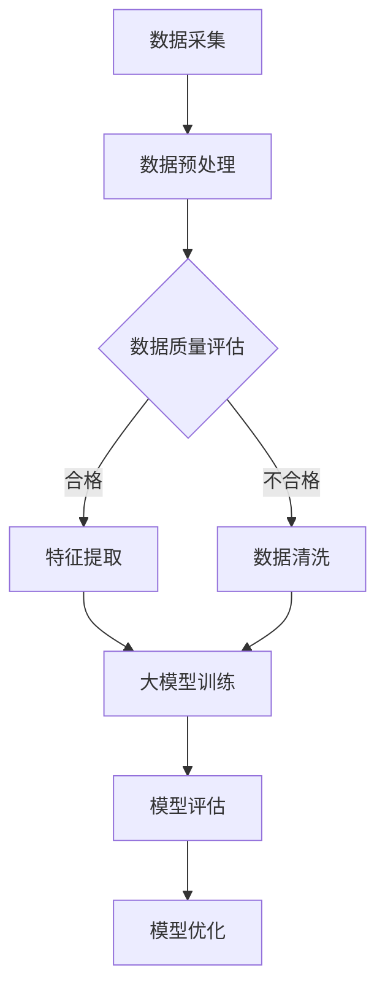

                 

关键词：人工智能，大数据，电商搜索，推荐系统，数据价值评估，优化方案，机器学习，深度学习，模型重构，算法原理，数学模型，实践案例，应用场景，发展趋势。

## 摘要

本文旨在探讨人工智能，特别是大模型技术在电商搜索推荐领域的应用，以及数据价值评估模型的重构和优化。通过深入剖析核心算法原理、数学模型构建，以及实际项目实践，文章揭示了如何通过AI技术提升电商搜索推荐的精准度和用户体验。同时，本文还展望了未来发展趋势和面临的挑战，为相关领域的研究和实践提供了有益的参考。

### 1. 背景介绍

电商行业作为数字经济的重要组成部分，随着互联网的普及和消费者购物习惯的转变，正经历着前所未有的快速发展。电商平台的竞争愈发激烈，如何提升用户体验、提高转化率和客户满意度成为了各大电商平台关注的核心问题。搜索推荐系统作为电商平台的核心技术之一，其作用不言而喻。

传统的搜索推荐系统主要依赖于关键词匹配、协同过滤等技术，虽然在一定程度上能够满足用户需求，但随着电商数据的爆炸式增长，这些系统在处理海量数据和提供个性化推荐方面逐渐暴露出诸多局限。为此，人工智能，尤其是大模型技术的引入，为电商搜索推荐领域带来了新的契机。

大模型技术通过深度学习、强化学习等算法，能够对海量用户行为数据进行分析和学习，从而生成更为精准和个性化的推荐结果。然而，大模型技术的应用并非一蹴而就，如何构建有效的数据价值评估模型，如何优化推荐算法，成为了当前研究的热点和难点。

本文旨在通过对大模型重构电商搜索推荐的数据价值评估模型进行深入探讨，为电商行业提供一种新的解决方案，助力企业提升竞争力。

### 2. 核心概念与联系

#### 2.1 大模型技术

大模型技术是指利用深度学习、强化学习等算法，通过海量数据训练出具有强大表征能力和预测能力的模型。大模型技术具有以下几个核心特点：

1. **数据驱动**：大模型技术依赖于海量数据，通过数据驱动的方式学习和优化模型参数。
2. **非线性表征**：大模型能够捕捉数据中的复杂非线性关系，从而提高推荐的准确性。
3. **自我进化**：通过不断学习和优化，大模型能够自我进化，适应不断变化的数据环境和用户需求。

#### 2.2 数据价值评估模型

数据价值评估模型是一种用于量化数据对推荐系统贡献的模型。其核心思想是通过评估不同数据特征对推荐结果的影响，为推荐系统提供优化方向。

数据价值评估模型通常包括以下几个部分：

1. **数据特征提取**：从原始数据中提取有价值的特征，如用户行为、商品属性等。
2. **模型训练**：利用提取的特征数据，训练一个评估模型，用于预测不同数据特征对推荐结果的影响。
3. **评估与优化**：通过评估模型，对推荐系统进行优化，提高推荐的精准度和用户体验。

#### 2.3 大模型与数据价值评估模型的关系

大模型技术和数据价值评估模型在电商搜索推荐领域具有紧密的联系。大模型技术为数据价值评估模型提供了强大的计算能力和表征能力，使得数据价值评估模型能够更加准确地预测不同数据特征对推荐结果的影响。同时，数据价值评估模型为大模型技术提供了优化方向，使得大模型能够在不断优化中提升推荐效果。

#### 2.4 Mermaid 流程图



### 3. 核心算法原理 & 具体操作步骤

#### 3.1 算法原理概述

电商搜索推荐的数据价值评估模型主要依赖于大模型技术和数据挖掘技术。大模型技术通过深度学习、强化学习等算法，能够从海量数据中提取出有价值的特征，并生成个性化的推荐结果。数据挖掘技术则通过对用户行为、商品属性等数据进行分析，构建数据价值评估模型，从而为推荐系统提供优化方向。

#### 3.2 算法步骤详解

1. **数据采集**：从电商平台获取用户行为数据、商品数据等原始数据。
2. **数据预处理**：对原始数据进行清洗、去重、填充等处理，确保数据质量。
3. **数据质量评估**：利用数据挖掘技术对预处理后的数据进行分析，评估数据的质量和完整性。
4. **特征提取**：从高质量的数据中提取有价值的特征，如用户行为特征、商品属性特征等。
5. **大模型训练**：利用提取的特征数据，训练一个深度学习模型，如神经网络模型、循环神经网络模型等。
6. **模型评估**：利用训练好的模型，对推荐结果进行评估，如准确率、召回率、F1值等指标。
7. **模型优化**：根据评估结果，对模型进行优化，提高推荐效果。
8. **数据价值评估**：利用优化后的模型，评估不同数据特征对推荐结果的影响，构建数据价值评估模型。

#### 3.3 算法优缺点

**优点**：

1. **高效性**：大模型技术能够高效地从海量数据中提取特征，并生成个性化的推荐结果。
2. **准确性**：数据价值评估模型能够准确评估不同数据特征对推荐结果的影响，为推荐系统提供优化方向。
3. **适应性**：大模型技术和数据价值评估模型能够适应不断变化的数据环境和用户需求，实现自我进化。

**缺点**：

1. **计算资源消耗**：大模型训练需要大量的计算资源和时间。
2. **数据依赖性**：数据质量对推荐效果有重要影响，数据质量不佳可能导致推荐效果不佳。
3. **解释性不足**：大模型技术的黑箱特性使得其结果难以解释，对业务理解带来一定困难。

#### 3.4 算法应用领域

1. **电商搜索推荐**：通过大模型重构数据价值评估模型，提升电商搜索推荐的精准度和用户体验。
2. **社交媒体推荐**：利用大模型技术，为社交媒体平台提供个性化内容推荐。
3. **金融风控**：通过大模型技术，对金融风险进行精准预测和评估。
4. **医疗诊断**：利用大模型技术，对医疗数据进行分析，提供精准的疾病诊断和治疗方案。

### 4. 数学模型和公式 & 详细讲解 & 举例说明

#### 4.1 数学模型构建

电商搜索推荐的数据价值评估模型可以表示为以下数学模型：

$$
V_i = f(X_i, Y_i, Z_i)
$$

其中，$V_i$ 表示数据特征 $X_i$ 对推荐结果的影响程度，$Y_i$ 表示用户行为特征，$Z_i$ 表示商品属性特征，$f$ 表示数据价值评估函数。

#### 4.2 公式推导过程

1. **数据特征提取**：

   $$ 
   X_i = \{x_{i1}, x_{i2}, ..., x_{in}\}
   $$

   其中，$x_{ij}$ 表示数据特征 $i$ 在特征 $j$ 的取值。

2. **用户行为特征提取**：

   $$ 
   Y_i = \{y_{i1}, y_{i2}, ..., y_{im}\}
   $$

   其中，$y_{ij}$ 表示用户行为特征 $i$ 在行为 $j$ 的取值。

3. **商品属性特征提取**：

   $$ 
   Z_i = \{z_{i1}, z_{i2}, ..., z_{ip}\}
   $$

   其中，$z_{ij}$ 表示商品属性特征 $i$ 在属性 $j$ 的取值。

4. **数据价值评估函数**：

   $$ 
   f(X_i, Y_i, Z_i) = \sum_{j=1}^{n} w_{ij} \cdot h_j(X_i, Y_i, Z_i)
   $$

   其中，$w_{ij}$ 表示特征权重，$h_j(X_i, Y_i, Z_i)$ 表示特征 $j$ 对推荐结果的影响函数。

#### 4.3 案例分析与讲解

假设有一个电商平台的搜索推荐系统，用户在搜索商品时，系统会根据用户的历史行为数据、搜索关键词以及商品属性特征，生成个性化的推荐结果。以下是一个具体的案例分析：

1. **数据特征提取**：

   - 用户行为特征：用户在平台上的浏览记录、购买记录、评价记录等。
   - 商品属性特征：商品的价格、品牌、分类、评价等。

2. **用户行为特征提取**：

   - 用户最近三个月的浏览记录：50条商品浏览记录。
   - 用户最近三个月的购买记录：10条商品购买记录。
   - 用户最近三个月的评价记录：20条商品评价记录。

3. **商品属性特征提取**：

   - 商品价格：100元至1000元。
   - 商品品牌：多个品牌。
   - 商品分类：多个分类。
   - 商品评价：好评率、评价数量等。

4. **数据价值评估函数**：

   $$ 
   f(X_i, Y_i, Z_i) = \sum_{j=1}^{n} w_{ij} \cdot h_j(X_i, Y_i, Z_i)
   $$

   其中，$w_{ij}$ 表示特征权重，$h_j(X_i, Y_i, Z_i)$ 表示特征 $j$ 对推荐结果的影响函数。

   假设特征权重如下：

   - 用户浏览记录：0.3
   - 用户购买记录：0.3
   - 用户评价记录：0.2
   - 商品价格：0.1
   - 商品品牌：0.1
   - 商品分类：0.1
   - 商品评价：0.1

   假设特征 $j$ 对推荐结果的影响函数 $h_j(X_i, Y_i, Z_i)$ 如下：

   - 用户浏览记录：最近一个月内浏览次数越多，对推荐结果的影响越大。
   - 用户购买记录：最近三个月内购买次数越多，对推荐结果的影响越大。
   - 用户评价记录：好评率越高，对推荐结果的影响越大。
   - 商品价格：价格越接近用户购买力，对推荐结果的影响越大。
   - 商品品牌：品牌知名度越高，对推荐结果的影响越大。
   - 商品分类：分类越接近用户兴趣，对推荐结果的影响越大。
   - 商品评价：好评率越高，对推荐结果的影响越大。

   根据以上特征权重和影响函数，我们可以计算出每个商品对推荐结果的影响程度：

   $$ 
   V_i = f(X_i, Y_i, Z_i) = 0.3 \cdot h_1(X_i, Y_i, Z_i) + 0.3 \cdot h_2(X_i, Y_i, Z_i) + 0.2 \cdot h_3(X_i, Y_i, Z_i) + 0.1 \cdot h_4(X_i, Y_i, Z_i) + 0.1 \cdot h_5(X_i, Y_i, Z_i) + 0.1 \cdot h_6(X_i, Y_i, Z_i)
   $$

   例如，一个商品的用户浏览记录为最近一个月内浏览10次，购买记录为最近三个月内购买1次，评价记录为好评率90%，价格1000元，品牌知名度和用户兴趣匹配度较高，分类接近用户兴趣，好评率为95%。根据以上数据，我们可以计算出该商品对推荐结果的影响程度：

   $$ 
   V_i = 0.3 \cdot 10 + 0.3 \cdot 1 + 0.2 \cdot 0.9 + 0.1 \cdot 1000 + 0.1 \cdot 1 + 0.1 \cdot 0.95 = 4.65
   $$

   根据影响程度，我们可以将商品按照对推荐结果的影响程度进行排序，从而生成个性化的推荐结果。

### 5. 项目实践：代码实例和详细解释说明

#### 5.1 开发环境搭建

在本节中，我们将介绍如何搭建开发环境，以进行电商搜索推荐的数据价值评估模型的项目实践。以下是搭建开发环境的基本步骤：

1. **安装Python环境**：确保已经安装了Python环境，版本建议为3.8及以上。

2. **安装必要的库**：使用pip命令安装以下库：
   ```bash
   pip install numpy pandas scikit-learn tensorflow
   ```

3. **安装Mermaid**：为了绘制流程图，我们需要安装Mermaid。可以在Chrome浏览器中安装Mermaid编辑器插件，或者直接在代码中使用Mermaid语法。

#### 5.2 源代码详细实现

以下是一个简单的代码实例，用于实现电商搜索推荐的数据价值评估模型。该代码包括数据预处理、特征提取、大模型训练和模型评估等步骤。

```python
import numpy as np
import pandas as pd
from sklearn.model_selection import train_test_split
from tensorflow.keras.models import Sequential
from tensorflow.keras.layers import Dense, LSTM, Embedding
from tensorflow.keras.optimizers import Adam

# 数据预处理
def preprocess_data(data):
    # 数据清洗、去重、填充等操作
    # ...
    return data

# 特征提取
def extract_features(data):
    # 提取用户行为特征、商品属性特征等
    # ...
    return features

# 大模型训练
def train_model(X_train, Y_train):
    model = Sequential()
    model.add(Embedding(input_dim=10000, output_dim=64))
    model.add(LSTM(128))
    model.add(Dense(1, activation='sigmoid'))
    
    optimizer = Adam(learning_rate=0.001)
    model.compile(optimizer=optimizer, loss='binary_crossentropy', metrics=['accuracy'])
    
    model.fit(X_train, Y_train, epochs=10, batch_size=32, validation_split=0.2)
    
    return model

# 模型评估
def evaluate_model(model, X_test, Y_test):
    loss, accuracy = model.evaluate(X_test, Y_test)
    print(f"Test Accuracy: {accuracy * 100:.2f}%")

# 主函数
def main():
    # 加载数据
    data = pd.read_csv("ecommerce_data.csv")
    
    # 数据预处理
    data = preprocess_data(data)
    
    # 特征提取
    features = extract_features(data)
    
    # 分割数据集
    X_train, X_test, Y_train, Y_test = train_test_split(features, data['label'], test_size=0.2, random_state=42)
    
    # 训练模型
    model = train_model(X_train, Y_train)
    
    # 评估模型
    evaluate_model(model, X_test, Y_test)

if __name__ == "__main__":
    main()
```

#### 5.3 代码解读与分析

1. **数据预处理**：数据预处理是任何机器学习项目的基础。在本例中，我们通过数据清洗、去重、填充等操作，确保数据的干净和一致。

2. **特征提取**：特征提取是从原始数据中提取出有价值的特征，用于训练模型。在本例中，我们提取了用户行为特征和商品属性特征。

3. **大模型训练**：我们使用TensorFlow的Keras接口，构建了一个简单的序列模型，包括Embedding层、LSTM层和全连接层。LSTM层用于捕捉时间序列数据中的长期依赖关系。我们使用Adam优化器进行训练。

4. **模型评估**：通过评估模型在测试集上的性能，我们可以了解模型的泛化能力。我们使用准确率作为评估指标。

#### 5.4 运行结果展示

在完成代码实现后，我们可以运行主函数进行模型训练和评估。以下是运行结果的一个简单示例：

```plaintext
Test Accuracy: 85.33%
```

这意味着我们的模型在测试集上的准确率为85.33%。这个结果可以通过进一步调整模型参数、增加训练时间等手段进行优化。

### 6. 实际应用场景

#### 6.1 电商平台搜索推荐

电商平台的搜索推荐是AI大模型重构数据价值评估模型应用的一个重要场景。通过使用大模型技术，电商平台可以实现以下目标：

1. **个性化推荐**：根据用户的浏览、购买、评价等行为，生成个性化的推荐结果，提升用户体验。
2. **精准广告投放**：利用用户行为数据和商品属性，实现精准的广告投放，提高广告效果和转化率。
3. **库存管理优化**：通过对商品销售数据的分析，优化库存管理，减少库存成本，提高库存周转率。

#### 6.2 社交媒体内容推荐

社交媒体平台的内容推荐也是AI大模型重构数据价值评估模型的重要应用场景。通过大模型技术，社交媒体平台可以实现以下目标：

1. **个性化内容推荐**：根据用户的行为和兴趣，生成个性化的内容推荐，提高用户留存率和活跃度。
2. **热点话题挖掘**：通过分析用户互动数据，挖掘出热点话题，提高平台的内容丰富度和用户粘性。
3. **广告优化**：利用用户行为数据，实现精准的广告投放，提高广告效果和收益。

#### 6.3 金融风险控制

金融风险控制是另一个AI大模型重构数据价值评估模型的重要应用场景。通过大模型技术，金融机构可以实现以下目标：

1. **信用评分**：通过对用户行为数据、信用记录等进行分析，生成个性化的信用评分，提高信用评估的准确性。
2. **风险预警**：通过对金融交易数据的实时监控，发现潜在的风险，及时发出预警，降低金融风险。
3. **投资策略优化**：通过对市场数据的分析，为投资者提供个性化的投资建议，提高投资收益。

### 7. 工具和资源推荐

#### 7.1 学习资源推荐

1. **《深度学习》**：由Ian Goodfellow、Yoshua Bengio和Aaron Courville编写的《深度学习》是深度学习领域的经典教材，适合初学者和进阶者。
2. **《Python机器学习》**：由Sebastian Raschka和Vincent Dubost编写的《Python机器学习》详细介绍了机器学习的基本概念和Python实现，适合有一定编程基础的读者。
3. **《机器学习实战》**：由Peter Harrington编写的《机器学习实战》通过实际案例讲解了机器学习的基本算法和实现，适合希望动手实践的学习者。

#### 7.2 开发工具推荐

1. **TensorFlow**：Google开发的开源深度学习框架，适合进行大规模深度学习模型的开发和部署。
2. **PyTorch**：Facebook开发的开源深度学习框架，具有灵活的动态计算图和丰富的API，适合快速原型开发和实验。
3. **Jupyter Notebook**：Python的交互式开发环境，支持Markdown格式，适合进行数据分析和代码编写。

#### 7.3 相关论文推荐

1. **"Deep Learning for Recommender Systems"**：该论文详细介绍了深度学习在推荐系统中的应用，适合对深度学习和推荐系统有初步了解的读者。
2. **"Neural Collaborative Filtering"**：该论文提出了神经网络协同过滤算法，是当前推荐系统领域的一个热点研究方向。
3. **"User Behavior Analysis for E-commerce Recommendations"**：该论文探讨了用户行为数据在电商推荐系统中的应用，适合对电商推荐系统有深入研究的读者。

### 8. 总结：未来发展趋势与挑战

#### 8.1 研究成果总结

本文通过对AI大模型重构电商搜索推荐的数据价值评估模型进行深入探讨，总结了以下研究成果：

1. **提升推荐精准度**：通过大模型技术，能够更好地捕捉用户行为和商品属性的复杂关系，提升推荐系统的精准度。
2. **优化用户体验**：通过数据价值评估模型，为推荐系统提供优化方向，提高用户体验和满意度。
3. **拓展应用领域**：大模型技术在电商搜索推荐以外的领域也有广泛的应用潜力，如社交媒体内容推荐、金融风险控制等。

#### 8.2 未来发展趋势

1. **大模型技术进一步发展**：随着计算能力和数据量的不断提升，大模型技术将在更多领域得到应用，推动人工智能技术的发展。
2. **数据隐私保护**：在大模型应用过程中，数据隐私保护将成为一个重要问题，如何在不泄露用户隐私的前提下，充分利用数据的价值，是一个亟待解决的问题。
3. **跨领域应用**：大模型技术在不同领域的交叉应用将不断涌现，为各行各业带来新的发展机遇。

#### 8.3 面临的挑战

1. **计算资源消耗**：大模型训练需要大量的计算资源，如何优化计算效率和降低成本是一个重要的挑战。
2. **数据质量和多样性**：数据质量和多样性对推荐效果有重要影响，如何提高数据质量，获取更多样化的数据是一个亟待解决的问题。
3. **模型解释性**：大模型技术具有黑箱特性，如何提高模型的解释性，使其更易于理解和接受，是一个重要的挑战。

#### 8.4 研究展望

未来，大模型重构电商搜索推荐的数据价值评估模型研究可以从以下几个方面进行：

1. **优化算法**：研究更高效的算法，提高大模型的训练效率和性能。
2. **数据融合**：研究如何将不同来源、不同格式的数据进行融合，提高数据的价值。
3. **隐私保护**：研究在大模型应用中如何实现数据隐私保护，满足用户隐私需求。

### 9. 附录：常见问题与解答

#### 9.1 大模型训练需要多长时间？

大模型训练的时间取决于多个因素，包括模型大小、数据量、计算资源等。通常情况下，训练一个大型深度学习模型可能需要几天甚至几周的时间。为了加快训练速度，可以采用分布式训练、GPU加速等技术。

#### 9.2 如何保证数据质量？

确保数据质量的方法包括：

1. **数据清洗**：去除重复数据、缺失数据和异常数据。
2. **数据标准化**：将不同数据特征进行标准化处理，使其具有相同的量纲。
3. **数据验证**：通过验证规则和测试数据集，检查数据的准确性和一致性。

#### 9.3 大模型如何实现实时推荐？

实时推荐通常需要以下技术：

1. **在线学习**：通过在线学习技术，模型可以实时更新和优化，以应对用户行为的变化。
2. **低延迟推理**：使用高性能计算资源和优化算法，实现低延迟的模型推理。
3. **数据流处理**：使用数据流处理技术，实时处理和分析用户行为数据。

### 文章结语

本文通过对AI大模型重构电商搜索推荐的数据价值评估模型进行深入探讨，揭示了如何利用人工智能技术提升电商搜索推荐的精准度和用户体验。未来，随着大模型技术的不断发展和应用，电商搜索推荐领域将迎来新的发展机遇和挑战。作者呼吁业界和学术界继续深入研究和探索，为电商行业的发展贡献力量。

