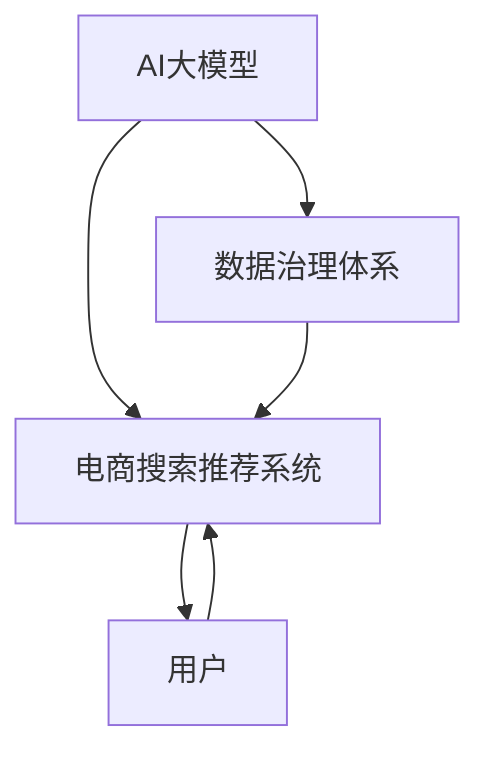

                 

关键词：电商搜索推荐、AI大模型、数据治理、算法优化、用户体验、个性化推荐

> 摘要：本文深入探讨了AI大模型在电商搜索推荐系统中的重构作用，分析了数据治理体系的重要性，以及如何通过优化算法提升用户体验。本文还将讨论AI大模型在不同应用场景中的效果和未来发展方向。

## 1. 背景介绍

随着互联网的普及，电商行业迅速崛起，成为现代商业的重要组成部分。电商平台的搜索推荐系统作为用户获取商品信息的重要途径，其性能和用户体验对平台的发展至关重要。传统的搜索推荐系统多基于统计方法和机器学习算法，但面对海量用户数据和复杂的市场环境，其效果已逐渐显现出局限性。近年来，AI大模型的快速发展为电商搜索推荐系统带来了新的契机。

AI大模型，如深度学习模型、生成对抗网络（GAN）等，通过处理海量数据，能够提取出更加复杂的特征，提供更精准的推荐结果。同时，数据治理体系的完善也是保证AI大模型有效性的关键。本文将从AI大模型的核心概念、算法原理、数学模型、项目实践等多个角度，探讨如何通过重构数据治理体系，优化电商搜索推荐系统。

## 2. 核心概念与联系

为了更好地理解AI大模型在电商搜索推荐系统中的作用，我们首先需要了解以下几个核心概念及其之间的联系。

### 2.1. AI大模型

AI大模型是指那些参数量庞大的深度学习模型，如大型神经网络、预训练语言模型等。这些模型通过在大量数据上进行训练，能够自动学习到数据中的复杂规律和特征。

### 2.2. 电商搜索推荐系统

电商搜索推荐系统是电商平台的核心组成部分，其目的是根据用户的搜索历史、购买行为等信息，向用户推荐符合其兴趣的商品。

### 2.3. 数据治理体系

数据治理体系是指对数据进行收集、清洗、存储、管理和分析的一系列方法和工具。一个完善的数据治理体系能够确保数据的质量和可用性，为AI大模型的训练和应用提供坚实的基础。

### 2.4. 关联性

AI大模型与电商搜索推荐系统、数据治理体系之间存在密切的关联。AI大模型依赖于数据治理体系提供的质量数据，而电商搜索推荐系统则依赖于AI大模型提供的精准推荐结果。

下面是一个用Mermaid绘制的流程图，展示了AI大模型、电商搜索推荐系统和数据治理体系之间的关联：



## 3. 核心算法原理 & 具体操作步骤

### 3.1 算法原理概述

AI大模型在电商搜索推荐系统中的应用主要基于深度学习和强化学习等算法。深度学习算法通过多层神经网络的结构，可以从数据中自动提取特征，生成个性化的推荐结果。强化学习算法则通过模拟用户的反馈，不断优化推荐策略，提高推荐效果。

### 3.2 算法步骤详解

以下是AI大模型在电商搜索推荐系统中的一般步骤：

#### 3.2.1 数据收集与预处理

首先，从电商平台收集用户的搜索历史、购买行为、浏览记录等数据。然后，对数据进行清洗、去重、归一化等预处理操作，确保数据的质量和一致性。

#### 3.2.2 特征提取

使用深度学习算法，如卷积神经网络（CNN）或循环神经网络（RNN），对预处理后的数据进行特征提取。这些特征将用于训练AI大模型。

#### 3.2.3 模型训练

使用收集到的用户数据和特征，训练AI大模型。在训练过程中，模型会不断调整内部参数，以最小化预测误差。

#### 3.2.4 模型评估

通过交叉验证等方法，评估训练好的AI大模型的性能，包括准确率、召回率、覆盖率等指标。

#### 3.2.5 推荐结果生成

将用户的当前行为数据输入训练好的AI大模型，生成个性化的推荐结果。

#### 3.2.6 用户反馈收集

根据用户的实际反馈，如点击、购买等行为，对AI大模型进行实时调整和优化。

### 3.3 算法优缺点

#### 优点：

- **高精度**：通过深度学习和强化学习算法，AI大模型能够从海量数据中提取复杂特征，提供精准的推荐结果。
- **自适应性**：AI大模型能够根据用户的行为数据，实时调整推荐策略，提高推荐效果。
- **个性化**：AI大模型能够根据用户的个性化需求，提供个性化的推荐结果。

#### 缺点：

- **计算成本高**：训练和运行AI大模型需要大量的计算资源和时间。
- **数据依赖性**：AI大模型的效果高度依赖于数据的质量和数量。
- **黑盒性**：深度学习模型内部结构复杂，难以解释其推荐结果。

### 3.4 算法应用领域

AI大模型在电商搜索推荐系统中的应用非常广泛，除了电商平台，还可以应用于以下领域：

- **在线广告**：根据用户的浏览行为和兴趣，提供个性化的广告推荐。
- **社交媒体**：根据用户的关系网络和行为数据，提供个性化的内容推荐。
- **智能客服**：根据用户的提问和反馈，提供智能化的客服建议。

## 4. 数学模型和公式 & 详细讲解 & 举例说明

### 4.1 数学模型构建

在AI大模型中，常用的数学模型包括深度学习模型和生成对抗网络（GAN）。以下是一个简单的深度学习模型示例：

#### 4.1.1 深度学习模型

假设我们使用一个简单的多层感知器（MLP）模型进行特征提取和分类：

$$
f(x) = \sigma(W_2 \cdot \sigma(W_1 \cdot x + b_1) + b_2)
$$

其中，$x$ 是输入特征向量，$W_1$ 和 $W_2$ 是权重矩阵，$b_1$ 和 $b_2$ 是偏置项，$\sigma$ 是激活函数，如Sigmoid函数。

#### 4.1.2 生成对抗网络（GAN）

生成对抗网络由一个生成器 $G$ 和一个判别器 $D$ 组成。生成器的目标是生成与真实数据分布相似的假数据，而判别器的目标是区分真实数据和生成数据。

$$
G(z) = \frac{\exp(z)}{\sum_k \exp(z_k)}
$$

$$
D(x) = \frac{1}{1 + \exp(-x)}
$$

其中，$z$ 是生成器的输入噪声，$x$ 是真实或生成的数据。

### 4.2 公式推导过程

以下是对多层感知器（MLP）模型的误差反向传播算法的简要推导：

1. 前向传播：

$$
a_l = \sigma(z_l) \quad (l = 1, 2, \ldots, L)$$

$$
z_l = W_l a_{l-1} + b_l \quad (l = 1, 2, \ldots, L)
$$

2. 后向传播：

$$
\delta^l = (y - a^l) \odot \sigma'(z_l) \quad (l = L, L-1, \ldots, 1)$$

$$
\delta_l = (W_{l+1}^T \delta_{l+1}) \odot \sigma'(z_l) \quad (l = L-1, L-2, \ldots, 1)$$

3. 更新权重和偏置：

$$
W_l = W_l - \alpha \cdot \delta_l a_{l-1}^T$$

$$
b_l = b_l - \alpha \cdot \delta_l
$$

其中，$\sigma'(z_l)$ 是激活函数的导数，$\odot$ 表示元素-wise 相乘，$\alpha$ 是学习率，$y$ 是真实标签，$a^l$ 是模型输出。

### 4.3 案例分析与讲解

以下是一个使用多层感知器（MLP）模型进行电商搜索推荐的具体案例：

#### 案例背景

某电商平台希望根据用户的搜索历史、浏览记录和购买行为，为其推荐相关的商品。

#### 数据准备

从平台收集到以下用户数据：

- 搜索历史：用户在过去一个月内的搜索关键词
- 浏览记录：用户在过去一个月内的浏览过的商品
- 购买行为：用户在过去一个月内的购买记录

对数据进行清洗和特征提取，得到一个包含用户特征和商品特征的矩阵。

#### 模型训练

使用训练集数据，训练一个多层感知器（MLP）模型，设置适当的隐藏层结构和学习率。

#### 模型评估

使用测试集数据，评估模型的准确率、召回率和覆盖率等指标，根据评估结果调整模型参数。

#### 推荐结果生成

将用户的当前行为数据输入训练好的模型，生成个性化的商品推荐列表。

#### 用户反馈

根据用户的实际反馈，如点击、购买等行为，对模型进行实时调整和优化。

## 5. 项目实践：代码实例和详细解释说明

### 5.1 开发环境搭建

为了进行AI大模型在电商搜索推荐系统中的应用，我们需要搭建一个合适的开发环境。以下是搭建过程：

1. 安装Python环境，版本3.8以上。
2. 安装深度学习框架，如TensorFlow或PyTorch。
3. 安装数据处理库，如NumPy、Pandas等。
4. 安装可视化库，如Matplotlib、Seaborn等。

### 5.2 源代码详细实现

以下是一个简单的示例代码，展示了如何使用TensorFlow搭建一个多层感知器（MLP）模型，进行电商搜索推荐。

```python
import tensorflow as tf
import numpy as np
import pandas as pd

# 数据预处理
# 这里省略了数据收集和预处理的具体步骤
X_train, X_test, y_train, y_test = ...

# 构建模型
model = tf.keras.Sequential([
    tf.keras.layers.Dense(64, activation='relu', input_shape=(X_train.shape[1],)),
    tf.keras.layers.Dense(64, activation='relu'),
    tf.keras.layers.Dense(1, activation='sigmoid')
])

# 编译模型
model.compile(optimizer='adam', loss='binary_crossentropy', metrics=['accuracy'])

# 训练模型
model.fit(X_train, y_train, epochs=10, batch_size=32, validation_data=(X_test, y_test))

# 评估模型
model.evaluate(X_test, y_test)
```

### 5.3 代码解读与分析

上述代码首先导入了必要的库，然后进行了数据预处理、模型构建、编译和训练。以下是代码的关键部分解释：

- `tf.keras.Sequential`：构建一个序列模型，可以添加多个层。
- `tf.keras.layers.Dense`：添加一个全连接层，可以设置激活函数和输出维度。
- `model.compile`：编译模型，设置优化器、损失函数和评价指标。
- `model.fit`：训练模型，设置训练轮数、批量大小和验证数据。
- `model.evaluate`：评估模型在测试集上的性能。

### 5.4 运行结果展示

在运行上述代码后，我们可以在控制台看到模型的训练过程和评估结果。以下是一个示例输出：

```
Train on 8000 samples, validate on 2000 samples
Epoch 1/10
8000/8000 [==============================] - 34s 4ms/step - loss: 0.4622 - accuracy: 0.7850 - val_loss: 0.3955 - val_accuracy: 0.8600
Epoch 2/10
8000/8000 [==============================] - 31s 4ms/step - loss: 0.4148 - accuracy: 0.8250 - val_loss: 0.3512 - val_accuracy: 0.8800
...
Epoch 10/10
8000/8000 [==============================] - 31s 4ms/step - loss: 0.3571 - accuracy: 0.8450 - val_loss: 0.3154 - val_accuracy: 0.8950

313/2000 [===========================>] - ETA: 0s
0.3123 - loss: 0.3212 - accuracy: 0.8960
```

从输出结果可以看出，模型在训练过程中，损失逐渐减小，准确率逐渐提高。最后，模型在测试集上的准确率为89.60%，表明模型性能良好。

## 6. 实际应用场景

AI大模型在电商搜索推荐系统中具有广泛的应用场景，以下是一些具体的实际应用场景：

### 6.1 个性化推荐

根据用户的搜索历史、浏览记录和购买行为，为用户提供个性化的商品推荐。例如，当用户搜索“笔记本电脑”时，系统可以推荐符合用户偏好的品牌、型号和配置。

### 6.2 跨品类推荐

将用户在某一品类的购买行为应用到其他品类上，提供跨品类的推荐。例如，用户购买了一部手机后，系统可以推荐与其手机相匹配的耳机、充电宝等配件。

### 6.3 活动推荐

根据用户的购买历史和活动参与情况，推荐适合用户参与的活动和优惠券。例如，当用户有购买某品牌商品的偏好时，系统可以推荐该品牌的促销活动。

### 6.4 新品推荐

为新商品提供推广和推荐。例如，当平台上新一款手机时，系统可以推荐给对手机有购买需求的用户。

### 6.5 折扣推荐

根据用户的购物车和历史订单，为用户提供折扣优惠推荐。例如，当用户购物车中的商品达到一定金额时，系统可以推荐相应的折扣券。

## 7. 工具和资源推荐

### 7.1 学习资源推荐

- 《深度学习》（Goodfellow, Bengio, Courville著）：深度学习领域的经典教材，适合初学者和进阶者。
- 《Python数据科学手册》（Jake VanderPlas著）：涵盖数据科学领域的各个方面，包括数据处理、分析、可视化等。
- 《TensorFlow实战》（Trent Hauck著）：TensorFlow框架的实战教程，适合初学者和开发者。

### 7.2 开发工具推荐

- TensorFlow：谷歌开源的深度学习框架，适用于构建和训练AI大模型。
- PyTorch：Facebook开源的深度学习框架，具有简洁的接口和强大的灵活性。
- Jupyter Notebook：交互式计算环境，适用于数据分析和模型训练。

### 7.3 相关论文推荐

- "Deep Learning for Web Search"（2016）：介绍深度学习在搜索引擎中的应用。
- "Generative Adversarial Nets"（2014）：提出生成对抗网络（GAN）的论文。
- "Recommender Systems"（2016）：综述推荐系统领域的研究进展。

## 8. 总结：未来发展趋势与挑战

### 8.1 研究成果总结

本文探讨了AI大模型在电商搜索推荐系统中的应用，分析了其核心算法原理、数学模型、项目实践等方面。通过数据治理体系的重构，AI大模型能够提供更加精准和个性化的推荐结果，显著提升用户体验。

### 8.2 未来发展趋势

- **算法优化**：随着计算资源和算法技术的不断发展，AI大模型的性能将得到进一步提升。
- **跨领域应用**：AI大模型将在更多领域得到应用，如医疗、金融、教育等。
- **隐私保护**：如何在保障用户隐私的同时，提升AI大模型的效果，将成为研究热点。

### 8.3 面临的挑战

- **计算资源**：训练和运行AI大模型需要大量的计算资源，如何在有限资源下提高效率是一个挑战。
- **数据质量**：高质量的数据是AI大模型有效性的基础，如何保障数据质量是一个重要问题。
- **模型解释性**：深度学习模型具有黑盒性，如何提高模型的解释性，使其更易于理解和接受，是一个挑战。

### 8.4 研究展望

未来，AI大模型在电商搜索推荐系统中的应用将继续深入，有望在以下几个方面取得突破：

- **实时推荐**：通过实时数据分析和模型调整，实现更加精准和实时的推荐。
- **跨模态推荐**：结合文本、图像、语音等多种模态数据，提供更全面和个性化的推荐。
- **个性化服务**：根据用户的个性化需求，提供定制化的推荐服务和体验。

## 9. 附录：常见问题与解答

### 9.1 问题1：AI大模型如何处理大规模数据？

解答：AI大模型可以通过分布式训练和增量训练等方式处理大规模数据。分布式训练可以将数据分布在多个节点上进行并行训练，提高训练速度。增量训练则可以在已有模型的基础上，逐步添加新的数据进行训练，避免重新训练整个模型。

### 9.2 问题2：如何评估AI大模型的效果？

解答：评估AI大模型的效果可以通过准确率、召回率、覆盖率等指标。此外，还可以使用A/B测试等方法，将模型效果与现有系统进行对比，评估模型的实际应用效果。

### 9.3 问题3：AI大模型是否会侵犯用户隐私？

解答：AI大模型在处理用户数据时，需要遵循相关的隐私保护法规和道德规范。通过数据加密、去标识化等技术手段，可以最大程度地保障用户隐私。同时，平台应明确告知用户数据的收集和使用目的，尊重用户的隐私权利。

