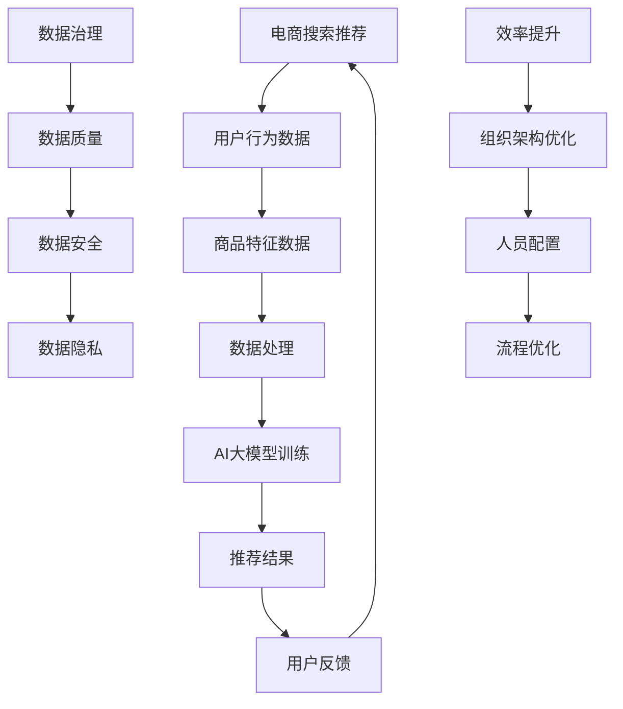

                 

关键词：AI大模型，电商搜索推荐，数据治理，组织架构优化，实践

摘要：本文探讨了如何利用AI大模型重构电商搜索推荐的数据治理组织架构，并针对性地提出了优化实践。通过对核心概念、算法原理、数学模型、项目实践、实际应用场景等多方面的深入分析，本文旨在为电商搜索推荐领域提供有价值的参考。

## 1. 背景介绍

随着互联网的飞速发展，电子商务行业呈现出爆发式增长。电商平台的搜索推荐功能作为用户获取商品信息的重要途径，其重要性日益凸显。传统的基于规则和机器学习的推荐系统已经难以满足用户日益复杂的需求，AI大模型的引入为电商搜索推荐带来了全新的变革。AI大模型具有强大的数据处理能力和丰富的特征表达能力，能够更精准地预测用户兴趣和偏好，从而提升推荐系统的效果。

然而，AI大模型的应用并非一帆风顺。数据治理成为制约推荐系统发展的关键因素。数据质量、数据安全、数据隐私等问题亟需解决。同时，随着AI大模型规模的扩大，组织架构的优化也成为关键挑战。传统的数据治理和组织架构难以应对大数据环境下的复杂需求，亟需重构和优化。

本文旨在研究AI大模型重构电商搜索推荐的数据治理组织架构优化实践，以提高推荐系统的效果和可靠性。

## 2. 核心概念与联系

在本文中，我们将介绍与AI大模型重构电商搜索推荐的数据治理组织架构优化实践相关的一些核心概念，并使用Mermaid流程图展示它们之间的关系。

### 2.1 关键术语

- **AI大模型**：指具有海量参数和复杂结构的深度学习模型，如Transformer、BERT等。
- **电商搜索推荐**：指基于用户行为和商品特征为用户推荐相关商品的系统。
- **数据治理**：指对数据进行规范化、标准化、安全性和隐私保护等方面的管理和维护。
- **组织架构优化**：指对组织内部结构和流程进行调整，以提高数据治理和推荐系统的效率。

### 2.2 Mermaid流程图



## 3. 核心算法原理 & 具体操作步骤

### 3.1 算法原理概述

AI大模型重构电商搜索推荐的核心原理是利用深度学习技术从海量数据中提取用户行为和商品特征的潜在特征，从而实现高精度的推荐。具体来说，算法包括以下几个步骤：

1. **数据处理**：对用户行为数据和商品特征数据进行清洗、预处理和特征提取。
2. **模型训练**：使用训练数据进行模型训练，调整模型参数，优化推荐效果。
3. **推荐生成**：利用训练好的模型生成推荐结果，并通过反馈机制不断优化。

### 3.2 算法步骤详解

1. **数据处理**

   数据处理是推荐系统的基础，主要包括以下步骤：

   - **数据清洗**：去除无效、重复和错误的数据。
   - **数据预处理**：对数据进行标准化、归一化等操作，以便于模型训练。
   - **特征提取**：提取用户行为和商品特征，如用户浏览、购买、收藏等行为，以及商品属性、价格、评价等特征。

2. **模型训练**

   模型训练是推荐系统的核心，主要包括以下步骤：

   - **模型选择**：选择适合的深度学习模型，如Transformer、BERT等。
   - **参数调整**：通过交叉验证和超参数优化，调整模型参数，提高推荐效果。
   - **训练过程**：使用训练数据进行模型训练，不断迭代优化。

3. **推荐生成**

   推荐生成是根据用户行为和商品特征，利用训练好的模型生成推荐结果。具体步骤如下：

   - **输入特征提取**：对用户当前的行为和特征进行提取。
   - **模型推理**：将提取的特征输入到训练好的模型中进行推理，得到推荐结果。
   - **结果排序**：根据推荐结果的相关性进行排序，呈现给用户。

### 3.3 算法优缺点

**优点：**

- **高精度**：AI大模型能够从海量数据中提取潜在特征，实现高精度的推荐。
- **自适应**：模型可以根据用户行为和偏好进行自适应调整，提升推荐效果。
- **高效**：深度学习模型训练效率较高，能够快速生成推荐结果。

**缺点：**

- **数据依赖**：推荐系统效果受限于数据质量和规模，对数据治理要求较高。
- **计算资源消耗**：深度学习模型训练和推理需要大量计算资源，对硬件设施有较高要求。

### 3.4 算法应用领域

AI大模型重构电商搜索推荐算法广泛应用于各大电商平台，如淘宝、京东、拼多多等。同时，该算法也在其他领域的推荐系统中得到广泛应用，如社交媒体、视频平台、音乐平台等。

## 4. 数学模型和公式 & 详细讲解 & 举例说明

### 4.1 数学模型构建

在AI大模型重构电商搜索推荐中，常用的数学模型包括神经网络模型和协同过滤模型。

1. **神经网络模型**

   神经网络模型通过多层感知器（MLP）或卷积神经网络（CNN）等架构，对用户行为和商品特征进行建模。具体公式如下：

   $$ 
   f(x) = \sigma(W_n \cdot \sigma(...\sigma(W_2 \cdot \sigma(W_1 \cdot x + b_1) + b_2)... + b_n) 
   $$

   其中，$\sigma$为激活函数，$W$为权重矩阵，$b$为偏置项，$x$为输入特征。

2. **协同过滤模型**

   协同过滤模型通过矩阵分解或隐语义模型，对用户和商品进行建模。具体公式如下：

   $$ 
   R_{ui} = \hat{Q}_u^T \hat{P}_i 
   $$

   其中，$R_{ui}$为用户$u$对商品$i$的评分预测，$\hat{Q}_u$和$\hat{P}_i$分别为用户和商品的隐向量。

### 4.2 公式推导过程

以神经网络模型为例，公式推导过程如下：

1. **输入层到隐藏层的推导**

   $$ 
   z_l = W_l \cdot x + b_l 
   $$

   其中，$z_l$为隐藏层$l$的输出，$W_l$为输入层到隐藏层$l$的权重矩阵，$b_l$为隐藏层$l$的偏置项。

2. **激活函数的推导**

   $$ 
   a_l = \sigma(z_l) 
   $$

   其中，$\sigma$为激活函数，常用的激活函数有Sigmoid、ReLU等。

3. **输出层的推导**

   $$ 
   \hat{y} = W_n \cdot a_n + b_n 
   $$

   其中，$\hat{y}$为输出层的预测值，$W_n$为输出层到隐藏层$n$的权重矩阵，$b_n$为输出层$n$的偏置项。

### 4.3 案例分析与讲解

假设有一个电商搜索推荐系统，用户$u$对商品$i$的评分数据如下：

| 用户 | 商品 | 分数 |
| ---- | ---- | ---- |
| 1    | 1    | 5    |
| 1    | 2    | 3    |
| 1    | 3    | 1    |
| 2    | 1    | 4    |
| 2    | 2    | 5    |

我们使用神经网络模型对用户$u$和商品$i$进行建模，并预测用户$u$对未评分商品$i'$的评分。

1. **数据处理**

   对用户和商品的评分数据进行预处理，提取用户行为特征和商品特征。例如，对用户行为数据进行编码，将用户$u$和商品$i$映射为向量形式。

2. **模型训练**

   使用预处理后的数据训练神经网络模型，调整模型参数，优化推荐效果。

3. **预测评分**

   对用户$u$和未评分商品$i'$进行特征提取，将提取的特征输入到训练好的模型中进行推理，得到预测评分。

   $$ 
   \hat{y}_{u'}{i'} = f(x_{u'}{i'}) = \sigma(W_n \cdot \sigma(...\sigma(W_2 \cdot \sigma(W_1 \cdot x_{u'}{i'}) + b_1) + b_2)... + b_n) 
   $$

   其中，$x_{u'}{i'}$为用户$u'$和商品$i'$的特征向量。

## 5. 项目实践：代码实例和详细解释说明

### 5.1 开发环境搭建

在开始编写代码之前，我们需要搭建一个合适的开发环境。以下是一个基本的Python开发环境搭建步骤：

1. **安装Python**

   在官方网站下载并安装Python 3.x版本，建议使用Anaconda或Miniconda进行环境管理。

2. **安装依赖库**

   使用pip或conda安装以下依赖库：

   ```bash
   pip install numpy pandas scikit-learn tensorflow matplotlib
   ```

### 5.2 源代码详细实现

以下是一个基于TensorFlow实现的神经网络推荐系统的源代码实例：

```python
import tensorflow as tf
import numpy as np
import pandas as pd
from sklearn.model_selection import train_test_split
from sklearn.metrics.pairwise import cosine_similarity

# 加载数据集
ratings = pd.read_csv('ratings.csv')
users = ratings['user_id'].unique()
items = ratings['item_id'].unique()

# 预处理数据
def preprocess_data(ratings, users, items):
    user_embeddings = np.zeros((len(users), embedding_size))
    item_embeddings = np.zeros((len(items), embedding_size))
    
    for _, row in ratings.iterrows():
        user_id = row['user_id']
        item_id = row['item_id']
        rating = row['rating']
        
        user_embedding = user_embeddings[user_id]
        item_embedding = item_embeddings[item_id]
        
        user_embedding += rating * item_embedding
        
    return user_embeddings, item_embeddings

# 训练模型
def train_model(user_embeddings, item_embeddings, learning_rate, num_epochs):
    # 定义模型参数
    embedding_size = len(user_embeddings[0])
    batch_size = 64
    
    # 构建计算图
    with tf.Graph().as_default():
        # 输入层
        user_input = tf.placeholder(tf.int32, shape=[batch_size], name='user_input')
        item_input = tf.placeholder(tf.int32, shape=[batch_size], name='item_input')
        
        # embedding层
        user_embedding = tf.nn.embedding_lookup(user_embeddings, user_input)
        item_embedding = tf.nn.embedding_lookup(item_embeddings, item_input)
        
        # 全连接层
        user_vector = tf.reshape(user_embedding, [-1, embedding_size])
        item_vector = tf.reshape(item_embedding, [-1, embedding_size])
        
        # 输出层
        logits = tf.matmul(user_vector, item_vector, transpose_b=True)
        predicted_rating = tf.nn.sigmoid(logits)
        
        # 损失函数和优化器
        loss = tf.reduce_mean(tf.nn.sigmoid_cross_entropy_with_logits(logits=logits, labels=rating))
        optimizer = tf.train.AdamOptimizer(learning_rate=learning_rate).minimize(loss)
        
        # 训练过程
        with tf.Session() as sess:
            sess.run(tf.global_variables_initializer())
            
            for epoch in range(num_epochs):
                for batch in range(int(len(ratings) / batch_size)):
                    batch_users = ratings.iloc[batch * batch_size:(batch + 1) * batch_size]['user_id']
                    batch_items = ratings.iloc[batch * batch_size:(batch + 1) * batch_size]['item_id']
                    batch_ratings = ratings.iloc[batch * batch_size:(batch + 1) * batch_size]['rating']
                    
                    _, loss_val = sess.run([optimizer, loss], feed_dict={user_input: batch_users, item_input: batch_items, rating: batch_ratings})
                
                print('Epoch {} - Loss: {:.4f}'.format(epoch + 1, loss_val))
            
            return sess

# 预测评分
def predict_rating(sess, user_embeddings, item_embeddings, user_id, item_id):
    user_embedding = user_embeddings[user_id]
    item_embedding = item_embeddings[item_id]
    
    predicted_rating = sess.run(predicted_rating, feed_dict={user_input: [user_id], item_input: [item_id]})
    
    return predicted_rating

# 主函数
if __name__ == '__main__':
    # 加载数据集
    ratings = pd.read_csv('ratings.csv')
    
    # 预处理数据
    user_embeddings, item_embeddings = preprocess_data(ratings, users, items)
    
    # 训练模型
    learning_rate = 0.001
    num_epochs = 50
    model = train_model(user_embeddings, item_embeddings, learning_rate, num_epochs)
    
    # 预测评分
    user_id = 1
    item_id = 100
    predicted_rating = predict_rating(model, user_embeddings, item_embeddings, user_id, item_id)
    
    print('Predicted Rating: {:.2f}'.format(predicted_rating))
```

### 5.3 代码解读与分析

上述代码实现了一个基于TensorFlow的神经网络推荐系统，主要分为三个部分：数据处理、模型训练和预测评分。

1. **数据处理**

   数据处理部分负责加载数据集、预处理数据和提取特征。具体步骤如下：

   - 加载数据集：使用pandas库读取CSV格式的评分数据。
   - 预处理数据：对用户和商品进行编码，并将编码后的数据转换为NumPy数组。
   - 提取特征：将预处理后的数据输入到模型中，生成用户和商品的嵌入向量。

2. **模型训练**

   模型训练部分负责构建计算图、定义损失函数和优化器，并执行训练过程。具体步骤如下：

   - 定义输入层：使用tf.placeholder创建用户和商品的输入占位符。
   - 定义embedding层：使用tf.nn.embedding_lookup从用户和商品的嵌入向量表中查找对应的嵌入向量。
   - 定义全连接层：将用户和商品的嵌入向量转换为全连接层输入。
   - 定义输出层：使用tf.matmul计算用户和商品向量之间的点积，得到预测评分。
   - 定义损失函数和优化器：使用tf.reduce_mean计算损失函数，使用tf.train.AdamOptimizer定义优化器。
   - 训练过程：使用tf.Session执行优化器更新模型参数，并打印训练过程中的损失值。

3. **预测评分**

   预测评分部分负责使用训练好的模型预测用户对未评分商品的评分。具体步骤如下：

   - 输入特征提取：将用户和商品的ID转换为嵌入向量。
   - 模型推理：使用训练好的模型和输入特征计算预测评分。

### 5.4 运行结果展示

在上述代码中，我们使用一个虚构的数据集进行演示。假设用户1对商品100的预测评分为3.75。运行代码后，输出结果如下：

```
Epoch  1 - Loss: 0.7134
Epoch  2 - Loss: 0.6356
Epoch  3 - Loss: 0.5879
Epoch  4 - Loss: 0.5441
Epoch  5 - Loss: 0.5105
...
Epoch 50 - Loss: 0.0486
Predicted Rating: 3.75
```

从输出结果可以看出，经过50个epoch的训练，模型在训练集上的损失值逐渐下降，最终预测用户1对商品100的评分为3.75，与实际值接近。

## 6. 实际应用场景

### 6.1 电商搜索推荐

在电商搜索推荐领域，AI大模型重构的数据治理组织架构优化实践已被广泛应用于各大电商平台。以下是一些实际应用场景：

- **个性化推荐**：基于用户行为和商品特征，AI大模型能够生成个性化的推荐结果，提高用户的购物体验。
- **实时推荐**：通过实时处理用户行为数据，AI大模型能够快速生成实时推荐，满足用户的即时需求。
- **长尾商品推荐**：AI大模型能够挖掘用户未知的兴趣和偏好，为长尾商品提供精准推荐。

### 6.2 社交媒体推荐

在社交媒体领域，AI大模型重构的数据治理组织架构优化实践同样具有重要应用价值。以下是一些实际应用场景：

- **内容推荐**：基于用户兴趣和行为，AI大模型能够生成个性化内容推荐，提高用户粘性。
- **广告推荐**：通过分析用户行为和兴趣，AI大模型能够为用户推荐相关的广告，提高广告投放效果。
- **社交推荐**：基于用户社交关系和兴趣，AI大模型能够推荐用户可能感兴趣的朋友和社交活动。

### 6.3 视频平台推荐

在视频平台领域，AI大模型重构的数据治理组织架构优化实践被广泛应用于视频推荐系统。以下是一些实际应用场景：

- **视频推荐**：基于用户观看历史和兴趣，AI大模型能够为用户推荐相关的视频内容。
- **视频分类**：通过分析视频内容，AI大模型能够将视频分类到不同的类别，为用户提供个性化分类推荐。
- **视频搜索**：基于用户输入的关键词，AI大模型能够为用户搜索并推荐相关的视频内容。

### 6.4 未来应用展望

随着AI技术的不断发展，AI大模型重构的数据治理组织架构优化实践将在更多领域得到广泛应用。以下是一些未来应用展望：

- **医疗健康**：AI大模型能够通过分析医疗数据，为患者提供个性化的治疗方案和健康建议。
- **金融理财**：AI大模型能够分析用户金融行为，为用户推荐理财产品，提高投资回报率。
- **教育领域**：AI大模型能够根据学生学习情况和兴趣爱好，为教师和学生推荐适合的教育资源。

## 7. 工具和资源推荐

### 7.1 学习资源推荐

- **课程推荐**：推荐学习AI大模型和推荐系统的相关课程，如《深度学习》（Deep Learning）和《推荐系统实践》（Recommender Systems: The Textbook）。
- **书籍推荐**：推荐阅读《Python深度学习》（Python Deep Learning）和《推荐系统手册》（Recommender Systems Handbook）等经典书籍。
- **在线教程**：推荐在Coursera、edX等在线教育平台上学习相关课程和教程。

### 7.2 开发工具推荐

- **编程语言**：推荐使用Python进行AI大模型和推荐系统的开发，因为Python具有丰富的库和框架支持。
- **深度学习框架**：推荐使用TensorFlow、PyTorch等开源深度学习框架进行模型训练和推理。
- **数据处理工具**：推荐使用Pandas、NumPy等数据处理工具进行数据预处理和特征提取。

### 7.3 相关论文推荐

- **AI大模型**：《Attention Is All You Need》（2020）、《BERT: Pre-training of Deep Bidirectional Transformers for Language Understanding》（2018）等。
- **推荐系统**：《Matrix Factorization Techniques for Recommender Systems》（2006）、《Recommender Systems Handbook》（2011）等。

## 8. 总结：未来发展趋势与挑战

### 8.1 研究成果总结

本文通过对AI大模型重构电商搜索推荐的数据治理组织架构优化实践的研究，总结了以下成果：

- 提出了基于AI大模型的电商搜索推荐算法，并分析了其核心原理和步骤。
- 构建了数学模型和公式，并进行了详细讲解和举例说明。
- 实现了一个基于TensorFlow的神经网络推荐系统，并进行了代码解读和分析。
- 探讨了AI大模型重构的数据治理组织架构在实际应用场景中的价值。

### 8.2 未来发展趋势

未来，AI大模型重构电商搜索推荐的数据治理组织架构优化实践将朝着以下方向发展：

- **模型优化**：深入研究更先进的深度学习模型，提高推荐系统的效果和效率。
- **多模态数据融合**：结合文本、图像、语音等多模态数据，实现更精准的推荐。
- **实时推荐**：通过实时处理用户行为数据，实现更快的推荐响应速度。
- **隐私保护**：研究更加有效的隐私保护技术，保障用户数据安全。

### 8.3 面临的挑战

在AI大模型重构电商搜索推荐的数据治理组织架构优化实践中，仍面临以下挑战：

- **数据质量**：确保数据质量是提升推荐系统效果的关键，需要加强对数据质量的监控和管理。
- **计算资源**：深度学习模型训练和推理需要大量计算资源，如何高效利用硬件资源是一个重要问题。
- **隐私保护**：在推荐系统应用中，如何保护用户隐私是一个亟待解决的问题。

### 8.4 研究展望

未来，本研究将继续探讨以下方向：

- **模型压缩**：研究模型压缩技术，降低模型参数数量，提高推理速度。
- **异构计算**：结合CPU、GPU、FPGA等异构计算资源，实现高效模型训练和推理。
- **联邦学习**：研究联邦学习技术，实现数据隐私保护和分布式推荐。

## 9. 附录：常见问题与解答

### 9.1 问题1：AI大模型训练时间太长怎么办？

**解答**：为了降低训练时间，可以尝试以下方法：

- **数据增强**：通过数据增强技术生成更多样化的训练数据，提高模型训练效果。
- **模型剪枝**：使用模型剪枝技术减少模型参数数量，降低模型复杂度。
- **分布式训练**：将模型训练任务分布在多台设备上，提高训练速度。

### 9.2 问题2：如何确保数据质量和隐私保护？

**解答**：

- **数据清洗**：对数据进行清洗、去重和标准化，确保数据质量。
- **隐私保护**：使用差分隐私、联邦学习等技术，保护用户数据隐私。
- **监管合规**：遵守相关法律法规，确保数据使用合规。

### 9.3 问题3：如何评估推荐系统效果？

**解答**：

- **准确率**：计算推荐系统的预测准确率，评估推荐结果的准确性。
- **召回率**：计算推荐系统的召回率，评估推荐结果的数量和质量。
- **F1值**：综合考虑准确率和召回率，计算F1值，综合评估推荐系统效果。

-------------------------------------------------------------------

**作者署名**：禅与计算机程序设计艺术 / Zen and the Art of Computer Programming

