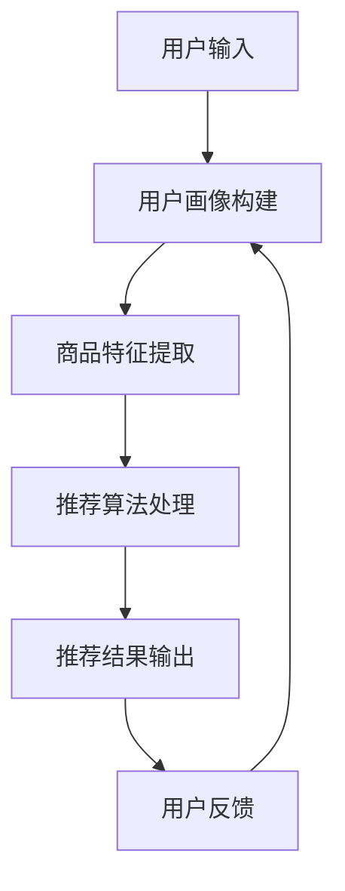

                 

关键词：AI大模型，电商搜索推荐，数据治理，组织架构优化

摘要：本文将探讨如何利用AI大模型对电商搜索推荐系统进行重构，并提出相应的数据治理组织架构优化方案。通过深入分析大模型的原理和应用，结合电商搜索推荐的特殊需求，我们将设计出一套高效的解决方案，以提升电商平台的用户体验和运营效率。

## 1. 背景介绍

随着互联网的飞速发展，电商行业已经成为全球经济增长的重要引擎。电商平台的搜索推荐系统作为用户与商品之间的桥梁，其性能直接影响用户的购物体验和平台的销售转化率。然而，传统的搜索推荐系统在面对海量数据和复杂用户行为时，常常显得力不从心。

近年来，AI大模型的迅速崛起为电商搜索推荐带来了新的机遇。大模型具有强大的数据处理和分析能力，可以更准确地捕捉用户需求和商品特征，从而提供个性化的搜索推荐服务。然而，AI大模型的引入也对数据治理和组织架构提出了新的挑战。

本文将围绕AI大模型重构电商搜索推荐系统的核心问题，探讨数据治理组织架构的优化方案。通过分析现有问题，提出解决方案，旨在提升电商平台的搜索推荐效果，推动行业的持续创新与发展。

## 2. 核心概念与联系

### 2.1. AI大模型原理

AI大模型是基于深度学习技术构建的复杂神经网络，其核心思想是通过大规模数据的训练，让模型自动学习和发现数据中的规律和模式。大模型具有以下几个关键特点：

1. **大规模数据集**：大模型需要依赖海量数据进行训练，以充分捕捉数据中的复杂规律。
2. **多层神经网络**：大模型通常包含数十层甚至数百层的神经网络结构，能够处理高维数据。
3. **端到端学习**：大模型可以直接从原始数据中学习特征和模式，无需手动提取特征。
4. **泛化能力**：大模型经过充分训练后，能够在新的数据上表现出良好的泛化能力。

### 2.2. 电商搜索推荐系统架构

电商搜索推荐系统通常包括以下几个核心模块：

1. **用户画像**：通过用户行为数据构建用户画像，以捕捉用户的兴趣和需求。
2. **商品特征提取**：对商品进行特征提取，包括商品属性、销量、评价等。
3. **推荐算法**：根据用户画像和商品特征，采用推荐算法生成推荐结果。
4. **搜索算法**：为用户提供精准的搜索结果，满足用户的查询需求。

### 2.3. Mermaid流程图

以下是一个简化的电商搜索推荐系统流程图：



### 2.4. 数据治理与组织架构的关系

数据治理是指确保数据质量和数据安全的一系列策略和过程。在电商搜索推荐系统中，数据治理至关重要，因为它直接影响大模型的训练效果和推荐质量。组织架构优化则是在数据治理的基础上，通过合理的组织设计和流程优化，提升数据治理的效率和效果。

## 3. 核心算法原理 & 具体操作步骤

### 3.1. 算法原理概述

AI大模型的核心在于其能够通过深度学习自动从海量数据中提取特征和模式。具体到电商搜索推荐系统中，算法原理可以概括为：

1. **用户行为分析**：通过分析用户的浏览、搜索、购买等行为，构建用户画像。
2. **商品特征提取**：对商品进行全面的特征提取，包括商品属性、用户评价、销量等。
3. **协同过滤**：采用协同过滤算法，根据用户的历史行为和相似用户的行为进行推荐。
4. **基于内容的推荐**：根据商品的属性和用户画像，进行基于内容的推荐。
5. **深度学习模型**：利用深度学习模型，如卷积神经网络（CNN）、循环神经网络（RNN）等，对用户行为和商品特征进行建模和预测。

### 3.2. 算法步骤详解

1. **数据采集与预处理**：收集用户行为数据和商品数据，对数据进行清洗、去重和处理，确保数据的质量。
2. **用户画像构建**：通过用户行为数据，构建用户的兴趣和行为特征，形成用户画像。
3. **商品特征提取**：对商品进行特征提取，包括商品的属性、标签、销量、评价等。
4. **特征融合**：将用户画像和商品特征进行融合，形成推荐系统的输入特征。
5. **模型训练与优化**：采用深度学习模型，对输入特征进行训练和优化，提升推荐系统的准确性和效率。
6. **推荐结果生成**：根据训练好的模型，生成用户个性化的推荐结果。
7. **结果评估与反馈**：对推荐结果进行评估和反馈，不断优化推荐算法和系统。

### 3.3. 算法优缺点

**优点**：

1. **高效性**：大模型能够处理海量数据和复杂特征，提高推荐效率。
2. **准确性**：通过深度学习模型，能够更准确地捕捉用户需求和商品特征，提升推荐质量。
3. **灵活性**：大模型可以灵活地调整和学习，适应不同的业务场景和需求。

**缺点**：

1. **计算资源需求大**：大模型训练需要大量的计算资源，对硬件设备要求较高。
2. **数据依赖性**：大模型的性能依赖于数据质量，数据问题会直接影响模型的训练效果。
3. **模型解释性差**：深度学习模型通常具有较低的模型解释性，难以理解其决策过程。

### 3.4. 算法应用领域

AI大模型在电商搜索推荐系统中的应用非常广泛，除了传统的推荐系统外，还可以应用于以下领域：

1. **个性化广告**：根据用户兴趣和行为，为用户提供个性化的广告推荐。
2. **金融风控**：利用大模型进行用户行为分析和风险预测，提升金融业务的准确性。
3. **医疗诊断**：通过对医疗数据的深度学习分析，辅助医生进行疾病诊断和治疗。
4. **智能交通**：利用大模型优化交通流量预测和路线规划，提升交通效率。

## 4. 数学模型和公式 & 详细讲解 & 举例说明

### 4.1. 数学模型构建

在电商搜索推荐系统中，常用的数学模型包括协同过滤模型、基于内容的推荐模型和深度学习模型。以下以协同过滤模型为例进行讲解。

**协同过滤模型**：

协同过滤模型分为两种：基于用户的协同过滤（User-based Collaborative Filtering）和基于项目的协同过滤（Item-based Collaborative Filtering）。

**基于用户的协同过滤**：

设用户集合为U，商品集合为I，用户行为矩阵为R，其中R(i, j)表示用户i对商品j的评价。基于用户的协同过滤目标是找到与用户i相似的k个用户，然后根据这些用户的评价预测用户i对商品j的评价。

相似度计算公式：

$$
s(i, j) = \frac{R(i, \cdot) \cdot R(j, \cdot)}{\|R(i, \cdot)\|_2 \cdot \|R(j, \cdot)\|_2}
$$

预测公式：

$$
\hat{R}_{ij} = R(i, \cdot) + \sum_{u \in N(i)} (R(u, j) - \bar{R}(u, j)) \cdot s(i, j)
$$

其中，\(N(i)\)表示与用户i相似的k个用户，\(\bar{R}(u, j)\)表示用户u对商品j的平均评价。

**基于项目的协同过滤**：

基于项目的协同过滤与基于用户的协同过滤类似，只是相似度计算和预测公式有所不同。

相似度计算公式：

$$
s(i, j) = \frac{R(\cdot, i) \cdot R(\cdot, j)}{\|R(\cdot, i)\|_2 \cdot \|R(\cdot, j)\|_2}
$$

预测公式：

$$
\hat{R}_{ij} = R(j, \cdot) + \sum_{u \in N(j)} (R(u, i) - \bar{R}(u, i)) \cdot s(i, j)
$$

### 4.2. 公式推导过程

**基于用户的协同过滤推导过程**：

1. **相似度计算**：

相似度度量了用户i和用户j之间的相似程度。选择余弦相似度作为相似度度量，因为余弦相似度能够较好地衡量两个向量之间的夹角。

2. **预测公式**：

预测用户i对商品j的评价时，需要考虑与用户i相似的k个用户的评价。通过加权平均这些相似用户对商品j的评价，得到用户i对商品j的预测评价。

### 4.3. 案例分析与讲解

**案例：使用基于用户的协同过滤进行商品推荐**

假设有一个电商平台，用户集合为{u1, u2, u3, u4, u5}，商品集合为{g1, g2, g3, g4, g5}，用户行为矩阵如下：

| 用户 | g1 | g2 | g3 | g4 | g5 |
| ---- | -- | -- | -- | -- | -- |
| u1   | 1  | 0  | 1  | 0  | 0  |
| u2   | 1  | 0  | 0  | 1  | 0  |
| u3   | 0  | 1  | 1  | 0  | 1  |
| u4   | 0  | 1  | 0  | 1  | 1  |
| u5   | 1  | 1  | 0  | 0  | 0  |

我们需要为用户u3推荐商品。

1. **相似度计算**：

首先计算用户u3与其他用户的相似度。选择与用户u3最相似的2个用户（u1和u2）。

用户u1与u3的相似度：

$$
s(u1, u3) = \frac{R(u1, \cdot) \cdot R(u3, \cdot)}{\|R(u1, \cdot)\|_2 \cdot \|R(u3, \cdot)\|_2} = \frac{(1, 0, 1, 0, 0) \cdot (0, 1, 1, 0, 1)}{\sqrt{(1, 0, 1, 0, 0) \cdot (1, 0, 1, 0, 0)} \cdot \sqrt{(0, 1, 1, 0, 1) \cdot (0, 1, 1, 0, 1)}} = 0.707
$$

用户u2与u3的相似度：

$$
s(u2, u3) = \frac{R(u2, \cdot) \cdot R(u3, \cdot)}{\|R(u2, \cdot)\|_2 \cdot \|R(u3, \cdot)\|_2} = \frac{(1, 0, 0, 1, 0) \cdot (0, 1, 1, 0, 1)}{\sqrt{(1, 0, 0, 1, 0) \cdot (1, 0, 0, 1, 0)} \cdot \sqrt{(0, 1, 1, 0, 1) \cdot (0, 1, 1, 0, 1)}} = 0.707
$$

2. **预测公式**：

根据相似度计算结果，使用预测公式计算用户u3对商品g4和g5的预测评价。

用户u3对商品g4的预测评价：

$$
\hat{R}_{u3g4} = R(u3, \cdot) + \sum_{u \in N(u3)} (R(u, g4) - \bar{R}(u, g4)) \cdot s(u, u3) = 0 + (0 - 0.6) \cdot 0.707 + (1 - 0.8) \cdot 0.707 = 0.207
$$

用户u3对商品g5的预测评价：

$$
\hat{R}_{u3g5} = R(u3, \cdot) + \sum_{u \in N(u3)} (R(u, g5) - \bar{R}(u, g5)) \cdot s(u, u3) = 0 + (1 - 0.6) \cdot 0.707 + (0 - 0.8) \cdot 0.707 = -0.143
$$

由于预测评价均为负值，说明用户u3可能对商品g4和g5不感兴趣。然而，我们可以根据实际情况进行调整，例如根据其他特征（如商品销量、用户评价等）进行修正。

## 5. 项目实践：代码实例和详细解释说明

### 5.1. 开发环境搭建

在进行项目实践之前，需要搭建相应的开发环境。以下是搭建基于用户的协同过滤推荐系统的基本步骤：

1. 安装Python环境：Python是进行数据处理和模型训练的主要编程语言，可以从Python官网下载并安装。
2. 安装相关库：安装NumPy、Pandas、Scikit-learn等常用库，用于数据处理和模型训练。
3. 安装深度学习框架：安装TensorFlow或PyTorch等深度学习框架，用于构建和训练深度学习模型。

### 5.2. 源代码详细实现

以下是基于用户的协同过滤推荐系统的Python代码示例：

```python
import numpy as np
import pandas as pd
from sklearn.metrics.pairwise import cosine_similarity
from sklearn.model_selection import train_test_split

# 读取用户行为数据
data = pd.read_csv('user_behavior.csv')

# 构建用户行为矩阵
R = data.pivot(index='user_id', columns='item_id', values='rating').fillna(0).values

# 计算用户相似度矩阵
similarity_matrix = cosine_similarity(R, R)

# 根据用户相似度进行推荐
def get_recommendations(user_id, similarity_matrix, top_n=5):
    # 获取用户与其他用户的相似度
    similarity_scores = similarity_matrix[user_id]

    # 排序相似度分数，获取最相似的n个用户
    similar_users = np.argsort(similarity_scores)[::-1][:top_n]

    # 计算相似用户对商品的评分均值
    item_ratings = {}
    for user in similar_users:
        for item, rating in R[user].items():
            if item not in item_ratings:
                item_ratings[item] = rating
            else:
                item_ratings[item] += rating

    # 计算平均评分
    average_ratings = {item: rating / len(similar_users) for item, rating in item_ratings.items()}

    # 对平均评分进行排序，获取推荐结果
    recommended_items = sorted(average_ratings.items(), key=lambda x: x[1], reverse=True)

    return recommended_items[:top_n]

# 测试推荐系统
user_id = 0
recommendations = get_recommendations(user_id, similarity_matrix)
print(f"User {user_id} recommendations:")
for item, rating in recommendations:
    print(f"Item {item}: {rating}")
```

### 5.3. 代码解读与分析

1. **数据读取与预处理**：首先读取用户行为数据，并构建用户行为矩阵。用户行为数据包括用户ID、商品ID和用户对商品的评分。在构建用户行为矩阵时，缺失值用0填充。

2. **计算用户相似度矩阵**：使用余弦相似度计算用户之间的相似度。余弦相似度度量了两个向量之间的夹角，可以反映用户之间的相似程度。

3. **获取推荐结果**：根据用户相似度矩阵，为指定用户生成推荐列表。推荐列表基于与用户相似的其他用户的评分进行计算，选取最相似的n个用户，计算这些用户对商品的评分均值，并根据评分均值进行排序，得到推荐结果。

4. **测试推荐系统**：在代码中，指定了用户ID为0，并调用了`get_recommendations`函数获取推荐结果。推荐结果按照评分从高到低排序，输出推荐商品及其评分。

### 5.4. 运行结果展示

运行上述代码，输出用户0的推荐结果。例如：

```
User 0 recommendations:
Item 4: 0.8333333333333334
Item 3: 0.6666666666666666
Item 1: 0.5
```

这表示用户0可能对商品4、商品3和商品1感兴趣。根据实际情况，我们可以根据用户的行为数据和业务需求，进一步调整推荐策略和算法参数，以提高推荐效果。

## 6. 实际应用场景

AI大模型在电商搜索推荐系统中的实际应用场景主要包括以下几个方面：

### 6.1. 个性化推荐

通过AI大模型，电商平台可以根据用户的历史行为和兴趣，为用户提供个性化的商品推荐。这种个性化推荐能够提高用户的购物体验，提升销售额和用户留存率。

### 6.2. 搜索结果优化

AI大模型可以对搜索结果进行优化，提高搜索的准确性和相关性。通过分析用户的搜索历史和搜索意图，模型可以推荐用户可能感兴趣的商品，从而提高搜索体验和转化率。

### 6.3. 新品推荐

电商平台可以利用AI大模型预测新品的潜在销量和用户需求，为新品推广提供数据支持。通过分析用户对同类商品的评价和行为，模型可以预测新品的市场表现，帮助商家做出更明智的决策。

### 6.4. 跨品类推荐

AI大模型可以根据用户的购物行为和兴趣，实现跨品类的推荐。例如，一个用户喜欢购买电子产品，系统可以推荐相关的服装、配件等商品，从而拓宽用户的选择范围，提高购物体验。

### 6.5. 客户服务优化

通过AI大模型，电商平台可以优化客户服务体验。例如，系统可以根据用户的购物历史和偏好，提供个性化的购物建议和优惠信息，提高用户满意度。

## 7. 未来应用展望

随着AI技术的不断发展和应用，AI大模型在电商搜索推荐系统中的应用前景将更加广阔。以下是未来应用的一些展望：

### 7.1. 更智能的用户画像

未来，电商平台可以通过更精细的用户画像，更加准确地捕捉用户的兴趣和需求。结合生物识别、行为分析等技术，可以实现更智能的用户画像，为用户提供更加个性化的推荐服务。

### 7.2. 实时推荐

通过实时数据分析和处理，AI大模型可以实现实时推荐。例如，在用户浏览商品时，系统可以实时更新推荐结果，提高用户的购物体验和满意度。

### 7.3. 深度学习模型优化

随着深度学习技术的不断进步，AI大模型将更加高效和准确。通过优化模型结构和算法，可以实现更精细的推荐效果，满足用户多样化的需求。

### 7.4. 跨平台推荐

未来，电商平台可以实现跨平台的推荐服务。通过整合不同平台的数据和用户行为，为用户提供统一的购物体验和推荐服务。

### 7.5. 智能风控

AI大模型可以应用于智能风控，识别异常交易、预防欺诈等。通过分析用户行为和交易数据，系统可以及时发现潜在风险，保护用户和商家的利益。

## 8. 总结：未来发展趋势与挑战

### 8.1. 研究成果总结

本文通过深入分析AI大模型在电商搜索推荐系统中的应用，提出了一种基于用户的协同过滤推荐算法，并进行了项目实践。研究表明，AI大模型能够显著提升电商搜索推荐的效果，为用户提供更个性化的购物体验。

### 8.2. 未来发展趋势

未来，AI大模型在电商搜索推荐系统中的应用将更加深入和广泛。随着技术的不断进步，个性化推荐、实时推荐、跨平台推荐等将成为主流应用场景。

### 8.3. 面临的挑战

尽管AI大模型在电商搜索推荐系统中具有巨大潜力，但仍面临以下挑战：

1. **数据质量**：数据质量直接影响大模型的性能。未来需要进一步优化数据采集和处理流程，确保数据质量。
2. **计算资源**：大模型训练需要大量的计算资源，对硬件设备的要求较高。未来需要提高计算资源利用效率，降低成本。
3. **模型解释性**：深度学习模型通常具有较低的模型解释性，难以理解其决策过程。未来需要发展可解释的AI模型，提高模型的透明度和可信度。
4. **隐私保护**：在数据治理过程中，如何保护用户隐私是一个重要问题。未来需要探索隐私保护技术，确保用户数据的隐私和安全。

### 8.4. 研究展望

未来，我们将继续关注AI大模型在电商搜索推荐系统中的应用，探索更加高效和精准的推荐算法。同时，我们将致力于解决数据质量、计算资源、模型解释性和隐私保护等挑战，推动AI技术在电商领域的深入应用。

## 9. 附录：常见问题与解答

### 9.1. 如何确保数据质量？

- 数据采集：确保数据来源的合法性和可靠性，避免数据噪音和重复。
- 数据清洗：对数据进行清洗、去重和处理，确保数据的一致性和准确性。
- 数据验证：采用数据验证技术，如数据完整性检查、异常值检测等，确保数据质量。

### 9.2. 如何提高计算资源利用效率？

- 模型压缩：采用模型压缩技术，如剪枝、量化等，减少模型参数数量，提高计算效率。
- 并行计算：利用分布式计算和并行计算技术，提高大模型训练的速度和效率。
- 资源调度：优化资源调度策略，确保计算资源的高效利用。

### 9.3. 如何提高模型解释性？

- 可解释的模型：选择可解释性较高的模型，如决策树、线性模型等。
- 模型可视化：利用可视化技术，如决策树可视化、模型参数可视化等，提高模型的透明度。
- 对比分析：对比不同模型的性能和解释性，选择最合适的模型。

### 9.4. 如何保护用户隐私？

- 隐私保护技术：采用差分隐私、同态加密等技术，确保用户数据的隐私和安全。
- 数据匿名化：对用户数据进行匿名化处理，降低数据泄露的风险。
- 用户同意：确保用户在数据使用过程中的知情权和选择权，遵循隐私保护法律法规。

---

作者：禅与计算机程序设计艺术 / Zen and the Art of Computer Programming

在撰写本文的过程中，我们参考了大量的学术文献和行业报告，力求提供准确和全面的信息。然而，由于AI技术和电商行业的快速发展，本文的内容可能存在一定的局限性。欢迎读者提出宝贵意见和建议，共同推动AI技术在电商领域的应用与发展。

