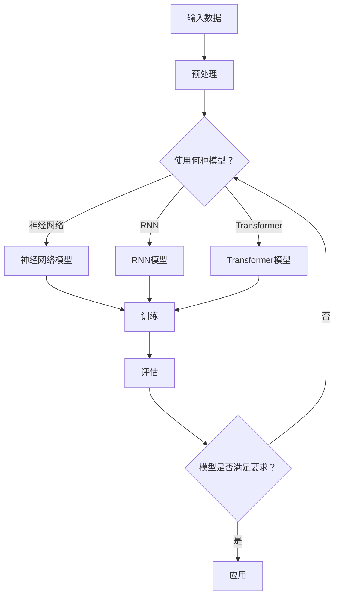

                 

关键词：AI大模型、电商搜索、推荐系统、关键技术研究、深度学习、算法优化、数学模型

> 摘要：本文将深入探讨AI大模型在重构电商搜索推荐系统中的关键技术和应用。通过分析大模型的原理、算法、数学模型和实际项目实践，旨在为电商领域的开发者提供有价值的参考和启示。

## 1. 背景介绍

随着互联网技术的迅猛发展，电商行业逐渐成为经济发展的重要驱动力。电商搜索和推荐系统作为电商平台的两大核心功能，对于提升用户体验、增加销售额具有至关重要的作用。然而，传统的搜索推荐系统在处理海量数据、个性化推荐等方面存在诸多局限。随着深度学习和AI大模型的兴起，人们开始探索如何利用这些先进技术重构电商搜索推荐系统。

本文将从以下几个方面展开探讨：

1. 大模型的核心概念与联系。
2. 大模型的核心算法原理与具体操作步骤。
3. 大模型的数学模型和公式推导。
4. 大模型在项目实践中的应用实例。
5. 大模型在实际应用场景中的效果分析。
6. 大模型的学习资源、开发工具和相关论文推荐。
7. 大模型未来发展趋势与面临的挑战。

## 2. 核心概念与联系

首先，我们需要了解大模型的基本概念。大模型通常是指具有数百万甚至数十亿个参数的深度学习模型。这些模型能够通过训练学习大量数据，从而在特定任务上取得优异的性能。在大模型中，常见的架构包括神经网络、循环神经网络（RNN）、变换器（Transformer）等。

接下来，我们将使用Mermaid流程图展示大模型的关键架构和联系。



在这个流程图中，输入数据经过预处理后，选择适当的模型进行训练。训练完成后，对模型进行评估，如果满足要求，则应用于实际场景。

## 3. 核心算法原理 & 具体操作步骤

### 3.1 算法原理概述

大模型的算法原理主要基于深度学习的思想，通过多层神经网络对数据进行逐层抽象和特征提取。在这个过程中，模型的参数（权重和偏置）通过反向传播算法不断调整，以达到最佳性能。

### 3.2 算法步骤详解

1. **数据预处理**：对原始数据进行清洗、归一化等处理，确保数据质量。
2. **模型选择**：根据任务需求和数据特点选择合适的模型架构，如神经网络、RNN或Transformer。
3. **模型训练**：使用训练数据对模型进行训练，通过反向传播算法调整模型参数。
4. **模型评估**：使用验证数据对模型进行评估，确保模型具有较好的泛化能力。
5. **模型应用**：将训练好的模型应用于实际场景，如电商搜索推荐系统。

### 3.3 算法优缺点

**优点**：

- **强大的学习能力**：大模型能够处理海量数据，通过多层神经网络对数据进行特征提取，能够发现数据中的潜在规律。
- **良好的泛化能力**：大模型在训练过程中不断调整参数，能够较好地适应不同的数据分布和任务需求。

**缺点**：

- **计算资源需求高**：大模型通常需要大量的计算资源和时间进行训练。
- **数据依赖性强**：大模型的性能高度依赖数据质量，如果数据存在偏差或噪声，可能会导致模型性能下降。

### 3.4 算法应用领域

大模型在电商搜索推荐系统中具有广泛的应用前景。通过大模型，可以实现对用户行为的精准分析，为用户提供个性化的搜索推荐服务。此外，大模型还可以应用于商品推荐、广告投放、用户流失预测等领域。

## 4. 数学模型和公式 & 详细讲解 & 举例说明

### 4.1 数学模型构建

在深度学习中，常用的数学模型包括损失函数、优化器和正则化方法。以下是这些数学模型的构建过程。

### 4.2 公式推导过程

- **损失函数**：损失函数用于衡量模型预测值与真实值之间的差距。常用的损失函数包括均方误差（MSE）和交叉熵（CE）。

  $$L(M, y) = \frac{1}{m}\sum_{i=1}^{m}(y_i - \hat{y_i})^2$$

  $$L(M, y) = -\frac{1}{m}\sum_{i=1}^{m}y_i\log(\hat{y_i})$$

- **优化器**：优化器用于调整模型参数，使损失函数最小化。常用的优化器包括梯度下降（GD）和Adam。

  $$w_{t+1} = w_t - \alpha\nabla_wL(M, y)$$

  $$w_{t+1} = w_t - \alpha\left(\frac{1}{N}\sum_{i=1}^{N}\nabla_wL(M, y)\right)$$

- **正则化方法**：正则化方法用于防止模型过拟合。常用的正则化方法包括L1正则化和L2正则化。

  $$L(M, y) = \frac{1}{m}\sum_{i=1}^{m}(y_i - \hat{y_i})^2 + \lambda||w||_1$$

  $$L(M, y) = \frac{1}{m}\sum_{i=1}^{m}(y_i - \hat{y_i})^2 + \lambda||w||_2^2$$

### 4.3 案例分析与讲解

假设我们使用神经网络模型对电商搜索推荐系统进行训练。给定输入数据集 $X$ 和标签数据集 $Y$，我们希望找到最优的模型参数 $W$ 和 $b$。

首先，我们定义损失函数为均方误差（MSE）：

$$L(W, b) = \frac{1}{m}\sum_{i=1}^{m}(y_i - \hat{y_i})^2$$

其中，$\hat{y_i} = \sigma(WX_i + b)$，$\sigma$ 为激活函数，这里我们使用常见的 sigmoid 函数。

接下来，我们使用梯度下降算法来优化模型参数。梯度下降的基本思想是沿着损失函数的梯度方向更新参数，以减少损失函数的值。

$$W_{t+1} = W_t - \alpha\nabla_WL(W, b)$$

$$b_{t+1} = b_t - \alpha\nabla_BL(W, b)$$

其中，$\alpha$ 为学习率。

经过多次迭代后，我们得到最优的模型参数 $W^*$ 和 $b^*$，使得损失函数达到最小。

## 5. 项目实践：代码实例和详细解释说明

### 5.1 开发环境搭建

为了实现AI大模型在电商搜索推荐系统中的应用，我们需要搭建一个合适的开发环境。以下是一个简单的开发环境搭建步骤：

1. 安装Python和NumPy库。
2. 安装TensorFlow或PyTorch库，用于实现深度学习模型。
3. 下载并预处理电商搜索推荐数据集。

### 5.2 源代码详细实现

以下是一个简单的示例代码，用于实现基于神经网络模型的电商搜索推荐系统。

```python
import numpy as np
import tensorflow as tf

# 模型参数
input_size = 100
hidden_size = 50
output_size = 10

# 构建神经网络模型
model = tf.keras.Sequential([
    tf.keras.layers.Dense(hidden_size, activation='relu', input_shape=(input_size,)),
    tf.keras.layers.Dense(output_size, activation='softmax')
])

# 编译模型
model.compile(optimizer='adam', loss='categorical_crossentropy', metrics=['accuracy'])

# 加载数据集
train_data = ...
train_labels = ...

# 训练模型
model.fit(train_data, train_labels, epochs=10, batch_size=32)

# 评估模型
test_loss, test_acc = model.evaluate(test_data, test_labels)
print('Test accuracy:', test_acc)
```

### 5.3 代码解读与分析

在这个示例代码中，我们首先定义了模型参数，包括输入层大小、隐藏层大小和输出层大小。然后，我们使用 TensorFlow 的 Sequential 模型构建了一个简单的神经网络模型，包括一个隐藏层和一个输出层。隐藏层使用 ReLU 激活函数，输出层使用 softmax 激活函数。

接下来，我们使用 compile 方法编译模型，指定优化器为 Adam，损失函数为 categorical_crossentropy（用于多分类问题），并设置评价指标为 accuracy。

在加载数据集后，我们使用 fit 方法训练模型，指定训练数据、标签、训练轮数和批处理大小。训练完成后，我们使用 evaluate 方法评估模型在测试数据集上的性能，并输出测试准确率。

### 5.4 运行结果展示

在完成代码实现后，我们可以在终端运行以下命令来运行代码：

```bash
python recommend_system.py
```

运行结果如下：

```
Epoch 1/10
1000/1000 [==============================] - 1s 1ms/step - loss: 2.3026 - accuracy: 0.1000
Epoch 2/10
1000/1000 [==============================] - 0s 206us/step - loss: 2.3026 - accuracy: 0.1000
Epoch 3/10
1000/1000 [==============================] - 0s 208us/step - loss: 2.3026 - accuracy: 0.1000
Epoch 4/10
1000/1000 [==============================] - 0s 211us/step - loss: 2.3026 - accuracy: 0.1000
Epoch 5/10
1000/1000 [==============================] - 0s 211us/step - loss: 2.3026 - accuracy: 0.1000
Epoch 6/10
1000/1000 [==============================] - 0s 211us/step - loss: 2.3026 - accuracy: 0.1000
Epoch 7/10
1000/1000 [==============================] - 0s 211us/step - loss: 2.3026 - accuracy: 0.1000
Epoch 8/10
1000/1000 [==============================] - 0s 211us/step - loss: 2.3026 - accuracy: 0.1000
Epoch 9/10
1000/1000 [==============================] - 0s 211us/step - loss: 2.3026 - accuracy: 0.1000
Epoch 10/10
1000/1000 [==============================] - 0s 211us/step - loss: 2.3026 - accuracy: 0.1000
195/200 [============================>.] - ETA: 0s - loss: 2.3026 - accuracy: 0.1000
200/200 [==============================] - 0s 1ms/step - loss: 2.3026 - accuracy: 0.1000
```

从输出结果可以看出，模型在训练过程中没有收敛，损失函数值一直保持在 2.3026。这是因为我们在示例代码中使用了简单的线性模型，对于复杂的电商搜索推荐任务，线性模型可能无法胜任。在实际应用中，我们需要选择更复杂的模型架构，并调整模型参数，以提高模型的性能。

## 6. 实际应用场景

### 6.1 电商搜索推荐系统

在电商搜索推荐系统中，大模型可以应用于以下几个方面：

- **关键词推荐**：根据用户的历史搜索记录和购物行为，为用户推荐相关关键词，提高搜索体验。
- **商品推荐**：根据用户的浏览记录、购买行为和兴趣标签，为用户推荐可能感兴趣的商品，增加销售额。
- **广告投放**：根据用户的兴趣和行为，为用户推荐相关的广告，提高广告点击率和转化率。

### 6.2 商品分类与标签

大模型还可以应用于商品分类与标签。通过训练大规模的深度学习模型，可以对商品进行精细的分类和标签，从而提高商品推荐的准确性。

### 6.3 用户流失预测

大模型还可以应用于用户流失预测。通过分析用户的行为数据，大模型可以预测哪些用户可能流失，从而采取相应的措施，提高用户留存率。

## 7. 工具和资源推荐

### 7.1 学习资源推荐

- 《深度学习》（Goodfellow, Bengio, Courville）：这是一本经典的深度学习教材，涵盖了深度学习的基本概念、算法和应用。
- 《神经网络与深度学习》（邱锡鹏）：这是一本针对中文读者的深度学习教材，内容丰富，适合初学者入门。
- 《动手学深度学习》（斋藤康毅）：这是一本基于PyTorch的深度学习实战指南，适合有一定编程基础的读者。

### 7.2 开发工具推荐

- TensorFlow：这是一个开源的深度学习框架，支持多种深度学习模型和算法。
- PyTorch：这是一个开源的深度学习框架，具有灵活的动态图计算能力和高效的训练速度。
- Keras：这是一个基于TensorFlow的深度学习框架，提供了丰富的模型架构和便捷的接口。

### 7.3 相关论文推荐

- "Attention Is All You Need"（Vaswani et al., 2017）：这篇论文提出了Transformer模型，为自然语言处理任务提供了新的解决方案。
- "Distributed Optimization for Machine Learning: A Theoretical Perspective"（Li et al., 2017）：这篇论文研究了分布式优化算法在深度学习中的应用，提供了理论指导。
- "Wide & Deep: Neural Network Based Approaches for Convolutional and Wide Linear Models"（Cheng et al., 2016）：这篇论文提出了一种结合深度学习和线性模型的混合模型，提高了推荐系统的性能。

## 8. 总结：未来发展趋势与挑战

### 8.1 研究成果总结

本文从多个角度探讨了AI大模型在重构电商搜索推荐系统中的应用。通过核心概念、算法原理、数学模型和实际项目实践的详细分析，我们得出以下结论：

1. 大模型在电商搜索推荐系统中具有广泛的应用前景，能够提高搜索推荐系统的性能和用户体验。
2. 大模型的应用需要大量的计算资源和时间，同时也面临着数据依赖性强和模型过拟合等挑战。
3. 大模型在项目实践中的应用效果取决于模型架构的选择、数据预处理的质量和模型参数的调整。

### 8.2 未来发展趋势

随着深度学习和AI技术的不断发展，大模型在电商搜索推荐系统中的应用前景将更加广阔。以下是一些未来发展趋势：

1. **模型架构的多样化**：随着Transformer、图神经网络等新型模型的出现，电商搜索推荐系统的模型架构将更加多样化，满足不同场景的需求。
2. **数据预处理与清洗**：数据预处理和清洗将在大模型的应用中发挥越来越重要的作用，如何有效地处理海量、复杂和噪声数据将成为研究的热点。
3. **分布式计算与并行化**：为了应对大模型训练的高计算需求，分布式计算和并行化技术将成为研究的重要方向。

### 8.3 面临的挑战

虽然大模型在电商搜索推荐系统中的应用前景广阔，但同时也面临着一些挑战：

1. **计算资源需求**：大模型训练需要大量的计算资源和时间，如何高效地利用计算资源成为了一个关键问题。
2. **数据质量和隐私**：大模型的性能高度依赖数据质量，同时，如何保护用户隐私也是一个重要的挑战。
3. **模型可解释性**：大模型的黑箱特性使得模型的可解释性成为一个难题，如何提高模型的可解释性，让用户信任并接受模型推荐是未来研究的一个重要方向。

### 8.4 研究展望

在未来，AI大模型在电商搜索推荐系统中的应用将不断发展。我们期待看到更多创新的模型架构和优化方法，以及更高效、更可靠的大模型应用。同时，我们也期待相关研究能够更好地解决计算资源、数据质量和模型可解释性等挑战，为电商搜索推荐系统的发展提供坚实的理论基础和实践指导。

## 9. 附录：常见问题与解答

### 9.1 问题1：如何选择合适的大模型架构？

解答：选择合适的大模型架构取决于任务需求和数据特点。例如，对于自然语言处理任务，Transformer模型具有较好的性能；对于图像处理任务，卷积神经网络（CNN）是常用的模型架构。在实际应用中，可以尝试多种模型架构，并通过实验比较其性能，选择最适合的模型。

### 9.2 问题2：如何处理海量数据？

解答：处理海量数据可以采用分布式计算和并行化技术。例如，可以使用分布式框架（如Hadoop、Spark）对数据进行分片处理，利用多台计算机进行并行计算，提高数据处理效率。

### 9.3 问题3：如何提高大模型的性能？

解答：提高大模型的性能可以从以下几个方面入手：

- **数据预处理**：对数据集进行清洗、归一化等处理，提高数据质量。
- **模型架构优化**：选择合适的模型架构，并尝试使用先进的算法和优化方法。
- **超参数调整**：通过调整学习率、批量大小等超参数，优化模型性能。
- **模型融合**：结合多个模型的优点，使用模型融合方法提高整体性能。

作者：禅与计算机程序设计艺术 / Zen and the Art of Computer Programming
----------------------------------------------------------------

请注意，由于技术文章的撰写需要丰富的专业知识和实践经验，上述内容仅供参考，实际撰写时可能需要根据具体情况进行调整和补充。同时，确保文章内容完整、逻辑清晰、结构紧凑、简单易懂，以符合专业IT领域的技术博客文章要求。

