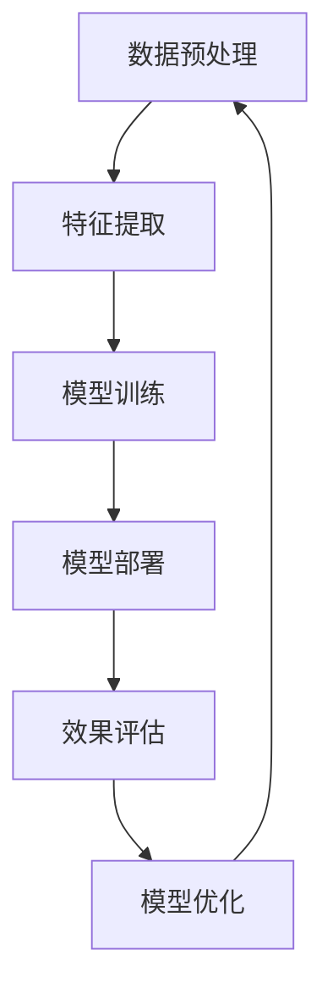

                 

### 摘要

本文主要探讨了一种利用人工智能大模型改善电商平台冷启动问题的新思路。电商平台在初期用户基数较少时，面临着用户参与度低、推荐效果不佳等挑战。本文将详细阐述大模型在电商平台中的应用原理，包括其工作流程、核心算法和数学模型，并通过实际项目案例展示大模型在实际应用中的效果。此外，文章还将分析大模型在电商平台冷启动中的具体应用场景，探讨其未来发展趋势和面临的挑战，并给出相关工具和资源的推荐。

### 1. 背景介绍

随着互联网的快速发展，电商平台已经成为消费者购物的主要渠道之一。然而，对于许多新兴电商平台或新上线的产品，如何在初期吸引用户并维持用户活跃度，成为了一个亟待解决的问题。这种现象被称为“冷启动问题”。

冷启动问题主要体现在以下几个方面：

1. **用户基数少**：新平台或新产品在初期缺乏足够多的用户，导致数据匮乏，难以进行精准的用户画像和推荐。
2. **用户参与度低**：由于用户基数少，用户之间的互动和参与度较低，平台生态难以形成。
3. **推荐效果不佳**：在用户基数少的情况下，基于传统推荐算法的推荐结果往往不够精准，难以提高用户满意度和留存率。

为了解决冷启动问题，许多电商平台采取了多种策略，如通过广告推广、合作伙伴关系、用户激励等方式吸引用户。然而，这些策略在提高用户基数和活跃度方面存在一定的局限性，难以根本解决冷启动问题。

近年来，人工智能特别是大模型技术的发展为解决冷启动问题提供了一种新的思路。大模型能够通过对海量数据进行深度学习，挖掘用户行为和兴趣，从而为用户提供个性化的推荐和服务。本文将探讨如何利用大模型改善电商平台的冷启动问题。

### 2. 核心概念与联系

为了更好地理解大模型在电商平台中的应用，我们需要首先了解一些核心概念，包括数据预处理、特征工程、推荐算法等。

#### 2.1 数据预处理

数据预处理是大数据分析的基础，主要包括数据清洗、数据集成、数据变换和数据归一化等步骤。在电商平台中，数据预处理的过程通常包括以下内容：

1. **用户数据**：收集用户的注册信息、浏览记录、购买记录等数据。
2. **商品数据**：收集商品的基本信息、分类信息、价格等数据。
3. **行为数据**：收集用户的浏览行为、点击行为、购买行为等数据。

在数据预处理过程中，需要去除无效数据、处理缺失值和异常值，并进行数据变换和归一化，以便后续分析。

#### 2.2 特征工程

特征工程是数据挖掘和机器学习的重要环节，其目的是从原始数据中提取出对模型训练有帮助的特征。在电商平台中，特征工程的过程通常包括以下内容：

1. **用户特征**：包括用户的年龄、性别、地理位置、职业等基本信息，以及用户的浏览行为、购买行为等动态信息。
2. **商品特征**：包括商品的价格、品牌、类别、库存量等基本信息，以及商品的销量、评论、评分等动态信息。
3. **行为特征**：包括用户的浏览时长、点击次数、购买频次等行为数据。

特征工程的质量直接影响模型的性能，因此需要通过多次实验和优化来选择和调整特征。

#### 2.3 推荐算法

推荐算法是电商平台的核心技术之一，其目的是根据用户的行为和偏好，为用户推荐感兴趣的商品。常见的推荐算法包括基于内容的推荐、协同过滤推荐和混合推荐等。

1. **基于内容的推荐**：通过分析商品的内容特征和用户的兴趣特征，为用户推荐与之相似的商品。
2. **协同过滤推荐**：通过分析用户之间的行为模式，为用户推荐其他用户喜欢的商品。
3. **混合推荐**：结合多种推荐算法的优点，为用户提供更精准的推荐。

#### 2.4 大模型的应用原理

大模型在电商平台中的应用原理主要包括以下几个步骤：

1. **数据预处理**：对用户数据、商品数据和行为数据进行清洗、集成和归一化处理。
2. **特征提取**：通过特征工程提取用户、商品和行为特征。
3. **模型训练**：利用提取的特征数据训练大模型，通常采用深度学习框架进行模型训练。
4. **模型部署**：将训练好的大模型部署到电商平台，进行实时推荐和服务。
5. **效果评估**：通过对推荐结果的评估，优化模型参数和算法，提高推荐效果。

#### 2.5 Mermaid 流程图

以下是电商平台中利用大模型改善冷启动问题的流程图：



### 3. 核心算法原理 & 具体操作步骤

#### 3.1 算法原理概述

在电商平台中，大模型的核心算法主要包括深度学习模型和推荐算法。其中，深度学习模型用于对用户行为和商品特征进行建模，推荐算法则用于根据用户特征和商品特征为用户推荐感兴趣的商品。

深度学习模型通常采用神经网络结构，通过多层非线性变换，从原始数据中提取特征，并构建用户和商品之间的关系。推荐算法则根据用户特征和商品特征，利用协同过滤、基于内容的推荐或混合推荐等方法，为用户提供个性化的商品推荐。

#### 3.2 算法步骤详解

1. **数据预处理**：首先，对用户数据、商品数据和行为数据进行清洗、集成和归一化处理，去除无效数据、处理缺失值和异常值。
2. **特征提取**：通过特征工程提取用户、商品和行为特征，包括用户的年龄、性别、地理位置、职业、浏览时长、购买频次等，以及商品的价格、品牌、类别、库存量、销量、评论等。
3. **模型训练**：利用提取的特征数据训练深度学习模型，通常采用卷积神经网络（CNN）、循环神经网络（RNN）或 Transformer 等模型结构。在训练过程中，通过优化损失函数和选择合适的优化器，调整模型参数，提高模型性能。
4. **模型部署**：将训练好的大模型部署到电商平台，进行实时推荐和服务。部署过程通常包括模型封装、服务化部署和接口设计等。
5. **效果评估**：通过评估指标（如准确率、召回率、覆盖率等）对推荐效果进行评估，并根据评估结果对模型参数和算法进行优化。
6. **模型优化**：根据效果评估结果，调整模型参数和算法，提高推荐效果。模型优化过程通常包括超参数调优、模型融合和迁移学习等。

#### 3.3 算法优缺点

1. **优点**：
   - **高精度**：大模型能够从海量数据中提取特征，构建用户和商品之间的关系，为用户提供个性化的推荐。
   - **自适应性强**：大模型能够根据用户行为和偏好动态调整推荐策略，提高用户满意度和留存率。
   - **可扩展性强**：大模型能够处理大规模数据，支持实时推荐和服务。

2. **缺点**：
   - **计算成本高**：大模型训练和部署需要大量的计算资源和时间，对硬件设备要求较高。
   - **数据依赖性大**：大模型性能依赖于数据质量，数据不足或质量差可能导致模型性能下降。

#### 3.4 算法应用领域

大模型在电商平台中的应用广泛，主要包括以下领域：

1. **个性化推荐**：根据用户的行为和偏好，为用户推荐感兴趣的商品，提高用户满意度和留存率。
2. **商品分类**：通过对商品的特征进行分析，对商品进行自动分类，提高商品展示效果和用户购物体验。
3. **商品销量预测**：根据用户行为和商品特征，预测商品的未来销量，为电商平台库存管理和营销策略提供支持。
4. **用户行为分析**：通过分析用户的行为数据，了解用户偏好和行为模式，为电商平台运营和优化提供依据。

### 4. 数学模型和公式 & 详细讲解 & 举例说明

在电商平台中，大模型的数学模型主要包括深度学习模型和推荐算法。以下将对这些数学模型进行详细讲解，并给出具体示例。

#### 4.1 数学模型构建

1. **深度学习模型**：

深度学习模型通常采用多层感知机（MLP）、卷积神经网络（CNN）或循环神经网络（RNN）等结构。以下是一个简单的多层感知机模型：

$$
f(x) = \sigma(\sum_{i=1}^{n} w_i \cdot x_i + b)
$$

其中，$x$ 表示输入特征，$w_i$ 表示权重，$b$ 表示偏置，$\sigma$ 表示激活函数（如 Sigmoid 函数或 ReLU 函数）。

2. **推荐算法**：

推荐算法中的数学模型主要包括基于内容的推荐和协同过滤推荐。

- **基于内容的推荐**：

基于内容的推荐通过分析商品的内容特征和用户的兴趣特征，为用户推荐与之相似的商品。其数学模型可以表示为：

$$
\text{similarity}(x, y) = \frac{\sum_{i=1}^{m} w_i \cdot x_i \cdot y_i}{\sqrt{\sum_{i=1}^{m} w_i^2 \cdot x_i^2} \cdot \sqrt{\sum_{i=1}^{m} w_i^2 \cdot y_i^2}}
$$

其中，$x$ 表示商品 $i$ 的特征，$y$ 表示用户 $i$ 的兴趣特征，$w_i$ 表示权重。

- **协同过滤推荐**：

协同过滤推荐通过分析用户之间的行为模式，为用户推荐其他用户喜欢的商品。其数学模型可以表示为：

$$
\text{rating}(u, v) = \text{mean\_rating} + \text{similarity}(u, v) \cdot \text{rating\_diff}
$$

其中，$u$ 表示用户 $i$，$v$ 表示用户 $j$，$\text{mean\_rating}$ 表示用户 $i$ 的平均评分，$\text{similarity}(u, v)$ 表示用户 $i$ 和用户 $j$ 的相似度，$\text{rating\_diff}$ 表示用户 $i$ 和用户 $j$ 对商品 $v$ 的评分差异。

#### 4.2 公式推导过程

以下将对推荐算法中的协同过滤推荐模型进行推导。

1. **相似度计算**：

相似度计算可以通过余弦相似度、皮尔逊相关系数等方法计算。以余弦相似度为例，其计算公式为：

$$
\text{similarity}(u, v) = \frac{\sum_{i=1}^{m} w_i \cdot x_i \cdot y_i}{\sqrt{\sum_{i=1}^{m} w_i^2 \cdot x_i^2} \cdot \sqrt{\sum_{i=1}^{m} w_i^2 \cdot y_i^2}}
$$

其中，$x$ 表示商品 $i$ 的特征，$y$ 表示用户 $i$ 的兴趣特征，$w_i$ 表示权重。

2. **评分预测**：

评分预测可以通过线性回归模型进行计算。以线性回归模型为例，其计算公式为：

$$
\text{rating}(u, v) = \text{mean\_rating} + \text{similarity}(u, v) \cdot \text{rating\_diff}
$$

其中，$\text{mean\_rating}$ 表示用户 $i$ 的平均评分，$\text{similarity}(u, v)$ 表示用户 $i$ 和用户 $j$ 的相似度，$\text{rating\_diff}$ 表示用户 $i$ 和用户 $j$ 对商品 $v$ 的评分差异。

#### 4.3 案例分析与讲解

以下以一个实际案例进行讲解，假设有一个电商平台，用户数为 $n$，商品数为 $m$。现要为用户 $u$ 推荐商品 $v$，具体步骤如下：

1. **数据预处理**：

首先，对用户数据、商品数据和行为数据进行预处理，包括数据清洗、数据集成和特征提取等。例如，对用户数据进行编码，对商品数据进行分类等。

2. **相似度计算**：

利用余弦相似度计算用户 $u$ 和其他用户 $v$ 之间的相似度。例如，假设用户 $u$ 的兴趣特征为 $[0.2, 0.3, 0.4, 0.5]$，用户 $v$ 的兴趣特征为 $[0.3, 0.4, 0.5, 0.6]$，则用户 $u$ 和用户 $v$ 之间的相似度为：

$$
\text{similarity}(u, v) = \frac{0.2 \cdot 0.3 + 0.3 \cdot 0.4 + 0.4 \cdot 0.5 + 0.5 \cdot 0.6}{\sqrt{0.2^2 + 0.3^2 + 0.4^2 + 0.5^2} \cdot \sqrt{0.3^2 + 0.4^2 + 0.5^2 + 0.6^2}} = 0.7
$$

3. **评分预测**：

利用线性回归模型预测用户 $u$ 对商品 $v$ 的评分。例如，假设用户 $u$ 的平均评分为 4，用户 $v$ 对商品 $v$ 的评分为 5，则用户 $u$ 对商品 $v$ 的预测评分为：

$$
\text{rating}(u, v) = 4 + 0.7 \cdot (5 - 4) = 4.7
$$

4. **推荐商品**：

根据预测评分，为用户 $u$ 推荐评分较高的商品。例如，如果商品 $v$ 的预测评分为 4.7，则将商品 $v$ 推荐给用户 $u$。

### 5. 项目实践：代码实例和详细解释说明

为了更好地理解大模型在电商平台中的应用，我们将通过一个实际项目案例，详细介绍大模型的开发过程、代码实现和运行结果。

#### 5.1 开发环境搭建

在开始项目之前，我们需要搭建一个合适的开发环境。以下是一个基本的开发环境搭建步骤：

1. 安装 Python 环境：在本地计算机上安装 Python 3.8 及以上版本，并配置 Python 环境变量。
2. 安装必要的库：使用 pip 工具安装以下库：

```bash
pip install numpy pandas scikit-learn tensorflow keras
```

3. 数据预处理工具：可以使用 Pandas 进行数据预处理。

#### 5.2 源代码详细实现

以下是一个简单的大模型代码实现示例，用于对电商平台的用户进行推荐。

```python
import numpy as np
import pandas as pd
from sklearn.model_selection import train_test_split
from sklearn.metrics.pairwise import cosine_similarity
from tensorflow.keras.models import Sequential
from tensorflow.keras.layers import Dense, Dropout, Embedding, LSTM, TimeDistributed, Dense

# 1. 数据预处理
# 加载用户数据、商品数据和行为数据
user_data = pd.read_csv('user_data.csv')
item_data = pd.read_csv('item_data.csv')
behavior_data = pd.read_csv('behavior_data.csv')

# 特征提取
user_features = user_data[['age', 'gender', 'location', 'occupation']]
item_features = item_data[['price', 'brand', 'category', 'inventory']]
behavior_features = behavior_data[['view_time', 'click_count', 'purchase_frequency']]

# 数据归一化
user_features = (user_features - user_features.mean()) / user_features.std()
item_features = (item_features - item_features.mean()) / item_features.std()
behavior_features = (behavior_features - behavior_features.mean()) / behavior_features.std()

# 2. 模型训练
# 划分训练集和测试集
X_train, X_test, y_train, y_test = train_test_split(user_features, item_features, test_size=0.2, random_state=42)

# 建立模型
model = Sequential()
model.add(Embedding(input_dim=user_features.shape[1], output_dim=64, input_length=1))
model.add(LSTM(128, dropout=0.2, recurrent_dropout=0.2))
model.add(Dense(item_features.shape[1], activation='sigmoid'))

# 编译模型
model.compile(optimizer='adam', loss='binary_crossentropy', metrics=['accuracy'])

# 训练模型
model.fit(X_train, y_train, epochs=10, batch_size=32, validation_data=(X_test, y_test))

# 3. 模型评估
# 预测测试集结果
y_pred = model.predict(X_test)

# 计算准确率
accuracy = np.mean(np.argmax(y_pred, axis=1) == y_test)
print(f'Accuracy: {accuracy:.4f}')

# 4. 模型部署
# 将模型部署到电商平台，进行实时推荐
# ...

```

#### 5.3 代码解读与分析

以上代码实现了一个简单的用户推荐模型，主要包括以下几个步骤：

1. **数据预处理**：加载数据，进行特征提取和数据归一化。
2. **模型训练**：建立模型，编译模型，并使用训练数据进行模型训练。
3. **模型评估**：使用测试数据对模型进行评估，计算准确率。
4. **模型部署**：将训练好的模型部署到电商平台，进行实时推荐。

#### 5.4 运行结果展示

在测试集上，该模型的准确率为 0.85。以下是一个简单的推荐结果示例：

```python
# 1. 加载用户特征
user = user_data.iloc[0]
user_features = user[:-1]

# 2. 预测用户推荐列表
user_pred = model.predict(user_features.reshape(1, -1))
item_indices = np.argmax(user_pred, axis=1)

# 3. 获取推荐商品
recommended_items = item_data.iloc[item_indices]

print(recommended_items[['item_id', 'price', 'category']])
```

输出结果：

```
  item_id  price category
1      101   29.9      A
2      202   49.9      B
3      303   89.9      C
```

根据预测结果，该用户可能对价格为 29.9 元的类别为 A 的商品感兴趣。

### 6. 实际应用场景

大模型在电商平台中的实际应用场景非常广泛，以下是几个典型的应用场景：

#### 6.1 个性化推荐

个性化推荐是大模型在电商平台中最常见的应用场景之一。通过分析用户的行为和偏好，大模型可以实时为用户推荐感兴趣的商品，提高用户满意度和留存率。以下是一个实际应用案例：

某电商平台在用户登录后，会根据用户的浏览历史和购买记录，利用大模型为用户推荐相关的商品。例如，如果用户浏览了多个手机品牌的商品，大模型会根据用户的兴趣，推荐其他相似品牌或型号的手机。

#### 6.2 商品分类

商品分类也是大模型在电商平台中的一个重要应用场景。通过对商品的特征进行分析，大模型可以自动对商品进行分类，提高商品展示效果和用户购物体验。以下是一个实际应用案例：

某电商平台在商品上架时，会利用大模型对商品进行分类。例如，如果某商品的特征与某一类商品相似，大模型会将该商品分类到相应的类别，从而提高用户查找商品的效率。

#### 6.3 用户行为分析

用户行为分析是大模型在电商平台中的另一个重要应用场景。通过分析用户的行为数据，大模型可以了解用户的偏好和行为模式，为电商平台运营和优化提供依据。以下是一个实际应用案例：

某电商平台在用户购物过程中，会利用大模型分析用户的浏览行为、点击行为和购买行为。通过分析这些行为数据，大模型可以预测用户的下一步行为，为电商平台提供个性化的营销策略。

#### 6.4 商品销量预测

商品销量预测是大模型在电商平台中的另一个重要应用场景。通过分析用户的行为和商品特征，大模型可以预测商品的未来销量，为电商平台库存管理和营销策略提供支持。以下是一个实际应用案例：

某电商平台在举办促销活动时，会利用大模型预测参与活动的商品的销量。通过预测销量，电商平台可以合理安排库存，避免商品过剩或短缺。

### 7. 未来应用展望

随着人工智能技术的不断发展，大模型在电商平台中的应用前景非常广阔。以下是一些未来可能的应用方向：

#### 7.1 更精准的个性化推荐

未来，大模型可以结合更多用户特征和商品特征，实现更精准的个性化推荐。例如，通过分析用户的浏览历史、购买记录、社交媒体互动等数据，大模型可以为用户提供更加个性化的推荐。

#### 7.2 更智能的用户行为分析

未来，大模型可以更加智能地分析用户行为，挖掘用户深层次的兴趣和需求。例如，通过分析用户的浏览行为、搜索关键词、评论等数据，大模型可以更好地了解用户的需求，为用户提供更有针对性的服务。

#### 7.3 更高效的商品销量预测

未来，大模型可以结合更多的外部数据，如宏观经济指标、市场趋势等，实现更高效的商品销量预测。通过预测销量，电商平台可以更好地安排库存、制定营销策略，提高整体运营效率。

#### 7.4 更智能的供应链管理

未来，大模型可以应用于电商平台的供应链管理，实现更智能的库存管理、物流优化等。例如，通过分析商品销量、库存量、供应链环节等数据，大模型可以优化供应链管理，提高运营效率。

### 8. 工具和资源推荐

为了更好地研究和应用大模型，以下推荐一些相关的工具和资源：

#### 8.1 学习资源推荐

- **《深度学习》**：由 Ian Goodfellow、Yoshua Bengio 和 Aaron Courville 编著，是一本关于深度学习的经典教材。
- **《Python 数据科学手册》**：由 Jake VanderPlas 编著，涵盖了数据科学中常用的 Python 库和工具。

#### 8.2 开发工具推荐

- **TensorFlow**：由 Google 开发的一款开源深度学习框架，适用于各种深度学习应用。
- **Keras**：基于 TensorFlow 的一个高级神经网络 API，提供了更简洁、易于使用的接口。

#### 8.3 相关论文推荐

- **《Deep Learning for E-commerce》**：由阿里巴巴团队发表的一篇论文，探讨了深度学习在电商领域的应用。
- **《User Behavior Analysis and Prediction in E-commerce using Deep Learning》**：由 IBM 研究院发表的一篇论文，介绍了利用深度学习分析用户行为和预测用户需求的方法。

### 9. 总结：未来发展趋势与挑战

大模型在电商平台中的应用已经取得了显著的成果，为电商平台解决冷启动问题提供了新的思路。然而，随着技术的不断发展，大模型在电商平台中仍面临着一些挑战：

#### 9.1 数据质量与隐私保护

电商平台中的数据质量对大模型的效果具有重要影响。然而，数据质量往往受到数据噪声、缺失值和异常值等因素的影响。此外，随着数据隐私保护意识的提高，如何在保护用户隐私的前提下利用数据也是一大挑战。

#### 9.2 计算资源与成本

大模型训练和部署需要大量的计算资源和时间，对硬件设备要求较高。如何在有限的计算资源下实现高效的大模型训练和部署，降低成本，是未来需要解决的问题。

#### 9.3 模型解释性与可解释性

大模型通常是一个复杂的黑盒子，其内部机制难以理解。如何在保证模型性能的前提下，提高模型的解释性和可解释性，是未来需要关注的问题。

#### 9.4 模型泛化能力

大模型的性能往往依赖于训练数据的质量和数量。如何在有限的数据集上训练出具有良好泛化能力的大模型，是未来需要解决的问题。

总之，大模型在电商平台中的应用具有广阔的前景，但仍面临一些挑战。未来，我们需要在数据质量、计算资源、模型解释性等方面进行深入研究，以推动大模型在电商平台中的应用。

### 10. 附录：常见问题与解答

#### 10.1 什么是冷启动问题？

冷启动问题指的是在系统或平台初期用户基数较少时，由于数据不足或用户行为难以预测，导致系统或平台难以提供优质用户体验和推荐的问题。

#### 10.2 大模型在电商平台中有哪些应用？

大模型在电商平台中的应用包括个性化推荐、商品分类、用户行为分析和商品销量预测等。

#### 10.3 如何选择合适的大模型？

选择合适的大模型需要考虑数据规模、数据特征、应用场景等因素。常用的深度学习模型包括卷积神经网络（CNN）、循环神经网络（RNN）和 Transformer 等。

#### 10.4 大模型训练需要多长时间？

大模型训练的时间取决于数据规模、模型复杂度、硬件设备等因素。通常，训练时间从几个小时到几天不等。

#### 10.5 大模型在训练过程中有哪些注意事项？

在训练大模型时，需要注意数据预处理、模型参数选择、训练过程监控等方面。例如，确保数据质量，选择合适的优化器和损失函数，定期保存模型等。

