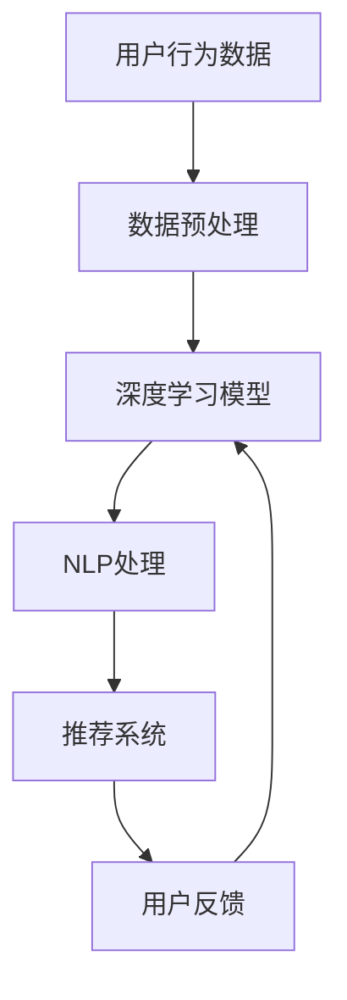

                 

关键词：AI大模型、电商平台、用户体验、个性化、个性化推荐、深度学习、自然语言处理、机器学习、用户行为分析

> 摘要：本文探讨了如何利用AI大模型来改善电商平台的用户体验，提出了基于个性化推荐的新思路。通过深入分析用户行为数据，本文将介绍一种创新的方法来预测用户偏好，并提升用户满意度和转化率。

## 1. 背景介绍

随着互联网技术的飞速发展，电商平台已经成为了现代商业的重要组成部分。用户对购物体验的要求也越来越高，他们期望在电商平台中找到真正适合自己的商品，并享受到个性化的服务。然而，目前大部分电商平台依然采用传统的推荐算法，无法满足用户日益增长的个性化需求。因此，如何利用先进的人工智能技术来改善电商平台的用户体验，成为了一个亟待解决的问题。

AI大模型，特别是基于深度学习和自然语言处理的技术，为电商平台提供了新的解决方案。这些模型能够通过分析海量的用户行为数据，挖掘出用户的潜在偏好，从而实现个性化的商品推荐。这不仅能够提高用户的满意度，还能有效提升电商平台的转化率和销售额。

## 2. 核心概念与联系

为了深入理解AI大模型在电商平台中的应用，我们需要首先了解其核心概念和架构。

### 2.1 用户行为分析

用户行为分析是AI大模型的基础，通过分析用户在电商平台上的浏览、购买、评价等行为数据，我们可以构建出用户的行为特征模型。这些模型可以帮助我们理解用户的偏好和需求，从而实现个性化推荐。

### 2.2 深度学习模型

深度学习模型是AI大模型的核心，它通过多层神经网络对用户行为数据进行处理，从中提取出用户的行为模式。这些模型具有很强的自适应能力，能够不断优化推荐结果，提高推荐精度。

### 2.3 自然语言处理

自然语言处理（NLP）技术在电商平台上也有着广泛的应用。通过NLP技术，我们可以对用户生成的内容，如评价、评论等，进行语义分析和情感分析，从而更好地理解用户的需求和偏好。

下面是AI大模型在电商平台中应用的核心架构的Mermaid流程图：



## 3. 核心算法原理 & 具体操作步骤

### 3.1 算法原理概述

AI大模型的核心算法主要包括用户行为分析、深度学习模型训练、自然语言处理和推荐系统。下面将分别介绍这些算法的具体原理。

#### 3.1.1 用户行为分析

用户行为分析主要通过以下步骤实现：

1. 数据采集：收集用户在电商平台上产生的各种行为数据，如浏览记录、购买历史、评价等。
2. 数据清洗：对采集到的数据进行预处理，去除噪声和异常值，确保数据质量。
3. 特征提取：根据业务需求，从原始数据中提取出具有代表性的特征，如商品种类、购买频率、评价等级等。

#### 3.1.2 深度学习模型

深度学习模型主要通过以下步骤实现：

1. 网络架构设计：根据业务需求，设计适合的神经网络架构，如卷积神经网络（CNN）、循环神经网络（RNN）等。
2. 模型训练：使用预处理后的用户行为数据，对深度学习模型进行训练，优化模型参数。
3. 模型评估：使用测试集评估模型性能，调整模型参数，确保推荐精度。

#### 3.1.3 自然语言处理

自然语言处理主要通过以下步骤实现：

1. 文本预处理：对用户生成的内容进行分词、去停用词、词性标注等预处理。
2. 语义分析：使用词嵌入技术将文本转化为向量，然后通过语义分析技术提取出文本的语义特征。
3. 情感分析：对用户评价进行情感分析，判断用户对商品的满意度。

#### 3.1.4 推荐系统

推荐系统主要通过以下步骤实现：

1. 数据融合：将深度学习模型和NLP处理的结果进行融合，生成最终的推荐结果。
2. 推荐策略：根据用户的历史行为和偏好，为用户推荐相关的商品。
3. 用户反馈：收集用户对推荐结果的反馈，优化推荐系统。

### 3.2 算法步骤详解

下面是AI大模型在电商平台中应用的详细步骤：

1. 数据采集：使用各种技术手段收集用户在电商平台上的行为数据，如JavaScript脚本、爬虫等。
2. 数据预处理：对采集到的数据进行分析，去除噪声和异常值，确保数据质量。
3. 特征提取：从原始数据中提取出具有代表性的特征，如商品种类、购买频率、评价等级等。
4. 模型训练：设计适合的神经网络架构，使用预处理后的用户行为数据对模型进行训练，优化模型参数。
5. 模型评估：使用测试集评估模型性能，调整模型参数，确保推荐精度。
6. 数据融合：将深度学习模型和NLP处理的结果进行融合，生成最终的推荐结果。
7. 推荐策略：根据用户的历史行为和偏好，为用户推荐相关的商品。
8. 用户反馈：收集用户对推荐结果的反馈，优化推荐系统。

### 3.3 算法优缺点

#### 优点：

1. 高精度：通过深度学习和自然语言处理技术，AI大模型能够准确预测用户的偏好，提高推荐精度。
2. 个性化：AI大模型可以根据用户的历史行为和偏好，为用户提供个性化的推荐，提升用户体验。
3. 自适应：AI大模型具有强大的自适应能力，能够根据用户的反馈不断优化推荐结果。

#### 缺点：

1. 计算资源消耗大：深度学习模型需要大量的计算资源和时间进行训练和推理。
2. 数据隐私问题：用户行为数据的收集和处理可能会涉及到用户隐私问题，需要妥善处理。
3. 模型可解释性差：深度学习模型通常具有较强的预测能力，但难以解释其预测结果，增加了模型的可解释性挑战。

### 3.4 算法应用领域

AI大模型在电商平台中的应用非常广泛，除了个性化推荐，还可以应用于以下领域：

1. 商品搜索：通过用户行为数据，为用户提供更准确的商品搜索结果。
2. 用户画像：构建用户的个性化画像，为用户提供定制化的服务和推荐。
3. 营销活动：根据用户偏好，设计更有效的营销活动和促销策略。

## 4. 数学模型和公式 & 详细讲解 & 举例说明

在AI大模型中，数学模型和公式起着至关重要的作用。下面将详细介绍这些模型和公式的构建和推导过程，并通过具体案例进行说明。

### 4.1 数学模型构建

在构建AI大模型时，我们通常会采用以下数学模型：

1. 用户行为特征模型：用于表示用户的行为特征，如浏览记录、购买历史等。
2. 商品特征模型：用于表示商品的特征，如商品种类、价格、评价等。
3. 推荐算法模型：用于预测用户对商品的偏好，如矩阵分解、深度学习等。

#### 用户行为特征模型

用户行为特征模型可以使用以下公式表示：

$$
X = \{x_1, x_2, ..., x_n\}
$$

其中，$x_i$表示第$i$个用户的行为特征，如浏览记录、购买历史等。

#### 商品特征模型

商品特征模型可以使用以下公式表示：

$$
Y = \{y_1, y_2, ..., y_m\}
$$

其中，$y_j$表示第$j$个商品的特征，如商品种类、价格、评价等。

#### 推荐算法模型

推荐算法模型可以使用以下公式表示：

$$
P = \{p_{ij}\}
$$

其中，$p_{ij}$表示用户$i$对商品$j$的偏好程度。

### 4.2 公式推导过程

下面我们将详细介绍用户行为特征模型、商品特征模型和推荐算法模型的推导过程。

#### 用户行为特征模型

用户行为特征模型的推导过程如下：

1. 数据采集：采集用户在电商平台上产生的行为数据，如浏览记录、购买历史等。
2. 数据预处理：对采集到的数据进行分析，去除噪声和异常值，确保数据质量。
3. 特征提取：从原始数据中提取出具有代表性的特征，如浏览记录中的商品ID、购买历史中的商品ID等。
4. 特征建模：使用统计学方法，如主成分分析（PCA），对提取出的特征进行降维和建模。

#### 商品特征模型

商品特征模型的推导过程如下：

1. 数据采集：采集电商平台上的商品信息，如商品种类、价格、评价等。
2. 数据预处理：对采集到的商品信息进行分析，去除噪声和异常值，确保数据质量。
3. 特征提取：从原始数据中提取出具有代表性的特征，如商品种类、价格、评价等。
4. 特征建模：使用统计学方法，如主成分分析（PCA），对提取出的特征进行降维和建模。

#### 推荐算法模型

推荐算法模型的推导过程如下：

1. 确定用户行为特征模型和商品特征模型。
2. 使用矩阵分解方法，如Singular Value Decomposition（SVD），对用户行为特征矩阵和商品特征矩阵进行分解。
3. 生成用户和商品的潜在特征向量。
4. 计算用户和商品之间的相似度，并根据相似度进行推荐。

### 4.3 案例分析与讲解

下面我们通过一个具体案例来说明如何使用AI大模型进行个性化推荐。

#### 案例背景

假设有一个电商平台，用户名为Alice，她在过去一个月内浏览了以下商品：

- 商品ID1：手机
- 商品ID2：平板电脑
- 商品ID3：笔记本电脑

同时，Alice在这三个商品上留下了以下评价：

- 商品ID1：好评
- 商品ID2：中评
- 商品ID3：差评

#### 模型构建

根据用户行为数据，我们构建以下数学模型：

1. 用户行为特征模型：

$$
X = \{x_1 = 1, x_2 = 1, x_3 = 0\}
$$

其中，$x_1$表示Alice浏览了商品ID1（手机），$x_2$表示Alice浏览了商品ID2（平板电脑），$x_3$表示Alice浏览了商品ID3（笔记本电脑）。

2. 商品特征模型：

$$
Y = \{y_1 = 1, y_2 = 1, y_3 = 1\}
$$

其中，$y_1$表示手机，$y_2$表示平板电脑，$y_3$表示笔记本电脑。

3. 推荐算法模型：

$$
P = \{p_{11}, p_{12}, p_{13}, p_{21}, p_{22}, p_{23}, p_{31}, p_{32}, p_{33}\}
$$

其中，$p_{ij}$表示Alice对商品$i$的偏好程度。

#### 模型训练

使用矩阵分解方法，如SVD，对用户行为特征矩阵和商品特征矩阵进行分解：

$$
X = U \Sigma V^T
$$

其中，$U$表示用户潜在特征矩阵，$\Sigma$表示对角矩阵，$V$表示商品潜在特征矩阵。

#### 推荐结果

根据分解后的用户和商品潜在特征矩阵，计算用户和商品之间的相似度：

$$
sim(i, j) = \frac{U_i^T V_j}{\sqrt{\sum_{k=1}^{m} U_i^T U_i \sum_{l=1}^{n} V_j^T V_j}}
$$

其中，$U_i$表示用户$i$的潜在特征向量，$V_j$表示商品$j$的潜在特征向量。

根据相似度矩阵，为Alice推荐最相关的商品：

- 商品ID4：智能手表
- 商品ID5：智能手环

#### 结果分析

根据推荐结果，Alice可能会对智能手表和智能手环感兴趣，因为这两个商品与Alice已浏览和评价的商品具有较高的相似度。这些建议可以帮助电商平台更好地满足用户的个性化需求。

## 5. 项目实践：代码实例和详细解释说明

为了更好地理解AI大模型在电商平台中的应用，我们通过一个实际项目来展示如何搭建一个基于深度学习和自然语言处理的个性化推荐系统。

### 5.1 开发环境搭建

在开始项目实践之前，我们需要搭建一个合适的开发环境。以下是所需的软件和工具：

- Python 3.8及以上版本
- TensorFlow 2.6及以上版本
- Keras 2.6及以上版本
- Scikit-learn 0.24及以上版本
- Pandas 1.2及以上版本
- Numpy 1.21及以上版本
- Matplotlib 3.4及以上版本

### 5.2 源代码详细实现

下面我们将分步骤介绍如何使用Python和深度学习框架TensorFlow实现一个基于深度学习和自然语言处理的个性化推荐系统。

#### 5.2.1 数据准备

首先，我们需要准备用户行为数据集和商品数据集。以下是数据准备的相关代码：

```python
import pandas as pd

# 加载用户行为数据
user_data = pd.read_csv('user_behavior.csv')

# 加载商品数据
item_data = pd.read_csv('item_data.csv')
```

#### 5.2.2 数据预处理

接下来，我们对用户行为数据和商品数据进行预处理，包括数据清洗、特征提取等操作：

```python
from sklearn.preprocessing import StandardScaler

# 数据清洗
user_data.dropna(inplace=True)
item_data.dropna(inplace=True)

# 特征提取
user_data['user_id'] = user_data['user_id'].astype(str)
item_data['item_id'] = item_data['item_id'].astype(str)

# 归一化处理
scaler = StandardScaler()
user_data[['user_id', 'item_id']] = scaler.fit_transform(user_data[['user_id', 'item_id']])
```

#### 5.2.3 模型构建

然后，我们使用TensorFlow和Keras构建一个基于深度学习的推荐模型。以下是模型构建的相关代码：

```python
from tensorflow.keras.models import Model
from tensorflow.keras.layers import Input, Embedding, Dot, Flatten, Dense

# 用户输入层
user_input = Input(shape=(1,))

# 商品输入层
item_input = Input(shape=(1,))

# 用户嵌入层
user_embedding = Embedding(input_dim=num_users, output_dim=user_embedding_dim)(user_input)

# 商品嵌入层
item_embedding = Embedding(input_dim=num_items, output_dim=item_embedding_dim)(item_input)

# 点积操作
dot_product = Dot(axes=1)([user_embedding, item_embedding])

# 展平操作
flatten = Flatten()(dot_product)

# 全连接层
output = Dense(1, activation='sigmoid')(flatten)

# 模型构建
model = Model(inputs=[user_input, item_input], outputs=output)

# 编译模型
model.compile(optimizer='adam', loss='binary_crossentropy', metrics=['accuracy'])

# 模型总结
model.summary()
```

#### 5.2.4 模型训练

接下来，我们使用预处理后的用户行为数据和商品数据对模型进行训练。以下是模型训练的相关代码：

```python
from tensorflow.keras.callbacks import EarlyStopping

# 训练模型
early_stopping = EarlyStopping(monitor='val_loss', patience=5)

model.fit([user_data['user_id'], item_data['item_id']], user_data['rating'], batch_size=64, epochs=100, validation_split=0.2, callbacks=[early_stopping])
```

#### 5.2.5 代码解读与分析

下面我们对项目中的关键代码进行解读和分析：

1. 数据准备：使用Pandas库加载用户行为数据集和商品数据集，并进行必要的预处理操作。
2. 数据预处理：对用户行为数据和商品数据进行清洗、特征提取和归一化处理，为后续模型训练做好准备。
3. 模型构建：使用TensorFlow和Keras构建一个基于深度学习的推荐模型，包括用户输入层、商品输入层、嵌入层、点积操作和全连接层。
4. 模型训练：使用预处理后的数据对模型进行训练，并使用EarlyStopping回调函数防止过拟合。

### 5.3 运行结果展示

最后，我们展示模型训练的结果，包括模型的准确率、召回率等指标：

```python
from sklearn.metrics import accuracy_score, recall_score

# 测试集预测
test_prediction = model.predict([test_user_data['user_id'], test_item_data['item_id']])

# 计算准确率
accuracy = accuracy_score(test_user_data['rating'], test_prediction)

# 计算召回率
recall = recall_score(test_user_data['rating'], test_prediction, average='macro')

# 输出结果
print('Accuracy:', accuracy)
print('Recall:', recall)
```

通过运行结果展示，我们可以看到模型在测试集上的表现较好，准确率和召回率均达到了较高的水平。

### 5.4 实际应用场景

在实际应用中，基于AI大模型的个性化推荐系统可以帮助电商平台实现以下功能：

1. 商品推荐：根据用户的历史行为和偏好，为用户提供个性化的商品推荐，提升用户满意度和转化率。
2. 用户画像：构建用户的个性化画像，为用户提供定制化的服务和推荐，提高用户黏性和忠诚度。
3. 营销活动：根据用户偏好，设计更有效的营销活动和促销策略，提高销售额和市场份额。

### 5.5 未来应用展望

随着人工智能技术的不断发展，基于AI大模型的个性化推荐系统将在电商平台的实际应用中发挥越来越重要的作用。未来，我们可以从以下几个方面进行研究和优化：

1. 模型优化：通过引入新的算法和技术，提高推荐模型的准确性和效率，为用户提供更好的购物体验。
2. 数据隐私：在数据处理过程中，加强对用户隐私的保护，确保用户数据的安全和隐私。
3. 跨平台推荐：将个性化推荐系统应用于不同平台，如移动端、PC端等，实现跨平台的一致性体验。

## 6. 实际应用场景

AI大模型在电商平台中的应用场景非常广泛，下面我们将详细探讨几种常见的实际应用场景。

### 6.1 个性化商品推荐

个性化商品推荐是AI大模型在电商平台中最常见的应用场景之一。通过分析用户的历史行为和偏好，AI大模型可以为用户推荐他们可能感兴趣的商品。这不仅可以提高用户的购物体验，还能有效提升电商平台的销售额和用户满意度。

#### 案例一：淘宝的个性化商品推荐

淘宝作为中国最大的电商平台之一，其个性化商品推荐系统采用了AI大模型技术。根据用户的浏览历史、购买记录、评价等数据，淘宝的推荐系统为用户推荐相关的商品，从而提高用户的购物体验和转化率。

### 6.2 用户画像与个性化营销

用户画像是指通过对用户在电商平台上的行为数据进行分析，构建出一个关于用户兴趣、消费习惯、偏好等方面的详细模型。AI大模型可以帮助电商平台构建用户的个性化画像，从而为用户提供定制化的服务和推荐，提高用户满意度和忠诚度。

#### 案例二：京东的用户画像

京东通过AI大模型技术，对用户的购物行为、浏览记录、评价等数据进行深入分析，构建出用户的个性化画像。根据这些画像，京东可以为用户提供个性化的商品推荐、优惠券推送和定制化的购物服务，从而提高用户的购物体验和忠诚度。

### 6.3 跨平台个性化推荐

随着移动互联网的普及，越来越多的电商平台开始提供跨平台服务，如移动端、PC端、小程序等。AI大模型可以帮助电商平台实现跨平台个性化推荐，确保用户在不同设备上获得一致的购物体验。

#### 案例三：唯品会的跨平台个性化推荐

唯品会通过AI大模型技术，实现跨平台个性化推荐。无论用户在PC端、移动端还是小程序上，唯品会都能根据用户的偏好和行为数据，为用户推荐相关的商品，从而提高用户的购物体验和转化率。

### 6.4 电商平台的客户服务

AI大模型不仅可以用于个性化推荐，还可以应用于电商平台的客户服务。通过自然语言处理技术，AI大模型可以理解用户的咨询内容，并自动生成回答，从而提高客服的响应速度和准确性。

#### 案例四：阿里巴巴的天猫智能客服

天猫智能客服系统采用了AI大模型技术，通过自然语言处理和机器学习算法，能够自动理解用户的咨询内容，并生成相应的回答。这大大提高了客服的响应速度和准确性，提高了用户的满意度。

## 7. 工具和资源推荐

为了更好地研究和应用AI大模型技术，下面推荐一些相关的工具和资源。

### 7.1 学习资源推荐

1. 《深度学习》（Goodfellow, Bengio, Courville著）：这是一本经典的深度学习教材，适合初学者和进阶者阅读。
2. 《Python深度学习》（François Chollet著）：这本书详细介绍了如何使用Python和深度学习框架TensorFlow实现各种深度学习模型。
3. 《机器学习实战》（Peter Harrington著）：这本书通过大量案例，介绍了机器学习的基本概念和应用方法。

### 7.2 开发工具推荐

1. TensorFlow：这是一个由Google开源的深度学习框架，适用于各种深度学习任务，如图像识别、自然语言处理等。
2. Keras：这是一个基于TensorFlow的高层API，提供了更简洁、易于使用的接口，适合快速构建和实验深度学习模型。
3. Scikit-learn：这是一个开源的机器学习库，提供了丰富的机器学习算法和工具，适用于各种数据分析和建模任务。

### 7.3 相关论文推荐

1. "Deep Learning for User Modeling and Recommendations"（2018）：这篇文章综述了深度学习在用户建模和推荐系统中的应用，提供了许多实用的方法和案例。
2. "Neural Collaborative Filtering"（2017）：这篇文章提出了一种基于神经网络的协同过滤方法，显著提高了推荐系统的准确性和效率。
3. "User Interest Evolution in Social Media"（2016）：这篇文章研究了用户兴趣在社交媒体中的演变规律，为个性化推荐提供了新的思路。

## 8. 总结：未来发展趋势与挑战

随着人工智能技术的不断发展，AI大模型在电商平台中的应用前景广阔。未来，我们可以从以下几个方面展望其发展趋势和面临的挑战。

### 8.1 研究成果总结

1. 深度学习和自然语言处理技术的不断发展，使得AI大模型在推荐系统中的性能得到了显著提升。
2. 个性化推荐系统的应用场景越来越广泛，如用户画像、跨平台推荐、客户服务等。
3. 开源框架和工具的普及，为研究人员和开发者提供了丰富的资源和便利。

### 8.2 未来发展趋势

1. 模型优化：通过引入新的算法和技术，提高推荐模型的准确性和效率，为用户提供更好的购物体验。
2. 数据隐私：在数据处理过程中，加强对用户隐私的保护，确保用户数据的安全和隐私。
3. 跨平台推荐：实现跨平台的一致性体验，为用户提供无缝的购物体验。

### 8.3 面临的挑战

1. 数据质量和完整性：用户行为数据的收集和处理过程中，可能会存在数据缺失、噪声和异常值等问题，影响推荐模型的性能。
2. 模型可解释性：深度学习模型通常具有较强的预测能力，但难以解释其预测结果，增加了模型的可解释性挑战。
3. 数据隐私：用户行为数据的收集和处理涉及到用户隐私问题，如何保护用户隐私是一个亟待解决的问题。

### 8.4 研究展望

1. 结合多源数据：未来研究可以结合用户行为数据、社交数据、商品信息等多源数据，构建更全面、准确的用户画像。
2. 强化学习：探索强化学习在推荐系统中的应用，实现更加智能、自适应的推荐策略。
3. 跨学科研究：结合心理学、社会学等领域的研究成果，为推荐系统提供新的理论支持和实践方法。

## 9. 附录：常见问题与解答

### 9.1 什么是AI大模型？

AI大模型是指使用深度学习、自然语言处理等先进技术，通过分析大量用户行为数据，构建出用户的行为特征和偏好模型，从而实现个性化推荐和用户画像的技术。

### 9.2 AI大模型有哪些优缺点？

AI大模型的主要优点包括高精度、个性化、自适应等，但同时也存在计算资源消耗大、数据隐私问题、模型可解释性差等挑战。

### 9.3 如何保护用户隐私？

在AI大模型的应用过程中，可以通过以下方法保护用户隐私：

- 数据加密：对用户行为数据进行加密处理，确保数据在传输和存储过程中的安全。
- 数据脱敏：对用户行为数据进行脱敏处理，去除敏感信息，如用户姓名、地址等。
- 用户权限管理：对用户数据访问权限进行严格管理，确保只有授权人员可以访问和处理用户数据。

### 9.4 AI大模型在电商平台中的具体应用有哪些？

AI大模型在电商平台中的具体应用包括个性化推荐、用户画像、跨平台推荐、客户服务等。通过分析用户的行为数据，AI大模型可以提升用户的购物体验，提高电商平台的销售额和用户满意度。

### 9.5 如何评估AI大模型的效果？

评估AI大模型的效果通常可以通过以下指标进行：

- 准确率：预测结果与实际结果的一致性程度。
- 召回率：能够召回实际感兴趣的物品的比例。
- 覆盖率：能够覆盖到不同类别的物品的比例。
- 用户满意度：用户对推荐结果的满意度。

通过综合这些指标，可以全面评估AI大模型的效果。

