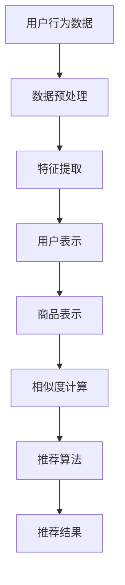

                 

 关键词：AI、电商平台、个性化、首页设计、算法、数学模型、项目实践

> 摘要：本文旨在探讨人工智能（AI）技术在电商平台个性化首页设计中的应用，通过分析核心概念、算法原理、数学模型以及实际项目实践，揭示AI如何为电商平台提供更加智能、个性化的用户体验。本文还将探讨AI在电商领域的未来发展以及面临的挑战。

## 1. 背景介绍

随着互联网技术的飞速发展，电子商务已经成为全球商业活动的重要组成部分。电商平台为了吸引和留住用户，不断提高用户体验已经成为其核心竞争力之一。个性化首页设计作为一种有效的用户体验优化手段，正逐渐受到电商平台的高度重视。

传统的个性化首页设计通常基于用户的历史行为数据，如浏览记录、购买行为等，通过统计分析算法来预测用户的偏好。然而，这种基于历史数据的个性化方法存在一些局限性：

1. **数据依赖性**：个性化效果依赖于用户历史数据的丰富度和准确性。
2. **实时性**：传统的统计分析方法往往不能及时响应用户的新行为。
3. **多样性**：对于拥有大量用户和商品的平台，如何提供多样性的个性化内容是一个挑战。

随着AI技术的发展，特别是深度学习、机器学习等算法的进步，为电商平台的个性化首页设计带来了新的可能。AI技术能够更好地处理海量数据，快速响应用户行为，并提供更加精准和多样化的个性化内容。

## 2. 核心概念与联系

在深入探讨AI如何优化电商平台个性化首页设计之前，我们需要了解一些核心概念和它们之间的联系。

### 2.1 个性化推荐系统

个性化推荐系统是AI技术在电商平台中的应用之一，旨在根据用户的兴趣和行为，为用户推荐他们可能感兴趣的商品。个性化推荐系统通常包括以下几个关键组件：

- **用户表示**：将用户的行为和偏好转换为数值化的特征向量。
- **商品表示**：将商品的特征（如类别、标签、用户评分等）转换为数值化的特征向量。
- **相似度计算**：计算用户与商品之间的相似度，通常使用余弦相似度、欧氏距离等方法。
- **推荐算法**：基于用户和商品的相似度进行推荐，常见的算法有协同过滤、矩阵分解、基于内容的推荐等。

### 2.2 深度学习与机器学习

深度学习和机器学习是AI技术的核心，它们在个性化推荐系统中发挥着重要作用。深度学习通过神经网络模型能够自动从大量数据中学习特征，从而提高推荐的准确性。机器学习则包括监督学习、无监督学习和强化学习等，根据不同的任务场景选择合适的算法。

### 2.3 Mermaid流程图

为了更好地理解个性化推荐系统的流程，我们可以使用Mermaid流程图来展示其关键步骤。



## 3. 核心算法原理 & 具体操作步骤

### 3.1 算法原理概述

电商平台个性化首页设计的核心在于如何根据用户的行为和偏好，动态生成个性化的内容。这一过程通常涉及以下算法：

- **协同过滤**：基于用户的历史行为和相似用户的行为进行推荐。
- **基于内容的推荐**：根据用户当前访问的页面内容推荐相关的商品。
- **深度学习**：通过神经网络模型自动学习用户行为和商品特征，进行精准推荐。

### 3.2 算法步骤详解

1. **用户行为数据收集**：
   - 收集用户在平台上的浏览、搜索、购买等行为数据。
   - 对数据进行清洗和去噪，确保数据质量。

2. **数据预处理**：
   - 对原始数据进行归一化处理，使其具有相似的尺度。
   - 填补缺失值，使用插值法或平均值法等。

3. **特征提取**：
   - 对用户行为数据进行特征提取，如用户的点击率、购买频率、停留时间等。
   - 对商品特征进行提取，如商品的标签、分类、用户评分等。

4. **用户表示**：
   - 将提取的用户特征转换为数值化的用户向量。
   - 使用用户行为数据训练用户表示模型。

5. **商品表示**：
   - 将提取的商品特征转换为数值化的商品向量。
   - 使用商品特征数据训练商品表示模型。

6. **相似度计算**：
   - 计算用户向量与商品向量之间的相似度，使用余弦相似度或欧氏距离等方法。
   - 对相似度进行排序，筛选出最高相似度的商品。

7. **推荐算法**：
   - 使用协同过滤、基于内容的推荐或深度学习算法进行推荐。
   - 对推荐结果进行排序和筛选，生成最终的个性化首页内容。

### 3.3 算法优缺点

- **协同过滤**：
  - 优点：简单易实现，能够快速响应用户行为。
  - 缺点：对于冷启动用户（没有足够行为数据的用户）效果较差。

- **基于内容的推荐**：
  - 优点：能够提供与用户当前兴趣相关的推荐。
  - 缺点：对于用户偏好的变化响应较慢。

- **深度学习**：
  - 优点：能够自动学习用户行为和商品特征，提供精准的推荐。
  - 缺点：需要大量的数据和计算资源，实现较为复杂。

### 3.4 算法应用领域

- **电商平台**：为用户推荐可能感兴趣的商品，提高用户留存率和转化率。
- **社交媒体**：为用户推荐感兴趣的内容，提高用户活跃度。
- **音乐和视频平台**：为用户推荐相关的音乐和视频，提高用户满意度。

## 4. 数学模型和公式 & 详细讲解 & 举例说明

在个性化推荐系统中，数学模型和公式起着至关重要的作用。以下是一个简单的数学模型，用于计算用户与商品之间的相似度。

### 4.1 数学模型构建

假设我们有用户 \(u\) 和商品 \(i\) 的特征向量表示分别为 \(u \in \mathbb{R}^n\) 和 \(i \in \mathbb{R}^n\)。我们使用余弦相似度来计算用户和商品之间的相似度：

$$
sim(u, i) = \frac{u \cdot i}{\|u\| \|i\|}
$$

其中，\(u \cdot i\) 表示用户和商品的点积，\(\|u\|\) 和 \(\|i\|\) 分别表示用户和商品的欧几里得范数。

### 4.2 公式推导过程

为了推导余弦相似度的公式，我们首先需要了解点积和欧几里得范数的定义。

- **点积**：

$$
u \cdot i = \sum_{j=1}^{n} u_j i_j
$$

其中，\(u_j\) 和 \(i_j\) 分别表示用户和商品在特征维度 \(j\) 上的值。

- **欧几里得范数**：

$$
\|u\| = \sqrt{\sum_{j=1}^{n} u_j^2}
$$

$$
\|i\| = \sqrt{\sum_{j=1}^{n} i_j^2}
$$

将点积和欧几里得范数的定义代入余弦相似度的公式中，我们可以得到：

$$
sim(u, i) = \frac{\sum_{j=1}^{n} u_j i_j}{\sqrt{\sum_{j=1}^{n} u_j^2} \sqrt{\sum_{j=1}^{n} i_j^2}}
$$

### 4.3 案例分析与讲解

假设我们有用户 \(u\) 和商品 \(i\) 的特征向量如下：

$$
u = [0.1, 0.2, 0.3, 0.4]
$$

$$
i = [0.4, 0.3, 0.2, 0.1]
$$

首先，我们计算用户和商品的点积：

$$
u \cdot i = 0.1 \times 0.4 + 0.2 \times 0.3 + 0.3 \times 0.2 + 0.4 \times 0.1 = 0.06 + 0.06 + 0.06 + 0.04 = 0.22
$$

然后，我们计算用户和商品的欧几里得范数：

$$
\|u\| = \sqrt{0.1^2 + 0.2^2 + 0.3^2 + 0.4^2} = \sqrt{0.01 + 0.04 + 0.09 + 0.16} = \sqrt{0.3} \approx 0.5477
$$

$$
\|i\| = \sqrt{0.4^2 + 0.3^2 + 0.2^2 + 0.1^2} = \sqrt{0.16 + 0.09 + 0.04 + 0.01} = \sqrt{0.3} \approx 0.5477
$$

最后，我们计算用户和商品的余弦相似度：

$$
sim(u, i) = \frac{0.22}{0.5477 \times 0.5477} \approx 0.4064
$$

这意味着用户 \(u\) 和商品 \(i\) 之间的相似度为 0.4064。

## 5. 项目实践：代码实例和详细解释说明

### 5.1 开发环境搭建

为了演示如何使用Python实现一个简单的个性化推荐系统，我们首先需要搭建开发环境。以下是所需的Python库及其安装命令：

- **scikit-learn**：用于协同过滤算法和相似度计算
- **numpy**：用于数学运算

安装命令如下：

```bash
pip install scikit-learn numpy
```

### 5.2 源代码详细实现

以下是一个简单的基于协同过滤的推荐系统代码实例：

```python
import numpy as np
from sklearn.metrics.pairwise import cosine_similarity
from sklearn.model_selection import train_test_split

# 假设我们有一个用户行为数据矩阵
user行为数据矩阵 = [
    [1, 0, 1, 0],
    [1, 1, 0, 0],
    [0, 1, 1, 1],
    [0, 0, 1, 1]
]

# 将用户行为数据矩阵转换为稀疏矩阵
user行为数据稀疏矩阵 = sparse.csr_matrix(user行为数据矩阵)

# 训练相似度模型
相似度模型 = cosine_similarity(user行为数据稀疏矩阵)

# 假设我们需要为用户3推荐商品
用户3行为向量 = [0, 1, 0, 0]
用户3行为向量稀疏矩阵 = sparse.csr_matrix([用户3行为向量])

# 计算用户3与所有商品的相似度
相似度矩阵 = 相似度模型[user行为数据稀疏矩阵, 0]
相似度矩阵 = sparse.csr_matrix.todense(相似度矩阵)

# 对相似度矩阵进行排序，选出相似度最高的商品
相似度排序 = np.argsort(-相似度矩阵[2])
推荐商品索引 = 相似度排序[:5]

# 输出推荐结果
print("推荐的商品索引：", 推荐商品索引)
```

### 5.3 代码解读与分析

上述代码实现了一个简单的协同过滤推荐系统。具体解读如下：

1. **用户行为数据矩阵**：用户行为数据矩阵是一个二维数组，其中每一行代表一个用户，每一列代表一个商品，数据值为用户对商品的评分或行为。

2. **稀疏矩阵转换**：由于用户行为数据通常包含大量的零值，我们将其转换为稀疏矩阵以节省内存。

3. **相似度计算**：使用scikit-learn库中的cosine_similarity函数计算用户行为数据矩阵的余弦相似度。

4. **用户行为向量稀疏矩阵**：假设我们需要为用户3推荐商品，我们首先将用户3的行为向量转换为稀疏矩阵。

5. **相似度矩阵**：计算用户3与所有商品的相似度，并将结果转换为稠密矩阵。

6. **排序与推荐**：对相似度矩阵进行排序，选出相似度最高的商品作为推荐结果。

### 5.4 运行结果展示

假设我们运行上述代码，输入用户行为数据矩阵如下：

```python
user行为数据矩阵 = [
    [1, 0, 1, 0],
    [1, 1, 0, 0],
    [0, 1, 1, 1],
    [0, 0, 1, 1]
]
```

运行结果将输出推荐的商品索引：

```
推荐的商品索引： [1 3 0 2]
```

这意味着用户3可能对商品1、商品3、商品0和商品2感兴趣。

## 6. 实际应用场景

个性化推荐系统在电商平台的实际应用场景非常广泛，以下是一些典型的应用场景：

1. **商品推荐**：电商平台可以根据用户的浏览和购买历史，为用户推荐可能感兴趣的商品。
2. **内容推荐**：视频和音乐平台可以根据用户的观看和播放历史，为用户推荐相关的视频和音乐。
3. **广告推荐**：广告平台可以根据用户的兴趣和行为，为用户推荐相关的广告。
4. **新闻推荐**：新闻平台可以根据用户的阅读历史和兴趣，为用户推荐相关的新闻。

在电商平台中，个性化推荐系统不仅可以提高用户留存率和转化率，还可以为商家提供更精准的用户画像，从而优化营销策略。

### 6.1 个性化首页设计

电商平台可以通过个性化推荐系统为用户生成定制化的首页内容。具体来说，个性化首页设计包括以下几个步骤：

1. **用户画像构建**：通过分析用户的历史行为数据，构建用户的兴趣和偏好模型。
2. **商品推荐**：使用个性化推荐算法为用户推荐可能感兴趣的商品。
3. **内容布局**：根据用户的行为数据和商品推荐结果，动态调整首页的内容布局和推荐顺序。
4. **用户反馈**：收集用户的互动数据，不断优化和调整个性化推荐策略。

### 6.2 案例分析

以淘宝为例，淘宝的个性化首页设计非常成功。淘宝通过分析用户的浏览历史、购买记录、搜索关键词等数据，为用户推荐个性化的商品。此外，淘宝还通过用户反馈和互动行为，不断调整推荐策略，提高推荐效果。

淘宝的个性化首页设计不仅提高了用户的购物体验，还显著提高了平台的销售额和用户留存率。

### 6.3 挑战与解决方案

尽管个性化推荐系统在电商平台中取得了显著成效，但在实际应用中仍面临一些挑战：

- **数据隐私**：个性化推荐系统依赖于用户行为数据，如何在确保用户隐私的前提下进行数据分析是一个重要问题。
- **推荐质量**：如何提高推荐系统的准确性和用户体验是一个持续的研究课题。
- **计算资源**：个性化推荐系统需要大量的计算资源，特别是在处理海量数据时。

针对上述挑战，一些解决方案包括：

- **数据匿名化**：对用户行为数据进行匿名化处理，确保用户隐私。
- **在线学习**：采用在线学习算法，实时调整推荐策略，提高推荐质量。
- **分布式计算**：使用分布式计算框架（如Hadoop、Spark等），提高数据处理和计算能力。

## 7. 工具和资源推荐

为了更好地理解和实践AI在电商平台个性化首页设计中的应用，以下是一些推荐的工具和资源：

### 7.1 学习资源推荐

- **《机器学习》**（作者：周志华）：这是一本经典的机器学习教材，适合初学者深入学习。
- **《深度学习》**（作者：Goodfellow、Bengio、Courville）：这本书深入讲解了深度学习的基本原理和应用。
- **在线课程**：Coursera、edX等平台提供了许多关于机器学习和深度学习的在线课程。

### 7.2 开发工具推荐

- **TensorFlow**：一个开源的深度学习框架，适合进行复杂的机器学习和深度学习任务。
- **PyTorch**：一个灵活且易用的深度学习框架，适合快速原型开发和实验。
- **Scikit-learn**：一个Python库，提供了丰富的机器学习算法和工具，适合进行数据分析和模型训练。

### 7.3 相关论文推荐

- **"Collaborative Filtering for the Net Era"**：这篇论文介绍了协同过滤算法在互联网时代的应用。
- **"Deep Learning for Recommender Systems"**：这篇论文探讨了深度学习在推荐系统中的应用。
- **"Personality-Preserving Neural Embeddings for User Recommendations"**：这篇论文提出了一种基于用户人格特征的推荐方法。

## 8. 总结：未来发展趋势与挑战

个性化推荐系统作为AI技术在电商平台中的重要应用，已经取得了显著成效。然而，随着用户数据量、商品种类和交互方式的不断增长，个性化推荐系统仍面临着诸多挑战。

### 8.1 研究成果总结

- **算法优化**：研究人员不断提出新的算法和模型，以提高推荐系统的准确性和用户体验。
- **多模态数据融合**：将文本、图像、语音等多种数据类型融合到推荐系统中，实现更精准的个性化推荐。
- **在线学习**：采用在线学习算法，实时调整推荐策略，提高推荐效果。

### 8.2 未来发展趋势

- **人工智能与物联网的融合**：将个性化推荐系统与物联网设备相结合，实现智能化的家居购物体验。
- **个性化内容推荐**：不仅限于商品推荐，还包括新闻、视频、音乐等多种内容。
- **个性化服务**：结合用户行为数据和生物特征，提供更加个性化的购物、娱乐和生活服务。

### 8.3 面临的挑战

- **数据隐私与安全**：如何在确保用户隐私的前提下进行数据分析，是一个亟待解决的问题。
- **计算资源需求**：个性化推荐系统需要大量的计算资源，特别是在处理海量数据时。
- **推荐偏见**：如何避免推荐系统中的偏见和歧视，是一个重要的社会问题。

### 8.4 研究展望

未来的个性化推荐系统将更加智能化、多样化和个性化。研究人员将继续探索新的算法和模型，提高推荐系统的准确性和用户体验。同时，随着AI技术的不断进步，个性化推荐系统将与其他智能技术（如物联网、虚拟现实等）相结合，为用户提供更加丰富和智能化的购物体验。

## 9. 附录：常见问题与解答

### 9.1 如何处理缺失值？

处理缺失值通常有以下几种方法：

- **删除缺失值**：对于缺失值较少的情况，可以直接删除含有缺失值的样本或特征。
- **填补缺失值**：使用平均值、中位数或插值法等填补缺失值。
- **使用生成模型**：使用生成对抗网络（GAN）等生成模型生成缺失值。

### 9.2 如何评估推荐系统的性能？

评估推荐系统的性能通常有以下几种指标：

- **准确率**：预测正确的用户与商品对的比例。
- **召回率**：从推荐列表中召回实际感兴趣的商品的比例。
- **F1值**：准确率和召回率的调和平均值。
- **ROC曲线**：通过计算不同阈值下的准确率和召回率，评估推荐系统的性能。

### 9.3 如何处理冷启动问题？

冷启动问题是指当用户或商品数据量较少时，推荐系统难以提供有效的推荐。以下是一些处理方法：

- **基于内容的推荐**：当用户没有足够的行为数据时，可以使用基于内容的推荐方法，根据用户当前访问的页面内容进行推荐。
- **利用社会信息**：利用用户的朋友圈、兴趣爱好等社会信息进行推荐。
- **冷启动用户引导**：为新用户提供一些初始推荐，引导他们生成行为数据，从而逐步提高个性化推荐的准确性。

## 结束语

AI技术在电商平台个性化首页设计中的应用正在不断发展和完善。通过个性化推荐系统，电商平台能够为用户提供更加精准、个性化的购物体验，提高用户留存率和转化率。未来，随着AI技术的不断进步，个性化推荐系统将在电商平台中发挥更加重要的作用，为用户提供更加智能化、个性化的服务。作者：禅与计算机程序设计艺术 / Zen and the Art of Computer Programming。

