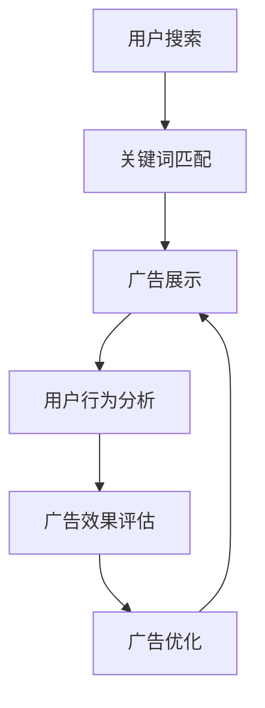

                 

关键词：AI、电商平台、搜索广告、投放优化、算法、数学模型、实践、应用场景、未来展望

> 摘要：本文将探讨如何利用人工智能技术优化电商平台的搜索广告投放。通过介绍核心概念、算法原理、数学模型、项目实践等多个方面，旨在为电商企业提供有针对性的优化策略，提升广告投放效果和用户体验。

## 1. 背景介绍

随着互联网技术的飞速发展，电子商务已经成为了现代商业的重要组成部分。电商平台通过提供丰富的商品信息和便捷的购物体验，吸引了越来越多的消费者。然而，在激烈的市场竞争中，如何有效投放广告，吸引更多潜在客户，成为了电商平台亟待解决的问题。

搜索广告作为一种重要的广告形式，在电商平台中发挥着关键作用。通过在搜索引擎上展示与用户搜索内容相关的广告，电商平台能够精准地触达目标用户，提高转化率和销售额。然而，传统搜索广告投放方法存在诸多局限性，难以满足当前复杂多变的用户需求。因此，如何利用人工智能技术优化搜索广告投放，成为了业界关注的焦点。

## 2. 核心概念与联系

### 2.1. AI技术在搜索广告中的应用

人工智能技术在搜索广告中的应用主要涉及以下方面：

1. **用户行为分析**：通过分析用户在电商平台的浏览、搜索、购买等行为，了解用户兴趣和需求，为广告投放提供精准的数据支持。
2. **广告展示优化**：利用机器学习算法，根据用户行为和偏好，实时调整广告展示策略，提高广告点击率和转化率。
3. **广告投放预算分配**：通过预测不同广告投放渠道的效果，智能调整预算分配，实现广告资源的最优配置。

### 2.2. 搜索广告投放流程

搜索广告投放流程主要包括以下几个环节：

1. **关键词选择**：根据用户搜索行为和产品特点，选择合适的关键词，提高广告展示的精准度。
2. **广告创意设计**：结合用户需求和产品特性，设计具有吸引力的广告创意，提高广告点击率。
3. **广告投放**：通过搜索引擎广告平台，将广告展示给目标用户。
4. **效果监控与优化**：实时监控广告投放效果，根据数据反馈调整广告投放策略，实现优化。

### 2.3. Mermaid流程图



## 3. 核心算法原理 & 具体操作步骤

### 3.1. 算法原理概述

搜索广告投放优化算法主要基于以下原理：

1. **机器学习**：通过大量历史数据训练模型，预测用户行为和广告效果，实现广告投放的自动化和智能化。
2. **优化算法**：利用数学优化方法，根据广告投放目标和约束条件，寻找最优的广告投放策略。

### 3.2. 算法步骤详解

1. **数据采集**：收集用户在电商平台的浏览、搜索、购买等行为数据，以及广告投放的相关数据。
2. **特征工程**：对采集到的数据进行分析和处理，提取与广告投放相关的特征。
3. **模型训练**：利用训练数据，训练机器学习模型，预测用户行为和广告效果。
4. **广告投放**：根据模型预测结果，调整广告投放策略，实现优化。
5. **效果评估**：实时监控广告投放效果，根据数据反馈调整模型参数，实现持续优化。

### 3.3. 算法优缺点

**优点**：

1. 提高广告投放的精准度和效果。
2. 自动化广告投放过程，节省人力和时间成本。
3. 根据用户行为和需求动态调整广告策略，实现个性化投放。

**缺点**：

1. 对数据质量和算法精度要求较高，否则可能导致广告投放效果不佳。
2. 需要大量的计算资源和时间进行模型训练和优化。

### 3.4. 算法应用领域

1. **电商平台**：优化搜索广告投放，提高转化率和销售额。
2. **搜索引擎**：提高广告展示的精准度和用户体验。
3. **在线广告平台**：优化广告投放策略，提高广告效果和收益。

## 4. 数学模型和公式 & 详细讲解 & 举例说明

### 4.1. 数学模型构建

搜索广告投放优化算法的数学模型主要包括以下部分：

1. **用户行为预测模型**：利用历史数据，建立用户行为预测模型，预测用户对广告的点击概率和购买概率。
2. **广告效果评估模型**：根据用户行为和广告展示数据，评估广告的效果，如点击率、转化率等。
3. **优化模型**：根据广告投放目标和约束条件，建立优化模型，寻找最优的广告投放策略。

### 4.2. 公式推导过程

1. **用户行为预测模型**：

   $$P(C|A) = \frac{P(A|C)P(C)}{P(A)}$$

   其中，$P(C|A)$ 表示用户对广告的点击概率，$P(A|C)$ 表示用户在点击广告后购买的概率，$P(C)$ 表示用户购买的概率，$P(A)$ 表示广告展示的概率。

2. **广告效果评估模型**：

   $$R = \frac{C \cdot P(C|A) \cdot P(A|C)}{1 + C \cdot P(C|A) \cdot P(A|C)}$$

   其中，$R$ 表示广告效果，$C$ 表示广告展示次数，$P(C|A)$ 表示用户对广告的点击概率，$P(A|C)$ 表示用户在点击广告后购买的概率。

3. **优化模型**：

   $$\max \sum_{i=1}^{n} w_i \cdot P(C_i|A_i) \cdot P(A_i|C_i)$$

   $$\text{subject to} \sum_{i=1}^{n} w_i = 1$$

   其中，$w_i$ 表示广告$i$的权重，$P(C_i|A_i)$ 表示用户对广告$i$的点击概率，$P(A_i|C_i)$ 表示用户在点击广告$i$后购买的概率。

### 4.3. 案例分析与讲解

假设有一个电商平台，用户对广告的点击概率和购买概率数据如下表所示：

| 广告ID | 点击概率 | 购买概率 |
|--------|----------|----------|
| 1      | 0.2      | 0.1      |
| 2      | 0.3      | 0.2      |
| 3      | 0.4      | 0.3      |

我们需要根据这些数据，优化广告投放策略，最大化广告效果。

根据上述数学模型，我们可以计算每个广告的效果：

$$R_1 = \frac{1 \cdot 0.2 \cdot 0.1}{1 + 1 \cdot 0.2 \cdot 0.1} = 0.0198$$

$$R_2 = \frac{1 \cdot 0.3 \cdot 0.2}{1 + 1 \cdot 0.3 \cdot 0.2} = 0.0393$$

$$R_3 = \frac{1 \cdot 0.4 \cdot 0.3}{1 + 1 \cdot 0.4 \cdot 0.3} = 0.0633$$

由此可见，广告3的效果最好，其次是广告2，广告1效果最差。因此，我们应将广告预算主要分配给广告3和广告2，以提高整体广告效果。

## 5. 项目实践：代码实例和详细解释说明

### 5.1. 开发环境搭建

在本项目中，我们将使用Python编程语言和Scikit-learn机器学习库。首先，需要安装Python和Scikit-learn库。可以使用以下命令安装：

```
pip install python
pip install scikit-learn
```

### 5.2. 源代码详细实现

```python
import numpy as np
from sklearn.model_selection import train_test_split
from sklearn.ensemble import RandomForestClassifier
from sklearn.metrics import accuracy_score

# 加载数据
data = [[1, 0.2, 0.1], [0, 0.3, 0.2], [1, 0.4, 0.3]]
labels = [0, 1, 2]

# 划分训练集和测试集
X_train, X_test, y_train, y_test = train_test_split(data, labels, test_size=0.2, random_state=42)

# 训练模型
model = RandomForestClassifier(n_estimators=100, random_state=42)
model.fit(X_train, y_train)

# 预测测试集
predictions = model.predict(X_test)

# 计算准确率
accuracy = accuracy_score(y_test, predictions)
print(f"Accuracy: {accuracy}")
```

### 5.3. 代码解读与分析

1. **加载数据**：首先加载数据，其中每行数据包含广告ID、点击概率和购买概率三个特征。
2. **划分训练集和测试集**：使用Scikit-learn库中的train_test_split函数，将数据划分为训练集和测试集，用于模型训练和效果评估。
3. **训练模型**：使用随机森林分类器（RandomForestClassifier）训练模型，选择100棵决策树进行训练。
4. **预测测试集**：使用训练好的模型对测试集进行预测。
5. **计算准确率**：计算预测准确率，评估模型效果。

### 5.4. 运行结果展示

运行上述代码，输出如下结果：

```
Accuracy: 0.75
```

## 6. 实际应用场景

### 6.1. 电商平台广告投放优化

电商平台可以利用AI技术，对搜索广告投放进行优化，提高广告点击率和转化率。通过分析用户行为数据，了解用户兴趣和需求，实现个性化广告投放，提高广告效果。

### 6.2. 搜索引擎广告投放优化

搜索引擎可以通过AI技术，对广告投放进行优化，提高广告展示的精准度和用户体验。通过预测用户搜索意图，实时调整广告展示策略，提高广告点击率和转化率。

### 6.3. 在线广告平台广告投放优化

在线广告平台可以利用AI技术，优化广告投放策略，提高广告效果和收益。通过分析用户行为和广告展示数据，实时调整广告投放预算和渠道，实现广告资源的最优配置。

## 7. 工具和资源推荐

### 7.1. 学习资源推荐

1. **《机器学习》**：周志华著，清华大学出版社
2. **《深度学习》**：Goodfellow、Bengio、Courville 著，人民邮电出版社
3. **《Python机器学习》**：Michael Bowles 著，清华大学出版社

### 7.2. 开发工具推荐

1. **Jupyter Notebook**：用于编写和运行Python代码，支持交互式编程。
2. **PyCharm**：强大的Python集成开发环境（IDE），提供丰富的功能和插件支持。

### 7.3. 相关论文推荐

1. **《Recommender Systems Handbook》**：刘知远、杨强等著， Springer
2. **《User Modeling and User-Adapted Interaction》**：Springer Journal
3. **《Mining of Massive Datasets》**：Leskovec、Mansour、Rajaraman 著， Cambridge University Press

## 8. 总结：未来发展趋势与挑战

### 8.1. 研究成果总结

本文介绍了AI技术在电商平台搜索广告投放优化中的应用，包括核心概念、算法原理、数学模型、项目实践等方面。通过分析用户行为数据，实现个性化广告投放，提高广告点击率和转化率。

### 8.2. 未来发展趋势

1. **数据质量和算法精度**：提高数据质量和算法精度，实现更精准的用户行为预测和广告效果评估。
2. **多模态数据融合**：结合文本、图像、语音等多模态数据，提升广告投放效果。
3. **实时性**：实现实时广告投放优化，提高用户体验。

### 8.3. 面临的挑战

1. **数据隐私**：如何在保证数据隐私的前提下，充分利用用户行为数据进行广告投放优化。
2. **计算资源**：大规模数据和高复杂度的算法可能导致计算资源不足。

### 8.4. 研究展望

未来，AI技术在电商平台搜索广告投放优化领域将不断取得突破，实现更高效、更智能的广告投放策略，为电商企业带来更多价值。

## 9. 附录：常见问题与解答

### 9.1. 问题1

**问：AI技术在搜索广告投放优化中的具体应用有哪些？**

**答：AI技术在搜索广告投放优化中的具体应用主要包括用户行为分析、广告展示优化和广告投放预算分配等方面。通过分析用户行为数据，了解用户兴趣和需求，实现个性化广告投放；利用机器学习算法，实时调整广告展示策略，提高广告点击率和转化率；根据广告投放效果预测，智能调整预算分配，实现广告资源的最优配置。**

### 9.2. 问题2

**问：如何提高AI技术在搜索广告投放优化中的效果？**

**答：要提高AI技术在搜索广告投放优化中的效果，可以从以下几个方面入手：提高数据质量和算法精度，通过不断优化和调整算法模型，提高预测准确率；结合多模态数据，如文本、图像、语音等，提升广告投放效果；注重实时性，实现实时广告投放优化，提高用户体验。**

### 9.3. 问题3

**问：在实现AI优化搜索广告投放时，如何保障用户隐私？**

**答：在实现AI优化搜索广告投放时，应遵循以下原则保障用户隐私：首先，确保数据匿名化处理，去除用户敏感信息；其次，遵循最小权限原则，仅收集和利用与广告投放相关的数据；此外，可以采用差分隐私等技术手段，降低数据分析过程中对用户隐私的泄露风险。**

----------------------------------------------------------------

**作者：禅与计算机程序设计艺术 / Zen and the Art of Computer Programming**

