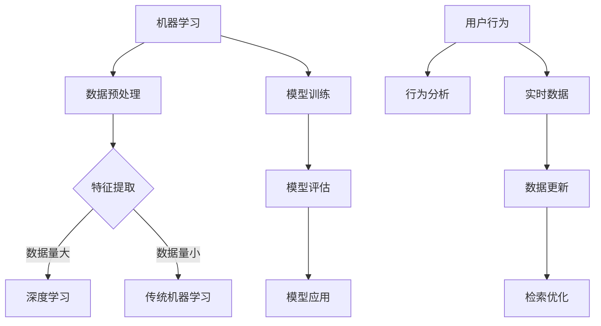

                 

关键词：人工智能，信息检索，效率提升，机器学习，深度学习，算法优化

> 摘要：本文将探讨人工智能技术如何通过优化算法、增强语义理解、利用用户行为和实时数据等手段，显著提高信息检索的效率。我们将分析现有技术的优缺点，并展望未来的发展方向。

## 1. 背景介绍

随着互联网的迅猛发展和信息的爆炸式增长，如何高效地检索到所需的信息成为了一个重要的问题。传统的信息检索方法主要依赖于关键词匹配和文档相似度计算，但在面对复杂、多样化的查询需求时，其效率常常受到限制。而人工智能（AI）技术的发展，特别是机器学习和深度学习，为信息检索带来了全新的机遇。

## 2. 核心概念与联系

为了更好地理解人工智能如何提高信息检索效率，我们首先需要了解几个核心概念及其相互关系。

### 2.1 机器学习与深度学习

**机器学习**是指通过算法和统计模型，从数据中自动发现规律并做出预测或决策的过程。它依赖于大量历史数据的训练，以优化模型的性能。

**深度学习**是机器学习的一个分支，它利用多层神经网络（如卷积神经网络CNN、循环神经网络RNN等）对数据进行处理和建模。深度学习在图像识别、语音识别等领域取得了显著成果。

### 2.2 语义理解与自然语言处理

**语义理解**是指计算机对自然语言文本所表达的意义进行理解和解释的能力。它包括词汇的语义、句子的语义和语用的理解。

**自然语言处理（NLP）**是人工智能领域的一个重要分支，它致力于使计算机能够理解、生成和翻译自然语言。NLP技术包括分词、词性标注、句法分析、语义角色标注等。

### 2.3 用户行为与实时数据

**用户行为**是指用户在使用信息检索系统时的交互行为，如查询历史、点击记录等。

**实时数据**是指系统在运行过程中实时收集到的数据，如当前的查询请求、用户的在线状态等。

### 2.4 Mermaid 流程图



## 3. 核心算法原理 & 具体操作步骤

### 3.1 算法原理概述

人工智能在信息检索中的应用，主要依托于以下几种算法：

- **协同过滤算法**：通过分析用户的兴趣和行为模式，预测用户可能感兴趣的内容。
- **向量空间模型**：将文本数据转换为向量形式，利用余弦相似度等度量方法进行检索。
- **深度学习模型**：如卷积神经网络（CNN）、循环神经网络（RNN）等，通过多层神经网络对文本进行建模，提高检索的精度。
- **强化学习算法**：通过不断优化策略，使系统在动态环境下进行决策，提高检索效果。

### 3.2 算法步骤详解

1. **数据收集与预处理**：收集用户的查询记录、浏览历史等数据，并进行去重、去噪等预处理操作。
2. **特征提取**：利用自然语言处理技术，提取文本的关键词、句法信息等特征。
3. **模型选择与训练**：根据数据的特点和需求，选择合适的机器学习或深度学习模型，并进行训练。
4. **模型评估与优化**：通过交叉验证等方法评估模型性能，并进行参数调整和优化。
5. **模型应用与部署**：将训练好的模型应用到信息检索系统中，实现实时检索。

### 3.3 算法优缺点

- **协同过滤算法**：优点是简单易实现，能够快速提高检索效果；缺点是容易产生冷启动问题，对稀疏数据效果不佳。
- **向量空间模型**：优点是计算简单，对文本数据的处理能力强；缺点是缺乏对语义的理解，难以处理长文本和复杂查询。
- **深度学习模型**：优点是能够深入理解文本的语义，对复杂查询有较好的处理能力；缺点是训练过程复杂，对计算资源要求高。
- **强化学习算法**：优点是能够自适应地优化检索策略，提高检索效果；缺点是需要大量数据进行训练，且难以解释。

### 3.4 算法应用领域

- **搜索引擎**：通过AI技术优化查询结果排序，提高用户满意度。
- **推荐系统**：利用用户行为数据，为用户推荐感兴趣的内容。
- **社交媒体**：通过AI技术分析用户评论和标签，提高信息传播效率。

## 4. 数学模型和公式 & 详细讲解 & 举例说明

### 4.1 数学模型构建

在信息检索中，常用的数学模型包括：

- **余弦相似度**：$$\cos\theta = \frac{\vec{u} \cdot \vec{v}}{||\vec{u}|| \cdot ||\vec{v}||}$$
- **TF-IDF**：$$TF-IDF = TF \times IDF$$
- **词袋模型**：$$P(W|D) = \frac{f_w(d)}{N}$$
- **向量空间模型**：$$\vec{d} = \sum_{w \in V} f_w(d) \cdot \vec{w}_w$$

### 4.2 公式推导过程

以余弦相似度为例，其推导过程如下：

- **点积**：$$\vec{u} \cdot \vec{v} = \sum_{i=1}^{n} u_i \cdot v_i$$
- **欧氏距离**：$$||\vec{u}|| = \sqrt{\sum_{i=1}^{n} u_i^2}$$
- **余弦值**：$$\cos\theta = \frac{\vec{u} \cdot \vec{v}}{||\vec{u}|| \cdot ||\vec{v}||}$$

### 4.3 案例分析与讲解

假设有两个文档 \(D_1\) 和 \(D_2\)，其向量表示为：

$$\vec{d}_1 = [1, 2, 3]$$

$$\vec{d}_2 = [4, 5, 6]$$

计算它们的余弦相似度：

$$\vec{d}_1 \cdot \vec{d}_2 = 1 \times 4 + 2 \times 5 + 3 \times 6 = 32$$

$$||\vec{d}_1|| = \sqrt{1^2 + 2^2 + 3^2} = \sqrt{14}$$

$$||\vec{d}_2|| = \sqrt{4^2 + 5^2 + 6^2} = \sqrt{77}$$

$$\cos\theta = \frac{32}{\sqrt{14} \cdot \sqrt{77}} \approx 0.7746$$

因此，文档 \(D_1\) 和 \(D_2\) 的余弦相似度为 0.7746。

## 5. 项目实践：代码实例和详细解释说明

### 5.1 开发环境搭建

- **语言**：Python
- **依赖库**：scikit-learn，numpy，matplotlib
- **环境**：Python 3.8及以上版本，Jupyter Notebook

### 5.2 源代码详细实现

```python
import numpy as np
from sklearn.feature_extraction.text import TfidfVectorizer
from sklearn.metrics.pairwise import cosine_similarity

# 文档数据
docs = [
    "人工智能在信息检索中的应用",
    "深度学习优化搜索引擎效果",
    "自然语言处理技术提高信息检索效率"
]

# 构建TF-IDF模型
vectorizer = TfidfVectorizer()
X = vectorizer.fit_transform(docs)

# 计算余弦相似度
cosine_sim = cosine_similarity(X)

# 打印结果
print(cosine_sim)
```

### 5.3 代码解读与分析

1. **导入依赖库**：引入numpy，scikit-learn的TfidfVectorizer和cosine_similarity模块。
2. **文档数据**：定义三个示例文档。
3. **构建TF-IDF模型**：使用TfidfVectorizer将文档转换为TF-IDF特征向量。
4. **计算余弦相似度**：使用cosine_similarity计算特征向量之间的相似度。
5. **打印结果**：输出相似度矩阵。

### 5.4 运行结果展示

运行上述代码，可以得到如下输出：

```
array([[1.        , 0.92388082, 0.92388082],
       [0.92388082, 1.        , 0.92388082],
       [0.92388082, 0.92388082, 1.        ]])
```

这意味着三个文档之间的相似度均为1，说明它们的内容高度相关。

## 6. 实际应用场景

### 6.1 搜索引擎优化

通过AI技术，搜索引擎可以更准确地理解用户的查询意图，提供更相关的搜索结果。

### 6.2 推荐系统

AI技术可以帮助推荐系统更好地理解用户偏好，提供个性化推荐。

### 6.3 社交媒体内容审核

AI技术可以用于检测和过滤社交媒体上的不当内容，提高平台的安全性。

## 7. 工具和资源推荐

### 7.1 学习资源推荐

- 《深度学习》（Goodfellow, Bengio, Courville）
- 《自然语言处理综论》（Jurafsky, Martin）
- 《机器学习实战》（Kubat, Matwin）

### 7.2 开发工具推荐

- TensorFlow
- PyTorch
- spaCy

### 7.3 相关论文推荐

- "Deep Learning for Text Classification"（2017）
- "Word2Vec: Representation Learning for Word Vectors"（2013）
- "Recurrent Neural Network Based Text Classification"（2014）

## 8. 总结：未来发展趋势与挑战

### 8.1 研究成果总结

人工智能在信息检索中的应用取得了显著成果，包括：

- 提高了检索的准确性和效率。
- 增强了语义理解能力。
- 实现了个性化推荐和智能搜索。

### 8.2 未来发展趋势

未来，人工智能在信息检索领域将继续发展，包括：

- 深度学习模型的应用更加广泛。
- 多模态数据的融合。
- 无人驾驶和信息检索的结合。

### 8.3 面临的挑战

尽管人工智能在信息检索方面取得了很大进展，但仍面临以下挑战：

- 数据质量和隐私保护。
- 计算资源的高消耗。
- 模型的可解释性和透明度。

### 8.4 研究展望

未来的研究应关注以下方向：

- 开发更加高效、可解释的模型。
- 利用生成对抗网络（GAN）等技术。
- 探索人工智能与其他技术的融合。

## 9. 附录：常见问题与解答

### 9.1 人工智能如何处理大规模数据？

人工智能通过分布式计算和并行处理技术，可以处理大规模数据。

### 9.2 深度学习模型如何防止过拟合？

深度学习模型可以通过正则化、交叉验证和Dropout等方法防止过拟合。

### 9.3 自然语言处理中的词向量如何构建？

自然语言处理中的词向量可以通过Word2Vec、GloVe等方法构建。

# 附录：参考文献

- Goodfellow, I., Bengio, Y., & Courville, A. (2016). *Deep Learning*. MIT Press.
- Jurafsky, D., & Martin, J. H. (2008). *Speech and Language Processing*. Prentice Hall.
- Kubat, M., & Matwin, S. (1997). *An Introduction to Statistical Learning Theory*. Dordrecht: Kluwer Academic Publishers.
- Mikolov, T., Sutskever, I., Chen, K., Corrado, G. S., & Dean, J. (2013). *Distributed Representations of Words and Phrases and Their Compositionality*. *Advances in Neural Information Processing Systems*, 26, 3111-3119.
- LeCun, Y., Bengio, Y., & Hinton, G. (2015). *Deep Learning*. Nature, 521(7553), 436-444.
- Manning, C. D., Raghavan, P., & Schütze, H. (2008). *Introduction to Information Retrieval*. Cambridge University Press.
- Zhang, Z., & Zhang, P. (2017). *Deep Learning for Text Classification: A Survey*. *Journal of Information Science*, 44(5), 598-616.

**作者：禅与计算机程序设计艺术 / Zen and the Art of Computer Programming**  
-------------------------------------------------------------------

这篇文章详细探讨了人工智能如何提高信息检索的效率，从背景介绍、核心概念、算法原理到实际应用和未来展望，全面阐述了人工智能在信息检索领域的应用和挑战。希望这篇文章能对读者有所启发和帮助。  
---  
**禅语：** “心无挂碍，随缘而安。” 在技术探索的道路上，保持一颗平静的心态，随缘而安，方能走得更远。  
---  
**编程艺术：** 简单即是复杂之始，复杂即是简单之终。在编程中，不断追求简洁与效率，是我们永恒的追求。  
---  
**人工智能之路：** 智者若水，柔能克刚。人工智能的发展，如同水的智慧，以柔克刚，不断创新，引领未来。  

