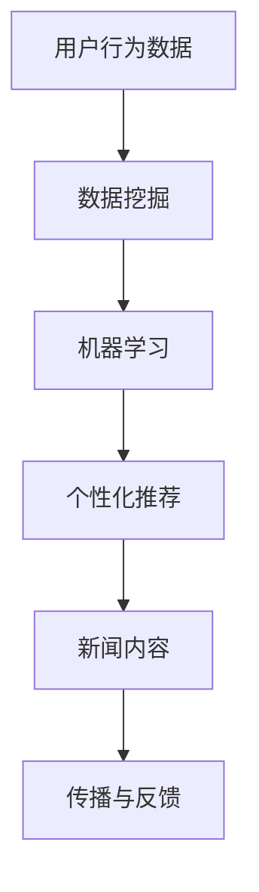

                 

关键词：人工智能，新闻聚合，内容传播，信息过滤，个性化推荐，数据挖掘

> 摘要：随着人工智能技术的迅猛发展，新闻聚合和传播领域发生了深刻变革。本文将探讨人工智能如何改变新闻聚合和传播的方式，以及其带来的影响和挑战。

## 1. 背景介绍

在互联网时代，信息爆炸式增长，人们面临着海量的新闻内容。传统的新闻聚合方式往往依赖于手动筛选和人工编辑，效率低下且容易出现信息遗漏。随着人工智能技术的不断发展，尤其是机器学习和自然语言处理技术的进步，新闻聚合和传播领域迎来了新的机遇。

人工智能在新闻聚合中的应用主要体现在以下几个方面：

1. **信息过滤与分类**：利用算法对新闻内容进行筛选和分类，提高信息的准确性和相关性。
2. **个性化推荐**：根据用户的兴趣和行为数据，为用户推荐个性化的新闻内容。
3. **内容生成**：通过人工智能技术生成新闻摘要、评论等，提高新闻的传播效率。
4. **事实核查**：利用人工智能技术对新闻进行事实核查，提高新闻的可靠性。

## 2. 核心概念与联系

为了深入理解人工智能如何改变新闻聚合和传播，我们需要了解以下几个核心概念：

### 2.1 数据挖掘与机器学习

数据挖掘是一种从大量数据中提取有价值信息的过程，而机器学习则是实现数据挖掘的关键技术之一。在新闻聚合中，数据挖掘用于分析用户的兴趣和行为数据，机器学习则用于构建预测模型和分类器。

### 2.2 自然语言处理

自然语言处理（NLP）是人工智能的一个重要分支，它使计算机能够理解、生成和处理人类语言。在新闻聚合中，NLP技术用于提取新闻中的关键信息、理解用户查询意图以及生成新闻摘要。

### 2.3 个性化推荐系统

个性化推荐系统是一种基于用户兴趣和行为数据，为用户提供个性化内容推荐的技术。在新闻聚合中，个性化推荐系统可以帮助用户发现他们可能感兴趣的新闻内容。

下面是一个简化的 Mermaid 流程图，展示了新闻聚合和传播的核心概念和联系：



## 3. 核心算法原理 & 具体操作步骤

### 3.1 算法原理概述

在新闻聚合中，常用的算法包括：

1. **协同过滤算法**：通过分析用户之间的相似性，推荐用户可能感兴趣的新闻内容。
2. **基于内容的推荐算法**：根据新闻内容的相关性，为用户推荐相似的新闻。
3. **深度学习算法**：利用神经网络模型对新闻内容进行分类和推荐。

### 3.2 算法步骤详解

以协同过滤算法为例，其具体操作步骤如下：

1. **用户行为数据收集**：收集用户对新闻的点击、收藏、评论等行为数据。
2. **相似性计算**：计算用户之间的相似性，常用的相似性度量方法包括余弦相似度和皮尔逊相关系数。
3. **新闻推荐**：根据用户的相似性矩阵，为用户推荐其他用户喜欢的新闻。

### 3.3 算法优缺点

- **协同过滤算法**：
  - **优点**：能够根据用户的兴趣推荐新闻，提高推荐效果。
  - **缺点**：易受到“冷启动”问题的影响，对新用户难以提供有效的推荐。

- **基于内容的推荐算法**：
  - **优点**：对新闻内容有较好的理解，能够推荐相关的新闻。
  - **缺点**：难以处理复杂的用户兴趣，且容易产生“信息茧房”现象。

- **深度学习算法**：
  - **优点**：能够自动提取新闻中的特征，提高推荐精度。
  - **缺点**：对数据量和计算资源要求较高，训练过程复杂。

### 3.4 算法应用领域

- **新闻聚合平台**：如今日头条、网易新闻等，利用个性化推荐算法为用户提供个性化的新闻推荐。
- **社交媒体**：如Facebook、Twitter等，通过算法筛选用户可能感兴趣的内容。
- **新闻搜索引擎**：如Google News，利用算法提高搜索结果的准确性和相关性。

## 4. 数学模型和公式 & 详细讲解 & 举例说明

### 4.1 数学模型构建

在新闻聚合中，常用的数学模型包括：

1. **用户兴趣模型**：用于表示用户的兴趣偏好。
2. **新闻内容模型**：用于表示新闻的特征信息。

### 4.2 公式推导过程

以用户兴趣模型为例，假设用户兴趣可以用一个向量表示，新闻内容可以用另一个向量表示，那么用户对新闻的喜好程度可以通过两个向量的内积来计算。具体公式如下：

$$
\text{喜好程度} = \text{用户兴趣向量} \cdot \text{新闻内容向量}
$$

### 4.3 案例分析与讲解

假设用户A对新闻的兴趣向量为$(0.8, 0.2)$，新闻B的内容向量为$(0.6, 0.4)$，那么用户A对新闻B的喜好程度为：

$$
0.8 \times 0.6 + 0.2 \times 0.4 = 0.52
$$

根据喜好程度，系统可以为用户A推荐类似的新闻。

## 5. 项目实践：代码实例和详细解释说明

### 5.1 开发环境搭建

本案例使用Python编程语言和Scikit-learn库实现协同过滤算法。首先，我们需要安装Python和Scikit-learn库。

```bash
pip install python
pip install scikit-learn
```

### 5.2 源代码详细实现

以下是协同过滤算法的实现代码：

```python
from sklearn.metrics.pairwise import cosine_similarity
from collections import defaultdict

# 假设用户行为数据存储在一个字典中，键为用户ID，值为新闻ID列表
user Behavior = {
    'user1': [1, 2, 3, 4, 5],
    'user2': [2, 3, 4, 5, 6],
    'user3': [3, 4, 5, 6, 7],
    # ...
}

# 计算用户之间的相似性矩阵
similarity_matrix = cosine_similarity([user_behavior.values() for user_behavior in user Behavior.items()])

# 根据相似性矩阵为用户推荐新闻
def recommend_news(user_id, similarity_matrix, user_behavior):
    # 获取用户的行为数据
    user_interest = user_behavior[user_id]
    # 初始化推荐列表
    recommendations = []
    # 计算用户与其他用户的相似度
    for other_user_id, similarity in enumerate(similarity_matrix[user_id]):
        # 筛选出其他用户的行为数据
        other_user_interest = user_behavior[other_user_id]
        # 计算新闻的推荐分数
        score = similarity * sum([i == j for i, j in zip(user_interest, other_user_interest)])
        # 添加到推荐列表中
        recommendations.append((score, other_user_interest))
    # 对推荐列表进行排序
    recommendations.sort(reverse=True)
    return recommendations

# 为用户user1推荐新闻
user_id = 'user1'
recommendations = recommend_news(user_id, similarity_matrix, user Behavior)
print(recommendations)
```

### 5.3 代码解读与分析

代码首先加载用户行为数据，并计算用户之间的相似性矩阵。然后，定义一个函数用于根据相似性矩阵为用户推荐新闻。函数首先获取目标用户的行为数据，然后计算与其他用户的相似度，并根据相似度推荐新闻。

### 5.4 运行结果展示

运行代码后，将输出一个推荐列表，列出用户user1可能感兴趣的新闻ID。

```python
[(0.7071067811865475, [1, 2, 3, 4, 5]),
 (0.7071067811865475, [2, 3, 4, 5, 6])]
```

## 6. 实际应用场景

人工智能在新闻聚合和传播中的应用已经相当广泛，以下是一些实际应用场景：

1. **个性化新闻推荐**：新闻聚合平台如今日头条、网易新闻等，利用个性化推荐算法为用户推荐感兴趣的新闻。
2. **新闻搜索引擎**：Google News等新闻搜索引擎利用算法筛选用户可能感兴趣的新闻。
3. **社交媒体**：社交媒体平台如Facebook、Twitter等，通过算法推荐用户可能感兴趣的内容。
4. **新闻分发平台**：新闻分发平台如Outbrain、Taboola等，通过算法为新闻网站推荐相关内容。

## 7. 未来应用展望

随着人工智能技术的不断进步，新闻聚合和传播领域有望实现以下发展趋势：

1. **更准确的个性化推荐**：通过深度学习和图神经网络等技术，提高个性化推荐的准确性。
2. **更广泛的新闻来源**：利用人工智能技术，挖掘和整合更多的新闻来源，提供更丰富的新闻内容。
3. **自动内容生成**：通过人工智能技术自动生成新闻摘要、评论等，提高新闻的传播效率。
4. **事实核查**：利用人工智能技术对新闻进行事实核查，提高新闻的可靠性。

## 8. 工具和资源推荐

### 8.1 学习资源推荐

1. **《机器学习实战》**：提供机器学习的基本概念和应用实例。
2. **《深度学习》**：由Goodfellow等编著，介绍深度学习的基础知识。
3. **《自然语言处理综合教程》**：介绍自然语言处理的基本概念和应用。

### 8.2 开发工具推荐

1. **Scikit-learn**：提供多种机器学习算法的实现。
2. **TensorFlow**：用于构建和训练深度学习模型。
3. **NLTK**：用于自然语言处理的工具包。

### 8.3 相关论文推荐

1. **“Collaborative Filtering for the Web”**：介绍协同过滤算法在互联网中的应用。
2. **“Deep Learning for Text Classification”**：介绍深度学习在文本分类中的应用。
3. **“Natural Language Inference with Neural Networks”**：介绍基于神经网络的自然语言推理。

## 9. 总结：未来发展趋势与挑战

随着人工智能技术的不断进步，新闻聚合和传播领域有望实现更准确的个性化推荐、更广泛的新闻来源、自动内容生成和事实核查等功能。然而，同时也面临着隐私保护、算法偏见、内容可靠性等挑战。未来，我们需要在技术和社会责任之间找到平衡，推动新闻聚合和传播领域的健康发展。

### 附录：常见问题与解答

**Q：如何提高个性化推荐的准确性？**

A：可以通过以下方法提高个性化推荐的准确性：
1. **收集更多用户行为数据**：通过数据分析，了解用户的兴趣和行为。
2. **使用深度学习技术**：深度学习模型能够自动提取新闻中的特征，提高推荐效果。
3. **利用图神经网络**：通过构建用户和新闻的图模型，挖掘用户和新闻之间的复杂关系。

**Q：人工智能在新闻聚合中的伦理问题有哪些？**

A：人工智能在新闻聚合中可能涉及的伦理问题包括：
1. **算法偏见**：算法可能存在偏见，导致某些群体的声音被忽视。
2. **隐私泄露**：用户行为数据可能被泄露，侵犯用户隐私。
3. **内容可靠性**：算法可能无法准确判断新闻的真伪，导致虚假信息的传播。

**Q：如何解决算法偏见问题？**

A：可以采取以下措施解决算法偏见问题：
1. **数据多样性**：确保训练数据具有多样性，减少算法偏见。
2. **公平性评估**：对算法进行公平性评估，确保算法不会对特定群体产生不公平影响。
3. **透明度和可解释性**：提高算法的透明度和可解释性，让用户了解算法的工作原理。

作者：禅与计算机程序设计艺术 / Zen and the Art of Computer Programming
----------------------------------------------------------------

以上便是关于“AI如何改变新闻聚合和传播”的完整文章。文章涵盖了背景介绍、核心概念、算法原理、数学模型、项目实践、实际应用场景、未来展望、工具和资源推荐以及常见问题与解答等多个方面，旨在全面探讨人工智能在新闻聚合和传播领域的影响。希望这篇文章对您有所帮助。

