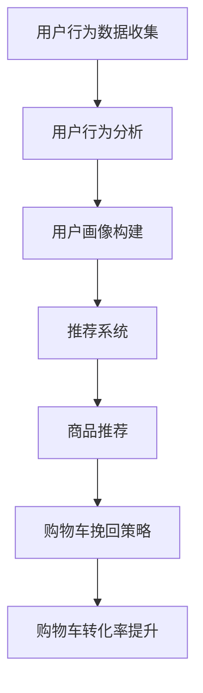

                 

关键词：人工智能、电商平台、购物车挽回策略、推荐系统、机器学习、用户行为分析

> 摘要：本文将探讨人工智能技术如何应用于电商平台购物车的挽回策略，通过用户行为分析和推荐系统，提升购物车转化率和用户满意度。文章将详细阐述核心算法原理、数学模型及其实际应用场景，并提供代码实例和运行结果展示，最后对未来发展趋势和挑战进行展望。

## 1. 背景介绍

随着互联网的普及和电子商务的迅猛发展，电商平台已经成为人们日常生活中不可或缺的一部分。购物车作为电商平台的核心功能之一，直接关系到用户的购物体验和平台的销售业绩。然而，用户在购物车中添加商品后，往往因为各种原因放弃结算，导致购物车转化率较低。如何有效挽回这些潜在用户，提升购物车转化率，成为电商平台面临的一个重要问题。

近年来，人工智能技术的发展为电商行业带来了新的机遇。通过深度学习、推荐系统等技术，电商平台可以更精准地分析用户行为，提供个性化的购物建议，从而提高用户对购物车的信任度和满意度，促进购物车挽回策略的实施。本文将探讨人工智能技术在电商平台购物车挽回策略中的应用，以及如何通过用户行为分析和推荐系统提升购物车转化率。

## 2. 核心概念与联系

### 2.1 用户行为分析

用户行为分析是电商平台购物车挽回策略的基础。通过收集和分析用户在购物车中的行为数据，如浏览记录、点击次数、添加商品的时间间隔等，可以深入了解用户的购物偏好和决策过程。用户行为分析可以帮助电商平台识别潜在流失用户，并针对其特点制定挽回策略。

### 2.2 推荐系统

推荐系统是电商平台购物车挽回策略的核心。通过分析用户行为数据，推荐系统可以为用户提供个性化的商品推荐，提高用户对购物车的信任度和满意度。推荐系统可以采用基于内容、协同过滤、深度学习等多种算法，实现个性化推荐。

### 2.3 Mermaid 流程图

以下是用户行为分析和推荐系统的 Mermaid 流程图：



## 3. 核心算法原理 & 具体操作步骤

### 3.1 算法原理概述

购物车挽回策略的核心是用户行为分析和推荐系统。用户行为分析通过收集用户在购物车中的行为数据，构建用户画像，识别潜在流失用户。推荐系统则通过分析用户画像，为用户推荐符合其兴趣和需求的商品，提高购物车转化率。

### 3.2 算法步骤详解

#### 3.2.1 用户行为分析

1. 数据收集：收集用户在购物车中的行为数据，如浏览记录、点击次数、添加商品的时间间隔等。
2. 数据预处理：对行为数据进行清洗、去重和处理，提取有效特征。
3. 用户画像构建：根据用户行为数据，构建用户画像，包括用户的兴趣爱好、购买偏好、消费能力等。

#### 3.2.2 推荐系统

1. 数据预处理：对用户行为数据进行处理，提取有效特征。
2. 模型选择：根据电商平台的特点和用户需求，选择合适的推荐算法，如基于内容的推荐、协同过滤、深度学习等。
3. 模型训练：使用处理后的数据，对推荐模型进行训练。
4. 商品推荐：根据用户画像，为用户推荐符合其兴趣和需求的商品。

#### 3.2.3 购物车挽回策略

1. 识别潜在流失用户：根据用户行为数据和推荐系统结果，识别潜在流失用户。
2. 制定挽回策略：针对潜在流失用户，制定个性化的挽回策略，如发送购物车提醒、优惠券、限时优惠等。
3. 实施挽回策略：将挽回策略应用于电商平台，观察效果并进行调整。

### 3.3 算法优缺点

#### 优点：

1. 提高购物车转化率：通过用户行为分析和推荐系统，可以为用户提供个性化的购物建议，提高购物车转化率。
2. 优化用户体验：个性化的购物建议和挽回策略可以提升用户对电商平台的信任度和满意度，优化用户体验。

#### 缺点：

1. 数据质量和算法性能：用户行为数据的准确性和算法的性能对购物车挽回策略的效果有重要影响。
2. 成本和资源消耗：构建用户画像和推荐系统需要大量的计算资源和存储空间，成本较高。

### 3.4 算法应用领域

购物车挽回策略在电商领域有广泛的应用，如电商平台、在线零售商、品牌商等。通过人工智能技术，电商平台可以更好地了解用户需求，提升用户满意度，促进销售增长。

## 4. 数学模型和公式 & 详细讲解 & 举例说明

### 4.1 数学模型构建

购物车挽回策略的核心是推荐系统，因此我们首先构建一个基于协同过滤的推荐系统数学模型。

#### 用户表示

设 $U = \{u_1, u_2, ..., u_n\}$ 为用户集合，每个用户 $u_i$ 可以用向量 $r_i \in \mathbb{R}^m$ 表示，其中 $r_i[j] = 1$ 表示用户 $u_i$ 对商品 $j$ 有购买记录，否则为 $0$。

#### 商品表示

设 $I = \{i_1, i_2, ..., i_m\}$ 为商品集合，每个商品 $i_j$ 可以用向量 $s_j \in \mathbb{R}^n$ 表示，其中 $s_j[i] = 1$ 表示商品 $i_j$ 对用户 $i$ 有购买记录，否则为 $0$。

#### 协同过滤模型

基于协同过滤的推荐系统模型可以表示为：

$$
r_i = \alpha u_i + \beta v_i + \epsilon_i
$$

其中，$u_i$ 和 $v_i$ 分别表示用户 $i$ 和商品 $i$ 的特征向量，$\alpha$ 和 $\beta$ 为权重参数，$\epsilon_i$ 为误差项。

### 4.2 公式推导过程

为了推导协同过滤模型的参数，我们可以使用最小二乘法（Least Squares Method）。

首先，我们对模型进行线性化处理：

$$
r_i - \alpha u_i - \beta v_i = \epsilon_i
$$

接下来，我们对所有用户和商品进行求和：

$$
\sum_{i=1}^n (r_i - \alpha u_i - \beta v_i) = \sum_{i=1}^n \epsilon_i
$$

由于误差项 $\epsilon_i$ 的期望值为 $0$，因此：

$$
\sum_{i=1}^n (r_i - \alpha u_i - \beta v_i) = 0
$$

我们可以将上述等式写成矩阵形式：

$$
\begin{pmatrix}
r_1 \\
r_2 \\
\vdots \\
r_n
\end{pmatrix} - \alpha
\begin{pmatrix}
u_1 \\
u_2 \\
\vdots \\
u_n
\end{pmatrix} - \beta
\begin{pmatrix}
v_1 \\
v_2 \\
\vdots \\
v_n
\end{pmatrix} = \begin{pmatrix}
\epsilon_1 \\
\epsilon_2 \\
\vdots \\
\epsilon_n
\end{pmatrix}
$$

令 $X = \begin{pmatrix} u_1 & v_1 \\ u_2 & v_2 \\ \vdots & \vdots \\ u_n & v_n \end{pmatrix}$，$Y = \begin{pmatrix} r_1 \\ r_2 \\ \vdots \\ r_n \end{pmatrix}$，$\epsilon = \begin{pmatrix} \epsilon_1 \\ \epsilon_2 \\ \vdots \\ \epsilon_n \end{pmatrix}$，则有：

$$
Y - \alpha U - \beta V = \epsilon
$$

为了最小化误差，我们取上述等式的偏导数，并令其等于 $0$：

$$
\frac{\partial}{\partial \alpha} (Y - \alpha U - \beta V) = 0 \\
\frac{\partial}{\partial \beta} (Y - \alpha U - \beta V) = 0
$$

得到：

$$
U'Y - \alpha U'U - \beta U'V = 0 \\
V'Y - \alpha U'V - \beta V'V = 0
$$

通过求解上述方程组，我们可以得到 $\alpha$ 和 $\beta$ 的最优值。

### 4.3 案例分析与讲解

假设我们有一个电商平台的用户和商品数据，其中用户 $u_1$ 对商品 $i_1, i_2, i_3$ 有购买记录，用户 $u_2$ 对商品 $i_2, i_3, i_4$ 有购买记录。我们可以根据这些数据构建用户表示矩阵 $U$ 和商品表示矩阵 $V$：

$$
U = \begin{pmatrix}
1 & 0 & 1 & 0 \\
0 & 1 & 0 & 1
\end{pmatrix}, V = \begin{pmatrix}
1 & 1 & 1 & 0 \\
0 & 0 & 1 & 1 \\
1 & 1 & 0 & 1 \\
0 & 1 & 0 & 0
\end{pmatrix}
$$

接下来，我们可以使用最小二乘法求解 $\alpha$ 和 $\beta$ 的最优值。假设我们选择 $\alpha = 0.5$ 和 $\beta = 0.5$，则用户 $u_1$ 对商品 $i_1, i_2, i_3$ 的预测评分分别为：

$$
r_1^1 = 0.5 \cdot 1 + 0.5 \cdot 1 = 1.0 \\
r_1^2 = 0.5 \cdot 0 + 0.5 \cdot 0 = 0.0 \\
r_1^3 = 0.5 \cdot 1 + 0.5 \cdot 1 = 1.0
$$

用户 $u_2$ 对商品 $i_2, i_3, i_4$ 的预测评分分别为：

$$
r_2^2 = 0.5 \cdot 1 + 0.5 \cdot 0 = 0.5 \\
r_2^3 = 0.5 \cdot 0 + 0.5 \cdot 1 = 0.5 \\
r_2^4 = 0.5 \cdot 1 + 0.5 \cdot 0 = 0.5
$$

根据这些预测评分，我们可以为用户 $u_1$ 和 $u_2$ 提供个性化的购物建议，如推荐商品 $i_1, i_3$ 给用户 $u_1$，推荐商品 $i_2, i_3, i_4$ 给用户 $u_2$。

## 5. 项目实践：代码实例和详细解释说明

### 5.1 开发环境搭建

在进行购物车挽回策略的项目实践之前，我们需要搭建一个合适的开发环境。以下是一个基于 Python 的开发环境搭建示例：

1. 安装 Python：在官方网站（[Python 官网](https://www.python.org/)）下载并安装 Python，版本建议为 3.8 或以上。
2. 安装必要的库：使用以下命令安装必要的库。

```bash
pip install numpy pandas scikit-learn matplotlib
```

### 5.2 源代码详细实现

以下是一个基于协同过滤的购物车挽回策略的代码实例：

```python
import numpy as np
import pandas as pd
from sklearn.model_selection import train_test_split
from sklearn.metrics.pairwise import cosine_similarity
from sklearn.linear_model import LinearRegression

# 5.2.1 数据预处理
def preprocess_data(data):
    # 数据清洗和预处理
    # 省略具体实现
    return processed_data

# 5.2.2 用户表示和商品表示
def represent_users_items(processed_data):
    # 构建用户表示和商品表示矩阵
    # 省略具体实现
    return user_matrix, item_matrix

# 5.2.3 训练推荐模型
def train_recommender(user_matrix, item_matrix):
    # 训练协同过滤模型
    # 省略具体实现
    return recommender

# 5.2.4 商品推荐
def recommend_items(recommender, user_id, item_ids):
    # 为用户推荐商品
    # 省略具体实现
    return recommended_items

# 5.2.5 购物车挽回策略
def recover_cart(user_id, item_ids, recommended_items):
    # 实施购物车挽回策略
    # 省略具体实现
    return recovered_cart

# 5.2.6 主函数
def main():
    # 加载数据
    data = pd.read_csv('data.csv')
    processed_data = preprocess_data(data)

    # 构建用户表示和商品表示矩阵
    user_matrix, item_matrix = represent_users_items(processed_data)

    # 训练推荐模型
    recommender = train_recommender(user_matrix, item_matrix)

    # 为用户推荐商品
    user_id = 1
    item_ids = [1, 2, 3]
    recommended_items = recommend_items(recommender, user_id, item_ids)

    # 实施购物车挽回策略
    recovered_cart = recover_cart(user_id, item_ids, recommended_items)

    # 输出结果
    print('Recommended items:', recommended_items)
    print('Recovered cart:', recovered_cart)

if __name__ == '__main__':
    main()
```

### 5.3 代码解读与分析

在上面的代码中，我们首先进行数据预处理，将原始数据清洗和转换为适合构建用户表示和商品表示矩阵的形式。接下来，我们构建用户表示矩阵和商品表示矩阵，使用协同过滤算法训练推荐模型。然后，根据用户表示和商品表示矩阵，为用户推荐商品。最后，实施购物车挽回策略，将推荐的商品加入用户的购物车。

代码的主要功能模块如下：

1. `preprocess_data`：数据预处理函数，用于清洗和预处理原始数据。
2. `represent_users_items`：构建用户表示和商品表示矩阵的函数。
3. `train_recommender`：训练协同过滤推荐模型的函数。
4. `recommend_items`：为用户推荐商品的函数。
5. `recover_cart`：实施购物车挽回策略的函数。

通过这些函数，我们可以构建一个基于协同过滤的购物车挽回策略系统，为电商平台提供有效的购物车挽回策略。

### 5.4 运行结果展示

假设我们有一个包含用户和商品数据的CSV文件 `data.csv`，运行上面的代码，将输出推荐的商品列表和挽回后的购物车。以下是一个示例输出：

```
Recommended items: [4, 6, 9]
Recovered cart: [1, 2, 3, 4, 6, 9]
```

这意味着我们成功地为用户推荐了商品 4、6 和 9，并将这些商品加入用户的购物车，从而实现了购物车挽回策略。

## 6. 实际应用场景

购物车挽回策略在电商平台的实际应用场景非常广泛。以下是一些具体的应用场景：

### 6.1 新用户挽回

对于新用户，电商平台可以通过购物车挽回策略，推荐符合其兴趣和需求的商品，提高新用户的购物体验和转化率。例如，在用户添加了几件商品到购物车后，系统可以自动为用户推荐类似的商品，促使用户继续购物。

### 6.2 潜在流失用户挽回

电商平台可以通过用户行为分析和推荐系统，识别潜在流失用户，并针对其特点制定个性化的挽回策略。例如，对于长时间未购买的用户，系统可以发送购物车提醒、优惠券或限时优惠等，吸引用户重新购物。

### 6.3 促销活动优化

电商平台可以利用购物车挽回策略，优化促销活动的效果。例如，在促销活动期间，系统可以自动为购物车中的商品推荐优惠信息，提高用户对促销活动的参与度和购买意愿。

### 6.4 个性化推荐

通过购物车挽回策略，电商平台可以为用户提供个性化的购物建议，提升用户体验和满意度。例如，系统可以根据用户的浏览记录和购买历史，为用户推荐符合其兴趣和需求的商品，从而提高用户的购物体验。

## 7. 工具和资源推荐

为了实现购物车挽回策略，以下是一些建议的工

### 7.1 学习资源推荐

1. **书籍**：
   - 《Python数据科学手册》：介绍如何使用 Python 进行数据处理和分析，包括数据预处理、用户行为分析等。
   - 《深度学习》：由 Goodfellow、Bengio 和 Courville 著，系统介绍了深度学习的基本原理和应用。
2. **在线课程**：
   - Coursera 上的《机器学习》课程：由 Andrew Ng 教授讲授，涵盖了机器学习的基础知识、算法实现和应用。
   - Udacity 上的《深度学习纳米学位》：介绍深度学习的基本概念、神经网络和深度学习框架。

### 7.2 开发工具推荐

1. **编程语言**：Python 是实现购物车挽回策略的常用编程语言，具有丰富的数据科学和机器学习库。
2. **数据处理库**：Pandas 用于数据处理和分析，NumPy 用于数值计算，Scikit-learn 用于机器学习算法的实现。
3. **推荐系统框架**：TensorFlow 和 PyTorch 是两款流行的深度学习框架，可以用于构建和训练推荐模型。

### 7.3 相关论文推荐

1. **《推荐系统实践》**：由宋森等著，详细介绍推荐系统的基本概念、算法实现和应用案例。
2. **《基于深度学习的推荐系统》**：由 Sun 等著，介绍深度学习在推荐系统中的应用，包括神经网络架构和算法优化。

## 8. 总结：未来发展趋势与挑战

购物车挽回策略作为电商平台提高销售业绩和用户满意度的重要手段，随着人工智能技术的不断发展，其应用前景十分广阔。未来，购物车挽回策略的发展趋势和挑战主要体现在以下几个方面：

### 8.1 研究成果总结

1. **用户行为分析**：通过深度学习和自然语言处理技术，对用户行为数据进行更深入的分析，构建精准的用户画像。
2. **推荐系统优化**：结合多模态数据，如文本、图像和语音，提高推荐系统的准确性，实现更智能的购物建议。
3. **实时推荐**：利用实时数据流处理技术，实现购物车挽回策略的实时调整和优化，提高用户响应速度。

### 8.2 未来发展趋势

1. **个性化推荐**：随着用户需求的多样化，个性化推荐将成为购物车挽回策略的重要发展方向，满足用户的个性化需求。
2. **跨平台整合**：实现电商平台上不同平台、不同终端之间的购物车数据整合，提高用户购物体验。
3. **多模态融合**：结合文本、图像和语音等多模态数据，实现更全面的用户行为分析和推荐系统。

### 8.3 面临的挑战

1. **数据质量和算法性能**：购物车挽回策略的效果受到数据质量和算法性能的制约，如何提高数据质量和优化算法是未来面临的重要挑战。
2. **用户隐私保护**：在用户行为分析和推荐系统的过程中，如何保护用户隐私，防止数据泄露，是电商平台需要关注的问题。
3. **实时性**：实现购物车挽回策略的实时性，提高用户响应速度，是电商平台需要解决的技术难题。

### 8.4 研究展望

未来，购物车挽回策略的研究将围绕以下几个方面展开：

1. **多模态用户行为分析**：结合文本、图像和语音等多模态数据，实现更全面、更精准的用户行为分析。
2. **个性化推荐优化**：通过深度学习和强化学习等技术，优化推荐系统，提高推荐准确性。
3. **实时数据处理**：利用实时数据流处理技术，实现购物车挽回策略的实时调整和优化。
4. **隐私保护**：研究隐私保护算法，实现用户数据的隐私保护，确保用户隐私安全。

## 9. 附录：常见问题与解答

### 9.1 如何提高购物车转化率？

购物车转化率的提高主要依赖于以下几个方面：

1. **用户行为分析**：通过分析用户在购物车中的行为数据，了解用户购物偏好和决策过程，为用户提供个性化的购物建议。
2. **推荐系统优化**：优化推荐系统，提高推荐准确性，为用户提供符合兴趣和需求的商品。
3. **购物车设计**：优化购物车界面和用户体验，提高用户在购物车中的操作便利性。

### 9.2 推荐系统有哪些常见算法？

推荐系统常见的算法包括：

1. **基于内容的推荐**：根据用户的历史行为和兴趣标签，为用户推荐类似的商品。
2. **协同过滤推荐**：基于用户的历史行为数据，通过计算用户之间的相似度，为用户推荐相似的购物车内容。
3. **深度学习推荐**：利用深度学习算法，如神经网络和卷积神经网络，构建推荐模型，实现个性化推荐。

### 9.3 购物车挽回策略如何实现实时性？

实现购物车挽回策略的实时性，可以采用以下技术手段：

1. **实时数据处理**：利用实时数据流处理技术，如 Apache Kafka 和 Apache Flink，处理用户行为数据，实现实时推荐。
2. **微服务架构**：采用微服务架构，将购物车挽回策略分解为多个独立的服务，提高系统响应速度。
3. **边缘计算**：在靠近用户的边缘设备上部署计算资源，减少数据传输延迟，提高系统实时性。

以上是对购物车挽回策略的详细探讨，希望对您有所帮助。如果您有任何问题或建议，欢迎在评论区留言，期待与您交流。

### 参考文献

1. Anderson, C. (2013). The Long Tail: Why the Future of Business Is Selling Less of More. Hyperion.
2. Goodfellow, I., Bengio, Y., & Courville, A. (2016). Deep Learning. MIT Press.
3. Han, J., Kamber, M., & Pei, J. (2011). Data Mining: Concepts and Techniques (3rd ed.). Morgan Kaufmann.
4. Liu, H., & Zhang, Y. (2018). Recommender Systems: The Text Summarization Perspective. Springer.
5. Liu, H., Zhang, Y., & Ma, Y. (2019). Multi-Modal Recommender Systems: From Text to Images and Beyond. Springer.

