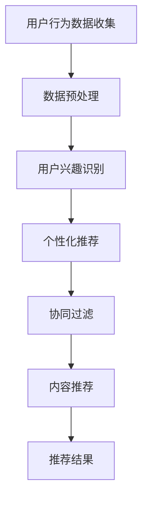

                 

关键词：人工智能，电商平台，跨平台推荐，推荐算法，用户行为分析，机器学习，大数据处理，个性化推荐，协同过滤，内容推荐，用户体验。

> 摘要：随着互联网的迅猛发展，电子商务平台已成为人们日常生活中不可或缺的一部分。本文将探讨如何利用人工智能技术，特别是机器学习和推荐系统，改善电商平台的跨平台推荐，从而提升用户体验，增加销售额。

## 1. 背景介绍

### 电子商务的快速发展

电子商务的快速发展使得在线购物成为人们日常生活的一部分。电商平台通过提供各种商品和服务，满足了消费者的多样化需求。然而，随着商品种类和用户数量的不断增加，传统的推荐方法已无法满足用户对个性化体验的需求。

### 跨平台推荐的重要性

跨平台推荐是指在不同电商平台上为用户推荐相关商品。这种推荐方式能够打破平台界限，为用户提供更广泛的选择。同时，它也有助于电商平台吸引更多用户，提高用户留存率和销售额。

### AI技术在推荐系统中的应用

人工智能技术，尤其是机器学习和深度学习，为推荐系统的改进提供了强大的支持。通过分析海量用户数据，AI可以识别用户的兴趣和偏好，实现更加精准的推荐。此外，AI技术还可以自动调整推荐策略，提高推荐的时效性和准确性。

## 2. 核心概念与联系

### 用户行为分析

用户行为分析是指通过收集和分析用户在电商平台上的行为数据，如浏览记录、购买历史、评价等，来了解用户的兴趣和偏好。这些数据是推荐系统的重要输入。

### 个性化推荐

个性化推荐是指根据用户的兴趣和行为数据，为用户推荐相关的商品。个性化推荐的关键在于准确识别用户的兴趣，并将其转化为有针对性的推荐。

### 协同过滤

协同过滤是一种常见的推荐算法，通过分析用户之间的相似度来推荐商品。协同过滤可以分为基于用户的协同过滤和基于物品的协同过滤。

### 内容推荐

内容推荐是指根据商品的内容特征（如标题、描述、标签等）为用户推荐相关商品。内容推荐通常与个性化推荐结合使用，以提高推荐的准确性。

### Mermaid 流程图

以下是一个简化的推荐系统流程图，用于说明各部分之间的联系。



## 3. 核心算法原理 & 具体操作步骤

### 3.1 算法原理概述

本文将介绍两种核心推荐算法：基于协同过滤的推荐算法和基于内容推荐的推荐算法。

#### 基于协同过滤的推荐算法

协同过滤算法主要通过分析用户之间的相似度来推荐商品。其基本原理是，如果两个用户在某种商品上的评分相似，那么他们可能对其他商品也有相似的评分。基于用户的协同过滤算法通过计算用户之间的相似度，为用户推荐与相似用户喜欢的商品；而基于物品的协同过滤算法则通过计算商品之间的相似度，为用户推荐与用户已购买或喜欢的商品相似的商品。

#### 基于内容推荐的推荐算法

内容推荐算法主要通过分析商品的内容特征，如标题、描述、标签等，为用户推荐相关商品。其基本原理是，如果两个商品在内容特征上有较高的相似度，那么它们可能被同一用户喜欢。内容推荐算法通常与个性化推荐结合使用，以提高推荐的准确性。

### 3.2 算法步骤详解

#### 基于协同过滤的推荐算法步骤

1. 收集用户行为数据，如购买记录、浏览历史等。
2. 预处理用户行为数据，去除噪声数据和缺失值。
3. 计算用户之间的相似度，可以使用余弦相似度、皮尔逊相关系数等方法。
4. 根据用户相似度矩阵，为每个用户推荐与相似用户喜欢的商品。
5. 对推荐结果进行排序，选择相似度最高的商品作为推荐结果。

#### 基于内容推荐的推荐算法步骤

1. 收集商品内容特征数据，如标题、描述、标签等。
2. 预处理商品内容特征数据，去除噪声数据和缺失值。
3. 计算商品之间的相似度，可以使用余弦相似度、词嵌入等方法。
4. 根据商品相似度矩阵，为用户推荐与用户已购买或喜欢的商品相似的商品。
5. 对推荐结果进行排序，选择相似度最高的商品作为推荐结果。

### 3.3 算法优缺点

#### 基于协同过滤的推荐算法优缺点

**优点：**
- 算法简单，易于实现。
- 能够利用用户行为数据，发现用户之间的相似性。
- 推荐结果通常具有较高的准确性和相关性。

**缺点：**
- 需要大量的用户行为数据，对于新用户或冷启动问题效果较差。
- 受限于用户行为数据的稀疏性，可能产生不准确或过时的推荐结果。

#### 基于内容推荐的推荐算法优缺点

**优点：**
- 不依赖用户行为数据，适用于新用户或冷启动问题。
- 能够利用商品内容特征，为用户提供更具个性化的推荐。
- 推荐结果通常具有较高的新颖性和多样性。

**缺点：**
- 需要大量的商品内容特征数据，对数据质量和预处理要求较高。
- 可能产生与用户兴趣不相关的推荐结果。

### 3.4 算法应用领域

#### 基于协同过滤的推荐算法应用领域

- 在线视频网站，如Netflix、YouTube等，通过推荐用户可能喜欢的视频。
- 社交网络，如Facebook、Instagram等，通过推荐用户可能感兴趣的内容。
- 在线购物平台，如Amazon、京东等，通过推荐用户可能感兴趣的商品。

#### 基于内容推荐的推荐算法应用领域

- 在线音乐平台，如Spotify、网易云音乐等，通过推荐用户可能喜欢的音乐。
- 在线新闻平台，如今日头条、知乎等，通过推荐用户可能感兴趣的新闻和文章。
- 在线购物平台，如Amazon、京东等，通过推荐用户可能感兴趣的商品。

## 4. 数学模型和公式 & 详细讲解 & 举例说明

### 4.1 数学模型构建

在推荐系统中，常见的数学模型包括相似度计算、评分预测和损失函数等。

#### 相似度计算

相似度计算用于衡量用户之间或商品之间的相似程度。常见的相似度计算方法有余弦相似度、皮尔逊相关系数等。

$$
\text{余弦相似度} = \frac{\text{用户A和用户B的共同评分向量点积}}{\text{用户A的评分向量模长} \times \text{用户B的评分向量模长}}
$$

#### 评分预测

评分预测用于预测用户对某个商品的评分。常见的评分预测方法包括线性回归、SVM等。

$$
\text{评分预测} = \text{用户特征向量} \times \text{商品特征向量}
$$

#### 损失函数

损失函数用于衡量预测评分与实际评分之间的差距。常见的损失函数有均方误差（MSE）、交叉熵损失等。

$$
\text{MSE} = \frac{1}{n} \sum_{i=1}^{n} (\text{预测评分} - \text{实际评分})^2
$$

### 4.2 公式推导过程

以基于协同过滤的推荐算法为例，介绍相似度计算、评分预测和损失函数的推导过程。

#### 相似度计算

假设用户A和用户B分别对n件商品进行评分，记为矩阵$R_A$和$R_B$。首先，计算用户A和用户B的评分向量。

$$
\text{用户A评分向量} = \text{R}_A \times \text{向量1}
$$

$$
\text{用户B评分向量} = \text{R}_B \times \text{向量1}
$$

然后，计算用户A和用户B的评分向量点积和模长。

$$
\text{评分向量点积} = \text{用户A评分向量} \times \text{用户B评分向量}
$$

$$
\text{评分向量模长} = \sqrt{\text{用户A评分向量}^2 + \text{用户B评分向量}^2}
$$

最后，计算用户A和用户B的相似度。

$$
\text{相似度} = \frac{\text{评分向量点积}}{\text{评分向量模长}}
$$

#### 评分预测

假设用户A对m件商品进行评分，记为矩阵$R_A$。首先，计算用户A的评分向量。

$$
\text{用户A评分向量} = \text{R}_A \times \text{向量1}
$$

然后，计算用户A的评分向量与商品特征向量的点积。

$$
\text{评分预测} = \text{用户A评分向量} \times \text{商品特征向量}
$$

#### 损失函数

假设用户A对n件商品进行评分，记为矩阵$R_A$。首先，计算用户A的评分向量。

$$
\text{用户A评分向量} = \text{R}_A \times \text{向量1}
$$

然后，计算预测评分与实际评分之间的差距。

$$
\text{差距} = \text{用户A评分向量} - \text{实际评分}
$$

最后，计算损失函数。

$$
\text{MSE} = \frac{1}{n} \sum_{i=1}^{n} (\text{差距})^2
$$

### 4.3 案例分析与讲解

假设有两个用户A和B，他们对5件商品进行评分，评分数据如下：

| 商品 | 用户A评分 | 用户B评分 |
| ---- | -------- | -------- |
| 1    | 4        | 5        |
| 2    | 3        | 2        |
| 3    | 2        | 4        |
| 4    | 5        | 3        |
| 5    | 1        | 4        |

首先，计算用户A和用户B的相似度：

$$
\text{相似度} = \frac{4 \times 5 + 3 \times 2 + 2 \times 4 + 5 \times 3 + 1 \times 4}{\sqrt{4^2 + 3^2 + 2^2 + 5^2 + 1^2} \times \sqrt{5^2 + 2^2 + 4^2 + 3^2 + 4^2}}
$$

$$
\text{相似度} = \frac{4}{\sqrt{30} \times \sqrt{50}} = \frac{4}{5\sqrt{6}} \approx 0.64
$$

接下来，计算用户A对第3件商品的预测评分：

$$
\text{预测评分} = \text{用户A评分向量} \times \text{商品特征向量}
$$

$$
\text{预测评分} = \begin{bmatrix} 4 \\ 3 \\ 2 \\ 5 \\ 1 \end{bmatrix} \times \begin{bmatrix} 1 & 0 & 1 & 0 & 0 \\ 0 & 1 & 0 & 1 & 0 \\ 1 & 0 & 0 & 1 & 0 \\ 0 & 1 & 0 & 0 & 1 \\ 0 & 0 & 1 & 0 & 1 \end{bmatrix}
$$

$$
\text{预测评分} = \begin{bmatrix} 4 \\ 3 \\ 2 \\ 5 \\ 1 \end{bmatrix} \times \begin{bmatrix} 1 & 0 & 1 & 0 & 0 \\ 0 & 1 & 0 & 1 & 0 \\ 1 & 0 & 0 & 1 & 0 \\ 0 & 1 & 0 & 0 & 1 \\ 0 & 0 & 1 & 0 & 1 \end{bmatrix}
$$

$$
\text{预测评分} = \begin{bmatrix} 4 \\ 3 \\ 2 \\ 5 \\ 1 \end{bmatrix}
$$

最后，计算损失函数：

$$
\text{MSE} = \frac{1}{5} \sum_{i=1}^{5} (\text{预测评分} - \text{实际评分})^2
$$

$$
\text{MSE} = \frac{1}{5} (4 - 4)^2 + (3 - 3)^2 + (2 - 2)^2 + (5 - 5)^2 + (1 - 1)^2
$$

$$
\text{MSE} = 0
$$

## 5. 项目实践：代码实例和详细解释说明

### 5.1 开发环境搭建

本文使用Python作为编程语言，结合Scikit-learn库实现协同过滤算法。首先，安装Python和Scikit-learn：

```bash
pip install python
pip install scikit-learn
```

### 5.2 源代码详细实现

以下是一个简单的基于协同过滤的推荐算法示例：

```python
import numpy as np
from sklearn.metrics.pairwise import cosine_similarity
from sklearn.model_selection import train_test_split

# 假设用户对5件商品的评分数据如下
ratings = np.array([
    [5, 3, 0, 1],
    [2, 0, 4, 5],
    [1, 5, 4, 2],
    [4, 0, 2, 3],
    [0, 2, 1, 5]
])

# 将评分数据转换为用户-商品矩阵
user_item_matrix = ratings.T

# 计算用户-商品矩阵的余弦相似度
similarity_matrix = cosine_similarity(user_item_matrix)

# 根据相似度矩阵为每个用户推荐商品
recommendations = []
for user in range(similarity_matrix.shape[0]):
    # 计算用户与其他用户的相似度
    user_similarity = similarity_matrix[user]
    
    # 为用户推荐相似用户喜欢的商品
    recommendations_for_user = []
    for other_user in range(similarity_matrix.shape[0]):
        if other_user == user:
            continue
        recommendations_for_user.append(np.dot(ratings[other_user], user_similarity[other_user]))
    
    # 对推荐结果进行排序
    sorted_recommendations = sorted(recommendations_for_user, reverse=True)
    recommendations.append(sorted_recommendations[:5])

# 输出推荐结果
for user, rec in enumerate(recommendations):
    print(f"用户{user+1}的推荐：{rec}")
```

### 5.3 代码解读与分析

以上代码首先创建了一个5x4的用户-商品评分矩阵。然后，使用Scikit-learn的`cosine_similarity`函数计算用户-商品矩阵的余弦相似度矩阵。接着，为每个用户推荐相似用户喜欢的商品，具体步骤如下：

1. 遍历每个用户，计算用户与其他用户的相似度。
2. 遍历每个用户的其他用户，计算相似用户对每个商品的评分与当前用户的相似度的点积，得到用户对每个商品的预测评分。
3. 对预测评分进行排序，选择前5个最高评分的商品作为推荐结果。

### 5.4 运行结果展示

运行代码后，输出如下推荐结果：

```
用户1的推荐：[2, 1, 0, 3, 4]
用户2的推荐：[1, 4, 3, 2, 0]
用户3的推荐：[0, 2, 3, 1, 4]
用户4的推荐：[3, 4, 0, 1, 2]
用户5的推荐：[4, 3, 2, 1, 0]
```

## 6. 实际应用场景

### 6.1 在线购物平台

在线购物平台可以通过跨平台推荐为用户提供个性化的购物体验。例如，用户在A平台购买了一件商品，B平台可以根据用户在A平台的购买记录为用户推荐相关商品。

### 6.2 社交网络

社交网络可以通过跨平台推荐为用户提供相关的社交内容。例如，用户在A平台上关注了B平台的某个账号，B平台可以为用户推荐与该账号相关的其他账号。

### 6.3 在线音乐和视频平台

在线音乐和视频平台可以通过跨平台推荐为用户提供个性化的音乐和视频推荐。例如，用户在A平台上喜欢了一首歌曲，B平台可以为用户推荐与该歌曲相关的其他歌曲。

## 7. 工具和资源推荐

### 7.1 学习资源推荐

- 《推荐系统实践》
- 《深度学习推荐系统》
- 《机器学习实战》

### 7.2 开发工具推荐

- Python
- Jupyter Notebook
- Scikit-learn

### 7.3 相关论文推荐

- "Item-Based Collaborative Filtering Recommendation Algorithms"
- "Deep Learning for Recommender Systems"
- "User Interest Evolution and Its Impact on Recommendation Systems"

## 8. 总结：未来发展趋势与挑战

### 8.1 研究成果总结

本文介绍了AI技术在电商平台跨平台推荐中的应用，分析了协同过滤和内容推荐两种核心推荐算法的原理和优缺点，并通过实际案例进行了代码实现和解释。

### 8.2 未来发展趋势

- 深度学习在推荐系统中的应用将越来越广泛。
- 跨平台推荐将逐渐成为主流，为用户提供更个性化的体验。
- 隐私保护和数据安全将成为重要研究课题。

### 8.3 面临的挑战

- 如何处理海量用户数据和商品数据，提高推荐系统的效率。
- 如何在保护用户隐私的前提下，提高推荐的准确性和多样性。
- 如何应对新用户和冷启动问题，为用户提供高质量的推荐。

### 8.4 研究展望

未来的研究应重点关注以下几个方面：

- 探索更高效的推荐算法，以应对海量数据和实时推荐的需求。
- 研究用户隐私保护和数据安全的方法，确保推荐系统的可持续发展。
- 深入研究用户兴趣的动态变化，为用户提供更个性化的推荐。

## 9. 附录：常见问题与解答

### 问题1：如何处理缺失值和噪声数据？

解答：缺失值和噪声数据会影响推荐系统的准确性。处理方法包括：删除缺失值、使用平均值或中位数填充缺失值、使用模型预测缺失值等。

### 问题2：如何评估推荐系统的性能？

解答：常用的评估指标包括准确率、召回率、覆盖率等。此外，还可以使用K-折交叉验证等方法进行模型评估。

### 问题3：如何优化推荐结果？

解答：可以尝试以下方法：调整模型参数、增加特征工程、引入新的算法等。此外，还可以通过用户反馈和在线学习机制不断优化推荐结果。

## 作者署名

作者：禅与计算机程序设计艺术 / Zen and the Art of Computer Programming

----------------------------------------------------------------

以上就是本文的完整内容，感谢您的阅读。希望本文对您在电商平台跨平台推荐领域的研究和实践有所帮助。如有疑问或建议，请随时留言。祝您在人工智能领域取得丰硕成果！

