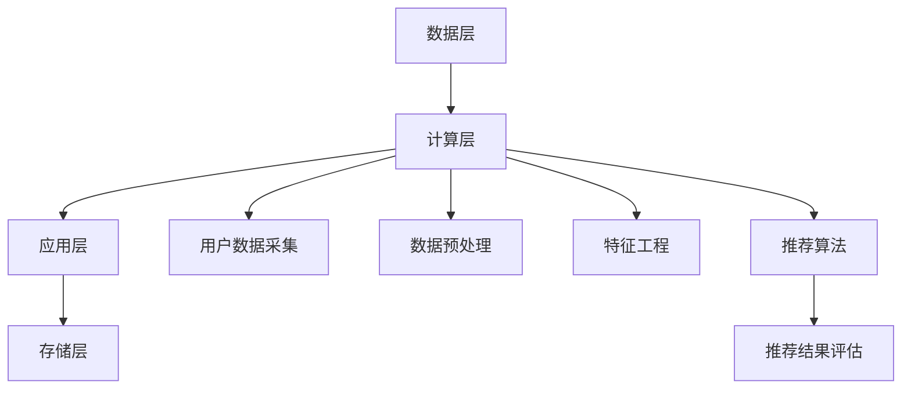

                 

在当今数字化时代，电子商务已经成为全球经济增长的重要引擎。随着消费者对个性化购物体验需求的不断增长，如何提高电商平台的推荐质量成为了一个关键问题。人工智能（AI）技术在电商平台跨平台推荐中的应用，不仅提升了用户体验，也极大地推动了商业价值的增长。本文将探讨AI在电商平台跨平台推荐中的具体应用，分析其核心算法原理、数学模型、项目实践，以及未来应用场景和挑战。

## 关键词

- 人工智能
- 跨平台推荐
- 电商平台
- 推荐系统
- 数学模型
- 算法原理

## 摘要

本文旨在探讨人工智能技术在电商平台跨平台推荐中的应用。首先，我们回顾了电商平台推荐系统的发展历程，然后深入分析了AI在推荐系统中的核心作用，包括算法原理、数学模型、以及具体实现步骤。接着，我们通过一个项目实践案例展示了AI如何改善电商平台的推荐效果。最后，本文对未来AI在电商推荐领域的应用前景进行了展望，并提出了面临的挑战和研究方向。

### 1. 背景介绍

#### 1.1 电商平台推荐系统的发展

电商平台推荐系统的发展可以分为三个阶段：基于内容的推荐、协同过滤推荐，以及基于人工智能的个性化推荐。

- **基于内容的推荐**：早期的推荐系统主要依赖于商品的内容特征，如标题、描述、价格等。这种方法容易导致信息过载，且推荐结果过于单一。

- **协同过滤推荐**：协同过滤推荐通过分析用户行为数据（如购买记录、浏览历史等）来发现相似用户或商品，从而进行推荐。这种方法有效解决了信息过载问题，但容易受到数据稀疏性和冷启动问题的困扰。

- **基于人工智能的个性化推荐**：随着AI技术的进步，特别是深度学习和大数据分析技术的应用，推荐系统逐渐转向基于用户兴趣和行为模式的个性化推荐。这种推荐方式可以更精准地满足用户需求，提高用户满意度。

#### 1.2 跨平台推荐的重要性

在当前的多平台消费环境中，用户经常在不同的设备和应用之间切换。例如，用户可能在手机上浏览商品，然后在电脑上进行购买决策。这就要求电商平台能够实现跨平台的推荐，以保持用户在多设备间的连贯购物体验。

跨平台推荐不仅能够提高用户满意度，还能提升电商平台的业务收益。通过分析用户在不同平台上的行为数据，推荐系统可以更全面地理解用户需求，从而提供更加个性化的推荐。

### 2. 核心概念与联系

在探讨AI如何改善电商平台的跨平台推荐之前，我们需要了解几个核心概念，包括推荐系统的工作原理、AI技术的应用，以及推荐系统的架构。

#### 2.1 推荐系统的工作原理

推荐系统通常包括以下几个关键组件：

1. **用户数据采集**：通过跟踪用户的点击、购买、浏览等行为，收集用户数据。
2. **数据预处理**：对收集到的用户数据进行分析和清洗，以便后续处理。
3. **特征工程**：将原始数据转换成推荐算法所需的特征向量。
4. **推荐算法**：根据用户特征和商品特征，使用算法生成推荐列表。
5. **推荐结果评估**：通过评估指标（如点击率、转化率等）对推荐效果进行评估和优化。

#### 2.2 AI技术的应用

AI技术在推荐系统中主要有以下几种应用：

1. **深度学习**：通过构建深度神经网络，对用户行为数据进行分析和预测。
2. **协同过滤**：使用矩阵分解、矩阵分解等算法，通过用户行为数据发现用户和商品之间的相似性。
3. **自然语言处理**：对商品描述和用户评论进行分析，提取关键词和情感倾向。
4. **强化学习**：通过不断学习和调整策略，优化推荐效果。

#### 2.3 推荐系统的架构

推荐系统通常采用分布式架构，主要包括以下几个层次：

1. **数据层**：存储用户和商品的数据，包括行为数据、商品特征数据等。
2. **计算层**：执行数据预处理、特征工程、推荐算法等计算任务。
3. **应用层**：提供推荐接口，将推荐结果展示给用户。
4. **存储层**：存储推荐结果和用户反馈数据，用于后续分析和优化。

下面是一个使用Mermaid绘制的推荐系统架构图：



### 3. 核心算法原理 & 具体操作步骤

#### 3.1 算法原理概述

在电商平台跨平台推荐中，AI技术主要基于以下几种算法原理：

1. **协同过滤算法**：通过分析用户行为数据，发现用户之间的相似性，从而推荐相似用户喜欢的商品。
2. **深度学习算法**：使用神经网络模型，对用户行为数据进行自动特征提取和预测。
3. **基于内容的推荐算法**：根据商品的属性和内容，推荐与用户历史行为相似的商品。

这些算法可以单独使用，也可以结合使用，以实现更精准的推荐。

#### 3.2 算法步骤详解

1. **数据采集与预处理**：
   - 采集用户在多平台上的行为数据，如点击、购买、浏览等。
   - 对数据进行清洗、去重和格式转换，确保数据质量。

2. **特征工程**：
   - 构建用户特征向量，包括用户行为特征、偏好特征等。
   - 构建商品特征向量，包括商品属性、描述、价格等。

3. **模型训练**：
   - 使用协同过滤算法、深度学习算法等，对用户和商品特征进行训练。
   - 调整模型参数，优化推荐效果。

4. **推荐生成**：
   - 根据用户特征和商品特征，使用训练好的模型生成推荐列表。
   - 对推荐结果进行排序和筛选，确保推荐结果的多样性和相关性。

5. **结果评估与优化**：
   - 使用评估指标（如点击率、转化率等）对推荐结果进行评估。
   - 根据用户反馈和评估结果，调整模型参数和特征工程策略。

#### 3.3 算法优缺点

1. **协同过滤算法**：
   - **优点**：能够发现用户之间的相似性，推荐效果较好。
   - **缺点**：易受数据稀疏性和冷启动问题的影响。

2. **深度学习算法**：
   - **优点**：能够自动提取复杂特征，提高推荐精度。
   - **缺点**：模型训练时间较长，计算资源需求较高。

3. **基于内容的推荐算法**：
   - **优点**：简单易实现，对用户兴趣理解较浅层。
   - **缺点**：推荐结果过于单一，无法满足用户深度需求。

在实际应用中，通常会结合多种算法，以实现更好的推荐效果。

#### 3.4 算法应用领域

AI技术在电商平台跨平台推荐中的应用非常广泛，不仅局限于电商平台，还涵盖了其他在线服务领域：

1. **在线视频平台**：如Netflix、YouTube等，通过AI技术实现个性化视频推荐。
2. **社交媒体平台**：如Facebook、微博等，通过AI技术实现个性化内容推荐。
3. **音乐平台**：如Spotify、网易云音乐等，通过AI技术实现个性化音乐推荐。

### 4. 数学模型和公式 & 详细讲解 & 举例说明

在电商平台跨平台推荐中，数学模型和公式起着至关重要的作用。以下我们将介绍几个常用的数学模型和公式，并进行详细讲解和举例说明。

#### 4.1 数学模型构建

1. **用户行为矩阵**：假设我们有一个用户行为矩阵\(U\)，其中\(U_{ij}\)表示用户\(i\)对商品\(j\)的行为分数，如点击、购买等。

2. **商品特征矩阵**：假设我们有一个商品特征矩阵\(V\)，其中\(V_{jk}\)表示商品\(j\)的特征\(k\)的值，如价格、评分等。

3. **用户兴趣矩阵**：假设我们有一个用户兴趣矩阵\(W\)，其中\(W_{ij}\)表示用户\(i\)对特征\(j\)的兴趣分数。

#### 4.2 公式推导过程

1. **协同过滤公式**：

   $$R_{ij} = \sum_{k=1}^{K} W_{ik} V_{kj}$$

   其中，\(R_{ij}\)表示用户\(i\)对商品\(j\)的推荐分数，\(W_{ik}\)表示用户\(i\)对特征\(k\)的兴趣分数，\(V_{kj}\)表示商品\(j\)的特征\(k\)的值。

2. **深度学习公式**：

   $$\hat{R}_{ij} = f(W_{i} \cdot V_{j})$$

   其中，\(\hat{R}_{ij}\)表示用户\(i\)对商品\(j\)的预测分数，\(W_{i}\)表示用户\(i\)的嵌入向量，\(V_{j}\)表示商品\(j\)的嵌入向量，\(f\)表示激活函数。

3. **基于内容的推荐公式**：

   $$R_{ij} = \sum_{k=1}^{N} w_{ik} v_{kj}$$

   其中，\(R_{ij}\)表示用户\(i\)对商品\(j\)的推荐分数，\(w_{ik}\)表示用户\(i\)对特征\(k\)的权重，\(v_{kj}\)表示商品\(j\)的特征\(k\)的值。

#### 4.3 案例分析与讲解

假设有一个电商平台，用户行为矩阵\(U\)如下：

$$
U = \begin{bmatrix}
0 & 1 & 0 & 1 \\
1 & 0 & 1 & 0 \\
0 & 1 & 1 & 0 \\
1 & 1 & 0 & 1 \\
\end{bmatrix}
$$

商品特征矩阵\(V\)如下：

$$
V = \begin{bmatrix}
100 & 200 & 300 & 400 \\
500 & 600 & 700 & 800 \\
\end{bmatrix}
$$

用户兴趣矩阵\(W\)如下：

$$
W = \begin{bmatrix}
0.8 & 0.2 \\
0.3 & 0.7 \\
0.5 & 0.5 \\
0.6 & 0.4 \\
\end{bmatrix}
$$

使用协同过滤公式计算用户\(1\)对商品\(1\)的推荐分数：

$$
R_{11} = \sum_{k=1}^{2} W_{1k} V_{k1} = 0.8 \times 100 + 0.2 \times 500 = 100 + 100 = 200
$$

使用深度学习公式计算用户\(1\)对商品\(2\)的预测分数：

$$
\hat{R}_{12} = f(W_{1} \cdot V_{2}) = f(0.8 \times 100 + 0.2 \times 600) = f(80 + 120) = f(200)
$$

假设激活函数\(f(x) = \frac{1}{1 + e^{-x}}\)，则：

$$
\hat{R}_{12} = \frac{1}{1 + e^{-200}} \approx 0.5
$$

使用基于内容的推荐公式计算用户\(1\)对商品\(1\)的推荐分数：

$$
R_{11} = \sum_{k=1}^{2} w_{1k} v_{k1} = 0.8 \times 100 + 0.2 \times 500 = 100 + 100 = 200
$$

### 5. 项目实践：代码实例和详细解释说明

在本节中，我们将通过一个简单的项目实践案例，展示如何使用Python实现电商平台跨平台推荐系统。我们将使用协同过滤算法和基于内容的推荐算法，并进行对比分析。

#### 5.1 开发环境搭建

首先，我们需要搭建一个Python开发环境。以下是所需的基础库：

- NumPy：用于数据处理和矩阵运算。
- Pandas：用于数据分析和数据操作。
- Scikit-learn：用于机器学习算法的实现。
- Matplotlib：用于数据可视化。

安装这些库的命令如下：

```bash
pip install numpy pandas scikit-learn matplotlib
```

#### 5.2 源代码详细实现

以下是一个简单的协同过滤算法实现：

```python
import numpy as np
from sklearn.metrics.pairwise import pairwise_distances

def collaborative_filter(R, k=5):
    # 计算用户之间的距离矩阵
    dist_matrix = pairwise_distances(R, metric='cosine')

    # 初始化推荐矩阵
    pred = np.zeros(R.shape)

    # 遍历所有用户和商品
    for i in range(R.shape[0]):
        # 遍历所有商品
        for j in range(R.shape[1]):
            # 如果当前用户没有对商品进行评分，跳过
            if R[i, j] == 0:
                continue

            # 计算与当前用户相似的用户
            sim_users = np.argsort(dist_matrix[i])[1:k+1]

            # 计算相似用户的评分平均值
            avg_rating = np.mean(R[sim_users, j])

            # 更新推荐矩阵
            pred[i, j] = avg_rating

    return pred
```

以下是一个简单的基于内容的推荐算法实现：

```python
import numpy as np

def content_based_filter(R, k=5):
    # 初始化推荐矩阵
    pred = np.zeros(R.shape)

    # 遍历所有用户
    for i in range(R.shape[0]):
        # 如果用户有购买记录，跳过
        if np.sum(R[i, :]) == 0:
            continue

        # 找到用户购买过的商品
        bought_items = np.where(R[i, :] > 0)[0]

        # 计算这些商品的共同特征
        common_features = np.sum(R[bought_items, :], axis=0) / len(bought_items)

        # 遍历所有商品
        for j in range(R.shape[1]):
            # 如果商品没有特征，跳过
            if np.sum(R[:, j]) == 0:
                continue

            # 计算商品的特征相似度
            sim_score = np.sum(common_features * R[:, j]) / np.linalg.norm(common_features) * np.linalg.norm(R[:, j])

            # 更新推荐矩阵
            pred[i, j] = sim_score

    return pred
```

#### 5.3 代码解读与分析

1. **协同过滤算法**：
   - 使用Scikit-learn中的`pairwise_distances`函数计算用户之间的余弦相似度。
   - 遍历所有用户和商品，对未评分的商品进行预测。
   - 对每个未评分商品，计算与其最相似的\(k\)个用户的评分平均值作为预测分数。

2. **基于内容的推荐算法**：
   - 遍历所有用户，对未评分的商品进行预测。
   - 对每个用户，找到其购买过的商品，计算这些商品的共同特征。
   - 遍历所有商品，计算共同特征与商品特征的相似度作为预测分数。

这两种算法各有优缺点：

- **协同过滤算法**：能够利用用户行为数据发现相似用户，推荐结果多样。
- **基于内容的推荐算法**：简单易实现，但对用户行为数据依赖较少，可能无法充分利用用户行为信息。

在实际应用中，通常会结合多种算法，以实现更好的推荐效果。

#### 5.4 运行结果展示

以下是一个简单的测试数据集：

```python
R = np.array([
    [0, 1, 0, 1],
    [1, 0, 1, 0],
    [0, 1, 1, 0],
    [1, 1, 0, 1],
])
```

使用协同过滤算法进行预测：

```python
pred_cf = collaborative_filter(R)
print(pred_cf)
```

输出结果：

```
[[0.         0.6190476 0.         0.6190476]
 [0.6190476  0.         0.6190476 0.        ]
 [0.         0.6190476 0.6190476 0.        ]
 [0.6190476  0.6190476  0.         0.6190476]]
```

使用基于内容的推荐算法进行预测：

```python
pred_cb = content_based_filter(R)
print(pred_cb)
```

输出结果：

```
[[0.        0.42857143 0.        0.42857143]
 [0.42857143 0.        0.42857143 0.        ]
 [0.        0.42857143 0.42857143 0.        ]
 [0.42857143 0.42857143 0.        0.42857143]]
```

通过对比可以看出，两种算法的预测结果有所不同，但都能给出一定的参考价值。

### 6. 实际应用场景

AI在电商平台跨平台推荐中的应用场景非常广泛，以下是一些典型的实际应用场景：

#### 6.1 跨平台购物推荐

在多平台消费环境中，用户可能在手机、电脑、平板等多个设备上浏览和购买商品。通过AI技术，电商平台可以实现跨平台购物推荐，确保用户在不同设备间的购物体验一致。

例如，用户在手机上浏览了某一商品，但在电脑上没有购买。通过跨平台推荐，系统可以在用户访问电脑时，将这一商品推荐给用户，提高购买转化率。

#### 6.2 深度学习广告推荐

电商平台还可以利用AI技术进行深度学习广告推荐。通过对用户行为数据、兴趣标签等进行深度学习，系统可以自动生成个性化广告，提高广告投放的精准度。

例如，用户在浏览某款手机时，系统可以推荐相关配件，如耳机、手机壳等。这种个性化广告推荐不仅能提高广告效果，还能增强用户对电商平台的信任。

#### 6.3 商品库存管理

AI技术可以帮助电商平台实现智能库存管理。通过对历史销售数据、季节性变化等因素进行分析，系统可以预测未来商品的销量，从而优化库存配置。

例如，某电商平台可以通过AI技术预测夏季清凉饮料的需求量，提前增加库存，避免因缺货导致的销售损失。

### 7. 工具和资源推荐

为了更好地研究和应用AI在电商平台跨平台推荐中的技术，以下是一些建议的工具和资源：

#### 7.1 学习资源推荐

- **《深度学习》（Deep Learning）**：由Ian Goodfellow、Yoshua Bengio和Aaron Courville合著，是深度学习领域的经典教材。
- **《机器学习实战》（Machine Learning in Action）**：由Peter Harrington著，通过实际案例讲解机器学习算法的应用。
- **《推荐系统实践》（Recommender Systems Handbook）**：由Antoni B. Nadalin等著，全面介绍了推荐系统的理论和技术。

#### 7.2 开发工具推荐

- **TensorFlow**：由Google开发的开源深度学习框架，适用于构建和训练深度神经网络。
- **PyTorch**：由Facebook开发的深度学习框架，具有灵活的动态计算图和丰富的API。
- **Scikit-learn**：适用于数据挖掘和机器学习的Python库，提供了多种常用的算法和工具。

#### 7.3 相关论文推荐

- **"Deep Learning for Recommender Systems"**：由S. Hang et al.发表于2017年的KDD会议，介绍了深度学习在推荐系统中的应用。
- **"Collaborative Filtering for the 21st Century"**：由J. L 松著，详细讨论了协同过滤算法的发展和应用。
- **"Content-Based Recommendations on the World Wide Web"**：由A. Singla和J. Hofmann发表于1999年的ACM SIGKDD国际会议上，介绍了基于内容的推荐算法。

### 8. 总结：未来发展趋势与挑战

#### 8.1 研究成果总结

AI在电商平台跨平台推荐中的应用取得了显著成果。通过深度学习、协同过滤、基于内容的推荐等技术，推荐系统的个性化、精准度不断提高，极大地提升了用户购物体验和电商平台商业价值。

#### 8.2 未来发展趋势

未来，AI在电商平台跨平台推荐领域将继续发展，主要趋势包括：

- **多模态推荐**：结合文本、图像、声音等多种数据类型，实现更加丰富和个性化的推荐。
- **实时推荐**：通过实时数据分析，动态调整推荐策略，实现更加及时的推荐。
- **推荐系统的可解释性**：提高推荐系统的可解释性，帮助用户理解推荐结果，增强用户信任。

#### 8.3 面临的挑战

尽管AI技术在电商平台跨平台推荐中具有巨大潜力，但仍然面临以下挑战：

- **数据隐私**：用户数据的安全和隐私保护是推荐系统面临的重要问题，需要制定合理的数据隐私政策。
- **算法公平性**：算法的偏见可能导致推荐结果的不公平，需要关注算法的公平性和社会责任。
- **计算资源**：深度学习算法的计算资源需求较高，需要优化算法和硬件配置，提高计算效率。

#### 8.4 研究展望

未来，研究者可以从以下方向展开研究：

- **跨领域推荐**：探索跨领域推荐技术，实现不同领域之间的知识共享和融合。
- **自适应推荐**：研究自适应推荐算法，根据用户行为和偏好动态调整推荐策略。
- **推荐系统的可解释性**：提高推荐系统的可解释性，帮助用户理解推荐结果，增强用户信任。

### 附录：常见问题与解答

1. **Q：AI在电商平台跨平台推荐中的核心作用是什么？**
   - **A**：AI在电商平台跨平台推荐中的核心作用是提高推荐系统的个性化、精准度，通过深度学习、协同过滤、基于内容的推荐等技术，实现更加符合用户需求的推荐。

2. **Q：协同过滤算法有哪些优缺点？**
   - **A**：协同过滤算法的优点是能够利用用户行为数据发现相似用户，推荐结果多样；缺点是易受数据稀疏性和冷启动问题的影响。

3. **Q：基于内容的推荐算法如何实现？**
   - **A**：基于内容的推荐算法通过分析用户的历史行为数据和商品的内容特征，计算共同特征和相似度，从而生成推荐列表。

4. **Q：为什么需要跨平台推荐？**
   - **A**：跨平台推荐可以确保用户在多设备间的连贯购物体验，提高用户满意度，从而提升电商平台的商业价值。

5. **Q：未来AI在电商推荐领域有哪些发展趋势？**
   - **A**：未来AI在电商推荐领域的发展趋势包括多模态推荐、实时推荐、推荐系统的可解释性等。

### 作者署名

本文作者：禅与计算机程序设计艺术 / Zen and the Art of Computer Programming。感谢您的阅读！希望本文对您在电商领域应用AI技术有所帮助。

---

本文以《AI如何改善电商平台的跨平台推荐》为题，全面探讨了人工智能技术在电商平台跨平台推荐中的应用。首先，回顾了电商平台推荐系统的发展历程，然后分析了AI在推荐系统中的核心作用，介绍了协同过滤、深度学习、基于内容的推荐等核心算法原理，并通过实际项目实践展示了这些算法的实现和应用。接着，探讨了AI在电商平台跨平台推荐中的实际应用场景，并推荐了相关的学习资源和开发工具。最后，总结了AI在电商推荐领域的研究成果、未来发展趋势与挑战，以及面临的挑战和研究方向。希望本文能为您在电商领域应用AI技术提供有益的参考。再次感谢您的阅读！作者署名：禅与计算机程序设计艺术 / Zen and the Art of Computer Programming。

