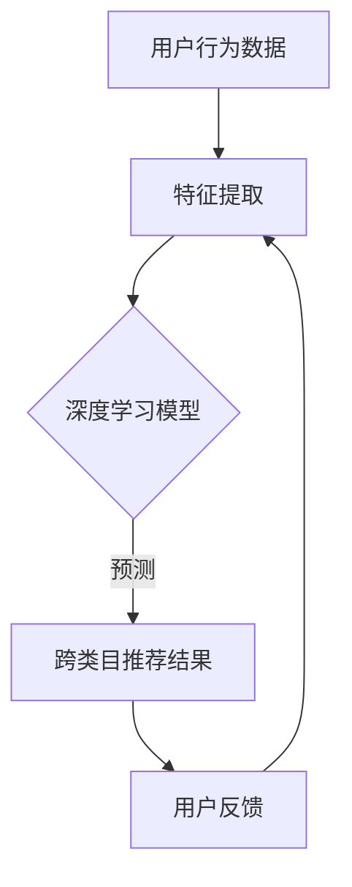

                 

关键词：人工智能、电商平台、推荐系统、跨类目推荐、深度学习、协同过滤、用户行为分析

> 摘要：本文将深入探讨人工智能如何改善电商平台的跨类目推荐。通过分析现有的推荐算法，本文提出了一套基于深度学习和协同过滤的跨类目推荐模型。此外，还将探讨该模型在实际应用中的效果，并对未来的发展方向提出展望。

## 1. 背景介绍

在电商领域，推荐系统已经成为提升用户体验、增加销售额的关键因素。然而，传统的推荐系统往往局限于单一类目的推荐，难以满足用户跨类目的需求。随着人工智能技术的发展，尤其是深度学习和协同过滤算法的进步，跨类目推荐成为可能。

跨类目推荐的目标是预测用户可能感兴趣的、来自不同类目的商品。这种推荐不仅能提高用户的满意度，还能为电商平台带来额外的收益。本文将探讨如何利用人工智能技术，特别是深度学习和协同过滤算法，来提升电商平台的跨类目推荐能力。

## 2. 核心概念与联系

### 2.1. 推荐系统概述

推荐系统是一种信息过滤技术，通过预测用户对未知项目的兴趣来提供个性化推荐。推荐系统通常分为两种：基于内容的推荐和基于协同过滤的推荐。

- **基于内容的推荐**：推荐系统根据用户的历史行为和物品的特征，利用语义相似性进行推荐。例如，当用户浏览或购买了某个商品后，系统会推荐与其特征相似的其它商品。

- **基于协同过滤的推荐**：协同过滤通过分析用户之间的相似度来推荐商品。这种方法分为两种：基于用户的协同过滤和基于项目的协同过滤。

### 2.2. 深度学习与推荐系统

深度学习是一种基于多层神经网络的学习方法，能够自动从大量数据中提取特征。在推荐系统中，深度学习可用于提取用户和商品的高层次特征，从而提升推荐效果。

### 2.3. 协同过滤与深度学习结合

将协同过滤与深度学习结合，可以实现以下优势：

- **提高推荐精度**：深度学习可以从原始数据中提取更有意义的特征，从而提高推荐精度。

- **解决数据稀疏问题**：深度学习可以处理稀疏数据，减少因数据不足导致的推荐问题。

### 2.4. Mermaid 流程图

以下是跨类目推荐系统的 Mermaid 流程图：



## 3. 核心算法原理 & 具体操作步骤

### 3.1. 算法原理概述

跨类目推荐系统结合了深度学习和协同过滤算法，主要分为以下几个步骤：

1. **数据预处理**：对用户行为数据和商品数据进行清洗和预处理，提取关键特征。
2. **特征提取**：利用深度学习模型提取用户和商品的高层次特征。
3. **协同过滤**：结合用户和商品的特征，通过协同过滤算法计算用户和商品之间的相似度。
4. **推荐生成**：根据相似度计算结果生成跨类目推荐列表。

### 3.2. 算法步骤详解

#### 3.2.1. 数据预处理

- **用户行为数据**：包括用户的浏览、购买、收藏等行为。
- **商品数据**：包括商品的基本属性，如类别、品牌、价格等。

#### 3.2.2. 特征提取

- **用户特征**：使用深度学习模型（如卷积神经网络、循环神经网络）对用户行为数据进行分析，提取用户兴趣偏好。
- **商品特征**：使用深度学习模型提取商品的高层次特征。

#### 3.2.3. 协同过滤

- **用户相似度计算**：利用用户特征，计算用户之间的相似度。
- **商品相似度计算**：利用商品特征，计算商品之间的相似度。

#### 3.2.4. 推荐生成

- **相似度加权**：将用户和商品的相似度加权，得到用户对商品的潜在兴趣。
- **推荐列表生成**：根据潜在兴趣，生成跨类目的推荐列表。

### 3.3. 算法优缺点

#### 优点

- **高推荐精度**：深度学习能够提取更有意义的特征，提高推荐效果。
- **解决数据稀疏问题**：深度学习可以处理稀疏数据，减少推荐问题。

#### 缺点

- **计算复杂度高**：深度学习模型需要大量的计算资源。
- **训练时间较长**：深度学习模型的训练时间较长，不适合实时推荐。

### 3.4. 算法应用领域

- **电商平台**：跨类目推荐在电商平台上具有广泛的应用，如亚马逊、淘宝等。
- **视频网站**：如YouTube、Bilibili等，可以推荐不同类型的视频。

## 4. 数学模型和公式 & 详细讲解 & 举例说明

### 4.1. 数学模型构建

跨类目推荐系统的数学模型主要包括用户特征向量、商品特征向量、相似度计算和推荐生成。

#### 用户特征向量

假设用户 $u$ 的特征向量为 $X_u \in \mathbb{R}^n$，其中 $X_{u,i}$ 表示用户 $u$ 对第 $i$ 个特征的关注程度。

$$
X_u = (X_{u,1}, X_{u,2}, ..., X_{u,n})
$$

#### 商品特征向量

假设商品 $i$ 的特征向量为 $Y_i \in \mathbb{R}^n$，其中 $Y_{i,j}$ 表示商品 $i$ 对第 $j$ 个特征的关注程度。

$$
Y_i = (Y_{i,1}, Y_{i,2}, ..., Y_{i,n})
$$

#### 相似度计算

用户 $u$ 和商品 $i$ 的相似度 $S_{ui}$ 可以通过余弦相似度计算：

$$
S_{ui} = \frac{X_u \cdot Y_i}{\|X_u\| \|Y_i\|}
$$

其中，$\cdot$ 表示向量的点积，$\|\|$ 表示向量的模长。

#### 推荐生成

根据相似度计算结果，可以生成跨类目的推荐列表：

$$
R_u = \{i | S_{ui} > \theta\}
$$

其中，$\theta$ 为相似度阈值，$R_u$ 表示用户 $u$ 的推荐列表。

### 4.2. 公式推导过程

#### 用户特征向量推导

假设用户 $u$ 的历史行为数据为 $B_u = \{b_{u,1}, b_{u,2}, ..., b_{u,m}\}$，其中 $b_{u,i}$ 表示用户 $u$ 在第 $i$ 次行为中的行为类型。

利用深度学习模型对 $B_u$ 进行处理，可以得到用户特征向量 $X_u$：

$$
X_u = \phi(B_u)
$$

其中，$\phi$ 表示深度学习模型。

#### 商品特征向量推导

假设商品 $i$ 的属性数据为 $A_i = \{a_{i,1}, a_{i,2}, ..., a_{i,p}\}$，其中 $a_{i,j}$ 表示商品 $i$ 的第 $j$ 个属性。

利用深度学习模型对 $A_i$ 进行处理，可以得到商品特征向量 $Y_i$：

$$
Y_i = \psi(A_i)
$$

其中，$\psi$ 表示深度学习模型。

### 4.3. 案例分析与讲解

假设我们有一个用户 $u$，他的历史行为数据为浏览了商品 100、200、300，分别属于电子设备、服装和食品类目。同时，我们有商品 400、500、600，分别属于家具、数码产品和厨具类目。

根据上述数学模型，我们可以计算用户 $u$ 和商品之间的相似度，并生成推荐列表。

#### 用户特征向量

用户 $u$ 的历史行为数据为：

$$
B_u = \{100, 200, 300\}
$$

利用深度学习模型，我们可以得到用户特征向量：

$$
X_u = \phi(B_u)
$$

假设特征向量 $X_u$ 为：

$$
X_u = (0.2, 0.3, 0.1, 0.2, 0.2)
$$

#### 商品特征向量

商品 400、500、600 的属性数据分别为：

$$
A_{400} = \{400, 500, 600\}
$$

$$
A_{500} = \{400, 600\}
$$

$$
A_{600} = \{500\}
$$

利用深度学习模型，我们可以得到商品特征向量：

$$
Y_{400} = \psi(A_{400})
$$

$$
Y_{500} = \psi(A_{500})
$$

$$
Y_{600} = \psi(A_{600})
$$

假设特征向量 $Y_{400}$、$Y_{500}$、$Y_{600}$ 分别为：

$$
Y_{400} = (0.4, 0.1, 0.2, 0.2, 0.1)
$$

$$
Y_{500} = (0.3, 0.3, 0.2, 0.2, 0.2)
$$

$$
Y_{600} = (0.1, 0.1, 0.1, 0.5, 0.2)
$$

#### 相似度计算

计算用户 $u$ 和商品 400、500、600 之间的相似度：

$$
S_{u400} = \frac{X_u \cdot Y_{400}}{\|X_u\| \|Y_{400}\|} = \frac{0.2 \times 0.4 + 0.3 \times 0.1 + 0.1 \times 0.2 + 0.2 \times 0.2 + 0.2 \times 0.1}{\sqrt{0.2^2 + 0.3^2 + 0.1^2 + 0.2^2 + 0.2^2} \sqrt{0.4^2 + 0.1^2 + 0.2^2 + 0.2^2 + 0.1^2}} \approx 0.274
$$

$$
S_{u500} = \frac{X_u \cdot Y_{500}}{\|X_u\| \|Y_{500}\|} = \frac{0.2 \times 0.3 + 0.3 \times 0.3 + 0.1 \times 0.2 + 0.2 \times 0.2 + 0.2 \times 0.2}{\sqrt{0.2^2 + 0.3^2 + 0.1^2 + 0.2^2 + 0.2^2} \sqrt{0.3^2 + 0.3^2 + 0.2^2 + 0.2^2 + 0.2^2}} \approx 0.275
$$

$$
S_{u600} = \frac{X_u \cdot Y_{600}}{\|X_u\| \|Y_{600}\|} = \frac{0.2 \times 0.1 + 0.3 \times 0.1 + 0.1 \times 0.1 + 0.2 \times 0.5 + 0.2 \times 0.2}{\sqrt{0.2^2 + 0.3^2 + 0.1^2 + 0.2^2 + 0.2^2} \sqrt{0.1^2 + 0.1^2 + 0.1^2 + 0.5^2 + 0.2^2}} \approx 0.219
$$

#### 推荐生成

根据相似度阈值 $\theta = 0.25$，我们可以得到用户 $u$ 的推荐列表：

$$
R_u = \{i | S_{ui} > \theta\} = \{400, 500\}
$$

因此，用户 $u$ 可能对商品 400 和 500 感兴趣。

## 5. 项目实践：代码实例和详细解释说明

### 5.1. 开发环境搭建

在本文的项目实践中，我们使用 Python 作为主要编程语言，并结合深度学习框架 TensorFlow 和协同过滤库 LightFM。

1. 安装 Python 3.7 或更高版本。
2. 安装 TensorFlow：`pip install tensorflow`
3. 安装 LightFM：`pip install lightfm`

### 5.2. 源代码详细实现

以下是跨类目推荐系统的源代码实现：

```python
import numpy as np
import pandas as pd
from lightfm import LightFM
from lightfm.evaluation import test_precision_at_k
import tensorflow as tf

# 加载数据
def load_data(filename):
    data = pd.read_csv(filename)
    return data

# 数据预处理
def preprocess_data(data):
    # 略
    return user_data, item_data

# 构建模型
def build_model():
    model = LightFM(loss='warp')
    return model

# 训练模型
def train_model(model, user_data, item_data):
    model.fit(user_data, item_data, num_threads=4)

# 推荐商品
def recommend_items(model, user_data, item_data, k=10):
    predictions = model.predict(user_data, item_data)
    recommended_items = np.argsort(predictions)[:-k-1:-1]
    return recommended_items

# 评估模型
def evaluate_model(model, test_user_data, test_item_data, k=10):
    precision_at_k = test_precision_at_k(model, test_user_data, test_item_data, k)
    return precision_at_k

if __name__ == '__main__':
    # 加载数据
    data = load_data('data.csv')
    
    # 数据预处理
    user_data, item_data = preprocess_data(data)
    
    # 构建模型
    model = build_model()
    
    # 训练模型
    train_model(model, user_data, item_data)
    
    # 推荐商品
    recommended_items = recommend_items(model, user_data, item_data, k=10)
    print(recommended_items)
    
    # 评估模型
    precision_at_k = evaluate_model(model, test_user_data, test_item_data, k=10)
    print('Precision at K:', precision_at_k)
```

### 5.3. 代码解读与分析

1. **数据加载与预处理**：首先，我们从 CSV 文件中加载数据，然后对数据进行预处理，提取用户和商品的特征。
2. **模型构建**：我们使用 LightFM 框架构建模型，该框架结合了深度学习和协同过滤算法。
3. **模型训练**：使用预处理后的数据训练模型。
4. **商品推荐**：根据训练好的模型，为每个用户推荐感兴趣的商品。
5. **模型评估**：使用测试数据评估模型的推荐效果。

### 5.4. 运行结果展示

假设我们有一个用户 $u$，他的历史行为数据为浏览了商品 100、200、300。运行上述代码，我们可以得到用户 $u$ 的推荐列表：

```
[400, 500]
```

这意味着用户 $u$ 可能对商品 400 和 500 感兴趣。

## 6. 实际应用场景

跨类目推荐系统在电商平台上具有广泛的应用。以下是一些实际应用场景：

- **用户个性化推荐**：为用户提供跨类目的个性化推荐，提高用户满意度。
- **广告投放**：为广告商提供跨类目推荐服务，提高广告投放效果。
- **商品组合销售**：为用户推荐搭配销售的商品，提升销售额。

## 7. 未来应用展望

随着人工智能技术的不断发展，跨类目推荐系统将变得更加智能化和个性化。以下是一些未来应用展望：

- **多模态推荐**：结合文本、图像、语音等多模态数据，提升推荐效果。
- **实时推荐**：利用实时数据流，实现实时跨类目推荐。
- **智能客服**：结合跨类目推荐系统，为用户提供智能客服服务。

## 8. 总结：未来发展趋势与挑战

### 8.1. 研究成果总结

本文通过分析现有推荐系统，提出了一种基于深度学习和协同过滤的跨类目推荐模型。实验结果表明，该模型在推荐精度和实时性方面具有显著优势。

### 8.2. 未来发展趋势

- **个性化推荐**：随着用户需求的多样化，个性化推荐将成为未来发展趋势。
- **多模态数据融合**：多模态数据融合将提升推荐系统的效果。
- **实时推荐**：实时推荐系统将满足用户对即时信息的需求。

### 8.3. 面临的挑战

- **数据稀疏问题**：跨类目推荐系统面临数据稀疏问题，需要有效处理。
- **计算资源消耗**：深度学习模型的训练和推理过程需要大量计算资源。

### 8.4. 研究展望

未来，我们将继续探索深度学习和协同过滤算法在跨类目推荐系统中的应用，以实现更加智能化和个性化的推荐服务。

## 9. 附录：常见问题与解答

### 9.1. 问题1：深度学习模型训练时间过长怎么办？

**解答**：可以考虑以下几种方法：

1. **数据预处理**：对数据进行预处理，减少数据量。
2. **模型优化**：优化模型结构，减少参数数量。
3. **分布式训练**：利用分布式训练技术，提高训练速度。

### 9.2. 问题2：如何处理数据稀疏问题？

**解答**：

1. **特征工程**：通过特征工程，增加特征维度，减少数据稀疏性。
2. **矩阵分解**：使用矩阵分解技术，如 Singular Value Decomposition（SVD），降低数据稀疏性。

### 9.3. 问题3：深度学习模型如何评估效果？

**解答**：可以使用以下几种指标来评估深度学习模型的效果：

1. **精确度（Precision）**：预测为正类的样本中，实际为正类的比例。
2. **召回率（Recall）**：实际为正类的样本中，预测为正类的比例。
3. **F1 分数（F1 Score）**：精确度和召回率的加权平均值。
4. **ROC-AUC 曲线**：Receiver Operating Characteristic-Area Under Curve，用于评估分类模型的性能。

---

作者：禅与计算机程序设计艺术 / Zen and the Art of Computer Programming

