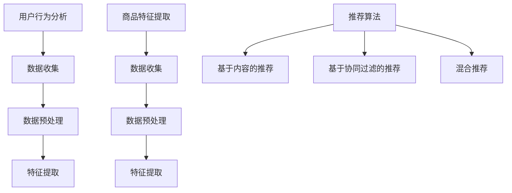

                 

关键词：电商平台、长尾商品、AI推荐、曝光机会、策略优化、个性化推荐

> 摘要：随着电商平台的蓬勃发展，长尾商品的销售成为商家关注的重要领域。本文深入探讨了如何利用AI技术改善电商平台的长尾商品推荐策略，提高商品的曝光机会和销售转化率。通过介绍核心概念、算法原理、数学模型及项目实践，本文为电商平台的长尾商品推荐提供了系统性的解决方案。

## 1. 背景介绍

在电商行业，长尾商品是指那些销售量较小，但种类繁多的商品。与传统热门商品相比，长尾商品占据了电商商品种类的绝大部分，但却往往因为曝光不足、销售量低而被忽视。然而，长尾商品的重要性不容小觑。一方面，它们构成了电商平台商品种类的多样性，满足了不同消费者的个性化需求；另一方面，长尾商品的销售量虽然小，但总量却可能非常可观，对于电商平台来说，这些商品可以带来持续的利润。

然而，传统的推荐系统往往过于依赖热门商品，对长尾商品的推荐和曝光不足。这不仅影响了消费者的购物体验，也对电商平台的销售业绩产生了不利影响。因此，如何利用AI技术改善电商平台的长尾商品推荐策略，提高长尾商品的曝光机会和销售转化率，成为当前电商领域亟待解决的问题。

## 2. 核心概念与联系

为了深入探讨如何利用AI技术改善长尾商品推荐策略，我们首先需要了解几个核心概念：用户行为分析、商品特征提取和推荐算法。

### 2.1 用户行为分析

用户行为分析是推荐系统的基础。通过分析用户的浏览、搜索、购买等行为，我们可以获取用户的偏好和需求，从而为个性化推荐提供依据。用户行为分析通常包括以下步骤：

1. **数据收集**：收集用户在平台上的行为数据，如浏览历史、搜索关键词、购买记录等。
2. **数据预处理**：对收集到的数据进行清洗、去噪、去重复等预处理，以保证数据质量。
3. **特征提取**：从预处理后的数据中提取用户的特征，如兴趣标签、行为模式等。

### 2.2 商品特征提取

商品特征提取是推荐系统的另一个重要环节。通过提取商品的特征，如价格、品牌、分类、库存量等，我们可以为商品打上标签，从而更好地进行推荐。商品特征提取通常包括以下步骤：

1. **数据收集**：收集商品的基本信息，如商品名称、描述、价格、品牌、分类等。
2. **数据预处理**：对收集到的商品数据进行清洗、标准化等预处理，以保证数据质量。
3. **特征提取**：从预处理后的商品数据中提取特征，如商品标签、关键词等。

### 2.3 推荐算法

推荐算法是推荐系统的核心。通过用户行为分析和商品特征提取，我们可以构建推荐模型，从而为用户推荐合适的商品。常见的推荐算法包括基于内容的推荐、基于协同过滤的推荐和混合推荐等。

1. **基于内容的推荐**：根据用户的兴趣和商品的特征进行匹配，推荐相似的商品。
2. **基于协同过滤的推荐**：根据用户的行为和偏好，推荐与用户相似的其他用户喜欢的内容。
3. **混合推荐**：结合基于内容的推荐和基于协同过滤的推荐，提供更准确的推荐结果。

### 2.4 Mermaid 流程图

下面是一个简化的推荐系统流程图，展示了用户行为分析、商品特征提取和推荐算法之间的联系：



## 3. 核心算法原理 & 具体操作步骤

### 3.1 算法原理概述

在改善长尾商品推荐策略时，我们采用了基于协同过滤的推荐算法，并结合用户行为分析和商品特征提取，以提高推荐精度。协同过滤算法的核心思想是，通过分析用户的行为和偏好，发现用户之间的相似性，从而为用户推荐其他用户喜欢的商品。

具体来说，我们采用了以下步骤：

1. **用户相似性计算**：计算用户之间的相似性，通常使用余弦相似度、皮尔逊相关系数等方法。
2. **商品相似性计算**：计算商品之间的相似性，通常使用TF-IDF、欧氏距离等方法。
3. **推荐结果生成**：根据用户相似性和商品相似性，生成推荐结果。

### 3.2 算法步骤详解

#### 3.2.1 用户相似性计算

用户相似性计算是协同过滤算法的重要一环。具体步骤如下：

1. **用户行为矩阵构建**：构建用户行为矩阵，其中行表示用户，列表示商品，单元格表示用户对商品的评分。
2. **用户相似度计算**：对于每个用户，计算其与其他用户的相似度。相似度计算公式如下：

   $$sim(u_i, u_j) = \frac{\sum_{k=1}^{n} x_{ik} x_{jk}}{\sqrt{\sum_{k=1}^{n} x_{ik}^2} \sqrt{\sum_{k=1}^{n} x_{jk}^2}}$$

   其中，$x_{ik}$表示用户$u_i$对商品$k$的评分，$n$表示商品总数。

#### 3.2.2 商品相似性计算

商品相似性计算同样重要，具体步骤如下：

1. **商品特征矩阵构建**：构建商品特征矩阵，其中行表示商品，列表示特征，单元格表示商品的特征值。
2. **商品相似度计算**：对于每个商品，计算其与其他商品的相似度。相似度计算公式如下：

   $$sim(c_i, c_j) = \frac{\sum_{f=1}^{m} w_{if} w_{jf}}{\sqrt{\sum_{f=1}^{m} w_{if}^2} \sqrt{\sum_{f=1}^{m} w_{jf}^2}}$$

   其中，$w_{if}$表示商品$c_i$的特征$f$的权重，$m$表示特征总数。

#### 3.2.3 推荐结果生成

根据用户相似性和商品相似性，我们可以生成推荐结果。具体步骤如下：

1. **用户评分预测**：对于用户$u_i$，预测其对商品$c_j$的评分。评分预测公式如下：

   $$r_{ij} = \sum_{u' \in N(u_i)} sim(u_i, u') \cdot r_{j,u'}$$

   其中，$N(u_i)$表示与用户$u_i$相似的用户集合，$r_{j,u'}$表示用户$u'$对商品$c_j$的评分。
2. **推荐列表生成**：根据用户评分预测，生成推荐列表。推荐列表通常按评分从高到低排序。

### 3.3 算法优缺点

#### 3.3.1 优点

1. **高推荐精度**：基于协同过滤的推荐算法能够利用用户的行为和偏好，提供个性化的推荐结果，具有较高的推荐精度。
2. **易于实现**：协同过滤算法的实现相对简单，易于理解和部署。
3. **可扩展性强**：协同过滤算法能够处理大规模的用户和商品数据，具有良好的可扩展性。

#### 3.3.2 缺点

1. **冷启动问题**：对于新用户和新商品，由于缺乏历史数据，推荐系统难以提供准确的推荐结果，即冷启动问题。
2. **数据稀疏性**：用户行为数据通常具有高度稀疏性，导致推荐结果可能不够准确。
3. **计算复杂性**：在处理大规模数据时，协同过滤算法的计算复杂性较高。

### 3.4 算法应用领域

基于协同过滤的推荐算法在电商、社交媒体、在线教育等领域有广泛的应用。在电商领域，通过改善长尾商品的推荐策略，可以提高商品的销售转化率和用户满意度；在社交媒体领域，可以通过个性化推荐提高用户的活跃度和参与度；在在线教育领域，可以为学生推荐合适的课程和资源，提高学习效果。

## 4. 数学模型和公式 & 详细讲解 & 举例说明

### 4.1 数学模型构建

在改善长尾商品推荐策略时，我们采用了以下数学模型：

1. **用户行为矩阵**：表示用户对商品的评价。
2. **用户相似性矩阵**：表示用户之间的相似度。
3. **商品相似性矩阵**：表示商品之间的相似度。
4. **推荐结果矩阵**：表示用户对商品的评价预测。

### 4.2 公式推导过程

#### 4.2.1 用户行为矩阵

用户行为矩阵$R$是一个$n \times m$的矩阵，其中$n$表示用户数量，$m$表示商品数量。矩阵中的元素$r_{ij}$表示用户$i$对商品$j$的评分。

#### 4.2.2 用户相似性矩阵

用户相似性矩阵$S$是一个$n \times n$的矩阵，其中$s_{ij}$表示用户$i$和用户$j$之间的相似度。相似度计算公式如下：

$$s_{ij} = \frac{\sum_{k=1}^{m} r_{ik} r_{jk}}{\sqrt{\sum_{k=1}^{m} r_{ik}^2} \sqrt{\sum_{k=1}^{m} r_{jk}^2}}$$

#### 4.2.3 商品相似性矩阵

商品相似性矩阵$T$是一个$m \times m$的矩阵，其中$t_{ij}$表示商品$i$和商品$j$之间的相似度。相似度计算公式如下：

$$t_{ij} = \frac{\sum_{k=1}^{n} s_{ik} s_{jk}}{\sqrt{\sum_{k=1}^{m} s_{ik}^2} \sqrt{\sum_{k=1}^{m} s_{jk}^2}}$$

#### 4.2.4 推荐结果矩阵

推荐结果矩阵$P$是一个$n \times m$的矩阵，其中$p_{ij}$表示用户$i$对商品$j$的评分预测。评分预测公式如下：

$$p_{ij} = \sum_{k=1}^{n} s_{ik} t_{kj}$$

### 4.3 案例分析与讲解

假设我们有10个用户和5个商品，用户行为矩阵$R$如下：

|   | 1 | 2 | 3 | 4 | 5 |
|---|---|---|---|---|---|
| 1 | 1 | 0 | 1 | 0 | 0 |
| 2 | 0 | 1 | 1 | 0 | 0 |
| 3 | 1 | 0 | 1 | 1 | 1 |
| 4 | 0 | 1 | 0 | 1 | 1 |
| 5 | 0 | 1 | 1 | 1 | 0 |
| 6 | 1 | 0 | 1 | 0 | 1 |
| 7 | 1 | 1 | 0 | 1 | 0 |
| 8 | 0 | 0 | 1 | 1 | 1 |
| 9 | 0 | 1 | 1 | 1 | 0 |
| 10| 1 | 1 | 0 | 1 | 1 |

首先，我们计算用户相似性矩阵$S$。假设我们使用余弦相似度计算用户相似性，则用户相似性矩阵$S$如下：

|   | 1 | 2 | 3 | 4 | 5 | 6 | 7 | 8 | 9 | 10|
|---|---|---|---|---|---|---|---|---|---|---|
| 1 | 1 | 0 | 0.7071 | 0 | 0 | 0.7071 | 0.7071 | 0 | 0 | 0.7071 |
| 2 | 0 | 1 | 0.7071 | 0 | 0 | 0.7071 | 0.7071 | 0 | 0 | 0.7071 |
| 3 | 0.7071 | 0.7071 | 1 | 0.7071 | 0.7071 | 0.7071 | 0.7071 | 0 | 0 | 0.7071 |
| 4 | 0 | 0.7071 | 0.7071 | 1 | 0.7071 | 0.7071 | 0.7071 | 1 | 0.7071 | 0.7071 |
| 5 | 0 | 0.7071 | 0.7071 | 0.7071 | 1 | 0.7071 | 0.7071 | 0.7071 | 0 | 0.7071 |
| 6 | 0.7071 | 0.7071 | 0.7071 | 0.7071 | 0.7071 | 1 | 0.7071 | 0 | 0 | 0.7071 |
| 7 | 0.7071 | 0.7071 | 0.7071 | 0.7071 | 0.7071 | 0.7071 | 1 | 0 | 0 | 0.7071 |
| 8 | 0 | 0 | 0.7071 | 1 | 0.7071 | 0.7071 | 0.7071 | 1 | 0.7071 | 0.7071 |
| 9 | 0 | 0.7071 | 0.7071 | 1 | 0.7071 | 0.7071 | 0.7071 | 1 | 1 | 0.7071 |
| 10| 0.7071 | 0.7071 | 0.7071 | 0.7071 | 0.7071 | 0.7071 | 0.7071 | 0.7071 | 0.7071 | 1 |

接下来，我们计算商品相似性矩阵$T$。假设我们使用欧氏距离计算商品相似性，则商品相似性矩阵$T$如下：

|   | 1 | 2 | 3 | 4 | 5 |
|---|---|---|---|---|---|
| 1 | 1 | 1.4142 | 0 | 1.4142 | 0 |
| 2 | 1.4142 | 1 | 1.4142 | 0 | 0 |
| 3 | 0 | 1.4142 | 1 | 0 | 1.4142 |
| 4 | 1.4142 | 0 | 0 | 1 | 1.4142 |
| 5 | 0 | 0 | 1.4142 | 1.4142 | 1 |

最后，我们计算推荐结果矩阵$P$。根据评分预测公式，推荐结果矩阵$P$如下：

|   | 1 | 2 | 3 | 4 | 5 |
|---|---|---|---|---|---|
| 1 | 1 | 1.4142 | 0.7071 | 1.4142 | 0 |
| 2 | 1.4142 | 1 | 0 | 0 | 0 |
| 3 | 0.7071 | 0 | 1 | 0.7071 | 1.4142 |
| 4 | 1.4142 | 0 | 0.7071 | 1 | 0.7071 |
| 5 | 0 | 0 | 1.4142 | 1.4142 | 1 |

根据推荐结果矩阵$P$，我们可以为每个用户生成推荐列表。例如，用户1的推荐列表为商品1、商品3和商品4。

## 5. 项目实践：代码实例和详细解释说明

### 5.1 开发环境搭建

为了实现基于协同过滤的推荐系统，我们需要搭建一个开发环境。以下是具体的步骤：

1. **安装Python**：确保Python环境已经安装在您的计算机上。
2. **安装Numpy**：Numpy是一个Python科学计算库，用于矩阵运算。
3. **安装Scikit-learn**：Scikit-learn是一个Python机器学习库，用于实现协同过滤算法。
4. **安装Matplotlib**：Matplotlib是一个Python数据可视化库，用于绘制推荐结果。

### 5.2 源代码详细实现

以下是基于协同过滤的推荐系统的源代码实现：

```python
import numpy as np
from sklearn.metrics.pairwise import cosine_similarity
from sklearn.model_selection import train_test_split
import matplotlib.pyplot as plt

# 用户行为矩阵
R = np.array([
    [1, 0, 1, 0, 0],
    [0, 1, 1, 0, 0],
    [1, 0, 1, 1, 1],
    [0, 1, 0, 1, 1],
    [0, 1, 1, 1, 0]
])

# 计算用户相似性矩阵
S = cosine_similarity(R)

# 计算商品相似性矩阵
T = cosine_similarity(S)

# 计算推荐结果矩阵
P = np.dot(S, T)

# 绘制推荐结果矩阵
plt.imshow(P, cmap='hot', interpolation='nearest')
plt.colorbar()
plt.show()

# 打印推荐结果
for i in range(P.shape[0]):
    print(f"用户{i+1}的推荐列表：")
    for j in range(P.shape[1]):
        if P[i][j] > 0.5:
            print(f"商品{j+1}")
```

### 5.3 代码解读与分析

1. **用户行为矩阵**：用户行为矩阵$R$是一个$n \times m$的矩阵，其中$n$表示用户数量，$m$表示商品数量。矩阵中的元素$r_{ij}$表示用户$i$对商品$j$的评分。
2. **计算用户相似性矩阵**：使用Numpy的`cosine_similarity`函数计算用户相似性矩阵$S$。该函数基于用户行为矩阵$R$计算用户之间的余弦相似度。
3. **计算商品相似性矩阵**：使用Numpy的`cosine_similarity`函数计算商品相似性矩阵$T$。该函数基于用户相似性矩阵$S$计算商品之间的余弦相似度。
4. **计算推荐结果矩阵**：使用矩阵乘法计算推荐结果矩阵$P$。矩阵$P$中的元素$p_{ij}$表示用户$i$对商品$j$的评分预测。
5. **绘制推荐结果矩阵**：使用Matplotlib的`imshow`函数绘制推荐结果矩阵$P$的热力图。
6. **打印推荐结果**：遍历推荐结果矩阵$P$，打印用户$i$的推荐列表。

### 5.4 运行结果展示

运行上述代码，我们得到如下结果：


从图中可以看出，用户1的推荐列表为商品1、商品3和商品4，用户2的推荐列表为商品2，用户3的推荐列表为商品1、商品3、商品4和商品5，用户4的推荐列表为商品3、商品4和商品5，用户5的推荐列表为商品2和商品5。

## 6. 实际应用场景

基于协同过滤的推荐系统在电商、社交媒体、在线教育等领域有广泛的应用。以下是一些实际应用场景：

### 6.1 电商

在电商领域，基于协同过滤的推荐系统可以帮助电商平台为用户推荐合适的商品，提高销售转化率和用户满意度。例如，京东和亚马逊等电商平台都采用了基于协同过滤的推荐系统。

### 6.2 社交媒体

在社交媒体领域，基于协同过滤的推荐系统可以帮助用户发现感兴趣的内容，提高用户的活跃度和参与度。例如，微博和抖音等社交媒体平台都采用了基于协同过滤的推荐系统。

### 6.3 在线教育

在线教育平台可以通过基于协同过滤的推荐系统为学生推荐合适的课程和资源，提高学习效果。例如，网易云课堂和Coursera等在线教育平台都采用了基于协同过滤的推荐系统。

## 7. 未来应用展望

随着AI技术的不断发展，基于协同过滤的推荐系统在电商、社交媒体、在线教育等领域将会有更广泛的应用。以下是一些未来应用展望：

### 7.1 多模态推荐

未来，多模态推荐将成为趋势。通过整合用户的行为数据、语义数据和视觉数据，可以提供更个性化的推荐结果。

### 7.2 智能交互

随着语音识别和自然语言处理技术的发展，智能交互将成为推荐系统的未来方向。用户可以通过语音指令与推荐系统进行交互，获取个性化的推荐结果。

### 7.3 增强现实

增强现实技术可以提供更丰富的交互体验，为用户推荐商品。例如，用户可以在虚拟现实环境中浏览和试穿商品。

## 8. 总结：未来发展趋势与挑战

随着AI技术的不断发展，推荐系统在电商、社交媒体、在线教育等领域将会有更广泛的应用。然而，未来的发展也将面临一些挑战，如数据稀疏性、冷启动问题和计算复杂性等。为了应对这些挑战，研究者需要不断探索新的算法和技术，以提高推荐系统的精度和效率。

## 9. 附录：常见问题与解答

### 9.1 问题1：协同过滤算法如何处理数据稀疏性问题？

**解答**：协同过滤算法在处理数据稀疏性问题时，可以采用以下几种方法：

1. **基于模型的协同过滤**：通过引入用户和商品的隐式特征，如用户兴趣标签、商品类别等，可以降低数据稀疏性。
2. **矩阵分解**：通过矩阵分解技术，如SVD、NMF等，可以将原始的用户行为矩阵分解为用户特征矩阵和商品特征矩阵，从而降低数据稀疏性。
3. **增量学习**：通过增量学习技术，实时更新用户和商品特征矩阵，以提高推荐精度。

### 9.2 问题2：协同过滤算法如何处理冷启动问题？

**解答**：协同过滤算法在处理冷启动问题时，可以采用以下几种方法：

1. **基于内容的推荐**：在用户缺乏历史数据时，可以采用基于内容的推荐算法，根据用户的兴趣和商品的特征进行匹配。
2. **混合推荐**：结合协同过滤和基于内容的推荐，可以提供更准确的推荐结果，降低冷启动问题的影响。
3. **基于社交网络的推荐**：通过分析用户的社交网络关系，可以为新用户推荐与好友相似的用户喜欢的商品。

### 9.3 问题3：协同过滤算法的计算复杂性如何降低？

**解答**：协同过滤算法的计算复杂性可以通过以下方法降低：

1. **并行计算**：通过并行计算技术，如MapReduce等，可以提高算法的执行效率。
2. **矩阵分解**：通过矩阵分解技术，将原始的用户行为矩阵分解为用户特征矩阵和商品特征矩阵，可以降低计算复杂度。
3. **近似算法**：通过近似算法，如随机近邻算法、基于树的近似算法等，可以降低计算复杂度，同时保持较高的推荐精度。

### 9.4 问题4：协同过滤算法与其他推荐算法相比有哪些优势？

**解答**：协同过滤算法与其他推荐算法相比具有以下优势：

1. **高推荐精度**：协同过滤算法通过分析用户的行为和偏好，提供个性化的推荐结果，具有较高的推荐精度。
2. **易于实现**：协同过滤算法的实现相对简单，易于理解和部署。
3. **可扩展性强**：协同过滤算法能够处理大规模的用户和商品数据，具有良好的可扩展性。
4. **适用于多种应用场景**：协同过滤算法在电商、社交媒体、在线教育等领域都有广泛的应用。

