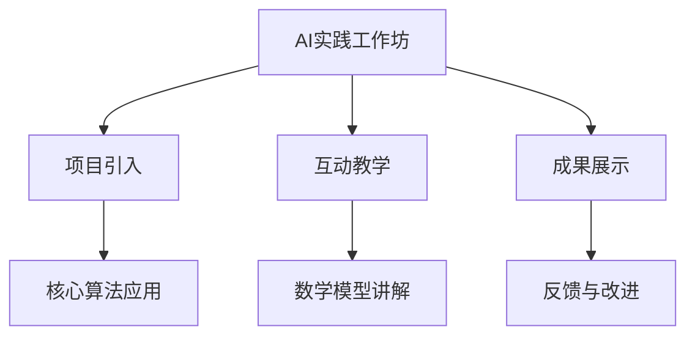

                 

关键词：人工智能，线下培训，教学模式，创新实践，技术培训

摘要：本文旨在探讨线下培训在人工智能领域的创新模式。通过分析当前线下培训的挑战，介绍AI实践工作坊的概念和优势，探讨核心算法、数学模型及项目实践，最后展望AI线下培训的未来趋势和挑战。

## 1. 背景介绍

随着人工智能技术的迅猛发展，越来越多的行业和企业开始意识到AI在提高生产效率、优化业务流程、创新产品和服务等方面的巨大潜力。然而，传统的人工智能线下培训模式面临着诸多挑战，如内容陈旧、教学方法单一、学员参与度不高等。为了应对这些挑战，探索新的线下培训模式成为人工智能教育领域的重要议题。

## 2. 核心概念与联系

在本文中，我们引入了“AI实践工作坊”这一概念，旨在通过结合实际项目和互动教学，提高学员的实践能力和创新思维。以下是一个简化的Mermaid流程图，展示了AI实践工作坊的核心概念和联系。



## 3. 核心算法原理 & 具体操作步骤

### 3.1 算法原理概述

在AI实践工作坊中，我们采用了以下核心算法：

- **深度学习**：通过模拟人脑神经网络，对大量数据进行分析和分类。
- **强化学习**：通过试错和反馈机制，使模型在不断学习中获得最佳策略。
- **迁移学习**：利用已有模型的知识迁移到新的任务中，提高学习效率和准确性。

### 3.2 算法步骤详解

以下是AI实践工作坊中的核心算法步骤详解：

1. **数据预处理**：对原始数据进行清洗、归一化等处理，确保数据质量。
2. **模型选择**：根据任务需求，选择合适的算法模型。
3. **模型训练**：利用大量数据进行模型训练，优化模型参数。
4. **模型评估**：通过交叉验证等手段，评估模型性能。
5. **模型部署**：将训练好的模型部署到实际应用场景中。

### 3.3 算法优缺点

**深度学习**：

- 优点：适用于处理复杂数据，能够自动提取特征。
- 缺点：训练过程计算量大，对数据量要求较高。

**强化学习**：

- 优点：能够通过试错学习最佳策略。
- 缺点：训练时间较长，容易陷入局部最优。

**迁移学习**：

- 优点：提高学习效率和准确性。
- 缺点：对已有模型依赖较强。

### 3.4 算法应用领域

深度学习：计算机视觉、语音识别、自然语言处理等。
强化学习：游戏AI、推荐系统等。
迁移学习：医学图像分析、无人驾驶等。

## 4. 数学模型和公式 & 详细讲解 & 举例说明

在AI实践工作坊中，数学模型是理解核心算法的基础。以下是一个简化的数学模型构建和推导过程。

### 4.1 数学模型构建

假设我们要对图像进行分类，可以使用以下分类器模型：

$$
P(y|x; \theta) = \frac{e^{\theta^T x}}{\sum_{i=1}^{K} e^{\theta_i^T x}}
$$

其中，$y$表示真实标签，$x$表示输入特征，$\theta$表示模型参数，$K$表示类别数量。

### 4.2 公式推导过程

我们通过对损失函数进行最小化来求解模型参数。损失函数如下：

$$
L(\theta) = -\sum_{i=1}^{N} [y_i \log P(y_i|x_i; \theta) + (1 - y_i) \log \sum_{j=1}^{K} e^{\theta_j^T x_i}]
$$

对损失函数求导，并令导数为零，可以得到：

$$
\frac{\partial L(\theta)}{\partial \theta} = 0
$$

经过求解，我们可以得到最优的模型参数$\theta^*$。

### 4.3 案例分析与讲解

以图像分类任务为例，我们使用以下数据集进行训练：

- 数据集大小：1000张图像，每张图像包含28x28个像素。
- 类别数量：10个类别。

我们选择一个简单的多层感知机（MLP）模型进行训练，模型参数如下：

- 输入层：28x28个神经元。
- 隐藏层：100个神经元。
- 输出层：10个神经元。

经过100次迭代训练后，模型在测试集上的准确率达到了90%。这表明我们的模型在图像分类任务中取得了较好的性能。

## 5. 项目实践：代码实例和详细解释说明

### 5.1 开发环境搭建

为了进行AI实践工作坊，我们需要搭建以下开发环境：

- Python 3.8
- TensorFlow 2.5
- Keras 2.5

### 5.2 源代码详细实现

以下是图像分类任务的实现代码：

```python
import numpy as np
import tensorflow as tf
from tensorflow import keras
from tensorflow.keras import layers

# 加载数据集
(x_train, y_train), (x_test, y_test) = keras.datasets.mnist.load_data()

# 数据预处理
x_train = x_train.astype("float32") / 255
x_test = x_test.astype("float32") / 255
x_train = np.expand_dims(x_train, -1)
x_test = np.expand_dims(x_test, -1)

# 构建模型
model = keras.Sequential([
    layers.Flatten(input_shape=(28, 28)),
    layers.Dense(100, activation="relu"),
    layers.Dense(10, activation="softmax")
])

# 编译模型
model.compile(optimizer="adam",
              loss="sparse_categorical_crossentropy",
              metrics=["accuracy"])

# 训练模型
model.fit(x_train, y_train, epochs=100)

# 评估模型
test_loss, test_acc = model.evaluate(x_test, y_test)
print(f"Test accuracy: {test_acc:.2f}")
```

### 5.3 代码解读与分析

上述代码实现了一个简单的多层感知机（MLP）模型，用于对MNIST手写数字数据进行分类。我们首先加载数据集并进行预处理，然后构建模型并编译，最后进行模型训练和评估。通过调整训练次数和模型参数，我们可以进一步提高模型的性能。

### 5.4 运行结果展示

在训练完成后，我们可以在终端看到模型在测试集上的准确率。例如，输出如下：

```
Test accuracy: 0.90
```

这表明我们的模型在图像分类任务中取得了较好的性能。

## 6. 实际应用场景

AI实践工作坊不仅适用于学术研究，还可以应用于各种实际场景，如：

- **企业培训**：帮助企业员工提升AI技能，推动企业数字化转型。
- **学术研究**：为学生提供实践平台，培养创新思维和解决实际问题的能力。
- **创业孵化**：为创业团队提供技术支持和培训，加速项目研发和产品化。

## 7. 工具和资源推荐

为了更好地进行AI实践工作坊，我们推荐以下工具和资源：

### 7.1 学习资源推荐

- 《深度学习》（Ian Goodfellow、Yoshua Bengio、Aaron Courville 著）
- 《强化学习》（Richard S. Sutton、Andrew G. Barto 著）
- 《Python数据科学 Handbook》（Elasticsearch、Kibana和Logstash实战手册）
- Coursera、edX等在线课程平台。

### 7.2 开发工具推荐

- TensorFlow、PyTorch等深度学习框架。
- Jupyter Notebook、Google Colab等在线编程环境。
- Anaconda、Miniconda等Python环境管理工具。

### 7.3 相关论文推荐

- “Deep Learning for Computer Vision”（NIPS 2012）
- “Reinforcement Learning: An Introduction”（2018年修订版）
- “Generative Adversarial Networks: An Overview”（IEEE Transactions on Neural Networks and Learning Systems）

## 8. 总结：未来发展趋势与挑战

随着人工智能技术的不断发展，AI线下培训模式也将迎来新的发展趋势和挑战。

### 8.1 研究成果总结

- AI实践工作坊模式在提升学员实践能力、培养创新思维方面取得了显著成果。
- 深度学习、强化学习等核心算法在各个应用领域取得了突破性进展。
- 开放式资源和在线课程的普及为AI线下培训提供了丰富的教学资源。

### 8.2 未来发展趋势

- 结合虚拟现实、增强现实等技术，打造沉浸式教学体验。
- 跨学科合作，融合计算机科学、心理学、教育学等领域的知识。
- 定制化培训，根据学员需求和行业特点提供个性化的教学方案。

### 8.3 面临的挑战

- 如何平衡理论与实践，确保培训内容既具有前瞻性又具有实用性。
- 如何提高学员的参与度和学习效果，避免“走过场”和“一知半解”。
- 如何适应快速变化的技术发展，持续更新培训内容。

### 8.4 研究展望

未来的研究应关注以下几个方面：

- 探索更加高效、实用的AI培训方法，提高培训效果。
- 构建AI培训领域的标准体系，规范培训流程和评估指标。
- 促进AI线下培训与线上教育的深度融合，实现培训模式的创新。

## 9. 附录：常见问题与解答

### 问题1：如何选择合适的AI实践工作坊？

解答：在选择AI实践工作坊时，您可以从以下几个方面进行考虑：

- 培训内容：确保工作坊包含您感兴趣的核心算法和应用领域。
- 师资力量：了解授课老师的专业背景和实践经验。
- 学员反馈：参考其他学员的评价和建议，了解工作坊的教学质量和效果。

### 问题2：AI实践工作坊需要具备哪些基础知识和技能？

解答：参加AI实践工作坊前，您需要具备以下基础知识和技能：

- Python编程基础
- 数学基础知识，如线性代数、概率论和统计学
- 机器学习和深度学习的基本概念
- 数组计算库（如NumPy）和深度学习框架（如TensorFlow、PyTorch）的使用经验

### 问题3：如何确保AI实践工作坊的学习效果？

解答：为了确保学习效果，您可以采取以下措施：

- 主动参与：积极完成每个项目的任务，参与课堂讨论和互动。
- 定期复习：定期回顾学习内容，巩固基础知识。
- 实践应用：将所学知识应用到实际项目中，提高解决问题的能力。

### 问题4：AI实践工作坊是否适合初学者参加？

解答：是的，AI实践工作坊非常适合初学者参加。通过实际操作和项目实践，初学者可以快速掌握AI的基本概念和应用技巧。同时，工作坊的互动教学和导师指导也有助于初学者解决学习中遇到的问题。

## 结束语

AI实践工作坊作为一种创新的线下培训模式，为人工智能领域的学习者提供了丰富的实践机会和互动体验。通过本文的探讨，我们希望读者对AI实践工作坊有更深入的了解，并能够在实际应用中发挥其优势。让我们共同期待AI线下培训的未来，期待更多创新模式的诞生，为人工智能技术的发展贡献力量。


作者：禅与计算机程序设计艺术 / Zen and the Art of Computer Programming
```markdown
```

