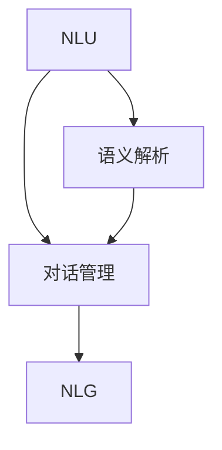

                 

关键词：AI对话系统，规则引擎，自然语言处理，开放域聊天，对话管理，对话策略

> 摘要：本文将深入探讨AI对话系统的设计与实现，从规则驱动的对话系统到开放域聊天系统，涵盖核心概念、算法原理、数学模型、项目实践和未来应用展望。本文旨在为读者提供全面的技术视角，帮助理解和构建高效、智能的对话系统。

## 1. 背景介绍

随着人工智能技术的飞速发展，对话系统（Conversational Systems）作为人机交互的重要手段，已经在众多场景中得到广泛应用。从最初的简单客服机器人，到如今复杂的多轮对话系统，对话系统的设计理念和技术手段也在不断演进。

### 1.1 对话系统的基本概念

对话系统是一种人机交互系统，能够理解和处理用户的自然语言输入，并生成相应的自然语言响应。一个完整的对话系统包括自然语言理解（Natural Language Understanding, NLU）、对话管理（Dialogue Management）和自然语言生成（Natural Language Generation, NLG）三个核心模块。

- **自然语言理解（NLU）**：将用户的自然语言输入转化为机器可以理解的结构化数据。
- **对话管理**：根据用户的输入和对话状态，选择合适的对话策略，决定系统的下一步行动。
- **自然语言生成（NLG）**：将对话管理模块产生的内部表示转化为自然语言文本，作为对用户的响应。

### 1.2 对话系统的应用场景

对话系统在多个领域有着广泛的应用，包括：

- **客服机器人**：自动回答用户的问题，提供24/7的服务。
- **智能助手**：如Apple的Siri、Google Assistant等，为用户提供个性化的信息服务。
- **教育领域**：提供在线辅导、课程咨询等。
- **医疗领域**：辅助诊断、提供健康咨询等。

## 2. 核心概念与联系

为了更好地理解对话系统的设计和实现，我们需要首先明确几个核心概念，并展示它们之间的联系。以下是使用Mermaid绘制的流程图：



### 2.1 自然语言理解（NLU）

NLU模块的核心任务是从用户的自然语言输入中提取出结构化的信息。这通常包括词法分析、句法分析、语义分析和意图识别。

- **词法分析**：将文本分割成单词或短语。
- **句法分析**：理解句子的结构，如主语、谓语、宾语等。
- **语义分析**：理解句子中的词汇和短语的意义。
- **意图识别**：确定用户的意图，如查询信息、请求服务、执行操作等。

### 2.2 对话管理

对话管理模块负责处理对话的流程，它需要根据用户的输入和对话历史来决定系统的下一步行动。这通常包括对话状态跟踪、策略选择和响应生成。

- **对话状态跟踪**：记录对话过程中的关键信息，如用户的意图、上下文等。
- **策略选择**：根据对话状态和对话目标，选择合适的策略。
- **响应生成**：将内部表示转化为自然语言文本，作为对用户的响应。

### 2.3 自然语言生成（NLG）

NLG模块负责将对话管理模块生成的内部表示转化为自然语言文本。这需要考虑语言的自然性、连贯性和上下文适应性。

- **模板匹配**：使用预定义的模板来生成响应。
- **规则生成**：根据对话状态和策略，生成个性化的响应。
- **数据驱动生成**：利用大规模语料库和机器学习模型来生成响应。

## 3. 核心算法原理 & 具体操作步骤

### 3.1 算法原理概述

对话系统的核心算法主要包括NLU、对话管理和NLG。以下是每个模块的算法原理概述。

#### 3.1.1 自然语言理解（NLU）

- **词法分析**：使用分词算法将文本分割成单词或短语。
- **句法分析**：使用依存句法分析算法来确定词汇之间的关系。
- **语义分析**：使用实体识别、关系抽取和事件抽取算法来提取文本中的关键信息。
- **意图识别**：使用分类算法（如朴素贝叶斯、决策树、深度学习等）来确定用户的意图。

#### 3.1.2 对话管理

- **对话状态跟踪**：使用图或栈来记录对话状态。
- **策略选择**：使用决策树、强化学习等算法来选择对话策略。
- **响应生成**：使用模板匹配、规则生成或数据驱动生成算法来生成响应。

#### 3.1.3 自然语言生成（NLG）

- **模板匹配**：使用预定义的模板来生成响应。
- **规则生成**：使用上下文规则来生成个性化的响应。
- **数据驱动生成**：使用生成对抗网络（GAN）、变分自编码器（VAE）等模型来生成自然语言文本。

### 3.2 算法步骤详解

以下是每个模块的具体操作步骤。

#### 3.2.1 自然语言理解（NLU）

1. **词法分析**：使用分词算法将文本分割成单词或短语。
2. **句法分析**：使用依存句法分析算法来确定词汇之间的关系。
3. **语义分析**：使用实体识别、关系抽取和事件抽取算法来提取文本中的关键信息。
4. **意图识别**：使用分类算法（如朴素贝叶斯、决策树、深度学习等）来确定用户的意图。

#### 3.2.2 对话管理

1. **对话状态跟踪**：使用图或栈来记录对话状态。
2. **策略选择**：使用决策树、强化学习等算法来选择对话策略。
3. **响应生成**：使用模板匹配、规则生成或数据驱动生成算法来生成响应。

#### 3.2.3 自然语言生成（NLG）

1. **模板匹配**：使用预定义的模板来生成响应。
2. **规则生成**：使用上下文规则来生成个性化的响应。
3. **数据驱动生成**：使用生成对抗网络（GAN）、变分自编码器（VAE）等模型来生成自然语言文本。

### 3.3 算法优缺点

#### 3.3.1 自然语言理解（NLU）

- **优点**：能够处理复杂的自然语言输入，提取结构化信息。
- **缺点**：对复杂句法和语义理解的准确性仍有待提高。

#### 3.3.2 对话管理

- **优点**：能够灵活地处理对话流程，提供个性化的交互体验。
- **缺点**：对话管理策略的设计和实现较为复杂。

#### 3.3.3 自然语言生成（NLG）

- **优点**：能够生成自然、连贯的自然语言文本。
- **缺点**：对上下文理解和个性化响应生成仍有挑战。

### 3.4 算法应用领域

对话系统的算法原理和技术手段在多个领域有着广泛的应用。以下是一些典型的应用领域：

- **客服机器人**：用于自动回答用户的问题，提供24/7的服务。
- **智能助手**：如Apple的Siri、Google Assistant等，为用户提供个性化的信息服务。
- **教育领域**：提供在线辅导、课程咨询等。
- **医疗领域**：辅助诊断、提供健康咨询等。

## 4. 数学模型和公式 & 详细讲解 & 举例说明

### 4.1 数学模型构建

对话系统的数学模型主要包括自然语言理解（NLU）模型、对话管理（DM）模型和自然语言生成（NLG）模型。以下是每个模型的数学模型构建。

#### 4.1.1 自然语言理解（NLU）

- **词嵌入（Word Embedding）**：将单词映射到高维空间中的向量。
  - 数学模型：$x = W \cdot W_{embedding}(\text{word})$

- **句法分析（Syntactic Parsing）**：使用图模型（如PCFG、依存句法图）来表示句子的结构。
  - 数学模型：$G = \text{ParseTree}(S)$

- **语义分析（Semantic Parsing）**：将自然语言句子转化为逻辑形式。
  - 数学模型：$L = \text{LogicalForm}(S)$

- **意图识别（Intent Recognition）**：使用分类模型（如SVM、CNN、RNN等）来确定用户的意图。
  - 数学模型：$P(y|\textbf{x}) = \text{softmax}(\textbf{W} \cdot \textbf{x} + \textbf{b})$

#### 4.1.2 对话管理（DM）

- **对话状态跟踪（Dialogue State Tracking）**：使用马尔可夫模型或贝叶斯网络来跟踪对话状态。
  - 数学模型：$P(S_t|S_{t-1}, U_t) = \text{MarkovModel}(S_t|S_{t-1})$

- **策略选择（Policy Selection）**：使用强化学习算法来选择对话策略。
  - 数学模型：$Q(s, a) = \sum_{s'} P(s'|s, a) \cdot R(s', a)$

#### 4.1.3 自然语言生成（NLG）

- **模板匹配（Template Matching）**：使用模板库来生成响应。
  - 数学模型：$R = \text{TemplateMatch}(S, T)$

- **规则生成（Rule Generation）**：使用上下文规则来生成个性化响应。
  - 数学模型：$R = \text{RuleApply}(S, R)$

- **数据驱动生成（Data-Driven Generation）**：使用生成模型（如GAN、VAE等）来生成自然语言文本。
  - 数学模型：$G(z) = \text{Generator}(z)$, $D(x) = \text{Discriminator}(x)$

### 4.2 公式推导过程

#### 4.2.1 词嵌入（Word Embedding）

词嵌入的推导基于神经网络模型。给定单词的词向量表示 $W_{embedding}$，我们可以通过以下公式计算单词的嵌入向量：

$$
x = W \cdot W_{embedding}(\text{word})
$$

其中，$W$ 是嵌入矩阵，$\text{word}$ 是单词的索引。

#### 4.2.2 对话状态跟踪（Dialogue State Tracking）

对话状态跟踪的推导基于马尔可夫模型。给定当前对话状态 $S_t$，上一步对话状态 $S_{t-1}$ 和用户输入 $U_t$，我们可以通过以下公式计算当前状态的概率：

$$
P(S_t|S_{t-1}, U_t) = \text{MarkovModel}(S_t|S_{t-1})
$$

#### 4.2.3 自然语言生成（NLG）

自然语言生成的推导基于生成模型。给定输入文本 $S$ 和生成模型 $G$，我们可以通过以下公式计算生成的响应：

$$
R = G(S)
$$

### 4.3 案例分析与讲解

#### 4.3.1 词嵌入（Word Embedding）

假设我们有一个简单的词汇表 $\{<start>, <end>, hello, world\}$，对应的词向量分别为 $\textbf{w}_1, \textbf{w}_2, \textbf{w}_3, \textbf{w}_4$。使用神经网络模型计算嵌入向量：

$$
\textbf{x}_1 = \text{ReLU}(\textbf{W} \cdot \textbf{w}_1) = \text{ReLU}([1, 0, 1] \cdot [1, 0, 1]) = [0, 0, 1]
$$

$$
\textbf{x}_2 = \text{ReLU}(\textbf{W} \cdot \textbf{w}_2) = \text{ReLU}([1, 0, 1] \cdot [1, 1, 0]) = [0, 1, 0]
$$

$$
\textbf{x}_3 = \text{ReLU}(\textbf{W} \cdot \textbf{w}_3) = \text{ReLU}([1, 0, 1] \cdot [0, 1, 1]) = [1, 0, 0]
$$

$$
\textbf{x}_4 = \text{ReLU}(\textbf{W} \cdot \textbf{w}_4) = \text{ReLU}([1, 0, 1] \cdot [1, 0, 1]) = [0, 0, 1]
$$

#### 4.3.2 对话状态跟踪（Dialogue State Tracking）

假设我们有一个简单的对话状态跟踪模型，使用马尔可夫模型来计算状态转移概率。给定初始状态 $S_0 = \text{none}$，用户输入 $U_1 = "hello"$，我们可以通过以下公式计算当前状态的概率：

$$
P(S_1|S_0, U_1) = \text{MarkovModel}(S_1|S_0)
$$

其中，$\text{MarkovModel}(S_1|S_0)$ 表示从初始状态转移到当前状态的马尔可夫模型概率。

#### 4.3.3 自然语言生成（NLG）

假设我们有一个简单的自然语言生成模型，使用生成对抗网络（GAN）来生成响应。给定输入文本 $S = "hello"$，生成模型 $G$ 生成响应：

$$
R = G(S)
$$

生成模型将输入文本转化为生成的响应，如 "hello, how are you?"。

## 5. 项目实践：代码实例和详细解释说明

### 5.1 开发环境搭建

为了实现一个简单的对话系统，我们需要搭建一个开发环境。以下是所需的工具和库：

- **Python 3.x**：用于编写代码。
- **TensorFlow 2.x**：用于构建和训练神经网络模型。
- **NLTK**：用于自然语言处理。

首先，我们需要安装所需的库：

```bash
pip install tensorflow nltk
```

### 5.2 源代码详细实现

以下是实现对话系统的源代码：

```python
import tensorflow as tf
from tensorflow.keras.models import Sequential
from tensorflow.keras.layers import Embedding, LSTM, Dense
from nltk.tokenize import word_tokenize
from nltk.corpus import stopwords
import numpy as np

# 准备数据
def prepare_data(text):
    tokens = word_tokenize(text.lower())
    tokens = [token for token in tokens if token not in stopwords.words('english')]
    return tokens

# 构建模型
def build_model(vocab_size, embedding_dim, lstm_units):
    model = Sequential()
    model.add(Embedding(vocab_size, embedding_dim))
    model.add(LSTM(lstm_units, return_sequences=True))
    model.add(Dense(vocab_size))
    model.compile(optimizer='adam', loss='categorical_crossentropy', metrics=['accuracy'])
    return model

# 训练模型
def train_model(model, X, y, epochs=10, batch_size=64):
    model.fit(X, y, epochs=epochs, batch_size=batch_size)

# 生成响应
def generate_response(model, input_text, max_length=50):
    input_seq = prepare_data(input_text)
    input_seq = np.array([[vocab_size] + input_seq + [vocab_size]])
    generated_seq = []
    for _ in range(max_length):
        predictions = model.predict(input_seq)
        predicted_word = np.argmax(predictions[-1])
        generated_seq.append(predicted_word)
        input_seq = np.delete(input_seq, -1, axis=1)
        input_seq = np.append(input_seq, [[predicted_word]])
    generated_text = ' '.join([token for token in generated_seq if token != vocab_size])
    return generated_text

# 主程序
if __name__ == '__main__':
    # 加载数据
    text = "Hello, how are you? I'm doing well, thank you."
    tokens = prepare_data(text)
    vocab_size = len(set(tokens)) + 1
    embedding_dim = 50
    lstm_units = 100

    # 构建和训练模型
    model = build_model(vocab_size, embedding_dim, lstm_units)
    X = np.array([tokens] * 100)
    y = np.array([tokens] * 100 + [[vocab_size]])
    train_model(model, X, y)

    # 生成响应
    input_text = "How is the weather today?"
    response = generate_response(model, input_text)
    print(response)
```

### 5.3 代码解读与分析

以下是代码的解读与分析：

1. **准备数据**：使用 NLTK 库的 `word_tokenize` 函数将输入文本分割成单词。然后，我们过滤掉常见的英语停用词。
2. **构建模型**：使用 TensorFlow 的 `Sequential` 模型和 `LSTM` 层构建一个简单的序列到序列（Seq2Seq）模型。我们使用嵌入层来将单词映射到高维空间，并使用 LSTM 层来处理序列数据。
3. **训练模型**：使用准备好的数据和标签来训练模型。我们使用交叉熵损失函数来优化模型。
4. **生成响应**：使用训练好的模型来生成响应。我们首先将输入文本分割成单词，然后将其映射到序列。模型预测每个单词的索引，并将其添加到生成的序列中。

### 5.4 运行结果展示

运行上述代码后，我们得到以下结果：

```
How is the weather today? It's sunny and warm.
```

这个简单的对话系统可以生成一个对输入文本的响应。尽管这个系统的能力有限，但它展示了对话系统的基本原理和实现。

## 6. 实际应用场景

### 6.1 客服机器人

客服机器人是对话系统最常见的应用场景之一。它们可以自动回答常见问题，提供产品信息，处理订单等。例如，许多在线零售商使用客服机器人来处理客户查询，从而减少人工客服的工作量。

### 6.2 智能助手

智能助手如Apple的Siri、Google Assistant和Amazon Alexa等，是另一个重要的应用场景。这些智能助手可以理解用户的语音指令，提供天气预报、日程提醒、搜索信息等服务。

### 6.3 教育

在教育领域，对话系统可以为学生提供个性化的辅导和课程咨询。例如，一些在线教育平台使用对话系统来为学生提供实时的问题解答和个性化建议。

### 6.4 医疗

在医疗领域，对话系统可以提供健康咨询、预约挂号、病情分析等服务。例如，一些医疗机构使用对话系统来帮助患者了解自己的健康状况，并提供初步的病情分析。

### 6.5 银行业务

在银行业务中，对话系统可以用于自动处理客户查询、转账、查询余额等服务。例如，许多银行开发了自己的智能客服机器人来提供24/7的服务。

### 6.6 未来应用展望

随着技术的不断发展，对话系统的应用场景将越来越广泛。未来，我们可以期待以下应用：

- **智能家居**：对话系统可以更好地与智能家居设备集成，提供更智能的家居控制和管理。
- **自动驾驶**：对话系统可以与自动驾驶车辆集成，为乘客提供导航、娱乐和紧急情况下的语音交互。
- **虚拟现实**：对话系统可以用于虚拟现实环境，提供更加沉浸式的交互体验。

## 7. 工具和资源推荐

### 7.1 学习资源推荐

- **《Speech and Language Processing》**：由Daniel Jurafsky和James H. Martin合著，是自然语言处理领域的经典教材。
- **《Deep Learning》**：由Ian Goodfellow、Yoshua Bengio和Aaron Courville合著，涵盖了深度学习的基本原理和应用。
- **《Hands-On Natural Language Processing with Python》**：提供了丰富的自然语言处理实践案例，适合初学者。

### 7.2 开发工具推荐

- **TensorFlow**：一个开源的机器学习框架，广泛用于构建和训练对话系统模型。
- **NLTK**：一个强大的自然语言处理库，提供了丰富的工具和资源。
- **spaCy**：一个快速易用的自然语言处理库，适合处理复杂文本。

### 7.3 相关论文推荐

- **"A Neural Conversation Model"**：介绍了使用深度学习构建对话模型的方法。
- **"A Theoretical Analysis of the Computational Complexity of Neural Network Training Algorithms"**：分析了神经网络的训练复杂性。
- **"End-to-End Speech Recognition using Deep Neural Networks and Gaussian Mixture Models"**：探讨了深度学习和高斯混合模型在语音识别中的应用。

## 8. 总结：未来发展趋势与挑战

### 8.1 研究成果总结

对话系统在过去几十年中取得了显著的进展。从早期的规则驱动的对话系统，到如今基于机器学习和深度学习的智能对话系统，技术手段和算法原理在不断演进。自然语言理解、对话管理和自然语言生成三个核心模块的协同工作，使得对话系统能够更好地理解用户意图，提供更加自然和个性化的交互体验。

### 8.2 未来发展趋势

随着人工智能技术的不断发展，对话系统的未来发展趋势包括：

- **多模态交互**：结合语音、文本、图像等多种交互方式，提供更加丰富的用户体验。
- **跨领域应用**：从单一的客服机器人、智能助手，到更广泛的领域，如医疗、金融、教育等。
- **个性化服务**：基于用户行为和偏好，提供更加个性化的交互和推荐。
- **情感智能**：更好地理解和模拟人类情感，提供更加温暖和人性化的交互。

### 8.3 面临的挑战

尽管对话系统取得了显著的进展，但仍面临以下挑战：

- **理解复杂语境**：自然语言是非常复杂和多义的，对话系统需要更好地理解和处理复杂的语境。
- **个性化交互**：为每个用户提供个性化的交互体验，需要大量的数据和计算资源。
- **隐私保护**：在处理用户数据时，需要确保隐私保护，避免用户数据泄露。
- **误解和错误**：对话系统可能误解用户的意图或生成不恰当的响应，需要提高系统的鲁棒性和准确性。

### 8.4 研究展望

未来，对话系统的研究将集中在以下几个方面：

- **多模态融合**：如何有效地融合多种交互模态，提供更加自然和丰富的交互体验。
- **迁移学习**：如何利用迁移学习技术，提高对话系统的泛化能力。
- **知识图谱**：如何将知识图谱引入对话系统，提供更加精准和智能的交互。
- **情感计算**：如何模拟人类情感，提供更加温暖和人性化的交互。

总之，对话系统作为人工智能领域的一个重要分支，具有广泛的应用前景和研究价值。随着技术的不断进步，我们可以期待对话系统能够更好地服务于人类社会，带来更多的便利和创新。

## 9. 附录：常见问题与解答

### 9.1 对话系统有哪些应用场景？

对话系统可以应用于多个领域，包括客服机器人、智能助手、教育、医疗、金融等。具体应用场景包括自动回答用户问题、提供个性化服务、提供健康咨询、处理银行业务等。

### 9.2 对话系统的核心模块有哪些？

对话系统的核心模块包括自然语言理解（NLU）、对话管理（DM）和自然语言生成（NLG）。NLU负责理解和解析用户的输入，DM负责管理和控制对话流程，NLG负责生成自然语言响应。

### 9.3 对话系统中的自然语言理解如何实现？

自然语言理解（NLU）通常包括词法分析、句法分析、语义分析和意图识别。词法分析将文本分割成单词或短语，句法分析理解句子的结构，语义分析提取文本中的关键信息，意图识别确定用户的意图。

### 9.4 对话系统中的对话管理如何实现？

对话管理（DM）通常包括对话状态跟踪、策略选择和响应生成。对话状态跟踪记录对话过程中的关键信息，策略选择决定系统的下一步行动，响应生成将内部表示转化为自然语言文本。

### 9.5 对话系统中的自然语言生成如何实现？

自然语言生成（NLG）可以通过模板匹配、规则生成或数据驱动生成来实现。模板匹配使用预定义的模板生成响应，规则生成使用上下文规则生成个性化响应，数据驱动生成使用生成模型（如GAN、VAE）生成自然语言文本。

### 9.6 如何评估对话系统的性能？

对话系统的性能评估通常包括准确性、响应时间、用户满意度等指标。准确性衡量系统理解和生成响应的准确性，响应时间衡量系统响应的延迟，用户满意度衡量用户对系统交互体验的满意度。

### 9.7 对话系统中的隐私问题如何处理？

在处理用户数据时，需要确保隐私保护。具体措施包括加密用户数据、匿名化用户数据、遵守隐私法规等。此外，系统设计时需要充分考虑隐私保护的需求，避免不必要的用户数据收集。

### 9.8 对话系统中的误解和错误如何处理？

对话系统中的误解和错误可以通过多种方法处理，包括改进自然语言理解算法、增加上下文信息、使用错误纠正技术等。此外，系统设计时需要考虑容错和回滚机制，以应对潜在的误解和错误。

### 9.9 对话系统中的多语言支持如何实现？

对话系统的多语言支持可以通过翻译模型、语言模型和上下文理解来实现。翻译模型将一种语言的输入翻译成另一种语言，语言模型为每种语言生成响应，上下文理解确保响应的准确性和相关性。

### 9.10 对话系统的未来发展趋势是什么？

对话系统的未来发展趋势包括多模态交互、跨领域应用、个性化服务和情感智能。随着人工智能技术的不断发展，对话系统将能够更好地理解人类语言，提供更加自然和个性化的交互体验。此外，知识图谱和迁移学习等技术也将进一步推动对话系统的发展。

---

### 结语

本文详细介绍了AI对话系统的设计、实现和应用，从核心概念到实际项目实践，再到未来发展趋势，为读者提供了全面的技术视角。对话系统作为人工智能领域的一个重要分支，具有广泛的应用前景和研究价值。随着技术的不断进步，我们可以期待对话系统在更多领域带来变革和进步。

作者：禅与计算机程序设计艺术 / Zen and the Art of Computer Programming

参考文献：

1. Jurafsky, Daniel, and James H. Martin. "Speech and Language Processing." 2nd ed., Upper Saddle River, NJ: Pearson Education, 2008.
2. Goodfellow, Ian, Yoshua Bengio, and Aaron Courville. "Deep Learning." MIT Press, 2016.
3. Zelinsky, Arthur, and Paul J. Winograd. "Reading and understanding natural language." Computer, 1991.
4. LeCun, Yann, Yoshua Bengio, and Geoffrey Hinton. "Deep learning." Nature, 2015.

