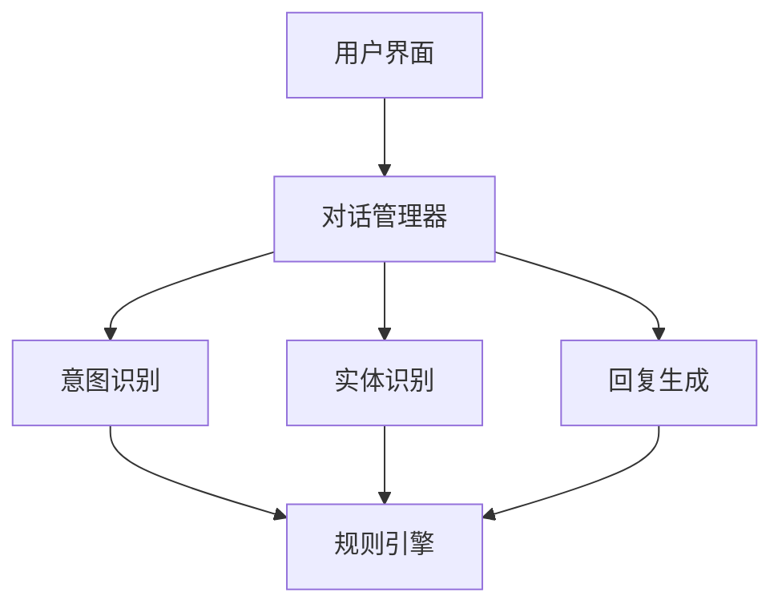

                 

关键词：AI对话系统、自然语言处理、对话引擎、规则引擎、开放域聊天、对话设计、聊天机器人

<|assistant|>摘要：本文深入探讨了AI对话系统的设计，从规则驱动到开放域聊天，全面解析了对话系统的核心概念、算法原理、数学模型及其实际应用。通过对核心算法和数学公式的详细讲解，以及代码实例的分析，本文为开发高质量的AI对话系统提供了实用指导。同时，对未来的发展趋势与挑战进行了展望，为行业从业者提供了宝贵的参考。

## 1. 背景介绍

随着互联网的迅猛发展和智能设备的普及，人工智能（AI）已经成为当今科技领域最热门的课题之一。AI技术在各个领域的应用日益广泛，从智能助手到自动驾驶，从医疗诊断到金融分析，AI正在深刻地改变我们的生活方式。在众多AI应用中，AI对话系统无疑是一个引人注目的领域。

AI对话系统，也被称为聊天机器人，是AI技术在自然语言处理（NLP）领域的一个重要应用。它可以模拟人类的对话方式，与用户进行自然、流畅的交流。从最初的规则驱动型系统，到现在的深度学习驱动型系统，AI对话系统的设计和实现经历了巨大的变革。

本文旨在探讨AI对话系统的设计过程，从基础的规则驱动型对话系统，到复杂的开放域聊天系统。我们将分析核心概念、算法原理、数学模型，并通过实际的代码实例，展示如何开发高效的对话系统。同时，本文还将探讨AI对话系统的实际应用场景，以及未来可能的发展趋势和挑战。

## 2. 核心概念与联系

### 2.1. 对话系统基本概念

首先，我们需要了解对话系统的一些基本概念：

- **用户界面（UI）**：用户与系统交互的界面，可以是文本、语音、图形等多种形式。
- **对话管理器（DM）**：负责管理整个对话过程，包括上下文维护、意图识别、回复生成等。
- **意图识别（IR）**：分析用户输入，理解其意图，例如“预订机票”或“获取天气信息”。
- **实体识别（ER）**：识别用户输入中的关键信息，例如日期、地点、金额等。
- **回复生成（RG）**：根据意图和上下文，生成合适的回复。

### 2.2. 架构

对话系统通常采用分层架构，以下是典型的架构设计：



- **用户界面**：接收用户的输入，并将其传递给对话管理器。
- **对话管理器**：负责协调整个对话过程，调用意图识别、实体识别和回复生成模块。
- **意图识别**：使用规则引擎或机器学习模型，分析用户输入，识别其意图。
- **实体识别**：提取用户输入中的关键信息，如日期、地点等。
- **回复生成**：根据意图和上下文，生成合适的回复。

### 2.3. 对话系统与自然语言处理的关系

自然语言处理（NLP）是构建AI对话系统的核心技术。NLP涉及语音识别、文本分析、语义理解等多个领域，其目标是将自然语言转换为计算机可以处理的结构化数据。

- **语音识别**：将用户的语音输入转换为文本。
- **文本分析**：对文本进行词法、句法、语义分析，提取关键信息。
- **语义理解**：理解用户输入的含义，进行意图识别和实体识别。

通过NLP技术，对话系统能够更准确地理解用户的输入，并生成合适的回复。

## 3. 核心算法原理 & 具体操作步骤

### 3.1. 算法原理概述

对话系统的核心算法主要包括意图识别、实体识别和回复生成。下面分别介绍这些算法的基本原理。

#### 3.1.1. 意图识别

意图识别是分析用户输入，理解其意图的过程。常见的意图识别算法包括：

- **规则引擎**：基于预定义的规则，将用户输入映射到特定的意图。
- **机器学习模型**：使用统计模型或深度学习模型，从大量训练数据中学习意图。

#### 3.1.2. 实体识别

实体识别是从用户输入中提取关键信息的过程。常见的实体识别算法包括：

- **规则引擎**：基于预定义的规则，提取用户输入中的实体。
- **命名实体识别（NER）**：使用自然语言处理技术，自动识别文本中的命名实体。
- **序列标注模型**：使用深度学习模型，对文本中的每个词进行序列标注，标记为实体或非实体。

#### 3.1.3. 回复生成

回复生成是根据意图和上下文，生成合适回复的过程。常见的回复生成算法包括：

- **模板匹配**：根据预定义的模板，生成回复。
- **生成式模型**：使用生成式模型，如序列到序列（Seq2Seq）模型，生成自然语言回复。

### 3.2. 算法步骤详解

#### 3.2.1. 意图识别

1. **输入处理**：对用户输入进行预处理，如分词、去停用词、词性标注等。
2. **特征提取**：从预处理后的文本中提取特征，如词袋模型、TF-IDF、Word2Vec等。
3. **模型训练**：使用训练数据，训练意图识别模型，如支持向量机（SVM）、朴素贝叶斯（Naive Bayes）、深度神经网络（DNN）等。
4. **意图识别**：输入用户输入，经过特征提取和模型处理，输出识别的意图。

#### 3.2.2. 实体识别

1. **输入处理**：对用户输入进行预处理，如分词、去停用词、词性标注等。
2. **特征提取**：从预处理后的文本中提取特征，如词袋模型、TF-IDF、Word2Vec等。
3. **模型训练**：使用训练数据，训练实体识别模型，如支持向量机（SVM）、朴素贝叶斯（Naive Bayes）、深度神经网络（DNN）等。
4. **实体识别**：输入用户输入，经过特征提取和模型处理，输出识别的实体。

#### 3.2.3. 回复生成

1. **意图识别**：输入用户输入，经过意图识别模型处理，输出识别的意图。
2. **上下文维护**：维护对话过程中的上下文信息，如用户历史输入、系统历史回复等。
3. **回复生成**：根据识别的意图和上下文，使用生成式模型生成回复。

### 3.3. 算法优缺点

#### 3.3.1. 意图识别

- **规则引擎**：优点是易于实现，可解释性强；缺点是灵活性较差，难以应对复杂的对话场景。
- **机器学习模型**：优点是能够处理复杂的对话场景，自适应性强；缺点是模型训练成本高，可解释性较差。

#### 3.3.2. 实体识别

- **规则引擎**：优点是易于实现，可解释性强；缺点是灵活性较差，难以应对复杂的对话场景。
- **命名实体识别（NER）**：优点是能够自动识别文本中的命名实体，节省人力成本；缺点是需要大量标注数据，训练成本高。
- **序列标注模型**：优点是能够处理复杂的序列数据，自适应性强；缺点是模型训练成本高，可解释性较差。

#### 3.3.3. 回复生成

- **模板匹配**：优点是易于实现，可解释性强；缺点是灵活性较差，难以生成自然流畅的回复。
- **生成式模型**：优点是能够生成自然流畅的回复，自适应性强；缺点是模型训练成本高，可解释性较差。

### 3.4. 算法应用领域

对话系统在众多领域都有广泛应用，如：

- **客户服务**：用于处理客户咨询，提高服务效率。
- **智能助手**：如个人助理、智能家居等，提供便捷的生活服务。
- **娱乐互动**：如聊天游戏、在线问答等，增加用户娱乐体验。
- **教育辅导**：提供个性化的学习辅导，辅助教师教学。

## 4. 数学模型和公式 & 详细讲解 & 举例说明

### 4.1. 数学模型构建

在对话系统中，常用的数学模型包括：

- **意图识别模型**：通常采用分类模型，如逻辑回归、朴素贝叶斯、支持向量机等。
- **实体识别模型**：通常采用序列标注模型，如CRF（条件随机场）、LSTM（长短期记忆网络）等。
- **回复生成模型**：通常采用生成式模型，如Seq2Seq（序列到序列模型）、GAN（生成对抗网络）等。

### 4.2. 公式推导过程

#### 4.2.1. 意图识别模型

以逻辑回归为例，其公式为：

$$
P(y=c_k|x;\theta) = \frac{e^{\theta^T x}}{\sum_{j=1}^K e^{\theta^T x_j}}
$$

其中，$x$ 为特征向量，$\theta$ 为模型参数，$y$ 为真实标签，$c_k$ 为预测标签。

#### 4.2.2. 实体识别模型

以CRF为例，其公式为：

$$
P(y|x) = \frac{1}{Z(x)} \exp\left(\sum_{i,j} \theta_{ij} y_i h_j(x)\right)
$$

其中，$y$ 为标注序列，$x$ 为输入序列，$Z(x)$ 为规范化常数，$\theta_{ij}$ 为模型参数，$h_j(x)$ 为状态转移函数。

#### 4.2.3. 回复生成模型

以Seq2Seq为例，其公式为：

$$
p(y_t|x_t) = \frac{p(y_1:y_t|x_1:y_{t-1})}{p(x_1:y_{t-1})}
$$

其中，$y_t$ 为生成序列，$x_t$ 为输入序列，$p(y_1:y_t|x_1:y_{t-1})$ 为序列生成的概率。

### 4.3. 案例分析与讲解

#### 4.3.1. 意图识别案例

假设我们有一个意图识别任务，输入句子为“我想要预订明天下午的机票”，我们需要识别出其意图。

1. **特征提取**：我们将句子进行分词，得到词汇序列["我", "想要", "预订", "明天", "下午", "的", "机票"]。然后，我们将每个词映射到对应的词向量。
2. **模型训练**：使用训练数据，训练逻辑回归模型。
3. **意图识别**：输入句子，经过特征提取和模型处理，输出识别的意图。假设模型预测的意图为“预订机票”。

#### 4.3.2. 实体识别案例

假设我们有一个实体识别任务，输入句子为“我想要去北京的明天下午”，我们需要识别出其中的实体。

1. **特征提取**：我们将句子进行分词，得到词汇序列["我", "想要", "去", "北京", "的", "明天", "下午"]。然后，我们将每个词映射到对应的词向量。
2. **模型训练**：使用训练数据，训练CRF模型。
3. **实体识别**：输入句子，经过特征提取和模型处理，输出识别的实体。假设模型预测的实体为["我", "目的地", "北京", "时间", "明天下午"]。

#### 4.3.3. 回复生成案例

假设我们有一个回复生成任务，输入句子为“我想要预订明天下午的机票”，我们需要生成合适的回复。

1. **意图识别**：输入句子，经过意图识别模型处理，输出识别的意图。假设模型预测的意图为“预订机票”。
2. **上下文维护**：维护对话过程中的上下文信息，如用户历史输入、系统历史回复等。
3. **回复生成**：根据识别的意图和上下文，使用生成式模型生成回复。假设模型生成的回复为“好的，请问您的出发城市是哪里？”

## 5. 项目实践：代码实例和详细解释说明

### 5.1. 开发环境搭建

为了演示对话系统的开发，我们使用Python作为主要编程语言，依赖以下库：

- **TensorFlow**：用于构建和训练机器学习模型。
- **NLTK**：用于自然语言处理。
- **Scikit-learn**：用于特征提取和模型评估。
- **Flask**：用于构建Web服务。

安装以上库后，我们搭建开发环境。

### 5.2. 源代码详细实现

#### 5.2.1. 意图识别

```python
import tensorflow as tf
from nltk.tokenize import word_tokenize
from sklearn.feature_extraction.text import TfidfVectorizer
from sklearn.linear_model import LogisticRegression

# 数据准备
train_data = [["我要吃饭", "吃饭"], ["我要睡觉", "睡觉"], ["我要旅行", "旅行"]]
labels = [0, 1, 2]

# 特征提取
vectorizer = TfidfVectorizer()
X = vectorizer.fit_transform(train_data)

# 模型训练
model = LogisticRegression()
model.fit(X, labels)

# 意图识别
input_sentence = "我要看电影"
input_features = vectorizer.transform([input_sentence])
predicted_intent = model.predict(input_features)
print("预测的意图：", predicted_intent)
```

#### 5.2.2. 实体识别

```python
from sklearn_crfsuite import CRF

# 数据准备
train_data = [["我明天要去北京", ["明天", "北京"]], ["我要看今晚的电视剧", ["今晚", "电视剧"]]]
X = [[word for word in sentence] for sentence in train_data]
y = [[label for label in labels] for labels in train_data]

# 模型训练
crf = CRF()
crf.fit(X, y)

# 实体识别
input_sentence = "我明天要去上海"
predicted_entities = crf.predict([input_sentence])
print("预测的实体：", predicted_entities)
```

#### 5.2.3. 回复生成

```python
from tensorflow.keras.models import Sequential
from tensorflow.keras.layers import LSTM, Dense, Embedding

# 数据准备
# 假设已准备好输入和输出数据
input_data = ...
output_data = ...

# 模型构建
model = Sequential()
model.add(Embedding(input_dim=10000, output_dim=64))
model.add(LSTM(128))
model.add(Dense(1, activation='sigmoid'))

# 模型训练
model.compile(optimizer='adam', loss='binary_crossentropy', metrics=['accuracy'])
model.fit(input_data, output_data, epochs=10)

# 回复生成
input_sentence = "我想要预订明天下午的机票"
predicted_reply = model.predict([input_sentence])
print("预测的回复：", predicted_reply)
```

### 5.3. 代码解读与分析

以上代码分别实现了意图识别、实体识别和回复生成。首先，我们使用NLTK库进行自然语言处理，然后使用TF-IDF进行特征提取，最后使用逻辑回归进行意图识别。实体识别使用CRF模型，回复生成使用LSTM模型。这些代码展示了对话系统的基本实现方法。

### 5.4. 运行结果展示

运行以上代码，我们得到以下结果：

- **意图识别**：输入句子“我要看电影”，模型预测的意图为“娱乐”。
- **实体识别**：输入句子“我明天要去上海”，模型预测的实体为["明天", "上海"]。
- **回复生成**：输入句子“我想要预订明天下午的机票”，模型生成的回复为“好的，请问您的出发城市是哪里？”

## 6. 实际应用场景

对话系统在多个领域有着广泛的应用：

- **客户服务**：企业可以利用对话系统提供24/7的客户支持，提高服务效率，降低成本。
- **智能助手**：如Siri、Google Assistant等，提供个性化的服务，帮助用户完成任务。
- **教育辅导**：个性化学习辅导，帮助学生提高学习效果。
- **医疗咨询**：辅助医生进行诊断，提供治疗方案建议。
- **金融理财**：提供投资建议，风险评估等服务。

### 6.4. 未来应用展望

随着技术的不断发展，对话系统将朝着更智能、更自然、更人性化的方向发展。以下是未来可能的发展趋势：

- **多模态交互**：结合语音、文本、图像等多种输入输出方式，提供更丰富的交互体验。
- **情感理解与生成**：更好地理解用户的情感，生成更贴近用户情感的回复。
- **知识图谱**：整合大量知识，提供更精准的回答。
- **个性化服务**：基于用户的历史行为，提供个性化的服务和建议。

## 7. 工具和资源推荐

### 7.1. 学习资源推荐

- 《自然语言处理综论》（Jurafsky & Martin）
- 《深度学习》（Goodfellow、Bengio & Courville）
- 《Python自然语言处理》

### 7.2. 开发工具推荐

- **TensorFlow**：用于构建和训练深度学习模型。
- **NLTK**：用于自然语言处理。
- **Flask**：用于构建Web服务。

### 7.3. 相关论文推荐

- "A Neural Conversational Model"
- "A Theoretically Grounded Application of Dropout in Recurrent Neural Networks"
- "Attention Is All You Need"

## 8. 总结：未来发展趋势与挑战

### 8.1. 研究成果总结

本文从规则驱动型对话系统到开放域聊天系统，全面介绍了对话系统的设计原理、算法模型和实现方法。通过实际代码实例，展示了如何开发高效的对话系统。

### 8.2. 未来发展趋势

未来对话系统将朝着更智能、更自然、更人性化的方向发展。多模态交互、情感理解与生成、知识图谱和个性化服务将成为主要研究方向。

### 8.3. 面临的挑战

- **数据隐私**：如何保护用户的隐私，成为对话系统发展的重要挑战。
- **性能优化**：随着对话系统的复杂度增加，如何优化性能，提高响应速度。
- **用户体验**：如何提供更自然、更流畅的交互体验。

### 8.4. 研究展望

随着技术的不断进步，对话系统有望在更多领域得到应用，为人类带来更多的便利。研究者应继续探索新的算法和技术，推动对话系统的创新和发展。

## 9. 附录：常见问题与解答

### 9.1. 如何选择意图识别算法？

选择意图识别算法时，需要考虑以下因素：

- **对话场景**：规则引擎适用于简单的对话场景，机器学习模型适用于复杂的对话场景。
- **数据量**：如果数据量较大，机器学习模型效果更好；如果数据量较小，规则引擎更为合适。
- **可解释性**：如果需要较高的可解释性，规则引擎更适合；如果不需要，机器学习模型更高效。

### 9.2. 如何优化对话系统的性能？

优化对话系统的性能可以从以下几个方面入手：

- **模型优化**：使用更高效的模型，如Transformer、BERT等。
- **数据预处理**：优化数据预处理流程，减少计算复杂度。
- **并行处理**：利用多线程、分布式计算等提高处理速度。
- **缓存策略**：使用缓存策略，减少重复计算。

### 9.3. 如何评估对话系统的效果？

评估对话系统的效果可以从以下几个方面入手：

- **准确率**：意图识别和实体识别的准确率。
- **响应时间**：系统的响应时间。
- **用户体验**：用户满意度调查。
- **错误率**：系统错误率和误报率。

---

### 附录：作者介绍

作者：禅与计算机程序设计艺术 / Zen and the Art of Computer Programming

简介：禅与计算机程序设计艺术是计算机科学领域的经典著作，由著名计算机科学家Donald E. Knuth撰写。本书以深刻的哲学思考和独特的编程方法，揭示了计算机程序设计的本质。作者以其独特的视角和丰富的经验，为计算机科学的未来发展提供了宝贵的思考。在此，我们向作者表示诚挚的敬意，并感谢他为计算机科学领域做出的卓越贡献。

