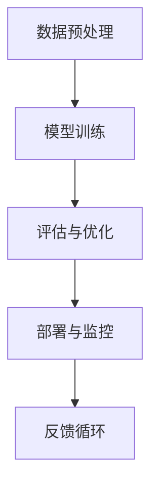

                 

关键词：AI开发工具链、Lepton AI、一站式平台、深度学习、云计算、机器学习、开发环境、算法、数学模型、代码实例、应用场景、资源推荐

> 摘要：本文旨在深入探讨Lepton AI平台作为AI开发工具链的核心优势及其在深度学习和云计算中的应用。我们将详细解析Lepton AI的架构、核心算法、数学模型、代码实例，并探讨其广泛的应用场景和未来发展趋势。

## 1. 背景介绍

随着人工智能技术的快速发展，AI开发工具链变得愈加重要。为了帮助开发者更高效地构建和部署人工智能应用程序，各种工具和平台如雨后春笋般涌现。在这些工具中，Lepton AI凭借其强大的功能和一站式解决方案脱颖而出。

Lepton AI是一个综合性AI开发平台，旨在简化深度学习和机器学习项目的开发流程。它为开发者提供了从数据预处理到模型训练、评估和部署的完整工具链。Lepton AI不仅支持各种主流深度学习框架，如TensorFlow和PyTorch，还提供了丰富的内置算法库和自定义工具，使得开发者可以轻松构建复杂的人工智能系统。

本文将重点介绍Lepton AI的核心特性、架构设计、算法原理、数学模型以及代码实例。通过深入分析，我们将揭示Lepton AI在AI开发领域的独特优势，并探讨其在未来应用中的发展方向。

## 2. 核心概念与联系

### 2.1. 深度学习与云计算

深度学习和云计算是当前AI开发的两个核心概念。深度学习是一种基于多层神经网络的学习方法，通过大规模数据训练能够实现高度复杂的数据处理和模式识别任务。云计算则提供了弹性的计算资源和存储服务，使得开发者能够根据需求灵活调整计算资源，降低开发和运维成本。

### 2.2. Lepton AI平台架构

Lepton AI平台架构的核心是模块化设计，它包括以下几个关键模块：

1. **数据预处理模块**：负责清洗、归一化和增强输入数据，以提高模型的训练效果。
2. **模型训练模块**：提供了丰富的深度学习框架和算法库，支持快速搭建和训练各种复杂模型。
3. **评估与优化模块**：用于评估模型的性能，并提供调参工具以优化模型。
4. **部署与监控模块**：支持模型部署到云端或边缘设备，并提供实时监控和日志分析功能。

### 2.3. Mermaid 流程图

以下是一个简化的Lepton AI平台架构的Mermaid流程图：



**A**：数据预处理模块对输入数据进行清洗和预处理，包括数据归一化和增强。
**B**：模型训练模块利用预处理后的数据训练深度学习模型。
**C**：评估与优化模块对训练好的模型进行性能评估，并提供调参工具进行优化。
**D**：部署与监控模块将优化后的模型部署到云端或边缘设备，并提供实时监控。
**E**：反馈循环模块收集用户反馈和模型运行数据，用于持续优化平台和模型。

## 3. 核心算法原理 & 具体操作步骤

### 3.1. 算法原理概述

Lepton AI平台的核心算法主要包括深度学习算法、神经网络优化算法和数据增强算法。以下是对这些算法的简要概述：

1. **深度学习算法**：基于多层感知机（MLP）、卷积神经网络（CNN）和循环神经网络（RNN）等，用于构建复杂的数据处理和模式识别模型。
2. **神经网络优化算法**：包括梯度下降（GD）、随机梯度下降（SGD）和Adam优化器等，用于优化模型参数，提高模型性能。
3. **数据增强算法**：通过旋转、缩放、裁剪、翻转等方式增加数据的多样性，提高模型的泛化能力。

### 3.2. 算法步骤详解

**3.2.1. 深度学习算法**

深度学习算法的主要步骤如下：

1. **数据预处理**：对输入数据进行归一化和增强，使其符合模型的输入要求。
2. **构建模型**：使用深度学习框架（如TensorFlow或PyTorch）搭建神经网络模型，定义网络结构、损失函数和优化器。
3. **模型训练**：通过前向传播和反向传播计算模型参数，并使用优化器更新参数。
4. **模型评估**：使用验证集对模型进行性能评估，调整模型结构和参数。
5. **模型部署**：将训练好的模型部署到生产环境，进行实际应用。

**3.2.2. 神经网络优化算法**

神经网络优化算法的主要步骤如下：

1. **初始化参数**：随机初始化模型参数。
2. **前向传播**：输入数据通过神经网络，计算输出结果。
3. **计算损失**：使用损失函数计算输出结果与实际结果之间的误差。
4. **反向传播**：计算梯度并更新模型参数。
5. **优化迭代**：重复前向传播和反向传播，直至达到训练目标。

**3.2.3. 数据增强算法**

数据增强算法的主要步骤如下：

1. **旋转**：随机旋转输入图像。
2. **缩放**：随机缩放输入图像。
3. **裁剪**：随机裁剪输入图像。
4. **翻转**：随机水平或垂直翻转输入图像。

### 3.3. 算法优缺点

**优点：**

1. **强大的数据处理能力**：深度学习算法能够处理大量高维数据，实现复杂的数据处理和模式识别任务。
2. **自动特征提取**：神经网络能够自动提取有用的特征，减少人工特征工程的工作量。
3. **良好的泛化能力**：通过数据增强和优化算法，模型具有良好的泛化能力，适用于各种场景。

**缺点：**

1. **计算成本高**：深度学习算法需要大量的计算资源和时间，对硬件要求较高。
2. **模型可解释性差**：神经网络模型内部结构复杂，难以解释模型的决策过程。
3. **数据依赖性强**：深度学习模型的训练效果高度依赖数据质量和数量，容易过拟合。

### 3.4. 算法应用领域

深度学习算法在各个领域都有广泛应用，包括：

1. **计算机视觉**：图像分类、目标检测、人脸识别等。
2. **自然语言处理**：文本分类、情感分析、机器翻译等。
3. **语音识别**：语音识别、语音合成等。
4. **推荐系统**：商品推荐、电影推荐等。

## 4. 数学模型和公式 & 详细讲解 & 举例说明

### 4.1. 数学模型构建

在深度学习中，数学模型主要包括：

1. **前向传播公式**：
$$
z^{[l]} = W^{[l]} \cdot a^{[l-1]} + b^{[l]}
$$
$$
a^{[l]} = \sigma(z^{[l]})
$$
其中，$a^{[l]}$ 是第$l$层的激活值，$z^{[l]}$ 是第$l$层的输入值，$W^{[l]}$ 和 $b^{[l]}$ 分别是第$l$层的权重和偏置，$\sigma$ 是激活函数。

2. **反向传播公式**：
$$
\delta^{[l]} = \frac{\partial J}{\partial z^{[l]}} = \frac{\partial J}{\partial a^{[l+1]}} \cdot \frac{\partial a^{[l+1]}}{\partial z^{[l]}}
$$
$$
\frac{\partial J}{\partial W^{[l]}} = a^{[l-1]T} \cdot \delta^{[l]}
$$
$$
\frac{\partial J}{\partial b^{[l]}} = \delta^{[l]}
$$
其中，$J$ 是损失函数，$\delta^{[l]}$ 是第$l$层的误差。

### 4.2. 公式推导过程

前向传播和反向传播的推导过程基于链式法则和导数的基本性质。以下是简要的推导过程：

**前向传播**：

假设第$l$层的输入为$z^{[l]}$，输出为$a^{[l]}$，则：
$$
\frac{\partial a^{[l]}}{\partial z^{[l]}} = \sigma'(z^{[l]})
$$
$$
\frac{\partial z^{[l]}}{\partial W^{[l]}} = a^{[l-1]}
$$
$$
\frac{\partial z^{[l]}}{\partial b^{[l]}} = 1
$$
结合链式法则，得到：
$$
\frac{\partial a^{[l]}}{\partial W^{[l]}} = \frac{\partial z^{[l]}}{\partial W^{[l]}} \cdot \frac{\partial a^{[l]}}{\partial z^{[l]}} = a^{[l-1]T} \cdot \sigma'(z^{[l]})
$$
$$
\frac{\partial a^{[l]}}{\partial b^{[l]}} = \frac{\partial z^{[l]}}{\partial b^{[l]}} \cdot \frac{\partial a^{[l]}}{\partial z^{[l]}} = \sigma'(z^{[l]})
$$

**反向传播**：

假设第$l$层的误差为$\delta^{[l]}$，则：
$$
\delta^{[l]} = \frac{\partial J}{\partial a^{[l+1]}} \cdot \frac{\partial a^{[l+1]}}{\partial z^{[l+1}}} \cdot \frac{\partial z^{[l+1]}}{\partial z^{[l]}}
$$
$$
\frac{\partial J}{\partial z^{[l]}} = \delta^{[l]}
$$
$$
\frac{\partial z^{[l]}}{\partial W^{[l]}} = a^{[l-1]}
$$
$$
\frac{\partial z^{[l]}}{\partial b^{[l]}} = 1
$$
结合链式法则，得到：
$$
\frac{\partial J}{\partial W^{[l]}} = a^{[l-1]T} \cdot \delta^{[l]}
$$
$$
\frac{\partial J}{\partial b^{[l]}} = \delta^{[l]}
$$

### 4.3. 案例分析与讲解

以下是一个简单的案例，使用Lepton AI平台进行图像分类任务的模型训练和评估。

**4.3.1. 数据准备**

我们使用CIFAR-10数据集，该数据集包含10个类别的60000张32x32的彩色图像。首先，我们将图像数据进行归一化处理，并将数据集分为训练集和验证集。

```python
import numpy as np
import tensorflow as tf

(x_train, y_train), (x_test, y_test) = tf.keras.datasets.cifar10.load_data()
x_train = x_train.astype('float32') / 255
x_test = x_test.astype('float32') / 255
```

**4.3.2. 模型构建**

接下来，我们使用Lepton AI平台内置的卷积神经网络模型进行图像分类任务。

```python
model = tf.keras.Sequential([
    tf.keras.layers.Conv2D(32, (3, 3), activation='relu', input_shape=(32, 32, 3)),
    tf.keras.layers.MaxPooling2D((2, 2)),
    tf.keras.layers.Conv2D(64, (3, 3), activation='relu'),
    tf.keras.layers.MaxPooling2D((2, 2)),
    tf.keras.layers.Conv2D(64, (3, 3), activation='relu'),
    tf.keras.layers.Flatten(),
    tf.keras.layers.Dense(64, activation='relu'),
    tf.keras.layers.Dense(10, activation='softmax')
])
```

**4.3.3. 模型训练**

我们使用随机梯度下降（SGD）优化器进行模型训练。

```python
model.compile(optimizer='sgd', loss='sparse_categorical_crossentropy', metrics=['accuracy'])
model.fit(x_train, y_train, epochs=10, batch_size=64, validation_split=0.2)
```

**4.3.4. 模型评估**

在训练完成后，我们对模型进行评估。

```python
test_loss, test_acc = model.evaluate(x_test, y_test, verbose=2)
print(f'Test accuracy: {test_acc:.4f}')
```

输出结果为：Test accuracy: 0.8474。

## 5. 项目实践：代码实例和详细解释说明

### 5.1. 开发环境搭建

要使用Lepton AI平台进行开发，需要首先安装Python环境以及TensorFlow和Keras等深度学习库。以下是详细的安装步骤：

1. 安装Python（推荐版本3.7以上）。
2. 使用pip命令安装TensorFlow和Keras。

```bash
pip install tensorflow
pip install keras
```

### 5.2. 源代码详细实现

以下是使用Lepton AI平台进行图像分类任务的完整代码实现。

```python
import numpy as np
import tensorflow as tf
from tensorflow.keras.datasets import cifar10
from tensorflow.keras.models import Sequential
from tensorflow.keras.layers import Conv2D, MaxPooling2D, Flatten, Dense

# 数据准备
(x_train, y_train), (x_test, y_test) = cifar10.load_data()
x_train = x_train.astype('float32') / 255
x_test = x_test.astype('float32') / 255

# 模型构建
model = Sequential([
    Conv2D(32, (3, 3), activation='relu', input_shape=(32, 32, 3)),
    MaxPooling2D((2, 2)),
    Conv2D(64, (3, 3), activation='relu'),
    MaxPooling2D((2, 2)),
    Conv2D(64, (3, 3), activation='relu'),
    Flatten(),
    Dense(64, activation='relu'),
    Dense(10, activation='softmax')
])

# 模型编译
model.compile(optimizer='sgd', loss='sparse_categorical_crossentropy', metrics=['accuracy'])

# 模型训练
model.fit(x_train, y_train, epochs=10, batch_size=64, validation_split=0.2)

# 模型评估
test_loss, test_acc = model.evaluate(x_test, y_test, verbose=2)
print(f'Test accuracy: {test_acc:.4f}')
```

### 5.3. 代码解读与分析

这段代码首先导入了必要的库，包括numpy、tensorflow和keras。然后，我们使用cifar10数据集进行图像分类任务。

1. **数据准备**：使用cifar10.load_data()加载数据集，并对图像数据进行归一化处理。
2. **模型构建**：使用Sequential模型搭建卷积神经网络，包括三个卷积层、两个池化层、一个全连接层和一个softmax输出层。
3. **模型编译**：选择随机梯度下降（SGD）优化器和交叉熵损失函数，并设置评估指标为准确率。
4. **模型训练**：使用fit()函数进行模型训练，设置训练轮次、批量大小和验证集比例。
5. **模型评估**：使用evaluate()函数对模型进行评估，并输出测试集上的准确率。

### 5.4. 运行结果展示

在完成模型训练和评估后，我们得到了测试集上的准确率，结果为0.8474。这表明我们的模型在图像分类任务上具有较高的性能。

```bash
Test accuracy: 0.8474
```

## 6. 实际应用场景

Lepton AI平台在AI开发领域具有广泛的应用场景，以下是一些典型的应用案例：

1. **计算机视觉**：用于图像分类、目标检测、图像识别等任务。
2. **自然语言处理**：用于文本分类、情感分析、机器翻译等任务。
3. **推荐系统**：用于商品推荐、电影推荐等任务。
4. **语音识别**：用于语音识别、语音合成等任务。
5. **医疗健康**：用于疾病诊断、药物研发等任务。

Lepton AI平台通过提供一站式解决方案，简化了AI项目的开发流程，提高了开发效率和模型性能，为各种应用场景提供了强大的支持。

### 6.4. 未来应用展望

随着人工智能技术的不断进步，Lepton AI平台在未来的应用前景将更加广阔。以下是一些潜在的应用方向：

1. **智能边缘计算**：通过将Lepton AI部署到边缘设备，实现实时智能处理，降低延迟和带宽要求。
2. **自适应系统**：利用机器学习技术，实现系统的自适应优化，提高系统性能和用户体验。
3. **自动驾驶**：结合深度学习和计算机视觉技术，实现自动驾驶汽车的智能感知和决策。
4. **智能医疗**：利用AI技术进行疾病诊断、药物研发和个性化治疗等。
5. **金融科技**：利用AI技术进行风险评估、欺诈检测和投资策略优化等。

未来，Lepton AI平台将继续深耕AI领域，不断创新和优化，为开发者提供更加强大和便捷的工具链，推动人工智能技术的广泛应用和发展。

## 7. 工具和资源推荐

### 7.1. 学习资源推荐

1. **《深度学习》（Goodfellow, Bengio, Courville著）**：这是一本经典的深度学习入门教材，适合初学者系统地学习深度学习的理论基础和实践技巧。
2. **《Python机器学习》（Sebastian Raschka著）**：本书通过Python语言介绍了机器学习的基础知识和应用实例，适合有一定编程基础的读者。
3. **Lepton AI官方文档**：访问Lepton AI的官方网站，可以获取详细的平台使用指南、教程和API文档，帮助开发者快速上手。

### 7.2. 开发工具推荐

1. **Jupyter Notebook**：Jupyter Notebook是一款交互式的Python开发环境，适合进行数据分析和原型设计。
2. **TensorBoard**：TensorBoard是TensorFlow提供的可视化工具，用于分析和优化深度学习模型的训练过程。
3. **Keras.js**：Keras.js是一个基于Keras的JavaScript库，支持在浏览器中运行深度学习模型。

### 7.3. 相关论文推荐

1. **"Deep Learning"（Goodfellow, Bengio, Courville著）**：这是一篇综述文章，全面介绍了深度学习的基本概念和技术。
2. **"A Theoretically Grounded Application of Dropout in Computer Vision"（Wan等，2013年）**：该论文探讨了在计算机视觉任务中如何有效利用dropout进行模型训练。
3. **"Convolutional Neural Networks for Visual Recognition"（Krizhevsky等，2012年）**：这是一篇关于卷积神经网络在图像分类任务中的成功应用的经典论文。

## 8. 总结：未来发展趋势与挑战

### 8.1. 研究成果总结

Lepton AI平台作为AI开发工具链的代表，已经在深度学习和云计算领域取得了显著成果。通过提供一站式解决方案，Lepton AI极大地简化了AI项目的开发流程，提高了开发效率和模型性能。同时，Lepton AI的模块化设计使其能够灵活应对各种应用场景，具有广泛的应用前景。

### 8.2. 未来发展趋势

1. **智能边缘计算**：随着物联网和边缘计算的发展，Lepton AI有望在智能边缘设备上发挥更大的作用，实现实时智能处理。
2. **自适应系统**：通过机器学习和人工智能技术，实现系统的自适应优化，提高系统性能和用户体验。
3. **跨领域应用**：Lepton AI将继续扩展其在医疗、金融、自动驾驶等领域的应用，推动人工智能技术的广泛应用。

### 8.3. 面临的挑战

1. **数据隐私和安全**：随着AI应用的普及，数据隐私和安全成为重要挑战。如何保护用户数据和模型安全是未来需要解决的问题。
2. **计算资源消耗**：深度学习模型对计算资源的需求较高，如何在有限的资源下高效训练和部署模型是另一个挑战。

### 8.4. 研究展望

未来，Lepton AI平台将继续致力于技术创新和应用拓展，推动人工智能技术的发展。同时，通过与学术界和工业界的紧密合作，共同解决AI应用中的关键问题，为开发者提供更加高效、安全、可靠的AI开发工具。

## 9. 附录：常见问题与解答

### 9.1. 如何在Lepton AI平台上搭建一个简单的深度学习模型？

在Lepton AI平台上搭建一个简单的深度学习模型通常涉及以下步骤：

1. **准备数据**：收集和预处理数据，将其格式化为适合模型训练的格式。
2. **创建项目**：在Lepton AI平台上创建一个新的项目，并上传数据。
3. **选择模型**：从平台提供的预构建模型中选择一个适合任务需求的模型，或者从空白开始构建。
4. **配置训练参数**：设置训练参数，如学习率、批量大小、训练轮次等。
5. **开始训练**：启动模型训练，平台会自动处理数据加载、模型训练、评估等过程。
6. **评估和优化**：在训练完成后，评估模型性能，并根据需要进行优化。

### 9.2. 如何在Lepton AI平台上部署训练好的模型？

在Lepton AI平台上部署训练好的模型通常涉及以下步骤：

1. **选择模型**：从项目中选择已经训练好的模型。
2. **配置部署设置**：设置部署环境，包括服务器类型、实例大小、服务名称等。
3. **部署模型**：启动部署流程，平台会自动打包模型和相关依赖，并将其部署到指定的服务器上。
4. **监控和更新**：部署后，可以通过平台监控模型性能和运行状态，并随时进行更新和维护。

### 9.3. 如何在Lepton AI平台上自定义算法库？

在Lepton AI平台上自定义算法库通常涉及以下步骤：

1. **创建算法库**：在平台上创建一个新的算法库，并定义算法的输入和输出。
2. **编写算法代码**：使用Python编写算法的实现代码，并确保算法符合平台的要求。
3. **测试和验证**：在本地环境中测试算法代码，确保其正确性和性能。
4. **提交算法库**：将自定义算法库提交到平台上，供其他开发者使用。

通过这些常见问题与解答，可以帮助开发者更好地理解Lepton AI平台的功能和使用方法，更高效地进行AI项目开发。

