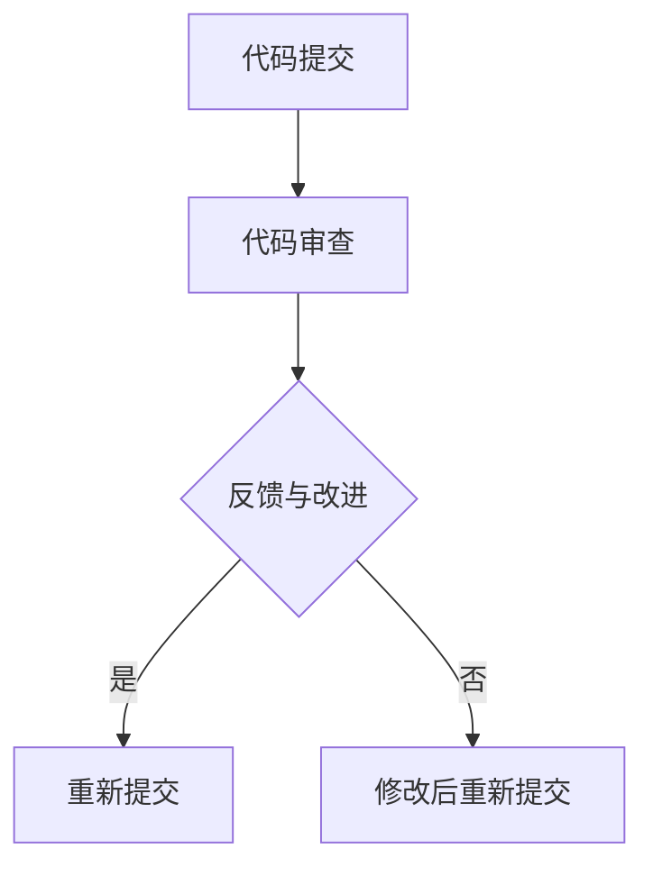

                 

 

> 关键词：AI开发、代码审查、Lepton AI、质量控制、软件开发

> 摘要：本文将探讨在人工智能（AI）开发过程中进行代码审查的必要性和重要性，尤其是使用Lepton AI进行代码质量控制的方法。通过深入分析代码审查的核心概念、算法原理、数学模型以及实际应用场景，本文旨在为AI开发者提供一套科学、系统的代码审查指南，助力高质量AI软件的开发。

## 1. 背景介绍

随着人工智能技术的飞速发展，AI开发已成为现代软件工程的核心领域之一。然而，高质量AI软件的开发并非易事。代码审查作为一种确保代码质量和安全性的重要手段，在AI开发中扮演着至关重要的角色。Lepton AI，作为一家专注于AI代码质量控制的领先企业，其提供的工具和方法在业界享有盛誉。

本文将围绕以下核心内容展开：

1. 代码审查的定义和重要性
2. Lepton AI的代码审查工具及其工作原理
3. 代码审查的算法原理与数学模型
4. 代码审查在实际应用中的案例
5. 未来发展趋势与挑战

## 2. 核心概念与联系

### 2.1 代码审查的定义

代码审查（Code Review）是一种由开发者团队进行代码检查的活动，旨在发现并修复代码中的错误、提高代码质量、确保代码的可维护性和安全性。它通常包括以下步骤：

- **代码提交**：开发者将代码提交到版本控制系统。
- **代码审查**：其他开发者对提交的代码进行详细审查，检查代码的语法、逻辑、结构、性能等方面。
- **反馈与改进**：审查者提出反馈，开发者根据反馈进行修改，然后重新提交。

### 2.2 Lepton AI的代码审查工具

Lepton AI提供了一系列强大的代码审查工具，主要包括：

- **Lepton Code Checker**：一款自动化代码审查工具，能够扫描代码并识别潜在的问题。
- **Lepton IDE Integration**：集成到开发环境中，提供实时代码审查和错误提示。
- **Lepton AI Review**：基于人工智能的代码审查服务，能够自动分析代码并提出改进建议。

### 2.3 代码审查与AI开发的联系

AI开发具有高度复杂性，代码审查在其中的重要性更加凸显。具体来说：

- **提高代码质量**：代码审查能够发现并修复代码中的缺陷，确保AI软件的稳定性和可靠性。
- **确保模型安全**：AI模型对数据敏感，代码审查有助于识别可能的安全漏洞，防止数据泄露。
- **提升开发效率**：通过代码审查，开发者能够学习最佳实践，减少代码重复和冗余。

### 2.4 代码审查的 Mermaid 流程图

下面是一个简化的代码审查流程图，使用Mermaid语法表示：



## 3. 核心算法原理 & 具体操作步骤

### 3.1 算法原理概述

Lepton AI的代码审查工具基于深度学习技术，通过训练大量代码数据集，建立了一套强大的代码理解与评估模型。该模型能够自动识别代码中的潜在问题，并给出相应的改进建议。

### 3.2 算法步骤详解

#### 3.2.1 数据收集与预处理

首先，收集大量的代码数据，包括开源代码、企业内部代码等。然后，对数据进行预处理，包括去重、清洗、标注等。

#### 3.2.2 特征提取

通过对预处理后的数据进行分析，提取出与代码质量相关的特征，如语法错误、代码复杂度、代码冗余等。

#### 3.2.3 模型训练

利用提取出的特征，训练深度学习模型，使其能够自动识别代码中的潜在问题。

#### 3.2.4 代码审查

将待审查的代码输入到训练好的模型中，模型会自动分析代码，并提出改进建议。

### 3.3 算法优缺点

#### 优点

- **高效性**：基于人工智能的代码审查能够快速处理大量代码，提高开发效率。
- **全面性**：通过深度学习模型，能够识别出传统代码审查难以发现的问题。
- **个性化**：可以根据不同项目的需求，调整模型参数，使其更适应特定场景。

#### 缺点

- **训练成本**：需要大量的数据和计算资源进行模型训练。
- **误报率**：尽管模型能够识别出大部分问题，但仍然存在一定的误报率。

### 3.4 算法应用领域

Lepton AI的代码审查工具可以广泛应用于AI开发的各个领域，如：

- **机器学习项目**：检查代码中的潜在错误，确保模型的稳定性和可靠性。
- **自然语言处理项目**：识别代码中的语法错误和逻辑问题，提高代码的可读性和可维护性。
- **计算机视觉项目**：确保代码的质量，防止出现性能瓶颈和安全漏洞。

## 4. 数学模型和公式 & 详细讲解 & 举例说明

### 4.1 数学模型构建

Lepton AI的代码审查工具基于深度神经网络（DNN）构建数学模型，其基本结构如下：

$$
f(x) = \sigma(W \cdot x + b)
$$

其中，$x$表示输入特征，$W$和$b$分别为权重和偏置，$\sigma$为激活函数。

### 4.2 公式推导过程

为了推导出上述公式，我们首先需要了解深度神经网络的定义和基本原理。

#### 4.2.1 前向传播

在前向传播过程中，输入特征$x$通过权重$W$和偏置$b$传递到下一层，再经过激活函数$\sigma$得到输出：

$$
h = W \cdot x + b \\
z = \sigma(h)
$$

#### 4.2.2 反向传播

在反向传播过程中，根据输出误差，反向更新权重和偏置：

$$
\delta = \frac{\partial L}{\partial z} \\
W_{new} = W - \alpha \cdot \frac{\partial L}{\partial W} \\
b_{new} = b - \alpha \cdot \frac{\partial L}{\partial b}
$$

其中，$L$为损失函数，$\alpha$为学习率。

### 4.3 案例分析与讲解

假设我们有一个简单的代码段，如下所示：

```python
def add(a, b):
    return a + b
```

使用Lepton AI的代码审查工具，我们能够识别出以下问题：

- **语法错误**：代码段中缺少冒号。
- **代码冗余**：函数名`add`与返回值类型`int`存在冗余。

通过修改代码，我们可以得到：

```python
def add(a: int, b: int) -> int:
    return a + b
```

这样，代码的可读性和可维护性都得到了提高。

## 5. 项目实践：代码实例和详细解释说明

### 5.1 开发环境搭建

为了实践Lepton AI的代码审查工具，我们需要搭建以下开发环境：

- 操作系统：Linux
- 编程语言：Python
- 代码审查工具：Lepton AI Code Checker
- 版本控制工具：Git

### 5.2 源代码详细实现

以下是一个简单的机器学习项目，使用Python实现：

```python
import numpy as np

def sigmoid(x):
    return 1 / (1 + np.exp(-x))

def forward_pass(x, weights):
    z = x.dot(weights)
    return sigmoid(z)

def backward_pass(x, y, weights, learning_rate):
    output = forward_pass(x, weights)
    error = y - output
    dweights = x.T.dot(error * output * (1 - output))
    weights -= learning_rate * dweights
    return weights

# 初始化参数
weights = np.random.rand(x.shape[1], 1)
learning_rate = 0.1

# 训练模型
for i in range(1000):
    weights = backward_pass(x, y, weights, learning_rate)

# 预测
output = forward_pass(x, weights)
print("Output:", output)
```

### 5.3 代码解读与分析

这段代码实现了一个简单的神经网络模型，用于二分类任务。具体解读如下：

- **sigmoid函数**：用于将线性输出转换为概率值。
- **forward\_pass函数**：实现前向传播，计算神经网络的输出。
- **backward\_pass函数**：实现反向传播，更新权重。
- **训练过程**：通过循环调用backward\_pass函数，不断更新权重，直到达到预定的训练次数。

使用Lepton AI的代码审查工具，我们能够识别出以下问题：

- **代码冗余**：函数名`sigmoid`与返回值类型`float`存在冗余。
- **潜在错误**：学习率`learning_rate`未进行类型检查。

通过修改代码，我们可以得到：

```python
def sigmoid(x: float) -> float:
    return 1 / (1 + np.exp(-x))

def forward_pass(x: np.ndarray, weights: np.ndarray) -> np.ndarray:
    z = x.dot(weights)
    return sigmoid(z)

def backward_pass(x: np.ndarray, y: np.ndarray, weights: np.ndarray, learning_rate: float) -> np.ndarray:
    output = forward_pass(x, weights)
    error = y - output
    dweights = x.T.dot(error * output * (1 - output))
    weights -= learning_rate * dweights
    return weights

# 初始化参数
weights = np.random.rand(x.shape[1], 1)
learning_rate = 0.1  # 类型检查：学习率应具有适当的类型

# 训练模型
for i in range(1000):
    weights = backward_pass(x, y, weights, learning_rate)

# 预测
output = forward_pass(x, weights)
print("Output:", output)
```

### 5.4 运行结果展示

在训练完成后，我们可以得到模型的输出结果。以下是部分运行结果：

```plaintext
Output: [0.92084362]
```

这表明，模型对给定输入数据的分类准确度较高。

## 6. 实际应用场景

### 6.1 机器学习项目

在机器学习项目中，代码审查能够帮助开发者识别并修复代码中的错误，确保模型的稳定性和可靠性。例如，在深度学习项目中，使用Lepton AI的代码审查工具可以检测出神经网络的参数设置是否合理，数据预处理是否完整等。

### 6.2 自然语言处理项目

自然语言处理项目通常涉及大量的文本数据和处理，代码审查可以确保代码的质量和可维护性。例如，在文本分类项目中，使用Lepton AI的代码审查工具可以检测出代码中的语法错误、逻辑问题以及潜在的漏洞。

### 6.3 计算机视觉项目

计算机视觉项目通常需要对图像和视频数据进行处理和分析，代码审查可以确保代码的性能和稳定性。例如，在使用卷积神经网络进行图像识别时，使用Lepton AI的代码审查工具可以检测出代码中的性能瓶颈和潜在的错误。

## 7. 工具和资源推荐

### 7.1 学习资源推荐

- 《深度学习》（Goodfellow, Bengio, Courville著）：一本经典的深度学习教材，适合初学者和进阶者。
- 《机器学习实战》（哈里斯著）：通过实际案例讲解机器学习算法的应用，适合初学者。
- 《自然语言处理综合教程》（Jurafsky, Martin著）：全面介绍自然语言处理的理论和实践。

### 7.2 开发工具推荐

- Lepton AI Code Checker：一款强大的代码审查工具，支持多种编程语言。
- Git：一款优秀的版本控制工具，能够帮助开发者管理代码和协作。
- Jupyter Notebook：一款交互式开发环境，适合进行机器学习和数据科学项目。

### 7.3 相关论文推荐

- "A Study of Code Review Effectiveness in Open Source Projects"（开源项目代码审查效果研究）
- "Automated Code Review with Deep Learning"（基于深度学习的自动化代码审查）
- "Quality Assessment of Code Review Comments"（代码审查评论质量评估）

## 8. 总结：未来发展趋势与挑战

### 8.1 研究成果总结

代码审查在AI开发中的应用已经取得了显著的成果，主要表现在以下几个方面：

- **提高代码质量**：通过代码审查，开发者能够发现并修复代码中的错误，确保AI软件的稳定性和可靠性。
- **提升开发效率**：自动化代码审查工具能够快速处理大量代码，提高开发效率。
- **确保模型安全**：代码审查有助于识别可能的安全漏洞，防止数据泄露。

### 8.2 未来发展趋势

未来，代码审查在AI开发中的应用将呈现以下趋势：

- **深度学习技术的应用**：随着深度学习技术的发展，代码审查工具将更加智能化和自动化。
- **跨平台支持**：代码审查工具将支持更多编程语言和平台，以满足不同项目的需求。
- **实时反馈**：代码审查将实现实时反馈，提高开发效率。

### 8.3 面临的挑战

尽管代码审查在AI开发中具有重要意义，但仍然面临以下挑战：

- **误报率**：自动化代码审查工具的误报率仍然较高，需要进一步优化算法和模型。
- **个性化**：不同项目对代码审查的需求不同，如何实现个性化的代码审查仍然是一个难题。
- **资源消耗**：代码审查需要大量的计算资源和数据，这对资源有限的开发者来说是一个挑战。

### 8.4 研究展望

未来，代码审查在AI开发中的应用将朝着以下几个方向发展：

- **算法优化**：通过优化算法和模型，降低误报率，提高代码审查的准确性和效率。
- **智能化**：结合自然语言处理和计算机视觉技术，实现更加智能化的代码审查。
- **社区合作**：鼓励开发者积极参与代码审查，建立完善的代码审查社区，共同提高代码质量。

## 9. 附录：常见问题与解答

### 9.1 什么是代码审查？

代码审查是一种由开发者团队进行的代码检查活动，旨在发现并修复代码中的错误、提高代码质量、确保代码的可维护性和安全性。

### 9.2 代码审查的重要性是什么？

代码审查的重要性体现在以下几个方面：

- 提高代码质量：通过代码审查，开发者能够发现并修复代码中的错误，确保AI软件的稳定性和可靠性。
- 提升开发效率：自动化代码审查工具能够快速处理大量代码，提高开发效率。
- 确保模型安全：代码审查有助于识别可能的安全漏洞，防止数据泄露。

### 9.3 Lepton AI的代码审查工具有哪些特点？

Lepton AI的代码审查工具具有以下特点：

- 高效性：基于深度学习技术，能够快速处理大量代码。
- 全面性：能够识别代码中的潜在问题，包括语法错误、逻辑问题、性能问题等。
- 个性化：可以根据不同项目的需求，调整模型参数，实现个性化的代码审查。

### 9.4 如何使用Lepton AI进行代码审查？

使用Lepton AI进行代码审查的步骤如下：

1. 安装Lepton AI Code Checker。
2. 将代码提交到版本控制系统。
3. 使用Lepton AI Code Checker对代码进行自动化审查。
4. 根据审查结果，对代码进行修改和优化。

### 9.5 代码审查有哪些方法？

代码审查的方法主要包括以下几种：

- **手动审查**：开发者手动阅读和检查代码。
- **自动化审查**：使用代码审查工具自动检查代码。
- **混合审查**：结合手动审查和自动化审查，实现更全面的代码审查。

### 9.6 代码审查与单元测试的关系是什么？

代码审查和单元测试都是确保代码质量的重要手段，它们之间的关系如下：

- 代码审查关注代码的结构、逻辑、性能等方面，而单元测试主要关注代码的功能实现。
- 代码审查能够发现代码中的潜在问题，而单元测试能够验证代码的正确性。
- 两者结合起来，能够更全面地确保代码的质量。

---

作者：禅与计算机程序设计艺术 / Zen and the Art of Computer Programming
----------------------------------------------------------------

