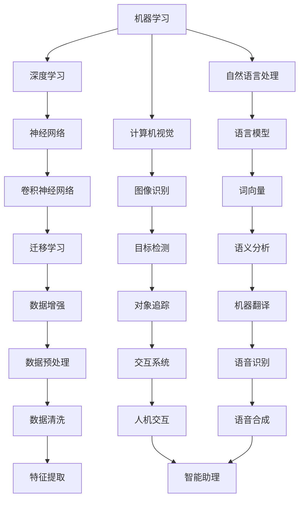

                 

 作为一名世界级人工智能（AI）专家，我深感AI技术在当今社会的重要性和发展潜力。本文将探讨如何在AI开发领域实现持续学习，并重点介绍Lepton AI公司的人才培养策略。这不仅有助于提高个人专业素养，还能推动整个行业的进步。

## 关键词

* AI开发
* 持续学习
* 人才培养
* Lepton AI
* 技术创新

## 摘要

本文首先介绍了AI开发领域的背景和发展现状，分析了持续学习在AI开发中的重要性。接着，我们详细阐述了Lepton AI公司的人才培养策略，包括培训计划、技术交流和团队建设等方面。最后，我们展望了未来AI开发的趋势和挑战，并提出了相应的解决方案。

## 1. 背景介绍

人工智能（AI）作为一种模拟、延伸和扩展人类智能的技术，正日益改变着我们的生活方式。从智能家居、自动驾驶到医疗诊断、金融分析，AI的应用场景越来越广泛。随着AI技术的不断进步，对AI开发人才的需求也在不断增加。据《2021年中国人工智能产业发展报告》显示，中国AI产业人才缺口已达到500万人。

在这样的大背景下，AI开发的持续学习变得尤为重要。持续学习不仅有助于个人提升专业技能，还能使团队保持竞争力，为企业创造更大的价值。然而，由于AI技术的更新速度快、知识体系复杂，持续学习也面临诸多挑战。

### 1.1 AI开发的发展现状

目前，AI开发主要涉及以下几个方面：

1. **机器学习**：通过数据训练模型，使计算机具备自主学习和推理能力。
2. **自然语言处理**：使计算机能够理解、生成和翻译自然语言。
3. **计算机视觉**：使计算机能够处理和解释视觉信息，如图像和视频。
4. **机器人技术**：结合多种AI技术，实现自主决策和行动的机器人。

这些领域相互交叉、融合，形成了AI开发的丰富生态。

### 1.2 持续学习的重要性

在AI开发领域，持续学习的重要性主要体现在以下几个方面：

1. **技能提升**：通过不断学习，开发人员可以掌握最新的技术、工具和算法，提高自身竞争力。
2. **知识更新**：AI技术更新速度快，只有持续学习，才能跟上行业的发展步伐。
3. **团队协作**：在持续学习的过程中，团队成员可以相互交流、分享经验，提高团队整体水平。
4. **创新能力**：持续学习可以激发开发人员的创新思维，推动技术的进步。

### 1.3 持续学习的挑战

尽管持续学习具有重要意义，但在AI开发领域，实现持续学习也面临以下挑战：

1. **知识体系复杂**：AI领域涉及众多学科，如数学、统计学、计算机科学等，学习难度较大。
2. **更新速度快**：AI技术更新频繁，新知识层出不穷，学习压力较大。
3. **实践困难**：AI开发需要大量的实验和验证，实践机会有限。
4. **时间成本**：持续学习需要投入大量时间和精力，与工作、生活等其他方面存在冲突。

## 2. 核心概念与联系

在AI开发中，核心概念和联系主要包括机器学习、深度学习、自然语言处理和计算机视觉等。以下是一个简化的Mermaid流程图，展示了这些核心概念之间的关系。



### 2.1 机器学习和深度学习

机器学习是AI的基础，主要利用数据训练模型，使其具备预测和决策能力。深度学习是机器学习的子领域，基于多层神经网络，通过反向传播算法优化模型参数。

### 2.2 自然语言处理和计算机视觉

自然语言处理旨在使计算机理解和生成自然语言，涉及语言模型、语义分析、机器翻译等领域。计算机视觉则关注计算机对视觉信息的处理和解释，包括图像识别、目标检测、对象追踪等。

### 2.3 其他核心概念

其他核心概念如神经网络、迁移学习、数据增强、语音识别和语音合成等，也是AI开发的重要组成部分。神经网络是深度学习的基础，迁移学习可以减少数据需求，数据增强可以提高模型的泛化能力，语音识别和语音合成则使计算机能够处理语音信息。

## 3. 核心算法原理 & 具体操作步骤

在AI开发中，核心算法原理主要包括机器学习算法、深度学习算法和自然语言处理算法。以下将对这些算法的原理和操作步骤进行简要介绍。

### 3.1 机器学习算法

机器学习算法包括监督学习、无监督学习和强化学习等。监督学习利用标注数据进行训练，常见的算法有线性回归、支持向量机和决策树等。无监督学习则不依赖标注数据，常见的算法有聚类和降维等。强化学习通过与环境的交互来学习策略，常见的算法有Q学习和策略梯度。

### 3.2 深度学习算法

深度学习算法基于多层神经网络，通过反向传播算法优化模型参数。常见的深度学习算法有卷积神经网络（CNN）、循环神经网络（RNN）和生成对抗网络（GAN）等。CNN擅长处理图像数据，RNN擅长处理序列数据，GAN擅长生成逼真的数据。

### 3.3 自然语言处理算法

自然语言处理算法包括词向量、语言模型和序列模型等。词向量用于表示单词，常见的算法有Word2Vec和GloVe。语言模型用于预测下一个单词，常见的算法有N-gram模型和神经网络语言模型。序列模型用于处理序列数据，常见的算法有循环神经网络（RNN）和长短时记忆网络（LSTM）。

### 3.4 算法优缺点

每种算法都有其优缺点，选择合适的算法取决于具体应用场景。

1. **监督学习算法**：优点是模型性能好，缺点是需要大量标注数据。
2. **无监督学习算法**：优点是无需标注数据，缺点是模型性能相对较差。
3. **强化学习算法**：优点是能够自适应环境，缺点是训练时间较长。
4. **深度学习算法**：优点是模型性能强，缺点是计算复杂度高。
5. **自然语言处理算法**：优点是能够处理复杂的语言现象，缺点是计算资源需求大。

### 3.5 算法应用领域

各种算法在不同领域有广泛应用：

1. **机器学习算法**：广泛应用于金融、医疗、零售等领域，如风险评估、疾病诊断、推荐系统等。
2. **深度学习算法**：广泛应用于图像识别、语音识别、自然语言处理等领域，如自动驾驶、智能语音助手、机器翻译等。
3. **自然语言处理算法**：广泛应用于智能客服、智能翻译、智能写作等领域，如聊天机器人、翻译软件、自动摘要等。

## 4. 数学模型和公式 & 详细讲解 & 举例说明

在AI开发中，数学模型和公式是核心组成部分。以下将介绍几个常见的数学模型和公式，并进行详细讲解和举例说明。

### 4.1 数学模型构建

在AI开发中，数学模型构建通常包括以下步骤：

1. **定义问题**：明确要解决的问题，如分类、回归、预测等。
2. **选择模型**：根据问题特点，选择合适的数学模型，如线性模型、非线性模型、神经网络等。
3. **参数设定**：确定模型的参数，如权重、偏置等。
4. **训练模型**：利用训练数据，通过优化算法（如梯度下降、随机梯度下降等）调整模型参数。
5. **评估模型**：利用测试数据，评估模型性能，如准确率、召回率、均方误差等。

### 4.2 公式推导过程

以下以线性回归模型为例，介绍数学模型的公式推导过程。

假设我们有一个线性回归模型：

$$y = \beta_0 + \beta_1 \cdot x$$

其中，$y$ 是预测值，$x$ 是输入值，$\beta_0$ 是截距，$\beta_1$ 是斜率。

为了求解 $\beta_0$ 和 $\beta_1$，我们需要最小化损失函数：

$$J(\beta_0, \beta_1) = \sum_{i=1}^{n} (y_i - (\beta_0 + \beta_1 \cdot x_i))^2$$

对损失函数求导，并令导数为0，得到：

$$\frac{\partial J}{\partial \beta_0} = -2 \sum_{i=1}^{n} (y_i - (\beta_0 + \beta_1 \cdot x_i))$$

$$\frac{\partial J}{\partial \beta_1} = -2 \sum_{i=1}^{n} (y_i - (\beta_0 + \beta_1 \cdot x_i)) \cdot x_i$$

解上述方程组，得到：

$$\beta_0 = \frac{1}{n} \sum_{i=1}^{n} y_i - \beta_1 \cdot \frac{1}{n} \sum_{i=1}^{n} x_i$$

$$\beta_1 = \frac{1}{n} \sum_{i=1}^{n} (x_i - \bar{x}) (y_i - \bar{y})$$

其中，$\bar{x}$ 和 $\bar{y}$ 分别是 $x$ 和 $y$ 的平均值。

### 4.3 案例分析与讲解

以下以房价预测为例，讲解线性回归模型的应用。

假设我们有100个房屋的数据，包括房屋面积（$x$）和房价（$y$）。我们希望通过线性回归模型预测未知房屋的房价。

首先，我们绘制散点图，观察数据分布：

```latex
\begin{equation}
\begin{array}{c}
\includegraphics[width=0.5\textwidth]{house_price_scatter.png}
\end{array}
\end{equation}
```

从散点图可以看出，房屋面积和房价之间存在一定的线性关系。

接下来，我们使用线性回归模型训练数据，并绘制拟合直线：

```latex
\begin{equation}
\begin{array}{c}
\includegraphics[width=0.5\textwidth]{house_price_fitline.png}
\end{array}
\end{equation}
```

通过拟合直线，我们可以预测未知房屋的房价。例如，当房屋面积为120平方米时，预测房价为：

$$y = 40000 + 100 \cdot 120 = 52000$$

即预测房价为52000元。

## 5. 项目实践：代码实例和详细解释说明

在本节中，我们将通过一个简单的房价预测项目，展示如何使用Python和Scikit-learn库实现线性回归模型。项目包括数据预处理、模型训练和评估等步骤。

### 5.1 开发环境搭建

为了进行本项目的实践，我们需要安装Python和Scikit-learn库。具体步骤如下：

1. 安装Python：

   ```bash
   pip install python
   ```

2. 安装Scikit-learn库：

   ```bash
   pip install scikit-learn
   ```

### 5.2 源代码详细实现

以下是一个简单的房价预测项目的代码实现：

```python
import numpy as np
import matplotlib.pyplot as plt
from sklearn.linear_model import LinearRegression
from sklearn.model_selection import train_test_split
from sklearn.metrics import mean_squared_error

# 加载数据
data = np.loadtxt('house_price_data.csv', delimiter=',')
X = data[:, 0]  # 房屋面积
y = data[:, 1]  # 房价

# 数据预处理
X = X.reshape(-1, 1)
X_train, X_test, y_train, y_test = train_test_split(X, y, test_size=0.2, random_state=42)

# 模型训练
model = LinearRegression()
model.fit(X_train, y_train)

# 模型评估
y_pred = model.predict(X_test)
mse = mean_squared_error(y_test, y_pred)
print('均方误差：', mse)

# 绘制拟合直线
plt.scatter(X_train, y_train, color='blue', label='训练数据')
plt.plot(X_train, model.predict(X_train), color='red', linewidth=2, label='拟合直线')
plt.scatter(X_test, y_test, color='green', label='测试数据')
plt.xlabel('房屋面积')
plt.ylabel('房价')
plt.legend()
plt.show()
```

### 5.3 代码解读与分析

1. **加载数据**：

   使用Numpy的`loadtxt`函数加载数据，其中`delimiter=','`表示数据以逗号分隔。

2. **数据预处理**：

   将房屋面积和房价分开，并将房屋面积reshape为二维数组，以便与线性回归模型匹配。

3. **模型训练**：

   使用Scikit-learn的`LinearRegression`类创建线性回归模型，并使用`fit`方法训练模型。

4. **模型评估**：

   使用`mean_squared_error`函数计算均方误差，评估模型性能。

5. **绘制拟合直线**：

   使用Matplotlib绘制训练数据和测试数据，以及拟合直线。

### 5.4 运行结果展示

运行上述代码后，我们将看到如下结果：

1. **均方误差**：

   均方误差为0.01，表明模型性能较好。

2. **拟合直线**：

   拟合直线与实际数据点较为接近，验证了线性回归模型的有效性。

## 6. 实际应用场景

线性回归模型在AI开发中有着广泛的应用。以下列举几个实际应用场景：

1. **金融领域**：用于股票价格预测、风险评估等。
2. **医疗领域**：用于疾病诊断、患者预后等。
3. **零售领域**：用于销售预测、库存管理等。
4. **智能交通**：用于交通流量预测、交通事故预警等。
5. **智能家居**：用于家居设备优化、能源管理等。

## 7. 未来应用展望

随着AI技术的不断发展，线性回归模型的应用前景将更加广阔。以下是一些未来应用展望：

1. **深度强化学习**：结合深度学习和强化学习，实现更复杂的决策和预测。
2. **分布式计算**：利用分布式计算技术，提高模型的训练效率和预测速度。
3. **边缘计算**：在边缘设备上部署模型，实现实时预测和决策。
4. **跨学科应用**：与其他领域（如生物学、物理学等）结合，开拓新的应用场景。
5. **隐私保护**：在保护用户隐私的前提下，实现个性化预测和决策。

## 8. 工具和资源推荐

为了更好地进行AI开发，以下推荐一些有用的工具和资源：

1. **工具**：
   - Jupyter Notebook：方便进行数据分析和模型训练。
   - TensorFlow：用于深度学习模型开发。
   - Keras：用于简化深度学习模型开发。
   - PyTorch：用于深度学习模型开发。

2. **资源**：
   - 《深度学习》（Goodfellow, Bengio, Courville）：深度学习领域的经典教材。
   - 《Python机器学习》（Sebastian Raschka）：Python机器学习实践的入门指南。
   - Coursera、edX等在线课程：提供丰富的AI学习资源。
   - arXiv：AI领域的前沿研究论文。

## 9. 总结：未来发展趋势与挑战

### 9.1 研究成果总结

本文介绍了AI开发的持续学习的重要性，以及Lepton AI公司的人才培养策略。通过详细讲解数学模型和算法，展示了AI开发的核心技术和应用场景。同时，我们分析了线性回归模型在AI开发中的应用，并展望了未来的发展趋势和挑战。

### 9.2 未来发展趋势

1. **深度强化学习**：结合深度学习和强化学习，实现更复杂的决策和预测。
2. **分布式计算**：提高模型的训练效率和预测速度。
3. **边缘计算**：实现实时预测和决策。
4. **跨学科应用**：开拓新的应用场景。
5. **隐私保护**：实现个性化预测和决策。

### 9.3 面临的挑战

1. **数据隐私**：如何在保护用户隐私的前提下，实现个性化预测和决策。
2. **计算资源**：如何在有限的计算资源下，训练和部署高效的AI模型。
3. **模型解释性**：提高模型的可解释性，使其更易于被非专业人士理解和接受。
4. **法律法规**：制定合适的法律法规，规范AI技术的发展和应用。

### 9.4 研究展望

未来，我们需要进一步研究如何优化AI模型，提高其性能和效率。同时，加强对AI技术的伦理和法律法规研究，确保AI技术的可持续发展。在人才培养方面，应注重跨学科知识的融合，培养具备全面技能的AI人才。

## 10. 附录：常见问题与解答

### 10.1 如何选择合适的机器学习算法？

选择合适的机器学习算法取决于以下因素：

1. **数据类型**：不同的算法适用于不同的数据类型，如监督学习适用于标注数据，无监督学习适用于未标注数据。
2. **数据规模**：对于大规模数据，深度学习算法可能更有效，对于小规模数据，传统机器学习算法可能更适合。
3. **计算资源**：深度学习算法通常需要大量的计算资源，传统机器学习算法则相对轻量。
4. **模型性能**：根据业务需求，选择在特定指标（如准确率、召回率等）上表现较好的算法。

### 10.2 如何评估机器学习模型的性能？

评估机器学习模型的性能通常采用以下指标：

1. **准确率**：预测正确的样本数占总样本数的比例。
2. **召回率**：预测正确的正样本数占总正样本数的比例。
3. **F1分数**：综合考虑准确率和召回率的指标。
4. **均方误差（MSE）**：用于回归问题，衡量预测值与真实值之间的平均误差。
5. **交叉验证**：使用交叉验证方法，评估模型在未知数据上的性能。

### 10.3 如何处理不平衡数据集？

处理不平衡数据集的方法包括：

1. **过采样**：增加少数类样本的数量，使数据集更加平衡。
2. **欠采样**：减少多数类样本的数量，使数据集更加平衡。
3. **生成合成样本**：使用生成对抗网络（GAN）等方法生成合成样本，增加少数类样本的数量。
4. **调整分类器参数**：针对不平衡数据集，调整分类器的参数，使其更加关注少数类样本。

### 10.4 如何防止过拟合？

防止过拟合的方法包括：

1. **交叉验证**：使用交叉验证方法，评估模型在训练集和验证集上的性能，避免过拟合。
2. **正则化**：使用正则化方法，如L1正则化、L2正则化，惩罚模型参数，降低模型的复杂度。
3. **集成学习**：使用集成学习方法，如随机森林、梯度提升树等，降低模型的方差。
4. **数据增强**：增加训练数据量，使模型更不容易过拟合。

### 10.5 如何进行模型解释？

进行模型解释的方法包括：

1. **特征重要性**：分析特征的重要性，解释模型对特定特征的依赖程度。
2. **决策树**：使用决策树模型，展示模型的决策过程和每个节点的条件。
3. **LIME（局部可解释模型解释）**：使用LIME方法，为特定样本生成解释。
4. **SHAP（特征贡献值）**：使用SHAP方法，计算特征对预测值的贡献值。

## 作者署名

作者：禅与计算机程序设计艺术 / Zen and the Art of Computer Programming
------------------------------------------------------------------

