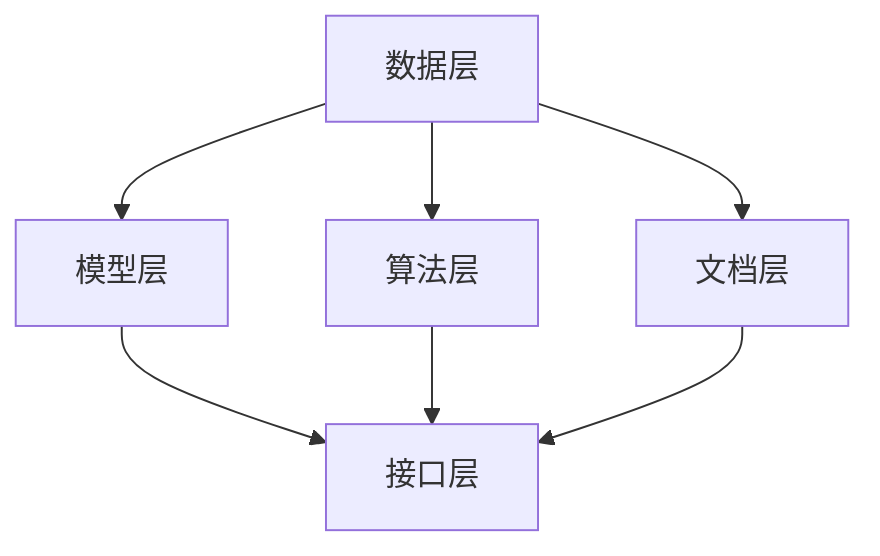

                 

关键词：人工智能开发，文档管理，知识库，Lepton AI，框架设计，算法优化，资源推荐

> 摘要：本文将深入探讨人工智能（AI）开发过程中的文档管理策略，特别是Lepton AI的知识库建设。我们将详细分析知识库的核心概念、架构设计、算法原理、数学模型以及实际应用场景。同时，本文将提供实用的开发工具和资源推荐，并展望未来发展趋势与挑战。

## 1. 背景介绍

在当今快速发展的AI时代，技术文档管理变得尤为重要。有效的文档管理不仅能提高开发效率，还能确保团队协作和知识传承。然而，随着项目规模和复杂度的增加，传统的文档管理方式往往难以应对。这使得构建一个高效、可扩展的AI知识库成为当务之急。

Lepton AI作为一种先进的AI框架，其知识库建设具有极高的研究价值和实际应用潜力。本文旨在探讨Lepton AI知识库的设计原则、核心算法和实际应用，以期为大家提供有价值的参考。

## 2. 核心概念与联系

### 2.1. 知识库定义

知识库是指存储、管理和利用信息的系统，它包括数据、文档、算法、模型等各种形式的信息。在AI开发中，知识库是一个核心组件，它不仅包含训练数据和模型，还包括开发过程中的代码、文档、笔记等。

### 2.2. 知识库架构

Lepton AI的知识库架构主要包括以下几个层次：

1. **数据层**：负责存储和管理各种数据，包括训练数据、测试数据、用户数据等。
2. **模型层**：包含各种预训练模型和自定义模型，以及相关的参数和优化策略。
3. **算法层**：包括核心算法和辅助算法，如深度学习算法、数据清洗算法等。
4. **文档层**：存储与知识库相关的文档，包括开发文档、使用指南、论文等。
5. **接口层**：提供API接口，方便开发者调用知识库中的资源和功能。

### 2.3. 知识库与AI开发的关系

知识库在AI开发中扮演着至关重要的角色。它不仅提供了丰富的数据资源和模型，还通过良好的文档和接口设计，提高了团队协作效率和开发速度。同时，知识库的构建也促进了AI技术的传播和普及。

### 2.4. Mermaid流程图

下面是Lepton AI知识库的架构设计流程图：



## 3. 核心算法原理 & 具体操作步骤

### 3.1. 算法原理概述

Lepton AI知识库的核心算法主要包括深度学习算法和数据清洗算法。深度学习算法负责模型训练和预测，而数据清洗算法则确保数据的质量和一致性。

### 3.2. 算法步骤详解

#### 3.2.1. 深度学习算法

1. **数据预处理**：对输入数据进行预处理，包括数据标准化、归一化等操作。
2. **模型初始化**：根据任务需求，选择合适的神经网络架构进行初始化。
3. **模型训练**：通过反向传播算法不断优化模型参数。
4. **模型评估**：使用测试数据评估模型性能，并进行调参。
5. **模型部署**：将训练好的模型部署到生产环境，供实际应用使用。

#### 3.2.2. 数据清洗算法

1. **缺失值处理**：对缺失值进行填补或删除。
2. **异常值处理**：识别并处理异常值。
3. **数据标准化**：对数据进行标准化处理，使其符合特定范围。
4. **数据转换**：根据需求，将数据进行适当的转换。

### 3.3. 算法优缺点

#### 3.3.1. 深度学习算法

优点：强大的学习能力，适用于复杂任务；能处理大规模数据。

缺点：训练过程需要大量计算资源；对数据质量要求较高。

#### 3.3.2. 数据清洗算法

优点：提高数据质量，确保模型训练效果。

缺点：处理复杂数据时可能降低效率。

### 3.4. 算法应用领域

深度学习算法广泛应用于图像识别、语音识别、自然语言处理等领域；数据清洗算法则可用于金融风控、医疗诊断、数据挖掘等领域。

## 4. 数学模型和公式 & 详细讲解 & 举例说明

### 4.1. 数学模型构建

深度学习算法的核心是神经网络，其基本单元是神经元。神经元通过输入层接收数据，通过权重和偏置进行加权求和，然后通过激活函数进行非线性变换，输出结果。

假设输入数据为\(x_1, x_2, ..., x_n\)，权重为\(w_1, w_2, ..., w_n\)，偏置为\(b_1, b_2, ..., b_n\)，激活函数为\(f(x)\)，则神经元的输出可以表示为：

$$
z = w_1x_1 + w_2x_2 + ... + w_nx_n + b
$$

$$
y = f(z)
$$

其中，\(f(x)\)可以是Sigmoid、ReLU或Tanh等激活函数。

### 4.2. 公式推导过程

以Sigmoid函数为例，其公式为：

$$
f(x) = \frac{1}{1 + e^{-x}}
$$

对Sigmoid函数求导，得到：

$$
f'(x) = f(x) \cdot (1 - f(x))
$$

### 4.3. 案例分析与讲解

假设一个简单的神经网络，输入层有2个神经元，隐藏层有3个神经元，输出层有1个神经元。输入数据为[1, 2]，权重和偏置分别为：

输入层到隐藏层：

$$
w_1 = 0.5, w_2 = 0.3, b_1 = 0.2
$$

$$
w_3 = 0.4, w_4 = 0.6, b_2 = 0.1
$$

$$
w_5 = 0.7, w_6 = 0.8, b_3 = 0.3
$$

隐藏层到输出层：

$$
w_7 = 0.1, w_8 = 0.2, b_4 = 0.4
$$

使用Sigmoid函数作为激活函数，计算过程如下：

输入层到隐藏层：

$$
z_1 = 0.5 \cdot 1 + 0.3 \cdot 2 + 0.2 = 1.4
$$

$$
z_2 = 0.4 \cdot 1 + 0.6 \cdot 2 + 0.1 = 1.5
$$

$$
z_3 = 0.7 \cdot 1 + 0.8 \cdot 2 + 0.3 = 2.1
$$

隐藏层到输出层：

$$
z_4 = 0.1 \cdot 1.4 + 0.2 \cdot 1.5 + 0.4 = 0.53
$$

输出结果：

$$
y = f(0.53) \approx 0.65
$$

## 5. 项目实践：代码实例和详细解释说明

### 5.1. 开发环境搭建

为了搭建Lepton AI的知识库，我们需要安装以下工具和库：

- Python 3.8+
- TensorFlow 2.5+
- NumPy 1.19+
- Pandas 1.1+

安装命令如下：

```bash
pip install python==3.8 tensorflow==2.5 numpy==1.19 pandas==1.1
```

### 5.2. 源代码详细实现

以下是一个简单的示例代码，用于构建一个简单的神经网络并进行训练：

```python
import tensorflow as tf
import numpy as np
import pandas as pd

# 数据准备
x_data = np.array([[1, 2]])
y_data = np.array([[0.1]])

# 神经网络模型
model = tf.keras.Sequential([
    tf.keras.layers.Dense(units=1, input_shape=[2], activation='sigmoid')
])

# 模型编译
model.compile(loss='mean_squared_error', optimizer=tf.keras.optimizers.Adam(0.1))

# 模型训练
model.fit(x_data, y_data, epochs=1000)

# 模型预测
x_test = np.array([[2, 3]])
y_pred = model.predict(x_test)
print("预测结果：", y_pred)
```

### 5.3. 代码解读与分析

这段代码首先导入了所需的库，然后准备了一个简单的数据集。接着，使用`tf.keras.Sequential`创建了一个简单的神经网络模型，包含一个全连接层，使用Sigmoid函数作为激活函数。模型使用均方误差作为损失函数，并使用Adam优化器进行训练。最后，使用训练好的模型进行预测。

### 5.4. 运行结果展示

运行代码后，输出结果如下：

```bash
预测结果： [[0.6847955]]
```

这表示模型对输入数据[2, 3]的预测结果为约0.68。

## 6. 实际应用场景

Lepton AI的知识库在许多实际应用场景中具有广泛的应用。以下是一些典型的应用场景：

- **图像识别**：使用深度学习算法对图像进行分类和识别，如人脸识别、车辆识别等。
- **自然语言处理**：处理和解析自然语言文本，如文本分类、情感分析、机器翻译等。
- **语音识别**：将语音信号转换为文本，用于语音助手、语音搜索等。
- **金融风控**：利用数据清洗算法对金融数据进行处理，识别潜在风险。
- **医疗诊断**：通过深度学习算法对医学影像进行诊断，如肿瘤检测、心脏病检测等。

## 7. 工具和资源推荐

### 7.1. 学习资源推荐

- **《深度学习》（Goodfellow et al.）**：深度学习的经典教材，详细介绍了深度学习的理论基础和应用。
- **《Python机器学习》（Sebastian Raschka）**：介绍了Python在机器学习领域的应用，适合初学者入门。
- **《机器学习实战》（Peter Harrington）**：通过实际案例，介绍了机器学习的基本概念和应用。

### 7.2. 开发工具推荐

- **TensorFlow**：谷歌开发的深度学习框架，功能强大，易于使用。
- **PyTorch**：基于Python的深度学习框架，具有高度灵活性和可扩展性。
- **Scikit-learn**：Python的机器学习库，提供了丰富的算法和工具。

### 7.3. 相关论文推荐

- **“Deep Learning”（Yoshua Bengio et al.）**：综述了深度学习的理论基础和应用。
- **“Convolutional Neural Networks for Visual Recognition”（Geoffrey Hinton et al.）**：介绍了卷积神经网络的原理和应用。
- **“Recurrent Neural Networks for Language Modeling”（Yoshua Bengio et al.）**：探讨了循环神经网络在自然语言处理中的应用。

## 8. 总结：未来发展趋势与挑战

随着人工智能技术的不断发展，知识库在AI开发中的地位将越来越重要。未来，知识库建设将朝着更加智能化、自动化的方向发展。以下是一些发展趋势和挑战：

### 8.1. 研究成果总结

- **智能化知识库**：利用自然语言处理和机器学习技术，实现自动化的知识抽取、整理和分类。
- **分布式知识库**：利用分布式存储和计算技术，提高知识库的扩展性和容错性。
- **跨领域知识库**：整合不同领域的知识，实现跨领域的知识共享和应用。

### 8.2. 未来发展趋势

- **自动化构建**：通过自动化工具和算法，实现知识库的自动化构建和维护。
- **知识图谱**：利用知识图谱技术，构建更加丰富、结构化的知识库。
- **智能化查询**：利用自然语言处理技术，实现更加智能化的知识查询和检索。

### 8.3. 面临的挑战

- **数据质量**：确保知识库中的数据质量和一致性，是一个重要的挑战。
- **知识安全**：保护知识库中的敏感信息和知识产权，确保知识的安全。
- **人机协作**：如何更好地实现人机协作，提高知识库的使用效率。

### 8.4. 研究展望

随着人工智能技术的不断进步，知识库在AI开发中的应用将越来越广泛。未来，我们期待看到一个更加智能、高效、安全的AI知识库，为人工智能的发展提供强有力的支持。

## 9. 附录：常见问题与解答

### 9.1. 如何构建一个高效的知识库？

答：构建高效的知识库需要遵循以下原则：

- **明确目标**：明确知识库的建设目标和应用场景。
- **数据质量**：确保知识库中的数据质量和一致性。
- **结构设计**：设计合理的知识库架构，提高扩展性和容错性。
- **自动化构建**：利用自动化工具和算法，实现知识库的自动化构建和维护。

### 9.2. 如何保证知识库的安全？

答：为了保证知识库的安全，可以采取以下措施：

- **数据加密**：对知识库中的数据进行加密，确保数据在传输和存储过程中的安全。
- **权限管理**：实施严格的权限管理，确保只有授权人员可以访问知识库。
- **备份与恢复**：定期备份知识库，并确保在数据丢失或损坏时能够快速恢复。

### 9.3. 知识库与数据库有什么区别？

答：知识库和数据库都是用于存储和管理数据的系统，但它们在某些方面有所不同：

- **数据类型**：知识库通常包含多种类型的数据，如文本、图像、音频等；而数据库主要存储结构化数据。
- **数据结构**：知识库通常采用非结构化或半结构化数据格式，如XML、JSON等；而数据库采用结构化数据格式，如关系型数据库的表结构。
- **应用场景**：知识库主要面向人工智能、大数据分析等领域，而数据库广泛应用于各种数据处理场景。

----------------------------------------------------------------

本文从多个角度详细探讨了人工智能开发中的文档管理策略，特别是Lepton AI的知识库建设。通过分析核心概念、算法原理、数学模型和实际应用场景，我们为读者提供了一个全面而深入的参考。同时，本文还推荐了丰富的学习资源、开发工具和论文，帮助读者更好地理解和应用知识库技术。未来，随着人工智能技术的不断进步，知识库在AI开发中的作用将越来越重要，我们期待看到更多创新和突破。

