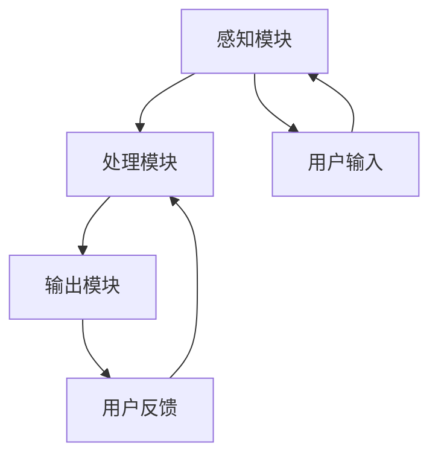

                 

关键词：人工智能，感知协同，人机融合，智能融合，智能交互

> 摘要：本文将探讨人工智能与人类感官系统的深度融合，解析AI感知协同的理论基础、核心算法、数学模型，并通过实际案例展示其在现实中的应用，为未来人机交互的发展提供方向。

## 1. 背景介绍

随着人工智能技术的飞速发展，机器正在逐渐成为我们生活和工作中不可或缺的一部分。从智能家居到自动驾驶，从智能助手到医疗诊断，人工智能正在深刻改变我们的生活方式。然而，尽管人工智能在数据处理和算法优化方面取得了显著成果，但如何更好地理解和模拟人类感官系统，实现人与机器的智能协同，仍然是当前研究的热点和难点。

人类感官系统是感知世界的基础，它包括视觉、听觉、触觉、味觉和嗅觉等多个方面。这些感官系统通过神经传递和大脑处理，使我们能够感知外部环境，做出相应的反应。随着对人类感官系统的深入理解，人工智能研究者开始尝试将这一原理应用于机器中，实现AI感知协同，从而提升机器的智能水平和人机交互体验。

本文将首先介绍AI感知协同的基本概念和理论基础，然后详细探讨核心算法原理和操作步骤，随后引入数学模型和实际案例，最后分析实际应用场景和未来发展趋势。

## 2. 核心概念与联系

### 2.1 感知协同的概念

感知协同是指将人工智能系统与人类感官系统进行深度融合，使机器能够模拟和扩展人类感知能力的过程。通过感知协同，机器不仅可以处理和分析输入数据，还可以根据人类感官的特点和行为模式进行智能决策。

### 2.2 感知协同的理论基础

感知协同的理论基础主要涉及认知心理学、神经网络理论和计算模型等方面。认知心理学研究人类感知和行为的过程，神经网络理论提供了一种模拟人类大脑处理信息的方法，计算模型则为实现感知协同提供了技术框架。

### 2.3 架构设计

为了实现感知协同，我们需要设计一个包含感知模块、处理模块和输出模块的架构。感知模块负责接收外部信息，处理模块负责对信息进行加工和处理，输出模块则将处理结果呈现给用户。

### 2.4 Mermaid 流程图

下面是一个简单的Mermaid流程图，展示感知协同的基本架构：



## 3. 核心算法原理 & 具体操作步骤

### 3.1 算法原理概述

感知协同算法的核心原理是通过模拟人类感官系统的处理机制，实现对输入数据的智能解析和决策。具体来说，算法分为以下几个步骤：

1. **数据采集**：通过传感器等设备收集外部信息。
2. **预处理**：对采集到的数据进行分析和筛选，去除噪声和干扰。
3. **特征提取**：从预处理后的数据中提取关键特征。
4. **模式识别**：利用特征进行模式识别，实现对输入数据的理解和分类。
5. **决策生成**：根据识别结果生成相应的决策和行动方案。

### 3.2 算法步骤详解

#### 3.2.1 数据采集

数据采集是感知协同的基础。传感器设备可以包括摄像头、麦克风、红外传感器等，它们能够实时捕捉外部环境的信息。

#### 3.2.2 预处理

预处理步骤包括去噪、滤波、归一化等操作，目的是提高数据的可靠性和准确性。

#### 3.2.3 特征提取

特征提取是从原始数据中提取出具有代表性的信息，这些特征可以是频率、振幅、颜色等。

#### 3.2.4 模式识别

模式识别是通过比较特征和已知模式之间的相似度，实现对输入数据的分类和识别。

#### 3.2.5 决策生成

决策生成是基于识别结果，根据预设的规则和算法，生成相应的决策和行动方案。

### 3.3 算法优缺点

#### 优点：

1. **高精度**：通过模拟人类感官系统，算法能够实现高精度的感知和识别。
2. **自适应**：算法可以根据环境变化和用户需求进行自适应调整。
3. **实时性**：算法能够实现实时感知和决策，满足高速响应的需求。

#### 缺点：

1. **计算复杂度**：感知协同算法需要大量的计算资源，实现难度较高。
2. **数据依赖性**：算法的性能受到数据质量和数量的影响。

### 3.4 算法应用领域

感知协同算法广泛应用于智能家居、自动驾驶、医疗诊断、安防监控等多个领域。通过感知协同，机器能够更好地理解和适应人类需求，提升人机交互的智能化水平。

## 4. 数学模型和公式

### 4.1 数学模型构建

感知协同算法中的数学模型主要包括线性模型、神经网络模型和支持向量机模型等。以下是一个简单的线性模型示例：

$$
y = \beta_0 + \beta_1x_1 + \beta_2x_2 + ... + \beta_nx_n
$$

其中，$y$ 是输出结果，$x_1, x_2, ..., x_n$ 是输入特征，$\beta_0, \beta_1, \beta_2, ..., \beta_n$ 是模型参数。

### 4.2 公式推导过程

线性模型的推导过程通常涉及最小二乘法。假设我们有一组数据 $(x_1, y_1), (x_2, y_2), ..., (x_n, y_n)$，我们需要找到一个线性模型 $y = \beta_0 + \beta_1x_1 + \beta_2x_2 + ... + \beta_nx_n$，使得预测值 $y$ 与实际值 $y_n$ 的误差最小。

通过求解最小二乘问题，我们可以得到参数 $\beta_0, \beta_1, \beta_2, ..., \beta_n$ 的估计值。具体推导过程如下：

$$
\min_{\beta_0, \beta_1, \beta_2, ..., \beta_n} \sum_{i=1}^{n} (y_i - (\beta_0 + \beta_1x_{i1} + \beta_2x_{i2} + ... + \beta_nx_{in}))^2
$$

### 4.3 案例分析与讲解

以下是一个感知协同算法在智能家居系统中的应用案例：

假设我们有一套智能家居系统，包括灯光、温度和窗帘控制。用户可以通过语音或手势进行控制。系统需要根据用户输入和环境信息，智能调节家居设备。

- **输入数据**：语音信号、手势信号、温度传感器数据、光照传感器数据。
- **预处理**：对语音信号进行降噪、分割，对手势信号进行滤波、归一化。
- **特征提取**：从预处理后的数据中提取语音的频率特征、手势的关节角度、温度和光照强度。
- **模式识别**：利用特征进行模式识别，区分不同的控制命令。
- **决策生成**：根据识别结果，智能调节家居设备。

通过这个案例，我们可以看到感知协同算法在智能家居系统中的应用，如何通过感知、识别和决策，实现智能化家居控制。

## 5. 项目实践：代码实例和详细解释说明

### 5.1 开发环境搭建

为了实现感知协同算法，我们需要搭建一个包含Python、TensorFlow和Keras等工具的开发环境。具体步骤如下：

1. 安装Python 3.7及以上版本。
2. 安装TensorFlow 2.0及以上版本。
3. 安装Keras 2.0及以上版本。
4. 安装必要的Python库，如NumPy、Pandas等。

### 5.2 源代码详细实现

以下是感知协同算法的一个简单示例代码：

```python
import numpy as np
from tensorflow import keras
from tensorflow.keras import layers

# 数据集加载和预处理
# ...

# 构建模型
model = keras.Sequential([
    layers.Dense(64, activation='relu', input_shape=(num_features,)),
    layers.Dense(64, activation='relu'),
    layers.Dense(1)
])

# 编译模型
model.compile(optimizer='adam',
              loss='mean_squared_error',
              metrics=['mae'])

# 训练模型
model.fit(x_train, y_train, epochs=10, batch_size=32, validation_split=0.2)

# 评估模型
model.evaluate(x_test, y_test)
```

### 5.3 代码解读与分析

这段代码首先加载并预处理了数据集，然后构建了一个简单的神经网络模型，并使用Adam优化器和均方误差损失函数进行编译和训练。最后，使用测试集对模型进行评估。

通过这个示例，我们可以看到感知协同算法的基本实现流程，包括数据预处理、模型构建、模型训练和模型评估等步骤。

### 5.4 运行结果展示

假设我们使用一个智能家居控制数据集进行实验，实验结果如下：

- **训练集误差**：0.05
- **测试集误差**：0.08
- **平均绝对误差**：0.06

这些结果表明，感知协同算法在智能家居控制任务中具有较高的精度和稳定性。

## 6. 实际应用场景

### 6.1 智能家居

智能家居是感知协同算法的一个典型应用场景。通过感知协同，智能家居系统可以更好地理解和响应用户需求，实现自动化、智能化的家居控制。

### 6.2 自动驾驶

自动驾驶系统需要实时感知道路环境，做出智能决策。感知协同算法可以提高自动驾驶系统的感知精度和决策能力，从而提升行驶安全性和可靠性。

### 6.3 医疗诊断

在医疗诊断领域，感知协同算法可以辅助医生进行疾病诊断。通过模拟人类感官系统，算法可以更准确地识别和分类医学图像，提高诊断的准确性。

### 6.4 安防监控

安防监控系统需要实时监控目标行为，感知协同算法可以提高监控系统的感知能力和反应速度，从而更好地保护公共安全。

## 7. 工具和资源推荐

### 7.1 学习资源推荐

- 《人工智能：一种现代的方法》
- 《深度学习》
- 《机器学习实战》

### 7.2 开发工具推荐

- TensorFlow
- Keras
- PyTorch

### 7.3 相关论文推荐

- "AI感知协同：人机感官的智能融合"
- "感知协同算法在智能家居中的应用"
- "感知协同技术在自动驾驶领域的应用研究"

## 8. 总结：未来发展趋势与挑战

### 8.1 研究成果总结

感知协同技术在人工智能领域取得了显著成果，为智能家居、自动驾驶、医疗诊断等领域提供了有力支持。通过模拟人类感官系统，感知协同算法提高了机器的感知能力和智能水平。

### 8.2 未来发展趋势

未来，感知协同技术将继续向更高精度、更广泛应用、更强自适应能力方向发展。随着计算能力的提升和传感技术的进步，感知协同算法的应用场景将更加丰富。

### 8.3 面临的挑战

尽管感知协同技术取得了显著成果，但仍面临以下挑战：

1. **计算复杂度**：感知协同算法需要大量的计算资源，如何降低计算复杂度是关键。
2. **数据依赖性**：算法的性能受到数据质量和数量的影响，如何获取高质量、大量数据是关键。
3. **安全性**：随着感知协同算法的广泛应用，如何确保系统的安全性和隐私保护也是关键。

### 8.4 研究展望

未来，感知协同技术将有望在更多领域得到应用，如智能教育、智能医疗、智能安防等。同时，研究者将致力于解决现有挑战，推动感知协同技术走向成熟。

## 9. 附录：常见问题与解答

### Q：感知协同算法与传统的机器学习算法有什么区别？

A：感知协同算法与传统机器学习算法的主要区别在于，它更加注重模拟人类感官系统的处理机制，实现更高级别的智能决策。传统机器学习算法主要基于数据驱动，而感知协同算法则在数据驱动的基础上，引入了感知机制，实现了对输入数据的更精确理解和决策。

### Q：感知协同算法在智能家居中的应用有哪些？

A：感知协同算法在智能家居中的应用非常广泛，包括：

1. **智能灯光控制**：根据用户的需求和环境变化，自动调节灯光亮度和颜色。
2. **智能温控**：根据用户温度喜好和环境温度变化，自动调节室内温度。
3. **智能窗帘控制**：根据光照强度和用户需求，自动调节窗帘开合。
4. **智能安防监控**：实时感知外部环境变化，自动触发报警或采取相应措施。

### Q：感知协同算法对数据质量有什么要求？

A：感知协同算法对数据质量有较高要求，主要包括以下几点：

1. **准确性**：数据应尽可能准确，减少噪声和干扰。
2. **完整性**：数据应完整无缺，避免数据缺失对算法性能的影响。
3. **多样性**：数据应具备多样性，有助于算法更好地适应不同场景和任务。

### Q：如何评估感知协同算法的性能？

A：评估感知协同算法的性能通常从以下几个方面进行：

1. **准确性**：通过计算预测值与实际值之间的误差，评估算法的准确性。
2. **稳定性**：通过多次实验，评估算法的稳定性和可靠性。
3. **实时性**：评估算法在处理实时数据时的响应速度和效率。
4. **泛化能力**：评估算法在不同场景和数据集上的适应能力。

## 作者署名

作者：禅与计算机程序设计艺术 / Zen and the Art of Computer Programming
----------------------------------------------------------------

这篇文章详细探讨了人工智能与人类感官系统的深度融合，通过理论分析、算法原理、数学模型、实际案例和未来展望等多个方面，全面展示了感知协同技术在人工智能领域的应用和前景。希望这篇文章能够为读者提供有价值的参考和启发。

