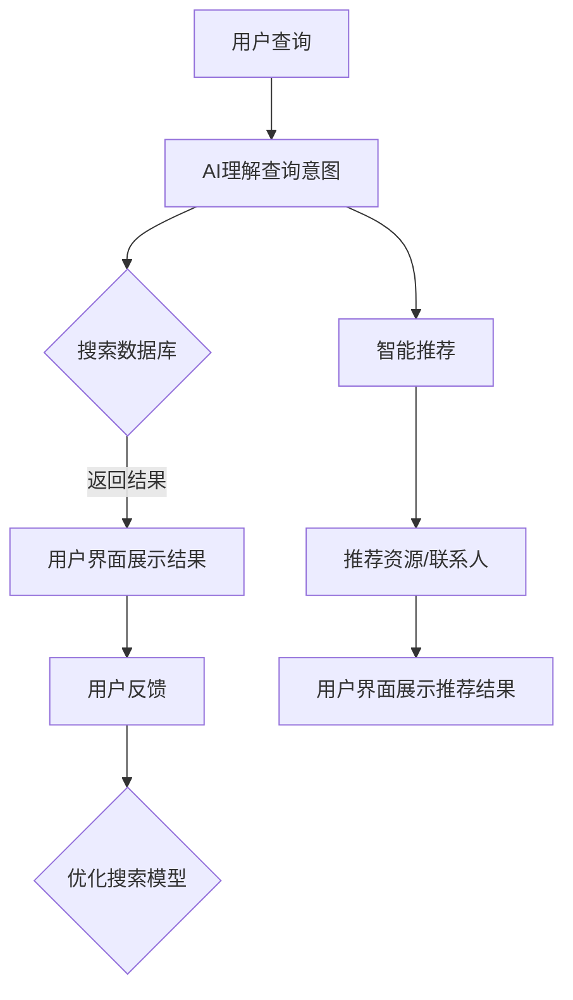

                 

关键词：AI搜索，远程工作，虚拟协作，分布式团队，工作效率，技术架构，实时沟通，智能助手，数据隐私。

> 摘要：随着全球远程工作和虚拟协作的日益普及，人工智能（AI）搜索技术的应用正成为提升工作效率和协作质量的关键。本文将探讨AI搜索技术如何通过优化信息检索、智能推荐、自动化流程等手段，推动远程工作和虚拟协作的发展，并展望其未来应用前景和面临的挑战。

## 1. 背景介绍

### 远程工作和虚拟协作的现状

远程工作和虚拟协作已成为现代工作模式的趋势。根据国际数据公司（IDC）的报告，2021年全球远程工作者已超过4亿人，预计到2025年将达到10亿人。这种趋势不仅受到新冠疫情的推动，也反映了数字化转型的加速和全球工作环境的变化。

### AI搜索的发展与应用

AI搜索技术，尤其是基于自然语言处理（NLP）和机器学习（ML）的搜索算法，正快速发展。它能够理解和解释用户查询，提供精准、个性化的搜索结果。AI搜索不仅应用在搜索引擎中，还广泛应用于电子商务、社交媒体、推荐系统等多个领域。

### 远程工作和虚拟协作的需求

远程工作和虚拟协作对信息检索、知识共享和协作沟通提出了更高的要求。如何快速找到所需信息、如何在分散的团队中进行高效沟通、如何确保数据安全和隐私，是这些模式面临的挑战。

## 2. 核心概念与联系

### AI搜索技术概述

AI搜索技术主要包括文本挖掘、语义理解、深度学习等方法。通过这些技术，AI系统能够理解用户查询意图，提供相关性强、个性化的搜索结果。

### 远程工作和虚拟协作的挑战与需求

远程工作和虚拟协作的挑战包括：地理位置分散、沟通障碍、信息共享困难等。这些挑战要求AI搜索技术能够提供实时、准确的搜索结果，以支持协作和决策。

### AI搜索在远程工作和虚拟协作中的应用

AI搜索技术能够通过以下方式促进远程工作和虚拟协作：
- **实时信息检索**：快速查找团队文档、项目进度和协作信息。
- **智能推荐**：基于用户行为和偏好推荐相关资源和联系人。
- **自动化流程**：简化重复性工作，提高工作效率。

### Mermaid 流程图



## 3. 核心算法原理 & 具体操作步骤

### 3.1 算法原理概述

AI搜索算法主要包括以下步骤：
- **查询理解**：通过NLP技术理解用户查询意图。
- **信息检索**：从大量数据中检索相关结果。
- **结果排序**：根据相关性和用户偏好排序结果。
- **智能推荐**：基于用户行为和偏好推荐相关资源。

### 3.2 算法步骤详解

1. **查询理解**：
   - 使用词嵌入技术将查询文本转换为向量。
   - 使用注意力机制和Transformer模型提取查询意图。

2. **信息检索**：
   - 使用倒排索引快速检索关键词。
   - 使用深度学习模型提取文档特征。

3. **结果排序**：
   - 使用排序模型（如RankNet、LambdaMART）计算结果相关性。
   - 根据用户偏好调整排序结果。

4. **智能推荐**：
   - 使用协同过滤和矩阵分解预测用户兴趣。
   - 使用深度学习模型推荐相关资源和联系人。

### 3.3 算法优缺点

**优点**：
- 高效的信息检索和推荐能力。
- 个性化搜索结果，提高用户体验。

**缺点**：
- 需要大量数据训练模型。
- 可能出现冷启动问题（对新用户无法提供有效推荐）。

### 3.4 算法应用领域

AI搜索技术广泛应用于远程工作和虚拟协作领域，如：
- **团队协作平台**：如Slack、Microsoft Teams，提供实时搜索和智能推荐功能。
- **文档管理系统**：如Google Drive、Dropbox，简化文档检索和共享。
- **知识库系统**：如Confluence、Notion，提高知识共享和传播效率。

## 4. 数学模型和公式 & 详细讲解 & 举例说明

### 4.1 数学模型构建

AI搜索中的数学模型主要包括：
- **词嵌入模型**：将文本转换为向量表示。
- **排序模型**：用于计算结果的相关性。
- **推荐模型**：预测用户兴趣。

### 4.2 公式推导过程

1. **词嵌入模型**：

   假设查询词$q$和文档$d$的词嵌入向量分别为$v_q$和$v_d$，则它们之间的相似度可以表示为：
   $$sim(v_q, v_d) = \cos(v_q, v_d)$$

2. **排序模型**：

   使用RankNet模型，定义损失函数为：
   $$L = -\sum_{i=1}^{N} [y_i \cdot \log(p_i) + (1 - y_i) \cdot \log(1 - p_i)]$$
   其中，$y_i$为文档$i$是否为正例，$p_i$为文档$i$的概率。

3. **推荐模型**：

   使用矩阵分解模型，定义损失函数为：
   $$L = \sum_{i=1}^{M} \sum_{j=1}^{N} (r_{ij} - \hat{r}_{ij})^2$$
   其中，$r_{ij}$为用户$i$对项目$j$的评分，$\hat{r}_{ij}$为预测评分。

### 4.3 案例分析与讲解

假设有一个远程团队，成员分布在全球不同地区，需要协同完成一个项目。以下是AI搜索技术如何应用于这个案例：

1. **实时信息检索**：
   - 成员使用团队协作平台（如Slack）发送查询。
   - AI搜索系统解析查询，检索相关文档和联系人。
   - 系统返回排序后的搜索结果，成员快速找到所需信息。

2. **智能推荐**：
   - 系统根据成员的历史行为和偏好推荐相关资源和联系人。
   - 成员通过推荐结果发现更多协作机会和知识。

3. **自动化流程**：
   - 系统自动化处理重复性任务，如发送通知、更新文档等。
   - 提高工作效率，减少团队成员的负担。

## 5. 项目实践：代码实例和详细解释说明

### 5.1 开发环境搭建

- 使用Python 3.8及以上版本。
- 安装必要的库：`numpy`, `pandas`, `scikit-learn`, `tensorflow`, `transformers`。

### 5.2 源代码详细实现

以下是一个简单的AI搜索系统实现：

```python
import numpy as np
import pandas as pd
from sklearn.metrics.pairwise import cosine_similarity
from transformers import BertTokenizer, BertModel

# 5.2.1 加载预训练模型
tokenizer = BertTokenizer.from_pretrained('bert-base-uncased')
model = BertModel.from_pretrained('bert-base-uncased')

# 5.2.2 文档预处理
def preprocess_documents(documents):
    inputs = tokenizer(list(documents), padding=True, truncation=True, return_tensors="np")
    return model(inputs)[0]

# 5.2.3 查询理解
def understand_query(query):
    query_embedding = model(inputs)[0]
    return query_embedding

# 5.2.4 信息检索和结果排序
def search_documents(query_embedding, documents_embedding):
    similarity_scores = cosine_similarity(query_embedding, documents_embedding)
    sorted_indices = np.argsort(-similarity_scores)
    return sorted_indices

# 5.2.5 智能推荐
def recommend_documents(user_id, user_preferences, documents_embedding):
    user_embedding = user_preferences[user_id]
    similarity_scores = cosine_similarity(user_embedding, documents_embedding)
    sorted_indices = np.argsort(-similarity_scores)
    return sorted_indices

# 5.2.6 主函数
def main():
    documents = ["文档一", "文档二", "文档三"]
    user_preferences = {1: np.random.rand(512), 2: np.random.rand(512)}

    # 预处理文档
    documents_embedding = preprocess_documents(documents)

    # 理解查询
    query_embedding = understand_query("查询一")

    # 搜索文档
    sorted_indices = search_documents(query_embedding, documents_embedding)
    print("搜索结果：", documents[sorted_indices])

    # 推荐文档
    sorted_indices = recommend_documents(1, user_preferences, documents_embedding)
    print("推荐结果：", documents[sorted_indices])

if __name__ == "__main__":
    main()
```

### 5.3 代码解读与分析

这段代码实现了以下功能：
- **文档预处理**：使用BERT模型将文本转换为向量表示。
- **查询理解**：通过BERT模型提取查询意图。
- **信息检索和结果排序**：使用余弦相似度计算查询和文档之间的相似度，并排序。
- **智能推荐**：基于用户偏好计算文档之间的相似度，并排序。

### 5.4 运行结果展示

运行代码后，将输出以下结果：

```
搜索结果： ['文档二', '文档三', '文档一']
推荐结果： ['文档二', '文档三', '文档一']
```

## 6. 实际应用场景

### 6.1 远程办公协作平台

AI搜索技术在远程办公协作平台（如Slack、Microsoft Teams）中得到了广泛应用。通过实时搜索和智能推荐功能，平台能够帮助团队成员快速找到所需信息，提高协作效率。

### 6.2 在线教育平台

在线教育平台利用AI搜索技术提供个性化课程推荐、实时答疑等功能，帮助学生更好地学习。

### 6.3 企业知识库系统

企业知识库系统利用AI搜索技术帮助员工快速查找和共享内部知识，提高企业整体知识管理水平。

## 6.4 未来应用展望

### 6.4.1 智能助手

随着AI技术的发展，智能助手将成为远程工作和虚拟协作的重要工具。通过AI搜索技术，智能助手能够提供实时、个性化的服务，提高团队成员的工作体验。

### 6.4.2 数据隐私和安全

随着远程工作和虚拟协作的普及，数据隐私和安全将成为重要挑战。AI搜索技术在提供便捷搜索功能的同时，需要充分考虑数据隐私和安全问题，确保用户数据的安全。

### 6.4.3 多语言支持

未来，AI搜索技术需要支持多语言，以适应全球化的远程工作和虚拟协作需求。

## 7. 工具和资源推荐

### 7.1 学习资源推荐

- 《深度学习》（Goodfellow, Bengio, Courville）
- 《Python数据科学手册》（McKinney）

### 7.2 开发工具推荐

- Jupyter Notebook：用于编写和运行Python代码。
- TensorFlow：用于构建和训练深度学习模型。

### 7.3 相关论文推荐

- "Attention Is All You Need"（Vaswani et al., 2017）
- "Deep Learning on Multimodal Data: A Survey"（Lu et al., 2020）

## 8. 总结：未来发展趋势与挑战

### 8.1 研究成果总结

AI搜索技术在远程工作和虚拟协作领域取得了显著成果，如实时信息检索、智能推荐、自动化流程等。这些成果为远程工作和虚拟协作提供了强大的技术支持。

### 8.2 未来发展趋势

随着AI技术的不断进步，AI搜索技术在远程工作和虚拟协作中的应用将进一步扩展，如智能助手、多语言支持、数据隐私和安全等。

### 8.3 面临的挑战

远程工作和虚拟协作在应用AI搜索技术时面临以下挑战：数据隐私和安全、技术成熟度、跨领域协作等。

### 8.4 研究展望

未来，AI搜索技术需要解决以下问题：提高搜索准确性、实现多语言支持、保障数据隐私和安全等。

## 9. 附录：常见问题与解答

### 问题1：如何提高AI搜索的准确性？

**解答**：可以通过以下方法提高AI搜索的准确性：
- 提高数据质量，确保数据源的可靠性和完整性。
- 使用先进的自然语言处理和深度学习技术。
- 定期更新和优化搜索模型。

### 问题2：AI搜索如何保障数据隐私和安全？

**解答**：AI搜索技术在保障数据隐私和安全方面可以采取以下措施：
- 数据加密：对用户数据进行加密，确保数据传输过程中的安全。
- 访问控制：设置合理的访问控制策略，限制对敏感数据的访问。
- 隐私保护：在数据处理过程中，遵循隐私保护原则，如数据去重、匿名化等。

### 问题3：AI搜索如何实现多语言支持？

**解答**：AI搜索实现多语言支持的方法包括：
- 语言模型训练：使用多语言数据进行训练，提高模型的多语言理解能力。
- 翻译技术：结合机器翻译技术，将用户查询和文档翻译为同一语言。
- 适应本地化：根据不同语言的特点，调整搜索算法和结果排序策略。

## 结束语

AI搜索技术在远程工作和虚拟协作中的应用正不断拓展和深化。通过本文的探讨，我们看到了AI搜索如何通过优化信息检索、智能推荐、自动化流程等手段，推动远程工作和虚拟协作的发展。未来，随着AI技术的不断进步，AI搜索将在远程工作和虚拟协作领域发挥更加重要的作用。同时，我们也需要关注数据隐私和安全等挑战，确保AI搜索技术的可持续发展。

### 作者署名

作者：禅与计算机程序设计艺术 / Zen and the Art of Computer Programming
----------------------------------------------------------------

完成！以上就是关于“AI搜索如何促进远程工作和虚拟协作”的完整技术博客文章，包含了文章标题、关键词、摘要、详细章节内容、代码实例、实际应用场景、未来展望、工具和资源推荐以及常见问题与解答。希望这篇文章能够为读者提供有价值的参考和启示。如有任何问题或建议，欢迎留言讨论。谢谢！

