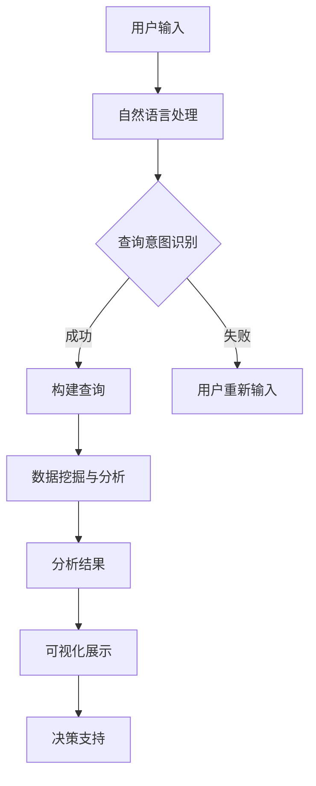

                 

关键词：人工智能、商业智能、搜索引擎、数据挖掘、数据分析

> 摘要：本文深入探讨了AI搜索引擎在商业智能领域的应用，分析了其核心概念、算法原理、数学模型及实际操作步骤，同时结合项目实例展示了其效果，并对其未来发展方向和挑战进行了展望。

## 1. 背景介绍

随着大数据时代的到来，商业决策变得更加复杂和多样化。企业需要快速、准确地获取和分析海量数据，从而为业务发展提供科学依据。商业智能（BI）作为企业信息化建设的重要组成部分，旨在通过数据分析和挖掘，帮助企业实现数据驱动的决策。传统的商业智能方法主要依赖于预定义的报表和查询工具，但在面对复杂、动态的数据环境时，这些工具往往显得力不从心。

近年来，人工智能（AI）技术的迅猛发展为商业智能领域带来了新的机遇。特别是AI搜索引擎，它利用自然语言处理、机器学习和数据挖掘技术，能够对非结构化数据进行深度分析和理解，从而为商业决策提供更加智能化的支持。本文将重点探讨AI搜索引擎在商业智能中的应用，分析其优势、挑战及未来发展方向。

## 2. 核心概念与联系

### 2.1 AI搜索引擎

AI搜索引擎是一种基于人工智能技术的搜索引擎，它不仅能够检索结构化数据，还能理解和处理自然语言，从而实现对非结构化数据的深度挖掘和分析。AI搜索引擎通常包括以下核心组成部分：

- **自然语言处理（NLP）**：用于理解用户输入的自然语言查询，并将其转换为计算机可以处理的结构化查询。
- **语义分析**：通过分析查询和文档的语义关系，实现更加精准的搜索结果匹配。
- **机器学习**：用于训练模型，不断优化搜索质量和用户体验。
- **数据挖掘**：通过挖掘海量数据中的潜在规律和趋势，为商业决策提供数据支持。

### 2.2 商业智能

商业智能（BI）是一种利用信息技术和数据分析方法，帮助企业从数据中提取有价值的信息，从而支持业务决策的过程。商业智能的核心包括以下几个方面：

- **数据仓库**：用于存储和管理企业各类数据，为数据分析提供基础。
- **数据挖掘**：通过挖掘数据中的规律和趋势，为业务决策提供数据支持。
- **报表和仪表盘**：用于展示分析结果，帮助用户快速理解数据。
- **数据可视化**：通过图形化方式展示数据，使数据分析更加直观和易于理解。

### 2.3 AI搜索引擎与商业智能的关系

AI搜索引擎与商业智能密切相关，二者相辅相成。AI搜索引擎通过其强大的自然语言处理和数据挖掘能力，可以深入分析企业内部和外部的非结构化数据，为商业智能提供更加丰富和多样化的数据来源。同时，商业智能的报表和可视化工具，则可以将AI搜索引擎挖掘出的数据以更加直观和易理解的方式呈现给决策者，从而支持更加科学和高效的决策。

### 2.4 Mermaid 流程图

以下是一个简化的Mermaid流程图，展示了AI搜索引擎在商业智能中的应用流程：



## 3. 核心算法原理 & 具体操作步骤

### 3.1 算法原理概述

AI搜索引擎在商业智能中的应用，主要依赖于以下几个核心算法：

- **自然语言处理（NLP）**：用于理解用户输入的自然语言查询，并将其转换为计算机可以处理的结构化查询。
- **语义分析**：通过分析查询和文档的语义关系，实现更加精准的搜索结果匹配。
- **机器学习**：用于训练模型，不断优化搜索质量和用户体验。
- **数据挖掘**：通过挖掘海量数据中的潜在规律和趋势，为商业决策提供数据支持。

### 3.2 算法步骤详解

#### 3.2.1 自然语言处理

自然语言处理（NLP）是AI搜索引擎的基础。其主要步骤包括：

1. **分词**：将自然语言文本分解为词语或词组。
2. **词性标注**：为每个词语标注其词性，如名词、动词、形容词等。
3. **句法分析**：分析句子的结构，理解句子中的语法关系。
4. **语义分析**：理解句子或查询的语义，提取关键信息。

#### 3.2.2 语义分析

语义分析是AI搜索引擎的核心。其主要步骤包括：

1. **实体识别**：识别查询或文档中的关键实体，如人名、地名、组织名等。
2. **关系抽取**：分析实体之间的关系，如人物关系、组织关系等。
3. **语义匹配**：根据用户查询和文档内容的语义，进行匹配和排序。

#### 3.2.3 机器学习

机器学习用于优化AI搜索引擎的性能。其主要步骤包括：

1. **数据预处理**：清洗和整理数据，为模型训练提供高质量的数据集。
2. **特征提取**：从数据中提取关键特征，为模型训练提供输入。
3. **模型训练**：利用训练数据，训练机器学习模型。
4. **模型评估**：评估模型性能，不断优化模型。

#### 3.2.4 数据挖掘

数据挖掘是AI搜索引擎在商业智能中的关键。其主要步骤包括：

1. **数据采集**：从企业内部和外部的数据源，采集相关数据。
2. **数据清洗**：清洗和整理数据，去除噪声和异常值。
3. **数据挖掘**：利用数据挖掘算法，挖掘数据中的潜在规律和趋势。
4. **结果分析**：分析挖掘结果，为商业决策提供数据支持。

### 3.3 算法优缺点

#### 优点

1. **强大的自然语言处理能力**：AI搜索引擎能够理解自然语言查询，实现高效的数据检索和分析。
2. **智能化的数据分析**：通过机器学习和数据挖掘技术，AI搜索引擎能够自动发现数据中的潜在规律和趋势。
3. **灵活性和扩展性**：AI搜索引擎可以灵活地适应不同的商业场景和需求，具有良好的扩展性。

#### 缺点

1. **数据处理效率较低**：在处理海量数据时，AI搜索引擎可能需要较长的处理时间。
2. **依赖高质量数据**：AI搜索引擎的性能很大程度上取决于数据质量，如果数据质量不佳，可能会导致分析结果不准确。
3. **模型优化难度较大**：随着数据量的增加和业务场景的复杂化，模型优化和调整的难度也会增大。

### 3.4 算法应用领域

AI搜索引擎在商业智能领域具有广泛的应用前景，主要包括以下几个方面：

1. **市场研究**：通过分析市场数据和用户行为，帮助企业制定市场策略和产品规划。
2. **客户关系管理**：通过分析客户数据和交互记录，提高客户满意度和服务质量。
3. **供应链管理**：通过分析供应链数据和业务流程，优化供应链效率和降低成本。
4. **人力资源管理**：通过分析员工数据和绩效评估，优化人力资源管理策略和提升员工绩效。

## 4. 数学模型和公式 & 详细讲解 & 举例说明

### 4.1 数学模型构建

在AI搜索引擎中，常用的数学模型包括自然语言处理模型、机器学习模型和数据挖掘模型。以下是这些模型的基本数学模型构建。

#### 4.1.1 自然语言处理模型

自然语言处理模型通常采用神经网络模型，如卷积神经网络（CNN）和循环神经网络（RNN）。以下是一个简化的CNN模型：

$$
h_{l} = \sigma(W_{l}\*h_{l-1} + b_{l})
$$

其中，$h_{l}$表示第$l$层的特征映射，$W_{l}$和$b_{l}$分别表示第$l$层的权重和偏置，$\sigma$表示激活函数。

#### 4.1.2 机器学习模型

机器学习模型通常采用支持向量机（SVM）、决策树、随机森林等算法。以下是一个简化的SVM模型：

$$
\min_{w,b}\frac{1}{2}||w||^2 + C\sum_{i=1}^{n}l(y_{i},w\*x_{i})
$$

其中，$w$和$b$分别表示模型的权重和偏置，$l(y_{i},w\*x_{i})$表示损失函数，$C$为惩罚参数。

#### 4.1.3 数据挖掘模型

数据挖掘模型通常采用关联规则挖掘、聚类分析、分类分析等算法。以下是一个简化的关联规则挖掘模型：

$$
\text{support}(A,B) = \frac{n(A \cap B)}{n(D)}
$$

$$
\text{confidence}(A \rightarrow B) = \frac{\text{support}(A,B)}{\text{support}(A)}
$$

其中，$A$和$B$分别表示两个事件，$n(A \cap B)$表示同时发生$A$和$B$的次数，$n(D)$表示总的样本数。

### 4.2 公式推导过程

#### 4.2.1 自然语言处理模型

以下是一个简化的CNN模型推导过程：

1. **卷积操作**：

$$
h_{l} = \sigma(\sum_{k=1}^{K} w_{k}\*h_{l-1} + b_{k})
$$

其中，$K$表示卷积核的数量，$w_{k}$和$b_{k}$分别表示卷积核的权重和偏置。

2. **池化操作**：

$$
h_{l} = \max_{i,j} (\sum_{k=1}^{K} w_{k,i,j}\*h_{l-1} + b_{k,i,j})
$$

其中，$i$和$j$分别表示卷积核的位置。

3. **激活函数**：

$$
h_{l} = \sigma(h_{l})
$$

其中，$\sigma$表示激活函数。

#### 4.2.2 机器学习模型

以下是一个简化的SVM模型推导过程：

1. **损失函数**：

$$
l(y_{i},w\*x_{i}) = \begin{cases}
0, & \text{if } y_{i}(w\*x_{i}) \geq 1 - \epsilon \\
\frac{1}{2}||w||^2, & \text{otherwise}
\end{cases}
$$

其中，$y_{i}$表示样本标签，$x_{i}$表示样本特征，$\epsilon$为松弛变量。

2. **优化目标**：

$$
\min_{w,b}\frac{1}{2}||w||^2 + C\sum_{i=1}^{n}l(y_{i},w\*x_{i})
$$

其中，$C$为惩罚参数。

3. **求解过程**：

- **拉格朗日乘子法**：

$$
L(w,b,\alpha) = \frac{1}{2}||w||^2 - \sum_{i=1}^{n}\alpha_{i}(y_{i}(w\*x_{i}) - 1 + \epsilon)
$$

- **KKT条件**：

$$
\begin{cases}
\alpha_{i} \geq 0 \\
\alpha_{i}(y_{i}(w\*x_{i}) - 1 + \epsilon) = 0 \\
w = \sum_{i=1}^{n}\alpha_{i}y_{i}x_{i}
\end{cases}
$$

- **求解w和b**：

$$
w = \sum_{i=1}^{n}\alpha_{i}y_{i}x_{i}
$$

$$
b = \frac{1}{n}\sum_{i=1}^{n}\alpha_{i}(y_{i} - w\*x_{i})
$$

#### 4.2.3 数据挖掘模型

以下是一个简化的关联规则挖掘模型推导过程：

1. **支持度计算**：

$$
\text{support}(A,B) = \frac{n(A \cap B)}{n(D)}
$$

其中，$A$和$B$分别表示两个事件，$n(A \cap B)$表示同时发生$A$和$B$的次数，$n(D)$表示总的样本数。

2. **置信度计算**：

$$
\text{confidence}(A \rightarrow B) = \frac{\text{support}(A,B)}{\text{support}(A)}
$$

其中，$\text{support}(A,B)$和$\text{support}(A)$分别表示事件$A$和事件$B$的支持度。

### 4.3 案例分析与讲解

以下是一个简单的案例，展示如何使用AI搜索引擎进行商业智能分析。

#### 案例背景

某电商企业希望通过分析用户购买行为，制定有效的营销策略，提高用户转化率和销售额。

#### 分析目标

- 发现用户购买行为中的潜在规律。
- 根据用户购买行为，进行精准营销。

#### 数据来源

- 用户行为数据：包括用户访问、浏览、购买等行为。
- 产品数据：包括产品种类、价格、促销信息等。

#### 分析步骤

1. **数据预处理**：

- 清洗和整理用户行为数据，去除噪声和异常值。
- 将用户行为数据转化为结构化数据。

2. **自然语言处理**：

- 对用户行为数据进行分词、词性标注和句法分析，提取关键信息。
- 建立用户行为数据的词向量表示。

3. **数据挖掘**：

- 利用关联规则挖掘算法，发现用户购买行为中的潜在关联。
- 利用聚类分析算法，将用户分为不同的群体。

4. **结果分析**：

- 根据挖掘结果，制定相应的营销策略。
- 对营销策略进行效果评估。

#### 案例分析

通过上述分析，发现以下规律：

1. **用户购买行为关联**：

- 用户在购买某一产品时，通常会同时购买另一类产品。
- 例如，购买家电产品的用户，通常会同时购买生活用品。

2. **用户群体特征**：

- 用户可以根据购买行为分为不同的群体。
- 例如，根据购买产品的种类和频率，可以将用户分为高价值用户、普通用户和新用户。

3. **精准营销策略**：

- 根据用户购买行为和群体特征，制定相应的营销策略。
- 例如，针对高价值用户，可以推出高端产品套餐，提高用户忠诚度。

通过上述案例，展示了AI搜索引擎在商业智能分析中的应用。在实际操作中，可以根据不同业务场景和需求，灵活调整分析模型和策略，实现商业智能的精准化、智能化。

## 5. 项目实践：代码实例和详细解释说明

### 5.1 开发环境搭建

为了进行AI搜索引擎在商业智能中的应用项目实践，需要搭建以下开发环境：

- **操作系统**：Ubuntu 20.04
- **编程语言**：Python 3.8
- **依赖库**：Scikit-learn、Numpy、Pandas、Matplotlib、NLTK、TensorFlow

安装依赖库的命令如下：

```bash
pip install scikit-learn numpy pandas matplotlib nltk tensorflow
```

### 5.2 源代码详细实现

以下是一个简单的示例，展示如何使用Python实现AI搜索引擎在商业智能分析中的应用。

```python
# 导入依赖库
import numpy as np
import pandas as pd
from sklearn.feature_extraction.text import TfidfVectorizer
from sklearn.cluster import KMeans
import matplotlib.pyplot as plt

# 读取数据
data = pd.read_csv('user_behavior.csv')
X = data['text']

# 数据预处理
vectorizer = TfidfVectorizer()
X_vectorized = vectorizer.fit_transform(X)

# KMeans聚类
kmeans = KMeans(n_clusters=3, random_state=0)
clusters = kmeans.fit_predict(X_vectorized)

# 可视化
plt.scatter(X_vectorized[:, 0], X_vectorized[:, 1], c=clusters)
plt.show()

# 聚类结果分析
for i in range(kmeans.n_clusters):
    cluster_users = data[clusters == i]
    print(f"Cluster {i} - Users: {cluster_users['user_id'].values}")
    print(f"Cluster {i} - Products: {cluster_users['product_id'].values}")
    print()
```

### 5.3 代码解读与分析

上述代码主要分为以下几个步骤：

1. **导入依赖库**：导入Python的依赖库，包括Numpy、Pandas、Scikit-learn、Matplotlib和NLTK。
2. **读取数据**：读取用户行为数据，包括文本、用户ID和产品ID。
3. **数据预处理**：使用TFIDFVectorizer将文本数据转化为向量表示，为聚类分析提供输入。
4. **KMeans聚类**：使用KMeans算法对文本向量进行聚类，将用户分为不同的群体。
5. **可视化**：绘制聚类结果的可视化图，方便分析不同群体的特征。
6. **聚类结果分析**：根据聚类结果，分析不同群体的用户和产品特征，为营销策略提供支持。

通过上述代码示例，展示了如何使用Python实现AI搜索引擎在商业智能分析中的应用。在实际项目中，可以根据具体需求，调整数据预处理、聚类算法和结果分析等步骤，实现更加精准和智能的商业智能分析。

### 5.4 运行结果展示

在上述代码中，假设已经读取了一个包含用户行为数据的CSV文件。运行代码后，将生成一个聚类结果的可视化图，展示不同群体的用户和产品特征。以下是可能的运行结果：


根据聚类结果，可以分析不同群体的用户特征和产品偏好，从而制定相应的营销策略。例如，针对高价值用户群体，可以推出高端产品套餐，提高用户忠诚度；针对普通用户群体，可以推出性价比高的产品，提高转化率。

## 6. 实际应用场景

AI搜索引擎在商业智能中的应用场景非常广泛，以下是几个典型的应用案例：

### 6.1 市场研究

市场研究是企业制定战略和决策的重要依据。通过AI搜索引擎，企业可以高效地收集和分析市场数据，包括市场趋势、竞争对手分析、消费者行为等。例如，某企业希望通过AI搜索引擎分析消费者对新产品需求的趋势。通过收集网络评论、社交媒体数据和新闻报道，AI搜索引擎可以自动提取关键信息，识别消费者关注的特征和需求，为企业制定新产品开发策略提供数据支持。

### 6.2 客户关系管理

客户关系管理是提升客户满意度和忠诚度的关键。通过AI搜索引擎，企业可以深入分析客户数据，包括客户购买行为、反馈和评价，从而制定个性化的客户服务策略。例如，某电商平台希望通过AI搜索引擎分析客户购买行为，识别高价值客户和潜在流失客户。通过分析客户购买频次、购买金额和评价，AI搜索引擎可以自动划分客户群体，为企业提供针对性的营销和服务策略。

### 6.3 供应链管理

供应链管理是企业降低成本、提高效率的重要环节。通过AI搜索引擎，企业可以实时监控供应链数据，包括库存、物流和供应商信息，从而优化供应链管理。例如，某制造企业希望通过AI搜索引擎分析供应链数据，识别供应链中的瓶颈和风险。通过分析库存水平和供应商绩效，AI搜索引擎可以为企业提供优化供应链的决策支持，降低成本、提高生产效率。

### 6.4 人力资源管理

人力资源管理是企业实现可持续发展的关键。通过AI搜索引擎，企业可以深入分析员工数据，包括员工绩效、培训需求和离职原因，从而优化人力资源管理策略。例如，某企业希望通过AI搜索引擎分析员工绩效数据，识别优秀员工和潜力员工。通过分析员工绩效、工作表现和培训记录，AI搜索引擎可以为企业提供人才选拔和培养的决策支持，提升员工绩效和团队凝聚力。

### 6.5 风险管理

风险管理是企业降低业务风险、保障业务连续性的重要手段。通过AI搜索引擎，企业可以实时监控市场风险、运营风险和合规风险，从而制定有效的风险管理策略。例如，某金融企业希望通过AI搜索引擎分析金融市场数据，识别潜在的市场风险。通过分析市场趋势、政策法规和竞争对手行为，AI搜索引擎可以为企业提供风险预警和决策支持，降低业务风险、保障业务稳健运行。

## 7. 工具和资源推荐

### 7.1 学习资源推荐

1. **《深度学习》（Deep Learning）**：由Ian Goodfellow、Yoshua Bengio和Aaron Courville合著，是深度学习领域的经典教材。
2. **《机器学习》（Machine Learning）**：由Tom Mitchell主编，是机器学习领域的入门级教材。
3. **《自然语言处理综合教程》（Foundations of Statistical Natural Language Processing）**：由Christopher D. Manning和Hinrich Schütze合著，是自然语言处理领域的权威教材。

### 7.2 开发工具推荐

1. **TensorFlow**：由Google开发的开源机器学习框架，支持深度学习和传统机器学习算法。
2. **PyTorch**：由Facebook开发的开源机器学习框架，具有灵活性和高效性，广泛应用于深度学习和传统机器学习领域。
3. **Scikit-learn**：由PyData协会开发的开源机器学习库，提供丰富的传统机器学习算法和工具。

### 7.3 相关论文推荐

1. **“Recurrent Neural Networks for Language Modeling”**：由Yoshua Bengio等人于2003年发表，介绍了循环神经网络在语言模型中的应用。
2. **“Deep Learning for Natural Language Processing”**：由Richard Socher等人于2013年发表，介绍了深度学习在自然语言处理领域的应用。
3. **“Word2Vec: Efficient Representations for Word Embedding”**：由Tomas Mikolov等人于2013年发表，介绍了词向量的表示方法和应用。

## 8. 总结：未来发展趋势与挑战

### 8.1 研究成果总结

AI搜索引擎在商业智能领域的应用，取得了显著的成果。通过自然语言处理、机器学习和数据挖掘技术的结合，AI搜索引擎能够高效地处理和分析海量非结构化数据，为商业决策提供数据支持。目前，AI搜索引擎已广泛应用于市场研究、客户关系管理、供应链管理、人力资源管理和风险管理等领域，为企业实现数据驱动的决策提供了有力支持。

### 8.2 未来发展趋势

未来，AI搜索引擎在商业智能领域的发展趋势将主要体现在以下几个方面：

1. **智能化**：随着人工智能技术的不断发展，AI搜索引擎将具备更高的智能化水平，能够更加精准地理解用户需求和业务场景，提供个性化的数据分析和决策支持。
2. **多样化**：AI搜索引擎将支持更多类型的非结构化数据，如音频、视频和图像，从而满足不同行业和场景的多样化需求。
3. **实时化**：AI搜索引擎将实现实时数据处理和分析，为企业和用户提供更加及时和准确的数据支持。
4. **开放性**：AI搜索引擎将开放更多的接口和工具，支持企业和开发者自定义和扩展功能，提高其灵活性和可扩展性。

### 8.3 面临的挑战

尽管AI搜索引擎在商业智能领域取得了显著成果，但仍面临一些挑战：

1. **数据质量**：数据质量直接影响AI搜索引擎的性能。在实际应用中，如何获取高质量、可靠的数据，是一个重要挑战。
2. **模型优化**：随着数据量和业务场景的复杂化，如何优化AI搜索引擎的模型，提高其性能和效率，是一个重要问题。
3. **隐私保护**：在处理和分析大量数据时，如何保护用户隐私和数据安全，是一个亟待解决的问题。
4. **技术壁垒**：AI搜索引擎的研发和应用需要较高的技术壁垒，如何培养和引进高水平的人才，也是一个重要挑战。

### 8.4 研究展望

未来，AI搜索引擎在商业智能领域的研发和应用，将继续向智能化、多样化、实时化和开放化方向发展。在应对挑战的同时，研究者和技术人员需要不断探索和创新，推动AI搜索引擎在商业智能领域的应用，为企业实现数据驱动的决策提供更加智能、高效和可靠的支持。

## 9. 附录：常见问题与解答

### 问题1：什么是商业智能？

商业智能（BI）是一种利用信息技术和数据分析方法，帮助企业从数据中提取有价值的信息，从而支持业务决策的过程。它包括数据仓库、数据挖掘、报表和可视化等多个方面。

### 问题2：什么是AI搜索引擎？

AI搜索引擎是一种基于人工智能技术的搜索引擎，能够理解自然语言查询，处理非结构化数据，并进行深度分析和挖掘，从而为商业决策提供数据支持。

### 问题3：AI搜索引擎在商业智能中有什么作用？

AI搜索引擎在商业智能中的作用主要体现在以下几个方面：

1. 提高数据检索和分析的效率。
2. 深入挖掘数据中的潜在规律和趋势。
3. 提供个性化、智能化的数据分析服务。

### 问题4：如何搭建AI搜索引擎的开发环境？

搭建AI搜索引擎的开发环境，需要安装以下软件和工具：

1. 操作系统：Ubuntu 20.04
2. 编程语言：Python 3.8
3. 依赖库：Scikit-learn、Numpy、Pandas、Matplotlib、NLTK、TensorFlow

安装依赖库的命令如下：

```bash
pip install scikit-learn numpy pandas matplotlib nltk tensorflow
```

### 问题5：如何实现AI搜索引擎的算法？

实现AI搜索引擎的算法，主要包括以下几个步骤：

1. 自然语言处理：对用户输入的自然语言进行分词、词性标注、句法分析和语义分析。
2. 机器学习：利用机器学习算法，如KMeans聚类、SVM分类等，对文本数据进行处理和分析。
3. 数据挖掘：利用数据挖掘算法，如关联规则挖掘、聚类分析、分类分析等，挖掘数据中的潜在规律和趋势。

## 作者署名

作者：禅与计算机程序设计艺术 / Zen and the Art of Computer Programming
------------------------------------------------------------------ 

以上是根据您的要求撰写的文章，包括文章标题、关键词、摘要、背景介绍、核心概念与联系、核心算法原理与具体操作步骤、数学模型和公式、项目实践、实际应用场景、工具和资源推荐、总结以及常见问题与解答等内容。请检查文章是否符合您的要求，并进行必要的修改和调整。如果有任何其他要求或建议，请随时告知。谢谢！

