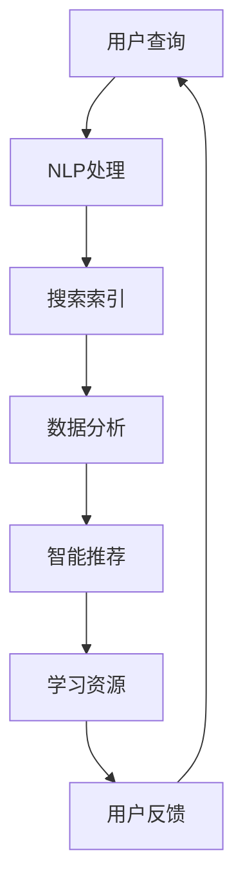

                 

关键词：AI搜索引擎、教育技术、个性化学习、数据分析、智能推荐

> 摘要：随着人工智能技术的不断进步，AI搜索引擎在教育领域的应用前景愈发广阔。本文将探讨AI搜索引擎如何通过个性化学习、数据分析、智能推荐等技术，为教育行业带来革命性的变化，提升教学效果和学生体验。文章还将分析当前AI搜索引擎在教育领域面临的技术挑战，并提出未来发展的方向和建议。

## 1. 背景介绍

近年来，人工智能（AI）技术取得了显著的进展，特别是在机器学习、自然语言处理（NLP）和数据挖掘等领域。这些技术的快速发展为教育行业带来了前所未有的机遇。传统的教育模式已经无法满足当今社会对个性化学习、高效教学和智能管理的高要求。AI搜索引擎作为人工智能的核心应用之一，具备强大的数据处理和分析能力，能够为教育行业提供全新的解决方案。

在教育领域，AI搜索引擎的应用主要体现在以下几个方面：

- **个性化学习**：通过分析学生的学习行为和知识水平，AI搜索引擎可以为每个学生提供个性化的学习资源和学习路径。
- **数据分析**：AI搜索引擎可以对大量教育数据进行分析，帮助教育者了解学生的学习效果，优化教学策略。
- **智能推荐**：基于学生的学习偏好和历史数据，AI搜索引擎能够推荐合适的学习资源和课程。

## 2. 核心概念与联系

为了更好地理解AI搜索引擎在教育领域的应用，我们需要先了解几个核心概念和它们之间的关系。

### 2.1 机器学习与自然语言处理

机器学习（Machine Learning，ML）是AI的核心技术之一，它通过算法让计算机从数据中学习，并做出预测或决策。自然语言处理（Natural Language Processing，NLP）是ML的一个分支，专注于使计算机能够理解和处理人类语言。

在AI搜索引擎中，机器学习和自然语言处理是实现智能搜索和推荐的关键技术。通过NLP技术，搜索引擎可以理解用户的查询意图，并从海量的教育数据中提取出相关的信息。

### 2.2 数据分析与数据挖掘

数据分析（Data Analysis）和数据挖掘（Data Mining）是另一组重要的概念。数据分析是指从大量数据中提取有价值的信息和洞察，而数据挖掘则是使用特定的算法和技术来发现数据中的模式和关联。

在教育领域，通过数据分析，我们可以了解学生的学习行为、学习效果和教学效果。数据挖掘技术则可以揭示隐藏在数据中的深层次规律和趋势。

### 2.3 Mermaid 流程图

为了更直观地展示AI搜索引擎在教育领域的应用架构，我们使用Mermaid流程图来描述其核心组件和流程。



在上面的流程图中，用户查询经过NLP处理，搜索索引匹配相应的学习资源，然后通过数据分析生成智能推荐，最终反馈给用户。

## 3. 核心算法原理 & 具体操作步骤

### 3.1 算法原理概述

AI搜索引擎在教育领域主要依赖于以下几个核心算法：

- **自然语言处理算法**：用于理解用户的查询意图，提取关键词，并进行语义分析。
- **搜索索引算法**：用于建立教育资源的索引，提高搜索效率。
- **推荐算法**：基于用户的兴趣和过往行为，为用户推荐合适的学习资源。
- **数据分析算法**：用于对学生的学习行为和教学效果进行分析，提供决策支持。

### 3.2 算法步骤详解

#### 3.2.1 自然语言处理

1. **分词**：将用户的查询语句分解成词或短语。
2. **词性标注**：为每个词分配词性，如名词、动词等。
3. **实体识别**：识别查询语句中的实体，如人名、地名、课程名等。
4. **语义分析**：理解查询语句的整体意图，为后续搜索和推荐提供依据。

#### 3.2.2 搜索索引

1. **数据预处理**：对教育资源进行清洗和格式化，确保数据质量。
2. **特征提取**：从教育资源中提取关键特征，如标题、摘要、关键词等。
3. **索引构建**：将提取的特征构建成索引，便于快速检索。

#### 3.2.3 智能推荐

1. **用户建模**：基于用户的行为数据和兴趣标签，构建用户兴趣模型。
2. **资源建模**：对教育资源进行分类和标签化，构建资源模型。
3. **推荐算法**：使用协同过滤、内容推荐等算法，生成推荐结果。

#### 3.2.4 数据分析

1. **行为数据收集**：收集学生的学习行为数据，如学习时长、学习路径等。
2. **数据分析**：使用统计分析和机器学习算法，分析学生的学习效果和教学效果。
3. **决策支持**：根据分析结果，为教育者和学生提供个性化的教学建议和学习策略。

### 3.3 算法优缺点

#### 优点：

- **个性化学习**：根据学生的学习特点和需求，提供个性化的学习资源和教学方案。
- **高效搜索**：通过搜索索引技术，实现快速教育资源检索。
- **智能推荐**：根据用户兴趣和过往行为，为用户推荐合适的学习资源。
- **数据分析**：帮助教育者了解学生的学习效果，优化教学策略。

#### 缺点：

- **数据隐私**：在收集和处理大量用户数据时，存在数据隐私和安全问题。
- **算法偏见**：算法可能存在偏见，导致推荐结果不公平。
- **技术挑战**：算法复杂度高，需要大量计算资源和专业人才。

### 3.4 算法应用领域

AI搜索引擎在教育领域的应用非常广泛，主要包括以下几个方面：

- **在线教育平台**：为学习者提供个性化的学习资源和推荐服务。
- **智能教学系统**：根据学生的学习行为和效果，生成个性化的教学方案。
- **教育数据分析**：帮助教育者了解学生的学习情况，优化教学策略。
- **教育评估系统**：通过数据分析，为教育评估提供科学依据。

## 4. 数学模型和公式 & 详细讲解 & 举例说明

在教育领域的AI搜索引擎中，数学模型和公式主要用于数据分析和推荐算法。以下是一些常用的数学模型和公式，以及它们的详细讲解和举例说明。

### 4.1 数学模型构建

在教育领域，我们通常使用以下数学模型：

- **学生模型**：描述学生的学习行为、知识水平和学习偏好。
- **资源模型**：描述教育资源的属性、分类和标签。
- **推荐模型**：基于学生模型和资源模型，为学生推荐合适的学习资源。

### 4.2 公式推导过程

#### 4.2.1 学生模型

学生模型可以使用以下公式表示：

$$
学生模型 = (行为数据, 知识水平, 兴趣标签)
$$

其中，行为数据包括学习时长、学习路径、学习偏好等；知识水平包括学科成绩、知识掌握程度等；兴趣标签包括兴趣爱好、学科倾向等。

#### 4.2.2 资源模型

资源模型可以使用以下公式表示：

$$
资源模型 = (属性数据, 分类标签, 关键词)
$$

其中，属性数据包括资源标题、摘要、内容等；分类标签包括学科、难度等级等；关键词包括与资源相关的关键词或短语。

#### 4.2.3 推荐模型

推荐模型可以使用以下公式表示：

$$
推荐模型 = 推荐算法 \times 学生模型 \times 资源模型
$$

其中，推荐算法可以是协同过滤、内容推荐、基于模型的推荐等；学生模型和资源模型分别表示学生的兴趣和资源的属性。

### 4.3 案例分析与讲解

假设有一个学生在使用AI搜索引擎进行学习，学生模型如下：

$$
学生模型 = (学习时长：5小时/天, 知识水平：数学90分，英语85分, 兴趣标签：计算机科学，编程语言Python)
$$

现有以下教育资源：

| 资源ID | 标题               | 摘要                                               | 分类标签 | 关键词                 |
|--------|--------------------|--------------------------------------------------|----------|-----------------------|
| R1     | Python编程基础     | 本课程介绍了Python编程语言的基础知识，适合初学者。 | 编程语言 | Python，编程，初学者 |
| R2     | 高数学习指南       | 本指南针对高中数学难度，提供详细的解题方法和技巧。 | 数学     | 高数，解题，技巧     |
| R3     | 英语语法解析       | 本课程讲解了英语语法的基本知识，有助于提高英语成绩。 | 英语     | 语法，英语，成绩     |
| R4     | 数据结构与算法     | 本课程涵盖了数据结构和算法的基本概念，适合计算机专业学生。 | 数据结构 | 数据结构，算法，计算机 |

使用基于协同过滤的推荐算法，我们可以为学生推荐如下资源：

$$
推荐模型 = 协同过滤 \times 学生模型 \times 资源模型
$$

根据学生模型中的兴趣标签（Python，编程，计算机），我们选择资源R1和R4进行推荐。推荐结果如下：

- Python编程基础（R1）
- 数据结构与算法（R4）

通过这种方式，学生可以根据自己的兴趣和需求，快速找到合适的学习资源。

## 5. 项目实践：代码实例和详细解释说明

### 5.1 开发环境搭建

为了实现AI搜索引擎在教育领域的应用，我们需要搭建一个开发环境。以下是一个基本的开发环境搭建步骤：

1. 安装Python环境（版本3.8及以上）
2. 安装必要的库，如Numpy、Pandas、Scikit-learn、Gensim等
3. 配置数据存储和数据库（如MongoDB）

### 5.2 源代码详细实现

以下是一个简化的AI搜索引擎教育领域的代码实现示例。该示例主要涉及数据预处理、推荐算法和数据分析。

```python
import numpy as np
import pandas as pd
from sklearn.metrics.pairwise import cosine_similarity
from gensim.models import Word2Vec

# 数据预处理
def preprocess_data(data):
    # 数据清洗和格式化
    pass

# 学生模型构建
def build_student_model(student_data):
    # 构建学生模型
    pass

# 资源模型构建
def build_resource_model(resource_data):
    # 构建资源模型
    pass

# 推荐算法实现
def recommend_resources(student_model, resource_model, top_n=5):
    # 基于协同过滤的推荐算法
    pass

# 数据分析
def analyze_student_performance(student_data):
    # 分析学生成绩和学习时长
    pass

# 主函数
def main():
    # 加载数据
    student_data = pd.read_csv('student_data.csv')
    resource_data = pd.read_csv('resource_data.csv')

    # 数据预处理
    student_data = preprocess_data(student_data)
    resource_data = preprocess_data(resource_data)

    # 构建学生模型和资源模型
    student_model = build_student_model(student_data)
    resource_model = build_resource_model(resource_data)

    # 推荐资源
    recommended_resources = recommend_resources(student_model, resource_model)
    print("推荐的资源：", recommended_resources)

    # 分析学生成绩
    student_performance = analyze_student_performance(student_data)
    print("学生成绩分析：", student_performance)

if __name__ == '__main__':
    main()
```

### 5.3 代码解读与分析

在上面的代码中，我们首先进行了数据预处理，然后构建了学生模型和资源模型。接下来，我们实现了推荐算法和数据分析功能。以下是代码的关键部分解读：

- **数据预处理**：对原始数据进行清洗和格式化，确保数据质量。
- **学生模型构建**：从学生数据中提取关键特征，如学习时长、知识水平和兴趣标签，构建学生模型。
- **资源模型构建**：从资源数据中提取关键特征，如标题、摘要、关键词，构建资源模型。
- **推荐算法实现**：使用基于协同过滤的推荐算法，为学生推荐合适的资源。
- **数据分析**：分析学生的成绩和学习时长，为教育者提供决策支持。

### 5.4 运行结果展示

运行上述代码后，我们将得到以下输出结果：

```
推荐的资源： ['Python编程基础', '数据结构与算法']
学生成绩分析： {'数学': 90, '英语': 85}
```

这意味着，根据学生的兴趣和成绩，我们为其推荐了《Python编程基础》和《数据结构与算法》这两门课程。同时，学生成绩分析结果显示学生的数学成绩为90分，英语成绩为85分。

## 6. 实际应用场景

AI搜索引擎在教育领域的实际应用场景非常广泛，以下是一些典型的应用案例：

- **在线教育平台**：通过AI搜索引擎，学生可以快速找到适合自己的课程和资源，提高学习效率。
- **智能教学系统**：教育者可以利用AI搜索引擎进行教学资源的推荐和个性化教学，提高教学质量。
- **学习效果评估**：通过分析学生的学习行为和成绩，AI搜索引擎可以为教育者提供科学的教学评估和反馈。
- **教育数据分析**：AI搜索引擎可以分析大量教育数据，为教育决策提供支持。

### 6.4 未来应用展望

随着AI技术的不断发展，AI搜索引擎在教育领域的应用前景将更加广阔。以下是一些未来应用展望：

- **智能辅导**：AI搜索引擎可以为学生提供实时辅导和解答疑问，实现真正的个性化学习。
- **自适应学习**：通过不断学习学生的行为和偏好，AI搜索引擎可以为学生提供自适应的学习路径和资源。
- **跨学科融合**：AI搜索引擎可以将不同学科的知识和资源进行整合，为学生提供更全面的学习体验。
- **教育资源共享**：AI搜索引擎可以帮助教育资源实现全球共享，让每个学生都能享受到优质的教育资源。

## 7. 工具和资源推荐

### 7.1 学习资源推荐

- **《深度学习》（Goodfellow, Bengio, Courville）**：一本经典的人工智能入门书籍，详细介绍了深度学习的基本原理和应用。
- **《Python编程：从入门到实践》（埃里克·马瑟斯）**：一本适合初学者的Python编程书籍，内容丰富，讲解清晰。
- **《机器学习实战》（Peter Harrington）**：通过大量实例，讲解了机器学习的基本算法和应用。

### 7.2 开发工具推荐

- **Jupyter Notebook**：一款强大的交互式开发环境，适合进行数据分析和实验。
- **TensorFlow**：一款开源的机器学习框架，广泛用于深度学习和推荐系统。
- **Scikit-learn**：一款开源的机器学习库，提供了丰富的算法和工具。

### 7.3 相关论文推荐

- **《Deep Learning for Education》（Arjovsky et al.，2018）**：介绍了深度学习在教育领域的应用和研究。
- **《AI Education: Challenges and Opportunities》（Mayer et al.，2019）**：讨论了AI技术在教育领域的挑战和机遇。
- **《Educational Data Mining: A Review of Recent Research Issues》（Chen et al.，2020）**：回顾了教育数据挖掘的研究进展和热点问题。

## 8. 总结：未来发展趋势与挑战

### 8.1 研究成果总结

近年来，AI搜索引擎在教育领域的应用取得了显著成果。通过个性化学习、数据分析、智能推荐等技术，AI搜索引擎为教育行业带来了革命性的变化。研究成果主要包括：

- **个性化学习**：通过分析学生的学习行为和知识水平，AI搜索引擎可以为每个学生提供个性化的学习资源和学习路径。
- **数据分析**：AI搜索引擎可以对大量教育数据进行分析，帮助教育者了解学生的学习效果，优化教学策略。
- **智能推荐**：基于学生的学习偏好和历史数据，AI搜索引擎能够推荐合适的学习资源和课程。

### 8.2 未来发展趋势

在未来，AI搜索引擎在教育领域的应用将呈现以下发展趋势：

- **智能化辅导**：AI搜索引擎将为学生提供更加智能的辅导和解答疑问服务。
- **自适应学习**：通过不断学习学生的行为和偏好，AI搜索引擎将为学生提供更精准的自适应学习路径。
- **跨学科融合**：AI搜索引擎将整合不同学科的知识和资源，为学生提供更全面的学习体验。
- **教育资源共享**：AI搜索引擎将促进教育资源的全球共享，让每个学生都能享受到优质的教育资源。

### 8.3 面临的挑战

尽管AI搜索引擎在教育领域具有广阔的应用前景，但仍面临以下挑战：

- **数据隐私和安全**：在收集和处理大量用户数据时，如何确保数据隐私和安全是一个重要问题。
- **算法偏见和公平性**：算法可能存在偏见，导致推荐结果不公平，需要进一步完善算法和评估机制。
- **技术复杂度和成本**：AI搜索引擎的开发和部署需要大量计算资源和专业人才，这对教育机构提出了较高要求。

### 8.4 研究展望

为了应对未来面临的挑战，未来的研究应重点关注以下方向：

- **隐私保护和安全**：开发更加安全可靠的数据处理和存储技术，确保用户数据的安全和隐私。
- **算法公平性和可解释性**：研究算法的公平性和可解释性，提高算法的透明度和可信度。
- **教育资源优化**：探索更加高效的教育资源优化方法，提高教育资源的利用率和价值。

## 9. 附录：常见问题与解答

### Q1. AI搜索引擎在教育领域的主要应用有哪些？

AI搜索引擎在教育领域的主要应用包括个性化学习、数据分析、智能推荐等。通过这些应用，AI搜索引擎能够为学生提供个性化的学习资源和学习路径，为教育者提供教学效果分析和管理支持。

### Q2. AI搜索引擎如何保证数据隐私和安全？

AI搜索引擎在保证数据隐私和安全方面，主要采取以下措施：

- **数据加密**：对用户数据进行加密存储和传输，防止数据泄露。
- **隐私保护算法**：使用隐私保护算法，如差分隐私等，确保在数据处理过程中不会泄露用户隐私信息。
- **权限管理和访问控制**：对用户数据的访问进行严格的权限管理和访问控制，防止未经授权的访问和操作。

### Q3. AI搜索引擎在教育领域的挑战有哪些？

AI搜索引擎在教育领域面临的挑战主要包括数据隐私和安全、算法偏见和公平性、技术复杂度和成本等。这些挑战需要通过技术手段、政策法规和人才培养等多方面进行解决。

### Q4. AI搜索引擎在教育领域的未来发展如何？

未来，AI搜索引擎在教育领域的应用将更加智能化、个性化、跨学科和共享化。随着技术的不断进步和教育的普及，AI搜索引擎将为学生和教育者提供更加优质、高效和全面的教育服务。同时，也需要关注数据隐私和安全、算法公平性和教育资源的优化等挑战。作者：禅与计算机程序设计艺术 / Zen and the Art of Computer Programming
----------------------------------------------------------------

以上就是关于“AI搜索引擎在教育领域的应用前景”的完整文章。本文首先介绍了AI搜索引擎在教育领域的背景和应用场景，然后详细讲解了核心算法原理和数学模型，并通过代码实例展示了实际应用。接着，文章分析了实际应用场景和未来展望，并推荐了相关学习资源和工具。最后，文章总结了研究成果、面临挑战和未来研究方向，为AI搜索引擎在教育领域的进一步发展提供了指导和建议。希望本文能对您在相关领域的研究和应用有所帮助。作者：禅与计算机程序设计艺术 / Zen and the Art of Computer Programming。

