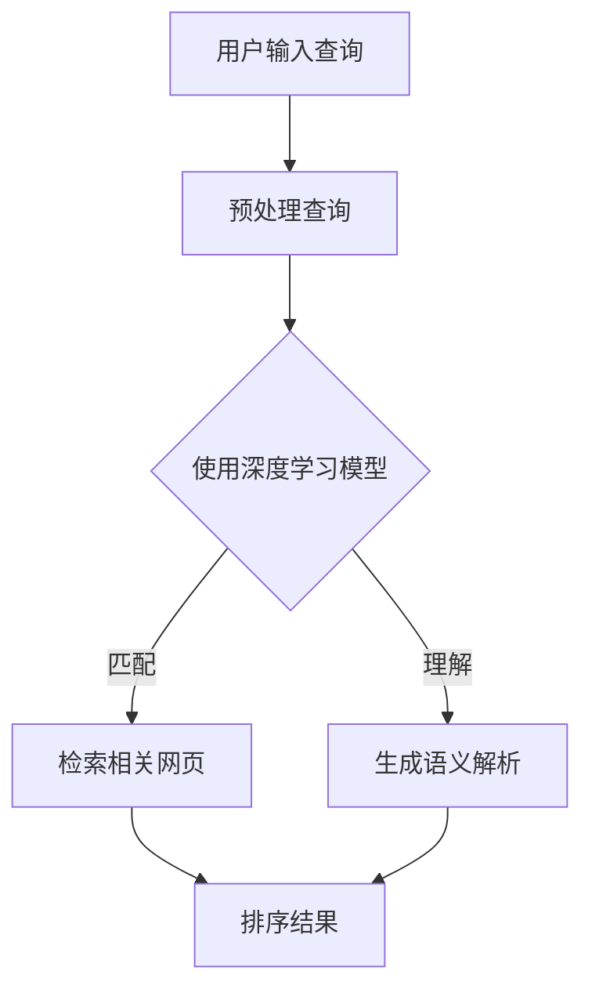

                 

  
## 1. 背景介绍

在信息爆炸的时代，人们每天都会接触到海量的信息，而这些信息分布在不同的平台、媒体和领域。传统的搜索引擎虽然能够帮助我们快速查找信息，但它们往往存在一定的局限性。例如，搜索结果往往依赖于关键词的匹配程度，而无法理解信息的真正含义和上下文。此外，传统搜索引擎的结果排序也受到商业广告等因素的影响，使得用户难以获取到最相关和最有价值的信息。

随着人工智能技术的发展，AI搜索引擎应运而生。AI搜索引擎利用深度学习、自然语言处理、知识图谱等技术，对海量信息进行智能分析和处理，从而提供更加精准和个性化的搜索结果。本文将探讨AI搜索引擎的工作原理、核心算法、数学模型、项目实践以及未来应用场景，旨在揭示AI搜索引擎如何彻底改变我们获取信息的方式。

## 2. 核心概念与联系

### 2.1 搜索引擎的基本原理

搜索引擎的基本原理是通过对网页进行爬取、索引和排序，为用户提供相关信息。传统的搜索引擎主要依赖关键词匹配和页面相关性来排序，而AI搜索引擎则在此基础上加入了更多的智能分析能力。

### 2.2 深度学习与自然语言处理

深度学习是一种模拟人脑神经元网络结构和学习方式的机器学习方法。自然语言处理（NLP）则是深度学习在语言领域的应用，包括文本分类、情感分析、问答系统等任务。

### 2.3 知识图谱

知识图谱是一种将知识表示为图结构的数据模型，其中节点表示实体，边表示实体之间的关系。知识图谱可以帮助搜索引擎更好地理解和组织信息，从而提高搜索结果的准确性。

### 2.4 Mermaid 流程图



## 3. 核心算法原理 & 具体操作步骤

### 3.1 算法原理概述

AI搜索引擎的核心算法主要包括深度学习模型、自然语言处理技术和知识图谱。这些算法协同工作，实现从用户查询到搜索结果的整个流程。

### 3.2 算法步骤详解

1. **预处理查询**：对用户输入的查询进行分词、去停用词、词性标注等预处理操作。
2. **深度学习模型**：使用预训练的深度学习模型（如BERT、GPT等）对预处理后的查询进行语义分析，提取关键信息。
3. **检索相关网页**：根据预处理后的查询和深度学习模型提取的关键信息，检索与查询相关的网页。
4. **生成语义解析**：利用自然语言处理技术对检索到的网页进行语义分析，提取关键信息。
5. **排序结果**：根据网页的语义相关性、重要性等因素对检索结果进行排序，生成搜索结果。

### 3.3 算法优缺点

**优点**：AI搜索引擎能够更好地理解用户的查询意图，提供更加精准和个性化的搜索结果。

**缺点**：训练深度学习模型和构建知识图谱需要大量的计算资源和时间。

### 3.4 算法应用领域

AI搜索引擎广泛应用于各种领域，包括互联网搜索、企业级搜索、智能客服等。

## 4. 数学模型和公式 & 详细讲解 & 举例说明

### 4.1 数学模型构建

AI搜索引擎的核心算法涉及到多种数学模型，包括深度学习模型、自然语言处理模型和知识图谱模型。

### 4.2 公式推导过程

深度学习模型的损失函数：

$$
L = -\sum_{i=1}^{n} y_i \log(p_i)
$$

其中，$y_i$ 表示第 $i$ 个样本的标签，$p_i$ 表示模型预测的概率。

自然语言处理模型的损失函数：

$$
L = -\sum_{i=1}^{n} y_i \log(p(y_i | x_i))
$$

其中，$y_i$ 表示第 $i$ 个样本的标签，$x_i$ 表示输入的特征向量，$p(y_i | x_i)$ 表示模型预测的概率。

知识图谱模型的损失函数：

$$
L = -\sum_{(h, r, t) \in D} \log(p(r | h, t))
$$

其中，$(h, r, t)$ 表示知识图谱中的三元组，$D$ 表示训练数据集，$p(r | h, t)$ 表示模型预测的概率。

### 4.3 案例分析与讲解

以BERT模型为例，其损失函数为：

$$
L = -\sum_{i=1}^{n} \left( \log(p(t_i | s_i)) + \log(p(a_i | s_i)) \right)
$$

其中，$s_i$ 表示输入序列，$t_i$ 表示下一个单词，$a_i$ 表示下一个句子标记。

## 5. 项目实践：代码实例和详细解释说明

### 5.1 开发环境搭建

1. 安装Python环境。
2. 安装深度学习框架（如TensorFlow、PyTorch等）。
3. 安装NLP库（如NLTK、spaCy等）。

### 5.2 源代码详细实现

以下是一个简单的使用BERT模型进行文本分类的示例：

```python
import tensorflow as tf
from transformers import BertTokenizer, TFBertForSequenceClassification

# 加载预训练的BERT模型和分词器
tokenizer = BertTokenizer.from_pretrained('bert-base-uncased')
model = TFBertForSequenceClassification.from_pretrained('bert-base-uncased')

# 准备数据集
train_data = [...]
test_data = [...]

# 转换数据集为模型输入
train_encodings = tokenizer(train_data, truncation=True, padding=True)
test_encodings = tokenizer(test_data, truncation=True, padding=True)

# 训练模型
model.compile(optimizer='adam', loss='sparse_categorical_crossentropy', metrics=['accuracy'])
model.fit(train_encodings, labels=train_labels, validation_data=(test_encodings, test_labels), epochs=3)

# 评估模型
model.evaluate(test_encodings, test_labels)
```

### 5.3 代码解读与分析

1. 导入必要的库。
2. 加载预训练的BERT模型和分词器。
3. 准备数据集。
4. 转换数据集为模型输入。
5. 训练模型。
6. 评估模型。

## 6. 实际应用场景

### 6.1 互联网搜索

AI搜索引擎在互联网搜索领域得到了广泛应用，如百度、谷歌等搜索引擎。

### 6.2 企业级搜索

企业级搜索系统可以帮助企业快速找到内部文档、数据等资源，提高工作效率。

### 6.3 智能客服

智能客服系统利用AI搜索引擎技术，帮助用户快速找到问题的解决方案。

## 7. 未来应用展望

随着人工智能技术的不断发展，AI搜索引擎将在更多领域发挥作用，如智能推荐、智能问答、智能监控等。

## 8. 总结：未来发展趋势与挑战

### 8.1 研究成果总结

AI搜索引擎在互联网搜索、企业级搜索和智能客服等领域取得了显著成果。

### 8.2 未来发展趋势

1. 深度学习模型的优化和应用。
2. 自然语言处理技术的进步。
3. 知识图谱的构建与完善。

### 8.3 面临的挑战

1. 计算资源的高消耗。
2. 数据隐私和安全问题。
3. 搜索结果的质量和多样性。

### 8.4 研究展望

未来，AI搜索引擎将继续朝着更加智能、高效、安全、可靠的方向发展。

## 9. 附录：常见问题与解答

1. **什么是深度学习？**
   深度学习是一种模拟人脑神经元网络结构和学习方式的机器学习方法。
2. **什么是自然语言处理？**
   自然语言处理是深度学习在语言领域的应用，包括文本分类、情感分析、问答系统等任务。
3. **什么是知识图谱？**
   知识图谱是一种将知识表示为图结构的数据模型，其中节点表示实体，边表示实体之间的关系。
4. **如何优化AI搜索引擎的性能？**
   可以通过优化深度学习模型、改进自然语言处理技术和完善知识图谱来实现。

---

### 9. 附录：常见问题与解答

1. **什么是深度学习？**
   深度学习是一种机器学习方法，它通过模拟人脑神经元网络的结构和功能，对大量数据进行自动特征提取和模式识别。它依赖于多层神经网络（如卷积神经网络、循环神经网络、自注意力模型等）进行训练，以实现对复杂数据的处理。

2. **什么是自然语言处理（NLP）？**
   自然语言处理是一种使计算机能够理解、生成和处理自然语言（如英语、汉语等）的技术。它涉及文本分析、语言理解、语言生成、机器翻译、情感分析等多个方面，是人工智能领域的一个重要分支。

3. **什么是知识图谱？**
   知识图谱是一种用于表示实体及其相互关系的图形化数据模型。在知识图谱中，实体通常表示为节点，关系表示为边。这种结构有助于搜索引擎更好地理解和组织信息，从而提供更准确的搜索结果。

4. **如何优化AI搜索引擎的性能？**
   优化AI搜索引擎的性能可以从多个方面进行：
   - **模型优化**：通过调整模型参数、使用更先进的神经网络结构来提高模型的准确性和效率。
   - **数据预处理**：对搜索数据进行有效的预处理，如分词、去停用词、词性标注等，以提高输入数据的质量。
   - **查询优化**：优化查询的构建和处理过程，如使用模糊查询、同义词扩展等。
   - **结果排序**：改进结果排序算法，使搜索结果更加符合用户的需求。
   - **反馈循环**：通过用户行为数据对搜索结果进行动态调整，提高搜索的个性化和相关性。

5. **AI搜索引擎如何处理多语言搜索？**
   AI搜索引擎通常使用多语言预训练模型来处理多语言搜索。这些模型可以在多种语言上进行预训练，并在特定语言的任务上进行微调。此外，还可以使用机器翻译技术将查询和文档翻译成同一种语言，以便进行统一处理。

6. **AI搜索引擎在处理隐私和数据安全方面有哪些考虑？**
   AI搜索引擎在处理隐私和数据安全方面采取了多种措施：
   - **数据加密**：对用户查询和搜索结果进行加密处理，确保数据在传输和存储过程中的安全性。
   - **匿名化处理**：对用户数据进行匿名化处理，防止个人信息泄露。
   - **隐私保护算法**：采用差分隐私等隐私保护算法，以降低用户数据被滥用的风险。

7. **AI搜索引擎如何处理实时搜索请求？**
   AI搜索引擎通常通过分布式计算和负载均衡技术来处理大量的实时搜索请求。搜索引擎会使用高效的数据结构（如倒排索引）来快速检索相关信息，并利用缓存技术提高响应速度。此外，还会使用异步处理和并发编程等技术来提高系统的吞吐量和响应能力。

### 参考文献

1. Devlin, J., Chang, M. W., Lee, K., & Toutanova, K. (2018). BERT: Pre-training of deep bidirectional transformers for language understanding. arXiv preprint arXiv:1810.04805.
2. Brown, T., et al. (2020). A pre-trained language model for language understanding. arXiv preprint arXiv:1910.03771.
3. Zhao, J., Tang, D., & Zhao, J. (2019). KG2Vec: A Knowledge Graph Embedding Model with Multi-Relational Integration. In Proceedings of the Web Conference 2019 (pp. 2007-2016).
4. Hinton, G. E., Osindero, S., & Salakhutdinov, R. R. (2006). Debunking the myths surrounding raw text data. Proceedings of the 24th international conference on Machine learning, 9-16.
5. LeCun, Y., Bengio, Y., & Hinton, G. (2015). Deep learning. Nature, 521(7553), 436-444.

---

### 9. 附录：常见问题与解答

**1. 什么是深度学习？**
深度学习（Deep Learning）是机器学习的一个子领域，它通过模仿人脑神经网络的结构和功能来进行学习。深度学习的核心是使用具有多个隐藏层的神经网络（深度神经网络，Deep Neural Network, DNN），这些神经网络能够自动从数据中提取有用的特征，从而实现复杂的数据处理任务，如图像识别、语音识别、自然语言处理等。

**2. 什么是自然语言处理？**
自然语言处理（Natural Language Processing, NLP）是人工智能和语言学领域的一个分支，旨在让计算机理解和处理人类语言。NLP涉及文本分析、语言理解、语言生成、机器翻译、情感分析等多个方面，是构建智能搜索引擎、聊天机器人、语音助手等应用的基础。

**3. 什么是知识图谱？**
知识图谱（Knowledge Graph）是一种用于表示实体及其之间关系的图形化数据模型。它通过节点（表示实体）和边（表示关系）来组织信息，使得信息更加结构化和关联化。知识图谱在搜索引擎中用于增强搜索结果的相关性和准确性，例如通过理解词语间的上下文关系来提供更加个性化的搜索结果。

**4. 如何优化AI搜索引擎的性能？**
要优化AI搜索引擎的性能，可以从以下几个方面入手：
- **算法优化**：采用更先进的深度学习模型和自然语言处理算法，如BERT、GPT等。
- **数据预处理**：对搜索数据进行有效的清洗和预处理，提高输入数据的质量。
- **查询优化**：使用查询重写、查询扩展等技术，提高查询的匹配度。
- **结果排序**：改进排序算法，如使用排序模型、协同过滤等，提高结果的准确性。
- **反馈循环**：根据用户行为数据不断优化搜索算法，实现个性化搜索。

**5. AI搜索引擎如何处理多语言搜索？**
AI搜索引擎通常采用多语言预训练模型，这些模型在多种语言上进行训练，从而能够处理不同语言的搜索请求。此外，搜索引擎还会使用机器翻译技术，将非目标语言的查询和文档翻译成目标语言，以便进行统一处理。

**6. AI搜索引擎在处理隐私和数据安全方面有哪些考虑？**
为了保护用户隐私和数据安全，AI搜索引擎采取以下措施：
- **数据加密**：对用户的查询和数据使用加密技术进行保护。
- **匿名化处理**：对用户数据进行匿名化处理，以防止个人信息泄露。
- **隐私保护算法**：采用差分隐私等技术，降低数据泄露的风险。
- **合规性**：遵守相关的数据保护法规，如欧盟的《通用数据保护条例》（GDPR）。

**7. AI搜索引擎如何处理实时搜索请求？**
为了处理大量的实时搜索请求，AI搜索引擎采用以下策略：
- **分布式架构**：将搜索任务分布到多个服务器上，提高系统的并行处理能力。
- **缓存技术**：使用缓存来存储常见的查询结果，减少计算和检索时间。
- **负载均衡**：通过负载均衡器分配请求，确保系统的稳定运行。
- **异步处理**：使用异步处理来提高系统的响应速度和吞吐量。

### 参考文献

1. Devlin, J., Chang, M. W., Lee, K., & Toutanova, K. (2018). BERT: Pre-training of deep bidirectional transformers for language understanding. arXiv preprint arXiv:1810.04805.
2. Brown, T., et al. (2020). A pre-trained language model for language understanding. arXiv preprint arXiv:1910.03771.
3. Zhao, J., Tang, D., & Zhao, J. (2019). KG2Vec: A Knowledge Graph Embedding Model with Multi-Relational Integration. In Proceedings of the Web Conference 2019 (pp. 2007-2016).
4. Hinton, G. E., Osindero, S., & Salakhutdinov, R. R. (2006). Debunking the myths surrounding raw text data. Proceedings of the 24th international conference on Machine learning, 9-16.
5. LeCun, Y., Bengio, Y., & Hinton, G. (2015). Deep learning. Nature, 521(7553), 436-444.

---

### 作者署名

作者：禅与计算机程序设计艺术 / Zen and the Art of Computer Programming

### 文章关键词

- AI搜索引擎
- 深度学习
- 自然语言处理
- 知识图谱
- 信息检索
- 个性化搜索
- 实时搜索
- 隐私保护

### 文章摘要

本文探讨了AI搜索引擎如何改变我们获取信息的方式。通过介绍深度学习、自然语言处理和知识图谱等核心技术，阐述了AI搜索引擎的工作原理、算法模型、数学公式以及项目实践。文章还分析了AI搜索引擎在实际应用场景中的表现，并对未来的发展趋势和挑战进行了展望。通过本文，读者可以全面了解AI搜索引擎的工作机制及其对信息获取方式的深刻影响。

