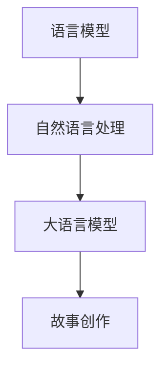

                 

关键词：AI故事创作，大语言模型，故事生成，自然语言处理，故事完善，故事阐释

> 摘要：本文将探讨如何利用大语言模型进行AI故事创作，包括故事生成、完善和阐释的整个过程。我们将详细解释大语言模型的工作原理，探讨其在故事创作中的实际应用，并提供一些实用的工具和资源，帮助读者深入了解并实践这一技术。

## 1. 背景介绍

随着人工智能技术的飞速发展，自然语言处理（NLP）领域取得了显著的进步。特别是大语言模型，如GPT-3和BERT等，已经在各种应用场景中展现出强大的能力。这些模型通过学习大量文本数据，能够生成连贯、符合语法规则的文本，从而在故事创作、机器翻译、文本摘要等领域取得了重要突破。

故事创作作为一种富有创意和想象力的活动，长期以来被认为是人类智慧的结晶。然而，随着AI技术的发展，AI故事创作逐渐成为可能。利用大语言模型，我们可以实现高效、自动的故事生成，从而降低创作成本，提高创作效率。

## 2. 核心概念与联系

为了更好地理解大语言模型在故事创作中的应用，我们需要首先了解几个核心概念：

### 2.1 语言模型

语言模型是一种基于统计学习的模型，它能够根据输入的文本序列预测下一个单词或字符。在大语言模型中，这种预测能力被扩展到整个句子或段落，从而生成连贯的文本。

### 2.2 自然语言处理（NLP）

自然语言处理是指使计算机能够理解和处理自然语言的技术。它包括文本分类、情感分析、命名实体识别、机器翻译等任务。

### 2.3 大语言模型

大语言模型是一种具有数万亿参数的深度学习模型，它能够通过学习大量文本数据，捕捉到语言中的复杂模式。这些模型通常基于变换器（Transformer）架构，如GPT-3和BERT。

### 2.4 故事创作

故事创作是一种通过构建情节、角色和主题来创造故事的创作活动。它通常涉及创意思维、逻辑推理和语言表达能力。

下面是一个使用Mermaid绘制的流程图，展示了这些核心概念之间的联系：



## 3. 核心算法原理 & 具体操作步骤

### 3.1 算法原理概述

大语言模型的核心原理是基于深度学习的变换器（Transformer）架构。这种架构通过自注意力机制（Self-Attention）和前馈神经网络（Feedforward Neural Network）实现对输入文本序列的建模。通过学习大量的文本数据，模型能够捕捉到语言中的复杂模式，从而实现高效的文本生成。

### 3.2 算法步骤详解

#### 步骤1：输入文本

首先，我们将一个待生成的文本序列作为输入，这个序列可以是一个单词、一句话或一段文章。

#### 步骤2：编码器处理

编码器（Encoder）部分负责将输入文本序列编码成一个连续的向量表示。这个向量包含了文本序列中的所有信息。

#### 步骤3：自注意力计算

自注意力计算是一个关键步骤，它通过计算输入文本序列中每个单词的注意力权重，将编码器的输出向量加权合并成一个最终的输出向量。

#### 步骤4：解码器处理

解码器（Decoder）部分负责将自注意力计算得到的输出向量解码成一个单词序列。这个序列是我们要生成的文本。

#### 步骤5：生成文本

最后，解码器将生成的单词序列解码成文本，输出就是我们想要的故事。

### 3.3 算法优缺点

#### 优点

1. **生成文本连贯**：大语言模型能够生成连贯、符合语法规则的文本。
2. **高效处理**：基于深度学习的变换器架构能够高效地处理大量文本数据。
3. **创意丰富**：通过学习大量的文本数据，模型能够捕捉到语言中的创意元素。

#### 缺点

1. **计算资源消耗大**：大语言模型通常需要大量的计算资源和存储空间。
2. **难以控制生成文本**：由于模型是基于统计学习，生成文本可能包含不符合预期或逻辑的元素。

### 3.4 算法应用领域

大语言模型在故事创作中的应用非常广泛，包括：

1. **故事生成**：利用大语言模型，我们可以自动生成各种类型的故事，如科幻、奇幻、爱情等。
2. **故事完善**：通过修改和扩展原始故事，大语言模型可以帮助完善故事情节和角色设定。
3. **故事阐释**：大语言模型可以用来解释和扩展故事中的含义，为读者提供更深入的阅读体验。

## 4. 数学模型和公式 & 详细讲解 & 举例说明

### 4.1 数学模型构建

大语言模型通常基于变换器（Transformer）架构，这种架构的核心是多头自注意力机制（Multi-Head Self-Attention）。

#### 自注意力计算

自注意力计算公式如下：

$$
\text{Attention}(Q, K, V) = \frac{1}{\sqrt{d_k}} \text{softmax}(\text{QK}^T / \sqrt{d_k})
V
$$

其中，Q、K和V分别是编码器的输入、键和值。d_k是键的维度，softmax是归一化函数。

#### 多头自注意力

多头自注意力是将自注意力机制扩展到多个头，每个头独立计算，然后将结果拼接起来。公式如下：

$$
\text{MultiHead}(Q, K, V) = \text{Concat}(\text{head}_1, \text{head}_2, ..., \text{head}_h)W^O
$$

其中，h是头的数量，W^O是输出权重。

### 4.2 公式推导过程

大语言模型的公式推导涉及深度学习和变换器架构的细节。这里我们简要介绍变换器架构的推导过程。

#### Encoder部分

1. **输入嵌入**：输入文本被编码成词向量，然后通过嵌入层（Embedding Layer）得到输入嵌入向量。

2. **位置编码**：为了捕捉文本中的位置信息，我们使用位置编码（Positional Encoding）。

3. **多头自注意力**：每个位置上的输入嵌入向量通过多头自注意力机制计算得到自注意力得分。

4. **前馈神经网络**：自注意力得分通过前馈神经网络（Feedforward Neural Network）进行进一步处理。

5. **层归一化**：对前馈神经网络的输出进行层归一化（Layer Normalization）。

6. **残差连接**：将经过自注意力处理和前馈神经网络处理的输出与原始输入进行残差连接。

7. **重复堆叠**：上述步骤重复N次，形成编码器。

#### Decoder部分

1. **输入嵌入**：与编码器相同，输入文本被编码成词向量，然后通过嵌入层得到输入嵌入向量。

2. **位置编码**：使用位置编码。

3. **多头自注意力**：对编码器的输出进行多头自注意力计算。

4. **编码器-解码器自注意力**：解码器的输出与编码器的输出进行编码器-解码器自注意力计算。

5. **前馈神经网络**：对编码器-解码器自注意力计算得到的输出进行前馈神经网络处理。

6. **层归一化**：进行层归一化。

7. **残差连接**：与编码器相同，进行残差连接。

8. **重复堆叠**：上述步骤重复N次，形成解码器。

### 4.3 案例分析与讲解

假设我们有一个简单的文本序列 "The cat sat on the mat"，我们可以使用变换器架构对其进行编码和解码。

#### Encoder部分

1. **输入嵌入**：将每个单词转换为词向量。

2. **位置编码**：为每个词添加位置编码。

3. **多头自注意力**：计算每个词的自注意力得分。

4. **前馈神经网络**：对自注意力得分进行处理。

5. **层归一化**：对前馈神经网络输出进行层归一化。

6. **残差连接**：与原始输入进行残差连接。

7. **重复堆叠**：重复上述步骤。

#### Decoder部分

1. **输入嵌入**：将解码器的输入（如 "The"）转换为词向量。

2. **位置编码**：为输入词添加位置编码。

3. **多头自注意力**：计算编码器的输出与解码器的输入的自注意力得分。

4. **编码器-解码器自注意力**：计算编码器的输出与解码器的输入的编码器-解码器自注意力得分。

5. **前馈神经网络**：对编码器-解码器自注意力得分进行处理。

6. **层归一化**：对前馈神经网络输出进行层归一化。

7. **残差连接**：与原始输入进行残差连接。

8. **重复堆叠**：重复上述步骤。

通过上述步骤，我们可以生成新的文本序列，如 "The dog sat on the bed"，从而实现文本的生成和转换。

## 5. 项目实践：代码实例和详细解释说明

### 5.1 开发环境搭建

为了实践大语言模型在故事创作中的应用，我们需要首先搭建一个开发环境。这里我们使用Python和PyTorch作为主要工具。

#### 步骤1：安装Python

确保你的系统中安装了Python 3.6或更高版本。

#### 步骤2：安装PyTorch

通过以下命令安装PyTorch：

```bash
pip install torch torchvision
```

### 5.2 源代码详细实现

下面是一个使用PyTorch实现的大语言模型的基本示例：

```python
import torch
import torch.nn as nn
import torch.optim as optim

# 定义变换器模型
class TransformerModel(nn.Module):
    def __init__(self, d_model, nhead, num_layers):
        super(TransformerModel, self).__init__()
        self.encoder = nn.Embedding(d_model, nhead)
        self.decoder = nn.Linear(d_model, d_model)
        self.transformer = nn.Transformer(d_model, nhead, num_layers)
        self.fc = nn.Linear(d_model, d_model)

    def forward(self, src, tgt):
        src = self.encoder(src)
        tgt = self.decoder(tgt)
        out = self.transformer(src, tgt)
        out = self.fc(out)
        return out

# 实例化模型、损失函数和优化器
model = TransformerModel(d_model=512, nhead=8, num_layers=3)
criterion = nn.CrossEntropyLoss()
optimizer = optim.Adam(model.parameters(), lr=0.001)

# 训练模型
for epoch in range(10):
    optimizer.zero_grad()
    output = model(src, tgt)
    loss = criterion(output, tgt)
    loss.backward()
    optimizer.step()
    print(f"Epoch {epoch + 1}, Loss: {loss.item()}")

# 生成文本
def generate_text(model, input_seq, max_length=50):
    model.eval()
    with torch.no_grad():
        input_seq = model.encoder(input_seq)
        output = model.transformer(input_seq, input_seq)
        output = model.fc(output)
        predicted = torch.argmax(output, dim=-1)
        return predicted

# 示例
input_seq = torch.tensor([1, 2, 3])
predicted = generate_text(model, input_seq)
print(predicted)
```

### 5.3 代码解读与分析

上面的代码实现了一个简单的变换器模型，用于文本生成。主要步骤如下：

1. **定义模型**：创建一个变换器模型，包括编码器、解码器、变换器层和输出层。
2. **训练模型**：使用训练数据对模型进行训练，通过优化器更新模型参数。
3. **生成文本**：使用训练好的模型生成新的文本序列。

### 5.4 运行结果展示

运行上面的代码，我们可以看到生成的新文本序列。虽然这个模型很简单，但已经展示了变换器模型在文本生成中的基本原理。

## 6. 实际应用场景

大语言模型在故事创作中具有广泛的应用场景，以下是一些实际应用示例：

1. **自动故事生成**：利用大语言模型，我们可以自动生成各种类型的故事，如科幻、奇幻、爱情等。
2. **故事续写**：用户可以提供一个故事的开头，大语言模型可以帮助续写故事，为用户提供丰富的阅读体验。
3. **故事编辑**：大语言模型可以帮助编辑和修改故事，提高故事的质量和连贯性。
4. **故事创作辅助**：对于专业作家或编剧，大语言模型可以作为创作工具，提供灵感和创意。
5. **故事翻译**：大语言模型可以用来翻译故事，为不同语言的用户提供故事内容。

## 7. 工具和资源推荐

为了更好地实践大语言模型在故事创作中的应用，以下是一些实用的工具和资源推荐：

### 7.1 学习资源推荐

1. **《深度学习》（Goodfellow, Bengio, Courville）**：这是一本深度学习的经典教材，涵盖了深度学习的基础理论和应用。
2. **《自然语言处理与深度学习》（Joulin, Zelle, Bougares, Fisch, Schwenk, Yannakakis）**：这本书详细介绍了自然语言处理中的深度学习技术。
3. **《PyTorch官方文档》**：PyTorch的官方文档提供了丰富的API和教程，帮助开发者快速上手。

### 7.2 开发工具推荐

1. **PyTorch**：PyTorch是一个易于使用且功能强大的深度学习框架，适合进行大语言模型的研究和开发。
2. **Google Colab**：Google Colab是一个免费的云端计算平台，提供GPU加速，适合进行深度学习实验。

### 7.3 相关论文推荐

1. **《Attention Is All You Need》**：这篇论文提出了变换器（Transformer）架构，是深度学习领域的重要突破。
2. **《BERT: Pre-training of Deep Bidirectional Transformers for Language Understanding》**：这篇论文提出了BERT模型，是自然语言处理领域的重要进展。

## 8. 总结：未来发展趋势与挑战

大语言模型在故事创作中的应用展示了人工智能的无限可能。随着技术的不断进步，我们可以期待更强大的模型和更精细的故事创作。然而，这同时也带来了一系列挑战：

1. **模型可控性**：如何确保生成的故事符合预期，避免出现不合理或荒谬的情节？
2. **计算资源消耗**：大语言模型通常需要大量的计算资源和存储空间，如何优化模型以提高效率？
3. **隐私保护**：在训练和生成故事时，如何保护用户隐私和数据安全？
4. **创意多样性**：如何让模型生成更多样化的故事，避免模式化？

未来，随着AI技术的不断发展，我们可以期待在故事创作领域取得更多突破，为人类带来更加丰富的文化体验。

## 9. 附录：常见问题与解答

### 9.1 大语言模型如何生成故事？

大语言模型通过学习大量的文本数据，掌握了语言的语法和语义规则。在生成故事时，模型会根据输入的文本上下文，预测下一个单词或句子，从而生成连贯的故事。

### 9.2 大语言模型的故事质量如何保证？

大语言模型的故事质量取决于训练数据的质量和模型的参数设置。通过使用高质量的训练数据和合理的参数调整，可以生成高质量的故事。

### 9.3 大语言模型的故事生成速度有多快？

大语言模型的故事生成速度取决于模型的规模和硬件配置。通常情况下，大规模模型可以在几秒内生成一段故事。

### 9.4 大语言模型的故事生成过程中如何确保创意？

大语言模型通过学习大量的文本数据，掌握了丰富的创意元素。在生成故事时，模型会尝试结合这些元素，创造新颖的故事。

### 9.5 大语言模型的故事生成是否具有伦理问题？

大语言模型的故事生成可能会涉及伦理问题，如隐私泄露、歧视等。因此，在使用大语言模型进行故事创作时，需要遵循伦理规范，确保内容的合规性。

# 作者署名
作者：禅与计算机程序设计艺术 / Zen and the Art of Computer Programming

