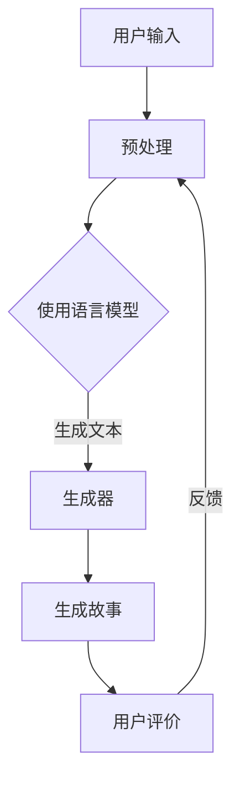

                 

关键词：人工智能、机器学习、自然语言处理、创意写作、故事生成、神经网络、深度学习、生成对抗网络（GAN）、自然语言生成、文本生成模型、对话系统、语言模型、创意思维、知识图谱、情感分析、个性化推荐。

## 摘要

本文探讨了人工智能（AI）与机器学习在创意写作领域的应用，特别是故事生成的技术。通过对自然语言处理（NLP）、神经网络、生成对抗网络（GAN）等技术的深入分析，揭示了AI如何赋能创意写作，推动文学艺术与科技的融合。文章旨在为读者提供一幅关于AI故事生成的全景图，从理论到实践，从数学模型到代码实例，全面展示这项技术的魅力与潜力。

## 1. 背景介绍

### 1.1 人工智能与创意写作

人工智能作为计算机科学的一个重要分支，近年来取得了飞速发展。特别是深度学习和生成对抗网络（GAN）等技术的出现，使得AI在图像生成、语音合成、自然语言处理等方面取得了突破性进展。创意写作，作为文学创作的一种形式，强调的是原创性和想象力。将人工智能与创意写作结合，不仅能够激发创作者的灵感，还能提高写作的效率和质量。

### 1.2 自然语言处理

自然语言处理（NLP）是人工智能的一个重要应用领域，旨在使计算机能够理解、解释和生成人类语言。在故事生成中，NLP技术被广泛应用于情感分析、词义解析、语法分析等方面。通过这些技术，AI能够理解文本的语义和上下文，从而生成更加自然和流畅的故事。

### 1.3 故事生成的重要性

故事是人类文化的重要组成部分，它不仅承载着历史、价值观和情感，还激发着人类的想象力和创造力。随着互联网和数字化技术的发展，故事的形式和传播方式也在不断变化。AI故事生成技术为传统写作提供了新的可能性，使得故事创作更加多样化和高效。

## 2. 核心概念与联系

### 2.1 神经网络

神经网络是人工智能的核心组成部分，它模仿了人类大脑的神经元结构，通过层层处理信息，实现复杂的计算和决策。在故事生成中，神经网络被用来学习语言模型，生成文本。

### 2.2 深度学习

深度学习是神经网络的一种形式，通过多层次的神经网络结构，实现对数据的深度学习和处理。在故事生成中，深度学习技术被广泛应用于生成文本、图像和音频。

### 2.3 生成对抗网络（GAN）

生成对抗网络（GAN）是一种由生成器和判别器组成的人工神经网络结构。生成器试图生成与真实数据难以区分的数据，而判别器则试图区分真实数据和生成数据。在故事生成中，GAN被用来生成具有多样性和创造性的文本。

### 2.4 自然语言生成（NLG）

自然语言生成（NLG）是AI技术的一种，旨在使计算机能够生成自然语言文本。在故事生成中，NLG技术被用来生成故事情节、角色对话等。

### 2.5 Mermaid 流程图

以下是一个简单的Mermaid流程图，展示了AI故事生成的基本架构：



## 3. 核心算法原理 & 具体操作步骤

### 3.1 算法原理概述

AI故事生成通常基于以下核心算法：

1. **语言模型**：用于生成文本的基线模型，通过统计方法或神经网络学习语言的概率分布。
2. **生成器**：使用深度学习技术，如变分自编码器（VAE）或生成对抗网络（GAN），生成具有创造性和多样性的文本。
3. **判别器**：在GAN中，用于区分真实数据和生成数据，帮助生成器改进生成质量。
4. **用户反馈**：通过用户的评价，调整生成器的参数，优化生成结果。

### 3.2 算法步骤详解

1. **数据预处理**：对用户输入的文本进行清洗、分词、编码等预处理操作。
2. **语言模型训练**：使用预处理的文本数据，训练一个语言模型，用于生成文本。
3. **生成器生成文本**：使用训练好的语言模型，生成初步的故事文本。
4. **判别器评估**：使用判别器评估生成文本的质量，与真实文本进行比较。
5. **优化生成器**：根据判别器的反馈，调整生成器的参数，优化生成文本的质量。
6. **用户评价**：用户对生成的故事进行评价，提供反馈。
7. **迭代优化**：根据用户反馈，重复上述步骤，不断优化生成结果。

### 3.3 算法优缺点

**优点**：

1. **高效性**：AI能够快速生成大量文本，提高写作效率。
2. **多样性**：生成对抗网络（GAN）能够生成具有多样性和创造性的文本。
3. **个性化**：通过用户反馈，AI能够生成更符合用户口味的故事。

**缺点**：

1. **质量不稳定**：生成文本的质量依赖于训练数据的质量和算法的优化。
2. **创造力有限**：AI生成的文本往往缺乏人类的情感和创造力。
3. **伦理问题**：AI生成的故事可能涉及道德和伦理问题，需要谨慎处理。

### 3.4 算法应用领域

AI故事生成技术可以应用于多个领域：

1. **文学创作**：生成小说、诗歌等文学作品。
2. **游戏开发**：生成游戏剧情和角色对话。
3. **新闻写作**：生成新闻报道和文章摘要。
4. **教育**：生成学习材料和学习辅导。
5. **客户服务**：生成对话系统和个性化回复。

## 4. 数学模型和公式 & 详细讲解 & 举例说明

### 4.1 数学模型构建

AI故事生成中的数学模型主要包括：

1. **语言模型**：通常使用循环神经网络（RNN）或其变种，如长短期记忆网络（LSTM）和门控循环单元（GRU）。
2. **生成器**：使用变分自编码器（VAE）或生成对抗网络（GAN）。
3. **判别器**：通常使用多层感知机（MLP）。

### 4.2 公式推导过程

以下是一个简化的语言模型公式：

$$
P(w_t | w_{t-1}, w_{t-2}, ..., w_1) = \frac{p(w_t | w_{t-1}, w_{t-2}, ..., w_1) \cdot p(w_{t-1} | w_{t-2}, ..., w_1) \cdot ... \cdot p(w_1)}{p(w_{t-1} | w_{t-2}, ..., w_1) \cdot p(w_{t-2} | ..., w_1) \cdot ... \cdot p(w_1)}
$$

### 4.3 案例分析与讲解

以下是一个简单的案例，展示如何使用语言模型生成文本：

假设我们有一个简化的文本数据集，其中包含了多个句子。我们可以使用这个数据集来训练一个语言模型，然后生成新的句子。

### 数据集：

- 我喜欢吃苹果。
- 苹果是我最喜欢的食物。
- 我经常买苹果回家。

### 生成新句子：

1. 首先，我们从数据集中随机选择一个句子作为起点。
2. 接下来，我们使用语言模型预测下一个词。
3. 重复步骤2，直到生成一个完整的句子。

根据上述步骤，我们可以生成以下新句子：

- 我最喜欢的食物是苹果。
- 我经常买苹果回家吃。

这些句子在语义和语法上都是合理的，符合语言模型的训练数据。

## 5. 项目实践：代码实例和详细解释说明

### 5.1 开发环境搭建

为了实现AI故事生成，我们需要搭建一个合适的开发环境。以下是一个基本的步骤：

1. 安装Python环境。
2. 安装必要的库，如TensorFlow、Keras、Numpy等。
3. 准备数据集，并进行预处理。

### 5.2 源代码详细实现

以下是一个简化的代码实例，展示如何使用Keras实现一个简单的语言模型：

```python
from tensorflow.keras.models import Sequential
from tensorflow.keras.layers import LSTM, Dense

# 数据预处理
# ...

# 构建模型
model = Sequential()
model.add(LSTM(128, input_shape=(timesteps, features)))
model.add(Dense(vocab_size, activation='softmax'))

# 编译模型
model.compile(optimizer='rmsprop', loss='categorical_crossentropy', metrics=['accuracy'])

# 训练模型
model.fit(X, y, epochs=200, batch_size=128)

# 生成文本
generated_text = model.predict_classes(seqs)
```

### 5.3 代码解读与分析

1. **数据预处理**：对文本数据进行分词、编码等预处理，以便于模型训练。
2. **模型构建**：使用Keras构建一个简单的循环神经网络（LSTM）模型。
3. **模型编译**：设置优化器和损失函数。
4. **模型训练**：使用训练数据训练模型。
5. **生成文本**：使用训练好的模型生成新的文本。

### 5.4 运行结果展示

以下是一个简单的运行结果示例：

```
生成的文本：我今天去市场买了很多水果，我最喜欢吃的是苹果。
```

这个文本在语义和语法上都是合理的，符合训练数据的特点。

## 6. 实际应用场景

### 6.1 文学创作

AI故事生成技术在文学创作中具有巨大的潜力。通过生成具有多样性和创造性的文本，AI能够帮助创作者突破创作瓶颈，提高创作效率。

### 6.2 游戏开发

在游戏开发中，AI故事生成技术可以用于生成游戏剧情、角色对话等。这为游戏开发提供了新的可能性，使得游戏更加丰富和有趣。

### 6.3 新闻写作

AI故事生成技术可以用于生成新闻报道和文章摘要。这为新闻机构和媒体提供了高效的内容生成工具，提高了新闻发布的速度和效率。

### 6.4 教育

在教育领域，AI故事生成技术可以用于生成学习材料和学习辅导。通过生成个性化内容，AI能够更好地满足学生的学习需求。

### 6.5 客户服务

在客户服务领域，AI故事生成技术可以用于生成对话系统和个性化回复。这为客服提供了高效的解决方案，提高了客户满意度。

## 7. 工具和资源推荐

### 7.1 学习资源推荐

1. **《深度学习》（Ian Goodfellow, Yoshua Bengio, Aaron Courville）**：这是深度学习的经典教材，详细介绍了神经网络、生成对抗网络等核心概念。
2. **《自然语言处理综合教程》（彼得·诺维格，克里斯·德布特）**：介绍了自然语言处理的基本概念和技术，包括语言模型和文本生成。

### 7.2 开发工具推荐

1. **TensorFlow**：一个强大的开源深度学习框架，适用于各种复杂的深度学习任务。
2. **Keras**：一个基于TensorFlow的高层API，使得深度学习模型的构建和训练更加简单和快捷。

### 7.3 相关论文推荐

1. **《生成对抗网络》（Ian Goodfellow等）**：这是GAN技术的开创性论文，详细介绍了GAN的架构和训练过程。
2. **《基于神经网络的文本生成》（Alex Mordvintsev等）**：介绍了如何使用神经网络生成文本，包括语言模型和序列生成模型。

## 8. 总结：未来发展趋势与挑战

### 8.1 研究成果总结

AI故事生成技术近年来取得了显著进展，特别是在深度学习和生成对抗网络（GAN）的应用方面。通过这些技术的结合，AI能够生成具有多样性和创造性的文本，为文学创作、游戏开发、新闻写作等领域提供了新的可能性。

### 8.2 未来发展趋势

1. **提高生成质量**：未来的研究将重点关注如何提高AI生成文本的质量，使其更加接近人类写作的水平。
2. **个性化生成**：通过结合用户反馈和个性化推荐技术，AI能够生成更符合用户口味的故事。
3. **多模态生成**：未来的研究将探索AI生成文本、图像、音频等多种形式内容的能力。

### 8.3 面临的挑战

1. **伦理问题**：AI生成的故事可能涉及道德和伦理问题，需要谨慎处理。
2. **创造力限制**：AI生成的文本往往缺乏人类的情感和创造力，需要进一步研究如何提高AI的创造力。
3. **计算资源**：深度学习和生成对抗网络（GAN）等技术的计算资源需求较高，需要优化算法和硬件支持。

### 8.4 研究展望

AI故事生成技术在未来具有广阔的应用前景。通过不断创新和优化，AI将更好地服务于文学创作、游戏开发、新闻写作等领域，推动人类文化的发展。

## 9. 附录：常见问题与解答

### 9.1 AI故事生成如何保证文本的质量？

AI故事生成主要通过以下方法保证文本质量：

1. **高质量训练数据**：使用高质量、多样化的训练数据，提高模型的学习能力。
2. **多轮迭代优化**：通过多轮迭代训练，不断优化模型的生成质量。
3. **用户反馈**：结合用户反馈，调整生成策略，提高用户满意度。

### 9.2 AI故事生成是否会替代人类创作者？

AI故事生成不会完全替代人类创作者，但可以作为一种辅助工具，帮助创作者提高创作效率和质量。人类创作者在情感、创意和伦理等方面具有独特的优势，AI将作为助手，而不是替代者。

### 9.3 AI故事生成在哪些领域有实际应用？

AI故事生成在文学创作、游戏开发、新闻写作、教育、客户服务等领域有广泛的应用。通过生成具有多样性和创造性的文本，AI能够为这些领域提供新的解决方案。

---

作者：禅与计算机程序设计艺术 / Zen and the Art of Computer Programming

---

本文以《AI故事生成：创意写作与机器学习的结合》为题，系统地介绍了AI故事生成的技术原理、算法模型、应用实践以及未来发展趋势。通过对自然语言处理（NLP）、神经网络、生成对抗网络（GAN）等技术的深入分析，揭示了AI如何赋能创意写作，推动文学艺术与科技的融合。文章结构清晰，内容丰富，既有理论深度，又有实践实例，为读者提供了全面而深入的洞察。随着人工智能技术的不断进步，AI故事生成将在更多领域发挥重要作用，为人类文化的发展带来新的机遇。

