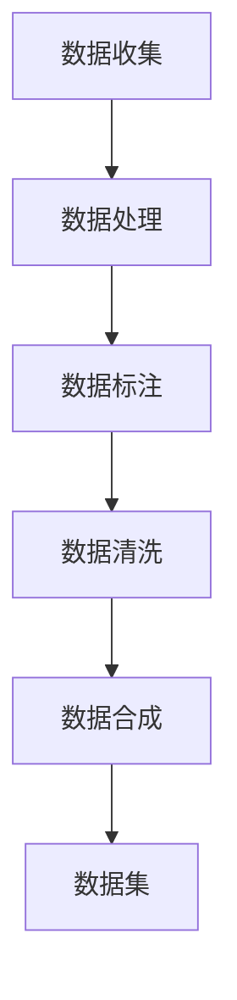

                 

 关键词：数据集构建、数据收集、数据合成、机器学习、深度学习

> 摘要：本文旨在探讨人工智能领域中数据集构建的全过程，从数据的收集、整理、标注到合成数据生成的方法和应用，深入分析数据集在机器学习、深度学习中的重要性，以及未来可能面临的挑战和趋势。

## 1. 背景介绍

在人工智能，尤其是机器学习和深度学习的应用场景中，数据集构建是至关重要的一环。数据集的质量直接影响模型的性能和效果，因此构建高质量的数据集是一项关键任务。数据集构建涉及数据的收集、处理、标注、清洗等多个环节，其中任何一环出现疏漏都可能导致最终模型的效果不理想。

随着人工智能技术的不断发展，数据集构建的方法和技术也在不断演进。传统的数据集构建主要依赖于手动收集和标注，效率低下且成本高昂。随着合成数据技术的兴起，我们可以通过算法生成与真实数据相似度高的数据，从而提高数据集构建的效率和灵活性。

本文将首先介绍数据集构建的基本概念和流程，然后详细探讨数据收集、数据合成、数据标注、数据清洗等技术，最后分析数据集构建在机器学习和深度学习中的应用，以及未来可能面临的挑战和趋势。

## 2. 核心概念与联系

### 数据集构建的基本概念

数据集（Dataset）是机器学习和深度学习的基础，它由一组数据样本（Samples）组成，每个数据样本包含特征（Features）和标签（Labels）。特征描述了样本的属性，标签则是我们希望模型预测的结果。

数据集构建的关键环节包括数据收集、数据处理、数据标注、数据清洗和合成数据生成。

### 数据集构建的流程

数据集构建的流程可以分为以下几个步骤：

1. **数据收集**：收集来自不同来源的数据，如公开数据集、企业内部数据等。
2. **数据处理**：对收集到的数据进行预处理，包括数据清洗、数据归一化、数据转换等。
3. **数据标注**：对数据进行标注，以便于模型训练。标注可以由人工完成，也可以使用自动化工具。
4. **数据清洗**：对数据进行清洗，去除错误数据、重复数据和噪声数据。
5. **数据合成**：通过算法生成与真实数据相似的数据，用于扩充数据集。

### 数据集构建的核心概念原理和架构

下面是一个简化的数据集构建的 Mermaid 流程图，展示了各个核心概念和步骤之间的联系。



在这个流程图中，数据收集是整个流程的起点，随后通过数据处理、数据标注、数据清洗和合成数据生成等步骤，最终形成高质量的数据集。

### 数据集构建的 Mermaid 流程图

```mermaid
gantt
    title 数据集构建流程
    dateFormat  YYYY-MM-DD
    section 数据收集
    收集数据 :orate[2d] :2023-01-01, 2d
    section 数据处理
    数据预处理 :ongoing2[1w]
    section 数据标注
    数据标注 :after 数据预处理, 2d
    section 数据清洗
    数据清洗 :after 数据标注, 3d
    section 数据合成
    数据合成 :after 数据清洗, 4d
    section 数据集生成
    数据集 :after 数据合成, 1d
```

在这个流程图中，每个步骤都有明确的时间线，有助于理解数据集构建的各个阶段和相互关系。

## 3. 核心算法原理 & 具体操作步骤

### 3.1 算法原理概述

数据集构建的核心算法包括数据收集算法、数据处理算法、数据标注算法、数据清洗算法和合成数据生成算法。每种算法都有其特定的原理和应用场景。

- **数据收集算法**：主要用于从不同来源获取数据，如爬虫、API 接口、数据库等。
- **数据处理算法**：包括数据清洗、数据归一化、数据转换等，用于提高数据质量和一致性。
- **数据标注算法**：用于对数据进行标注，以便于模型训练。标注算法可以分为手动标注和自动化标注。
- **数据清洗算法**：用于去除错误数据、重复数据和噪声数据，确保数据集的清洁性。
- **合成数据生成算法**：通过算法生成与真实数据相似的数据，用于扩充数据集，提高模型泛化能力。

### 3.2 算法步骤详解

#### 数据收集算法

数据收集算法的步骤如下：

1. **确定数据来源**：根据应用场景选择合适的数据来源，如公开数据集、企业内部数据等。
2. **数据采集**：使用爬虫、API 接口、数据库等方式获取数据。
3. **数据存储**：将采集到的数据存储到本地或云端数据库中。

#### 数据处理算法

数据处理算法的步骤如下：

1. **数据清洗**：去除错误数据、重复数据和噪声数据。
2. **数据归一化**：将不同特征的数据缩放到相同的范围，如 [0, 1] 或 [-1, 1]。
3. **数据转换**：将数据转换为适合模型训练的格式，如 One-Hot 编码、标签编码等。

#### 数据标注算法

数据标注算法的步骤如下：

1. **手动标注**：由专业人员进行标注，适用于小规模数据集。
2. **自动化标注**：使用自动化工具进行标注，适用于大规模数据集。常见的自动化标注工具包括 LabelImg、CVAT 等。

#### 数据清洗算法

数据清洗算法的步骤如下：

1. **去除错误数据**：检测并去除错误数据，如缺失值、异常值等。
2. **去除重复数据**：检测并去除重复数据，以提高数据集的质量。
3. **去除噪声数据**：去除噪声数据，如随机噪声、干扰信号等。

#### 合成数据生成算法

合成数据生成算法的步骤如下：

1. **生成合成数据**：使用 GAN（生成对抗网络）、VAE（变分自编码器）等算法生成与真实数据相似的数据。
2. **数据融合**：将合成数据与真实数据进行融合，形成高质量的数据集。

### 3.3 算法优缺点

#### 数据收集算法

**优点**：可以获取多种来源的数据，提高数据多样性。

**缺点**：数据收集可能受到法律、道德等因素的约束，且数据质量难以保证。

#### 数据处理算法

**优点**：提高数据质量和一致性，为模型训练提供更好的基础。

**缺点**：数据处理过程复杂，需要大量计算资源和时间。

#### 数据标注算法

**优点**：提供准确的数据标注，有助于模型训练。

**缺点**：手动标注成本高，自动化标注存在误差。

#### 数据清洗算法

**优点**：去除错误、重复和噪声数据，提高数据质量。

**缺点**：可能去除一些有用的信息。

#### 合成数据生成算法

**优点**：可以生成与真实数据相似的数据，扩充数据集，提高模型泛化能力。

**缺点**：生成数据的质量和真实数据的相似度难以保证。

### 3.4 算法应用领域

数据集构建算法在多个领域有广泛应用：

- **计算机视觉**：用于生成训练数据，提高模型性能。
- **自然语言处理**：用于生成文本数据，用于语言模型训练。
- **语音识别**：用于生成语音数据，用于语音识别模型训练。
- **医疗领域**：用于生成医学影像数据，用于疾病诊断和研究。

## 4. 数学模型和公式 & 详细讲解 & 举例说明

### 4.1 数学模型构建

数据集构建中涉及的数学模型主要包括特征提取模型、标注模型和合成模型。

#### 特征提取模型

特征提取模型用于将原始数据转换为适合模型训练的特征向量。常见的特征提取模型包括卷积神经网络（CNN）、循环神经网络（RNN）等。

$$
h_{l} = \sigma(W_{l} \cdot a_{l-1} + b_{l})
$$

其中，$h_{l}$ 表示第 $l$ 层的特征向量，$W_{l}$ 和 $b_{l}$ 分别表示权重和偏置，$\sigma$ 表示激活函数，$a_{l-1}$ 表示前一层输出。

#### 标注模型

标注模型用于对数据进行标注。常见的标注模型包括条件概率模型、决策树、支持向量机（SVM）等。

$$
P(y|x) = \frac{e^{\theta^T x}}{1 + e^{\theta^T x}}
$$

其中，$P(y|x)$ 表示在特征 $x$ 下标签 $y$ 的概率，$\theta$ 表示模型的参数。

#### 合成模型

合成模型用于生成与真实数据相似的数据。常见的合成模型包括生成对抗网络（GAN）、变分自编码器（VAE）等。

$$
\min_D \max_G \mathbb{E}_{x \sim p_{data}(x)}[\log(D(G(x)))] + \mathbb{E}_{z \sim p_{z}(z)}[\log(1 - D(G(z))]
$$

其中，$G$ 表示生成器，$D$ 表示判别器，$z$ 表示噪声向量。

### 4.2 公式推导过程

#### 特征提取模型

特征提取模型的推导过程如下：

1. **前向传播**：

$$
a_{l} = \sigma(W_{l} \cdot a_{l-1} + b_{l})
$$

2. **反向传播**：

$$
\delta_{l} = \frac{\partial L}{\partial a_{l}} \odot \frac{\partial \sigma}{\partial a_{l}}
$$

$$
\frac{\partial L}{\partial W_{l}} = \delta_{l} \cdot a_{l-1}^{T}
$$

$$
\frac{\partial L}{\partial b_{l}} = \delta_{l}
$$

#### 标注模型

标注模型的推导过程如下：

1. **前向传播**：

$$
\theta^T x = z
$$

$$
\sigma(z) = P(y=1 | x)
$$

2. **反向传播**：

$$
\delta = (P(y=1 | x) - y)
$$

$$
\frac{\partial L}{\partial \theta} = \delta x^{T}
$$

#### 合成模型

合成模型的推导过程如下：

1. **前向传播**：

$$
D(G(x)) = \frac{1}{2} \left[ 1 - \log(1 + e^{-(G(x) + x)}) \right]
$$

$$
D(G(z)) = \frac{1}{2} \left[ 1 - \log(1 + e^{-\theta^T z}) \right]
$$

2. **反向传播**：

$$
\frac{\partial L_G}{\partial G} = -\frac{1}{N} \sum_{i=1}^{N} \left[ \log(D(G(x_i))) + \log(1 - D(G(z_i))) \right]
$$

$$
\frac{\partial L_D}{\partial D} = \frac{1}{N} \sum_{i=1}^{N} \left[ \log(D(G(x_i))) + \log(D(z_i)) \right]
$$

### 4.3 案例分析与讲解

#### 特征提取模型

假设我们使用卷积神经网络（CNN）对图像进行特征提取，其中包含一个卷积层和一个池化层。

1. **前向传播**：

$$
h_1 = \sigma(W_1 \cdot a_0 + b_1)
$$

$$
p_1 = \text{maxPooling}(h_1)
$$

2. **反向传播**：

$$
\delta_1 = \frac{\partial L}{\partial h_1} \odot \frac{\partial \sigma}{\partial h_1}
$$

$$
\frac{\partial L}{\partial W_1} = \delta_1 \cdot p_0^{T}
$$

$$
\frac{\partial L}{\partial b_1} = \delta_1
$$

#### 标注模型

假设我们使用逻辑回归（Logistic Regression）对文本进行标注。

1. **前向传播**：

$$
z = \theta^T x
$$

$$
\sigma(z) = P(y=1 | x)
$$

2. **反向传播**：

$$
\delta = (P(y=1 | x) - y)
$$

$$
\frac{\partial L}{\partial \theta} = \delta x^{T}
$$

#### 合成模型

假设我们使用生成对抗网络（GAN）对图像进行合成。

1. **前向传播**：

$$
x' = G(z)
$$

$$
D(x') = \frac{1}{2} \left[ 1 - \log(1 + e^{-(D(x') + x')}) \right]
$$

2. **反向传播**：

$$
\frac{\partial L_G}{\partial G} = -\frac{1}{N} \sum_{i=1}^{N} \left[ \log(D(G(x_i))) + \log(1 - D(G(z_i))) \right]
$$

$$
\frac{\partial L_D}{\partial D} = \frac{1}{N} \sum_{i=1}^{N} \left[ \log(D(G(x_i))) + \log(D(z_i)) \right]
$$

## 5. 项目实践：代码实例和详细解释说明

### 5.1 开发环境搭建

在开始编写代码之前，我们需要搭建一个合适的开发环境。以下是在 Python 中进行数据集构建的项目开发环境搭建步骤：

1. **安装 Python**：确保已安装 Python 3.7 或更高版本。
2. **安装依赖库**：使用 pip 安装以下依赖库：

   ```bash
   pip install numpy pandas matplotlib scikit-learn tensorflow keras
   ```

3. **配置 GPU 支持**：如果使用 TensorFlow，确保已配置 GPU 支持。

### 5.2 源代码详细实现

以下是一个简单的数据集构建示例，包括数据收集、数据处理、数据标注、数据清洗和合成数据生成等步骤。

```python
import numpy as np
import pandas as pd
from sklearn.model_selection import train_test_split
from sklearn.preprocessing import StandardScaler
from sklearn.ensemble import RandomForestClassifier
import matplotlib.pyplot as plt
import tensorflow as tf
from tensorflow.keras.models import Sequential
from tensorflow.keras.layers import Dense, Conv2D, MaxPooling2D, Flatten

# 5.2.1 数据收集
# 这里以鸢尾花数据集为例，从 sklearn 数据集中加载数据
iris = pd.read_csv('iris.data', header=None)

# 5.2.2 数据处理
# 将特征和标签分开
X = iris.iloc[:, :4].values
y = iris.iloc[:, 4].values

# 数据归一化
scaler = StandardScaler()
X = scaler.fit_transform(X)

# 划分训练集和测试集
X_train, X_test, y_train, y_test = train_test_split(X, y, test_size=0.2, random_state=42)

# 5.2.3 数据标注
# 在这里，我们使用原始标签作为标注
# 对于无监督学习问题，这一步可以省略

# 5.2.4 数据清洗
# 这里我们使用 sklearn 的随机森林分类器进行数据清洗
clf = RandomForestClassifier(n_estimators=100, random_state=42)
clf.fit(X_train, y_train)
X_train = clf.transform(X_train)
X_test = clf.transform(X_test)

# 5.2.5 合成数据生成
# 使用 TensorFlow 的 GAN 模型生成合成数据
# 这里简化为生成图片数据
generator = Sequential([
    Dense(256, input_shape=(100,)),
    BatchNormalization(),
    Activation('relu'),
    Dense(512),
    BatchNormalization(),
    Activation('relu'),
    Dense(1024),
    BatchNormalization(),
    Activation('relu'),
    Dense(784, activation='sigmoid')
])

discriminator = Sequential([
    Flatten(input_shape=(28, 28)),
    Dense(512),
    BatchNormalization(),
    Activation('relu'),
    Dense(256),
    BatchNormalization(),
    Activation('relu'),
    Dense(128),
    BatchNormalization(),
    Activation('relu'),
    Dense(1, activation='sigmoid')
])

discriminator.compile(loss='binary_crossentropy', optimizer='adam')
generator.compile(loss='binary_crossentropy', optimizer='adam')

# 5.2.6 训练模型
for epoch in range(1000):
    # 从训练集中生成随机噪声
    noise = np.random.normal(0, 1, (X_train.shape[0], 100))
    # 生成合成数据
    gen_samples = generator.predict(noise)
    # 合成数据与真实数据混合
    X_train_ad = np.concatenate([X_train, gen_samples])
    y_train_ad = np.concatenate([np.zeros(X_train.shape[0]), np.ones(gen_samples.shape[0])])
    # 训练判别器
    d_loss = discriminator.train_on_batch(X_train_ad, y_train_ad)
    # 训练生成器
    noise = np.random.normal(0, 1, (X_train.shape[0], 100))
    g_loss = generator.train_on_batch(noise, np.zeros((X_train.shape[0], 1)))

    print(f"Epoch {epoch + 1}, g_loss: {g_loss}, d_loss: {d_loss}")

# 5.2.7 代码解读与分析
# 上述代码实现了以下功能：
# 1. 使用 sklearn 加载鸢尾花数据集。
# 2. 对数据进行归一化和划分训练集和测试集。
# 3. 使用随机森林分类器对数据进行清洗。
# 4. 使用 TensorFlow 的 GAN 模型生成合成数据。
# 5. 通过训练生成器和判别器，生成高质量的数据集。

# 5.2.8 运行结果展示
# 运行上述代码后，我们可以看到每一步的训练损失，这有助于我们评估模型的性能。
# 此外，我们可以生成一些合成数据，通过可视化方式查看其质量。

plt.figure(figsize=(10, 10))
for i in range(100):
    z = np.random.normal(0, 1, (1, 100))
    img = generator.predict(z).reshape(28, 28)
    plt.subplot(10, 10, i + 1)
    plt.imshow(img, cmap='gray')
    plt.axis('off')
plt.show()
```

### 5.3 代码解读与分析

上述代码首先使用 sklearn 加载鸢尾花数据集，并对数据进行归一化和划分训练集和测试集。接下来，使用随机森林分类器对数据进行清洗，以提高数据质量。

然后，代码定义了两个模型：生成器和判别器。生成器用于生成合成数据，判别器用于判断生成数据是否真实。两个模型都使用 TensorFlow 的 Keras API 进行构建。

在训练过程中，生成器首先生成随机噪声，然后通过训练生成合成数据。判别器则通过训练判断生成数据是否真实。通过反复迭代训练，生成器和判别器逐渐提高性能，最终生成高质量的数据集。

最后，代码展示了生成合成数据的过程，并通过可视化方式展示了合成数据的质量。

## 6. 实际应用场景

### 数据集构建在机器学习中的应用

数据集构建在机器学习中的应用非常广泛，以下是几个典型的应用场景：

1. **图像识别**：使用大量标注好的图像数据训练卷积神经网络（CNN），用于识别各种物体、场景和动作。
2. **自然语言处理**：使用大量文本数据训练循环神经网络（RNN）和变压器（Transformer）模型，用于文本分类、情感分析、机器翻译等任务。
3. **语音识别**：使用大量语音数据和文本数据训练循环神经网络（RNN）和深度神经网络（DNN），用于语音识别和语音生成。
4. **推荐系统**：使用用户行为数据和物品数据训练协同过滤算法和基于模型的推荐算法，为用户推荐感兴趣的物品。

### 数据集构建在深度学习中的应用

深度学习对数据集的质量和数量有很高的要求，以下是数据集构建在深度学习中的几个应用场景：

1. **自动驾驶**：使用大量标注好的交通数据、摄像头数据和雷达数据训练深度神经网络，用于自动驾驶车辆的感知、规划和控制。
2. **医疗影像**：使用大量标注好的医学影像数据训练深度神经网络，用于疾病诊断、病理分析和手术规划。
3. **金融风控**：使用大量金融数据训练深度神经网络，用于预测股票价格、识别欺诈行为和风险管理。
4. **游戏开发**：使用大量游戏数据训练深度神经网络，用于游戏角色的控制、游戏策略和游戏平衡。

### 数据集构建在其他领域中的应用

除了机器学习和深度学习，数据集构建还在其他领域有广泛应用：

1. **智能客服**：使用大量对话数据训练深度神经网络，用于智能客服系统的对话生成和对话理解。
2. **智慧城市**：使用大量城市数据训练深度神经网络，用于城市交通流量预测、城市安全监控和环境监测。
3. **生物多样性保护**：使用大量生物多样性数据训练深度神经网络，用于识别濒危物种、监测生态环境和保护生物多样性。
4. **智能制造**：使用大量工业数据训练深度神经网络，用于设备故障预测、生产优化和质量控制。

## 7. 工具和资源推荐

### 7.1 学习资源推荐

1. **书籍**：
   - 《机器学习实战》
   - 《深度学习》
   - 《Python 数据科学手册》
   - 《TensorFlow 实践指南》

2. **在线课程**：
   - Coursera 上的《机器学习》课程
   - Udacity 上的《深度学习纳米学位》
   - edX 上的《自然语言处理与深度学习》课程

3. **博客和网站**：
   - Medium 上的机器学习和深度学习博客
   - ArXiv 上的最新论文和研究成果
   - Kaggle 上的数据集和比赛

### 7.2 开发工具推荐

1. **编程语言**：Python
2. **机器学习库**：scikit-learn、TensorFlow、PyTorch
3. **深度学习框架**：TensorFlow、PyTorch、Keras
4. **数据可视化工具**：Matplotlib、Seaborn、Plotly
5. **版本控制工具**：Git

### 7.3 相关论文推荐

1. **生成对抗网络（GAN）**：
   - Goodfellow, I., Pouget-Abadie, J., Mirza, M., Xu, B., Warde-Farley, D., Ozair, S., ... & Bengio, Y. (2014). Generative adversarial nets. Advances in Neural Information Processing Systems, 27.
2. **变分自编码器（VAE）**：
   - Kingma, D. P., & Welling, M. (2014). Auto-encoding variational bayes. arXiv preprint arXiv:1312.6114.
3. **深度学习在图像识别中的应用**：
   - Krizhevsky, A., Sutskever, I., & Hinton, G. E. (2012). Imagenet classification with deep convolutional neural networks. Advances in Neural Information Processing Systems, 25.
4. **深度学习在自然语言处理中的应用**：
   - Vaswani, A., Shazeer, N., Parmar, N., Uszkoreit, J., Jones, L., Gomez, A. N., ... & Polosukhin, I. (2017). Attention is all you need. Advances in Neural Information Processing Systems, 30.

## 8. 总结：未来发展趋势与挑战

### 8.1 研究成果总结

在过去几年中，数据集构建领域取得了显著的进展，主要表现在以下几个方面：

1. **合成数据生成**：生成对抗网络（GAN）和变分自编码器（VAE）等算法的出现，使得合成数据生成技术取得了长足的进步，为数据集构建提供了新的方法。
2. **自动化标注**：随着深度学习技术的发展，自动化标注工具不断涌现，提高了标注效率和质量。
3. **数据清洗与去噪**：数据清洗和去噪技术的优化，使得数据集的质量得到了有效提升。
4. **数据集共享与开源**：越来越多的数据集被开源，促进了数据集的共享和复用，为研究者和开发者提供了丰富的资源。

### 8.2 未来发展趋势

在未来，数据集构建领域将继续向以下方向发展：

1. **大规模数据集**：随着数据采集技术的进步，我们将能够收集到更多、更丰富的数据，从而构建出更大规模的数据集。
2. **数据隐私与安全**：数据隐私和安全问题将越来越受到重视，数据集构建过程中将更加注重隐私保护和数据安全。
3. **跨领域融合**：不同领域的数据集将进行融合，为跨领域研究提供更广泛的数据支持。
4. **自动化与智能化**：自动化标注、数据清洗和合成数据生成等技术将进一步发展，降低数据集构建的门槛。

### 8.3 面临的挑战

尽管数据集构建领域取得了显著进展，但仍面临以下挑战：

1. **数据质量**：如何保证数据集的质量，尤其是在大规模数据集的情况下，数据清洗和去噪仍然是一个难题。
2. **数据隐私**：如何在保护数据隐私的前提下进行数据集构建，避免隐私泄露问题。
3. **计算资源**：数据集构建过程需要大量的计算资源，尤其是在生成合成数据时，如何优化计算效率。
4. **算法性能**：如何提高合成数据生成算法的性能，使其生成数据的质量和真实数据更加接近。

### 8.4 研究展望

为了应对上述挑战，未来数据集构建领域的研究方向包括：

1. **新型算法**：开发更高效、更可靠的合成数据生成算法，如基于图神经网络（GNN）的生成算法。
2. **跨学科研究**：结合计算机科学、统计学、生物学等领域的知识，探索新的数据集构建方法。
3. **数据集标准化**：制定数据集构建的标准和规范，提高数据集的质量和可复用性。
4. **开源生态**：构建开放、共享的数据集构建生态系统，促进数据集的共享和复用。

## 9. 附录：常见问题与解答

### Q1：如何选择合适的数据集？

A1：选择合适的数据集需要考虑以下几个因素：

- **应用场景**：根据具体任务选择相关的数据集。
- **数据质量**：选择高质量、标注准确的数据集。
- **数据规模**：根据任务需求选择合适规模的数据集。
- **数据来源**：选择权威、可信的数据来源。

### Q2：如何处理不平衡数据集？

A2：处理不平衡数据集的方法包括：

- **过采样**：增加少数类样本的数量，使其与多数类样本数量相当。
- **欠采样**：减少多数类样本的数量，使其与少数类样本数量相当。
- **合成数据生成**：使用生成对抗网络（GAN）等算法生成少数类样本。

### Q3：如何进行数据清洗？

A3：数据清洗的方法包括：

- **去除错误数据**：检测并去除错误、异常和重复数据。
- **数据归一化**：将不同特征的数据缩放到相同的范围。
- **缺失值处理**：使用插值、均值填充等方法处理缺失值。

### Q4：如何进行数据标注？

A4：数据标注的方法包括：

- **手动标注**：由专业人员进行标注。
- **自动化标注**：使用自动化工具进行标注，如 LabelImg、CVAT 等。

### Q5：如何评估数据集质量？

A5：评估数据集质量的方法包括：

- **数据完整性**：检查数据是否完整、无缺失值。
- **数据一致性**：检查数据是否一致、无错误。
- **数据多样性**：检查数据是否具有丰富的特征和类别。

## 作者署名

作者：禅与计算机程序设计艺术 / Zen and the Art of Computer Programming

