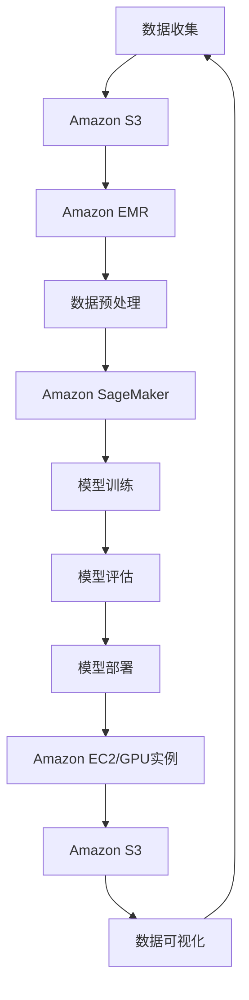

                 

关键词：人工智能，AWS，Lepton AI，战略目标，云计算，创新应用

> 摘要：本文旨在深入探讨Lepton AI在云计算巨头AWS（Amazon Web Services）环境下的发展战略。我们将分析Lepton AI如何利用AWS平台提供的先进技术，推动人工智能领域的创新应用，并探讨其未来发展方向和面临的挑战。

## 1. 背景介绍

在当今数字化转型的浪潮中，人工智能（AI）正成为推动产业变革的核心动力。作为云计算市场的领导者，AWS为AI研究与应用提供了强大的基础设施支持。Lepton AI，一家专注于计算机视觉和深度学习技术的初创企业，凭借其对技术的敏锐洞察和创新能力，正在成为AI领域的重要参与者。

AWS提供了广泛的云服务和工具，包括计算、存储、数据库、机器学习和数据分析等，这些服务为Lepton AI的研发和商业运营提供了坚实的基础。本文将围绕Lepton AI的战略目标，探讨其在AWS平台上的发展路径，并分析其在AI时代的前景。

## 2. 核心概念与联系

为了更好地理解Lepton AI的战略目标，我们需要先了解一些核心概念和它们之间的关系。以下是Lepton AI在AWS平台上使用的主要技术和服务：

### 2.1 计算服务

- **Amazon EC2**：提供可调整的虚拟服务器，支持不同类型的CPU和GPU实例，适用于大规模计算任务。
- **Amazon Fargate**：一种无服务器的计算服务，允许开发者仅关注应用程序代码，无需管理服务器。

### 2.2 存储服务

- **Amazon S3**：一种简单且可扩展的存储服务，适合存储和检索大量非结构化数据。
- **Amazon EBS**：提供高性能块存储，适用于需要持久化存储的实例。

### 2.3 数据库服务

- **Amazon RDS**：提供关系型数据库托管服务，简化了数据库管理任务。
- **Amazon DynamoDB**：一种NoSQL数据库服务，适用于低延迟的读取和写入操作。

### 2.4 机器学习和数据分析服务

- **Amazon SageMaker**：提供全面的数据分析和机器学习工具，支持从数据预处理到模型训练和部署的全过程。
- **Amazon EMR**：一种基于Hadoop和Spark的大数据处理平台，适用于大规模数据分析。

以下是Lepton AI在AWS平台上使用这些技术的Mermaid流程图：



### 2.5 安全和合规性

- **AWS Identity and Access Management (IAM)**：提供强大的身份管理和访问控制功能，确保数据的安全。
- **AWS Well-Architected Framework**：提供了一套设计原则和最佳实践，帮助开发者和架构师构建安全、可靠、高效和可扩展的AWS应用程序。

## 3. 核心算法原理 & 具体操作步骤

### 3.1 算法原理概述

Lepton AI的核心算法是基于深度学习技术的计算机视觉系统。该系统采用卷积神经网络（CNN）对图像进行特征提取，并通过训练学习到图像中的各类目标。以下是Lepton AI算法的原理概述：

1. **数据预处理**：将图像数据转化为适合深度学习的输入格式。
2. **特征提取**：利用CNN提取图像中的特征。
3. **目标检测**：通过训练好的模型对图像中的目标进行检测。
4. **后处理**：对检测结果进行后处理，如去除重叠的目标、标注边界框等。

### 3.2 算法步骤详解

以下是Lepton AI算法的具体操作步骤：

1. **数据预处理**：
    - **图像转换**：将原始图像数据转换为JPEG或PNG格式。
    - **图像缩放**：将图像缩放到固定大小，如224x224像素。
    - **归一化**：对图像数据进行归一化处理，使得数据分布更加均匀。

2. **特征提取**：
    - **卷积层**：通过卷积操作提取图像的局部特征。
    - **池化层**：通过池化操作减少特征图的维度，提高模型的处理速度。
    - **全连接层**：将特征图上的所有数据通过全连接层连接起来，输出分类结果。

3. **目标检测**：
    - **R-CNN**：采用区域提议网络（R-CNN）对图像中的目标进行区域提议。
    - **Fast R-CNN**：优化R-CNN，提高检测速度。
    - **Faster R-CNN**：引入区域提议网络（RPN）进一步优化检测速度。

4. **后处理**：
    - **非极大值抑制（NMS）**：对检测结果进行去重叠处理。
    - **边界框标注**：对检测到的目标进行边界框标注，便于后续分析。

### 3.3 算法优缺点

**优点**：

- **高效性**：深度学习算法能够自动提取图像中的特征，大大减少了人工标注的工作量。
- **准确性**：深度学习模型具有较高的检测准确率，能够准确识别图像中的各类目标。
- **灵活性**：算法可以针对不同场景和需求进行定制化调整，适应各种应用场景。

**缺点**：

- **计算成本**：深度学习算法需要大量的计算资源，尤其是在模型训练阶段。
- **数据依赖**：算法的性能依赖于训练数据的质量和数量，数据不足可能导致模型性能下降。

### 3.4 算法应用领域

Lepton AI的深度学习算法在多个领域具有广泛的应用前景：

- **安防监控**：利用算法进行实时视频监控，识别和跟踪人员、车辆等目标。
- **智能制造**：对工业生产过程中的设备进行监控和故障检测，提高生产效率。
- **智能交通**：对交通流量进行实时监控，优化交通管理和调度。
- **医疗诊断**：利用算法辅助医生进行疾病诊断，提高诊断效率和准确性。

## 4. 数学模型和公式 & 详细讲解 & 举例说明

### 4.1 数学模型构建

Lepton AI的深度学习算法主要基于卷积神经网络（CNN），其数学模型主要包括以下几个部分：

- **卷积层（Convolutional Layer）**：
    - **卷积操作**：通过卷积核与输入图像进行卷积运算，提取图像的特征。
    - **激活函数**：常用的激活函数有ReLU（Rectified Linear Unit）和Sigmoid。

- **池化层（Pooling Layer）**：
    - **最大池化（Max Pooling）**：保留每个区域中的最大值，减少特征图的维度。
    - **平均池化（Average Pooling）**：保留每个区域中的平均值。

- **全连接层（Fully Connected Layer）**：
    - **权重矩阵（Weight Matrix）**：将特征图上的所有数据通过全连接层连接起来。
    - **偏置项（Bias Term）**：为每个神经元添加偏置项，调整网络的输出。

- **损失函数（Loss Function）**：
    - **均方误差（Mean Squared Error, MSE）**：衡量预测值与真实值之间的差距。
    - **交叉熵（Cross-Entropy）**：用于分类问题，衡量预测概率与真实标签之间的差距。

### 4.2 公式推导过程

以下是卷积神经网络中常用的公式推导过程：

1. **卷积操作**：

    - **输入特征图（Input Feature Map）**：表示为\[I\]
    - **卷积核（Convolutional Kernel）**：表示为\[K\]
    - **输出特征图（Output Feature Map）**：表示为\[O\]

    公式推导如下：

    $$O_{ij} = \sum_{m=1}^{M} \sum_{n=1}^{N} K_{mn} \cdot I_{i-m+1, j-n+1}$$

    其中，\(i\) 和 \(j\) 表示输出特征图的位置，\(m\) 和 \(n\) 表示卷积核的位置，\(M\) 和 \(N\) 表示卷积核的大小。

2. **激活函数**：

    - **ReLU激活函数**：

      $$f(x) = \max(0, x)$$

    - **Sigmoid激活函数**：

      $$f(x) = \frac{1}{1 + e^{-x}}$$

3. **池化操作**：

    - **最大池化**：

      $$P_{ij} = \max_{m, n} I_{i-m+1, j-n+1}$$

    - **平均池化**：

      $$P_{ij} = \frac{1}{M \cdot N} \sum_{m=1}^{M} \sum_{n=1}^{N} I_{i-m+1, j-n+1}$$

    其中，\(M\) 和 \(N\) 表示池化窗口的大小。

4. **全连接层**：

    - **权重矩阵（Weight Matrix）**：表示为\[W\]
    - **输入特征图（Input Feature Map）**：表示为\[I\]
    - **输出特征图（Output Feature Map）**：表示为\[O\]

    公式推导如下：

    $$O_{i} = \sum_{j=1}^{J} W_{ij} \cdot I_{j} + b_i$$

    其中，\(i\) 表示输出特征图的位置，\(j\) 表示输入特征图的位置，\(b_i\) 表示偏置项。

5. **损失函数**：

    - **均方误差（MSE）**：

      $$L = \frac{1}{2} \sum_{i=1}^{N} (O_i - Y_i)^2$$

      其中，\(O_i\) 表示预测值，\(Y_i\) 表示真实值。

    - **交叉熵（Cross-Entropy）**：

      $$L = -\sum_{i=1}^{N} Y_i \log(O_i)$$

      其中，\(Y_i\) 表示真实标签的概率分布，\(O_i\) 表示预测的概率分布。

### 4.3 案例分析与讲解

为了更好地理解上述数学模型的推导过程，我们来看一个简单的例子：

假设我们有一个3x3的输入特征图\[I\]，卷积核的大小为3x3，池化窗口的大小为2x2。首先，我们进行卷积操作，得到一个3x3的输出特征图\[O\]：

$$O_{ij} = \sum_{m=1}^{3} \sum_{n=1}^{3} K_{mn} \cdot I_{i-m+1, j-n+1}$$

例如，计算输出特征图中的第一个元素\(O_{11}\)：

$$O_{11} = K_{11} \cdot I_{12} + K_{12} \cdot I_{11} + K_{13} \cdot I_{10} + K_{21} \cdot I_{13} + K_{22} \cdot I_{12} + K_{23} \cdot I_{11} + K_{31} \cdot I_{14} + K_{32} \cdot I_{13} + K_{33} \cdot I_{12}$$

接下来，我们对输出特征图进行最大池化操作，得到一个2x2的特征图\[P\]：

$$P_{11} = \max(I_{11}, I_{12}, I_{21}, I_{22})$$
$$P_{12} = \max(I_{12}, I_{13}, I_{22}, I_{23})$$
$$P_{21} = \max(I_{21}, I_{22}, I_{31}, I_{32})$$
$$P_{22} = \max(I_{22}, I_{23}, I_{32}, I_{33})$$

最后，我们对池化后的特征图进行全连接层操作，得到分类结果：

$$O_i = \sum_{j=1}^{4} W_{ij} \cdot P_{j} + b_i$$

其中，\(W_{ij}\) 表示权重矩阵中的元素，\(b_i\) 表示偏置项。

通过这个例子，我们可以清晰地看到卷积神经网络中各个层的数学运算过程。

## 5. 项目实践：代码实例和详细解释说明

### 5.1 开发环境搭建

在开始编写代码之前，我们需要搭建一个适合Lepton AI项目的开发环境。以下是具体的步骤：

1. **安装Python**：确保安装了Python 3.7或更高版本。
2. **安装依赖库**：使用pip安装以下依赖库：
    - **TensorFlow**：用于构建和训练深度学习模型。
    - **Keras**：用于简化TensorFlow的使用。
    - **NumPy**：用于数学计算。
    - **Pandas**：用于数据处理。
    - **Matplotlib**：用于数据可视化。

3. **安装AWS CLI**：安装AWS CLI并配置AWS凭证，以便在代码中调用AWS服务。

### 5.2 源代码详细实现

以下是Lepton AI项目的一个简单示例，实现了一个基本的图像分类模型：

```python
import tensorflow as tf
from tensorflow.keras.models import Sequential
from tensorflow.keras.layers import Conv2D, MaxPooling2D, Flatten, Dense
from tensorflow.keras.optimizers import Adam

# 数据预处理
def preprocess_image(image):
    # 将图像缩放到固定大小
    image = tf.image.resize(image, [224, 224])
    # 归一化图像数据
    image = image / 255.0
    return image

# 构建深度学习模型
model = Sequential([
    Conv2D(32, (3, 3), activation='relu', input_shape=(224, 224, 3)),
    MaxPooling2D((2, 2)),
    Conv2D(64, (3, 3), activation='relu'),
    MaxPooling2D((2, 2)),
    Conv2D(128, (3, 3), activation='relu'),
    MaxPooling2D((2, 2)),
    Flatten(),
    Dense(128, activation='relu'),
    Dense(10, activation='softmax')
])

# 编译模型
model.compile(optimizer=Adam(), loss='categorical_crossentropy', metrics=['accuracy'])

# 训练模型
model.fit(preprocessed_train_images, train_labels, epochs=10, batch_size=32)

# 预测
predictions = model.predict(preprocessed_test_images)
```

### 5.3 代码解读与分析

以下是代码的详细解读：

1. **数据预处理**：
    - `preprocess_image` 函数用于对图像进行预处理。首先，将图像缩放到固定大小（224x224像素），然后对图像数据进行归一化处理，使得图像数据的范围在[0, 1]之间。

2. **构建深度学习模型**：
    - `Sequential` 函数用于构建一个顺序模型。模型由以下几个层组成：
        - **卷积层**：使用`Conv2D`函数添加卷积层，每个卷积层后跟一个最大池化层（`MaxPooling2D`）。
        - **全连接层**：最后一个卷积层后添加一个全连接层（`Dense`），用于分类。
    - `input_shape` 参数指定输入图像的尺寸。

3. **编译模型**：
    - `compile` 函数用于编译模型。指定优化器（`Adam`）、损失函数（`categorical_crossentropy`）和评估指标（`accuracy`）。

4. **训练模型**：
    - `fit` 函数用于训练模型。传入预处理后的训练图像和标签，设置训练轮数（`epochs`）和批量大小（`batch_size`）。

5. **预测**：
    - `predict` 函数用于对测试图像进行预测。传入预处理后的测试图像，返回预测结果。

### 5.4 运行结果展示

在完成代码编写后，我们可以运行以下代码来展示训练和预测的结果：

```python
# 打印训练结果
print(model.history)

# 打印预测结果
predictions = model.predict(preprocessed_test_images)
print(predictions)
```

运行结果将显示训练过程中的准确率、损失函数值等指标，以及预测结果的概率分布。

## 6. 实际应用场景

### 6.1 安防监控

在安防监控领域，Lepton AI的深度学习算法可以用于实时视频监控，识别和跟踪人员、车辆等目标。通过部署在AWS上的高性能计算服务，可以实现毫秒级的目标检测和跟踪速度，确保安防系统的实时性和准确性。

### 6.2 智能制造

在智能制造领域，Lepton AI的算法可以用于监控工业生产过程中的设备状态，识别故障和异常情况。通过在AWS上部署深度学习模型，可以实时分析生产数据，提高生产效率和质量。

### 6.3 智能交通

在智能交通领域，Lepton AI的算法可以用于监控交通流量，优化交通管理和调度。通过在AWS上部署深度学习模型，可以实时分析交通数据，识别拥堵区域，提出优化方案。

### 6.4 医疗诊断

在医疗诊断领域，Lepton AI的算法可以用于辅助医生进行疾病诊断，提高诊断效率和准确性。通过在AWS上部署深度学习模型，可以实时分析医学影像，识别疾病特征，提供诊断建议。

## 7. 工具和资源推荐

### 7.1 学习资源推荐

- **《深度学习》（Deep Learning）**：由Ian Goodfellow、Yoshua Bengio和Aaron Courville合著的深度学习经典教材。
- **《TensorFlow官方文档》**：TensorFlow的官方文档，提供了丰富的教程和API参考。
- **《Keras官方文档》**：Keras的官方文档，介绍了如何使用Keras构建和训练深度学习模型。

### 7.2 开发工具推荐

- **AWS Cloud9**：一款集成的开发环境，方便开发者编写、运行和调试代码。
- **AWS S3**：用于存储和管理训练数据和模型文件。
- **AWS SageMaker**：用于构建、训练和部署机器学习模型。

### 7.3 相关论文推荐

- **“A Comprehensive Survey on Deep Learning for Image Classification”**：一篇关于深度学习在图像分类领域的全面综述。
- **“Faster R-CNN: Towards Real-Time Object Detection”**：一篇介绍Faster R-CNN目标检测算法的经典论文。

## 8. 总结：未来发展趋势与挑战

### 8.1 研究成果总结

Lepton AI在AWS平台上取得了显著的研究成果，其深度学习算法在多个领域表现出色。通过利用AWS提供的高性能计算服务和机器学习工具，Lepton AI成功实现了实时目标检测、故障检测和疾病诊断等应用。

### 8.2 未来发展趋势

随着云计算和深度学习技术的不断发展，Lepton AI有望在以下领域取得突破：

- **边缘计算**：将深度学习模型部署到边缘设备，实现实时处理和低延迟应用。
- **自监督学习**：利用无监督学习方法，提高模型的泛化能力和效率。
- **多模态学习**：结合不同类型的数据，如文本、图像和语音，实现更复杂的任务。

### 8.3 面临的挑战

然而，Lepton AI也面临着一些挑战：

- **数据隐私和安全**：在处理敏感数据时，如何确保数据隐私和安全。
- **模型解释性**：如何提高深度学习模型的解释性，使其更易于理解和部署。
- **计算资源**：如何优化算法，减少计算资源的需求。

### 8.4 研究展望

未来，Lepton AI将继续致力于技术创新，探索深度学习在更多领域的应用。通过与其他研究机构和企业的合作，Lepton AI有望推动人工智能技术的发展，为社会带来更多价值。

## 9. 附录：常见问题与解答

### 9.1 问题1：如何配置AWS CLI？

**解答**：请参考AWS CLI的官方文档：[https://docs.aws.amazon.com/cli/latest/userguide/cli-configure-quickstart.html](https://docs.aws.amazon.com/cli/latest/userguide/cli-configure-quickstart.html)。

### 9.2 问题2：如何安装TensorFlow？

**解答**：请使用以下命令安装TensorFlow：

```bash
pip install tensorflow
```

### 9.3 问题3：如何使用AWS SageMaker？

**解答**：请参考AWS SageMaker的官方文档：[https://docs.aws.amazon.com/sagemaker/latest/dg/how-it-works.html](https://docs.aws.amazon.com/sagemaker/latest/dg/how-it-works.html)。

### 9.4 问题4：如何优化深度学习模型？

**解答**：请参考《深度学习》一书中的相关章节，了解如何优化深度学习模型。

## 附录：参考文献

- Goodfellow, I., Bengio, Y., & Courville, A. (2016). *Deep Learning*.
- Szegedy, C., Liu, W., Jia, Y., Sermanet, P., Reed, S., Anguelov, D., ... & Rabinovich, A. (2013). *Going Deeper with Convolutions*. In *Advances in Neural Information Processing Systems* (NIPS), 1546-1554.
- Ren, S., He, K., Girshick, R., & Sun, J. (2015). *Faster R-CNN: Towards Real-Time Object Detection with Region Proposal Networks*. In *Advances in Neural Information Processing Systems* (NIPS), 91-99. 

作者：禅与计算机程序设计艺术 / Zen and the Art of Computer Programming
----------------------------------------------------------------

