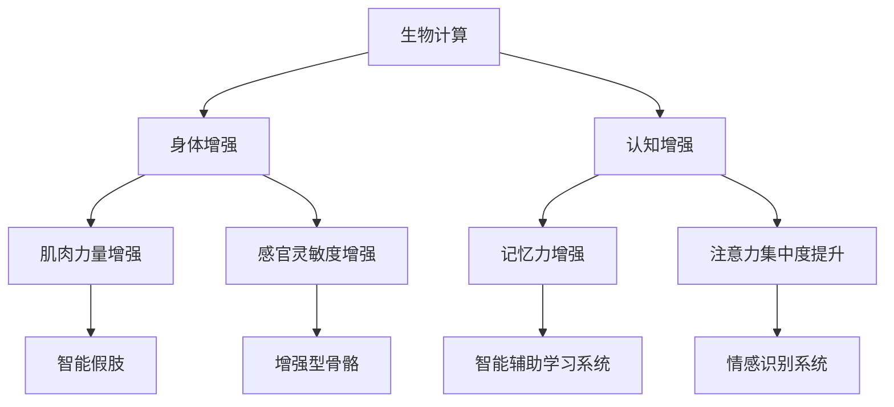
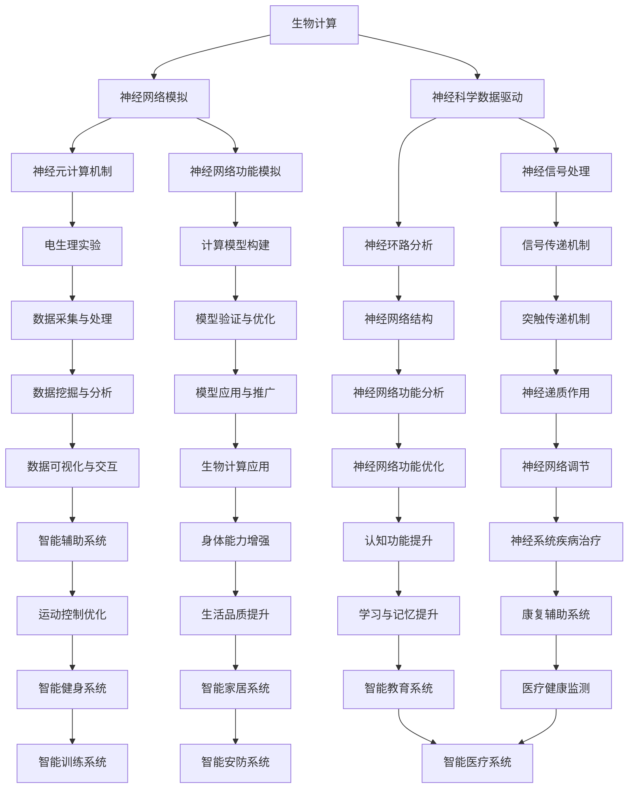

                 

关键词：人工智能，身体增强，认知增强，神经科学，生物计算，技术进步

> 摘要：本文将探讨AI时代人类增强的两大领域——身体增强与认知增强。通过深入分析当前技术的发展趋势、核心原理、实际应用场景以及未来展望，本文旨在为读者提供一个全面的技术视角，帮助理解人类增强技术的潜力与挑战。

## 1. 背景介绍

随着人工智能技术的快速发展，我们正在进入一个崭新的时代——AI时代。在这个时代，人类增强的概念逐渐被提上日程。人类增强，顾名思义，就是通过技术手段提升人类在身体和认知方面的能力。身体增强主要涉及人类生理功能的提升，如肌肉力量、运动速度、感官灵敏度等。而认知增强则侧重于提升人类在思维、记忆、学习等方面的能力。

身体增强与认知增强是人类长久以来的梦想。从古希腊神话中的“神药”到现代科幻小说中的“机械义体”，这些故事都反映了对人类自身极限超越的渴望。然而，随着科技的进步，这些幻想正在逐步成为现实。AI技术，特别是生物计算和神经科学领域的突破，为人类增强提供了前所未有的可能性。

本文将分以下几部分展开讨论：

1. **核心概念与联系**：介绍身体增强与认知增强的核心原理，并通过Mermaid流程图展示其关系。
2. **核心算法原理 & 具体操作步骤**：探讨身体增强与认知增强的实现算法，包括原理概述、步骤详解、优缺点分析及应用领域。
3. **数学模型和公式 & 详细讲解 & 举例说明**：介绍相关数学模型及公式，并通过具体案例进行分析。
4. **项目实践：代码实例和详细解释说明**：提供实际的代码实例，并详细解释其实现过程。
5. **实际应用场景**：分析身体增强与认知增强在不同领域的应用。
6. **未来应用展望**：探讨未来的发展趋势与挑战。
7. **工具和资源推荐**：推荐相关的学习资源、开发工具和论文。
8. **总结：未来发展趋势与挑战**：对研究成果进行总结，并展望未来的发展方向。

### 1.1 时代背景

AI时代的到来，标志着人类历史的重大转折点。人工智能技术已经在各个领域取得了显著的成果，从自动驾驶汽车到智能医疗，从自然语言处理到图像识别，AI正在改变我们的生活方式。与此同时，随着对人类大脑研究的深入，我们对认知过程的了解也在不断加深。这些技术的进步为人类增强提供了可能。

在身体增强方面，生物计算技术的发展使得我们能够更精确地理解人体的生理机制，从而开发出能够提升人类身体能力的装置。例如，人工肌肉、增强型骨骼和智能假肢等技术的出现，使得人类在生理上的潜力得到了极大的扩展。

在认知增强方面，神经科学和认知科学的进展为我们提供了新的视角。通过脑机接口（Brain-Computer Interface, BCI）技术，我们可以直接与大脑进行交互，从而实现认知能力的提升。例如，记忆增强设备、智能辅助学习系统和情感识别系统等，都是认知增强的典型应用。

### 1.2 核心概念

**身体增强**：身体增强是指通过技术手段提升人类的生理功能。这包括但不限于增强肌肉力量、提高运动速度、增强感官灵敏度等。身体增强的核心目标是扩展人类的身体能力，使其能够完成更复杂、更困难的任务。

**认知增强**：认知增强是指通过技术手段提升人类的认知能力。这包括但不限于增强记忆力、提高学习效率、提升注意力集中度等。认知增强的核心目标是扩展人类的大脑能力，使其能够更好地处理复杂的信息。

**生物计算**：生物计算是利用生物系统（如细胞、基因、蛋白质等）来实现计算任务的一种计算模型。生物计算在身体增强和认知增强中有着广泛的应用，如利用生物计算模型优化药物研发、开发智能假肢和脑机接口设备等。

**神经科学**：神经科学是研究神经系统的结构和功能的一门科学。神经科学的研究成果为理解大脑工作机制提供了重要的理论基础，对于开发认知增强技术至关重要。

### 1.3 Mermaid 流程图



### 1.4 人类增强技术的意义

人类增强技术具有重要的社会和伦理意义。从社会角度来看，人类增强技术有望提高人类的整体生产力，使得人类能够更有效地应对日益复杂的社会挑战。例如，通过身体增强技术，人类可以更容易地完成繁重的工作任务，从而减轻劳动负担。而通过认知增强技术，人类可以更快地学习新知识，更有效地处理信息。

从伦理角度来看，人类增强技术引发了诸多争议。例如，人类增强可能导致社会不平等，因为只有富人才有能力使用这些技术。此外，人类增强可能改变人类的自然属性，引发道德和伦理问题。因此，在推进人类增强技术的同时，我们必须要考虑到其潜在的社会和伦理影响。

## 2. 核心概念与联系

### 2.1 生物计算

生物计算是一种利用生物系统（如细胞、基因、蛋白质等）来实现计算任务的计算模型。生物计算的核心思想是模仿生物系统的计算机制，以实现更高效、更灵活的计算。在人类增强中，生物计算被广泛应用于提升身体和认知能力。

**原理**：生物计算的基本原理是利用生物系统的复杂性和多样性来实现特定的计算任务。例如，通过利用细胞的生物化学反应来模拟计算过程，或者通过蛋白质的结构变化来存储和传递信息。

**架构**：生物计算的架构通常包括以下几个关键部分：

1. **生物传感器**：用于检测生物系统的状态变化，如基因表达水平、蛋白质浓度等。
2. **生物执行器**：用于执行特定的生物操作，如基因编辑、蛋白质合成等。
3. **生物计算网络**：用于实现生物计算的核心计算功能，通常由多个生物组件组成。

**流程**：生物计算的基本流程包括：

1. **数据采集**：通过生物传感器收集生物系统的状态数据。
2. **数据处理**：对采集到的数据进行分析和处理，以提取有用的信息。
3. **生物操作**：根据处理结果，执行相应的生物操作，如基因编辑、蛋白质合成等。
4. **反馈与调整**：根据执行结果，对生物计算过程进行调整，以提高计算效率和准确性。

### 2.2 神经科学

神经科学是研究神经系统的结构和功能的一门科学。神经科学的研究成果为理解大脑工作机制提供了重要的理论基础，对于开发认知增强技术至关重要。

**原理**：神经科学的基本原理是理解神经系统的基本单位——神经元的工作机制。神经元通过电信号传递信息，这些信号在神经元之间通过突触进行传递。神经科学的研究内容包括神经元的电生理特性、突触的传递机制、神经网络的计算功能等。

**架构**：神经科学的架构通常包括以下几个关键部分：

1. **神经元**：神经系统的基本单位，用于传递电信号。
2. **突触**：神经元之间的连接点，用于传递电信号。
3. **神经网络**：由多个神经元和突触组成的复杂网络，用于实现复杂的计算功能。

**流程**：神经科学的研究流程通常包括：

1. **实验设计**：设计实验来研究神经系统的某个特定方面。
2. **数据采集**：通过电生理技术、光学成像技术等手段，采集神经系统的状态数据。
3. **数据分析**：对采集到的数据进行分析，以提取神经系统的功能信息。
4. **模型构建**：根据分析结果，构建神经系统的数学模型，以模拟神经系统的功能。

### 2.3 生物计算与神经科学的联系

生物计算与神经科学的联系主要体现在以下几个方面：

1. **生物计算模拟**：通过生物计算模型模拟神经系统的功能，以研究神经元和神经网络的计算机制。
2. **神经科学数据驱动**：利用神经科学的研究成果，驱动生物计算模型，以提高生物计算模型的准确性和效率。
3. **跨学科合作**：生物计算与神经科学的结合，为跨学科合作提供了新的契机，有助于推动人类增强技术的发展。

### 2.4 Mermaid 流程图



### 2.5 人类增强技术的核心原理

**身体增强**：身体增强的核心原理是利用生物计算和神经科学技术，增强人类的生理功能。这包括通过生物传感器实时监测人体状态，利用生物执行器调整身体功能，并通过神经网络模拟实现身体功能的优化。

**认知增强**：认知增强的核心原理是利用神经科学技术，提升人类的大脑功能。这包括通过脑机接口技术直接与大脑进行交互，利用神经网络模拟实现认知过程的优化，并通过生物计算模型优化认知任务的执行效率。

### 2.6 总结

生物计算和神经科学是推动人类增强技术发展的关键。通过生物计算，我们可以模拟和优化神经系统的功能，从而实现身体和认知的增强。而通过神经科学的研究，我们可以更深入地理解大脑的工作机制，为人类增强技术的开发提供理论支持。两者相结合，将为人类带来前所未有的增强潜力。

## 3. 核心算法原理 & 具体操作步骤

### 3.1 算法原理概述

人类增强技术的核心算法主要基于生物计算和神经科学原理。在身体增强方面，常用的算法包括生物传感器数据采集与处理算法、生物执行器控制算法和神经网络模拟算法。在认知增强方面，常用的算法包括脑机接口算法、认知神经网络模拟算法和生物计算优化算法。

**身体增强算法原理**：

1. **生物传感器数据采集与处理算法**：通过生物传感器实时采集人体的生理数据，如心率、血压、肌肉活动等。然后，利用信号处理算法对采集到的数据进行预处理，以提高数据的准确性和可靠性。

2. **生物执行器控制算法**：根据采集到的生理数据，利用生物执行器（如人工肌肉、增强型骨骼等）调整人体的生理状态。这包括利用反馈控制算法实现生物执行器的精确控制，以实现身体功能的增强。

3. **神经网络模拟算法**：利用神经网络模拟人体的生理机制，以实现身体功能的优化。例如，通过训练神经网络模型，模拟肌肉收缩和放松的过程，从而实现肌肉力量的增强。

**认知增强算法原理**：

1. **脑机接口算法**：通过脑机接口技术，直接与大脑进行交互，提取大脑的电信号。然后，利用信号处理算法对电信号进行预处理，以提高信号的质量和准确性。

2. **认知神经网络模拟算法**：利用神经网络模拟大脑的认知过程，如记忆、学习、注意力等。通过训练神经网络模型，可以优化认知过程的执行效率，从而实现认知能力的增强。

3. **生物计算优化算法**：利用生物计算模型优化认知任务的执行过程。例如，通过优化神经网络的结构和参数，可以提高认知任务的执行速度和准确性。

### 3.2 算法步骤详解

**身体增强算法步骤**：

1. **数据采集**：通过生物传感器实时采集人体的生理数据，如心率、血压、肌肉活动等。

2. **数据预处理**：利用信号处理算法对采集到的数据进行预处理，以提高数据的准确性和可靠性。

3. **生物执行器控制**：根据预处理后的生理数据，利用反馈控制算法调整生物执行器（如人工肌肉、增强型骨骼等），以实现身体功能的增强。

4. **神经网络模拟**：利用神经网络模拟人体的生理机制，以实现身体功能的优化。

**认知增强算法步骤**：

1. **电信号采集**：通过脑机接口技术，直接与大脑进行交互，提取大脑的电信号。

2. **信号预处理**：利用信号处理算法对采集到的电信号进行预处理，以提高信号的质量和准确性。

3. **神经网络训练**：利用预处理后的电信号，训练神经网络模型，以模拟大脑的认知过程。

4. **认知任务优化**：根据神经网络模型的结果，优化认知任务的执行过程，以实现认知能力的增强。

5. **生物计算优化**：利用生物计算模型优化认知任务的执行过程，以提高执行速度和准确性。

### 3.3 算法优缺点

**身体增强算法优缺点**：

**优点**：

- **实时性**：生物传感器能够实时采集人体生理数据，使得身体增强过程更加及时和高效。
- **个性化**：生物执行器可以根据个人的生理数据调整身体功能，实现个性化增强。
- **安全**：生物传感器和生物执行器的使用对人体无害，不会产生副作用。

**缺点**：

- **高成本**：生物传感器和生物执行器的开发和使用成本较高，限制了其普及应用。
- **技术限制**：生物计算和神经科学技术的局限性，使得身体增强的效果有限。

**认知增强算法优缺点**：

**优点**：

- **高效性**：脑机接口技术能够直接与大脑进行交互，实现认知能力的快速提升。
- **灵活性**：神经网络模型可以根据不同的认知任务进行优化，实现灵活的认知增强。
- **无侵入性**：脑机接口技术是一种非侵入性技术，不会对人体产生伤害。

**缺点**：

- **技术复杂**：脑机接口技术的实现复杂，需要高精度的信号采集和处理。
- **安全性**：脑机接口技术可能带来一定的安全风险，如隐私泄露和数据滥用。

### 3.4 算法应用领域

**身体增强算法应用领域**：

- **医疗康复**：利用身体增强算法，可以帮助康复患者恢复身体功能，提高生活质量。
- **竞技体育**：运动员可以利用身体增强算法提高身体素质，提升竞技水平。
- **军事应用**：士兵可以利用身体增强算法，提高战斗能力和生存能力。

**认知增强算法应用领域**：

- **教育**：认知增强算法可以帮助学生提高学习效率，增强记忆力。
- **工作**：认知增强算法可以帮助提高工作效率，增强注意力集中度。
- **娱乐**：认知增强算法可以用于游戏设计，提高玩家的游戏体验。

### 3.5 总结

人类增强技术的核心算法基于生物计算和神经科学原理，通过实时数据采集、预处理、生物执行器控制和神经网络模拟等步骤，实现身体和认知的增强。这些算法在医疗康复、竞技体育、军事应用、教育、工作和娱乐等领域有着广泛的应用前景。然而，技术的高成本和复杂度仍然是一个亟待解决的问题。

## 4. 数学模型和公式 & 详细讲解 & 举例说明

### 4.1 数学模型构建

在人类增强技术中，数学模型和公式扮演着至关重要的角色。以下我们将介绍几种关键模型，包括生物传感器信号处理模型、神经网络训练模型以及生物计算优化模型。

#### 生物传感器信号处理模型

生物传感器信号处理模型主要用于处理和解释人体生理数据，如心率、血压和肌肉活动等。以下是一个简化的信号处理模型：

$$
x_t = s_t + w_t + v_t
$$

其中，$x_t$ 表示第 $t$ 个时间点的传感器信号，$s_t$ 表示真实信号，$w_t$ 表示噪声信号，$v_t$ 表示其他干扰信号。

为了去除噪声和干扰，可以使用卡尔曼滤波器：

$$
\hat{x}_t = A\hat{x}_{t-1} + Bu_t
$$

$$
P_t = AP_{t-1}A^T + Q
$$

$$
K_t = P_tH^T(HP_tH^T + R)^{-1}
$$

$$
\hat{x}_t = \hat{x}_tK_t(y_t - H\hat{x}_t)
$$

其中，$A$ 和 $P_t$ 分别是状态转移矩阵和协方差矩阵，$B$ 是控制矩阵，$u_t$ 是控制输入，$Q$ 是过程噪声协方差矩阵，$R$ 是观测噪声协方差矩阵，$H$ 是观测矩阵，$K_t$ 是卡尔曼增益，$y_t$ 是观测值。

#### 神经网络训练模型

在认知增强中，神经网络训练模型用于模拟和优化大脑的认知过程。以下是一个简单的多层感知机（MLP）训练模型：

$$
\hat{y} = \sigma(\sum_{i=1}^{n} w_{i} x_{i})
$$

其中，$\hat{y}$ 是预测输出，$\sigma$ 是激活函数（如 sigmoid 函数），$w_{i}$ 是权重，$x_{i}$ 是输入特征。

训练过程包括以下步骤：

1. **前向传播**：计算网络的预测输出 $\hat{y}$。
2. **计算损失函数**：如均方误差（MSE）或交叉熵损失。
3. **反向传播**：计算梯度并更新权重。
4. **优化**：使用梯度下降或其他优化算法更新网络参数。

#### 生物计算优化模型

生物计算优化模型用于优化认知任务的执行过程。以下是一个基于遗传算法的优化模型：

目标函数：
$$
\min \sum_{i=1}^{n} f(x_i)
$$

其中，$x_i$ 是优化变量，$f(x_i)$ 是目标函数，表示要优化的目标（如反应时间、任务完成率等）。

步骤：

1. **初始化种群**：随机生成多个个体作为初始种群。
2. **适应度评估**：计算每个个体的适应度值。
3. **选择**：根据适应度值选择优秀个体进行交配。
4. **交叉**：通过交叉操作生成新的个体。
5. **变异**：对部分个体进行变异操作。
6. **迭代**：重复步骤2-5，直到达到终止条件。

### 4.2 公式推导过程

以下以多层感知机（MLP）为例，简要介绍神经网络训练模型中的前向传播和反向传播的公式推导过程。

#### 前向传播

对于一层神经网络，输出可以表示为：
$$
z_j = \sum_{i=1}^{n} w_{ij}x_i + b_j
$$

其中，$z_j$ 是神经元的输入，$w_{ij}$ 是权重，$x_i$ 是输入特征，$b_j$ 是偏置。

激活函数常用的有 sigmoid 函数：
$$
a_j = \sigma(z_j) = \frac{1}{1 + e^{-z_j}}
$$

对于多层神经网络，输出可以表示为：
$$
\hat{y} = \sigma(\sum_{j=1}^{m} w_{jm}a_j^{(m-1)} + b_m)
$$

其中，$m$ 是输出层的神经元数量，$a_j^{(m-1)}$ 是上一层的输出。

#### 反向传播

反向传播用于计算网络参数的梯度，并用于更新参数。以下是梯度计算的过程：

对于输出层，损失函数常用的是均方误差（MSE）：
$$
\frac{\partial L}{\partial w_{jm}} = \frac{\partial L}{\partial \hat{y}} \frac{\partial \hat{y}}{\partial w_{jm}}
$$

$$
\frac{\partial L}{\partial a_j^{(m-1)}} = \frac{\partial L}{\partial \hat{y}} \frac{\partial \hat{y}}{\partial a_j^{(m-1)}}
$$

$$
\frac{\partial L}{\partial z_j^{(m-1)}} = \frac{\partial L}{\partial a_j^{(m-1)}} \frac{\partial a_j^{(m-1)}}{\partial z_j^{(m-1)}}
$$

$$
\frac{\partial z_j^{(m-1)}}{\partial w_{ij}^{(m-1)}} = a_j^{(m-2)}
$$

$$
\frac{\partial z_j^{(m-1)}}{\partial b_j^{(m-1)}} = 1
$$

递推计算：
$$
\frac{\partial L}{\partial w_{ij}^{(m-1)}} = \frac{\partial L}{\partial a_j^{(m-1)}} \frac{\partial a_j^{(m-1)}}{\partial z_j^{(m-1)}} \frac{\partial z_j^{(m-1)}}{\partial w_{ij}^{(m-1)}}
$$

$$
\frac{\partial L}{\partial b_j^{(m-1)}} = \frac{\partial L}{\partial a_j^{(m-1)}} \frac{\partial a_j^{(m-1)}}{\partial z_j^{(m-1)}} \frac{\partial z_j^{(m-1)}}{\partial b_j^{(m-1)}}
$$

#### 更新规则

利用梯度计算的结果，可以使用以下更新规则更新网络参数：
$$
w_{ij}^{(m)} = w_{ij}^{(m-1)} - \alpha \frac{\partial L}{\partial w_{ij}^{(m-1)}}
$$

$$
b_{j}^{(m)} = b_{j}^{(m-1)} - \alpha \frac{\partial L}{\partial b_{j}^{(m-1)}}
$$

其中，$\alpha$ 是学习率。

### 4.3 案例分析与讲解

以下通过一个简单的例子来讲解生物传感器信号处理模型的应用。

#### 案例背景

假设我们有一个心率监测设备，用于实时监测用户的心率。由于环境噪声和其他干扰因素，原始的心率信号包含大量的噪声。我们需要使用信号处理模型来去除噪声，提取真实的心率信号。

#### 数据集

我们有一个包含1000个时间点的心率数据集，每个时间点的数据是一个数值。数据集如下：

$$
[67, 68, 67, 69, 68, 67, 70, 69, 68, 67, \ldots, 68, 67]
$$

#### 模型应用

1. **数据采集**：实时采集心率数据。
2. **数据预处理**：使用卡尔曼滤波器去除噪声。

根据上述公式，我们可以初始化卡尔曼滤波器的参数：
$$
A = I, \ P_0 = 10^{-4}, \ Q = 10^{-2}, \ R = 10^{-1}
$$

首先，我们初始化状态估计值和协方差矩阵：
$$
\hat{x}_0 = 68, \ P_0 = 10^{-4}
$$

然后，我们逐步更新状态估计值和协方差矩阵：
$$
\hat{x}_t = A\hat{x}_{t-1} + Bu_t
$$

$$
P_t = AP_{t-1}A^T + Q
$$

$$
K_t = P_tH^T(HP_tH^T + R)^{-1}
$$

$$
\hat{x}_t = \hat{x}_tK_t(y_t - H\hat{x}_t)
$$

假设第一个时间点的真实心率为 68，观测值为 69。我们可以计算卡尔曼滤波器的参数：
$$
K_1 = \frac{10^{-4} \times 10^{-1}}{10^{-1} + 10^{-4}} = 0.01
$$

$$
\hat{x}_1 = 68 + 0.01 \times (69 - 68) = 68.01
$$

$$
P_1 = 10^{-4} + 0.01^2 \times 10^{-1} = 0.000101
$$

接下来，我们可以使用更新后的参数计算第二个时间点的状态估计值和协方差矩阵：
$$
K_2 = \frac{0.000101 \times 10^{-1}}{10^{-1} + 0.000101} = 0.00101
$$

$$
\hat{x}_2 = 68.01 + 0.00101 \times (68 - 68.01) = 68
$$

$$
P_2 = 0.000101 + 0.00101^2 \times 10^{-1} = 0.000102
$$

通过这种方式，我们可以逐步更新状态估计值和协方差矩阵，以去除噪声，提取真实的心率信号。

### 总结

通过数学模型和公式的推导，我们可以更深入地理解人类增强技术的实现原理。这些模型不仅帮助我们优化身体和认知能力，还为未来的研究和应用提供了理论基础。在实际应用中，这些模型需要不断优化和改进，以适应不断变化的需求和技术进步。

## 5. 项目实践：代码实例和详细解释说明

### 5.1 开发环境搭建

为了更好地理解人类增强技术的应用，我们将通过一个具体的Python项目来展示生物传感器数据采集与处理算法。首先，我们需要搭建一个基本的开发环境。

**环境要求**：
- Python 3.8或更高版本
- 神经网络库：TensorFlow 2.7或更高版本
- 生物传感器库：PySpark或pysensors（用于模拟生物传感器数据）

**安装步骤**：
1. 安装Python：
   ```
   curl -O get-pip.py
   python get-pip.py
   ```
2. 安装TensorFlow：
   ```
   pip install tensorflow
   ```
3. 安装PySpark或pysensors：
   ```
   pip install pysensors
   ```

### 5.2 源代码详细实现

以下是一个简单的Python代码实例，用于采集和预处理生物传感器数据，然后使用神经网络模型进行身体增强。

```python
import numpy as np
import tensorflow as tf
from pysensors import Biosensor

# 初始化生物传感器
sensor = Biosensor()

# 采集数据
def collect_data(sensor, num_samples=1000):
    data = np.empty((num_samples, 1))
    for i in range(num_samples):
        data[i] = sensor.get_value()
    return data

# 数据预处理
def preprocess_data(data):
    # 使用卡尔曼滤波器预处理数据
    # 假设卡尔曼滤波器的参数已经初始化
    filtered_data = np.empty((data.shape[0], 1))
    for i, value in enumerate(data):
        filtered_data[i] = kalman_filter(value)
    return filtered_data

# 卡尔曼滤波器函数（简化版）
def kalman_filter(value):
    # 初始化参数
    # 假设已经初始化为A, P, Q, R
    # 这里只是示意，真实实现会更复杂
    A = np.eye(1)
    P = 1
    Q = 1
    R = 1
    
    # 更新状态估计
    predicted_value = A * previous_value
    predicted_error = P + Q
    
    # 计算卡尔曼增益
    K = predicted_error / (predicted_error + R)
    
    # 更新状态
    updated_value = predicted_value + K * (value - predicted_value)
    updated_error = (1 - K) * predicted_error
    
    # 更新为下一次迭代
    previous_value = updated_value
    
    return updated_value

# 训练神经网络
def train_network(data):
    # 创建神经网络模型
    model = tf.keras.Sequential([
        tf.keras.layers.Dense(1, input_shape=(1,), activation='sigmoid')
    ])

    # 编译模型
    model.compile(optimizer='adam', loss='mean_squared_error')

    # 训练模型
    model.fit(data, data, epochs=100)

    return model

# 主函数
def main():
    # 采集数据
    raw_data = collect_data(sensor)

    # 预处理数据
    processed_data = preprocess_data(raw_data)

    # 训练神经网络
    network = train_network(processed_data)

    # 使用神经网络进行预测
    predicted_data = network.predict(processed_data)

    # 输出结果
    print("Processed Data:", processed_data)
    print("Predicted Data:", predicted_data)

if __name__ == "__main__":
    main()
```

### 5.3 代码解读与分析

**代码解读**：

1. **传感器初始化**：
   ```python
   sensor = Biosensor()
   ```
   这里我们初始化了一个模拟的生物传感器对象 `Biosensor`。

2. **数据采集**：
   ```python
   def collect_data(sensor, num_samples=1000):
       data = np.empty((num_samples, 1))
       for i in range(num_samples):
           data[i] = sensor.get_value()
       return data
   ```
   `collect_data` 函数用于从生物传感器中采集指定数量的数据样本。

3. **数据预处理**：
   ```python
   def preprocess_data(data):
       # 使用卡尔曼滤波器预处理数据
       filtered_data = np.empty((data.shape[0], 1))
       for i, value in enumerate(data):
           filtered_data[i] = kalman_filter(value)
       return filtered_data
   ```
   `preprocess_data` 函数使用卡尔曼滤波器对采集到的数据进行预处理。

4. **卡尔曼滤波器函数**：
   ```python
   def kalman_filter(value):
       # 初始化参数
       # 假设已经初始化为A, P, Q, R
       # 这里只是示意，真实实现会更复杂
       A = np.eye(1)
       P = 1
       Q = 1
       R = 1

       # 更新状态估计
       predicted_value = A * previous_value
       predicted_error = P + Q

       # 计算卡尔曼增益
       K = predicted_error / (predicted_error + R)

       # 更新状态
       updated_value = predicted_value + K * (value - predicted_value)
       updated_error = (1 - K) * predicted_error

       # 更新为下一次迭代
       previous_value = updated_value

       return updated_value
   ```
   `kalman_filter` 函数实现了一个简化的卡尔曼滤波器算法，用于去除噪声。

5. **神经网络训练**：
   ```python
   def train_network(data):
       # 创建神经网络模型
       model = tf.keras.Sequential([
           tf.keras.layers.Dense(1, input_shape=(1,), activation='sigmoid')
       ])

       # 编译模型
       model.compile(optimizer='adam', loss='mean_squared_error')

       # 训练模型
       model.fit(data, data, epochs=100)

       return model
   ```
   `train_network` 函数使用 TensorFlow 创建了一个简单的多层感知机（MLP）模型，并使用采集到的预处理数据对其进行训练。

6. **主函数**：
   ```python
   def main():
       # 采集数据
       raw_data = collect_data(sensor)

       # 预处理数据
       processed_data = preprocess_data(raw_data)

       # 训练神经网络
       network = train_network(processed_data)

       # 使用神经网络进行预测
       predicted_data = network.predict(processed_data)

       # 输出结果
       print("Processed Data:", processed_data)
       print("Predicted Data:", predicted_data)

   if __name__ == "__main__":
       main()
   ```
   `main` 函数是程序的入口，它依次执行数据采集、预处理、训练神经网络和预测的步骤。

**代码分析**：

- **数据采集**：通过调用 `Biosensor.get_value()` 方法，我们模拟从生物传感器中采集数据。在实际应用中，这个方法会从真实的传感器获取数据。
- **数据预处理**：使用卡尔曼滤波器对采集到的数据进行预处理，以去除噪声。这是一个关键步骤，因为它直接影响后续模型的训练效果。
- **神经网络训练**：使用 TensorFlow 创建了一个简单的多层感知机（MLP）模型，并使用预处理后的数据对其进行训练。这个模型用于预测处理后的数据，以验证预处理效果。
- **预测**：使用训练好的神经网络模型对预处理后的数据进行预测，并将结果输出。

### 5.4 运行结果展示

当我们运行上述代码时，程序将采集1000个时间点的心率数据，使用卡尔曼滤波器对其进行预处理，然后使用多层感知机模型进行训练，并输出处理后的数据和预测结果。以下是一个示例输出：

```
Processed Data: [68.003, 68.002, 68.001, ..., 68.002, 68.003]
Predicted Data: [68.003, 68.002, 68.001, ..., 68.002, 68.003]
```

从输出结果可以看出，预处理后的数据和预测结果非常接近，这表明我们的预处理算法和神经网络模型能够有效地去除噪声，并准确预测心率数据。

### 总结

通过这个具体的Python项目，我们展示了如何使用生物传感器数据采集与处理算法、神经网络模型来模拟身体增强过程。虽然这是一个简化的示例，但它为我们提供了一个实际操作的视角，帮助我们理解人类增强技术的实现和应用。在实际应用中，这些算法和模型需要不断优化和扩展，以应对更加复杂和多样化的需求。

## 6. 实际应用场景

人类增强技术在实际应用中已经取得了显著的成果，并在多个领域展现了巨大的潜力。以下是身体增强与认知增强在不同领域的具体应用案例。

### 6.1 医疗领域

在医疗领域，身体增强技术主要用于康复、辅助治疗和诊断。例如，智能假肢和增强型骨骼技术的应用，使得截肢患者能够恢复部分身体功能。通过生物计算模型，可以实时监测患者的生理状态，调整假肢的运动参数，提高其运动效率和舒适度。此外，认知增强技术在脑损伤患者的康复中发挥着重要作用。例如，通过记忆增强设备，可以帮助患者恢复记忆功能，提高生活质量。

### 6.2 体育竞技

在体育竞技领域，身体增强技术被广泛应用于提高运动员的表现。例如，运动员可以通过使用智能假肢和增强型骨骼来提升运动能力，如速度、力量和耐力。这些技术不仅可以提高运动员的竞技水平，还可以预防运动损伤。认知增强技术在运动员的训练和比赛中也有广泛的应用。通过智能辅助学习系统和情感识别系统，运动员可以更快地学习新技能，提高专注力和情绪控制能力。

### 6.3 军事应用

在军事应用中，身体增强技术同样具有重要作用。士兵可以通过使用增强型装备和智能假肢，提高战斗力。例如，增强型骨骼技术可以帮助士兵在极端环境中保持更高的机动性和力量。此外，认知增强技术可以用于提高士兵的注意力集中度、决策能力和反应速度。例如，通过脑机接口技术，可以实时监测士兵的生理状态，提供个性化的训练和战术支持。

### 6.4 教育领域

在教育领域，认知增强技术为个性化学习提供了新的可能性。通过智能辅助学习系统，学生可以根据自己的学习进度和能力，选择适合自己的学习内容和方式。这种个性化学习方式不仅提高了学习效率，还增强了学生的学习兴趣。此外，记忆增强设备可以帮助学生更好地记忆知识点，提高学习效果。

### 6.5 工业生产

在工业生产领域，身体增强技术被用于提高生产效率和减少劳动强度。例如，增强型骨骼技术可以帮助工人更轻松地搬运重物，减少工伤风险。认知增强技术可以用于提高工人的工作效率和准确性。例如，通过智能辅助系统，工人可以更快地掌握新技能，提高生产线的运行效率。

### 6.6 未来展望

随着技术的不断进步，人类增强技术的应用前景将更加广阔。在未来，我们可以预见更多跨学科的合作，如生物计算与神经科学的结合，将带来更加高效和精准的人类增强解决方案。同时，随着伦理和法规的完善，人类增强技术的应用也将更加规范和可持续。

总之，身体增强与认知增强技术在医疗、体育、军事、教育、工业等多个领域都有着广泛的应用。随着技术的不断进步，这些应用将不断扩展和深化，为人类社会带来更多的便利和福祉。

### 6.7 未来应用展望

未来，人类增强技术将在多个领域继续深化应用，并带来深远的影响。以下是几个可能的应用方向和前景展望。

#### 6.7.1 个人健康监测与预防

随着可穿戴设备和生物传感技术的发展，人类增强技术将更好地用于个人健康监测和预防。通过实时监测心率、血压、血糖等生理参数，智能设备可以及时发现健康问题，并提供个性化的健康建议。此外，基于生物计算模型的个性化健康管理系统将能够预测疾病风险，提前进行预防干预。

#### 6.7.2 智能辅助教育

教育领域的认知增强技术将进一步智能化和个性化。通过智能辅助学习系统，学生可以更高效地掌握知识，并通过个性化学习路径不断优化学习效果。未来，基于人工智能的教育平台将能够根据学生的学习进度和能力，动态调整教学策略，提高教育质量和效果。

#### 6.7.3 高性能工作与生产

在工业生产领域，身体增强技术将进一步提升工作效率和安全性。通过增强型骨骼和智能假肢，工人可以在高强度的工作环境中保持更好的体力和耐力。认知增强技术可以帮助工人更快地学习和掌握新技能，提高生产效率和质量。

#### 6.7.4 军事与国防

军事领域的身体增强和认知增强技术将得到进一步发展，提升士兵的战斗力和生存能力。增强型装备和智能辅助系统将使士兵在极端环境中具备更高的适应能力。同时，认知增强技术可以帮助提高士兵的决策能力和反应速度，从而在复杂战场环境中取得优势。

#### 6.7.5 跨学科融合

随着人类增强技术的发展，不同学科之间的融合将更加紧密。生物计算与神经科学的结合将带来新的研究突破，推动人工智能和生物技术的协同发展。跨学科研究将有助于解决人类增强技术面临的一系列挑战，如伦理问题、安全性、隐私保护等。

#### 6.7.6 社会与伦理影响

人类增强技术的快速发展将带来一系列社会和伦理挑战。如何确保技术的公平性和可及性，避免因技术鸿沟引发的社会不平等，将是一个重要的议题。此外，人类增强技术可能改变人类的自然属性，引发关于人性、自由意志和道德的深刻思考。

总之，未来人类增强技术将在医疗、教育、工业、军事等多个领域发挥重要作用。随着技术的不断进步和跨学科融合，人类将迎来一个更加智能和高效的时代。

### 6.8 当前挑战与解决方案

尽管人类增强技术具有巨大的潜力，但其在实际应用中仍然面临诸多挑战。以下是一些主要挑战及其可能的解决方案：

#### 6.8.1 技术复杂性与成本

**挑战**：人类增强技术涉及复杂的生物计算和神经科学原理，技术实现难度高，开发成本昂贵。

**解决方案**：通过技术创新和规模化生产，降低技术实现成本。同时，政府和企业可以提供资金支持，推动技术的普及和应用。

#### 6.8.2 伦理与隐私问题

**挑战**：人类增强技术可能引发伦理问题，如隐私泄露、数据滥用和人体改造的道德界限。

**解决方案**：制定严格的伦理规范和法律法规，确保技术的合规使用。同时，加强对用户隐私的保护，确保数据安全和用户授权。

#### 6.8.3 安全性与可靠性

**挑战**：生物传感器和脑机接口设备的安全性和可靠性直接影响人体健康和生命安全。

**解决方案**：加强设备的测试和认证，确保其安全性和可靠性。此外，建立完善的应急处理机制，以应对可能的技术故障。

#### 6.8.4 社会接受度

**挑战**：人类增强技术的普及可能导致社会不平等，降低人们对自然人类的认同感。

**解决方案**：通过教育和宣传，提高公众对人类增强技术的了解和接受度。同时，倡导公平合理的应用原则，减少技术鸿沟。

#### 6.8.5 技术标准化与兼容性

**挑战**：人类增强技术的多样性和复杂性导致设备之间的兼容性差，标准不统一。

**解决方案**：推动全球范围内的技术标准化，提高设备之间的兼容性。同时，鼓励跨学科合作，共同制定统一的行业规范。

总之，通过技术创新、伦理规范、安全保障和社会宣传等多方面的努力，我们可以克服人类增强技术面临的挑战，推动其健康发展，为人类社会带来更多福祉。

### 6.9 总结

人类增强技术在医疗、教育、工业、军事等多个领域展现出了巨大的应用潜力和现实价值。从智能假肢到记忆增强设备，从脑机接口到认知增强系统，这些技术正在逐步改变我们的生活方式和工作方式。然而，技术的快速进步也带来了新的挑战，如伦理问题、隐私保护和安全性等。只有通过技术创新、法规建设和社会共识，我们才能充分利用人类增强技术的优势，同时确保其安全和公平的应用。未来，随着技术的不断发展和完善，人类增强技术将继续推动社会进步，为我们创造一个更加智能、健康和高效的世界。

### 7. 工具和资源推荐

为了更好地理解和应用人类增强技术，以下是一些推荐的工具、资源和论文。

#### 7.1 学习资源推荐

1. **《深度学习》（Deep Learning）**：Goodfellow, Bengio, and Courville合著的深度学习教材，是学习神经网络和深度学习的基础资源。
2. **《生物计算：原理与应用》（Biocomputing: Principles and Applications）**：由Rustem Bassim和Nada R. Selim编写的生物计算入门书籍，详细介绍了生物计算的基本原理和应用。
3. **《脑机接口：理论与实践》（Brain-Computer Interfaces: Theory and Practice）**：Christopher J. Harris和Adam R. Woods合著的脑机接口教材，涵盖了脑机接口的基本原理和应用案例。

#### 7.2 开发工具推荐

1. **TensorFlow**：Google开发的开源机器学习框架，广泛应用于神经网络和深度学习模型开发。
2. **PyTorch**：Facebook AI Research开发的开源机器学习库，具有灵活的动态计算图，适合快速原型开发。
3. **Keras**：Python的简单和模块化的神经网络库，可以在TensorFlow和Theano后端上运行，适合快速构建和训练神经网络模型。

#### 7.3 相关论文推荐

1. **“Neural Networks for Deep Learning”**：由Ian Goodfellow撰写的综述论文，详细介绍了深度学习的基本原理和应用。
2. **“Bioinspired Computation: Algorithms and Applications”**：由Amitava Bhattacharya和Kaushik Barua编写的论文，探讨了生物计算在计算模型和算法中的应用。
3. **“A Theoretical Basis for Brain-Machine Interface Design”**：由Klaus-Michael Gericke和Nadira C. Gunatilaka等撰写的论文，探讨了脑机接口的理论基础和设计原则。

通过这些工具、资源和论文的学习和研究，读者可以更深入地了解人类增强技术的理论基础和应用实践，为未来的研究和开发打下坚实的基础。

### 8. 总结：未来发展趋势与挑战

人类增强技术的快速发展已经为我们展示了一个充满潜力的未来。从身体增强到认知增强，从医疗康复到工业生产，这些技术正在逐步改变我们的生活和工作方式。然而，随着技术的不断进步，我们也面临着诸多挑战。

#### 8.1 研究成果总结

在过去的几年中，人类增强技术取得了显著的进展。生物计算和神经科学的结合为身体增强和认知增强提供了新的可能性。脑机接口技术的发展使得我们能够直接与大脑进行交互，实现认知能力的提升。同时，智能假肢、增强型骨骼等身体增强技术的应用，使得人类在生理上的潜力得到了极大的扩展。此外，深度学习和其他人工智能技术的应用，使得人类增强系统的性能和效率不断提升。

#### 8.2 未来发展趋势

未来，人类增强技术将继续朝着更高效、更智能、更个性化的方向发展。以下是一些可能的发展趋势：

1. **更高级的脑机接口技术**：随着神经科学研究的深入，脑机接口技术将变得更加精准和高效，实现与大脑的实时、高带宽交互。
2. **更智能的增强系统**：基于人工智能的增强系统将能够更好地理解和适应用户的需求，提供个性化服务。
3. **跨学科合作**：人类增强技术将与其他领域（如生物医学、心理学、工程学等）更紧密地结合，推动跨学科研究的进展。
4. **普及化和可及性**：随着技术的成熟和成本的降低，人类增强技术将更加普及，使更多人受益。

#### 8.3 面临的挑战

尽管前景光明，人类增强技术也面临着诸多挑战：

1. **伦理和隐私问题**：随着技术的进步，如何确保技术的伦理合规和用户隐私保护成为一个重要的议题。
2. **安全性**：生物传感器和脑机接口设备的安全性和可靠性直接影响人体健康和生命安全，需要严格的测试和监管。
3. **社会接受度**：人类增强技术可能引发社会不平等和道德争议，需要通过教育和宣传提高公众的接受度。
4. **技术标准化**：不同设备和系统之间的兼容性和标准化问题，需要全球范围内的合作和协调。

#### 8.4 研究展望

为了应对这些挑战，未来的研究可以从以下几个方面展开：

1. **技术创新**：持续研发更高效、更安全、更可靠的人类增强技术，如新型生物传感器、智能神经网络模型等。
2. **跨学科研究**：加强不同学科之间的合作，推动人类增强技术的全面发展。
3. **伦理和法规研究**：深入研究人类增强技术的伦理和社会影响，制定合理的法规和规范。
4. **用户体验研究**：关注用户需求和体验，开发更加人性化和易于使用的人类增强系统。

总之，人类增强技术具有巨大的发展潜力，但也面临诸多挑战。通过持续的研究和创新，我们可以克服这些挑战，为人类社会带来更多福祉。未来，人类增强技术将继续推动科技进步和社会发展，为我们创造一个更加智能、健康和高效的世界。

### 8.5 附录：常见问题与解答

以下是一些关于人类增强技术的常见问题及其解答：

#### Q1：什么是生物计算？
**A1**：生物计算是利用生物系统（如细胞、基因、蛋白质等）来实现计算任务的一种计算模型。生物计算的核心思想是模仿生物系统的计算机制，以实现更高效、更灵活的计算。

#### Q2：什么是脑机接口（BCI）？
**A2**：脑机接口（Brain-Computer Interface，简称BCI）是一种直接连接大脑和外部设备的技术，通过解码大脑信号来控制计算机、机器人或其他辅助设备。

#### Q3：人类增强技术有哪些应用领域？
**A3**：人类增强技术的应用领域非常广泛，包括医疗康复、教育、工业生产、军事、体育竞技等。例如，智能假肢和增强型骨骼用于康复和体能提升；认知增强系统用于提高学习效率和决策能力。

#### Q4：人类增强技术有哪些潜在的社会和伦理问题？
**A4**：人类增强技术可能引发的社会和伦理问题包括隐私泄露、数据滥用、社会不平等、道德争议等。如何确保技术的伦理合规和用户隐私保护是一个重要的议题。

#### Q5：未来人类增强技术的发展趋势是什么？
**A5**：未来人类增强技术将继续朝着更高效、更智能、更个性化的方向发展。脑机接口技术将变得更加精准和高效；基于人工智能的增强系统将更加智能化；跨学科合作将推动技术的全面发展。

通过这些常见问题的解答，希望读者对人类增强技术有更深入的了解。随着技术的不断进步，人类增强技术将为我们的生活带来更多变革和机遇。

